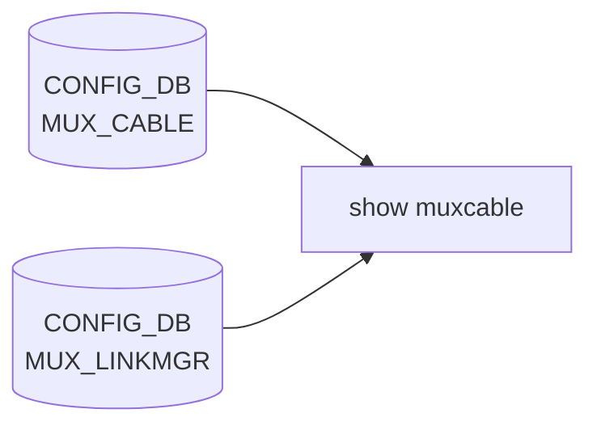

# show muxcable サブコマンド

## 概要

`show muxcable` は Dual-ToR Y-Cable の運用情報を確認する CLI で、`show/muxcable.py` の `@click.group(name='muxcable')` がエントリポイントとなる[^1]。`config muxcable` 同様、xcvrd / [linkmgrd](../../reference/glossary.md#term-linkmgrd) への async RPC (CMD/RSP テーブル) を多用するコマンドが多く、[CONFIG_DB](../../reference/glossary.md#term-config_db) / [STATE_DB](../../reference/glossary.md#term-state_db) の単純な dump ではない。

ほぼすべてのサブコマンドが `--json` で機械可読出力に切替できる。

## コマンド一覧 (主要)

| コマンド | 用途 |
|---------|------|
| `show muxcable status [<port>] [--json]` | mux 状態 (active/standby/auto/...) サマリ |
| `show muxcable config [<port>] [--json]` | [CONFIG_DB](../../reference/glossary.md#term-config_db) の [MUX](../../reference/glossary.md#term-mux) 設定一覧 |
| `show muxcable berinfo <port> <target> [--json]` | BER 情報 (lane 単位) |
| `show muxcable eyeinfo <port> <target> [--json]` | eye margin 情報 |
| `show muxcable fecstatistics <port> <target> [--json]` | FEC 統計 |
| `show muxcable pcsstatistics <port> <target> [--json]` | PCS 統計 |
| `show muxcable debugdumpregisters <port> [<option>] [--json]` | レジスタダンプ |
| `show muxcable alivecablestatus <port> [--json]` | cable alive 検知 |
| `show muxcable cableinfo <port>` | ベンダ / part / serial / FW 等 |
| `show muxcable hwmode muxdirection [<port>] [--json]` | HW 上の mux 方向 |
| `show muxcable hwmode switchmode [<port>]` | HW switchmode (auto / manual) |
| `show muxcable firmware version <port> [--active]` | FW version (両 bank or active のみ) |
| `show muxcable metrics <port> [--json]` | [linkmgrd](../../reference/glossary.md#term-linkmgrd) 由来のメトリクス |
| `show muxcable event_log <port> [--json]` | xcvrd の event log |
| `show muxcable get_fec_anlt_speed <port> [--json]` | 現在の FEC / ANLT / speed |
| `show muxcable packetloss <port> [--json]` | パケロス統計 |
| `show muxcable tunnel_route [<port>] [--json]` | tunnel 経路情報 |
| `show muxcable grpc muxdirection [<port>] [--json]` | gRPC キャッシュからの mux 方向 |
| `show muxcable queueinfo <port> [<option>] [--json]` | xcvrd 内部 queue 情報 |
| `show muxcable health <port> [--json]` | mux ヘルスチェック |
| `show muxcable resetcause <port> [--json]` | 直近 reset の原因 |
| `show muxcable operationtime <port> [--json]` | 累積運用時間 |

## 各コマンドの詳細 (抜粋)

### `show muxcable status [<port>] [--json]`

`MUX_CABLE` テーブルから対象ポートの `state` と [STATE_DB](../../reference/glossary.md#term-state_db) の `MUX_CABLE_TABLE|<port>` を統合表示する。`port` 省略で全ポート。`--json` 指定で JSON 出力。

### `show muxcable config [<port>] [--json]`

[CONFIG_DB](../../reference/glossary.md#term-config_db) の `MUX_CABLE` 設定 (server_ipv4 / server_ipv6 / soc_ipv4 / state) と `MUX_LINKMGR` の prober_type 等を統合表示する。Active-Active / Active-Standby のトポロジに応じて出力列が分岐する (`create_active_active_mux_direction_*` / `create_active_standby_mux_direction_*`)[^2]。

### `show muxcable berinfo|eyeinfo|fecstatistics|pcsstatistics <port> <target>`

`update_and_get_response_for_xcvr_cmd` 経由で xcvrd に RPC を送り、結果を `MUX_INFO` 等の RSP テーブルから読む。`<target>` は `NIC` / `TORA` / `TORB` / `LOCAL`。

### `show muxcable firmware version <port> [--active]`

xcvrd へ "firmware_version" RPC を発行し、`MUX_INFO|<port>` の応答エントリに含まれる `version_active_<bank>` / `version_inactive_<bank>` を表示する。`--active` 指定で active bank のみ。

### `show muxcable hwmode muxdirection [<port>]` / `switchmode [<port>]`

xcvrd 経由で Y-Cable の HW state を直接読む。CONFIG_DB の `MUX_CABLE.state` (`config muxcable mode` で書き換える論理状態) と一致しない場合があり、整合性検証用。

### `show muxcable grpc muxdirection [<port>]`

[gNMI](../../reference/glossary.md#term-gnmi) 経由で server (NIC) 側からキャッシュされた状態を読む経路。Active-Active トポロジで使う。

## 関連する CONFIG_DB / STATE_DB

| テーブル | 主なフィールド | 表示するコマンド |
|----------|---------------|------------------|
| `MUX_CABLE` (CONFIG_DB) | `state`, `server_ipv4`, `server_ipv6`, `soc_ipv4` | `status` / `config` |
| `MUX_LINKMGR` (CONFIG_DB) | `prober_type`, `address` | `config` |
| `MUX_CABLE_TABLE` ([STATE_DB](../../reference/glossary.md#term-state_db)) | xcvrd / [linkmgrd](../../reference/glossary.md#term-linkmgrd) 経由の動的状態 | ほぼ全コマンド |
| `MUX_INFO` 系 RSP テーブル | xcvrd RPC 応答 | `berinfo` / `eyeinfo` / `fecstatistics` / `firmware version` / 他 |

## 注意

- 多くのコマンドは **xcvrd / linkmgrd が応答しないと timeout で空表示になる**。実装は `cmd_timeout_secs` を 30 秒前後に設定している。
- `cableinfo` だけは tabulate なし。Y-Cable が要件を満たさず情報を返せないと "N/A" 行が並ぶ。
- `--json` 出力は `create_json_dump_per_port_*` ヘルパ群で生成される。port 名がキーになる辞書形式で、スキーマはコマンドごとに異なる。

<!-- ref-triangle:start -->

## 関連リファレンス

- CONFIG_DB: [`MUX_CABLE`](../config-db/mux-cable.md) / [`MUX_LINKMGR`](../config-db/mux-linkmgr.md)

<!-- ref-triangle:end -->

## 引用元

[^1]: `muxcable` グループ定義は `show/muxcable.py` L441-L443。<https://github.com/sonic-net/sonic-utilities/blob/39732bceb8bdefe706518ab40623bbbba6ff33b9/show/muxcable.py#L441>

[^2]: `config` サブコマンドの実装は `show/muxcable.py` L837-L970。Active-Active / Active-Standby の場合分けは `create_active_active_mux_direction_result` / `create_active_standby_mux_direction_result` (同 L1353-L1387)。

## 既知のバグ・制限

!!! warning "`show mux config` のカラムヘッダがズレる (issue [#3978](https://github.com/sonic-net/sonic-utilities/issues/3978))"
    `show mux config` の出力でヘッダ行（`port`, `state`, `ipv4`, `ipv6` 等）が本来の列位置から大きくズレて表示される。Ansible の `show_and_parse()` がこの出力を parse すると `port` カラムが空文字列となり、自動化スクリプトで `KeyError: ''` が発生する。PR#3884 で混入した問題（master で open）。回避策: `show mux config --json` で JSON 形式で取得する。

<!-- usage-example -->
## 実行例

### 典型的な使い方

```bash
# 例 1: mux 状態サマリ
show muxcable status
```

### よくある引数の組み合わせ

```bash
show muxcable config
show muxcable hwmode muxdirection
show muxcable firmware version Ethernet0
```

### 期待される出力 (抜粋)

```text
PORT         STATUS    HEALTH
-----------  --------  --------
Ethernet0    active    HEALTHY
Ethernet4    standby   HEALTHY
```
<!-- /usage-example -->

<!-- cli-mermaid -->
### データフロー (自動生成)



!!! note "凡例"
    show 系 (CONFIG_DB → CLI) のミニ図。テーブル → daemon 対応は `docs/reference/config-db-orch-map.md` から機械生成。
<!-- /cli-mermaid -->

<!-- topics-back-ref -->
## 関連 Topics

- [Topics: Dual-ToR と Mux 制御](../../topics/05-dual-tor/index.md)

<!-- /topics-back-ref -->

<!-- cli-sibling -->
### 関連 CLI コマンド

- [`config muxcable`](config-muxcable.md) — config muxcable サブコマンド
- [`config dhcp relay`](config-dhcp-relay.md) — config dhcp_relay / dhcpv4_relay サブコマンド
- [`config mgmt trio`](config-mgmt-trio.md) — config save / load / reload / replace / qos reload
- [`show mgmt-vrf`](show-mgmt-vrf.md) — show mgmt-vrf サブコマンド
- [`show running config`](show-running-config.md) — show runningconfiguration / startupconfiguration サブコマンド

<!-- /cli-sibling -->

<!-- glossary-links-injected: f050aad25177 -->
