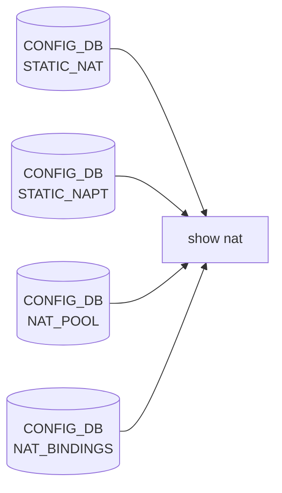

# show nat サブコマンド

## 概要

`show nat` は [SONiC](../../reference/glossary.md#term-sonic) の [NAT](../../reference/glossary.md#term-nat) 機能の **動的な変換テーブル** および **静的な設定** を表示する CLI で、`show/nat.py` の `@click.group()` がエントリポイントとなる[^1]。

実装は薄く、`natshow` / `natconfig` という C/Python の補助バイナリを `clicommon.run_command(...)` で呼び出すだけのラッパー。`natshow` は [ASIC_DB](../../reference/glossary.md#term-asic_db) / [COUNTERS_DB](../../reference/glossary.md#term-counters_db) を参照し、`natconfig` は [CONFIG_DB](../../reference/glossary.md#term-config_db) を整形して出すように分業されている。

## コマンド一覧

| コマンド | 用途 | 内部呼び出し |
|---------|------|-------------|
| `show nat statistics` | [NAT](../../reference/glossary.md#term-nat) 変換のカウンタ統計 | `natshow -s` |
| `show nat translations` | 現在の動的変換テーブル | `natshow -t` |
| `show nat translations count` | 変換エントリ数 | `natshow -c` |
| `show nat config` | 全体設定の一括表示 | `natconfig -g/-s/-p/-b/-z` を順に |
| `show nat config static` | static エントリのみ | `natconfig -s` |
| `show nat config pool` | pool 設定のみ | `natconfig -p` |
| `show nat config bindings` | binding 設定のみ | `natconfig -b` |
| `show nat config globalvalues` | グローバル設定のみ | `natconfig -g` |
| `show nat config zones` | [NAT](../../reference/glossary.md#term-nat) zone 設定のみ | `natconfig -z` |

各コマンドに `--verbose` オプションがあり、内部で実行する `sudo natshow ...` / `sudo natconfig ...` の起動コマンドラインを表示する。

## 各コマンドの詳細

### `show nat statistics`

`natshow -s` を起動。NAT 変換ごとの hit カウンタ・packet bytes 等を表で表示する。`STATE_DB` / `COUNTERS_DB` のカウンタを集計しているため、リアルタイムに更新される。

### `show nat translations [count]`

サブコマンド無しで実行 (`@nat.group(invoke_without_command=True)`) すると `natshow -t` が呼ばれ、現在 [ASIC](../../reference/glossary.md#term-asic) に入っている変換 (static + 動的に学習されたもの) を表示する。`count` サブコマンド付きでは件数のみ。

### `show nat config [<sub>]`

サブコマンド無しの実行ではグローバル → static → pool → bindings → zones の順で 5 ブロックを連続出力する。それぞれ `natconfig -g/-s/-p/-b/-z` の独立呼び出しに対応し、ブロック間に `click.echo` で見出しを差し込む。

サブコマンド付きでは指定 1 ブロックのみ。

## 関連する CONFIG_DB

| テーブル | キー | 表示するコマンド |
|----------|------|------------------|
| `STATIC_NAT` | `<global_ip>` | `show nat config static` |
| `STATIC_NAPT` | `<global_ip>\|TCP/UDP\|<port>` | `show nat config static` |
| `NAT_POOL` | `<pool_name>` | `show nat config pool` |
| `NAT_BINDINGS` | `<binding_name>` | `show nat config bindings` |
| `NAT_GLOBAL` | `Values` | `show nat config globalvalues` |
| `PORT` / `PORTCHANNEL` / `VLAN` / `LOOPBACK_INTERFACE` の `nat_zone` | `<if_name>` | `show nat config zones` |

## 注意

- `natshow` `natconfig` の出力フォーマットは固定列。スクリプトから JSON で扱いたい場合は `--json` 等の互換オプションは無いので、現状はラフな text 出力のパース、または [STATE_DB](../../reference/glossary.md#term-state_db) / [CONFIG_DB](../../reference/glossary.md#term-config_db) を直接読むしかない。
- `show nat translations` は **NAT が実際にハード offload されている前提**。`config nat feature disable` 状態では空表示になる。

<!-- ref-triangle:start -->

## 関連リファレンス

- [CONFIG_DB](../../reference/glossary.md#term-config_db): `STATIC_NAT` / `STATIC_NAPT` / [`NAT_POOL`](../config-db/nat.md) / [`NAT_BINDINGS`](../config-db/nat.md) / [`NAT_GLOBAL`](../config-db/nat.md)

<!-- ref-triangle:end -->

## 引用元

[^1]: `nat` グループは `show/nat.py` L9-L12。`config/nat.py` 側は CONFIG_DB を書き、`show/nat.py` は別 binary 経由で読むという分担。<https://github.com/sonic-net/sonic-utilities/blob/39732bceb8bdefe706518ab40623bbbba6ff33b9/show/nat.py#L9>

<!-- usage-example -->
## 実行例

### 典型的な使い方

```bash
# 例 1: 現在の NAT translations
show nat translations
```

### よくある引数の組み合わせ

```bash
show nat statistics
show nat config static
show nat config bindings
```

### 期待される出力 (抜粋)

```text
Static NAT Entries  ............ 1
Dynamic NAT Entries ............ 0
Total NAT Entries   ............ 1

Protocol  Source       Destination   Translated Source  Translated Destination
--------  -----------  ------------  -----------------  -----------------------
all       10.0.0.1     ---           192.168.1.1        ---
```
<!-- /usage-example -->

<!-- cli-mermaid -->
### データフロー (自動生成)



!!! note "凡例"
    show 系 (CONFIG_DB → CLI) のミニ図。テーブル → daemon 対応は `docs/reference/config-db-orch-map.md` から機械生成。
<!-- /cli-mermaid -->

<!-- topics-back-ref -->
## 関連 Topics

- [Topics: NAT / DHCP Relay / Time-DNS Services](../../topics/16-nat-dhcp-dns/index.md)

<!-- /topics-back-ref -->

<!-- ops-hint -->
## 運用ヒント

### 典型的な利用シーン

- NAT translation / statistics / zone 設定の確認。
- セッションテーブル枯渇の傾向監視。

### よくある落とし穴

- `show nat translations` は [ASIC](../../reference/glossary.md#term-asic) 上限を超えた分は表示されない。
- `show nat statistics` は永続値ではなく、container 再起動でリセット。

### 関連する show / debug

```bash
show nat translations
show nat statistics
show nat config
```
<!-- /ops-hint -->

<!-- glossary-links-injected: 1288c04b3f8a -->
