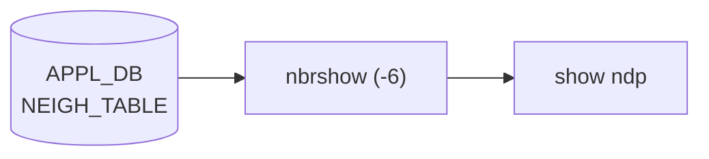

# show ndp サブコマンド

## 概要

`show ndp` は IPv6 の **Neighbor Discovery テーブル**を表示する click コマンド。`show arp` と対称な実装で、内部では `scripts/nbrshow` を `-6` 付きで起動する[^1]。

## シグネチャ

```bash
show ndp [<ip6address>] [-if <iface>] [-n <namespace>] [-d <display>] [--verbose]
```

| オプション | 意味 |
|---|---|
| `<ip6address>` (positional, optional) | 絞り込む IPv6 アドレス |
| `-if`, `--iface` | インタフェース名フィルタ |
| `-n`, `--namespace` | multi-[ASIC](../../reference/glossary.md#term-asic) 時の namespace |
| `-d`, `--display` | 表示スコープ (`all` / `frontend` など) |
| `--verbose` | 起動コマンド文字列を echo |

## 起動コマンド

```python
cmd = ['nbrshow', '-6']
if ip6address: cmd += ['-ip', str(ip6address)]
if iface:      cmd += ['-if', str(iface)]
if namespace:  cmd += ['-n', str(namespace)]
cmd += ['-d', str(display)]
```

注意: `show arp` 側は `alias` モード時に `iface_alias_converter.alias_to_name()` でインタフェース名を変換するロジックがあるが、**`show ndp` 側にはそれが無い**。`alias` モード環境で `-if` を使う場合、内部名（例: `Ethernet0`）を直接指定する必要がある。

## 別名と関連

`show ipv6` グループにも `add_command(ndp)` されており、`show ipv6 neighbors` 系のサブコマンド経由でも近い情報が引ける。

クリア側は `sonic-clear ndp [<ipaddress>] [-n <ns>]`。詳細は [clear (sonic-clear) コマンド](clear.md) を参照。

## CONFIG_DB との接点

[NDP](../../reference/glossary.md#term-ndp) テーブルは **kernel の IPv6 neighbor table** および swss/[neighsyncd](../../reference/glossary.md#term-neighsyncd) で [APPL_DB](../../reference/glossary.md#term-appl_db) に同期されるもので、[CONFIG_DB](../../reference/glossary.md#term-config_db) を読まない。

<!-- cli-mermaid -->
### データフロー (自動生成)



!!! note "凡例"
    show 系 (データソース → ラッパスクリプト → CLI) のミニ図。CONFIG_DB は経由しない。
<!-- /cli-mermaid -->

<!-- ref-triangle:start -->

## 関連リファレンス

- (関連リンクなし)

<!-- ref-triangle:end -->

## 引用元

[^1]: `ndp` の click 定義と `nbrshow -6` 起動は `show/main.py` L452-L472。<https://github.com/sonic-net/sonic-utilities/blob/39732bceb8bdefe706518ab40623bbbba6ff33b9/show/main.py#L452>

<!-- ops-hint -->
## 運用ヒント

### 典型的な利用シーン

- IPv6 隣接の NS/NA 状態確認、SLAAC 動作検証。

### よくある落とし穴

- Link-local アドレスは scope 付き表示。`fe80::xxx%Ethernet0` の `%` 以降は interface scope。
- Duplicate Address Detection (DAD) 失敗時は state が `FAILED` で kernel に残る。

### 関連する show / debug

```bash
show ndp
ip -6 neigh show
sonic-db-cli APPL_DB keys 'NEIGH_TABLE:*'
```
<!-- /ops-hint -->

<!-- cli-sibling -->
### 関連 CLI コマンド

- [`config bgp`](config-bgp.md) — config bgp サブコマンド
- [`config default route`](config-default-route.md) — config default-route（デフォルトルート設定パターン）
- [`config route`](config-route.md) — config route サブコマンド（static route）
- [`config vrf`](config-vrf.md) — config vrf サブコマンド
- [`show arp`](show-arp.md) — show arp サブコマンド

<!-- /cli-sibling -->

<!-- glossary-links-injected: c006405759d8 -->
