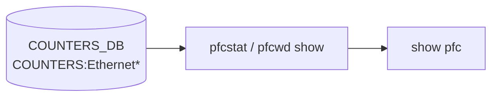

# show pfc サブコマンド

## 概要

`show pfc` は [PFC](../../reference/glossary.md#term-pfc) counter と [PFC](../../reference/glossary.md#term-pfc) priority mapping を表示する CLI グループ。`show pfcwd` は同じ領域の watchdog 表示 wrapper で、`pfcwd show ...` に委譲する[^1]。

## コマンド一覧

| コマンド | 用途 |
|---------|------|
| `show pfc counters [-d all\|frontend] [-n NS] [--history]` | [PFC](../../reference/glossary.md#term-pfc) counters を表示 |
| `show pfc priority [INTERFACE] [-n NS]` | PFC priority 設定を表示 |
| `show pfc asymmetric [INTERFACE] [-n NS]` | asymmetric PFC 設定を表示 |
| `show pfcwd config [-d all\|frontend] [-n NS]` | PFC watchdog config を表示 |
| `show pfcwd stats [-d all\|frontend] [-n NS]` | PFC watchdog stats を表示 |

## 詳細

`show pfc` 配下の command は `pfcstat` / `pfc` 系 utility を実行する wrapper として定義される。interface alias mode の場合は必要に応じて alias を [SONiC](../../reference/glossary.md#term-sonic) port 名へ変換してから外部コマンドへ渡す。

`show pfcwd config` は `pfcwd show config -d <display>`、`show pfcwd stats` は `pfcwd show stats -d <display>` を実行する[^2]。`-d` / `--display` は multi-[ASIC](../../reference/glossary.md#term-asic) 共通 option で、値は `click.Choice` で制約される (典型的には `all` / `frontend`)。boolean ではなく、single-[ASIC](../../reference/glossary.md#term-asic) ではデフォルト `all`、multi-[ASIC](../../reference/glossary.md#term-asic) / chassis では `frontend` がデフォルト[^3]。`-n` / `--namespace` は対象 ASIC namespace を絞るための同共通 option[^3]。

## 注意

- `config interface pfc ...` は設定系で、`show pfc` は表示系。
- PFC watchdog の永続化や counter の詳細は `pfcwd` 実装側に依存する。

<!-- ref-triangle:start -->

## 関連リファレンス

- (関連リンクなし)

<!-- ref-triangle:end -->

## 引用元

[^1]: `show pfc` グループ定義。<https://github.com/sonic-net/sonic-utilities/blob/39732bceb8bdefe706518ab40623bbbba6ff33b9/show/main.py#L670>

[^2]: `show pfcwd` の `config` / `stats` wrapper (`pfcwd show ... -d <display>` に委譲)。<https://github.com/sonic-net/sonic-utilities/blob/39732bceb8bdefe706518ab40623bbbba6ff33b9/show/main.py#L728-L750>

[^3]: multi-ASIC 共通 `--display` / `--namespace` option 定義 (`type=click.Choice(...)`, default は single-ASIC で `DISPLAY_ALL`、multi-ASIC / chassis で `DISPLAY_EXTERNAL`)。<https://github.com/sonic-net/sonic-utilities/blob/39732bceb8bdefe706518ab40623bbbba6ff33b9/utilities_common/multi_asic.py#L111-L133>

<!-- usage-example -->
## 実行例

### 典型的な使い方

```bash
# 例 1: PFC 状態と統計
show pfc counters
```

### よくある引数の組み合わせ

```bash
show pfc priority
show pfc asymmetric
```

### 期待される出力 (抜粋)

```text
       Port    PFC0    PFC1    PFC2    PFC3    PFC4    PFC5    PFC6    PFC7
-----------  ------  ------  ------  ------  ------  ------  ------  ------
  Ethernet0       0       0       0    1234       0       0       0       0
```
<!-- /usage-example -->

<!-- cli-mermaid -->
### データフロー (自動生成)



!!! note "凡例"
    show 系 (データソース → ラッパスクリプト → CLI) のミニ図。CONFIG_DB は経由しない。
<!-- /cli-mermaid -->

<!-- topics-back-ref -->
## 関連 Topics

- [Topics: QoS / Buffer / PFC / Watermark](../../topics/08-qos-buffer/index.md)

<!-- /topics-back-ref -->

<!-- ops-hint -->
## 運用ヒント

### 典型的な利用シーン

- PFC counters / asymmetric PFC 状態の確認。
- 輻輳発生時の priority 別 PAUSE フレーム数監視。

### よくある落とし穴

- PFC を有効にしていないキューにも counter は出るが、値はゼロのまま誤解される。
- asymmetric PFC は機種依存。`show pfc asymmetric` で対応有無を確認。

### 関連する show / debug

```bash
show pfc counters
show pfc priority
show pfcwd stats
```
<!-- /ops-hint -->

<!-- cli-sibling -->
### 関連 CLI コマンド

- [`config buffer`](config-buffer.md) — config buffer サブコマンド
- [`config pfcwd`](config-pfcwd.md) — config pfcwd サブコマンド
- [`config qos`](config-qos.md) — config qos サブコマンド
- [`show buffer`](show-buffer.md) — show buffer サブコマンド
- [`show buffer pool`](show-buffer-pool.md) — show buffer_pool / headroom-pool サブコマンド

<!-- /cli-sibling -->

<!-- glossary-links-injected: e82be350a384 -->
