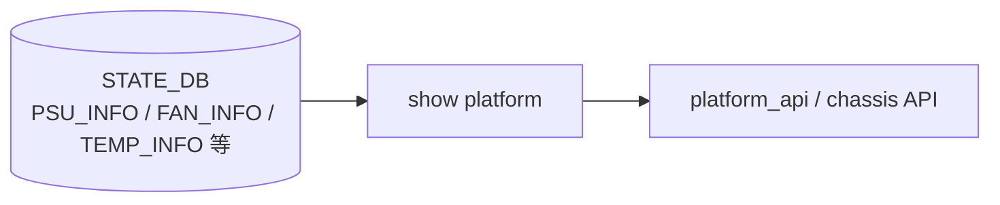

# show platform サブコマンド

## 概要

`show platform` はハードウェアプラットフォーム関連の状態（HwSKU・PSU・FAN・温度・電圧・SSD・PCIe・syseeprom・firmware・BMC・leakage）を表示する[^1]。**ほとんどのコマンドが `psushow` / `fanshow` / `tempershow` / `sensorshow` / `pcieutil` / `decode-syseeprom` / `ssdutil` / `fwutil` / `leakageshow` などの外部コマンドラッパ**で、[CONFIG_DB](../../reference/glossary.md#term-config_db) は読まない。`sonic-platform` API から取得するのは `summary` と `bmc` 系のみ。

## コマンド一覧

| コマンド | 用途 |
|---------|------|
| `show platform summary [--json]` | Platform / HwSKU / ASIC / Serial / Model 等を表示 |
| `show platform syseeprom [--verbose]` | TLVinfo 系 syseeprom を `decode-syseeprom -d` で表示 |
| `show platform psustatus [-i N] [--json]` | PSU の状態（`psushow -s`） |
| `show platform ssdhealth [<device>] [--verbose] [--vendor]` | SSD ヘルス（`ssdutil`） |
| `show platform pcieinfo [-c|--check] [--verbose]` | PCIe デバイス検査（`pcieutil show/check`） |
| `show platform fan` | ファン速度（`fanshow`） |
| `show platform temperature [-j|--json]` | センサ温度（`tempershow [-j]`） |
| `show platform voltage` | 電圧センサ（`sensorshow -t voltage`） |
| `show platform current` | 電流センサ（`sensorshow -t current`） |
| `show platform firmware [<args...>]` | `fwutil show` ラッパ（任意引数を pass-through） |
| `show platform bmc summary [--json]` | sonic_platform API 経由の BMC サマリ |
| `show platform bmc eeprom [--json]` | BMC EEPROM ダンプ |
| `show platform leakage status` | 液冷漏洩検出（`leakageshow`） |

## 各コマンドの詳細

### `show platform summary [--json]`

**動作**:

- `device_info.get_platform_info()` で Platform / HwSKU / ASIC / ASIC Count / Switch Type を取得
- `get_chassis_info()` で Serial / Model / Hardware Revision を取得
- `--json` 指定時は両者をマージして JSON 出力

[CONFIG_DB](../../reference/glossary.md#term-config_db) は触らず、`/host/machine.conf` 由来の environment variables や `device_info` で参照される `platform.json` / `hwsku.json` を経由する。

### `show platform syseeprom`

**動作**:
`sudo decode-syseeprom -d` を実行して、ONIE の TLV フォーマット syseeprom を表示する。

### `show platform psustatus [-i <index>] [--json]`

**動作**:
`psushow -s [-i <index>] [-j]` を実行。pmon コンテナの psud daemon が [STATE_DB](../../reference/glossary.md#term-state_db) に書き込んだ `PSU_INFO|PSU<N>` を整形表示する（実際のクエリは psushow 側）。

### `show platform ssdhealth [<device>] [--verbose] [--vendor]`

**動作**:
`<device>` 省略時は `platform.json` の `chassis.disk.device` を使う。さらに省略されていれば `ssdutil` をデフォルトで起動（`/host` パーティション含むデバイスを対象）。`--vendor` は ssdutil の `-e` オプションを付ける。

### `show platform pcieinfo [-c|--check]`

**動作**:
`-c` 無しは `sudo pcieutil show`（プラットフォームの `pcie.yaml` をそのまま表示）、`-c` 付きは `sudo pcieutil check`（実機 `lspci` と `pcie.yaml` を突き合わせ、差分を Status 列に出す）。

### `show platform fan` / `temperature` / `voltage` / `current`

それぞれ `fanshow` / `tempershow [-j]` / `sensorshow -t voltage|current` のラッパ。`temperature -j` 時は内部で JSON をパースし直して `clicommon.json_dump` で再整形する。

### `show platform firmware [<args>]`

**動作**:
`sudo fwutil show <args>` を **追加引数そのまま pass-through** で実行する click context (`ignore_unknown_options=True, allow_extra_args=True, add_help_option=False`)。fwutil 側の `--image` 等のオプションをそのまま使える。

### `show platform bmc summary` / `bmc eeprom`

**動作**:
`sonic_platform.platform.Platform().get_chassis().get_bmc()` を取得し、`bmc.get_eeprom()` 結果と `bmc.get_version()` を表示。プラットフォーム実装が BMC をサポートしていなければ "BMC is not available on this platform" を出す。

### `show platform leakage status`

**動作**:
`leakageshow` コマンドを起動。`leakageshow` は [STATE_DB](../../reference/glossary.md#term-state_db) の `LIQUID_COOLING_LEAKAGE` 系テーブルを読み出して整形表示するユーティリティ。液冷モデル限定。

## 関連する STATE_DB / 一次情報

| 項目 | 経路 | 表示するコマンド |
|------|------|------------------|
| HwSKU / ASIC | `platform.json`, `hwsku.json` | `summary` |
| Chassis Serial / Model | `decode-syseeprom` 出力 | `summary`, `syseeprom` |
| PSU 状態 | [STATE_DB](../../reference/glossary.md#term-state_db) `PSU_INFO` (psud) | `psustatus` |
| Fan / Temp / Voltage / Current | STATE_DB `FAN_INFO`/`TEMPERATURE_INFO`/`*_INFO` (thermalctld + psud) | `fan` / `temperature` / `voltage` / `current` |
| SSD | `ssdutil` (smart-tools 直接実行) | `ssdhealth` |
| PCIe | `pcie.yaml` + `lspci` | `pcieinfo` |
| Firmware | `fwutil` (DAEMON / BIOS / CPLD) | `firmware` |
| BMC | `sonic_platform` API | `bmc summary` / `bmc eeprom` |
| Leakage | `leakageshow` (`LIQUID_COOLING_LEAKAGE` STATE_DB) | `leakage status` |

<!-- ref-triangle:start -->

## 関連リファレンス

- (関連リンクなし)

<!-- ref-triangle:end -->

## 引用元

[^1]: `platform` グループ全体は `show/platform.py` で定義。`show/main.py` L321 で `cli.add_command(platform.platform)` 登録。<https://github.com/sonic-net/sonic-utilities/blob/39732bceb8bdefe706518ab40623bbbba6ff33b9/show/platform.py>

<!-- usage-example -->
## 実行例

### 典型的な使い方

```bash
# 例 1: プラットフォーム概要
show platform summary
```

### よくある引数の組み合わせ

```bash
show platform syseeprom
show platform psustatus
show platform fan
show platform temperature
show platform ssdhealth
```

### 期待される出力 (抜粋)

```yaml
Platform: x86_64-cel_seastone-r0
HwSKU: Celestica-DX010-C32
ASIC: broadcom
```
<!-- /usage-example -->

<!-- cli-mermaid -->
### データフロー (手動作成)



!!! note "凡例"
    show 系 (CLI ← platform_api / STATE_DB) のミニ図。CONFIG_DB を直接介さないコマンドのため手動で記述。
<!-- /cli-mermaid -->

<!-- topics-back-ref -->
## 関連 Topics

- [Topics: Platform / Port / Optics / PHY](../../topics/14-platform-port-optics/index.md)

<!-- /topics-back-ref -->

<!-- cli-sibling -->
### 関連 CLI コマンド

- [`config platform firmware`](config-platform-firmware.md) — config platform firmware サブコマンド
- [`config banner`](config-banner.md) — config banner サブコマンド
- [`config clock`](config-clock.md) — config clock サブコマンド
- [`config kdump`](config-kdump.md) — config kdump サブコマンド
- [`config ntp`](config-ntp.md) — config ntp サブコマンド

<!-- /cli-sibling -->

<!-- glossary-links-injected: a13f05370620 -->
