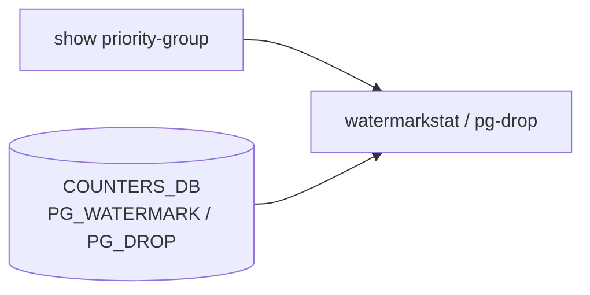

# show priority-group サブコマンド

## 概要

`show priority-group` は priority group (PG) の watermark と drop counter を表示する CLI グループ。watermark は `watermarkstat`、drop counter は `pg-drop` へ委譲される[^1]。

## コマンド一覧

| コマンド | 用途 |
|---------|------|
| `show priority-group watermark headroom [options]` | user headroom watermark を表示 |
| `show priority-group watermark shared [options]` | user shared watermark を表示 |
| `show priority-group persistent-watermark headroom [options]` | persistent headroom watermark を表示 |
| `show priority-group persistent-watermark shared [options]` | persistent shared watermark を表示 |
| `show priority-group drop counters [--namespace <ns>]` | PG drop counter を表示 |

## watermark

**用法**:

```bash
show priority-group watermark headroom [--namespace <ns>|all] [--json]
show priority-group watermark shared [--namespace <ns>|all] [--json]
```

実行コマンドはそれぞれ `watermarkstat -t pg_headroom` と `watermarkstat -t pg_shared`。`--json` は `-j`、`--namespace` は `-n` に変換される。

## persistent-watermark

`persistent-watermark` は `watermarkstat -p` を追加する点だけが通常 watermark と異なる。

## drop counters

`show priority-group drop counters` は `pg-drop -c show` を実行する。namespace 指定時は `-n <namespace>` を追加する。

<!-- ref-triangle:start -->

## 関連リファレンス

- CLI: [show buffer](show-buffer.md) / [show buffer-pool](show-buffer-pool.md) / [show queue](show-queue.md)
- [CONFIG_DB](../../reference/glossary.md#term-config_db): [BUFFER_PG](../config-db/buffer-pg.md) / [BUFFER_POOL](../config-db/buffer-pool.md) / [PFC_PRIORITY_TO_PRIORITY_GROUP_MAP](../config-db/pfc-priority-to-priority-group-map.md)
- [YANG](../../reference/glossary.md#term-yang): [sonic-buffer-pg](../yang/sonic-buffer-pg.md) / [sonic-buffer-pool](../yang/sonic-buffer-pool.md)
- Topic: [QoS / Buffer](../../topics/08-qos-buffer/index.md)

<!-- ref-triangle:end -->

## 引用元

[^1]: `show priority-group` グループと配下 command。<https://github.com/sonic-net/sonic-utilities/blob/39732bceb8bdefe706518ab40623bbbba6ff33b9/show/main.py#L1003>

<!-- cli-mermaid -->
### データフロー (手動作成)



!!! note "凡例"
    show 系 (CLI → watermarkstat ← COUNTERS_DB) のミニ図。CONFIG_DB を直接介さないコマンドのため手動で記述。
<!-- /cli-mermaid -->

<!-- topics-back-ref -->
## 関連 Topics

- [Topics: QoS / Buffer / PFC / Watermark](../../topics/08-qos-buffer/index.md)

<!-- /topics-back-ref -->

<!-- ops-hint -->
## 運用ヒント

### 典型的な利用シーン

- headroom watermark を見て lossless 設定の余裕を判定する。
- PG 別 shared / headroom 使用量の傾向監視。

### よくある落とし穴

- persistent-watermark は手動 clear するまでリセットされない。
- PG が profile 紐付けされていないと watermark は 0 のまま。
- **`sonic-clear priority-group drop counters` に root 権限が必要な問題** (issue [#4144](https://github.com/sonic-net/sonic-utilities/issues/4144)): `show priority-group drop counters` は admin 権限で動作するが、`sonic-clear priority-group drop counters` は root 権限を要求する。PG drop counter のキャッシュは UID 単位で管理されるため、root で clear しても admin ユーザの表示に反映されない。回避策: `pg-drop -c clear` コマンドを使うと root 権限なしで clear できる（`show priority-group drop counters` の表示に正しく反映される）。

### 関連する show / debug

```bash
show priority-group watermark headroom
show priority-group persistent-watermark headroom
show buffer profile
```
<!-- /ops-hint -->

<!-- cli-sibling -->
### 関連 CLI コマンド

- [`config buffer`](config-buffer.md) — config buffer サブコマンド
- [`config pfcwd`](config-pfcwd.md) — config pfcwd サブコマンド
- [`config qos`](config-qos.md) — config qos サブコマンド
- [`show buffer`](show-buffer.md) — show buffer サブコマンド
- [`show buffer pool`](show-buffer-pool.md) — show buffer_pool / headroom-pool サブコマンド

<!-- /cli-sibling -->

<!-- glossary-links-injected: 9dae6d74c08e -->
