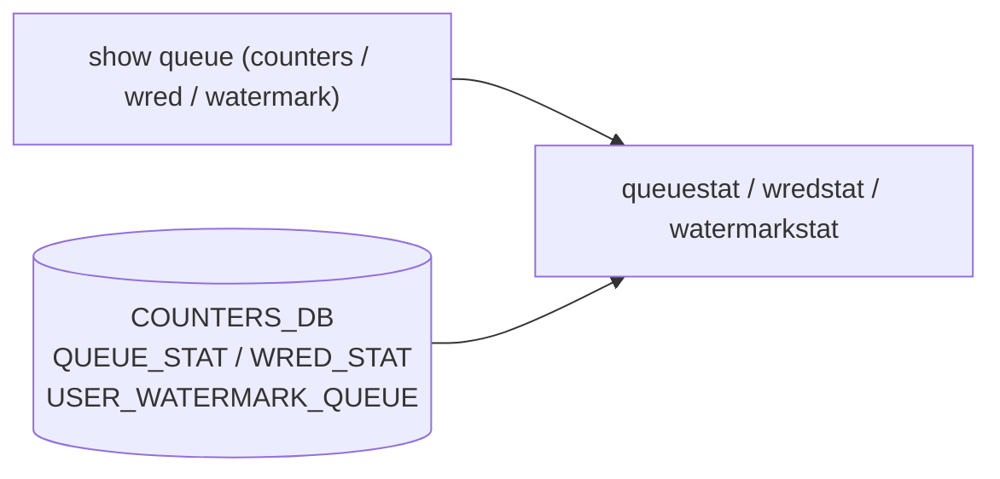

# show queue サブコマンド

## 概要

`show queue` は queue counter、[WRED](../../reference/glossary.md#term-wred) counter、queue watermark を表示する CLI グループ。counter は `queuestat` / `wredstat`、watermark は `watermarkstat` へ委譲する[^1]。

## コマンド一覧

| コマンド | 用途 |
|---------|------|
| `show queue counters [INTERFACE_NAME] [options]` | queue counters を表示 |
| `show queue wredcounters [INTERFACE_NAME] [options]` | [WRED](../../reference/glossary.md#term-wred) counters を表示 |
| `show queue watermark unicast [options]` | unicast queue user watermark |
| `show queue watermark multicast [options]` | multicast queue user watermark |
| `show queue watermark all [options]` | 全 queue user watermark |
| `show queue persistent-watermark unicast [options]` | unicast queue persistent watermark |
| `show queue persistent-watermark multicast [options]` | multicast queue persistent watermark |
| `show queue persistent-watermark all [options]` | 全 queue persistent watermark |

## counters

**用法**:

```bash
show queue counters [INTERFACE_NAME]
    [--namespace <ns>] [--all] [--trim] [--voq]
    [--nonzero] [--json] [--verbose]
```

実行コマンドは `queuestat`。interface 指定時は `-p <port>`、namespace は `-n`、`--all` は `-a`、`--trim` は `-T`、`--voq` は `-V`、`--nonzero` は `-nz`、`--json` は `-j` に変換される。

## wredcounters

**用法**:

```bash
show queue wredcounters [INTERFACE_NAME]
    [--namespace <ns>] [--json] [--voq]
    [--nonzero] [--summary] [--verbose]
```

実行コマンドは `wredstat`。`--summary` は `-s`、その他は counters と同じ変換。

## watermark

`watermark` は `watermarkstat -t q_shared_uni|q_shared_multi|q_shared_all` を実行する。`persistent-watermark` はさらに `-p` を追加する。各 command は `--namespace` と `--json` を受け付ける。

<!-- ref-triangle:start -->

## 関連リファレンス

- CLI: [show priority-group](show-priority-group.md) / [show buffer](show-buffer.md) / [show buffer pool](show-buffer-pool.md)
- [CONFIG_DB](../../reference/glossary.md#term-config_db): [BUFFER_QUEUE](../config-db/buffer-queue.md) / [BUFFER_POOL](../config-db/buffer-pool.md)
- [YANG](../../reference/glossary.md#term-yang): [sonic-queue](../yang/sonic-queue.md) / [sonic-buffer-queue](../yang/sonic-buffer-queue.md)
- Topic: [QoS / Buffer](../../topics/08-qos-buffer/index.md)

<!-- ref-triangle:end -->

## 引用元

[^1]: `show queue` グループと配下 command。<https://github.com/sonic-net/sonic-utilities/blob/39732bceb8bdefe706518ab40623bbbba6ff33b9/show/main.py#L774>

<!-- usage-example -->
## 実行例

### 典型的な使い方

```bash
# 例 1: ポート毎のキュー統計
show queue counters
```

### よくある引数の組み合わせ

```bash
show queue counters Ethernet0
show queue watermark unicast
show queue persistent-watermark multicast
```

### 期待される出力 (抜粋)

```text
       Port    TxQ    Counter/pkts    Counter/bytes    Drop/pkts    Drop/bytes
-----------  -----  --------------  ---------------  -----------  ------------
  Ethernet0   UC0          123,456       12,345,678            0             0
  Ethernet0   UC1            5,432        4,321,234            0             0
```
<!-- /usage-example -->

<!-- cli-mermaid -->
### データフロー (手動作成)



!!! note "凡例"
    show 系 (CLI → *stat ← COUNTERS_DB) のミニ図。CONFIG_DB を直接介さないコマンドのため手動で記述。
<!-- /cli-mermaid -->

<!-- topics-back-ref -->
## 関連 Topics

- [Topics: QoS / Buffer / PFC / Watermark](../../topics/08-qos-buffer/index.md)

<!-- /topics-back-ref -->

<!-- ops-hint -->
## 運用ヒント

### 典型的な利用シーン

- ポート別 queue 占有・dropped packets の確認。
- [WRED](../../reference/glossary.md#term-wred) / [ECN](../../reference/glossary.md#term-ecn) マークの効果検証。

### よくある落とし穴

- counter は累積。`sonic-clear queuecounters` でリセットして観測する。
- voq / fabric queue は通常の queue counter とは別系統で表示される。

### 関連する show / debug

```bash
show queue counters
show queue watermark unicast
show queue persistent-watermark unicast
show queue persistent-watermark multicast
show queue persistent-watermark all
```
<!-- /ops-hint -->

<!-- cli-sibling -->
### 関連 CLI コマンド

- [`config buffer`](config-buffer.md) — config buffer サブコマンド
- [`config pfcwd`](config-pfcwd.md) — config pfcwd サブコマンド
- [`config qos`](config-qos.md) — config qos サブコマンド
- [`show buffer`](show-buffer.md) — show buffer サブコマンド
- [`show buffer pool`](show-buffer-pool.md) — show buffer_pool / headroom-pool サブコマンド

<!-- /cli-sibling -->

<!-- glossary-links-injected: d17c6a828148 -->
