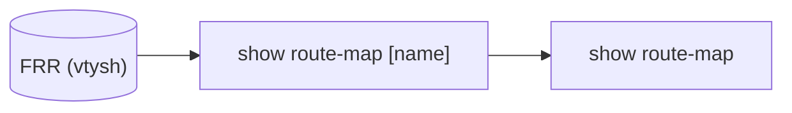

# show route-map コマンド

## 概要

`show route-map` は [FRR](../../reference/glossary.md#term-frr) の `route-map` 設定（policy / match / set 句）をそのまま表示するコマンドで、[CONFIG_DB](../../reference/glossary.md#term-config_db) は読まず **`vtysh -c "show route-map [<name>]"` を `sudo` で実行する単純なラッパ**である[^1]。[SONiC](../../reference/glossary.md#term-sonic) では route-map は `bgpcfgd` が [CONFIG_DB](../../reference/glossary.md#term-config_db) の `ROUTE_MAP` テーブル等から [FRR](../../reference/glossary.md#term-frr) config を生成しており、CLI で見えるのは生成後の [vtysh](../../reference/glossary.md#term-vtysh) 側の状態。

## 用法

```bash
show route-map [<route_map_name>] [--verbose]
```

## 引数 / オプション

| 名前 | 必須 | 値 | 動作 |
|------|------|----|------|
| `<route_map_name>` | optional | route-map 名 | 指定時は当該 route-map のみ。省略で全件 |
| `--verbose` | optional | flag | 内部実行コマンドを stdout にエコーする（`run_command` の `display_cmd`） |

## 動作

```python
cmd = ['sudo', constants.RVTYSH_COMMAND, '-c', 'show route-map']
if route_map_name is not None:
    cmd[-1] += ' {}'.format(route_map_name)
run_command(cmd, display_cmd=verbose)
```

`constants.RVTYSH_COMMAND` は `rvtysh`（multi-[ASIC](../../reference/glossary.md#term-asic) では `rvtysh -n <ns>` 用ラッパ）または `vtysh`。最終的に bgp コンテナ内の `vtysh` に `show route-map [<name>]` 文字列をそのまま渡す。

<!-- evidence:
source: sonic-net/sonic-utilities/show/main.py#L1266-L1274 (sha: 39732bceb8bdefe706518ab40623bbbba6ff33b9)
excerpt: |
  @cli.command('route-map')
  def route_map(route_map_name, verbose):
      cmd = ['sudo', constants.RVTYSH_COMMAND, '-c', 'show route-map']
      if route_map_name is not None:
          cmd[-1] += ' {}'.format(route_map_name)
      run_command(cmd, display_cmd=verbose)
-->

<!-- evidence-rendered:start -->
??? note "📋 検証エビデンス: sonic-net/sonic-utilities/show/main.py#L1266-L1274 (sha: 39732bceb8bdefe706518ab40623bbbba6ff33b9)"

    **出典**:

    `sonic-net/sonic-utilities/show/main.py#L1266-L1274 (sha: 39732bceb8bdefe706518ab40623bbbba6ff33b9)`

    **抜粋**:

    ```text
    @cli.command('route-map')
    def route_map(route_map_name, verbose):
        cmd = ['sudo', constants.RVTYSH_COMMAND, '-c', 'show route-map']
        if route_map_name is not None:
            cmd[-1] += ' {}'.format(route_map_name)
        run_command(cmd, display_cmd=verbose)
    ```

<!-- evidence-rendered:end -->

## 出力

[FRR](../../reference/glossary.md#term-frr) の `show route-map` 出力をそのまま表示する。フィールド整形・JSON 化は [SONiC](../../reference/glossary.md#term-sonic) 側では行わない。出力形式は FRR のバージョンに従う。

## 関連 CONFIG_DB

`show route-map` 自体は [CONFIG_DB](../../reference/glossary.md#term-config_db) を参照しない。[SONiC](../../reference/glossary.md#term-sonic) で route-map を定義するには `ROUTE_MAP` / `ROUTE_MAP_SET` などのテーブルか、または FRR config を直接書く方法のみで、`config route-map` 系の CLI は **コミュニティ版 master には存在しない**（`config/main.py` 上では `route-map` グループは未定義）。

<!-- cli-mermaid -->
### データフロー (自動生成)



!!! note "凡例"
    show 系 (データソース → ラッパスクリプト → CLI) のミニ図。CONFIG_DB は経由しない。
<!-- /cli-mermaid -->

<!-- ref-triangle:start -->

## 関連リファレンス

- (関連リンクなし)

<!-- ref-triangle:end -->

## 引用元

[^1]: `show/main.py` L1266-L1274。<https://github.com/sonic-net/sonic-utilities/blob/39732bceb8bdefe706518ab40623bbbba6ff33b9/show/main.py#L1266>

<!-- cli-sibling -->
### 関連 CLI コマンド

- [`config default route`](config-default-route.md) — config default-route（デフォルトルート設定パターン）
- [`config route`](config-route.md) — config route サブコマンド（static route）
- [`config bgp`](config-bgp.md) — config bgp サブコマンド
- [`config vrf`](config-vrf.md) — config vrf サブコマンド
- [`show arp`](show-arp.md) — show arp サブコマンド

<!-- /cli-sibling -->

<!-- glossary-links-injected: d02528e104f2 -->
