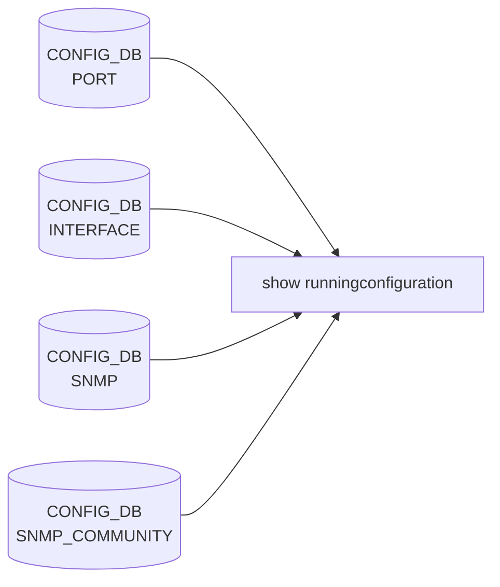

# show runningconfiguration / startupconfiguration サブコマンド

## 概要

[SONiC](../../reference/glossary.md#term-sonic) で「現在の running config」を見るには CLI が **`show runningconfiguration`**（`show running-config` のエイリアスではない、空白なしの単一トークン）。本ページは同グループ配下のサブコマンドを網羅する。実装は `show/main.py` 内の `runningconfiguration` group[^1]。多くのサブコマンドは `sonic-cfggen -d --var-json <TABLE>` の薄いラッパで、[CONFIG_DB](../../reference/glossary.md#term-config_db) から JSON を取り出して表示する。`startupconfiguration bgp` も合わせて扱う。

## コマンド一覧

### `show runningconfiguration ...`

| コマンド | 用途 | 実装 |
|---------|------|-----|
| `show runningconfiguration all` | host + 各 namespace の [CONFIG_DB](../../reference/glossary.md#term-config_db) JSON ダンプ + bgpraw | `get_config_json_by_namespace` + `vtysh -c "show running-config"` |
| `show runningconfiguration acl` | ACL_RULE のみ | `sonic-cfggen -d --var-json ACL_RULE` |
| `show runningconfiguration ports [<portname>]` | PORT テーブル | `sonic-cfggen -d --var-json PORT [--key NAME]` |
| `show runningconfiguration bgp [-n NS]` | [FRR](../../reference/glossary.md#term-frr) の [vtysh](../../reference/glossary.md#term-vtysh) `show running-config` | `bgp_util.run_bgp_show_command` |
| `show runningconfiguration interfaces [<ifname>]` | INTERFACE テーブル | `sonic-cfggen -d --var-json INTERFACE [--key NAME]` |
| `show runningconfiguration ntp` | `/etc/chrony/chrony.conf` を grep | ファイルパース |
| `show runningconfiguration snmp` | [SNMP](../../reference/glossary.md#term-snmp) / SNMP_COMMUNITY / SNMP_USER 全部 | `show_run_snmp` |
| `show runningconfiguration snmp community` | community のみテーブル表示 | [CONFIG_DB](../../reference/glossary.md#term-config_db) |
| `show runningconfiguration snmp contact` | contact 表示 | CONFIG_DB |
| `show runningconfiguration snmp location` | location 表示 | CONFIG_DB |
| `show runningconfiguration snmp user` | user 一覧 | CONFIG_DB |
| `show runningconfiguration syslog` | `/etc/rsyslog.conf` から `omfwd` Target を抽出 | ファイルパース |
| `show runningconfiguration spanning_tree` | STP / STP_PORT / STP_VLAN / STP_VLAN_PORT を順次 | `sonic-cfggen` |
| `show runningconfiguration copp` | COPP_GROUP / COPP_TRAP | `sonic-cfggen` |

### `show startupconfiguration bgp [-n NS]`

| コマンド | 用途 |
|---------|------|
| `show startupconfiguration bgp` | bgp コンテナ内の `/etc/quagga/bgpd.conf` 等の **起動時にロードされた config** を `cat` する |

実装は `docker ps | grep bgp | awk` から bgp コンテナ名を取り、`docker exec <bgp> cat /etc/quagga/bgpd.conf` 系を呼ぶ。multi-[ASIC](../../reference/glossary.md#term-asic) 対応で各 namespace から取得可能[^2]。

## 各コマンドの詳細

### `show runningconfiguration all`

**動作**:

1. `multi_asic.DEFAULT_NAMESPACE`（host）から `get_config_json_by_namespace` で CONFIG_DB JSON を取得。
2. multi-[ASIC](../../reference/glossary.md#term-asic) では各 namespace 分も同様に取得し、加えて namespace ごとに `bgp_util.is_bgp_feature_state_enabled(ns)` が真なら `vtysh -c "show running-config"` の出力を `bgpraw` フィールドに添付。
3. JSON を `json.dumps(..., indent=4)` で標準出力に書く。

single-[ASIC](../../reference/glossary.md#term-asic) では `output['localhost']` のみを返し、`bgpraw` を host config に直接添付する形になる。

<!-- evidence:
source: sonic-net/sonic-utilities/show/main.py#L1828-L1850 (sha: 39732bceb8bdefe706518ab40623bbbba6ff33b9)
excerpt: |
  @runningconfiguration.command()
  def all(verbose):
      output = {}
      bgpraw_cmd = "show running-config"
      ...
      host_config['bgpraw'] = bgp_util.run_bgp_show_command(bgpraw_cmd, exit_on_fail=False)
-->

<!-- evidence-rendered:start -->
??? note "📋 検証エビデンス: sonic-net/sonic-utilities/show/main.py#L1828-L1850 (sha: 39732bceb8bdefe706518ab40623bbbba6ff33b9)"

    **出典**:

    `sonic-net/sonic-utilities/show/main.py#L1828-L1850 (sha: 39732bceb8bdefe706518ab40623bbbba6ff33b9)`

    **抜粋**:

    ```text
    @runningconfiguration.command()
    def all(verbose):
        output = {}
        bgpraw_cmd = "show running-config"
        ...
        host_config['bgpraw'] = bgp_util.run_bgp_show_command(bgpraw_cmd, exit_on_fail=False)
    ```

<!-- evidence-rendered:end -->

### `show runningconfiguration ports [<portname>]`

`sonic-cfggen -d --var-json PORT [--key <portname>]` を `run_command` で起動。1 ポート指定で当該エントリのみ JSON 出力。

### `show runningconfiguration bgp [-n NS]`

multi-ASIC では `-n` を必ず単一 namespace 名のいずれかに合わせる必要がある（不一致は ctx.fail）。single-ASIC で `-n` を渡すと拒否される[^3]。各 namespace で `vtysh -c "show running-config bgp"` の結果を `------------Showing running config bgp on <ns>------------` ヘッダ付きで連結。

### `show runningconfiguration ntp`

`/etc/chrony/chrony.conf` を 1 行ずつ読み、`server <addr>` 行から server アドレスを抽出して `tabulate` で 1 列表示する。**CONFIG_DB の `NTP_SERVER` は読まない**点に注意（chrony.conf は別経路で生成される）。

### `show runningconfiguration syslog`

`/etc/rsyslog.conf` から `^action(type="omfwd" Target="(.+?)".*)` 正規表現で送信先を抽出して列挙。CONFIG_DB の `SYSLOG_SERVER` は直接見ない。

### `show runningconfiguration snmp`

サブコマンドなしで叩くと `show_run_snmp(db.cfgdb)` が community / contact / location / user を順番に表示する。`invoke_without_command=True` の Click group なので、サブコマンドありで叩いた場合は当該サブコマンドのみが実行される。

## 関連する CONFIG_DB / ファイル

| ソース | 該当コマンド |
|--------|-------------|
| CONFIG_DB 全体 | `show runningconfiguration all` |
| `PORT` | `show runningconfiguration ports` |
| `INTERFACE` | `show runningconfiguration interfaces` |
| `ACL_RULE` | `show runningconfiguration acl` |
| `SNMP` / `SNMP_COMMUNITY` / `SNMP_USER` | `show runningconfiguration snmp ...` |
| `STP` / `STP_PORT` / `STP_VLAN` / `STP_VLAN_PORT` | `show runningconfiguration spanning_tree` |
| `COPP_GROUP` / `COPP_TRAP` | `show runningconfiguration copp` |
| `/etc/chrony/chrony.conf`（CONFIG_DB ではない） | `show runningconfiguration ntp` |
| `/etc/rsyslog.conf`（CONFIG_DB ではない） | `show runningconfiguration syslog` |
| [FRR](../../reference/glossary.md#term-frr) (`vtysh`) | `show runningconfiguration bgp` / `all`（添付の `bgpraw`） |
| bgp コンテナ内 config | `show startupconfiguration bgp` |

## 注意

- `show running-config`（`-` 区切り）は [SONiC](../../reference/glossary.md#term-sonic) の click 上には存在しない。`config/main.py` ではなく **`show runningconfiguration`** を使う。
- `all` の出力は **JSON のみ**、テキスト config 形式ではない。
- `ntp` / `syslog` は CONFIG_DB を見ず、生成済みの conf ファイルを直接 grep する。CONFIG_DB と乖離している場合は乖離が見える。

<!-- cli-mermaid -->
### データフロー (自動生成)



!!! note "凡例"
    show 系 (CONFIG_DB → CLI) のミニ図。テーブル → daemon 対応は `docs/reference/config-db-orch-map.md` から機械生成。
<!-- /cli-mermaid -->

<!-- ref-triangle:start -->

## 関連リファレンス

- CONFIG_DB: [`PORT`](../config-db/port.md) / [`INTERFACE`](../config-db/interface.md) / [`SNMP`](../config-db/snmp.md) / [`SNMP_COMMUNITY`](../config-db/snmp.md) / [`SNMP_USER`](../config-db/snmp.md) / [`ACL_RULE`](../config-db/acl-rule.md) / `STP`

<!-- ref-triangle:end -->

## 引用元

[^1]: `runningconfiguration` group 定義は `show/main.py` L1821-L1824。<https://github.com/sonic-net/sonic-utilities/blob/39732bceb8bdefe706518ab40623bbbba6ff33b9/show/main.py#L1821>

[^2]: `startupconfiguration bgp` は `show/main.py` L2167 〜。bgp コンテナ名を `docker ps` で動的に取得する。

[^3]: `show runningconfiguration bgp` の multi-ASIC バリデーションは `show/main.py` L1890-L1896。<https://github.com/sonic-net/sonic-utilities/blob/39732bceb8bdefe706518ab40623bbbba6ff33b9/show/main.py#L1890>

<!-- usage-example -->
## 実行例

### 典型的な使い方

```bash
# 例 1: 全 running config をダンプ
show runningconfiguration all
```

### よくある引数の組み合わせ

```bash
show runningconfiguration bgp
show runningconfiguration acl
show runningconfiguration interfaces
show runningconfiguration syslog
```

### 期待される出力 (抜粋)

```json
{
    "BGP_NEIGHBOR": {
        "10.0.0.1": {
            "admin_status": "up",
            "asn": "65100"
        }
    },
    ...
}
```
<!-- /usage-example -->

<!-- ops-hint -->
## 運用ヒント

### 典型的な利用シーン

- 現在 CONFIG_DB に載っている設定スナップショットの取得。
- [BGP](../../reference/glossary.md#term-bgp) / [VRF](../../reference/glossary.md#term-vrf) / interface ごとの部分出力。

### よくある落とし穴

- `show runningconfiguration all` は JSON 出力で巨大。区分ごとのサブコマンドが実用的。
- [FRR](../../reference/glossary.md#term-frr) 側 (bgp / [zebra](../../reference/glossary.md#term-zebra)) は CONFIG_DB に同期されていない部分がある。

### 関連する show / debug

```bash
show runningconfiguration all
show runningconfiguration bgp
vtysh -c 'show running-config'
```
<!-- /ops-hint -->

<!-- cli-sibling -->
### 関連 CLI コマンド

- [`config dhcp relay`](config-dhcp-relay.md) — config dhcp_relay / dhcpv4_relay サブコマンド
- [`config mgmt trio`](config-mgmt-trio.md) — config save / load / reload / replace / qos reload
- [`config muxcable`](config-muxcable.md) — config muxcable サブコマンド
- [`show mgmt vrf`](show-mgmt-vrf.md) — show mgmt-vrf サブコマンド
- [`show muxcable`](show-muxcable.md) — show muxcable サブコマンド

<!-- /cli-sibling -->

<!-- glossary-links-injected: 90eadcf82bb6 -->
