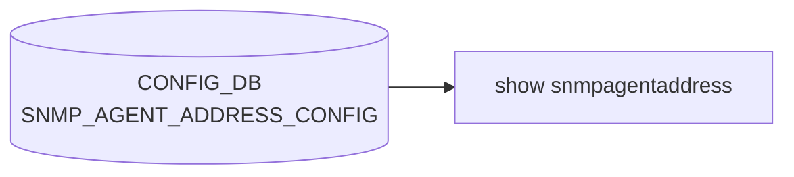

# show snmpagentaddress サブコマンド

## 概要

`show snmpagentaddress` は [SNMP](../../reference/glossary.md#term-snmp) エージェント（snmpd）がリッスンする IP/ポート/[VRF](../../reference/glossary.md#term-vrf) の設定を表示する CLI グループ[^1]。[CONFIG_DB](../../reference/glossary.md#term-config_db) の `SNMP_AGENT_ADDRESS_CONFIG` テーブルを直接読み、tabulate で整形して出力するだけのシンプルな参照系コマンド。

## コマンド一覧

| コマンド | 用途 |
|---------|------|
| `show snmpagentaddress` | snmpd の listening 設定を一覧表示 |

## 詳細

**用法**:

```
show snmpagentaddress
```

**動作**:

1. [CONFIG_DB](../../reference/glossary.md#term-config_db) に接続
2. `get_table('SNMP_AGENT_ADDRESS_CONFIG')` でテーブルを取得（key は tuple `(ip, port, vrf)`）
3. 各 key を `[ip, port, vrf]` として `body` に追加
4. tabulate で `ListenIP | ListenPort | ListenVrf` ヘッダ付きで表示

<!-- evidence:
source: sonic-net/sonic-utilities/show/main.py#L588-L600 (sha: 39732bceb8bdefe706518ab40623bbbba6ff33b9)
excerpt: |
  @cli.group('snmpagentaddress', invoke_without_command=True)
  def snmpagentaddress(ctx):
      config_db = ConfigDBConnector()
      config_db.connect()
      agenttable = config_db.get_table('SNMP_AGENT_ADDRESS_CONFIG')
      header = ['ListenIP', 'ListenPort', 'ListenVrf']
      body = []
      for agent in agenttable:
          body.append([agent[0], agent[1], agent[2]])
      click.echo(tabulate(body, header))
-->

<!-- evidence-rendered:start -->
??? note "📋 検証エビデンス: sonic-net/sonic-utilities/show/main.py#L588-L600 (sha: 39732bceb8bdefe706518ab40623bbbba6ff33b9)"

    **出典**:

    `sonic-net/sonic-utilities/show/main.py#L588-L600 (sha: 39732bceb8bdefe706518ab40623bbbba6ff33b9)`

    **抜粋**:

    ```text
    @cli.group('snmpagentaddress', invoke_without_command=True)
    def snmpagentaddress(ctx):
        config_db = ConfigDBConnector()
        config_db.connect()
        agenttable = config_db.get_table('SNMP_AGENT_ADDRESS_CONFIG')
        header = ['ListenIP', 'ListenPort', 'ListenVrf']
        body = []
        for agent in agenttable:
            body.append([agent[0], agent[1], agent[2]])
        click.echo(tabulate(body, header))
    ```

<!-- evidence-rendered:end -->

## 関連する CONFIG_DB

| テーブル | キー | フィールド |
|----------|------|------------|
| `SNMP_AGENT_ADDRESS_CONFIG` | `<ip>\|<port>\|<vrf>` | (key のみで本体フィールドはなし) |

## 注意

- key は `tuple` 形式 `(ip, port, vrf)` を直接 split せず、[CONFIG_DB](../../reference/glossary.md#term-config_db) の table key parser がすでに分解した形を受ける。
- `invoke_without_command=True` で実装されているが、サブコマンドは存在しない（group として宣言されているのは将来拡張の名残）。

<!-- cli-mermaid -->
### データフロー (自動生成)



!!! note "凡例"
    show 系 (CONFIG_DB → CLI) のミニ図。テーブル → daemon 対応は `docs/reference/config-db-orch-map.md` から機械生成。
<!-- /cli-mermaid -->

<!-- ref-triangle:start -->

## 関連リファレンス

- CONFIG_DB: [`SNMP_AGENT_ADDRESS_CONFIG`](../config-db/snmp-agent-address-config.md)

<!-- ref-triangle:end -->

## 引用元

[^1]: `show snmpagentaddress` グループ定義は `show/main.py` L585-L600。<https://github.com/sonic-net/sonic-utilities/blob/39732bceb8bdefe706518ab40623bbbba6ff33b9/show/main.py#L585>

<!-- cli-sibling -->
### 関連 CLI コマンド

- [`config mirror session`](config-mirror-session.md) — config mirror_session サブコマンド
- [`config sflow`](config-sflow.md) — config sflow サブコマンド
- [`config snmp`](config-snmp.md) — config snmp / snmpagentaddress / snmptrap サブコマンド
- [`config syslog`](config-syslog.md) — config syslog サブコマンド
- [`show flowcnt`](show-flowcnt.md) — show flowcnt-trap / flowcnt-route サブコマンド

<!-- /cli-sibling -->

<!-- glossary-links-injected: a35f1b1cdfa7 -->
