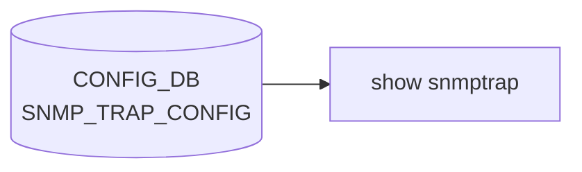

# show snmptrap サブコマンド

## 概要

`show snmptrap` は [SNMP](../../reference/glossary.md#term-snmp) Trap 送信先サーバの設定を表示する CLI グループ[^1]。[CONFIG_DB](../../reference/glossary.md#term-config_db) の `SNMP_TRAP_CONFIG` テーブルから登録された v1/v2/v3 Trap receiver を読み、整形して出力する。

## コマンド一覧

| コマンド | 用途 |
|---------|------|
| `show snmptrap` | [SNMP](../../reference/glossary.md#term-snmp) Trap 送信先設定の表示 |

## 詳細

**用法**:

```
show snmptrap
```

**動作**:

1. [CONFIG_DB](../../reference/glossary.md#term-config_db) に接続し、`get_table('SNMP_TRAP_CONFIG')` でテーブルを取得
2. テーブルの key（`v1TrapDest` / `v2TrapDest` / `v3TrapDest`）から [SNMP](../../reference/glossary.md#term-snmp) バージョン番号を決定
3. 各エントリの `DestIp`, `DestPort`, `vrf`, `Community` を読み出し、tabulate で出力

表示ヘッダ:

```
Version | TrapReceiverIP | Port | VRF | Community
```

<!-- evidence:
source: sonic-net/sonic-utilities/show/main.py#L606-L624 (sha: 39732bceb8bdefe706518ab40623bbbba6ff33b9)
excerpt: |
  @cli.group('snmptrap', invoke_without_command=True)
  def snmptrap(ctx):
      config_db = ConfigDBConnector()
      config_db.connect()
      traptable = config_db.get_table('SNMP_TRAP_CONFIG')
      header = ['Version', 'TrapReceiverIP', 'Port', 'VRF', 'Community']
      body = []
      for row in traptable:
          if row == "v1TrapDest":   ver=1
          elif row == "v2TrapDest": ver=2
          else:                     ver=3
          body.append([ver, traptable[row]['DestIp'], traptable[row]['DestPort'],
                       traptable[row]['vrf'], traptable[row]['Community']])
-->

<!-- evidence-rendered:start -->
??? note "📋 検証エビデンス: sonic-net/sonic-utilities/show/main.py#L606-L624 (sha: 39732bceb8bdefe706518ab40623bbbba6ff33b9)"

    **出典**:

    `sonic-net/sonic-utilities/show/main.py#L606-L624 (sha: 39732bceb8bdefe706518ab40623bbbba6ff33b9)`

    **抜粋**:

    ```text
    @cli.group('snmptrap', invoke_without_command=True)
    def snmptrap(ctx):
        config_db = ConfigDBConnector()
        config_db.connect()
        traptable = config_db.get_table('SNMP_TRAP_CONFIG')
        header = ['Version', 'TrapReceiverIP', 'Port', 'VRF', 'Community']
        body = []
        for row in traptable:
            if row == "v1TrapDest":   ver=1
            elif row == "v2TrapDest": ver=2
            else:                     ver=3
            body.append([ver, traptable[row]['DestIp'], traptable[row]['DestPort'],
                         traptable[row]['vrf'], traptable[row]['Community']])
    ```

<!-- evidence-rendered:end -->

## 関連する CONFIG_DB

| テーブル | キー | フィールド |
|----------|------|------------|
| `SNMP_TRAP_CONFIG` | `v1TrapDest` / `v2TrapDest` / `v3TrapDest` | `DestIp`, `DestPort`, `vrf`, `Community` |

## 注意

- key は SNMP バージョンを文字列で表現する固定値 (`v1TrapDest`, `v2TrapDest`, `v3TrapDest`)。各バージョンにつき 1 エントリしか保持できない構造になっている。
- v3 では `Community` フィールドは SNMPv3 ユーザ名/コンテキストとは別の意味で運用されるため、実環境では空文字や placeholder の場合がある。

<!-- cli-mermaid -->
### データフロー (自動生成)



!!! note "凡例"
    show 系 (CONFIG_DB → CLI) のミニ図。テーブル → daemon 対応は `docs/reference/config-db-orch-map.md` から機械生成。
<!-- /cli-mermaid -->

<!-- ref-triangle:start -->

## 関連リファレンス

- [CONFIG_DB](../../reference/glossary.md#term-config_db): [`SNMP_TRAP_CONFIG`](../config-db/snmp.md)

<!-- ref-triangle:end -->

## 引用元

[^1]: `show snmptrap` グループ定義は `show/main.py` L603-L624。<https://github.com/sonic-net/sonic-utilities/blob/39732bceb8bdefe706518ab40623bbbba6ff33b9/show/main.py#L603>

<!-- glossary-links-injected: 33ad7ce5b321 -->
