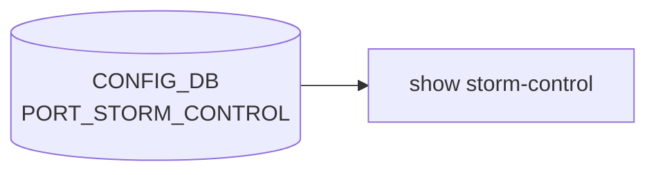

# show storm-control サブコマンド

## 概要

`show storm-control` は Storm Control（ブロードキャスト/マルチキャスト/不明ユニキャスト過剰トラフィックの抑制機能）の設定を表示する CLI グループ[^1]。

[CONFIG_DB](../../reference/glossary.md#term-config_db) の `PORT_STORM_CONTROL` テーブルに格納される `(<interface>, <storm_type>)` キーの設定を読み取り、tabulate で整形して出力する。

## コマンド一覧

| コマンド | 用途 |
|---------|------|
| `show storm-control [-n <namespace>] [-d <display>]` | 全インターフェースの storm-control 設定を表示 |
| `show storm-control interface <interface>` | 指定インターフェースの storm-control 設定を表示 |

## 各コマンドの詳細

### `show storm-control` (default)

**用法**:

```bash
show storm-control [-n|--namespace <namespace>] [-d|--display <all|frontend>]
```

**動作**:
サブコマンド未指定時 (`ctx.invoked_subcommand is None`) は `namespace` 引数の有無で 2 分岐する[^2]:

- `--namespace` 省略時: `display_storm_all()` を呼び、`ConfigDBConnector().connect()` でホスト namespace の [CONFIG_DB](../../reference/glossary.md#term-config_db) に接続して `PORT_STORM_CONTROL` テーブル全体を `natsorted` で並べ替え、`(<interface>, <storm_type>)` キーごとに `kbps` を読み取って tabulate (`grid`) で出力する。
- `--namespace` 指定時: `multi_asic.multi_asic_get_ip_intf_from_ns(namespace)` で当該 namespace に属する interface 一覧を取得し、各 interface について `get_storm_interface(intf, body)` を呼ぶ。`get_storm_interface` 内では引数なしの `ConfigDBConnector` を使うため、データソース自体はホストの CONFIG_DB であり、namespace 指定は「表示対象 interface のフィルタ」としてのみ作用する[^3]。

表示ヘッダ: `Interface Name | Storm Type | Rate (kbps)`。`PORT_STORM_CONTROL` エントリが 1 件も無い場合は `display_storm_all()` が `return` するため、ヘッダごと出力されない。

!!! warning "`-d/--display` オプションは現状未使用"
    `--display all|frontend` は `@click.option` で受け付けられるが、`storm_control(ctx, namespace, display)` 関数本体は `display` 変数を参照しない[^2]。他の `show` グループ (例: `show interfaces`) では `display` で frontend ポートのみに絞る共通慣習があり、それに揃えるために宣言だけ残されている形。指定しても動作差分は無いため、フィルタ目的での利用は期待できない。

### `show storm-control interface <interface>`

**用法**:

```bash
show storm-control interface <interface>
```

**動作**:
multi-[ASIC](../../reference/glossary.md#term-asic) 環境では parent context から取得した `namespace` が有効か検証 (`multi_asic.get_namespace_list()` に含まれるか) し、不一致なら `-n/--namespace option required ...` でエラー終了。検証通過後 `display_storm_interface(interface)` を呼び出して該当 interface の全 storm type エントリを表示する。

<!-- evidence:
source: sonic-net/sonic-utilities/show/main.py#L499-L533 (sha: 39732bceb8bdefe706518ab40623bbbba6ff33b9)
excerpt: |
  @click.option('--display', '-d', 'display', default=None, show_default=False, type=str, help='all|frontend')
  @click.pass_context
  def storm_control(ctx, namespace, display):
      header = ['Interface Name', 'Storm Type', 'Rate (kbps)']
      body = []
      if ctx.invoked_subcommand is None:
          if namespace is None:
              display_storm_all()
          else:
              interfaces = multi_asic.multi_asic_get_ip_intf_from_ns(namespace)
              for intf in interfaces:
                  get_storm_interface(intf, body)
              click.echo(tabulate(body, header, tablefmt="grid"))
  @storm_control.command('interface')
  def interface(ctx, interface):
      namespace = ctx.parent.params.get('namespace')
      if multi_asic.is_multi_asic() and namespace not in multi_asic.get_namespace_list():
          ctx.fail('-n/--namespace option required. ...')
-->

<!-- evidence-rendered:start -->
??? note "📋 検証エビデンス: sonic-net/sonic-utilities/show/main.py#L499-L533 (sha: 39732bceb8bdefe706518ab40623bbbba6ff33b9)"

    **出典**:

    `sonic-net/sonic-utilities/show/main.py#L499-L533 (sha: 39732bceb8bdefe706518ab40623bbbba6ff33b9)`

    **抜粋**:

    ```text
    @click.option('--display', '-d', 'display', default=None, show_default=False, type=str, help='all|frontend')
    @click.pass_context
    def storm_control(ctx, namespace, display):
        header = ['Interface Name', 'Storm Type', 'Rate (kbps)']
        body = []
        if ctx.invoked_subcommand is None:
            if namespace is None:
                display_storm_all()
            else:
                interfaces = multi_asic.multi_asic_get_ip_intf_from_ns(namespace)
                for intf in interfaces:
                    get_storm_interface(intf, body)
                click.echo(tabulate(body, header, tablefmt="grid"))
    @storm_control.command('interface')
    def interface(ctx, interface):
        namespace = ctx.parent.params.get('namespace')
        if multi_asic.is_multi_asic() and namespace not in multi_asic.get_namespace_list():
            ctx.fail('-n/--namespace option required. ...')
    ```

<!-- evidence-rendered:end -->

## 関連する CONFIG_DB

| テーブル | キー | フィールド |
|----------|------|------------|
| `PORT_STORM_CONTROL` | `<interface>\|<storm_type>` | `kbps` |

`storm_type` は `broadcast` / `unknown-multicast` / `unknown-unicast` の 3 種。

!!! note "CLI の `unknown-multicast` と SAI の定義の差異 (issue [#3897](https://github.com/sonic-net/sonic-utilities/issues/3897))"
    SONiC CLI は `unknown-unicast` と `unknown-multicast` を別の storm type として受け付けるが、SAI では `SAI_PORT_ATTR_FLOOD_STORM_CONTROL_POLICER_ID` が unknown-unicast と unknown-multicast を一括して「flood」として扱う。また `SAI_PORT_ATTR_MULTICAST_STORM_CONTROL_POLICER_ID` は registered multicast 専用であり、unknown-multicast とは異なる。CLI の `unknown-multicast` がどの SAI 属性にマップされるかはベンダー実装に依存する可能性があるため、ハードウェアの動作を実機で確認すること。

<!-- cli-mermaid -->
### データフロー (自動生成)



!!! note "凡例"
    show 系 (CONFIG_DB → CLI) のミニ図。テーブル → daemon 対応は `docs/reference/config-db-orch-map.md` から機械生成。
<!-- /cli-mermaid -->

<!-- ref-triangle:start -->

## 関連リファレンス

- [CONFIG_DB](../../reference/glossary.md#term-config_db): [`PORT_STORM_CONTROL`](../config-db/port-storm-control.md)

<!-- ref-triangle:end -->

## 引用元

[^1]: `show storm-control` グループ定義は `show/main.py` L499-L533。<https://github.com/sonic-net/sonic-utilities/blob/39732bceb8bdefe706518ab40623bbbba6ff33b9/show/main.py#L499>

[^2]: グループ本体 (`storm_control(ctx, namespace, display)`) の分岐は `show/main.py` L510-L521。`display` 引数は L508 で `@click.option('--display', '-d', ...)` として宣言されるが、L510-L521 の関数本体では一切参照されない。<https://github.com/sonic-net/sonic-utilities/blob/39732bceb8bdefe706518ab40623bbbba6ff33b9/show/main.py#L508-L521>

[^3]: `display_storm_all` (`show/main.py` L177-L206)、`get_storm_interface` (同 L211-L229)、`display_storm_interface` (同 L234-L259) のいずれも `ConfigDBConnector()` を引数なしで構築するため、接続先はホスト namespace の CONFIG_DB に固定される。<https://github.com/sonic-net/sonic-utilities/blob/39732bceb8bdefe706518ab40623bbbba6ff33b9/show/main.py#L177-L259>

<!-- cli-sibling -->
### 関連 CLI コマンド

- [`config interface`](config-interface.md) — config interface サブコマンド
- [`config portchannel`](config-portchannel.md) — config portchannel サブコマンド
- [`config vlan`](config-vlan.md) — config vlan サブコマンド
- [`show lldp`](show-lldp.md) — show lldp サブコマンド
- [`show mac`](show-mac.md) — show mac サブコマンド

<!-- /cli-sibling -->

<!-- glossary-links-injected: 896d391185a9 -->
