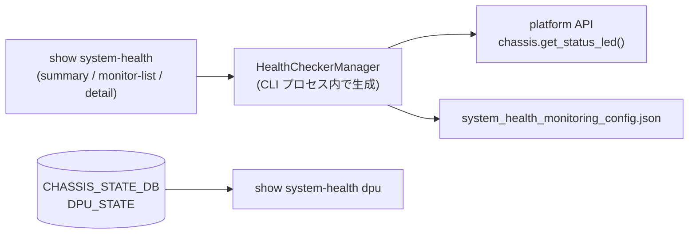

# show system-health サブコマンド

## 概要

`show system-health` は `system-health` デーモン（`HealthCheckerManager`）が保持するシステム状態（サービス・ハードウェア・ファイルシステムなど）と、[SmartSwitch](../../reference/glossary.md#term-smartswitch) 構成での [DPU](../../reference/glossary.md#term-dpu) 状態、システムが boot 完了したかの「sysready」状態を表示する。実装は `show/system_health.py`、`show/main.py` 末尾で `cli.add_command(system_health.system_health)` の形で登録される[^1]。

`HealthCheckerManager` の本体は `health_checker/` パッケージで、`/usr/share/sonic/device/<platform>/system_health_monitoring_config.json` をベースに監視対象を決める。`summary` / `detail` / `monitor-list` の 3 サブコマンドは共通ヘルパ `get_system_health_status()` を呼び、そのヘルパ冒頭の `os.geteuid()` チェックが **root 権限必須** の実体となる（`UTILITIES_UNIT_TESTING=1` の場合はモック経路に切り替わり root チェックをスキップ）[^3]。`sysready-status` / `dpu` はこのヘルパを通らないため root 権限を要求しない。

## コマンド一覧

| コマンド | 用途 |
|---------|------|
| `show system-health summary` | 状態 LED + Services / Hardware の OK/Not OK サマリ |
| `show system-health detail` | summary + monitor list + ignore list |
| `show system-health monitor-list` | 監視対象のサービス・デバイス一覧 |
| `show system-health sysready-status` | `sysreadyshow` 経由のシステム ready 状態 |
| `show system-health sysready-status brief` | `sysreadyshow --brief` |
| `show system-health sysready-status detail` | `sysreadyshow --detail` |
| `show system-health dpu <module_name>` | [SmartSwitch](../../reference/glossary.md#term-smartswitch) 構成での [DPU](../../reference/glossary.md#term-dpu) 状態（CHASSIS_STATE_DB.DPU_STATE） |

## 各コマンドの詳細

### `show system-health summary`

**動作**:

1. `HealthCheckerManager` を生成し、`config.config_file_exists()` で構成ファイル（system_health_monitoring_config.json）の有無を確認。なければ exit 1。
2. `chassis = sonic_platform.chassis.Chassis()` で chassis オブジェクトを取得。
3. `manager.check(chassis)` を呼び、サービス／ハードウェア／FS のチェック結果 dict (`stat`) を取得。
4. `chassis.get_status_led()` で status LED の現在色を取得。
5. 整形ロジック (`display_system_health_summary`) で `Services` / `Hardware` を OK / Not OK 判定して表示。`Services` の Not OK 内訳は「Not Running（プロセス未起動）」と「Not Accessible（FS アクセス不可）」に分けて表示する[^2]。

<!-- evidence:
source: sonic-net/sonic-utilities/show/system_health.py#L113-L131 (sha: 39732bceb8bdefe706518ab40623bbbba6ff33b9)
excerpt: |
  @click.group(name='system-health', cls=clicommon.AliasedGroup)
  def system_health():
      """Show system-health information"""
      return

  @system_health.command()
  def summary():
      _, chassis, stat = get_system_health_status()
      display_system_health_summary(stat, chassis.get_status_led())
-->

<!-- evidence-rendered:start -->
??? note "📋 検証エビデンス: sonic-net/sonic-utilities/show/system_health.py#L113-L131 (sha: 39732bceb8bdefe706518ab40623bbbba6ff33b9)"

    **出典**:

    `sonic-net/sonic-utilities/show/system_health.py#L113-L131 (sha: 39732bceb8bdefe706518ab40623bbbba6ff33b9)`

    **抜粋**:

    ```text
    @click.group(name='system-health', cls=clicommon.AliasedGroup)
    def system_health():
        """Show system-health information"""
        return
    
    @system_health.command()
    def summary():
        _, chassis, stat = get_system_health_status()
        display_system_health_summary(stat, chassis.get_status_led())
    ```

<!-- evidence-rendered:end -->

### `show system-health detail`

`summary` の出力に加えて、

- **monitor list**（監視対象 = サービス + デバイス、各々のステータスとタイプ）
- **ignore list**（`config.ignore_services` / `config.ignore_devices` に登録された監視除外項目）

を `tabulate` で表示する。

### `show system-health monitor-list`

`stat.values()` を走査し、各要素のステータス順にソートして `(Name, Status, Type)` のテーブルを表示。

### `show system-health sysready-status [brief|detail]`

`invoke_without_command=True` のため、サブコマンド無しで呼ぶと `sysreadyshow` を引数なしで実行する。

| 形式 | 内部実行 |
|------|----------|
| `sysready-status` | `sysreadyshow` |
| `sysready-status brief` | `sysreadyshow --brief` |
| `sysready-status detail` | `sysreadyshow --detail` |

`sysreadyshow` 自体は別スクリプトで、[SONiC](../../reference/glossary.md#term-sonic) が boot 完了したかどうかを `STATE_DB` の `SYSTEM_READY|SYSTEM_STATE` から判定して人間可読に表示する。

### `show system-health dpu <module_name>`

**前提**: `is_smartswitch()` が True の場合のみ実動作（False の場合は黙って return）。

**動作**:

1. `redis_chassis.server:6380` の `CHASSIS_STATE_DB`（DB 13）に接続。
2. `DPU_STATE|<module_name>` キー（`module_name` が `DPU` で始まる場合）または `DPU_STATE|*`（全件）を取得。
3. 各エントリの `<key>_state` フィールドを `midplane_state` / `control_plane_state` / `data_plane_state` の 3 軸に振り分けて表示。`midplane_state == down` なら全体 `Offline`、3 軸とも `up` なら `Online`、それ以外は `Partial Online`。
4. 各 `_state` に対応する `_time` / `_reason` フィールドも添えて表示。

`module_name` は `is_smartswitch()` が True のときのみ Choice バリデーションが付く（`get_all_dpu_options()` の戻り値から）。

## 関連 DB / ファイル

| ソース | 用途 |
|--------|------|
| `system_health_monitoring_config.json`（platform 固有） | `HealthCheckerManager` の監視対象定義 |
| `STATE_DB.SYSTEM_READY` | `sysreadyshow` の入力 |
| `CHASSIS_STATE_DB.DPU_STATE`（chassis-only） | `dpu` サブコマンドの入力 |
| `chassis.get_status_led()`（platform API） | summary の状態 LED 色 |

## 注意

- root 権限が無いと `summary` / `detail` / `monitor-list` は `get_system_health_status()` 冒頭の `os.geteuid()` チェック (`show/system_health.py` L26-L28) で「Root privileges are required for this operation」を出力して exit 1。`sysready-status` / `dpu` は同ヘルパを通らないため root を要求しない。
- chassis モジュール (`sonic_platform.chassis.Chassis`) が存在しないプラットフォームでは ImportError になる可能性がある（root チェック通過後に import される）。
- ユニットテスト用の `UTILITIES_UNIT_TESTING=1` で `MockerManager` / `MockerChassis` に切り替わるパスがあり、この経路では root チェックを行わない。

<!-- ref-triangle:start -->

## 関連リファレンス

- CLI: [show services](show-services.md) / [show techsupport](show-techsupport.md) / [show feature](show-feature.md) / [show platform](show-platform.md)
- 関連 [HLD](../../reference/glossary.md#term-hld): [SONiC System Health Monitor HLD](../../system/sonic-system-health-monitor-high-level-design.md) / [event-driven techsupport](../../system/event-driven-techsupport-invocation-coredump-mgmt.md)
- Topic: [プラットフォーム / ポート / 光モジュール](../../topics/14-platform-port-optics/index.md) / [リブート / アップグレード](../../topics/11-reboot/index.md)

<!-- ref-triangle:end -->

## 引用元

[^1]: `cli.add_command(system_health.system_health)` は `show/main.py` L329。<https://github.com/sonic-net/sonic-utilities/blob/39732bceb8bdefe706518ab40623bbbba6ff33b9/show/main.py#L329>

[^2]: 整形は `display_system_health_summary` (`show/system_health.py` L44-L74)。<https://github.com/sonic-net/sonic-utilities/blob/39732bceb8bdefe706518ab40623bbbba6ff33b9/show/system_health.py#L44>

[^3]: `get_system_health_status()` 内の root チェック (`show/system_health.py` L17-L36)。<https://github.com/sonic-net/sonic-utilities/blob/39732bceb8bdefe706518ab40623bbbba6ff33b9/show/system_health.py#L17-L36>

<!-- cli-mermaid -->
### データフロー (手動作成)



!!! note "凡例"
    `show system-health` (summary/monitor-list/detail) は CLI プロセス内で `HealthCheckerManager.check(chassis)` を直接実行する (STATE_DB 経由ではない)。`dpu` サブコマンドのみ `CHASSIS_STATE_DB.DPU_STATE` を読む。設計意図としては `system-health daemon` が `STATE_DB.SYSTEM_HEALTH_INFO` に結果を書くフローも存在するが、CLI 側ではこれを読まない。
<!-- /cli-mermaid -->

<!-- topics-back-ref -->
## 関連 Topics

- [Topics: Telemetry / SNMP / Observability](../../topics/09-telemetry-snmp/index.md)

<!-- /topics-back-ref -->

<!-- ops-hint -->
## 運用ヒント

### 典型的な利用シーン

- fan / PSU / temperature / container health の集約確認。
- NMS 連携前のしきい値確認。

### よくある落とし穴

- system-health monitor list には `Ignored` 項目が含まれる。production では誤検知の温床。
- syshealth daemon が落ちると `show system-health summary` も止まる。

### 関連する show / debug

```bash
show system-health summary
show system-health monitor-list
show platform fan
```
<!-- /ops-hint -->

<!-- cli-sibling -->
<!-- cli-sibling:manual -->
### 関連 CLI コマンド

- [`show services`](show-services.md) — show services サブコマンド
- [`show techsupport`](show-techsupport.md) — show techsupport サブコマンド
- [`show feature`](show-feature.md) — show feature サブコマンド
- [`show platform`](show-platform.md) — show platform サブコマンド
- [`reboot fast-warm`](reboot-fast-warm.md) — reboot fast-warm サブコマンド

<!-- /cli-sibling -->

<!-- glossary-links-injected: 8ba32e5aa69d -->
