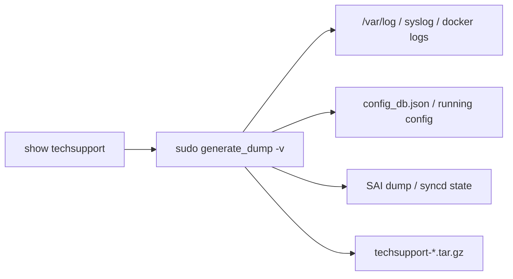

# show techsupport コマンド

## 概要

`show techsupport` は障害解析用の **techsupport ダンプ** を生成する。実態は `sudo generate_dump -v ...` のラッパで、システム情報・ログ・config・[SAI](../../reference/glossary.md#term-sai)/[syncd](../../reference/glossary.md#term-syncd) データなどを 1 つの `tar.gz` にまとめる[^1]。`generate_dump` 自体は `sonic-utilities/scripts/generate_dump` 内のシェルスクリプトで、Linux 標準コマンドや `dump`、`debug dump`、`fwutil` などを順に呼んで結果を集約する。

`show techsupport` の click 関数自体は `show/main.py` の `cli.command()` で 1 つだけ。ダンプの中身を制御する各種フラグはすべて `generate_dump` のフラグへ変換される。

## 用法

```bash
show techsupport [--since <date>] [-g|--global-timeout MIN] [-c|--cmd-timeout MIN]
                 [--verbose] [--allow-process-stop] [--silent] [--debug-dump]
                 [-r|--redirect-stderr]
```

## オプション

| オプション | 値 | 動作 |
|------|----|------|
| `--since <date>` | 任意の date 文字列 | `generate_dump -s <date>` に渡す。当該時刻以降のログ・コアファイルのみを集める |
| `-g, --global-timeout <minutes>` | int | `timeout --kill-after=<COMMAND_TIMEOUT>s -s SIGTERM --foreground <N>m` で `generate_dump` 全体を打ち切る。dump が不完全になる可能性あり（警告） |
| `-c, --cmd-timeout <minutes>` | int (default 5) | `generate_dump -t <N>` に渡す。個別コマンド単位のタイムアウト |
| `--verbose` | flag | `run_command` の `display_cmd=True`（実行コマンドを stdout に出す） |
| `--allow-process-stop` | flag | `generate_dump -a`。dump 中に他プロセスを停止することを許可（追加データ取得のため） |
| `--silent` | flag | `generate_dump`（`-v` を付けない）静かなモード。完了まで時間がかかる旨が表示される |
| `--debug-dump` | flag | `generate_dump -d`。Debug Dump 出力（`debug dump` モジュールの結果）を含める |
| `-r, --redirect-stderr` | flag | `generate_dump -r`。中間エラーを STDERR にリダイレクト |

`--silent` 指定時は `generate_dump` から `-v` フラグが落ちる。それ以外は `-v` 付き。

## 動作

```python
cmd = ["sudo"]
if global_timeout:
    cmd += ['timeout', '--kill-after={}s'.format(COMMAND_TIMEOUT), '-s', 'SIGTERM', '--foreground', '{}m'.format(global_timeout)]
if silent:
    cmd += ["generate_dump"]
else:
    cmd += ['generate_dump', '-v']
if allow_process_stop: cmd += ["-a"]
if since:              cmd += ['-s', str(since)]
if debug_dump:         cmd += ["-d"]
cmd += ['-t', str(cmd_timeout)]
if redirect_stderr:    cmd += ["-r"]
run_command(cmd, display_cmd=verbose)
```

`COMMAND_TIMEOUT` は `show/main.py` 上部で定義された定数（kill-after の grace 秒数）。`generate_dump` は完了時に `/var/dump/sonic_dump_<hostname>_<timestamp>.tar.gz` を出力する。

<!-- evidence:
source: sonic-net/sonic-utilities/show/main.py#L1780-L1814 (sha: 39732bceb8bdefe706518ab40623bbbba6ff33b9)
excerpt: |
  @cli.command()
  def techsupport(since, global_timeout, cmd_timeout, verbose, allow_process_stop, silent, debug_dump, redirect_stderr):
      """Gather information for troubleshooting"""
      cmd = ["sudo"]
      ...
-->

<!-- evidence-rendered:start -->
??? note "📋 検証エビデンス: sonic-net/sonic-utilities/show/main.py#L1780-L1814 (sha: 39732bceb8bdefe706518ab40623bbbba6ff33b9)"

    **出典**:

    `sonic-net/sonic-utilities/show/main.py#L1780-L1814 (sha: 39732bceb8bdefe706518ab40623bbbba6ff33b9)`

    **抜粋**:

    ```text
    @cli.command()
    def techsupport(since, global_timeout, cmd_timeout, verbose, allow_process_stop, silent, debug_dump, redirect_stderr):
        """Gather information for troubleshooting"""
        cmd = ["sudo"]
        ...
    ```

<!-- evidence-rendered:end -->

## 出力

`/var/dump/sonic_dump_<hostname>_<timestamp>.tar.gz`。各ノードで生成される。chassis 構成では LC ごとに個別のファイルが出る。

中身（要約）:

- `/etc/sonic/` 設定ファイル一式
- redis (`config_db.json` / `state_db.json` / `appl_db.json`) のスナップショット
- syslog / dmesg / journal の関連区間
- コンテナ内ログ (`/var/log/swss`, `/var/log/bgp`, ...)
- `show platform` 系の出力
- `debug dump` モジュールの出力（`--debug-dump` 指定時）
- core ファイル（`--since` フィルタを満たすもの）

## 注意

- root 権限必須（`sudo` を内部で付与）。
- 大規模ダンプ（数百 MB）になるため、**`/var/dump/` の空き容量** が事前に必要。
- `--global-timeout` でカットされた場合、dump は不完全な状態で残る可能性がある。

## 既知の制限

- **カスタムファイル名は未サポート** (issue [#4503](https://github.com/sonic-net/sonic-utilities/issues/4503)): 出力は常に `/var/dump/sonic_dump_<hostname>_<timestamp>.tar.gz` に固定される。スクリプトから決定論的なファイル名でアクセスするには、ダンプ後にディレクトリ内の最新ファイルをタイムスタンプで特定する必要がある。カスタムファイル名オプション (`--filename`) の実装は enhancement request として open になっている。

<!-- ref-triangle:start -->

## 関連リファレンス

- CLI: [show system-health](show-system-health.md) / [show services](show-services.md) / [show feature](show-feature.md)
- [CONFIG_DB](../../reference/glossary.md#term-config_db): [AUTO_TECHSUPPORT](../config-db/auto-techsupport.md) / [AUTO_TECHSUPPORT_FEATURE](../config-db/auto-techsupport-feature.md)
- Topic: [プラットフォーム / ポート / 光モジュール](../../topics/14-platform-port-optics/index.md)
- 関連 [HLD](../../reference/glossary.md#term-hld): [event-driven techsupport invocation](../../system/event-driven-techsupport-invocation-coredump-mgmt.md)

<!-- ref-triangle:end -->

## 引用元

[^1]: `show techsupport` 実装は `show/main.py` L1780-L1814。<https://github.com/sonic-net/sonic-utilities/blob/39732bceb8bdefe706518ab40623bbbba6ff33b9/show/main.py#L1780>

<!-- usage-example -->
## 実行例

### 典型的な使い方

```bash
# 例 1: techsupport bundle を採取
sudo show techsupport
```

### よくある引数の組み合わせ

```bash
# 直近 1 時間分のログのみ、tarball サイズを抑える
sudo show techsupport --since "1 hour ago"

# 詳細 (BGP/Memory/Routing 等の追加診断)
sudo show techsupport --allow-process-stop --verbose
```

### 期待される出力 (抜粋)

```text
Collecting all the data ......
Tar file: /var/dump/sonic_dump_<host>_<timestamp>.tar.gz
```
<!-- /usage-example -->

<!-- cli-mermaid -->
### データフロー (手動作成)



!!! note "凡例"
    techsupport (CLI → generate_dump → tar.gz) のミニ図。CONFIG_DB を直接介さないコマンドのため手動で記述。
<!-- /cli-mermaid -->

<!-- topics-back-ref -->
## 関連 Topics

- [Topics: Telemetry / SNMP / Observability](../../topics/09-telemetry-snmp/index.md)

<!-- /topics-back-ref -->

<!-- cli-sibling -->
### 関連 CLI コマンド

- [`config mirror session`](config-mirror-session.md) — config mirror_session サブコマンド
- [`config sflow`](config-sflow.md) — config sflow サブコマンド
- [`config snmp`](config-snmp.md) — config snmp / snmpagentaddress / snmptrap サブコマンド
- [`config syslog`](config-syslog.md) — config syslog サブコマンド
- [`show flowcnt`](show-flowcnt.md) — show flowcnt-trap / flowcnt-route サブコマンド

<!-- /cli-sibling -->

<!-- glossary-links-injected: c5a6ce567024 -->
