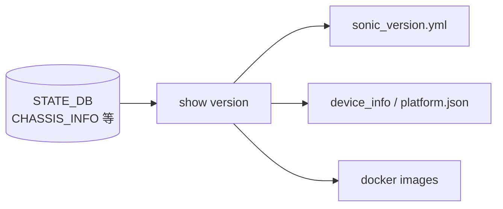

# show version サブコマンド

## 概要

`show version` は **SONiC のビルド情報、プラットフォーム情報、シャーシ情報、稼働時間、現在時刻**、および docker イメージ一覧をまとめて出力する。実装は `show/main.py:version()`[^1]。

## シグネチャ

```bash
show version [--brief]
```

| オプション | 意味 |
|---|---|
| `--brief` | docker イメージ一覧を省略する |

## 出力内容

`version()` は以下のソースから情報を集約する。

| 行 | データソース |
|---|---|
| `SONiC Software Version: SONiC.<build_version>` | `device_info.get_sonic_version_info()`（`/etc/sonic/sonic_version.yml`） |
| `SONiC OS Version` | 同上 (`sonic_os_version`) |
| `Distribution: Debian <ver>` | 同上 (`debian_version`) |
| `Kernel` | 同上 / フォールバックで `os.uname().release` |
| `Build commit` / `Build date` / `Built by` | 同上 |
| `Platform` / `HwSKU` / `ASIC` / `ASIC Count` | `device_info.get_platform_info()`（`/etc/sonic/sonic_version.yml` と platform.json） |
| `Serial Number` / `Switch-Host Serial Number` / `Model Number` / `Hardware Revision` | `platform.get_chassis_info()`（platform API 経由で EEPROM 等） |
| `Uptime` | `uptime` コマンド出力 |
| `Date` | Python 側 `datetime.now()` |

`--brief` を付けない場合、最後に `sudo docker images --format "table {{.Repository}}\t{{.Tag}}\t{{.ID}}\t{{.Size}}"` を実行して docker イメージ一覧を続けて出力する[^1]。

## 注意

- `Switch-Host Serial Number` は `chassis_info['switch_host_serial']` が `'N/A'` でない場合のみ表示される（モジュラシャーシ向けの追加項目）。
- `Date` は **コマンド起動時の Python プロセスローカル時刻**。`Uptime` は外部 `uptime(1)` 実行結果。両者の取得タイミングがわずかにずれることがある。

## CONFIG_DB との接点

なし（ファイル `/etc/sonic/sonic_version.yml`, platform API, docker daemon を読むのみ）。

<!-- cli-mermaid -->
### データフロー (手動作成)



!!! note "凡例"
    show 系 (CLI ← YAML / platform / docker / STATE_DB) のミニ図。CONFIG_DB を直接介さないコマンドのため手動で記述。
<!-- /cli-mermaid -->

<!-- ref-triangle:start -->

## 関連リファレンス

- CLI: [show uptime](show-uptime.md) / [show platform](show-platform.md) / [show services](show-services.md) / [show system-health](show-system-health.md)
- [YANG](../../reference/glossary.md#term-yang): [sonic-versions](../yang/sonic-versions.md) / [sonic-device_metadata](../yang/sonic-device_metadata.md)
- [CONFIG_DB](../../reference/glossary.md#term-config_db): [DEVICE_METADATA](../config-db/device-metadata.md)
- Topic: [プラットフォーム / ポート / 光モジュール](../../topics/14-platform-port-optics/index.md) / [リブート / アップグレード](../../topics/11-reboot/index.md)

<!-- ref-triangle:end -->

## 引用元

[^1]: `version()` 実装は `show/main.py` L1714-L1750。<https://github.com/sonic-net/sonic-utilities/blob/39732bceb8bdefe706518ab40623bbbba6ff33b9/show/main.py#L1714>


<!-- usage-example -->
## 実行例

### 典型的な使い方

```bash
# 例 1: SONiC バージョン情報
show version
```

### よくある引数の組み合わせ

```bash
show version --brief
```

### 期待される出力 (抜粋)

```yaml
SONiC Software Version: SONiC.master.0-dirty-20260501.012345
Distribution: Debian 12.5
Kernel: 6.1.0-18-2-amd64
Build commit: 39732bce
Platform: x86_64-cel_seastone-r0
HwSKU: Celestica-DX010-C32
ASIC: broadcom
```
<!-- /usage-example -->

<!-- glossary-links-injected: 9dae6d74c08e -->
