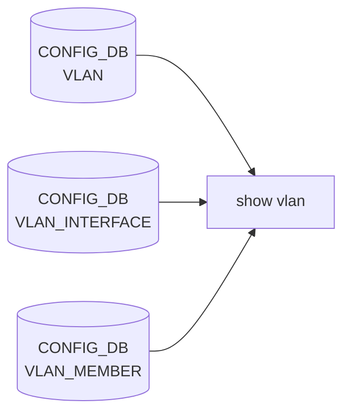

# show vlan サブコマンド

## 概要

`show vlan` は [VLAN](../../reference/glossary.md#term-vlan) とそのメンバーポート、L3 SVI 状態（IP アドレス・proxy_arp）を 2 種類の表で表示する[^1]。`show/vlan.py` 単体に閉じており、[CONFIG_DB](../../reference/glossary.md#term-config_db) の `VLAN` / `VLAN_INTERFACE` / `VLAN_MEMBER` を直接読み出して整形する。

`VlanBrief.COLUMNS` はクラス変数として定義されており、**外部プラグイン（dhcp-relay 等）が `register_column` で列を追加できる**設計。実際 `dhcp_relay` プラグインが `DHCPv4 Servers` / `DHCPv6 Servers` 列を append している。

## コマンド一覧

| コマンド | 用途 |
|---------|------|
| `show vlan brief [-n <ns>]` | [VLAN](../../reference/glossary.md#term-vlan) サマリ（[VLAN](../../reference/glossary.md#term-vlan) ID / IP / Ports / Tagging / Proxy [ARP](../../reference/glossary.md#term-arp)） |
| `show vlan config [-n <ns>]` | VLAN とメンバ port を 1 行 1 メンバで列挙 |

## 各コマンドの詳細

### `show vlan brief [-n|--namespace <ns>] [--verbose]`

**動作**:

1. `VLAN`, `VLAN_INTERFACE`, `VLAN_MEMBER` を [CONFIG_DB](../../reference/glossary.md#term-config_db) から取得
2. `VLAN` のキーを natsort して、各 VLAN について以下の列を計算:

| 列 | 取得元 |
|----|--------|
| `VLAN ID` | キー `Vlan<vid>` から数値部分を抽出 |
| `IP Address` | `VLAN_INTERFACE` キーがタプル `(VlanX, prefix)` の行を集め改行連結 |
| `Ports` | `VLAN_MEMBER` のキーから `(vlan, port)` の port を natsort 連結（alias モード時は alias 変換） |
| `Port Tagging` | `VLAN_MEMBER[(vlan,port)]['tagging_mode']` を Ports と同順序で並べる |
| `Proxy ARP` | `VLAN_INTERFACE[VlanX]['proxy_arp']`（無ければ `disabled`） |

`tablefmt="grid"` で罫線つき表示。multi-[ASIC](../../reference/glossary.md#term-asic) では `-n` 未指定なら全 namespace を順に出力する。

<!-- evidence:
source: sonic-net/sonic-utilities/show/vlan.py#L119-L164 (sha: 39732bceb8bdefe706518ab40623bbbba6ff33b9)
excerpt: |
  @vlan.command()
  def brief(verbose, namespace):
      def _brief_helper(db):
          header = [colname for colname, getter in VlanBrief.COLUMNS]
          ...
          for vlan in natsorted(vlan_data):
              row = []
              for column in VlanBrief.COLUMNS:
                  column_name, getter = column
                  row.append(getter((vlan_cfg, db), vlan))
              body.append(row)
          click.echo(tabulate(body, header, tablefmt="grid"))
-->

<!-- evidence-rendered:start -->
??? note "📋 検証エビデンス: sonic-net/sonic-utilities/show/vlan.py#L119-L164 (sha: 39732bceb8bdefe706518ab40623bbbba6ff33b9)"

    **出典**:

    `sonic-net/sonic-utilities/show/vlan.py#L119-L164 (sha: 39732bceb8bdefe706518ab40623bbbba6ff33b9)`

    **抜粋**:

    ```text
    @vlan.command()
    def brief(verbose, namespace):
        def _brief_helper(db):
            header = [colname for colname, getter in VlanBrief.COLUMNS]
            ...
            for vlan in natsorted(vlan_data):
                row = []
                for column in VlanBrief.COLUMNS:
                    column_name, getter = column
                    row.append(getter((vlan_cfg, db), vlan))
                body.append(row)
            click.echo(tabulate(body, header, tablefmt="grid"))
    ```

<!-- evidence-rendered:end -->

### `show vlan config [-n|--namespace <ns>]`

**動作**:
`VLAN` と `VLAN_MEMBER` をマージし、**1 行 = (VLAN, 1 メンバー)** で展開して表示する。メンバが存在しない VLAN も 1 行ずつ列挙される（member 列は空文字）。

表示列: `Name` (`VlanX`) / `VID` / `Member` (port name または alias) / `Mode` (`untagged` / `tagged`)。

## オプション・共通仕様

- `-n|--namespace <ns>` ... multi-[ASIC](../../reference/glossary.md#term-asic) で特定 namespace のみ表示
- `--verbose`（`brief` のみ） ... 内部処理ログを stdout に出す（実装上は使用箇所が限定的）

## 関連する CONFIG_DB

| テーブル | 表示する列 |
|----------|------------|
| `VLAN` | VLAN ID（キー）、`vlanid` フィールド |
| `VLAN_INTERFACE` | IP アドレス（タプルキー）、`proxy_arp` |
| `VLAN_MEMBER` | メンバポート、`tagging_mode` |

## 拡張性

`VlanBrief.register_column(name, callback)` を経由して、外部プラグインが任意の列を追加できる。`callback(ctx, vlan)` の `ctx` には `(vlan_cfg, db)` タプルが渡され、`vlan_cfg = (vlan_data, vlan_ip_data, vlan_ports_data)`、`db` は `ConfigDbWrapper(cfgdb, ns_db)`。

<!-- ref-triangle:start -->

## 関連リファレンス

- [CONFIG_DB](../../reference/glossary.md#term-config_db): [`VLAN`](../config-db/vlan.md) / [`VLAN_INTERFACE`](../config-db/vlan-interface.md) / [`VLAN_MEMBER`](../config-db/vlan-member.md)

<!-- ref-triangle:end -->

## 引用元

[^1]: `vlan` グループ全体は `show/vlan.py` で定義。`brief` と `config` の 2 コマンドのみ。<https://github.com/sonic-net/sonic-utilities/blob/39732bceb8bdefe706518ab40623bbbba6ff33b9/show/vlan.py>

<!-- ops-hint -->
## 運用ヒント

### 典型的な利用シーン

- VLAN メンバ・tagging mode・IP を一覧して L2/L3 設定の整合を確認する。
- DHCP relay や VxLAN tunnel との紐付け確認の起点。

### よくある落とし穴

- `show vlan brief` は CONFIG_DB ベース表示で、[ASIC](../../reference/glossary.md#term-asic) に未反映でも見えてしまう。実反映は `show interfaces status` や fdb で裏取り。
- tagged / untagged の混在ミスは link ダウン要因。`tagging_mode` 列を必ず確認。

### 関連する show / debug

```bash
show vlan brief
show vlan config
show mac
```
<!-- /ops-hint -->

<!-- cli-sibling -->
### 関連 CLI コマンド

- [`config vlan`](config-vlan.md) — config vlan サブコマンド
- [`config interface`](config-interface.md) — config interface サブコマンド
- [`config portchannel`](config-portchannel.md) — config portchannel サブコマンド
- [`show lldp`](show-lldp.md) — show lldp サブコマンド
- [`show mac`](show-mac.md) — show mac サブコマンド

<!-- /cli-sibling -->

## 関連ページ
- [HLD: Switchport モードと VLAN CLI 拡張](../../switching/switch-port-modes-and-vlan-cli-enhancement.md)
- [CLI: config vlan](config-vlan.md)
- [CONFIG_DB: VLAN](../config-db/vlan.md)

<!-- usage-example -->
## 実行例

### 典型的な使い方

```bash
# 例 1: VLAN と member のサマリ表示
show vlan brief
```

### よくある引数の組み合わせ

```bash
show vlan config
```

### 期待される出力 (抜粋)

```text
+-----------+-----------------+-----------------+----------------+-------------+
|   VLAN ID | IP Address      | Ports           | Port Tagging   | Proxy ARP   |
+===========+=================+=================+================+=============+
|       100 | 10.0.0.1/24     | Ethernet0       | tagged         | disabled    |
|           |                 | Ethernet4       | untagged       |             |
+-----------+-----------------+-----------------+----------------+-------------+
```
<!-- /usage-example -->

<!-- cli-mermaid -->
### データフロー (自動生成)



!!! note "凡例"
    show 系 (CONFIG_DB → CLI) のミニ図。テーブル → daemon 対応は `docs/reference/config-db-orch-map.md` から機械生成。
<!-- /cli-mermaid -->

<!-- topics-back-ref -->
## 関連 Topics

- [Topics: L2 / VLAN / LAG / MC-LAG](../../topics/06-l2-vlan-lag/index.md)

<!-- /topics-back-ref -->

<!-- glossary-links-injected: 8df9850464d2 -->
