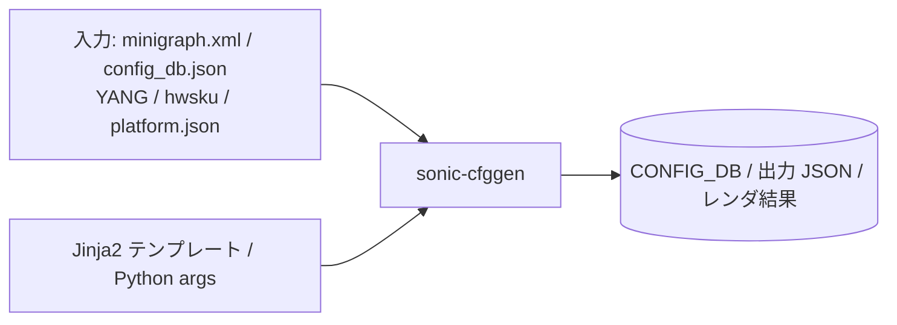

# sonic-cfggen コマンド

## 概要

`sonic-cfggen` は **[SONiC](../../reference/glossary.md#term-sonic) 設定生成エンジンの汎用 CLI**。click ベースの `config` / `show` とは別系統で、`argparse` で定義された引数を取る Python スクリプト。`sonic-buildimage/src/sonic-config-engine/` に置かれ、[SONiC](../../reference/glossary.md#term-sonic) イメージ内では `/usr/local/bin/sonic-cfggen` として動く。

主な役割は以下の 4 つ:

1. **データ収集**: minigraph (XML) / device-description / hwsku 設定 / yang JSON / 任意 YAML / 任意 JSON / [CONFIG_DB](../../reference/glossary.md#term-config_db) / 平面オプションを 1 つの dict にマージ
2. **テンプレートレンダリング**: jinja2 テンプレートを上記 dict を context として描画
3. **値の取り出し**: jinja2 式 (`-v`) で任意の値を文字列または JSON で出力
4. **[CONFIG_DB](../../reference/glossary.md#term-config_db) 書き込み**: `--write-to-db` で集約 dict を [CONFIG_DB](../../reference/glossary.md#term-config_db) に直接書く

`config` / `show` 系 CLI の多くがこのコマンドを `subprocess` で呼び出して、`--var-json <TABLE>` で個別テーブルだけ JSON 出力する用途で使っている[^1]。

## 用法

```text
sonic-cfggen [入力ソース] [出力モード] [追加オプション]
```

入力ソースと出力モードはそれぞれ **mutually exclusive group** として定義されており、原則 1 個ずつ選ぶ。

## 入力ソース（mutually exclusive group, 主入力）

| 引数 | 用途 |
|------|------|
| `-m, --minigraph [<file>]` | [minigraph.xml](../../reference/glossary.md#term-minigraph.xml) をパース。引数省略時は `/etc/sonic/minigraph.xml` |
| `-Y, --yang [<file>]` | [YANG](../../reference/glossary.md#term-yang) JSON から CONFIG_DB JSON を生成。省略時は `/etc/sonic/config_yang.json`。Python3 のみ |
| `-M, --device-description <file>` | device description XML を読む |
| `-k, --hwsku <name>` | HwSKU 名を指定して `port_config.ini` 由来の PORT 情報を集める |

## 入力ソース（追加）

| 引数 | 用途 |
|------|------|
| `-d, --from-db` | CONFIG_DB を読み込む |
| `-y, --yaml <file>` | YAML 追加変数（`append` 可、複数指定で順次マージ） |
| `-j, --json <file>` | JSON 追加変数（`append` 可） |
| `-a, --additional-data '<json string>'` | コマンドライン JSON 文字列で追加変数を渡す |
| `-H, --platform-info` | platform / hardware 情報を `device_info` から読む |
| `-n, --namespace <name>` | multi-[ASIC](../../reference/glossary.md#term-asic) namespace 指定。`asic0` 等。指定すると `asic_id` が逆引きされ port_config 等の path に影響 |
| `-s, --redis-unix-sock-file <sock>` | redis unix sock のパス（CONFIG_DB / [STATE_DB](../../reference/glossary.md#term-state_db) 接続先切替） |
| `-p, --port-config <file>` | port config ファイルパス（`-m` / `-k` と併用） |
| `-S, --hwsku-config <file>` | hwsku config ファイル（`-p` + `-m`/`-k` と併用） |

## 出力モード（mutually exclusive groups）

### テンプレート系 / 値取り出し系（group 2）

| 引数 | 用途 |
|------|------|
| `-t, --template <file[,output]>` | jinja2 テンプレートをレンダリング。`,` 区切りで `(template, output)` を指定でき、`append` で複数同時生成可 |
| `-v, --var <expr>` | jinja2 式の値を文字列で出力（例: `-v "DEVICE_METADATA.localhost.hostname"`） |
| `--var-json <var>` | 変数 / テーブルを JSON で出力（`config` / `show` ラッパで多用） |
| `--preset <choice>` | preset テンプレ（`get_available_config()` の choices）からサンプル config 生成 |
| `-T, --template_dir <dir>` | jinja2 が template を探すベースディレクトリ |

### Print / DB 書き込み系（group 3）

| 引数 | 用途 |
|------|------|
| `--print-data` | 集約 dict 全体を JSON で出力 |
| `-w, --write-to-db` | 集約 dict を CONFIG_DB に書き込む |
| `-K, --key <key>` | 特定 key (`<TABLE>\|<key>`) のみを対象にする lookup |

## 動作（main の概要）

1. `device_info.get_platform()` でプラットフォーム文字列取得、必要なら `bmc_data` を `DEVICE_METADATA.bmc` に取り込む。
2. `redis_unix_sock_file` を `db_kwargs` に保持。
3. `--hwsku` 指定時は `get_path_to_port_config_file(hwsku, asic_id)` から [port_config.ini](../../reference/glossary.md#term-port-config-ini) を解決し `PORT` を集める。breakout 情報があれば `BREAKOUT_CFG` も。
4. `_process_json(args, data)` で `--json` 指定の各ファイルをマージ。
5. `--yang` 指定なら `SonicYangCfgDbGenerator` で yang → config_db json 変換。
6. `--minigraph` 指定なら `parse_xml` で minigraph をパースして dict に展開。
7. `--device-description` 指定なら `parse_device_desc_xml` を実行。
8. `--yaml` を順次読み、`FormatConverter.to_deserialized` で normalized 化してマージ。
9. `--additional-data` の JSON 文字列もマージ。
10. `--from-db` 指定なら CONFIG_DB の内容をマージ。
11. 出力モードに応じて `-t` / `-v` / `--var-json` / `--print-data` / `--write-to-db` / `-K` のいずれかを実行。

## 典型的な使い方

| 用途 | コマンド |
|------|---------|
| minigraph + jinja2 で [BGP](../../reference/glossary.md#term-bgp) 設定生成 | `sonic-cfggen -m -t /usr/share/template/bgpd.conf.j2` |
| CONFIG_DB を JSON ダンプ | `sonic-cfggen -d --print-data > config_db.json` |
| JSON を CONFIG_DB に書き込み | `sonic-cfggen -j config_db.json --write-to-db` |
| 単一テーブル JSON 取得 | `sonic-cfggen -d --var-json PORT` |
| 任意 jinja 値を取得 | `sonic-cfggen -d -v 'DEVICE_METADATA["localhost"]["hostname"]'` |
| preset 構成生成 | `sonic-cfggen -k <hwsku> --preset l2` |

## 関連

- `db_migrator.py`、`config-setup`、`load_minigraph` 等の [SONiC](../../reference/glossary.md#term-sonic) 起動経路で多用される。
- `show runningconfiguration <table>` 系は内部で `sonic-cfggen -d --var-json <TABLE>` を呼ぶ薄いラッパ。
- multi-[ASIC](../../reference/glossary.md#term-asic) では NAMESPACE_ID 環境変数や `-n` 引数で per-namespace 動作が切り替わる。

<!-- cli-mermaid -->
### データフロー (手動作成)



!!! note "凡例"
    設定生成 (CLI ← 入力 → CONFIG_DB / レンダ) のミニ図。CONFIG_DB を直接介さないコマンドのため手動で記述。
<!-- /cli-mermaid -->

<!-- ref-triangle:start -->

## 関連リファレンス

- (関連リンクなし)

<!-- ref-triangle:end -->

## 既知のバグ・制限

!!! warning "generic_config_updater の PatchSorter が数値文字列キーを int に変換する (issue [#4221](https://github.com/sonic-net/sonic-utilities/issues/4221))"
    `generic_config_updater` の `PatchSorter._get_value()` は数値に見えるパストークン（例: `"8"`, `"7"`）を自動的に `int` に変換する。`TC_TO_QUEUE_MAP` など文字列キーを持つテーブルでは `config["8"]` は存在するが `config[8]` は存在しないため KeyError が発生し、patch 適用が失敗する。回避策: `generic_config_updater` 経由ではなく `sonic-db-cli` で直接値を更新する。

!!! warning "sonic-cli-gen が多行 YANG description を含む Python ファイルを生成するとクラッシュする (issue [#4056](https://github.com/sonic-net/sonic-utilities/issues/4056))"
    `sonic-cli-gen generate config <yang>` の生成 Python ファイルで、YANG フィールドの `description` が複数行の場合、click の help 文字列に改行が含まれて `SyntaxError: unterminated string literal` が発生する。該当コマンドグループ全体が import 失敗する。回避策: YANG モデルの description を 1 行に収める。または生成ファイルを手動で triple-quote に修正する。

## 引用元

[^1]: 例: `show runningconfiguration ports` は `sonic-cfggen -d --var-json PORT [--key NAME]` を呼ぶ（`show/main.py` L1868）。<https://github.com/sonic-net/sonic-utilities/blob/39732bceb8bdefe706518ab40623bbbba6ff33b9/show/main.py#L1868>

<!-- glossary-links-injected: d3bc8f725ce5 -->
