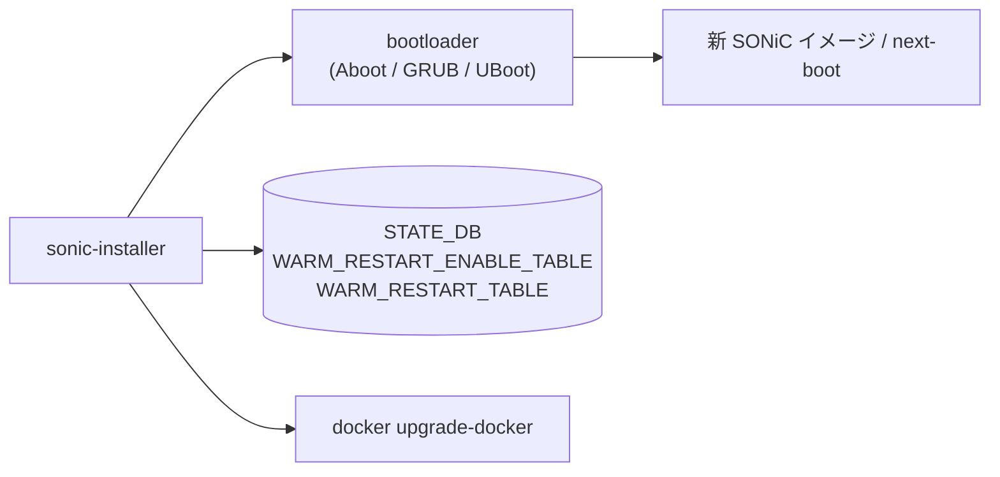

# sonic-installer コマンド

## 概要

`sonic-installer` は [SONiC](../../reference/glossary.md#term-sonic) のイメージ管理（install / list / set-default / set-next-boot / remove / cleanup / verify-next-image）と、Docker コンテナ単位での upgrade / rollback を行う CLI ツール。click ベースで `sonic_installer/main.py` の `sonic_installer` group がトップ。**root 権限必須**（`os.geteuid() != 0` で sys.exit）。

下層の `Bootloader` 抽象（`sonic_installer/bootloader/`）が ABOOT / GRUB / U-Boot 等のプラットフォーム固有処理を吸収する。`sonic-installer` はこの抽象 API を呼ぶだけで、プラットフォーム判別は `get_bootloader()` が担う[^1]。

`sonic_installer`（アンダースコア）形式で呼ぶと deprecation warning を表示する（同じバイナリへの旧名 symlink 互換性のため）。各サブコマンドにも同様の `_` 形式 deprecation がある。

## コマンド一覧

| コマンド | 用途 |
|---------|------|
| `sonic-installer install <url> [opts]` | URL またはローカル binary からイメージをインストール |
| `sonic-installer list` | インストール済みイメージ一覧（current / next / available） |
| `sonic-installer set-default <image>` | デフォルト boot イメージを設定 |
| `sonic-installer set-next-boot <image>` | 次回 boot のみ別イメージを使う（one-time） |
| `sonic-installer set-fips <image> [--enable-fips/--disable-fips]` | FIPS モード切替 |
| `sonic-installer get-fips <image>` | FIPS 状態の取得 |
| `sonic-installer remove <image>` | イメージ削除（current は不可） |
| `sonic-installer binary-version <image_path>` | binary file から version 文字列を取得 |
| `sonic-installer cleanup` | current / next 以外のイメージを一括削除 |
| `sonic-installer upgrade-docker <container_name> <url> [opts]` | コンテナ docker image をアップグレード（warm 対応） |
| `sonic-installer rollback-docker <container_name>` | docker image を直前の version にロールバック |
| `sonic-installer verify-next-image` | 次回 boot 用イメージの署名・整合性検証 |

## 各コマンドの詳細

### `sonic-installer install <url> [opts]`

**オプション**:

- `-y, --yes` ... 確認プロンプトをスキップ
- `-f, --force, --skip-secure-check` ... secure boot 種別違反を無視
- `--skip-platform-check` ... 別プラットフォーム [ASIC](../../reference/glossary.md#term-asic) のイメージでも通す
- `--skip_migration` ... 旧設定の新イメージへの migration を行わない
- `--skip-package-migration` ... `sonic-package-manager` 管理パッケージの移行をスキップ
- `--skip-setup-swap` ... インストール用 swap の作成をスキップ
- `--swap-mem-size <MiB>` (default 1024) ... 作成 swap サイズ
- `--total-mem-threshold <MiB>` (default 2048) ... これ未満の総メモリなら swap 作成
- `--available-mem-threshold <MiB>` (default 1200) ... これ未満の空きメモリなら swap 作成
- `<url>` ... `http(s)://...` または相対パス

**動作**:

1. URL なら `urlretrieve` でダウンロード（`reporthook` で進捗表示）。
2. `bootloader.get_binary_image_version(image_path)` で version を抽出。失敗時は abort。
3. 既にインストール済みなら set-default に切り替えるだけで終了。
4. secure boot / platform 違反を `-f` / `--skip-platform-check` で迂回しない限りチェック。
5. `verify_image_sign` で署名検証（プラットフォームが対応する場合）。
6. `SWAPAllocator` 内で `bootloader.install_image(image_path)` を実行。失敗時は部分インストールされたイメージディレクトリを `shutil.rmtree`。
7. `--skip_migration` でなければ `config-setup backup` を実行。
8. `update_sonic_environment` で `/etc/sonic/sonic-environment` を再生成。
9. パッケージ移行（`migrate_sonic_packages`）が走る場合がある。
10. `sync` を 3 回 + `sleep 3` で fsync 確実化。

### `sonic-installer list`

`bootloader.get_installed_images()` / `get_current_image()` / `get_next_image()` の 3 つを取得して表示。

### `sonic-installer set-default <image>` / `set-next-boot <image>`

イメージが `get_installed_images()` に存在することを確認し、`bootloader.set_default_image(image)` または `set_next_image(image)` を呼ぶ。

### `sonic-installer set-fips <image> [--enable-fips/--disable-fips]`

`image` 省略時は `get_next_image()` を対象。`bootloader.set_fips(image, enable)` を呼ぶ。FIPS は GRUB 引数等を介してカーネル起動オプションを切り替える。

### `sonic-installer remove <image>`

current image は削除不可。`bootloader.remove_image(image)` で物理削除。

### `sonic-installer cleanup`

インストール済みの中で current / next 以外を全て削除。確認プロンプト `--yes` あり。

### `sonic-installer upgrade-docker <container_name> <url> [opts]`

**`<container_name>`**: `DOCKER_CONTAINER_LIST` の Choice。

```text
bgp, dhcp_relay, lldp, macsec, nat, pmon, radv, restapi, sflow,
stp, snmp, swss, syncd, teamd, telemetry, mgmt-framework
```

**オプション**:

- `--cleanup_image` ... 旧 docker image を削除
- `--skip_check` ... `swss` 用 `orchagent_restart_check` の skip
- `--tag <tag>` ... 新 image に付与する tag
- `--warm` ... warm restart 経路で更新

**動作（warm 経路）**:

1. `STATE_DB.WARM_RESTART_ENABLE_TABLE.<container>.enable` を確認。`--warm` 指定で未設定なら `config warm_restart enable <container>` を実行。
2. `docker load -i <image>` で新 image をロード（停止前に）。
3. `swss`: `orchagent_restart_check -w 2000 -r 5` で orch がクリーン状態になるまで待つ。
4. `bgp`: `pkill -9 zebra` + `pkill -9 bgpd` で graceful restart を発火。
5. `teamd`: `pkill -USR1 teamd` で warm-reboot 準備。
6. `WARM_RESTART_TABLE` から旧 reconciliation state を消去。
7. `docker kill` → `docker rm` → `docker tag` → `systemctl restart <container>`。
8. warm 指定なら、`WARM_RESTART_TABLE.<warm_app>.state` が `reconciled` になるまで 90 回（180 秒）待つ。

### `sonic-installer rollback-docker <container_name>`

`docker image ls` で当該コンテナ image が **2 件 ある** ことを確認し、現在 `:latest` でないほうを `:latest` として tag 付け直し、`systemctl restart <container>`。`swss` / `bgp` / `teamd` は cold reboot 必須の警告を出すのみで、自動再起動はしない。

### `sonic-installer verify-next-image`

`bootloader.verify_next_image()` を呼び出すだけ。プラットフォームが対応していれば次回 boot 用イメージの署名検証を行う。

## 関連 DB / ファイル

| ソース | 用途 |
|--------|------|
| `STATE_DB.WARM_RESTART_ENABLE_TABLE` | warm restart enable 状態の確認 (`upgrade-docker`) |
| `STATE_DB.WARM_RESTART_TABLE` | warm restart 進捗 (`reconciled` 状態待ち) |
| Bootloader 固有の grub.cfg / aboot config | `set-default` / `set-next-boot` の永続化先 |
| `/host/image-<version>/` | インストール済みイメージのディレクトリ |
| `/etc/sonic/sonic-environment` | `update_sonic_environment` で再生成 |

## 注意 / 既知の癖

- アンダースコア形式の旧 CLI（`sonic_installer`、`set_default`、`binary_version` 等）は呼べるが deprecation warning が出る[^2]。
- `install` の version 比較は `bootloader.get_binary_image_version` のみで判定するため、同 version 重複インストール時は何もせず set-default するだけ。
- `upgrade-docker` の warm 経路は `swss` / `bgp` / `teamd` の 3 つでしか効果が無く、それ以外は `--warm` を渡しても warm-restart aware な前処理が走らない（cold restart になる）。
- `cleanup` は current / next を保護するが、それ以外（boot 履歴・回復用イメージ）も削除されることに注意。

<!-- ref-triangle:start -->

## 関連リファレンス

- [STATE_DB](../../reference/glossary.md#term-state_db): [`WARM_RESTART_ENABLE_TABLE`](../config-db/warm-restart.md) / [`WARM_RESTART_TABLE`](../config-db/warm-restart.md)

<!-- ref-triangle:end -->

## 参考リンク

- [Reference 索引](../index.md)
- [HLD: sonic-debian-upgrade-cadence](../../system/sonic-debian-upgrade-cadence.md)
- [CLI: sonic-package-manager](sonic-package-manager.md)

## 関連 reference

- [CLI: sonic-package-manager](sonic-package-manager.md)
- [Topics: Reboot](../../topics/11-reboot/index.md)

## 引用元

[^1]: `get_bootloader()` は `sonic_installer/bootloader/__init__.py` がプラットフォーム文字列から ABOOT / GRUB / U-Boot 系を選択する。<https://github.com/sonic-net/sonic-utilities/blob/39732bceb8bdefe706518ab40623bbbba6ff33b9/sonic_installer/bootloader>

[^2]: `print_deprecation_warning` 呼び出しは `sonic_installer/main.py` の各サブコマンド冒頭。例: `sonic-installer set-default` (L662)。<https://github.com/sonic-net/sonic-utilities/blob/39732bceb8bdefe706518ab40623bbbba6ff33b9/sonic_installer/main.py#L662>

<!-- usage-example -->
## 実行例

### 典型的な使い方

```bash
# 例 1: 新しいイメージをインストール
sudo sonic-installer install sonic-broadcom.bin
```

### よくある引数の組み合わせ

```bash
sonic-installer list
sudo sonic-installer set-next-boot SONiC-OS-202311
sudo sonic-installer remove SONiC-OS-202205
sudo sonic-installer cleanup
```

### 期待される出力 (抜粋)

```yaml
Available:
SONiC-OS-202311
SONiC-OS-202205
Current: SONiC-OS-202311
Next: SONiC-OS-202311
```
<!-- /usage-example -->

<!-- cli-mermaid -->
### データフロー (手動作成)



!!! note "凡例"
    image 管理 (CLI → bootloader / CONFIG_DB / docker) のミニ図。CONFIG_DB を直接介さないコマンドのため手動で記述。
<!-- /cli-mermaid -->

<!-- topics-back-ref -->
## 関連 Topics

- [Topics: Reboot / Upgrade / Lifecycle](../../topics/11-reboot/index.md)

<!-- /topics-back-ref -->

<!-- ops-hint -->
## 運用ヒント

### 典型的な利用シーン

- 新 [SONiC](../../reference/glossary.md#term-sonic) イメージのインストール、boot image 切替、image 削除。

### よくある落とし穴

- `sonic-installer install` 後 reboot しないと反映されない。
- `sonic-installer set-default` を間違えると意図しない image で起動する。

### 関連する show / debug

```bash
sudo sonic-installer list
show boot
show version
```
<!-- /ops-hint -->

<!-- glossary-links-injected: 7fcd30b4fb74 -->
