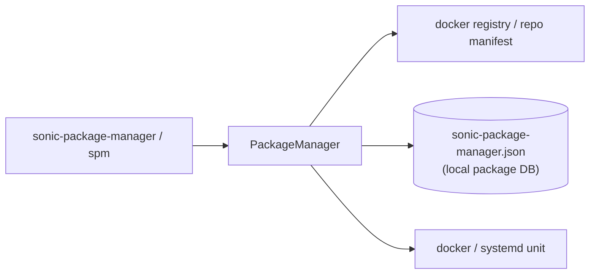

# sonic-package-manager コマンド

## 概要

`sonic-package-manager`（短縮 `spm`）は SONiC が拡張機能を **コンテナ化された 'package'** として動的に追加・削除・アップグレードするための CLI。click ベースで、`sonic_package_manager/main.py` の `cli` group がエントリ。

中核は `PackageManager`（`PackageManager.get_manager()`）で、ローカル DB（`/var/lib/sonic-package-manager/database.json`）にレポジトリと package 状態を保存する。各 package は OCI 互換 docker image としてレジストリから pull され、`docker.dockerfile` ベースで feature として組み込まれる。manifest（`debian/manifest.json` 相当）が package のメタ情報を持つ。

ほとんどのサブコマンドは `@root_privileges_required` デコレータ付きで、root 権限を要求する。

## コマンド一覧

| コマンド | 用途 |
|---------|------|
| `sonic-package-manager list` | DB 上の全 package とインストール状態を表示 |
| `sonic-package-manager show package manifest <pkg_expr>` | package の manifest JSON を表示 |
| `sonic-package-manager show package versions <name> [--all] [--plain]` | 利用可能な version 一覧 |
| `sonic-package-manager show package changelog <pkg_expr>` | package の changelog 表示 |
| `sonic-package-manager repository add <name> <repository> [--default-reference REF] [--description STR]` | repository を DB に追加 |
| `sonic-package-manager repository remove <name>` | repository を DB から削除 |
| `sonic-package-manager manifests create <name> [--from-json FILE]` | カスタムローカル manifest 作成 |
| `sonic-package-manager manifests update <name> --from-json FILE` | manifest 更新 |
| `sonic-package-manager manifests delete <name>` | manifest 削除 |
| `sonic-package-manager manifests show <name>` | manifest 中身を表示 |
| `sonic-package-manager manifests list` | カスタム manifest 一覧 |
| `sonic-package-manager install <pkg_expr> [opts]` | package のインストール／アップグレード |
| `sonic-package-manager update <name> [opts]` | manifest 編集後の package update 適用 |
| `sonic-package-manager reset <name> [opts]` | デフォルト version にリセット |
| `sonic-package-manager uninstall <name> [-y] [-f] [--keep-config]` | アンインストール |
| `sonic-package-manager migrate <database> [opts]` | 別 DB ファイルからの一括マイグレーション |

## 各コマンドの詳細

### `sonic-package-manager list`

DB 上の全 `PackageEntry` を natsort して `(Name, Repository, Description, Version, Status)` を `tabulate` で表示する。`Status` は `Built-In` / `Installed` / `Not Installed` の 3 値（`get_package_status` が判定）[^1]。

### `sonic-package-manager show package manifest <pkg_expr>`

`<pkg_expr>` は `<name>[=<version>|@<reference>]` 形式。または `--from-repository <ref>` / `--from-tarball <path>` で外部から package source を指定可能。`PackageManager.get_package_source(...)` 経由で manifest を取り出し、`json.dumps(..., indent=4)` で出力。

### `sonic-package-manager repository add <name> <repository> [...]`

新規 repository を `PackageManager.add_repository(name, repository, description, default_reference)` で DB に登録。`--default-reference` は install 時にデフォルトで使う tag または sha256 digest。

### `sonic-package-manager install <pkg_expr> [opts]`

**主なオプション**（`PACKAGE_SOURCE_OPTIONS` + `PACKAGE_COMMON_OPERATION_OPTIONS` + `PACKAGE_COMMON_INSTALL_OPTIONS`）:

- `<pkg_expr>` ... `<name>[=<version>|@<reference>]`。または以下のいずれかを使う
- `--from-repository <ref>` ... 任意の OCI repository から直接
- `--from-tarball <path>` ... ローカル tarball
- `--enable` ... installation 直後に feature を enable に
- `--set-owner <local|kube>` ... feature owner のデフォルト
- `--allow-downgrade` ... downgrade を明示的に許可
- `--use-local-manifest --name <name>` ... カスタム manifest を使う（hidden オプション）
- `-y, --yes` / `-f, --force` ... 確認スキップ / 強制
- `--skip-host-plugins` ... ホスト側 plugin の登録をスキップ

**動作**:
`PackageManager.install(...)` が

1. manifest 取得 → 依存 package の解決
2. docker image の pull
3. `service_creator/` で systemd unit / `/etc/sonic/<feature>.j2` template 等を host に展開
4. `FEATURE` テーブルを書き換えて SONiC 側の feature として登録（`--enable` 指定時は ON 状態）
5. install 後、最終 manifest を `/var/lib/sonic-package-manager/manifests/<name>` に保存

### `sonic-package-manager update <name> [opts]`

`/var/lib/sonic-package-manager/manifests/<name>.edit` に編集された manifest がある前提で、`PackageManager.update(name, update_only=True, ...)` を呼び、現在 install 済 package を新 manifest で再構成する。成功すると `<name>.edit` → `<name>` に置き換わる。

### `sonic-package-manager reset <name>`

DB の `default-reference` で示された version に再インストールする。manifest カスタマイズも捨てる。

### `sonic-package-manager uninstall <name> [--keep-config]`

Package の docker image / systemd unit / 関連リソースを削除。`--keep-config` で `FEATURE` 等の [CONFIG_DB](../../reference/glossary.md#term-config_db) エントリは残す。

### `sonic-package-manager migrate <database>`

旧バージョンや別 DB ファイル (`PackageDatabase.from_file(database)`) から package 状態を一括移行する。`sonic-installer install` 時の `--skip-package-migration` を渡さない経路で内部的にも呼ばれる。

## DB / ファイル構成

| パス | 用途 |
|------|------|
| `/var/lib/sonic-package-manager/database.json` | 登録 repository + package 状態の DB |
| `/var/lib/sonic-package-manager/manifests/<name>` | カスタム manifest 本体 |
| `/var/lib/sonic-package-manager/manifests/<name>.edit` | `update` で編集中の manifest |
| `FEATURE` テーブル（[CONFIG_DB](../../reference/glossary.md#term-config_db)） | install 時に書かれる feature 登録 |

## 注意 / 癖

- `package` という語は **docker image + manifest + service definition のセット** を指す。`apt` の package とは別概念。
- `repository` 概念は `repository add` で初めて DB に入る。**install 直前に `repository add` が必要** な点は他言語の `pip` 等と異なる慣習。
- 大半のサブコマンドが root 権限必須。
- `--use-local-manifest` は hidden オプションで、`spm install --name <name> --use-local-manifest` で `manifests create` 経由のローカル manifest を使う。

<!-- cli-mermaid -->
### データフロー (手動作成)



!!! note "凡例"
    管理系 (CLI → manager → registry / package DB / docker) のミニ図。CONFIG_DB を直接介さないコマンドのため手動で記述。
<!-- /cli-mermaid -->

<!-- ref-triangle:start -->

## 関連リファレンス

- CLI: [show feature](show-feature.md) / [show services](show-services.md) / [show version](show-version.md)
- 関連 [HLD](../../reference/glossary.md#term-hld): [SONiC Application Extension Infrastructure](../../architecture/sonic-application-extension-infrastructure.md)
- [CONFIG_DB](../../reference/glossary.md#term-config_db): [FEATURE](../config-db/feature.md)
- [YANG](../../reference/glossary.md#term-yang): [sonic-feature](../yang/sonic-feature.md)
- Topic: [ビルド / パッケージング](../../topics/19-build-packaging/index.md)

<!-- ref-triangle:end -->

## 関連 reference

- [CLI: sonic-installer](sonic-installer.md)
- [Reference index](../index.md)
- [Topics: Build / Packaging](../../topics/19-build-packaging/index.md)

## 引用元

[^1]: `get_package_status` は `sonic_package_manager/main.py` L134-L142。`built_in` 属性で Built-In 判定。<https://github.com/sonic-net/sonic-utilities/blob/39732bceb8bdefe706518ab40623bbbba6ff33b9/sonic_package_manager/main.py#L134>

<!-- ops-hint -->
## 運用ヒント

### 典型的な利用シーン

- サードパーティ container パッケージのインストール・有効化。

### よくある落とし穴

- 依存する SONiC core バージョンを満たさないパッケージは install 時に拒否される。
- package を remove する前に feature を disable しないと container が残骸として残る。

### 関連する show / debug

```bash
sudo sonic-package-manager list
show feature status
docker ps
```
<!-- /ops-hint -->

<!-- glossary-links-injected: 20dbc11976b6 -->
