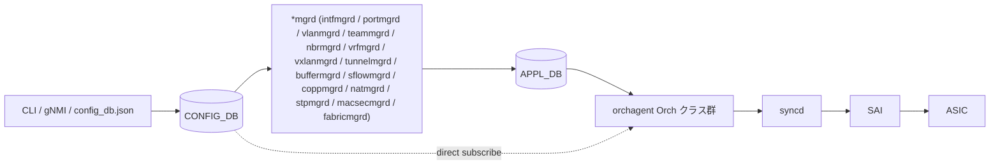

# CONFIG_DB ↔ orchagent クラス対応表

## このページの目的

[SONiC](../reference/glossary.md#term-sonic) の **[CONFIG_DB](../reference/glossary.md#term-config_db) テーブル** が「誰によって読まれるか」を一望できる早見表。
個別テーブルページ (`reference/config-db/<table>.md`) は **書く側 (CLI / [YANG](../reference/glossary.md#term-yang) / 値の意味)** に焦点を当てているのに対し、本ページは **読む側 (subscribe 先 Orch / *mgrd / [SAI](../reference/glossary.md#term-sai) 経路)** をまとめる。

経路は大きく 2 種類ある。

1. **CONFIG_DB → cfgmgr ([intfmgrd](../reference/glossary.md#term-intfmgrd) / [portmgrd](../reference/glossary.md#term-portmgrd) / [vlanmgrd](../reference/glossary.md#term-vlanmgrd) / teammgrd …) → [APPL_DB](../reference/glossary.md#term-appl_db) → [orchagent](../reference/glossary.md#term-orchagent) → SAI**
   - cfgmgr は CONFIG_DB の生値を APPL_DB の運用用テーブル形式に変換し、orchagent が APPL_DB を購読して SAI を叩く
   - インターフェース系・[LAG](../reference/glossary.md#term-lag)・[VLAN](../reference/glossary.md#term-vlan)・[FDB](../reference/glossary.md#term-fdb)・Tunnel など大半のデータパス系
2. **CONFIG_DB を orchagent が直接 subscribe → SAI**
   - [QoS](../reference/glossary.md#term-qos) / Buffer (一部) / [ACL](../reference/glossary.md#term-acl) / [Policer](../reference/glossary.md#term-policer) / Mirror / Mux / Dtel / Pbh / DebugCounter / Mlag / TWAMP / Hft 等、APPL_DB 化が省略される系統

下表は `orchdaemon.cpp` の Orch 構築コードと、`cfgmgr/*.cpp` の `TableConnector` 登録から逆引きしたもの。

凡例:

- **CONFIG_DB テーブル**: `schema.h` の `CFG_*_TABLE_NAME` 文字列実体
- **subscribe 主体**: Orch クラス (orchagent 内) または `*mgrd` daemon
- **APPL_DB 中継**: cfgmgr が APPL_DB に書き出すなら ✓
- **SAI 経路概要**: 最終的に叩く SAI オブジェクト系（粒度ざっくり）

## ポート / インターフェース系

| CONFIG_DB | subscribe 主体 | APPL_DB 中継 | SAI 経路 |
|---|---|---|---|
| `PORT` | `portmgrd` → `PortsOrch` (APP_PORT_TABLE 経由) | ✓ (`APP_PORT_TABLE`) | `sai_port_api` (speed/MTU/admin/FEC) |
| `PORT` (buffer) | `buffermgrd` / `buffermgrdyn` | ✓ (`APP_BUFFER_*`) | `sai_buffer_api` |
| `PORT` (sflow) | `sflowmgrd` → `SflowOrch` | ✓ (`APP_SFLOW_*`) | `sai_samplepacket_api` |
| `PORT` (macsec) | `macsecmgrd` → `MACsecOrch` | ✓ (`APP_MACSEC_*`) | `sai_macsec_api` |
| `SEND_TO_INGRESS_PORT` | `portmgrd` → `PortsOrch` | ✓ (`APP_SEND_TO_INGRESS_PORT_TABLE`) | `sai_port_api` (recirc) |
| `CABLE_LENGTH` | `buffermgrd` (`CFG_PORT_CABLE_LEN_TABLE_NAME`) | (内部) | (buffer profile 計算入力) |
| `INTERFACE` | `intfmgrd` → `IntfsOrch` | ✓ (`APP_INTF_TABLE`) | `sai_router_intf_api` |
| `PORTCHANNEL_INTERFACE` | `intfmgrd` → `IntfsOrch` | ✓ (`APP_INTF_TABLE`) | `sai_router_intf_api` |
| `VLAN_INTERFACE` | `intfmgrd` → `IntfsOrch` | ✓ (`APP_INTF_TABLE`) | `sai_router_intf_api` |
| `LOOPBACK_INTERFACE` | `intfmgrd` → `IntfsOrch` | ✓ | `sai_router_intf_api` (loopback) |
| `VLAN_SUB_INTERFACE` | `intfmgrd` → `IntfsOrch` | ✓ | `sai_router_intf_api` (subport) |
| `VOQ_INBAND_INTERFACE` | `intfmgrd` (chassis VoQ) | ✓ | (VoQ 内部) |
| `GEARBOX` | `xcvrd` / [portsyncd](../reference/glossary.md#term-portsyncd) | (state) | `sai_phy_api` (外部 PHY) |

## VLAN / FDB / LAG / STP

| CONFIG_DB | subscribe 主体 | APPL_DB 中継 | SAI 経路 |
|---|---|---|---|
| `VLAN` | `vlanmgrd` → `PortsOrch` (`APP_VLAN_TABLE`) | ✓ | `sai_vlan_api` |
| `VLAN_MEMBER` | `vlanmgrd` → `PortsOrch` (`APP_VLAN_MEMBER_TABLE`) | ✓ | `sai_vlan_api` (member) |
| `PORTCHANNEL` | `teammgrd` → `PortsOrch` (`APP_LAG_TABLE`) | ✓ | `sai_lag_api` |
| `PORTCHANNEL_MEMBER` | `teammgrd` → `PortsOrch` (`APP_LAG_MEMBER_TABLE`) | ✓ | `sai_lag_api` (member) |
| `FDB` | (config 投入は app 経由) → `FdbOrch` (`APP_FDB_TABLE`) | ✓ | `sai_fdb_api` |
| `MCLAG_DOMAIN` | `MlagOrch` (直接 CFG) | — | (`mclagsyncd` 連携 / `sai_fdb_api`) |
| `MCLAG_INTERFACE` | `MlagOrch` (直接 CFG) | — | (`mclagsyncd` 連携) |
| `SUPPRESS_VLAN_NEIGH` | `nbrmgrd` (kernel ND suppress) | (kernel) | (kernel sysctl) |
| `STP` | `stpmgrd` → `StpOrch` | ✓ (`APP_STP_*`) | `sai_stp_api` |
| `STP_VLAN` | `stpmgrd` → `StpOrch` | ✓ | `sai_stp_api` |
| `STP_VLAN_PORT` | `stpmgrd` → `StpOrch` | ✓ | `sai_stp_api` |
| `STP_PORT` | `stpmgrd` → `StpOrch` | ✓ | `sai_stp_api` |
| `VLAN_STACKING` | (limited support) | — | `sai_vlan_api` (qinq) |
| `VLAN_TRANSLATION` | (limited support) | — | `sai_vlan_api` |

## ルーティング / ネクストホップ / Neighbor

| CONFIG_DB | subscribe 主体 | APPL_DB 中継 | SAI 経路 |
|---|---|---|---|
| `STATIC_ROUTE` | `bgpcfgd` (`managers_static_rt`) → [FRR](../reference/glossary.md#term-frr) `staticd` (vtysh); kernel route は `fpmsyncd` 経由で `RouteOrch` (`APP_ROUTE_TABLE`) を経て APPL_DB | ✓ | `sai_route_api` |
| `BGP_NEIGHBOR` | `bgpcfgd` → FRR [vtysh](../reference/glossary.md#term-vtysh) | (FRR) | (FRR が APPL_DB に route 書込) |
| `BGP_PEER_GROUP` | `bgpcfgd` | (FRR) | — |
| `BGP_DEVICE_GLOBAL` | `BgpGlobalStateOrch` (直接 CFG) | — | `sai_switch_api` (TCP MD5 等の hint) |
| `NEIGH` | `nbrmgrd` → `NeighOrch` (`APP_NEIGH_TABLE`) | ✓ | `sai_neighbor_api` |
| `VRF` | `vrfmgrd` → `VRFOrch` (`APP_VRF_TABLE`) | ✓ | `sai_virtual_router_api` |
| `MGMT_VRF_CONFIG` | `vrfmgrd` (kernel only) | (kernel) | — |
| `FG_NHG` | `FgNhgOrch` (直接 CFG) | — | `sai_next_hop_group_api` (fine grained) |
| `FG_NHG_PREFIX` | `FgNhgOrch` (直接 CFG) | — | `sai_next_hop_group_api` |
| `FG_NHG_MEMBER` | `FgNhgOrch` (直接 CFG) | — | `sai_next_hop_group_api` |
| `FLOW_COUNTER_ROUTE_PATTERN` | `FlowCounterRouteOrch` (直接 CFG) | — | `sai_counter_api` |
| `PASS_THROUGH_ROUTE_TABLE` | `ChassisOrch` (直接 CFG) | — | `sai_route_api` (VoQ 用) |
| `SRV6_MY_SIDS` | `Srv6Orch` (直接 CFG, APP も併用) | ✓ (`APP_SRV6_MY_SID_TABLE`) | `sai_srv6_api` |
| `SRV6_MY_LOCATORS` | `Srv6Orch` | (内部) | `sai_srv6_api` |

## Tunnel / Overlay / VNET / VxLAN

| CONFIG_DB | subscribe 主体 | APPL_DB 中継 | SAI 経路 |
|---|---|---|---|
| `TUNNEL` | `tunnelmgrd` → `TunnelDecapOrch` (`APP_TUNNEL_DECAP_TABLE`) | ✓ | `sai_tunnel_api` (decap) |
| `VXLAN_TUNNEL` | `vxlanmgrd` → `VxlanTunnelOrch` (`APP_VXLAN_TUNNEL_TABLE`) | ✓ | `sai_tunnel_api` |
| `VXLAN_TUNNEL_MAP` | `vxlanmgrd` → `VxlanTunnelMapOrch` | ✓ (`APP_VXLAN_TUNNEL_MAP_TABLE`) | `sai_tunnel_api` (map) |
| `VXLAN_EVPN_NVO` | `vxlanmgrd` / `vrfmgrd` → `EvpnNvoOrch` | ✓ (`APP_VXLAN_EVPN_NVO_TABLE`) | ([EVPN](../reference/glossary.md#term-evpn) 制御面) |
| `VNET` | `vrfmgrd` / `vxlanmgrd` → `VNetOrch` (`APP_VNET_TABLE`) | ✓ | `sai_virtual_router_api` |
| `VNET_ROUTE` | `VNetCfgRouteOrch` → `VNetRouteOrch` (`APP_VNET_RT_TABLE`) | ✓ | `sai_route_api` |
| `VNET_ROUTE_TUNNEL` | `VNetCfgRouteOrch` → `VNetRouteOrch` (`APP_VNET_RT_TUNNEL_TABLE`) | ✓ | `sai_route_api` + tunnel nh |
| `NVGRE_TUNNEL` | `NvgreTunnelOrch` (直接 CFG) | — | `sai_tunnel_api` (NVGRE) |
| `NVGRE_TUNNEL_MAP` | `NvgreTunnelMapOrch` (直接 CFG) | — | `sai_tunnel_api` (map) |
| `MUX_CABLE` | `MuxOrch` (直接 CFG) | — | `sai_neighbor_api` + acl |
| `PEER_SWITCH` | `MuxOrch` (直接 CFG) | — | (active-active state) |

## ACL / Policer / Mirror / PBH

| CONFIG_DB | subscribe 主体 | APPL_DB 中継 | SAI 経路 |
|---|---|---|---|
| `ACL_TABLE` | `AclOrch` (CFG + APP 両 subscribe) | ✓ (`APP_ACL_TABLE_TABLE`) | `sai_acl_api` (table) |
| `ACL_TABLE_TYPE` | `AclOrch` | ✓ | `sai_acl_api` (table group) |
| `ACL_RULE` | `AclOrch` | ✓ (`APP_ACL_RULE_TABLE`) | `sai_acl_api` (entry) |
| `POLICER` | `PolicerOrch` (直接 CFG) | — | `sai_policer_api` |
| `PORT_STORM_CONTROL` | `PolicerOrch` (直接 CFG) | — | `sai_policer_api` (storm) |
| `MIRROR_SESSION` | `MirrorOrch` (直接 CFG) | — | `sai_mirror_api` |
| `PBH_TABLE` | `PbhOrch` (直接 CFG) | — | `sai_acl_api` + `sai_hash_api` |
| `PBH_RULE` | `PbhOrch` | — | `sai_acl_api` |
| `PBH_HASH` | `PbhOrch` | — | `sai_hash_api` |
| `PBH_HASH_FIELD` | `PbhOrch` | — | `sai_hash_api` (field) |

## CoPP / sFlow / NAT / DHCP

| CONFIG_DB | subscribe 主体 | APPL_DB 中継 | SAI 経路 |
|---|---|---|---|
| `COPP_TRAP` | `coppmgrd` → `CoppOrch` (`APP_COPP_TABLE`) | ✓ | `sai_hostif_api` (trap) |
| `COPP_GROUP` | `coppmgrd` → `CoppOrch` | ✓ | `sai_hostif_api` (group/policer) |
| `FEATURE` | `featured` (systemd unit on/off) + `coppmgrd` (trap enable filter) | (内部) | — |
| `SFLOW` | `sflowmgrd` → `SflowOrch` (`APP_SFLOW_TABLE`) | ✓ | `sai_samplepacket_api` |
| `SFLOW_SESSION` | `sflowmgrd` → `SflowOrch` (`APP_SFLOW_SESSION_TABLE`) | ✓ | `sai_samplepacket_api` |
| `STATIC_NAT` | `natmgrd` → `NatOrch` (`APP_NAT_TABLE`) | ✓ | `sai_nat_api` |
| `STATIC_NAPT` | `natmgrd` → `NatOrch` (`APP_NAPT_TABLE`) | ✓ | `sai_nat_api` |
| `NAT_POOL` | `natmgrd` (binding 解決) | (内部) | — |
| `NAT_BINDINGS` | `natmgrd` → `NatOrch` | ✓ | `sai_nat_api` |
| `NAT_GLOBAL` | `natmgrd` → `NatOrch` (`APP_NAT_GLOBAL_TABLE`) | ✓ | `sai_switch_api` (enable) |
| `DHCP_RELAY` | `dhcrelay` (Docker, kernel) | — | (kernel L4) |
| `DHCP_SERVER_IPV4` | `dhcpservd` (sonic-dhcp-server) | — | (kernel L4) |

## QoS / Buffer / Scheduler / WRED

QoS/Buffer 系は **orchagent が CONFIG_DB を直接 subscribe** する経路と、buffermgr が APPL_DB を中継する経路が混在する (`QosOrch` は直接 CFG、`BufferOrch` は APPL_DB)。

| CONFIG_DB | subscribe 主体 | APPL_DB 中継 | SAI 経路 |
|---|---|---|---|
| `TC_TO_QUEUE_MAP` | `QosOrch` (直接 CFG) | — | `sai_qos_map_api` |
| `SCHEDULER` | `QosOrch` (直接 CFG) | — | `sai_scheduler_api` |
| `DSCP_TO_TC_MAP` | `QosOrch` | — | `sai_qos_map_api` |
| `MPLS_TC_TO_TC_MAP` | `QosOrch` | — | `sai_qos_map_api` |
| `DOT1P_TO_TC_MAP` | `QosOrch` | — | `sai_qos_map_api` |
| `QUEUE` | `QosOrch` | — | `sai_queue_api` |
| `PORT_QOS_MAP` | `QosOrch` | — | `sai_port_api` (qos binding) |
| `WRED_PROFILE` | `QosOrch` | — | `sai_wred_api` |
| `TC_TO_PRIORITY_GROUP_MAP` | `QosOrch` | — | `sai_qos_map_api` |
| `PFC_PRIORITY_TO_PRIORITY_GROUP_MAP` | `QosOrch` | — | `sai_qos_map_api` |
| `PFC_PRIORITY_TO_QUEUE_MAP` / `MAP_PFC_PRIORITY_TO_QUEUE` | `QosOrch` | — | `sai_qos_map_api` |
| `DSCP_TO_FC_MAP` | `QosOrch` | — | `sai_qos_map_api` |
| `EXP_TO_FC_MAP` | `QosOrch` | — | `sai_qos_map_api` |
| `TC_TO_DOT1P_MAP` | `QosOrch` | — | `sai_qos_map_api` |
| `TC_TO_DSCP_MAP` | `QosOrch` | — | `sai_qos_map_api` |
| `BUFFER_POOL` | `buffermgrd` → `BufferOrch` (`APP_BUFFER_POOL_TABLE`) | ✓ | `sai_buffer_api` (pool) |
| `BUFFER_PROFILE` | `buffermgrd` → `BufferOrch` (`APP_BUFFER_PROFILE_TABLE`) | ✓ | `sai_buffer_api` (profile) |
| `BUFFER_PG` | `buffermgrd` → `BufferOrch` (`APP_BUFFER_PG_TABLE`) | ✓ | `sai_buffer_api` (pg) |
| `BUFFER_QUEUE` | `buffermgrd` → `BufferOrch` (`APP_BUFFER_QUEUE_TABLE`) | ✓ | `sai_buffer_api` (queue) |
| `BUFFER_PORT_INGRESS_PROFILE_LIST` | `buffermgrd` → `BufferOrch` | ✓ | `sai_port_api` (binding) |
| `BUFFER_PORT_EGRESS_PROFILE_LIST` | `buffermgrd` → `BufferOrch` | ✓ | `sai_port_api` (binding) |
| `DEFAULT_LOSSLESS_BUFFER_PARAMETER` | `buffermgrdyn` | (内部計算) | — |
| `PFC_WD_TABLE` | `PfcWdSwOrch` (直接 CFG) | — | `sai_acl_api` + `sai_queue_api` ([PFC](../reference/glossary.md#term-pfc) WD) |

## 監視 / 観測 / Telemetry / Debug

| CONFIG_DB | subscribe 主体 | APPL_DB 中継 | SAI 経路 |
|---|---|---|---|
| `FLEX_COUNTER_TABLE` | `FlexCounterOrch` (直接 CFG) | — | `sai_counter_api` (group enable) |
| `WATERMARK_TABLE` | `WatermarkOrch` (直接 CFG) | — | `sai_buffer_api` (clear) |
| `DEBUG_COUNTER` | `DebugCounterOrch` (直接 CFG) | — | `sai_debug_counter_api` |
| `DEBUG_COUNTER_DROP_REASON` | `DebugCounterOrch` (直接 CFG) | — | `sai_debug_counter_api` |
| `DEBUG_DROP_MONITOR_TABLE` | `DebugCounterOrch` (直接 CFG) | — | `sai_debug_counter_api` |
| `DTEL` | `DTelOrch` (直接 CFG) | — | `sai_dtel_api` |
| `DTEL_REPORT_SESSION` | `DTelOrch` | — | `sai_dtel_api` |
| `DTEL_INT_SESSION` | `DTelOrch` | — | `sai_dtel_api` |
| `DTEL_QUEUE_REPORT` | `DTelOrch` | — | `sai_dtel_api` |
| `DTEL_EVENT` | `DTelOrch` | — | `sai_dtel_api` |
| `HIGH_FREQUENCY_TELEMETRY_PROFILE` | `HFTelOrch` (直接 CFG) | — | `sai_tam_api` (HFT) |
| `HIGH_FREQUENCY_TELEMETRY_GROUP` | `HFTelOrch` | — | `sai_tam_api` |
| `RATES` | (counters/rate-calc daemon) | — | (内部) |
| `TWAMP_SESSION` | `TwampOrch` (直接 CFG) | — | `sai_twamp_api` |
| `BFD_SESSION` (app-only) | `BfdOrch` (`APP_BFD_SESSION_TABLE`) | (FRR/[BFD](../reference/glossary.md#term-bfd)) | `sai_bfd_api` |
| `ICMP_ECHO_SESSION` (app-only) | `IcmpOrch` (`APP_ICMP_ECHO_SESSION_TABLE`) | — | `sai_bfd_api` (echo) |

## Switch / Chassis / Fabric / Platform

| CONFIG_DB | subscribe 主体 | APPL_DB 中継 | SAI 経路 |
|---|---|---|---|
| `SWITCH` / `APP_SWITCH_TABLE` | `SwitchOrch` (CFG + APP) | ✓ | `sai_switch_api` |
| `ASIC_SENSORS_CONFIGURATION` | `SwitchOrch` (CFG) | — | `sai_switch_api` (vendor sensor) |
| `SWITCH_HASH` | `SwitchOrch` (CFG) | — | `sai_hash_api` |
| `SWITCH_TRIMMING` | `SwitchOrch` (CFG) | — | `sai_switch_api` (trim) |
| `SWITCH_FAST_LINKUP` | `SwitchOrch` (CFG) | — | `sai_port_api` |
| `CRM` | `CrmOrch` (直接 CFG) | — | `sai_switch_api` (resource counters) |
| `CHASSIS_MODULE` | `chassisd` / `chassis-app` | (chassis APPL_DB) | (VoQ chassis 管理) |
| `DPU_TABLE` | `dpu-mgmt` / dash daemons | — | (smartswitch) |
| `FABRIC_MONITOR` | `fabricmgrd` → `FabricPortsOrch` (`APP_FABRIC_MONITOR_DATA_TABLE`) | ✓ | (fabric link monitor) |
| `FABRIC_PORT` | `fabricmgrd` → `FabricPortsOrch` (`APP_FABRIC_MONITOR_PORT_TABLE`) | ✓ | (fabric port enable/isolate) |
| `DEVICE_METADATA` | 多数 (`SwitchOrch`, `buffermgrd`, `flexcounterorch` 他) | — | `sai_switch_api` (mac/switch_type) |
| `LOGGING` / `LOGGER` | `swssloglevel` / 各 daemon | — | (syslog 経路) |
| `WARM_RESTART` | 各 Orch / daemon (warmrestart hint) | — | (warm-reboot 制御) |
| `SUPPRESS_ASIC_SDK_HEALTH_EVENT` | `SwitchOrch` | — | `sai_switch_api` (health suppress) |

## DASH / SmartSwitch (DPU-side orchagent)

CONFIG_DB → APPL_DB → orchagent と同じ構造を **[DPU](../reference/glossary.md#term-dpu) 専用 [Redis](../reference/glossary.md#term-redis)** 上で持つ。テーブル名は `DASH_*`。

| APPL_DB テーブル (DPU 側) | subscribe 主体 | SAI 経路 |
|---|---|---|
| `DASH_APPLIANCE_TABLE` | `DashOrch` | `sai_dash_appliance_api` |
| `DASH_ROUTING_TYPE_TABLE` | `DashOrch` | `sai_dash_*` |
| `DASH_ENI_TABLE` | `DashOrch` | `sai_dash_eni_api` |
| `DASH_ENI_ROUTE_TABLE` | `DashOrch` | `sai_dash_eni_api` |
| `DASH_QOS_TABLE` | `DashOrch` | (qos profile) |
| `DASH_VNET_TABLE` | `DashVnetOrch` | `sai_dash_vnet_api` |
| `DASH_VNET_MAPPING_TABLE` | `DashVnetOrch` | `sai_dash_outbound_*` |
| `DASH_ROUTE_TABLE` | `DashRouteOrch` | `sai_dash_outbound_routing_api` |
| `DASH_ROUTE_RULE_TABLE` | `DashRouteOrch` | `sai_dash_outbound_routing_api` |
| `DASH_ROUTE_GROUP_TABLE` | `DashRouteOrch` | `sai_dash_outbound_routing_api` |
| `DASH_PREFIX_TAG_TABLE` | `DashAclOrch` | `sai_dash_acl_api` |
| `DASH_ACL_IN_TABLE` / `DASH_ACL_OUT_TABLE` | `DashAclOrch` | `sai_dash_acl_api` |
| `DASH_ACL_GROUP_TABLE` / `DASH_ACL_RULE_TABLE` | `DashAclOrch` | `sai_dash_acl_api` |
| `DASH_HA_SET_TABLE` / `DASH_HA_SCOPE_TABLE` | `DashHaOrch` | `sai_dash_ha_api` |
| `DASH_ENI_FORWARD_TABLE` | `DashEniFwdOrch` ([NPU](../reference/glossary.md#term-npu) 側 orchagent) | `sai_acl_api` (forward) |
| `DASH_HA_GLOBAL_CONFIG` (CFG_DB) | `DashHaOrch` (CFG) | (HA 設定) |

## 認証 / 802.1X 系

| CONFIG_DB | subscribe 主体 | APPL_DB 中継 | SAI 経路 |
|---|---|---|---|
| `PAC_PORT_CONFIG_TABLE` | `pacmgrd` / `hostapdmgrd` | — | (kernel + hostapd) |
| `PAC_GLOBAL_CONFIG_TABLE` | `pacmgrd` | — | — |
| `HOSTAPD_GLOBAL_CONFIG_TABLE` | `hostapdmgrd` | — | — |

## VRRP / SAG / NTP / その他

| CONFIG_DB | subscribe 主体 | APPL_DB 中継 | SAI 経路 |
|---|---|---|---|
| `VRRP` | `vrrpcfgd` (FRR keepalived) | — | (FRR) |
| `VRRP6` | `vrrpcfgd` | — | (FRR) |
| `SAG` | (sag agent / static anycast) | — | `sai_router_intf_api` |
| `NTP` | `ntp-config` | — | (systemd-timesyncd / chrony) |

## 管理 / システムサービス / セキュリティ

これらは orchagent / SAI 経路を持たず、ホスト側 daemon (`hostcfgd` / 専用 daemon / FRR) が CONFIG_DB を直接 subscribe して Linux / FRR / 外部サービスへ反映する。**[ASIC](../reference/glossary.md#term-asic) を直接プログラムしない** 設定群。

| CONFIG_DB | subscribe 主体 | APPL_DB 中継 | SAI 経路 |
|---|---|---|---|
| `BANNER_MESSAGE` | `hostcfgd` | — | (sshd banner) |
| `BMP` | `bmpcfgd` | — | (FRR BMP) |
| `BGP_AGGREGATE_ADDRESS` | `bgpcfgd` | — | (FRR) |
| `BGP_BBR` | `bgpcfgd` | — | (FRR) |
| `BGP_GLOBALS` | `bgpcfgd` | — | (FRR) |
| `BGP_GLOBALS_AF` | `frrcfgd` | — | (FRR) |
| `BGP_MONITORS` | `bgpcfgd` | — | (FRR) |
| `BGP_PEER_RANGE` | `bgpcfgd` | — | (FRR dynamic peer) |
| `BGP_SENTINELS` | `bgpcfgd` | — | (FRR) |
| `BREAKOUT_CFG` | `xcvrd` / `portsyncd` | — | `sai_port_api` (port breakout) |
| `DHCP_SERVER` | `dhcpservd` | — | (kernel L4) |
| `DNS_NAMESERVER` | `hostcfgd` | — | (/etc/resolv.conf) |
| `DNS_OPTIONS` | `hostcfgd` | — | (/etc/resolv.conf) |
| `FIPS` | `hostcfgd` | — | (openssl FIPS mode) |
| `KDUMP` | `hostcfgd` | — | (kdump-tools) |
| `LDAP` | `hostcfgd` | — | (nslcd / PAM) |
| `LDAP_SERVER` | `hostcfgd` | — | (nslcd) |
| `LLDP` | `lldpmgrd` | — | (lldpd) |
| `LLDP_PORT` | `lldpmgrd` | — | (lldpd) |
| `MACSEC_PROFILE` | `macsecmgrd` | ✓ (`APP_MACSEC_*`) | `sai_macsec_api` |
| `MAP_PFC_PRIORITY_TO_QUEUE` | `QosOrch` (直接 CFG) | — | `sai_qos_map_api` |
| `MGMT_INTERFACE` | `mgmt-framework` / `interfaces-config` | — | (kernel netlink) |
| `MGMT_PORT` | `mgmt-framework` / `interfaces-config` | — | (kernel netlink) |
| `NTP_KEY` | `ntp-config` | — | (chrony key) |
| `NTP_SERVER` | `ntp-config` | — | (chrony server) |
| `PASSW_HARDENING` | `hostcfgd` | — | (PAM pwquality) |
| `PFC_WD` | `PfcWdSwOrch` | — | `sai_acl_api` + `sai_queue_api` |
| `RADIUS` | `hostcfgd` | — | (PAM radius) |
| `RADIUS_SERVER` | `hostcfgd` | — | (PAM radius) |
| `RESTAPI` | `restapi` | — | (REST server cert/listen) |
| `ROUTE_MAP` | `bgpcfgd` | — | (FRR route-map) |
| `ROUTE_MAP_SET` | `bgpcfgd` | — | (FRR prefix/community list) |
| `SNMP` | `docker-snmp 起動スクリプト` (orchagent なし) | — | (snmpd.conf.j2 → snmpd) |
| `SNMP_AGENT_ADDRESS_CONFIG` | `docker-snmp 起動スクリプト` (orchagent なし) | — | (snmpd.conf.j2 → snmpd) |
| `SNMP_COMMUNITY` | `docker-snmp 起動スクリプト` (orchagent なし) | — | (snmpd.conf.j2 → snmpd) |
| `SNMP_USER` | `docker-snmp 起動スクリプト` (orchagent なし) | — | (snmpd.conf.j2 → snmpd v3) |
| `SSH_SERVER` | `hostcfgd` | — | (sshd_config) |
| `SYSLOG_CONFIG` | `hostcfgd` | — | (rsyslog) |
| `SYSLOG_SERVER` | `hostcfgd` | — | (rsyslog) |
| `SYSTEM_DEFAULTS` | `db_migrator` (起動時参照) | — | (機能フラグ) |
| `TACPLUS` | `hostcfgd` | — | (PAM tacplus) |
| `TACPLUS_SERVER` | `hostcfgd` | — | (PAM tacplus) |
| `AAA` | `hostcfgd` | — | (PAM/NSS 切替) |
| `VERSIONS` | `db_migrator` (sonic-installer / メタ) | — | — |
| `WARM_RESTART` | `warmrestart` (各 Orch / daemon hint) | — | (warm-reboot 制御) |

## 経路パターンまとめ

- 「`*mgrd` → APPL_DB → orchagent」: ポート/インターフェース/VLAN/LAG/Tunnel/Buffer/sFlow/Macsec/[CoPP](../reference/glossary.md#term-copp)/[NAT](../reference/glossary.md#term-nat)/STP/Fabric
- 「orchagent が CONFIG_DB を直接 subscribe」: QoS/ACL/Policer/Mirror/Mux/Pbh/Dtel/DebugCounter/Mlag/Crm/Twamp/PfcWd/FgNhg/[FlexCounter](../reference/glossary.md#term-flexcounter)/HFTel/NvgreTunnel/Switch(一部)
- 「FRR / kernel daemon が中継」: [BGP](../reference/glossary.md#term-bgp)/OSPF/Static route(`fpmsyncd`)、[VRRP](../reference/glossary.md#term-vrrp)、NTP、Mgmt [VRF](../reference/glossary.md#term-vrf)、DHCP

## 関連リファレンス

- [CONFIG_DB リファレンス index](config-db/index.md): テーブル単位の詳細
- [SAI / orchagent 内部](../internals/index.md): Orch クラスごとの内部設計と SAI コール
- [Topics 横断](../topics/index.md): 機能横断的にこの対応を組み合わせた説明

## 引用元

<!-- evidence: orchagent の全 Orch 生成は orchdaemon.cpp::OrchDaemon::init() に集約 -->
<!-- source: sonic-net/sonic-swss/orchagent/orchdaemon.cpp (commit 4305596156d70e9797e8a881b3d19b46de0bce0d) -->

- [`sonic-swss/orchagent/orchdaemon.cpp`](https://github.com/sonic-net/sonic-swss/blob/4305596156d70e9797e8a881b3d19b46de0bce0d/orchagent/orchdaemon.cpp)
- [`sonic-swss/cfgmgr/`](https://github.com/sonic-net/sonic-swss/tree/4305596156d70e9797e8a881b3d19b46de0bce0d/cfgmgr) (各 `*mgrd.cpp`)
- [`sonic-swss-common/common/schema.h`](https://github.com/sonic-net/sonic-swss-common/blob/158de8d3463ff4b841653f6d57190bb142b80d9c/common/schema.h)

<!-- glossary-links-injected: 685759eed1cd -->
