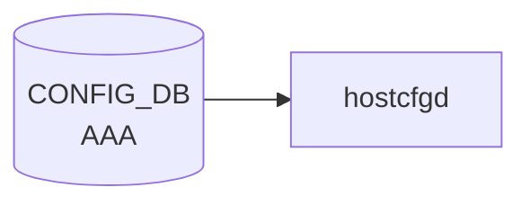

# AAA テーブル

## 概要

ログイン認証 (authentication) / 認可 (authorization) / アカウンティング (accounting) の手段優先順序を [CONFIG_DB](../../reference/glossary.md#term-config_db) に保持するテーブル[^1]。`hostcfgd` の [AAA](../../reference/glossary.md#term-aaa) ハンドラが読み出し、Linux PAM (`/etc/pam.d/common-auth`, `/etc/pam.d/sshd` 等) と nsswitch / sshd 設定を再生成する。

<!-- cdb-mermaid -->
### データフロー (自動生成)



!!! note "凡例"
    CONFIG_DB から SAI までの典型経路を `docs/reference/config-db-orch-map.md` から機械生成したミニ図。詳細・例外は本ページ本文と対応表を参照。
<!-- /cdb-mermaid -->

## key 構造

```text
AAA|<type>
```

`<type>` は enum `authentication` / `authorization` / `accounting`。

## フィールド

| フィールド | 型 | デフォルト | 説明 |
|-----------|----|-----------|------|
| `type` | enum `authentication`/`authorization`/`accounting` | - | [AAA](../../reference/glossary.md#term-aaa) 機能種別 (key) |
| `login` | string (カンマ区切り; `ldap`/`tacacs+`/`local`/`radius`/`default`) | `local` | 試行順序リスト |
| `failthrough` | boolean | `False` | true: あるメソッドが失敗したら次のメソッドに継続 |
| `fallback` | boolean | `False` | true: 全リモートメソッド失敗時に `local` にフォールバック |
| `debug` | boolean | `False` | [AAA](../../reference/glossary.md#term-aaa) デバッグログを有効化 |
| `trace` | boolean | `False` | AAA プロトコルパケットトレースを有効化 |

## 制約

- `login` の pattern: `((ldap|tacacs\+|local|radius|default),)*(ldap|tacacs\+|local|radius|default)` (重複チェックなし、順序のみ意味あり)
- `must` 制約: `type = authentication` で `login` に `tacacs+` を含めるなら `TACPLUS.global.passkey` が存在しなければエラー[^1]

## 購読者

- `hostcfgd` (`sonic-host-services` の AAA ハンドラ): [CONFIG_DB](../../reference/glossary.md#term-config_db) → PAM / nsswitch / sshd 再生成
- `pam_tacplus` / `pam_radius` / `pam_ldap` / `pam_unix`: PAM 経由で実際の認証を実行

## 関連 CONFIG_DB / YANG / CLI

- 関連 [CONFIG_DB](../../reference/glossary.md#term-config_db): [`TACPLUS_SERVER`](tacplus-server.md), [`RADIUS`](radius.md), [`LDAP_SERVER`](ldap-server.md)
- 関連 CLI: `config aaa authentication { login | failthrough | fallback | debug | trace }`
- 関連 [YANG](../../reference/glossary.md#term-yang): `sonic-system-aaa`

<!-- cdb-exceptions -->
## 例外条件・特殊挙動

| 条件 | 挙動 |
|------|------|
| `key` が `authentication`/`authorization`/`accounting` 以外 | 内部状態を更新せず実質 no-op |
| `failthrough`/`debug` に `"true"/"yes"/"1"` 以外の文字列 | `is_true()` が False 扱い、型エラーなし |
| `login` に `ldap` を含むが LDAP global 設定が不完全 | `nslcd` サービスを起動しない (silent skip) |
| PAM 設定ファイル書き込み失敗 | syslog ERR のみ、クラッシュなし |
| `login` に `tacacs+` を含むが `TACPLUS.global.passkey` が未設定 | [YANG](../../reference/glossary.md#term-yang) レベルで reject（[hostcfgd](../../reference/glossary.md#term-hostcfgd) は実行時再チェックなし） |

<!-- evidence: sonic-net/sonic-host-services/scripts/hostcfgd:419L -->
<!-- /cdb-exceptions -->

<!-- value-behavior -->
## 値依存挙動マトリクス

### `type` (enum — key フィールド)

| 値 | 効果 | evidence |
|---|---|---|
| `authentication` | PAM `common-auth-sonic.j2` を再生成して `/etc/pam.d/common-auth`, `/etc/issue` 等を更新。YANG must 制約で `login` に `tacacs+` を含む場合 `TACPLUS.global.passkey` が必須 | `sonic-system-aaa.yang:must` |
| `authorization` | `tacplus_nss.conf.j2` を生成して `nss` 設定を更新。`login` は `tacacs+` / `local` のみ有効 | `sonic-host-services/scripts/hostcfgd:2443` |
| `accounting` | アカウンティング設定を `tacplus_nss.conf.j2` に反映。`login` の `local_accounting` / `tacacs_accounting` で個別有効化 | `sonic-host-services/data/templates/tacplus_nss.conf.j2:13` |

### `login` (string — 実質的な複合 enum)

PAM テンプレート `common-auth-sonic.j2` が `login` 文字列に完全一致で分岐する:

| 値 | PAM 生成挙動 | evidence |
|---|---|---|
| `local` | `pam_unix.so` のみ | `common-auth-sonic.j2:12` |
| `tacacs+` | TACACS+ サーバ全台 → root は local 強制 | `common-auth-sonic.j2:29` |
| `tacacs+,local` | TACACS+ サーバ全台 → `pam_unix.so` | `common-auth-sonic.j2:29` |
| `local,tacacs+` | `pam_unix.so` 先行 → TACACS+ サーバ残台数 | `common-auth-sonic.j2:15` |
| `radius` | root を local 強制スキップ → [RADIUS](../../reference/glossary.md#term-radius) chain → deny → cache → local | `common-auth-sonic.j2:56` |
| `radius,local` | root local skip → [RADIUS](../../reference/glossary.md#term-radius) chain → local | `common-auth-sonic.j2:44` |
| `local,radius` | local → [RADIUS](../../reference/glossary.md#term-radius) chain → deny → cache | `common-auth-sonic.j2:32` |
| `ldap` | `pam_ldap.so minimum_uid=1000` のみ | `common-auth-sonic.j2:84` |
| `ldap,local` | `pam_ldap.so` → `pam_unix.so` | `common-auth-sonic.j2:82` |
| `local,ldap` | `pam_unix.so` → `pam_ldap.so` | `common-auth-sonic.j2:83` |
| (その他) | `pam_unix.so` にフォールバック | `common-auth-sonic.j2:87` |

### `failthrough` (boolean)

| 値 | 効果 | evidence |
|---|---|---|
| `false` (既定) | 各 PAM stanza に `auth_err=die` を付与。メソッドが REJECT すると即ログイン失敗 | `common-auth-sonic.j2:16` |
| `true` | `auth_err=die` を付与しない。メソッドが REJECT しても次メソッドへ継続 | `common-auth-sonic.j2:16` |

### `debug` / `trace` (boolean — RADIUS 専用)

| フィールド | 値 | 効果 | evidence |
|---|---|---|---|
| `debug` | `true` | `pam_radius_auth.so` 引数に `debug` を追加 | `common-auth-sonic.j2:35` |
| `trace` | `true` | `pam_radius_auth.so` 引数に `trace` を追加 | `common-auth-sonic.j2:35` |

### 複合条件

- `type=authentication` かつ `login` に `tacacs+` を含む → YANG must 制約が `TACPLUS.global.passkey` の存在を必須とする (`sonic-system-aaa.yang:must`)
- `failthrough` は `login` のすべてのメソッドに横断適用される (TACACS+/RADIUS/LDAP 問わず同一フラグ)
<!-- /value-behavior -->

<!-- ref-triangle:start -->

## 関連リファレンス

- [YANG](../../reference/glossary.md#term-yang): [`sonic-system-aaa`](../yang/sonic-system-aaa.md)
- CLI: [`config aaa`](../cli/config-aaa.md)

<!-- ref-triangle:end -->

## 引用元

[^1]: `src/sonic-yang-models/yang-models/sonic-system-aaa.yang` (container `AAA` / list `AAA_LIST`、leaf `login` の pattern と TACACS+ passkey の must 制約). <https://github.com/sonic-net/sonic-buildimage/blob/9ea932ec2e18f35e58268ec2e4456b1d4afd65cd/src/sonic-yang-models/yang-models/sonic-system-aaa.yang>

## 関連ページ
- [CONFIG_DB: TACPLUS_SERVER](tacplus-server.md)
- [CONFIG_DB: LDAP_SERVER](ldap-server.md)

<!-- ops-hint -->
## 運用ヒント

### 典型値

- key 形式: `AAA|<service>` (service = `authentication` / `authorization` / `accounting`)。
- `authentication.login`: `local` または `tacacs+,local` のチェイン。
- `failthrough`: `True` で前段失敗時に次の方式へフォールバック。

### よくある誤設定

- `tacacs+` 単独設定で全 TACACS+ サーバ到達不可になると login 不能。必ず `local` を末尾に残す。

### 確認コマンド

```bash
sonic-db-cli CONFIG_DB hgetall 'AAA|authentication'
show aaa
```
<!-- /ops-hint -->

<!-- runtime-trace -->
## 実コンテナ動作トレース

### 段階 1 — Consumer 登録

`hostcfgd` (`sonic-host-services`) の `AaaHandler` が CONFIG_DB の `AAA` テーブルを購読する。

`hostcfgd` が起動時に `CONFIG_DB` を `select()` して購読。`TableConsumer` ではなく `ConfigDBConnector.subscribe()`。

### 段階 2 — CFG→APPL 翻訳

なし ([APPL_DB](../../reference/glossary.md#term-appl_db) 中継なし)

### 段階 3 — APPL→SAI

なし ([SAI](../../reference/glossary.md#term-sai) 非経由 — Linux PAM / NSS 設定ファイルを直接書き換える)

### 段階 4 — タイミングと副作用

**適用タイミング**: CONFIG_DB の `AAA` エントリ変化を `ConfigDBConnector` で検知次第即時反映。PAM ファイル (`/etc/pam.d/common-auth` 等) の書き換えは同期的。次回ログイン試行から新設定が有効になる。

**副作用**: PAM 設定ファイル上書き → 進行中セッションには影響なし（PAM は認証時にファイルを読む）。`tacacs+`/`radius` が選択された場合 `nslcd`/`radiusd` 設定も更新。
<!-- /runtime-trace -->

<!-- entry-points -->
## 書き込み入り口 (Direction A)

対象テーブル: `AAA`

### CLI
- `config aaa authentication login <method>`
- `config aaa authentication failthrough <enable|disable>`
- `config aaa authentication fallback <enable|disable>`
- `config aaa authorization login <method>`
- `config aaa accounting login <method>`
  - ソース: `sonic-utilities/config/aaa.py`

### minigraph / sonic-cfggen
- なし

### REST / gNMI (sonic-mgmt-common)
- なし (対応 OpenConfig/[SONiC](../../reference/glossary.md#term-sonic) YANG transformer なし)

### db_migrator
- あり: `migrate_aaa_table_field_sync()` で `authentication`/`accounting`/`authorization` エントリを再生成 (db_migrator.py:879,886,895)

### ビルド時デフォルト (init_cfg / j2 テンプレート)
- なし

### ハードコードデフォルト
- なし

### ランタイム注入 (デーモン自動書き込み)
- なし
<!-- /entry-points -->

<!-- ordering -->
## 書込み順依存 (Phase B)

`hostcfgd` (`AaaCfg`) の `modify_conf_file()` はイベントごとに PAM / NSS / NSLCD 設定を**全部まとめて再生成**する。このため書き込み順序が中間状態の整合性に直結する。

### 検出された順序依存

| # | 依存関係 | 方向 | 緩和策 |
|---|----------|------|--------|
| 1 | AAA は `load_independent_config()` で systemctl 完了前に適用される | 強制先行（他テーブルより早い） | 不在フィールドはデフォルト値で silent fallback |
| 2 | `TACPLUS_SERVER` / `RADIUS_SERVER` / `LDAP_SERVER` を先書き → `AAA` 書き込み | 推奨（中間状態最小化） | runtime は `subscribe` 後追い自動更新 |
| 3 | `LDAP\|global` (`bind_dn`/`base_dn`/`bind_password`) + `LDAP_SERVER` → `AAA` `login=ldap` | **先行必須**（欠如時 nslcd 停止） | LDAP 設定追加後 `ldap_global_update` が自動復旧 |
| 4 | `TACPLUS\|global.passkey` → `AAA` `authorization` / db_migrator | **先行必須**（YANG reject + migrator が authorization 削除） | 手動 CLI 再設定 |
| 5 | `AAA` DEL → デフォルト回帰 | 即時（待機ループなし） | `authentication_default` で `local` 回帰 |
| 6 | `MGMT_INTERFACE` / `INTERFACE` → `RADIUS_SERVER` `src_intf` 解決 | 推奨先行 | 後追い `mgmt_intf_handler` で自動更新 |
| 7 | `DEVICE_METADATA.hostname` → RADIUS `nas_id` | load フェーズ内は自動保証 | runtime 追加時は hostname 設定済みであること |

### 主要な制約詳細

**LDAP 先行必須 (依存 #3)**: `AAA|authentication.login = "ldap"` を書く前に `LDAP|global` (`bind_dn`, `base_dn`, `bind_password` の全フィールド) と `LDAP_SERVER` エントリを揃えること。`is_ldap_config_complete()` が `False` の状態で `aaa_update()` が呼ばれると `handle_nslcd_service(False)` が実行され nslcd が停止・mask される。後から LDAP global 設定が追加されると `ldap_global_update()` が自動復旧を試みる（evidence: `hostcfgd:437-442`, `hostcfgd:241-250`）。

**TACPLUS passkey 先行必須 (依存 #4)**: `db_migrator.migrate_aaa()` は `TACPLUS|global.passkey` が空の場合に `AAA|authorization` を**削除**する。事後に passkey を設定しても authorization エントリは自動復元されない。また YANG must 制約により、`AAA|authentication.login` に `tacacs+` を含む場合は passkey が存在しなければ CLI 経由の書き込み自体が reject される（evidence: `db_migrator.py:869-900`, `sonic-system-aaa.yang:must`）。

**中間状態に関する注意 (依存 #2)**: `AAA` を先に書いて `TACPLUS_SERVER` を後から追加する場合、`AAA` 書き込み時点では `servers_conf` が空になるため `common-auth-sonic` は TACACS+ サーバなしで生成される（実質 `local` 相当）。`TACPLUS_SERVER` 追加後に再度 `modify_conf_file()` が呼ばれて正しい設定になる。スイッチへの管理接続中に設定変更を行う際は影響に留意すること（evidence: `hostcfgd:641-870`）。

<!-- /ordering -->

<!-- defaults -->
## フィールド暗黙デフォルト (Phase A — コード由来)

YANG default 以外の fallback。`hostcfgd` (`AaaCfg` クラス) の `__init__` リテラルおよび `authentication_default` / `authorization_default` / `accounting_default` dict から導出。

| フィールド | AAA type | コード由来デフォルト | fallback 源 |
|-----------|---------|-------------------|------------|
| `login` | `authentication` | `'local'` | `authentication_default = {'login': 'local'}` — [hostcfgd](../../reference/glossary.md#term-hostcfgd):357–359 |
| `login` | `authorization` | `'local'` | `authorization_default = {'login': 'local'}` — [hostcfgd](../../reference/glossary.md#term-hostcfgd):361–363 |
| `login` | `accounting` | `'disable'` | `accounting_default = {'login': 'disable'}` — hostcfgd:364–366 |
| `failthrough` | `authentication` | `False` (Jinja2 undefined → falsy) | `authentication_default` にキーなし; DB 欠如時 Jinja2 が falsy 評価 |
| `fallback` | `authentication` | `False` (Jinja2 undefined → falsy) | `authentication_default` にキーなし; bool 変換なしで dict に格納 |
| `debug` | `authentication` | `False` | `self.debug = False` literal — hostcfgd:393; DB に `debug` キーがある場合のみ `is_true()` で上書き |
| `trace` | `authentication` | 常に `False` (**DB 値は無視**) | `self.trace = False` literal — hostcfgd:394; `aaa_update()` に `trace` 処理ブロックが存在しないため DB 値が反映されない |

### 補足

- `modify_conf_file()` (hostcfgd:641–648) は `<type>_default.copy()` に DB 値を `update()` するパターン。DB にキーが存在しない場合は default dict の値がそのまま Jinja2 テンプレートへ渡る。
- `is_true()` (hostcfgd:156–162) は `'True'` / `'true'` のみ `True` を返す。`'yes'` / `'1'` 等は `False` 扱い (syslog ERR を出力)。
- `trace` フィールドは CLI (`config aaa authentication trace enable`) で CONFIG_DB に書き込めるが、`aaa_update()` で `self.trace` を更新する分岐が存在しない。結果として PAM テンプレートには常に `trace=False` が渡り、RADIUS `trace` オプションは機能しない。これは `debug` との非対称性であり、実装上のバグと見られる。
- `accounting.login` の `'disable'` デフォルトは YANG default (`'local'`) と異なる点に注意。DB に `AAA|accounting` エントリが存在しない場合、hostcfgd は `'disable'` として振る舞う。

<!-- /defaults -->

<!-- failure -->
## 失敗挙動マトリクス (Phase D)

ソース: `sonic-net/sonic-host-services/scripts/hostcfgd`

### SET 処理における失敗経路

| 失敗条件 | 検出箇所 | 結果 | ログ出力 | evidence |
|---|---|---|---|---|
| `key` が `authentication`/`authorization`/`accounting` 以外 | `aaa_update()` L419 | 内部状態更新なし・`modify_conf_file()` は呼ばれるが設定変化なし | なし | `hostcfgd:419-431` |
| `failthrough` に `'True'`/`'true'` 以外の文字列 (`'yes'`/`'1'` 等) | `is_true()` L156 | `False` 扱い・"Failed to get bool value" を syslog ERR 出力 | LOG_ERR | `hostcfgd:160-162` |
| `login=ldap` だが `bind_dn`/`bind_password`/`base_dn` のいずれかが空 | `is_ldap_config_complete()` L437 | `handle_nslcd_service(False)` → nslcd を stop & mask (LDAP 認証不能) | LOG_DEBUG ("nslcd: deactivating") | `hostcfgd:437-442, 246-251` |
| `login=ldap` だが `LDAP_SERVER` エントリなし | `is_ldap_config_complete()` L442 | `self.ldap_servers` 空 → `False` → nslcd を stop & mask | LOG_DEBUG | `hostcfgd:442` |
| PAM テンプレートレンダリング中に jinja2 例外発生 | `modify_conf_file()` L716-725 | 例外伝播・PAM ファイル未更新 | スタックトレース (未捕捉) | `hostcfgd:716-731` |
| PAM 設定ファイル書き込み時 `open()` / `os.rename()` が `OSError` | `modify_conf_file()` L728-731 | 例外伝播・PAM ファイル未更新 (`.tmp` 残存の可能性) | スタックトレース (未捕捉) | `hostcfgd:728-731` |
| `aaastatsd` サービスの start/stop が `CalledProcessError` | `modify_conf_file()` L846-851 | LOG_ERR のみ・後続の NSLCD 設定処理は継続 | LOG_ERR | `hostcfgd:846-851` |
| NSLCD / LDAP conf 生成 (`generate_file_from_template`) で例外 | `generate_file_from_template()` L214 | LOG_ERR のみ・nslcd.conf / ldap.conf 未更新 | LOG_ERR ("Failed generate_file_from_template error=...") | `hostcfgd:214-216` |
| LDAP conf ディレクトリ作成 (`os.makedirs`) 失敗 | `modify_conf_file()` L860-862 | LOG_ERR のみ・LDAP_CONF 生成試行は続く | LOG_ERR ("Error occurred when using cmd makedirs...") | `hostcfgd:860-862` |
| `audisp-tacplus` への SIGHUP 送信失敗 (`os.kill` 例外) | `notify_audisp_tacplus_reload_config()` L490-493 | LOG_WARNING のみ・処理継続 | LOG_WARNING | `hostcfgd:490-493` |
| `/etc/pam.d/sshd` / `/etc/pam.d/login` ファイルが欠如 | `check_file_not_empty()` L619-620 | LOG_ERR のみ・sed 変更未適用 | LOG_ERR ("file size check failed: {} is missing") | `hostcfgd:619-621` |
| `nsswitch.conf` が存在しない | `modify_conf_file()` L755-783 | `os.path.isfile()` が False → sed 変更スキップ (silent skip) | なし | `hostcfgd:756, 763-783` |
| `RADIUS_SERVER.src_intf` に対応する IP が解決できない | `modify_conf_file()` L697-700 | LOG_INFO → `src_ip` を削除して処理継続 | LOG_INFO ("src_intf has no usable IP addr.") | `hostcfgd:697-700` |

### DEL / db_migrator における失敗経路

| 失敗条件 | 検出箇所 | 結果 | evidence |
|---|---|---|---|
| `AAA` エントリ DEL 後 | `aaa_update()` dispatch | default dict (`login: local` / `disable`) に回帰 | `hostcfgd:357-366, 641-648` |
| migration 時 `TACPLUS\|global.passkey` が空 | `migrate_aaa()` L869 | `AAA\|authorization` エントリを**削除**。passkey 後追い設定後も自動復元なし | `db_migrator.py:869-900` |

### 補足

- **PAM atomic 書き込み**: `.tmp` → `os.rename()` で atomic 置換。`os.rename()` 失敗時は `.tmp` が残存し PAM 設定変化なし。
- **nslcd 自動復旧**: nslcd が mask された後に `ldap_global_update()` / `ldap_server_update()` が呼ばれると `handle_nslcd_service()` が再評価され、LDAP 設定が完全になった時点で unmask & start (`hostcfgd:547-564`)。
- **`trace` の無効化バグ**: `aaa_update()` に `trace` 更新ブロックが存在しないため `self.trace` は常に `False`。CONFIG_DB の `trace=True` は PAM テンプレートに反映されない。
<!-- /failure -->

<!-- platform -->
## プラットフォーム差 (Phase H)

**プラットフォーム差なし**: AAA は host 単位で適用され、[ASIC](../../reference/glossary.md#term-asic) 種別・multi-asic / [VOQ](../../reference/glossary.md#term-voq) chassis 構成・ベンダーに依らない。

| 観点 | 結果 | 根拠 |
|------|------|------|
| [ASIC](../../reference/glossary.md#term-asic) 種別 (Broadcom / Mellanox / Marvell / Innovium 等) | 影響なし | AAA は [SAI](../../reference/glossary.md#term-sai) 非経由。`hostcfgd` が Linux PAM / NSS 設定ファイルを直接書き換えるのみ (段階 3 トレース参照) |
| multi-asic (`is_multi_npu() == True`) | 影響なし | `AaaCfg` は host CONFIG_DB (`ConfigDBConnector()` 引数なし) のみを購読。`asicN` namespace を iterate しない (`hostcfgd:2166-2185`)。`is_multi_npu` 値は AAA 経路に渡されない |
| [VOQ](../../reference/glossary.md#term-voq) chassis (supervisor + line cards) | 各 host で独立適用 | AAA テーブルは host scope。chassis 全体での集中適用機構はなく、各 line card host で `hostcfgd` が独立に PAM を再生成 |
| ベンダー固有 PAM モジュール | なし | community master の PAM スタックは `pam_unix` / `pam_tacplus` / `pam_radius_auth` / `pam_ldap` の Debian 標準。`files/image_config/` にも `files/build_templates/` にもベンダー hook 注入箇所なし (`ls files/image_config \| grep -iE 'aaa\|tacacs\|radius\|ldap\|pam\|nss'` が 0 ヒット) |
| テンプレート内分岐 | プラットフォーム条件なし | `common-auth-sonic.j2` / `tacplus_nss.conf.j2` を `platform\|asic\|chassis\|namespace\|vendor` で grep して 0 ヒット。分岐は `AAA.login` / `failthrough` / `debug` / `trace` とサーバリストのみ |

詳細根拠は `meta/_intermediate/cdb-flow/aaa-platform.md` を参照。
<!-- /platform -->

<!-- pubsub -->
## 通信メカニズム (Phase G)

### Redis 購読方式

`AAA` テーブル（および関連 `TACPLUS` / `TACPLUS_SERVER` / `RADIUS` / `RADIUS_SERVER` / `LDAP` / `LDAP_SERVER`）への変更通知は、`hostcfgd` が **`ConfigDBConnector.subscribe()` + `listen()`** で登録する **[Redis](../../reference/glossary.md#term-redis) keyspace 通知 (PSUBSCRIBE `__keyspace@<dbId>__:<TABLE>|*`)** によって配信される。`swsscommon.SubscriberStateTable` や `ConsumerStateTable` (channel ベース PUBLISH/SUBSCRIBE) は **使用しない**。CONFIG_DB は永続前提のため TTL は設定されない。

| 購読者 | 購読 API | 購読テーブル | ハンドラ |
|--------|---------|--------------|---------|
| `hostcfgd` (`AaaCfg` 経由) | `ConfigDBConnector.subscribe()` | `AAA` | `aaa_handler` → `aaa_update` |
| `hostcfgd` | 同上 | `TACPLUS` / `TACPLUS_SERVER` | `tacacs_global_handler` / `tacacs_server_handler` |
| `hostcfgd` | 同上 | `RADIUS` / `RADIUS_SERVER` | `radius_global_handler` / `radius_server_handler` |
| `hostcfgd` | 同上 | `LDAP` / `LDAP_SERVER` | `ldap_global_handler` / `ldap_server_handler` |

`hostcfgd` 以外で `AAA` テーブルを購読するプロセスは存在しない (`pam_tacplus` / `pam_radius` / `pam_ldap` / `pam_unix` は PAM 設定ファイルを認証時に読むのみで [Redis](../../reference/glossary.md#term-redis) を購読しない)。

### keyspace 通知 → ハンドラ呼び出しの流れ

```
config aaa authentication login tacacs+,local
  ↓ HSET "AAA|authentication" login "tacacs+,local"
Redis keyspace PUBLISH "__keyspace@4__:AAA|authentication"  "hset"
  ↓ ConfigDBConnector.listen() がパターンマッチ
make_callback() で (key, op, data) を生成
  ↓ HGETALL "AAA|authentication"  ← 通知後に値を再取得
aaa_handler(key="authentication", op=SET, data={login:"tacacs+,local"})
  ↓ AaaCfg.aaa_update() → modify_conf_file()
  ↓ PAM/NSS テンプレ再生成 (/etc/pam.d/common-auth, /etc/tacplus_nss.conf, ...)
  ↓ handle_nslcd_service(is_ldap_config_complete())  ← LDAP 状態変化時のみ
```

- keyspace 通知のペイロードは操作名 (`hset`/`del` 等) のみ。フィールド値は `HGETALL` で取得する。
- `op` は `data is None ? DEL : SET` で 2 値判定。`HDEL` / `HSET` の [Redis](../../reference/glossary.md#term-redis) 操作種別自体は区別しない。
- 起動時は `config_db.listen(init_data_handler=self.load)` (hostcfgd:2528) により、Subscribe ループ開始前に `AaaCfg.load()` が `init_data['AAA']` / `TACPLUS*` / `RADIUS*` / `LDAP*` を一括スナップショットで適用する。

### サービス再起動トリガー

| 契機 | 操作 | コード |
|------|------|--------|
| `AAA` / `LDAP*` 変更で `is_ldap_config_complete()` 真偽が変化 | `systemctl unmask/restart nslcd` または `stop/mask nslcd` | `handle_nslcd_service` — hostcfgd:241-251, 434-435 |
| `TACPLUS_SERVER` 変更 | `audisp-tacplus` プロセスに `SIGHUP` (PAM ホット再読込) | `notify_audisp_tacplus_reload_config` — hostcfgd:483-493 |
| PAM 設定ファイル書き換え | デーモン restart **なし** (PAM は次回ログイン時にファイルを読む) | `modify_conf_file` — hostcfgd:641-648 |

> **Evidence**: `sonic-host-services/scripts/hostcfgd:2454-2466,2468-2476,2528` (subscribe/listen/make_callback)、`hostcfgd:2289-2343` (各 *_handler)、`hostcfgd:399-417` (`AaaCfg.load()` 起動時スナップショット)、`hostcfgd:419-435` (`aaa_update`)、`hostcfgd:230-251` (`restart_service`/`handle_nslcd_service`)、`hostcfgd:483-493` (`notify_audisp_tacplus_reload_config`); 詳細分析 `meta/_intermediate/cdb-flow/aaa-pubsub.md`
<!-- /pubsub -->

<!-- side-effects -->
## 副次 DB 書込 (Phase F)

CONFIG_DB `AAA` テーブルの変更に伴って `hostcfgd` の `AaaCfg` ハンドラが副次的に書き込む DB エントリは **存在しない**。副作用はすべて Linux ホスト OS の設定ファイル書き換え (PAM / NSS / nslcd / sssd / radiusd / sshd) に閉じる。

| 副次 DB | 書込有無 | 根拠 |
|---|---|---|
| [APPL_DB](../../reference/glossary.md#term-appl_db) | なし | `AaaCfg` 内に Producer/Table の書込呼出が 0 件 (`sonic-host-services/scripts/hostcfgd:354-720` を `set(`/`hset`/`Producer`/`Notification` で grep して 0 ヒット) |
| [STATE_DB](../../reference/glossary.md#term-state_db) | なし | `hostcfgd` の `STATE_DB` 参照は `FipsCfg` (`hostcfgd:1759-1821`) と `RestartWaiter` 用 (`hostcfgd:2160-2162`) のみで `AaaCfg` は `state_db_conn` を保持しない |
| [COUNTERS_DB](../../reference/glossary.md#term-counters_db) | なし | `hostcfgd` 全体に [COUNTERS_DB](../../reference/glossary.md#term-counters_db) 参照なし。AAA は認証経路のため統計テーブルも存在しない |
| その他 ([ASIC_DB](../../reference/glossary.md#term-asic_db) / [FLEX_COUNTER_DB](../../reference/glossary.md#term-flex_counter_db) / [LOGLEVEL_DB](../../reference/glossary.md#term-loglevel_db)) | なし | [SAI](../../reference/glossary.md#term-sai) 非経由 (段階 3 トレース参照)。AAA テーブルを購読する mgrd/[orchagent](../../reference/glossary.md#term-orchagent) は `sonic-swss/` に存在しない |

主購読者 `AaaCfg.aaa_update()` の副作用は `modify_conf_file()` 経由の PAM テンプレート再生成のみで、`/etc/pam.d/common-auth`・`/etc/nsswitch.conf`・`/etc/tacplus_nss.conf`・`/etc/pam_radius_auth.conf` 等のファイル書換に閉じる (`sonic-host-services/scripts/hostcfgd:641-648`)。

詳細スキャン手順と grep 結果は `meta/_intermediate/cdb-flow/aaa-side.md` を参照。
<!-- /side-effects -->

<!-- constants -->
## ハードコード定数 (Phase E)

`AAA` / `TACPLUS` / `TACPLUS_SERVER` / `RADIUS` / `RADIUS_SERVER` / `LDAP` / `LDAP_SERVER` テーブル群および `hostcfgd` 内に存在する、CONFIG_DB / YANG で管理されないハードコード定数の一覧。出典は `sonic-host-services/scripts/hostcfgd` と `sonic-host-services/scripts/ldap.py`。

### PAM / NSS 設定ファイルパス

| 定数 | 値 | 用途 | ソース |
|------|----|------|--------|
| `PAM_AUTH_CONF` | `/etc/pam.d/common-auth-sonic` | [SONiC](../../reference/glossary.md#term-sonic) 専用 PAM auth 共通インクルード (テンプレートから再生成) | hostcfgd L28 |
| `PAM_PASSWORD_CONF` | `/etc/pam.d/common-password` | パスワードポリシー PAM 設定 | hostcfgd L30 |
| `NSS_TACPLUS_CONF` | `/etc/tacplus_nss.conf` | libnss-tacplus 設定ファイル | hostcfgd L34 |
| `NSS_RADIUS_CONF` | `/etc/radius_nss.conf` | libnss-radius 設定ファイル | hostcfgd L36 |
| `NSS_CONF` | `/etc/nsswitch.conf` | NSS スイッチ設定 (`passwd:` 行を書換) | hostcfgd L39 |
| `LDAP_CONF` | `/etc/ldap/ldap.conf` | LDAP クライアント設定 | hostcfgd L41 |
| `NSLCD_CONF` | `/etc/nslcd.conf` | nslcd デーモン設定 | hostcfgd L43 |
| `PAM_SESSION_CONF` | `/etc/pam.d/common-session` | PAM session 共通設定 (mkhomedir ルール挿入対象) | hostcfgd L44 |
| `PAM_SESSION_NONINT_CONF` | `/etc/pam.d/common-session-noninteractive` | PAM session noninteractive | hostcfgd L45 |
| `ETC_PAMD_SSHD` | `/etc/pam.d/sshd` | sshd PAM (`common-auth` インクルードを `common-auth-sonic` に書換) | hostcfgd L50 |
| `ETC_PAMD_LOGIN` | `/etc/pam.d/login` | login PAM (同上の include 書換) | hostcfgd L51 |
| `ETC_LOGIN_DEF` | `/etc/login.defs` | Linux パスワードエージング設定 | hostcfgd L52 |
| `RADIUS_PAM_AUTH_CONF_DIR` | `/etc/pam_radius_auth.d/` | サーバごと `{ip}_{auth_port}.conf` を 0600 で生成するディレクトリ | hostcfgd L97, L829 |

> **注意**: [SONiC](../../reference/glossary.md#term-sonic) は `/etc/pam.d/common-auth` (Debian 標準) を直接書換せず、`/etc/pam.d/common-auth-sonic` を生成して `sshd` / `login` の include 行のみ書き換える。これにより Debian の `pam-auth-update` 機構を回避している。

### PAM モジュール / セッションルール

| 定数 | 値 | 用途 | ソース |
|------|----|------|--------|
| `MKHOME_DIR_RULE` | `session required pam_mkhomedir.so skel=/etc/skel/ umask=0022 silent` | リモート認証ユーザのホーム自動作成ルール (`common-session` 末尾の `# end of pam-auth-update config` 直前に挿入) | hostcfgd L46-47 |
| `MKHOME_DIR_LIB` | `pam_mkhomedir.so` | mkhomedir モジュール名 (ルール存在チェック) | hostcfgd L48 |

### TACACS+ サーバデフォルト

| 定数 | 値 | 用途 | ソース |
|------|----|------|--------|
| `TACPLUS_SERVER_PASSKEY_DEFAULT` | `""` (空) | `TACPLUS_SERVER.passkey` 未指定時のデフォルト (= passkey なし) | hostcfgd L87 |
| `TACPLUS_SERVER_TIMEOUT_DEFAULT` | `"5"` 秒 | `TACPLUS_SERVER.timeout` 未指定時のデフォルト | hostcfgd L88 |
| `TACPLUS_SERVER_AUTH_TYPE_DEFAULT` | `"pap"` | `TACPLUS_SERVER.auth_type` 未指定時のデフォルト認証方式 | hostcfgd L89 |
| TACACS+ TCP ポート | `49` (YANG default) | `hostcfgd` 内にリテラル定数なし。CONFIG_DB `TACPLUS_SERVER.tcp_port` から直接 NSS/PAM テンプレートに渡される (IANA well-known) | YANG: sonic-system-tacacs |

### RADIUS サーバデフォルト

| 定数 | 値 | 用途 | ソース |
|------|----|------|--------|
| `RADIUS_SERVER_AUTH_PORT_DEFAULT` | `"1812"` (UDP) | `RADIUS_SERVER.auth_port` 未指定時 (RFC 2865) | hostcfgd L92 |
| `RADIUS_SERVER_PASSKEY_DEFAULT` | `""` (空) | RADIUS 共有秘密未指定時 | hostcfgd L93 |
| `RADIUS_SERVER_RETRANSMIT_DEFAULT` | `"3"` | 再送回数デフォルト | hostcfgd L94 |
| `RADIUS_SERVER_TIMEOUT_DEFAULT` | `"5"` 秒 | タイムアウトデフォルト | hostcfgd L95 |
| `RADIUS_SERVER_AUTH_TYPE_DEFAULT` | `"pap"` | 認証方式デフォルト | hostcfgd L96 |
| `RADIUS_SERVER_SKIP_MSG_AUTH` | `False` | Message-Authenticator 属性スキップフラグ | hostcfgd L98 |

### LDAP デフォルト (ldap.py)

| 定数 | 値 | 用途 | ソース |
|------|----|------|--------|
| `LdapCfg.PORT` | `389` (TCP) | `LDAP_SERVER.port` 未指定時のデフォルト (RFC 4511) | ldap.py L15 |
| `LdapCfg.TIMEOUT_SEARCH` | `5` 秒 | `LDAP.search_timeout` デフォルト | ldap.py L13 |
| `LdapCfg.TIMEOUT_BIND` | `5` 秒 | `LDAP.bind_timeout` デフォルト | ldap.py L14 |
| `LdapCfg.VERSION` | `'3'` | LDAP プロトコルバージョン | ldap.py L12 |
| `LdapCfg.BASE` | `'ou=users,dc=example,dc=com'` | サンプル base_dn プレースホルダ (本番で必ず上書き) | ldap.py L9 |
| `LdapCfg.SCOPE` | `"sub"` | デフォルト検索スコープ (subtree) | ldap.py L16 |
| `TLS1_2` cipher | `SECURE128:SECURE192:SECURE256:-VERS-TLS1.0:-VERS-DTLS1.0:-VERS-TLS1.1:-SHA1` | LDAPS TLS1.2 GnuTLS 暗号スイート (固定) | ldap.py L4 |
| `TLS1_3` cipher | `SECURE128:SECURE192:SECURE256:-VERS-TLS-ALL:-VERS-DTLS-ALL:+VERS-TLS1.3` | LDAPS TLS1.3 GnuTLS 暗号スイート (固定) | ldap.py L5 |

> **注意**: LDAPS の well-known ポート `636` は定数化されていない。`LdapCfg.PORT = 389` のみ。LDAPS 使用時はユーザが `LDAP_SERVER.port` で明示 636 を指定する必要がある。`ldap_mode` (`ldap`/`ldaps`) は URI スキームのみ切替する (ldap.py L58)。

### Linux login.def デフォルト

| 定数 | 値 | 用途 | ソース |
|------|----|------|--------|
| `LINUX_DEFAULT_PASS_MAX_DAYS` | `99999` | パスワードハードニング無効時の最大有効日数 (Debian 標準) | hostcfgd L57 |
| `LINUX_DEFAULT_PASS_WARN_AGE` | `7` | パスワード期限切れ警告日数 | hostcfgd L58 |

### FIPS

| 定数 | 値 | 用途 | ソース |
|------|----|------|--------|
| `FIPS_CONFIG_FILE` | `/etc/sonic/fips.json` | FIPS モード設定ファイル | hostcfgd L101 |
| `OPENSSL_FIPS_CONFIG_FILE` | `/etc/fips/fips_enable` | OpenSSL FIPS 有効化フラグ | hostcfgd L102 |
| `DEFAULT_FIPS_RESTART_SERVICES` | `['ssh', 'telemetry.service', 'restapi']` | FIPS 切替時に再起動するサービス固定リスト | hostcfgd L103 |

詳細な定数一覧 (mkhomedir 正規表現、PAM_SESSION_LAST_LINE マーカ、SSH min/max 値、nslcd 制御等) は `meta/_intermediate/cdb-flow/aaa-constants.md` を参照。
<!-- /constants -->

<!-- cross-refs -->
## 暗黙参照 — `AaaCfg` が読み出す関連 CONFIG_DB テーブル (Phase C)

`hostcfgd` の `AaaCfg` ハンドラは `AAA` 単体ではなく、関連 7 テーブルを起動時に一括ロードし (`load_independent_config()` — hostcfgd:2222-2231)、`modify_conf_file()` 内で結合した dict から PAM / NSS テンプレ (`common-auth-sonic.j2` / `tacplus_nss.conf.j2` 等) を再生成する。さらに RADIUS `nas_ip` / `src_ip` / `nas_id` の動的解決のために、関連インタフェーステーブルを都度参照する。

### 共依存テーブル (起動時 + subscribe で一括ロード)

| テーブル | 参照タイミング | 用途 | evidence |
|---|---|---|---|
| `TACPLUS` | load + subscribe | TACACS+ global (`passkey` / `auth_type` / `timeout` / `src_intf`) | hostcfgd:2224,2471 |
| [`TACPLUS_SERVER`](tacplus-server.md) | load + subscribe | TACACS+ サーバ毎の `priority` / `tcp_port` / `passkey` | hostcfgd:2225,2472 |
| [`RADIUS`](radius.md) | load + subscribe | RADIUS global (`nas_ip` / `nas_id` / `src_intf` / `statistics`) | hostcfgd:2226,2473 |
| [`RADIUS_SERVER`](radius-server.md) | load + subscribe | RADIUS サーバ毎の `auth_port` / `passkey` / `retransmit` / `timeout` / `src_intf` | hostcfgd:2227,2474 |
| `LDAP` | load + subscribe | LDAP global (`bind_dn` / `base_dn` / `bind_password`) — `is_ldap_config_complete()` の判定対象 | hostcfgd:2228,2475 |
| [`LDAP_SERVER`](ldap-server.md) | load + subscribe | LDAP サーバ毎の `port` / `priority` — 空なら `nslcd` を mask | hostcfgd:2229,2476 |

> 1 テーブルの変化でも `modify_conf_file()` は **7 テーブル分** の dict を結合し直して PAM/NSS テンプレを丸ごと再生成する。「中間状態」は事実上避けられないため、変更順序が重要 (Phase B `ordering` 参照)。

### RADIUS の動的 IP / hostname 解決 (`get_interface_ip` 経由)

`RADIUS` / `RADIUS_SERVER` の `src_intf` 指定や `nas_ip` 自動補完のため、`AaaCfg.get_interface_ip()` (hostcfgd:582-617) が間接的に以下のインタフェーステーブルを読み出す。

| テーブル | 参照箇所 | 用途 | evidence |
|---|---|---|---|
| [`MGMT_INTERFACE`](mgmt-interface.md) | `get_interface_ip("eth0")` | RADIUS `nas_ip` 未指定時に `eth0` の管理 IP を `nas_ip` として注入 | hostcfgd:600,670-674 |
| `INTERFACE` | `get_interface_ip("Eth...")` | `RADIUS_SERVER.src_intf` が物理ポートのとき src_ip を解決 | hostcfgd:586,694 |
| `VLAN_INTERFACE` | `get_interface_ip("Vlan...")` | `src_intf` が [VLAN](../../reference/glossary.md#term-vlan) のとき | hostcfgd:593 |
| `VLAN_SUB_INTERFACE` | `get_interface_ip` 分岐 | `src_intf` が [VLAN](../../reference/glossary.md#term-vlan) sub-interface のとき | hostcfgd:588 |
| `PORTCHANNEL_INTERFACE` | `get_interface_ip("Po...")` | `src_intf` が [PortChannel](../../reference/glossary.md#term-portchannel) のとき | hostcfgd:591 |
| `LOOPBACK_INTERFACE` | `get_interface_ip("Loopback...")` | `src_intf` が Loopback のとき | hostcfgd:595 |
| [`DEVICE_METADATA`](device-metadata.md) (`localhost.hostname`) | `aaacfg.hostname_update()` | RADIUS `nas_id` 未指定時にホスト名で補完 | hostcfgd:566-577,683-686,2280,2406 |

### 連動 subscribe (AAA 状態を間接更新)

| テーブル | handler | AAA への影響 | evidence |
|---|---|---|---|
| `MGMT_INTERFACE` | `mgmt_intf_handler` → `aaacfg.handle_radius_nas_ip_chg()` | `eth0` IP 変化時に RADIUS `nas_ip` を再計算 | hostcfgd:2349,2485 |
| `INTERFACE` / `VLAN_INTERFACE` / `VLAN_SUB_INTERFACE` / `PORTCHANNEL_INTERFACE` | 各 `*_intf_handler` | `src_intf` の IP 変化時に RADIUS `src_ip` を更新 | hostcfgd:2486-2489 |
| [`DEVICE_METADATA`](device-metadata.md) | `device_metadata_handler` → `devmetacfg.hostname_update` → `aaacfg.hostname_update` | hostname 変化時に RADIUS `nas_id` を再生成 | hostcfgd:2406,2492 |
| `MGMT_VRF_CONFIG` | `mgmt_vrf_handler` | 管理 [VRF](../../reference/glossary.md#term-vrf) 切替で `eth0` 到達性が変わり nas_ip 解決に影響 | hostcfgd:2496 |

### 範囲外 (誤解されやすい隣接テーブル)

- `FIPS`: 同 `hostcfgd` プロセス内の `FipsCfg` (hostcfgd:1753-1843) が独立購読。`AaaCfg` からの直接参照なし。OpenSSL FIPS フラグと `ssh`/`telemetry`/`restapi` の再起動を司るだけで、CONFIG_DB レベルで AAA と読み合わない。
- `SSH_SERVER`: `PamLimitsCfg.update_config_file()` (hostcfgd:1422-1430) が `DEVICE_METADATA` と併読するのみ。`AaaCfg` の参照経路には現れない。

詳細スキャン手順と grep 結果は `meta/_intermediate/cdb-flow/aaa-cross-refs.md` を参照。
<!-- /cross-refs -->

<!-- glossary-links-injected: 676f2407ed0a -->
