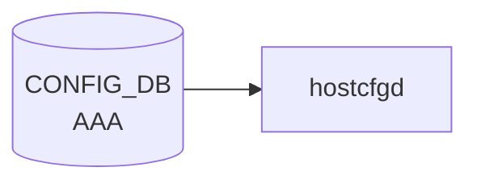

# AAA テーブル

## 概要

ログイン認証 (authentication) / 認可 (authorization) / アカウンティング (accounting) の手段優先順序を [CONFIG_DB](../../reference/glossary.md#term-config_db) に保持するテーブル[^1]。`hostcfgd` の [AAA](../../reference/glossary.md#term-aaa) ハンドラが読み出し、Linux PAM (`/etc/pam.d/common-auth`, `/etc/pam.d/sshd` 等) と nsswitch / sshd 設定を再生成する。

<!-- cdb-mermaid -->
### データフロー (自動生成)



!!! note "凡例"
    CONFIG_DB から SAI までの典型経路を `docs/reference/config-db-orch-map.md` から機械生成したミニ図。詳細・例外は本ページ本文と対応表を参照。
<!-- /cdb-mermaid -->

## key 構造

```text
AAA|<type>
```

`<type>` は enum `authentication` / `authorization` / `accounting`。

## フィールド

| フィールド | 型 | デフォルト | 説明 |
|-----------|----|-----------|------|
| `type` | enum `authentication`/`authorization`/`accounting` | - | [AAA](../../reference/glossary.md#term-aaa) 機能種別 (key) |
| `login` | string (カンマ区切り; `ldap`/`tacacs+`/`local`/`radius`/`default`) | `local` | 試行順序リスト |
| `failthrough` | boolean | `False` | true: あるメソッドが失敗したら次のメソッドに継続 |
| `fallback` | boolean | `False` | true: 全リモートメソッド失敗時に `local` にフォールバック |
| `debug` | boolean | `False` | [AAA](../../reference/glossary.md#term-aaa) デバッグログを有効化 |
| `trace` | boolean | `False` | AAA プロトコルパケットトレースを有効化 |

## 制約

- `login` の pattern: `((ldap|tacacs\+|local|radius|default),)*(ldap|tacacs\+|local|radius|default)` (重複チェックなし、順序のみ意味あり)
- `must` 制約: `type = authentication` で `login` に `tacacs+` を含めるなら `TACPLUS.global.passkey` が存在しなければエラー[^1]

## 購読者

- `hostcfgd` (`sonic-host-services` の AAA ハンドラ): [CONFIG_DB](../../reference/glossary.md#term-config_db) → PAM / nsswitch / sshd 再生成
- `pam_tacplus` / `pam_radius` / `pam_ldap` / `pam_unix`: PAM 経由で実際の認証を実行

## 関連 CONFIG_DB / YANG / CLI

- 関連 [CONFIG_DB](../../reference/glossary.md#term-config_db): [`TACPLUS_SERVER`](tacplus-server.md), [`RADIUS`](radius.md), [`LDAP_SERVER`](ldap-server.md)
- 関連 CLI: `config aaa authentication { login | failthrough | fallback | debug | trace }`
- 関連 [YANG](../../reference/glossary.md#term-yang): `sonic-system-aaa`

<!-- ref-triangle:start -->

## 関連リファレンス

- [YANG](../../reference/glossary.md#term-yang): [`sonic-system-aaa`](../yang/sonic-system-aaa.md)
- CLI: [`config aaa`](../cli/config-aaa.md)

<!-- ref-triangle:end -->

## 引用元

[^1]: `src/sonic-yang-models/yang-models/sonic-system-aaa.yang` (container `AAA` / list `AAA_LIST`、leaf `login` の pattern と TACACS+ passkey の must 制約). <https://github.com/sonic-net/sonic-buildimage/blob/9ea932ec2e18f35e58268ec2e4456b1d4afd65cd/src/sonic-yang-models/yang-models/sonic-system-aaa.yang>

## 関連ページ
- [CONFIG_DB: TACPLUS_SERVER](tacplus-server.md)
- [CONFIG_DB: LDAP_SERVER](ldap-server.md)

<!-- ops-hint -->
## 運用ヒント

### 典型値

- key 形式: `AAA|<service>` (service = `authentication` / `authorization` / `accounting`)`。
- `authentication.login`: `local` または `tacacs+,local` のチェイン。
- `failthrough`: `True` で前段失敗時に次の方式へフォールバック。

### よくある誤設定

- `tacacs+` 単独設定で全 TACACS+ サーバ到達不可になると login 不能。必ず `local` を末尾に残す。

### 確認コマンド

```bash
sonic-db-cli CONFIG_DB hgetall 'AAA|authentication'
show aaa
```
<!-- /ops-hint -->

<!-- glossary-links-injected: 8d5a139c8eba -->
