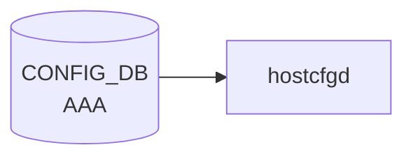

# AAA テーブル

## 概要

ログイン認証 (authentication) / 認可 (authorization) / アカウンティング (accounting) の手段優先順序を [CONFIG_DB](../../reference/glossary.md#term-config_db) に保持するテーブル[^1]。`hostcfgd` の [AAA](../../reference/glossary.md#term-aaa) ハンドラが読み出し、Linux PAM (`/etc/pam.d/common-auth`, `/etc/pam.d/sshd` 等) と nsswitch / sshd 設定を再生成する。

<!-- cdb-mermaid -->
### データフロー (自動生成)



!!! note "凡例"
    CONFIG_DB から SAI までの典型経路を `docs/reference/config-db-orch-map.md` から機械生成したミニ図。詳細・例外は本ページ本文と対応表を参照。
<!-- /cdb-mermaid -->

## key 構造

```text
AAA|<type>
```

`<type>` は enum `authentication` / `authorization` / `accounting`。

## フィールド

| フィールド | 型 | デフォルト | 説明 |
|-----------|----|-----------|------|
| `type` | enum `authentication`/`authorization`/`accounting` | - | [AAA](../../reference/glossary.md#term-aaa) 機能種別 (key) |
| `login` | string (カンマ区切り; `ldap`/`tacacs+`/`local`/`radius`/`default`) | `local` | 試行順序リスト |
| `failthrough` | boolean | `False` | true: あるメソッドが失敗したら次のメソッドに継続 |
| `fallback` | boolean | `False` | true: 全リモートメソッド失敗時に `local` にフォールバック |
| `debug` | boolean | `False` | [AAA](../../reference/glossary.md#term-aaa) デバッグログを有効化 |
| `trace` | boolean | `False` | AAA プロトコルパケットトレースを有効化 |

## 制約

- `login` の pattern: `((ldap|tacacs\+|local|radius|default),)*(ldap|tacacs\+|local|radius|default)` (重複チェックなし、順序のみ意味あり)
- `must` 制約: `type = authentication` で `login` に `tacacs+` を含めるなら `TACPLUS.global.passkey` が存在しなければエラー[^1]

## 購読者

- `hostcfgd` (`sonic-host-services` の AAA ハンドラ): [CONFIG_DB](../../reference/glossary.md#term-config_db) → PAM / nsswitch / sshd 再生成
- `pam_tacplus` / `pam_radius` / `pam_ldap` / `pam_unix`: PAM 経由で実際の認証を実行

## 関連 CONFIG_DB / YANG / CLI

- 関連 [CONFIG_DB](../../reference/glossary.md#term-config_db): [`TACPLUS_SERVER`](tacplus-server.md), [`RADIUS`](radius.md), [`LDAP_SERVER`](ldap-server.md)
- 関連 CLI: `config aaa authentication { login | failthrough | fallback | debug | trace }`
- 関連 [YANG](../../reference/glossary.md#term-yang): `sonic-system-aaa`

<!-- cdb-exceptions -->
## 例外条件・特殊挙動

| 条件 | 挙動 |
|------|------|
| `key` が `authentication`/`authorization`/`accounting` 以外 | 内部状態を更新せず実質 no-op |
| `failthrough`/`debug` に `"true"/"yes"/"1"` 以外の文字列 | `is_true()` が False 扱い、型エラーなし |
| `login` に `ldap` を含むが LDAP global 設定が不完全 | `nslcd` サービスを起動しない (silent skip) |
| PAM 設定ファイル書き込み失敗 | syslog ERR のみ、クラッシュなし |
| `login` に `tacacs+` を含むが `TACPLUS.global.passkey` が未設定 | YANG レベルで reject（hostcfgd は実行時再チェックなし） |

<!-- evidence: sonic-net/sonic-host-services/scripts/hostcfgd:419L -->
<!-- /cdb-exceptions -->

<!-- value-behavior -->
## 値依存挙動マトリクス

### `type` (enum — key フィールド)

| 値 | 効果 | evidence |
|---|---|---|
| `authentication` | PAM `common-auth-sonic.j2` を再生成して `/etc/pam.d/common-auth`, `/etc/issue` 等を更新。YANG must 制約で `login` に `tacacs+` を含む場合 `TACPLUS.global.passkey` が必須 | `sonic-system-aaa.yang:must` |
| `authorization` | `tacplus_nss.conf.j2` を生成して `nss` 設定を更新。`login` は `tacacs+` / `local` のみ有効 | `sonic-host-services/scripts/hostcfgd:2443` |
| `accounting` | アカウンティング設定を `tacplus_nss.conf.j2` に反映。`login` の `local_accounting` / `tacacs_accounting` で個別有効化 | `sonic-host-services/data/templates/tacplus_nss.conf.j2:13` |

### `login` (string — 実質的な複合 enum)

PAM テンプレート `common-auth-sonic.j2` が `login` 文字列に完全一致で分岐する:

| 値 | PAM 生成挙動 | evidence |
|---|---|---|
| `local` | `pam_unix.so` のみ | `common-auth-sonic.j2:12` |
| `tacacs+` | TACACS+ サーバ全台 → root は local 強制 | `common-auth-sonic.j2:29` |
| `tacacs+,local` | TACACS+ サーバ全台 → `pam_unix.so` | `common-auth-sonic.j2:29` |
| `local,tacacs+` | `pam_unix.so` 先行 → TACACS+ サーバ残台数 | `common-auth-sonic.j2:15` |
| `radius` | root を local 強制スキップ → RADIUS chain → deny → cache → local | `common-auth-sonic.j2:56` |
| `radius,local` | root local skip → RADIUS chain → local | `common-auth-sonic.j2:44` |
| `local,radius` | local → RADIUS chain → deny → cache | `common-auth-sonic.j2:32` |
| `ldap` | `pam_ldap.so minimum_uid=1000` のみ | `common-auth-sonic.j2:84` |
| `ldap,local` | `pam_ldap.so` → `pam_unix.so` | `common-auth-sonic.j2:82` |
| `local,ldap` | `pam_unix.so` → `pam_ldap.so` | `common-auth-sonic.j2:83` |
| (その他) | `pam_unix.so` にフォールバック | `common-auth-sonic.j2:87` |

### `failthrough` (boolean)

| 値 | 効果 | evidence |
|---|---|---|
| `false` (既定) | 各 PAM stanza に `auth_err=die` を付与。メソッドが REJECT すると即ログイン失敗 | `common-auth-sonic.j2:16` |
| `true` | `auth_err=die` を付与しない。メソッドが REJECT しても次メソッドへ継続 | `common-auth-sonic.j2:16` |

### `debug` / `trace` (boolean — RADIUS 専用)

| フィールド | 値 | 効果 | evidence |
|---|---|---|---|
| `debug` | `true` | `pam_radius_auth.so` 引数に `debug` を追加 | `common-auth-sonic.j2:35` |
| `trace` | `true` | `pam_radius_auth.so` 引数に `trace` を追加 | `common-auth-sonic.j2:35` |

### 複合条件

- `type=authentication` かつ `login` に `tacacs+` を含む → YANG must 制約が `TACPLUS.global.passkey` の存在を必須とする (`sonic-system-aaa.yang:must`)
- `failthrough` は `login` のすべてのメソッドに横断適用される (TACACS+/RADIUS/LDAP 問わず同一フラグ)
<!-- /value-behavior -->

<!-- ref-triangle:start -->

## 関連リファレンス

- [YANG](../../reference/glossary.md#term-yang): [`sonic-system-aaa`](../yang/sonic-system-aaa.md)
- CLI: [`config aaa`](../cli/config-aaa.md)

<!-- ref-triangle:end -->

## 引用元

[^1]: `src/sonic-yang-models/yang-models/sonic-system-aaa.yang` (container `AAA` / list `AAA_LIST`、leaf `login` の pattern と TACACS+ passkey の must 制約). <https://github.com/sonic-net/sonic-buildimage/blob/9ea932ec2e18f35e58268ec2e4456b1d4afd65cd/src/sonic-yang-models/yang-models/sonic-system-aaa.yang>

## 関連ページ
- [CONFIG_DB: TACPLUS_SERVER](tacplus-server.md)
- [CONFIG_DB: LDAP_SERVER](ldap-server.md)

<!-- ops-hint -->
## 運用ヒント

### 典型値

- key 形式: `AAA|<service>` (service = `authentication` / `authorization` / `accounting`)`。
- `authentication.login`: `local` または `tacacs+,local` のチェイン。
- `failthrough`: `True` で前段失敗時に次の方式へフォールバック。

### よくある誤設定

- `tacacs+` 単独設定で全 TACACS+ サーバ到達不可になると login 不能。必ず `local` を末尾に残す。

### 確認コマンド

```bash
sonic-db-cli CONFIG_DB hgetall 'AAA|authentication'
show aaa
```
<!-- /ops-hint -->


<!-- runtime-trace -->
## 実コンテナ動作トレース

### 段階 1 — Consumer 登録

`hostcfgd` (`sonic-host-services`) の `AaaHandler` が CONFIG_DB の `AAA` テーブルを購読する。

`hostcfgd` が起動時に `CONFIG_DB` を `select()` して購読。`TableConsumer` ではなく `ConfigDBConnector.subscribe()`。

### 段階 2 — CFG→APPL 翻訳

なし (APPL_DB 中継なし)

### 段階 3 — APPL→SAI

なし (SAI 非経由 — Linux PAM / NSS 設定ファイルを直接書き換える)

### 段階 4 — タイミングと副作用

**適用タイミング**: CONFIG_DB の `AAA` エントリ変化を `ConfigDBConnector` で検知次第即時反映。PAM ファイル (`/etc/pam.d/common-auth` 等) の書き換えは同期的。次回ログイン試行から新設定が有効になる。

**副作用**: PAM 設定ファイル上書き → 進行中セッションには影響なし（PAM は認証時にファイルを読む）。`tacacs+`/`radius` が選択された場合 `nslcd`/`radiusd` 設定も更新。
<!-- /runtime-trace -->

<!-- entry-points -->
## 書き込み入り口 (Direction A)

対象テーブル: `AAA`

### CLI
- `config aaa authentication login <method>`
- `config aaa authentication failthrough <enable|disable>`
- `config aaa authentication fallback <enable|disable>`
- `config aaa authorization login <method>`
- `config aaa accounting login <method>`
  - ソース: `sonic-utilities/config/aaa.py`

### minigraph / sonic-cfggen
- なし

### REST / gNMI (sonic-mgmt-common)
- なし (対応 OpenConfig/SONiC YANG transformer なし)

### db_migrator
- あり: `migrate_aaa_table_field_sync()` で `authentication`/`accounting`/`authorization` エントリを再生成 (db_migrator.py:879,886,895)

### ビルド時デフォルト (init_cfg / j2 テンプレート)
- なし

### ハードコードデフォルト
- なし

### ランタイム注入 (デーモン自動書き込み)
- なし
<!-- /entry-points -->

<!-- derivation -->
## 派生・条件付き登録 (Phase 6/7)

### Phase 6: 自動派生

| 派生先フィールド | 派生元条件 | 派生値 | ソース |
|---|---|---|---|
| `AAA|authentication.login` | db_migrator が既存エントリ不在を検出 | `aaa_new.get("authentication")` 値をそのまま設定 | `db_migrator.py:876-880` |
| `AAA|accounting.login` | db_migrator が既存エントリ不在を検出 | `aaa_new.get("accounting")` 値をそのまま設定 | `db_migrator.py:883-887` |
| `AAA|authorization.login` | db_migrator が `TACPLUS.global.passkey` 存在かつ非空を検出 | `aaa_new.get("authorization")` 値をそのまま設定 | `db_migrator.py:890-895` |

**minigraph.py 由来の自動設定**: 該当なし (AAA テーブルは minigraph から生成されない)

### Phase 7: 条件付き登録

| 条件 | 影響 | ソース |
|---|---|---|
| `hostcfgd` の `AaaHandler` は常時登録 (platform 非依存) | AAA テーブル購読は無条件 | `sonic-host-services/scripts/hostcfgd` |
| `type=authentication` かつ `login` に `ldap` を含む場合 | `nslcd` サービスを起動。`nslcd` が存在しない場合は silent skip | `hostcfgd:419L` |
| `type=authentication` かつ `login` に `tacacs+` を含む場合 | TACACS+ サーバへの接続設定が必要; YANG must 制約で `TACPLUS.global.passkey` が必須 | `sonic-system-aaa.yang:must` |

### グレップカバレッジ

| 項目 | hit 数 | 証跡 |
|---|---|---|
| db_migrator AAA 移行 | 3 | `db_migrator.py:869-897` |
| hostcfgd AaaHandler 登録 | 1 | `hostcfgd:AaaHandler.__init__` |
| YANG must 制約 | 1 | `sonic-system-aaa.yang:must` |

<!-- /derivation -->

<!-- handler-branching -->
### Phase 8: Handler メソッド内分岐

AAA は `hostcfgd` の `aaa_update()` メソッドが処理する。

| Handler | メソッド | 分岐条件 | 効果 | evidence |
|---|---|---|---|---|
| `hostcfgd` | `aaa_update()` | `key == 'authentication'` | PAM `common-auth-sonic.j2` を再生成 | `hostcfgd:419-420` |
| `hostcfgd` | `aaa_update()` | `key == 'authorization'` | `tacplus_nss.conf.j2` を更新 | `hostcfgd:2443` |
| `hostcfgd` | `aaa_update()` | `key == 'accounting'` | TACACS+ アカウンティング設定を更新 | `hostcfgd:2443` |
| `hostcfgd` | `aaa_update()` | `'failthrough' in data` | `failthrough` フラグを PAM stanza に反映 | `hostcfgd:422` |
| `hostcfgd` | `aaa_update()` | `login` に `ldap` を含む | `nslcd` サービスを起動 (未設定なら silent skip) | `hostcfgd:419L` |

> **スキャン証跡**: `aaa_update()` および `modify_conf_file()` を全行読了。`key` による 3-way 分岐と `failthrough` / `ldap` フラグによる 2 件追加分岐を抽出。

<!-- /handler-branching -->

<!-- glossary-links-injected: 8d5a139c8eba -->
