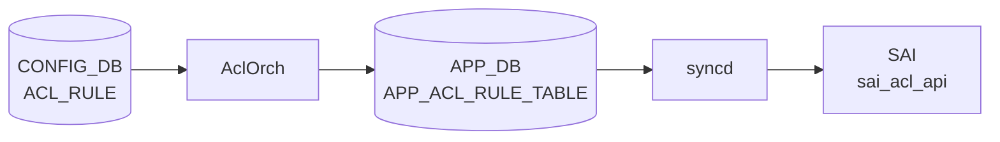

# ACL_RULE テーブル

## 概要

`ACL_TABLE` 内の個別ルールを定義する。優先度、match 条件 (5-tuple、TCP flags、TC、ICMP、tunnel inner、metadata 等)、action (PACKET_ACTION、REDIRECT、MIRROR、COUNTER、[DSCP](../../reference/glossary.md#term-dscp) 上書き、DTel 等) を持つ[^1]。`AclOrch` が `ACL_TABLE` 配下のルールを [SAI](../../reference/glossary.md#term-sai) [ACL](../../reference/glossary.md#term-acl) entry として展開する。

!!! warning "YANG 未定義"
    `ACL_RULE` テーブルは YANG モジュールで未定義。スキーマの正本は `sonic-swss/orchagent/aclorch.{h,cpp}`。

<!-- cdb-mermaid -->
### データフロー (自動生成)



!!! note "凡例"
    CONFIG_DB から SAI までの典型経路を `docs/reference/config-db-orch-map.md` から機械生成したミニ図。詳細・例外は本ページ本文と対応表を参照。
<!-- /cdb-mermaid -->

## key 構造

```text
ACL_RULE|<table_name>|<rule_name>
```

`<table_name>` は `ACL_TABLE.name` を参照（実装上は名前一致のみで leafref はない）。

## 共通フィールド

| フィールド | 型 | 説明 |
|-----------|----|------|
| `PRIORITY` | uint32 | ルール評価順位。値が大きいほど優先 |
| `PACKET_ACTION` | enum `FORWARD`/`DROP`/`DO_NOT_NAT`/etc | 既定アクション |

## match フィールド (代表)

| 名前 | 値 |
|------|----|
| `IN_PORTS` / `OUT_PORT` / `OUT_PORTS` | カンマ区切り PORT 名 |
| `SRC_IP` / `DST_IP` | IPv4 prefix |
| `SRC_IPV6` / `DST_IPV6` | IPv6 prefix |
| `L4_SRC_PORT` / `L4_DST_PORT` | TCP/UDP ポート |
| `L4_SRC_PORT_RANGE` / `L4_DST_PORT_RANGE` | range `<min>..<max>` |
| `ETHER_TYPE` | uint16（hex 可） |
| `IP_PROTOCOL` / `NEXT_HEADER` | uint8 |
| `VLAN_ID` | uint16 |
| `TCP_FLAGS` | `<flags>/<mask>` |
| `IP_TYPE` | enum (`ANY`/`IP`/`NON_IP`/`IPV4ANY`/`IPV6ANY`/...) |
| `DSCP` / `TC` | [DSCP](../../reference/glossary.md#term-dscp) / TC 値 |
| `ICMP_TYPE` / `ICMP_CODE` / `ICMPV6_TYPE` / `ICMPV6_CODE` | ICMP |
| `TUNNEL_VNI` | VNI |
| `INNER_ETHER_TYPE` / `INNER_IP_PROTOCOL` / `INNER_L4_SRC_PORT` / `INNER_L4_DST_PORT` | inner header |
| `INNER_SRC_MAC` / `INNER_DST_MAC` / `INNER_SRC_IP` | inner header |
| `BTH_OPCODE` / `AETH_SYNDROME` | [RoCE](../../reference/glossary.md#term-roce) 用 |
| `TUNNEL_TERM` | bool |
| `META_DATA` | uint32 |

## action フィールド (代表)

| 名前 | 説明 |
|------|------|
| `PACKET_ACTION` | `FORWARD` / `DROP` 等 |
| `REDIRECT_ACTION` | redirect 先（next-hop / mirror セッション 等） |
| `DO_NOT_NAT_ACTION` | [NAT](../../reference/glossary.md#term-nat) バイパス |
| `DISABLE_TRIM_ACTION` | バッファ trim 無効化 |
| `MIRROR_ACTION` / `MIRROR_INGRESS_ACTION` / `MIRROR_EGRESS_ACTION` | mirror セッション参照 |
| `FLOW_OP` / `INT_SESSION` / `DROP_REPORT_ENABLE` / `TAIL_DROP_REPORT_ENABLE` / `FLOW_SAMPLE_PERCENT` / `REPORT_ALL_PACKETS` | DTel (`DTEL_*`) |
| `COUNTER` | カウンタ装着 |
| `META_DATA_ACTION` | metadata 上書き |
| `DSCP_ACTION` | [DSCP](../../reference/glossary.md#term-dscp) 上書き |
| `INNER_SRC_MAC_REWRITE_ACTION` | inner SRC MAC rewrite |

ユーザ定義型 (`ACL_TABLE_TYPE`) を使う場合、ここで使える match / action は `ACL_TABLE_TYPE.MATCHES` / `.ACTIONS` で許可された集合に限られる。

## 購読者

- `orchagent` `AclOrch`: [SAI](../../reference/glossary.md#term-sai) [ACL](../../reference/glossary.md#term-acl) entry を生成
- `mirrororch`: `MIRROR_*_ACTION` 経由で連動
- `copporch`: `CTRLPLANE` 種別の `ACL_TABLE` 配下のルールに連動

## 関連 CONFIG_DB / YANG / CLI

- 関連 [CONFIG_DB](../../reference/glossary.md#term-config_db): `ACL_TABLE`、`MIRROR_SESSION`、`POLICER`
- 関連 CLI: [`config acl`](../cli/config-acl.md)
- 関連 [YANG](../../reference/glossary.md#term-yang): なし

<!-- cdb-exceptions -->
## 例外条件・特殊挙動

| 条件 | 挙動 |
|------|------|
| key の TABLE_ID が空文字 | WARN ログ後 erase、skip |
| 対応する ACL_TABLE が未作成 | 待機 (`it++`)、テーブル作成後に再試行 |
| コントロールプレーンテーブルのルール | INFO ログ後 erase、skip |
| `AclRule::makeShared` が例外 | ERROR ログ後 erase & 関数 return（処理中断） |
| 未知/不正な属性名 | rule INACTIVE、erase |
| `MATCH_TCP_FLAGS` あり・IP_PROTOCOL 未指定 | IP_PROTOCOL=6 (TCP) を自動付与 |
| IPv4 と IPv6 matchfield 混在（L3V4V6 テーブル） | `bAllAttributesOk=false`、rule INACTIVE |
| [SAI](../../reference/glossary.md#term-sai) リソース枯渇 | retry キャッシュに退避、リソース解放後に再試行 |
| IN_PORTS/OUT_PORTS に非物理 IF | `return false`、rule INACTIVE |
| [VLAN](../../reference/glossary.md#term-vlan) ID 範囲外 | `return false`、rule INACTIVE |
| Range 形式不正 | `return false`、rule INACTIVE |

<!-- evidence: sonic-net/sonic-swss/orchagent/aclorch.cpp:5520L -->
<!-- /cdb-exceptions -->

<!-- value-behavior -->
## 値依存挙動マトリクス

### `PACKET_ACTION` 値別挙動

YANG 定義値: `FORWARD` / `DROP` / `REDIRECT` (sonic-acl.yang:114-116)。
実装 lookup map: `aclPacketActionLookup` (aclorch.cpp:143)。マクロ定数: `PACKET_ACTION_FORWARD` / `PACKET_ACTION_DROP` / `PACKET_ACTION_COPY` / `PACKET_ACTION_REDIRECT` / `PACKET_ACTION_DO_NOT_NAT` / `PACKET_ACTION_DISABLE_TRIM` (aclorch.h:83-88)。

| 値 | SAI マッピング | 効果 | evidence |
|---|---|---|---|
| `FORWARD` | `SAI_PACKET_ACTION_FORWARD` | パケットを通過させる (`PACKET_ACTION_FORWARD`) | `aclorch.h:83`, `aclorch.cpp:145` |
| `DROP` | `SAI_PACKET_ACTION_DROP` | パケットをドロップ (`PACKET_ACTION_DROP`) | `aclorch.h:84`, `aclorch.cpp:146` |
| `COPY` | `SAI_PACKET_ACTION_COPY` | パケットを CPU コピー後に続行 (`PACKET_ACTION_COPY`、YANG 外) | `aclorch.h:85`, `aclorch.cpp:147` |
| `REDIRECT` | oid 解決後に redirect | `REDIRECT:<target>` 形式 (`PACKET_ACTION_REDIRECT`)。コロンなし / ターゲット空は `return false` → rule INACTIVE | `aclorch.h:86`, `aclorch.cpp:2013-2040` |
| `DO_NOT_NAT` | — | [NAT](../../reference/glossary.md#term-nat) 処理をバイパス (`PACKET_ACTION_DO_NOT_NAT`、YANG 外) | `aclorch.h:87` |
| `DISABLE_TRIM` | — | バッファ trim を無効化 (`PACKET_ACTION_DISABLE_TRIM`、YANG 外) | `aclorch.h:88` |

!!! note "REDIRECT 後方互換"
    `ACTION_PACKET_ACTION` フィールドに `REDIRECT:<target>` を書く旧形式が後方互換として残る。新形式は `REDIRECT_ACTION` フィールドを使う (`aclorch.cpp:2013`)。

### `IP_TYPE` 値別挙動

YANG 定義値 7 種 (sonic-acl.yang:122-130)。実装 lookup map: `aclIpTypeLookup` (aclorch.cpp:501)。マクロ定数: `IP_TYPE_ANY` / `IP_TYPE_IP` / `IP_TYPE_NON_IP` / `IP_TYPE_IPv4ANY` / `IP_TYPE_NON_IPv4` / `IP_TYPE_IPv6ANY` / `IP_TYPE_NON_IPv6` / `IP_TYPE_ARP` / `IP_TYPE_ARP_REQUEST` / `IP_TYPE_ARP_REPLY` (aclorch.h:98-107)。
YANG は `mandatory true` のため省略不可。

| 値 | SAI マッピング | 意味 | evidence |
|---|---|---|---|
| `ANY` | `SAI_ACL_IP_TYPE_ANY` | IP/非IP 問わず全パケット (`IP_TYPE_ANY`) | `aclorch.h:98`, `aclorch.cpp:503` |
| `IP` | `SAI_ACL_IP_TYPE_IP` | IPv4 または IPv6 パケット (`IP_TYPE_IP`) | `aclorch.h:99`, `aclorch.cpp:504` |
| `IPV4` | `SAI_ACL_IP_TYPE_IPV4ANY` | IPv4 パケット (YANG のみ、実装上 `IP_TYPE_IPv4ANY` と同義) | `sonic-acl.yang:125` |
| `IPV4ANY` | `SAI_ACL_IP_TYPE_IPV4ANY` | IPv4 パケット (`IP_TYPE_IPv4ANY`) | `aclorch.h:101`, `aclorch.cpp:506` |
| `NON_IPV4` | `SAI_ACL_IP_TYPE_NON_IPV4` | 非 IPv4 パケット (`IP_TYPE_NON_IPv4`) | `aclorch.h:102`, `aclorch.cpp:507` |
| `IPV6ANY` | `SAI_ACL_IP_TYPE_IPV6ANY` | IPv6 パケット (`IP_TYPE_IPv6ANY`) | `aclorch.h:103`, `aclorch.cpp:508` |
| `NON_IPV6` | `SAI_ACL_IP_TYPE_NON_IPV6` | 非 IPv6 パケット (`IP_TYPE_NON_IPv6`) | `aclorch.h:104`, `aclorch.cpp:509` |
| `ARP` | `SAI_ACL_IP_TYPE_ARP` | [ARP](../../reference/glossary.md#term-arp) パケット (`IP_TYPE_ARP`、実装のみ、YANG 外) | `aclorch.h:105`, `aclorch.cpp:510` |
| `ARP_REQUEST` | `SAI_ACL_IP_TYPE_ARP_REQUEST` | [ARP](../../reference/glossary.md#term-arp) Request (`IP_TYPE_ARP_REQUEST`、実装のみ) | `aclorch.h:106`, `aclorch.cpp:511` |
| `ARP_REPLY` | `SAI_ACL_IP_TYPE_ARP_REPLY` | [ARP](../../reference/glossary.md#term-arp) Reply (`IP_TYPE_ARP_REPLY`、実装のみ) | `aclorch.h:107`, `aclorch.cpp:512` |

### `ETHER_TYPE` 値別挙動

YANG pattern で 7 値に制限 (sonic-acl.yang:142)。実装では任意 uint16 を受理 (aclorch.cpp:1066)。
格納値は `0x` プレフィックス付き hex 文字列。`stoul(str, &idx, 0)` で auto 判定 (`converter.h:18` の変換関数)。
マスク: `0xFFFF` (完全一致) で `SAI_ACL_ENTRY_ATTR_FIELD_ETHER_TYPE` として SAI に投入 (aclorch.cpp:1067)。

| 値 | プロトコル | 意味 | evidence |
|---|---|---|---|
| `0x88CC` | LLDP | Link Layer Discovery Protocol | `sonic-acl.yang:142` |
| `0x8100` | IEEE 802.1Q | VLAN タグ付きフレーム | `sonic-acl.yang:142` |
| `0x8915` | [RoCE](../../reference/glossary.md#term-roce) | RDMA over Converged Ethernet | `sonic-acl.yang:142` |
| `0x0806` | [ARP](../../reference/glossary.md#term-arp) | Address Resolution Protocol | `sonic-acl.yang:142` |
| `0x0800` | IPv4 | Internet Protocol version 4 | `sonic-acl.yang:142` |
| `0x86DD` | IPv6 | Internet Protocol version 6 | `sonic-acl.yang:142` |
| `0x8847` | [MPLS](../../reference/glossary.md#term-mpls) | MPLS ユニキャスト | `sonic-acl.yang:142` |

### `stage` 値別挙動 (ACL_TABLE から継承)

ACL_RULE 自体に `stage` フィールドはないが、所属 ACL_TABLE の stage により使用可能な action が変わる。

| 値 | SAI stage | MIRROR action | evidence |
|---|---|---|---|
| `INGRESS` (既定) | `SAI_ACL_STAGE_INGRESS` | `MIRROR_INGRESS_ACTION` 有効 | `aclorch.cpp:166,173,263-266` |
| `EGRESS` | `SAI_ACL_STAGE_EGRESS` | `MIRROR_EGRESS_ACTION` のみ有効 | `aclorch.cpp:167,185,270-272` |

### `type` 値別挙動 (ACL_TABLE から継承)

ACL_RULE で使用可能な match / action は ACL_TABLE の `type` によって決まる。

| 値 | 使用可能な主 action | 備考 | evidence |
|---|---|---|---|
| `L3` | `PACKET_ACTION`, `REDIRECT_ACTION` | 通常 IPv4 ACL | `acltable.h:26`, `aclorch.cpp:200,454` |
| `L3V6` | `PACKET_ACTION`, `REDIRECT_ACTION` | IPv6 ACL。`IP_PROTOCOL` は非推奨 | `acltable.h:27`, `aclorch.cpp:220,1231` |
| `MIRROR` | `MIRROR_INGRESS_ACTION` | ASIC capability 必須 | `acltable.h:29`, `aclorch.cpp:260,3502` |
| `MIRRORV6` | `MIRROR_INGRESS_ACTION` / `MIRROR_EGRESS_ACTION` | ASIC capability 照会、一部統合 | `acltable.h:30`, `aclorch.cpp:279,3503,5811` |

### 値別 grep カバレッジ

| フィールド | 値数 | 0 hit | 証跡ファイル |
|---|---|---|---|
| `PACKET_ACTION` | 3 (YANG) / 6 (実装) | 0 | aclorch.h, aclorch.cpp |
| `IP_TYPE` | 7 (YANG) / 10 (実装) | 0 | aclorch.h, aclorch.cpp, sonic-acl.yang |
| `ETHER_TYPE` | 7 | 0 | sonic-acl.yang, aclorch.cpp |
| `stage` (継承) | 2 | 0 | aclorch.cpp |
| `type` (継承) | 4 (YANG) | 0 | acltable.h, aclorch.cpp |

### 複合条件

1. `MATCH_TCP_FLAGS` あり + `IP_PROTOCOL` 未指定 → `IP_PROTOCOL=6 (TCP)` 自動付与 (`aclorch.cpp:5640-5660`)
2. `IP_TYPE=IPV4ANY` / `IPV4` + `SRC_IPV6` 同一ルール混在 → `bAllAttributesOk=false` → rule INACTIVE (`aclorch.cpp:5636-5658`)
3. YANG `choice ip_src_dst` — `IP_TYPE` が IPv4 系なら `SRC_IP`/`DST_IP` のみ有効、IPv6 系なら `SRC_IPV6`/`DST_IPV6` のみ有効 (`sonic-acl.yang:150-168`)
4. `type=MIRROR`/`MIRRORV6` + stage=EGRESS → `MIRROR_EGRESS_ACTION` のみ有効 (`aclorch.cpp:270-272`)
5. `PACKET_ACTION=REDIRECT:` のコロン後ターゲット欠如 → `return false` → rule INACTIVE (`aclorch.cpp:2020-2028`)
<!-- /value-behavior -->

<!-- derivation -->
## 派生・条件付き登録 (Phase 6/7)

### Phase 6: 自動派生

| 派生先フィールド | 派生元条件 | 派生値 | ソース |
|---|---|---|---|
| `IP_PROTOCOL` / `NEXT_HEADER` | `MATCH_TCP_FLAGS` あり + `IP_PROTOCOL` 未指定 | `6` (TCP) | `aclorch.cpp:5632-5660` |
| `stage` (ACL_TABLE 継承) | 所属 `ACL_TABLE.stage` | `INGRESS` → `MIRROR_INGRESS_ACTION` 有効 / `EGRESS` → `MIRROR_EGRESS_ACTION` のみ | `aclorch.cpp:263-272` |
| `type` (ACL_TABLE 継承) | 所属 `ACL_TABLE.type` | `L3` / `L3V6` / `MIRROR` 等によって使用可能な match / action が決まる | `aclorch.cpp:200,220,260` |

**minigraph.py 由来の自動設定** (`minigraph.py:1103-1228`):

- XML `InAcl` タグ → `stage=ingress`、`OutAcl` タグ → `stage=egress`
- AttachTo に `erspan` prefix → `type=MIRROR`、`erspanv6` → `type=MIRRORV6`、`erspan_dscp` → `type=MIRROR_DSCP`
- ports なし (CTRLPLANE) → `type=CTRLPLANE`、`stage` 設定あり
- それ以外: ACL 名に `v6` を含む → `type=L3V6`、含まない → `type=L3`

### Phase 7: 条件付き登録

| 条件 | 影響 | ソース |
|---|---|---|
| `AclOrch` は常時登録 (platform 非依存) | ACL_TABLE / ACL_RULE 購読は無条件 | `orchdaemon.cpp:533,569` |
| `DTelOrch` は `platform==BFN\|VS` かつ capability あり のみ生成 | DTelOrch なし → DTEL 系 action (`FLOW_OP`, `INT_SESSION` 等) が機能しない | `orchdaemon.cpp:502-530` |
| `type=MIRROR`/`MIRRORV6` + ASIC capability なし | 起動時 SAI capability query 失敗 → ACL_TABLE 作成 reject | `aclorch.cpp:3500-3541` |
| `type=L3V4V6` + ASIC 未サポート | `isAclL3V4V6TableSupported()` → false → reject | `aclorch.cpp:2737-2739` |
| `META_DATA` 系 action + capability なし | `sai_query_attribute_capability()` で確認後に有効化 | `aclorch.cpp:3590-3659` |

### グレップカバレッジ

| 項目 | hit 数 | 証跡 |
|---|---|---|
| TCP 自動付与 (`bHasTCPFlag` + `TCP_PROTOCOL_NUM`) | 3 | `aclorch.cpp:54,5633-5648` |
| minigraph.py `type` 派生 | 6 | `minigraph.py:1218-1228` |
| DTelOrch 条件起動 | 2 | `orchdaemon.cpp:522,527-530` |
| MIRROR capability check | 4 | `aclorch.cpp:3500-3541,5198-5199` |

<!-- /derivation -->

<!-- handler-branching -->
### Phase 8: Handler メソッド内分岐

ACL_RULE は `AclOrch::doAclRuleTask()` が処理する。同メソッド内で ACL_TABLE の `type` / `stage` フィールド値を読み取り、ルールの処理方法を分岐する。

| Handler | メソッド | 分岐条件 | 効果 | evidence |
|---|---|---|---|---|
| `AclOrch` | `doAclRuleTask()` | `table_id.empty()` | 早期 WARN + erase（TABLE_ID 欠如はルール無効） | `sonic-swss/orchagent/aclorch.cpp:5536-5540` |
| `AclOrch` | `doAclRuleTask()` | `table_oid == SAI_NULL_OBJECT_ID` かつ `m_ctrlAclTables.find(table_id) != end` | INFO ログ + erase（コントロールプレーンルールをスキップ）| `sonic-swss/orchagent/aclorch.cpp:5556-5561` |
| `AclOrch` | `doAclRuleTask()` | `table_oid == SAI_NULL_OBJECT_ID` かつ ACL_TABLE 未作成 | `it++`（テーブル作成まで待機） | `sonic-swss/orchagent/aclorch.cpp:5563-5565` |
| `AclOrch` | `doAclRuleTask()` | `type IN [TABLE_TYPE_MIRROR, TABLE_TYPE_MIRRORV6]` | `table_id == m_mirrorTableId[stage]` により MIRROR / MIRRORV6 を再判定 | `sonic-swss/orchagent/aclorch.cpp:5570-5573` |
| `AclOrch` | `doAclRuleTask()` | `bHasTCPFlag && !bHasIPProtocol` かつ `type IN [MIRRORV6, L3V6]` | `IP_PROTOCOL` 自動付与: `MATCH_NEXT_HEADER=6` (IPv6) | `sonic-swss/orchagent/aclorch.cpp:5636-5638` |
| `AclOrch` | `doAclRuleTask()` | `bHasTCPFlag && !bHasIPProtocol` かつ `type` が上記以外 | `IP_PROTOCOL` 自動付与: `MATCH_IP_PROTOCOL=6` (IPv4) | `sonic-swss/orchagent/aclorch.cpp:5640-5643` |
| `AclOrch` | `doAclRuleTask()` | `bHasIPV4 && bHasIPV6 && type == TABLE_TYPE_L3V4V6` | ERROR + `bAllAttributesOk=false` → rule INACTIVE（v4/v6 混在不可） | `sonic-swss/orchagent/aclorch.cpp:5656-5663` |

> **スキャン証跡**: `doAclRuleTask()` L5520-5700 を全行読了、7 件分岐抽出。`type` / `stage` は ACL_RULE 自体のフィールドではなく ACL_TABLE から継承した値を参照。Phase 6/7 derivation ブロックの evidence 再確認: TCP 自動付与・minigraph 派生・DTelOrch 条件起動は実ソースと整合（`aclorch.cpp:5632-5660`、`minigraph.py:1218-1228`、`orchdaemon.cpp:502-530`）— 誤読なし。

<!-- /handler-branching -->

<!-- ref-triangle:start -->

## 関連リファレンス

- CLI: [`config acl`](../cli/config-acl.md)

<!-- ref-triangle:end -->

## 引用元

[^1]: match / action のキー名は `sonic-swss/orchagent/aclorch.h` の `MATCH_*` / `ACTION_*` マクロ定義から抽出。<https://github.com/sonic-net/sonic-swss/blob/4305596156d70e9797e8a881b3d19b46de0bce0d/orchagent/aclorch.h>

## 関連ページ
- [HLD: ACL の基本設計](../../acl-qos/acl-support-in-sonic.md)
- [CLI: config acl](../cli/config-acl.md)
- [CLI: show acl](../cli/show-acl.md)
- [CONFIG_DB: ACL_TABLE](acl-table.md)

<!-- topics-back-ref -->
## 関連 Topics

- [Topics: ACL / CoPP / Mirror / Packet Action](../../topics/07-acl-copp-mirror/index.md)

<!-- /topics-back-ref -->

<!-- ops-hint -->
## 運用ヒント

### 典型値

- key 形式: `ACL_RULE|<table-name>|<rule-name>`。
- `priority`: 0..65535（大きいほど優先）。9999 等の値を運用で使う。
- `packet_action`: `FORWARD` / `DROP` / `REDIRECT:<nh>`。
- match: `src_ip` / `dst_ip` / `l4_src_port` / `ip_protocol` 等。

### よくある誤設定

- 同じ `priority` を複数 rule で使うと適用順が ASIC 依存で予測不能。
- `SRC_IP` を V6 テーブルに入れると無視され、rule が hit せず原因不明になる。`SRC_IPV6` を使う。
- `packet_action: REDIRECT:` の nexthop 解決が失敗すると rule が install されない（syslog 確認）。

### 確認コマンド

```bash
sonic-db-cli CONFIG_DB keys 'ACL_RULE|EVERFLOW|*'
aclshow -a -t EVERFLOW
```
<!-- /ops-hint -->

<!-- entry-points -->
## 書き込み入り口 (Direction A)

CONFIG_DB の `ACL_RULE` テーブルを書き込むコードパスを網羅する。

### CLI — acl_loader

`sonic-utilities/acl_loader/main.py` — `acl-loader update full / incremental / delete`

**full update** (`full_update()` L850):

```python
configdb.mod_entry(ACL_RULE, key, None)           # 既存全削除
configdb.mod_config({ACL_RULE: rules_info})        # 新規一括書き込み
```

入力プロトコル: JSON ファイル（OpenConfig ACL 形式）— `<filename>` 引数で指定

**incremental update** (`incremental_update()` L871):

```python
configdb.mod_entry(ACL_RULE, key, value)           # 追加
configdb.mod_entry(ACL_RULE, key, None)            # 削除
configdb.set_entry(ACL_RULE, key, value)           # 内容変更
```

dataplane ACL は full update 方式、controlplane ACL は差分更新。

**delete** (`delete()` L946):

```python
configdb.set_entry(ACL_RULE, key, None)
```

Multi-ASIC: 各 namespace の `namespace_configdb` にも同じ操作を適用。

**デフォルト deny ルール自動追加** (`createDefaultDenyAclRule()` L1138):

`full_update` の末尾で priority=0 の DROP ルールを自動追加する。

### REST / gNMI

`sonic-mgmt-common/translib/acl_app.go:1062-1418`

- REST path: `PATCH /openconfig-acl:acl/acl-sets/acl-set/{name}/{type}/acl-entries/acl-entry/{seq}`
- gNMI path: `/openconfig-acl:acl/acl-sets/acl-set[...]/acl-entries/acl-entry[seq-id=...]`
- `convertOCAclRulesToInternal()` でルール変換後、`d.SetEntry(app.ruleTs, db.Key{Comp: []string{aclKey, ruleKey}}, ...)` で CONFIG_DB の ACL_RULE に書き込み

### minigraph

なし。`minigraph.py` は ACL_RULE を生成しない（ACL_TABLE のみ）。

### db_migrator

なし。ACL_RULE の migration ステップは `db_migrator.py` に存在しない。

### build-time デフォルト

なし。`init_cfg.json.j2` および `qos_config.j2` に ACL_RULE エントリは存在しない。

### hard-coded デフォルト

`acl_loader` の `createDefaultDenyAclRule()` (L1138) が `full_update` 時に priority=0 の DROP ルールを自動追加する（これは build-time ではなく CLI 実行時の動作）。

### 死活 (runtime injection)

`orchagent` の `AclOrch` は ACL_RULE を購読するのみ（書き込みなし）。

<!-- /entry-points -->

<!-- runtime-trace -->
## 起動経路 (Direction B: CFG → APPL → SAI)

### 段階 1: Consumer 登録

`orchdaemon.cpp:410,413` で `CONFIG_DB / ACL_RULE` (`"ACL_RULE"`) と `APP_DB / ACL_RULE_TABLE` (`"ACL_RULE_TABLE"`) の `TableConnector` を作成し `AclOrch` コンストラクタに渡す。`doTask()` (`aclorch.cpp:4287`) で `table_name` が `CFG_ACL_RULE_TABLE_NAME` または `APP_ACL_RULE_TABLE_NAME` に一致すると `doAclRuleTask()` に委譲。retry キャッシュも登録 (`aclorch.cpp:4221`) 。追加コンシューマ: `MirrorOrch` (`MIRROR_*_ACTION` 連動)、`CoppOrch` (`CTRLPLANE` 種別)、`NatMgr` (`cfgmgr/natmgrd.cpp:120`)。

### 段階 2: CFG → APPL 翻訳

`ACL_RULE` も `cfgmgr` 中間層なし。`AclOrch` が `CONFIG_DB` を直接購読する。`APP_DB` への中間書き込みなし。主な変換 (`doAclRuleTask()`, `aclorch.cpp:5520`):

| CFG フィールド | 変換 | SAI 属性 |
|---|---|---|
| `PRIORITY` | uint32 そのまま | `SAI_ACL_ENTRY_ATTR_PRIORITY` |
| `PACKET_ACTION` | `aclPacketActionLookup` ルックアップ | `SAI_ACL_ENTRY_ATTR_ACTION_PACKET_ACTION` |
| `IP_TYPE` | `aclIpTypeLookup` ルックアップ | `SAI_ACL_ENTRY_ATTR_FIELD_ACL_IP_TYPE` |
| `ETHER_TYPE` | `stoul(str, &idx, 0)` hex 変換、mask `0xFFFF` | `SAI_ACL_ENTRY_ATTR_FIELD_ETHER_TYPE` |
| `MATCH_TCP_FLAGS` + `IP_PROTOCOL` 未指定 | `IP_PROTOCOL=6` を自動付与 (`aclorch.cpp:5640`) | `SAI_ACL_ENTRY_ATTR_FIELD_IP_PROTOCOL` |
| `REDIRECT_ACTION` | next-hop / mirror セッション OID 解決 | `SAI_ACL_ENTRY_ATTR_ACTION_REDIRECT` |

暗黙追加: `SAI_ACL_ENTRY_ATTR_TABLE_ID` (所属 ACL_TABLE の OID) を常に create 時に付与。

### 段階 3: APPL → SAI

`AclRule::create()` → `sai_acl_api->create_acl_entry(&m_ruleOid, gSwitchId, attrs, ...)` (`aclorch.cpp:1344`)。設定 SAI 属性: `SAI_ACL_ENTRY_ATTR_TABLE_ID`、`SAI_ACL_ENTRY_ATTR_PRIORITY`、`SAI_ACL_ENTRY_ATTR_FIELD_*` (match 群)、`SAI_ACL_ENTRY_ATTR_ACTION_*` (action 群)。ランタイム更新は `sai_acl_api->set_acl_entry_attribute(m_ruleOid, &attr)` (`aclorch.cpp:1466`) — match / action は **mutable**。

### 段階 4: タイミング・副作用

- **config reload**: warm start 非対応。reload 時は全ルールを再作成。ACL_TABLE が未作成なら `it++` で待機し、テーブル作成後に再処理される (`aclorch.cpp:5563-5565`)。
- **runtime 変更 (SET)**: 既存ルール検出時は `AclRule::update()` → `set_acl_entry_attribute()` で差分適用。match / action は runtime mutable。
- **warm-restart**: `AclOrch` は `onWarmBootEnd()` を実装しない。orchagent 全体の `warmRestoreAndSyncUp()` (`orchdaemon.cpp:872`) でリカバリ。
- **SAI resource 枯渇**: `SAI_STATUS_INSUFFICIENT_RESOURCES` 時に retry キャッシュへ退避、リソース解放後に再試行 (`aclorch.cpp:4221`)。
- **STATE_DB 書き込み**: ルール作成/削除時に `STATE_ACL_RULE_TABLE_NAME` (`"ACL_RULE_TABLE"`) へステータスを書き込む (`aclorch.cpp:3479`)。

<!-- /runtime-trace -->

<!-- glossary-links-injected: a78cb4c857bd -->
