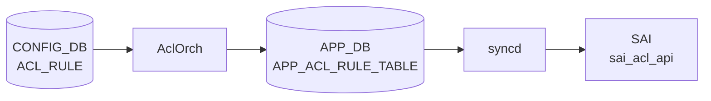

# ACL_RULE テーブル

## 概要

`ACL_TABLE` 内の個別ルールを定義する。優先度、match 条件 (5-tuple、TCP flags、TC、ICMP、tunnel inner、metadata 等)、action (PACKET_ACTION、REDIRECT、MIRROR、COUNTER、[DSCP](../../reference/glossary.md#term-dscp) 上書き、DTel 等) を持つ[^1]。`AclOrch` が `ACL_TABLE` 配下のルールを [SAI](../../reference/glossary.md#term-sai) [ACL](../../reference/glossary.md#term-acl) entry として展開する。

!!! warning "YANG 未定義"
    `ACL_RULE` テーブルは YANG モジュールで未定義。スキーマの正本は `sonic-swss/orchagent/aclorch.{h,cpp}`。

<!-- cdb-mermaid -->
### データフロー (自動生成)



!!! note "凡例"
    CONFIG_DB から SAI までの典型経路を `docs/reference/config-db-orch-map.md` から機械生成したミニ図。詳細・例外は本ページ本文と対応表を参照。
<!-- /cdb-mermaid -->

## key 構造

```text
ACL_RULE|<table_name>|<rule_name>
```

`<table_name>` は `ACL_TABLE.name` を参照（実装上は名前一致のみで leafref はない）。

## 共通フィールド

| フィールド | 型 | 説明 |
|-----------|----|------|
| `PRIORITY` | uint32 | ルール評価順位。値が大きいほど優先 |
| `PACKET_ACTION` | enum `FORWARD`/`DROP`/`DO_NOT_NAT`/etc | 既定アクション |

## match フィールド (代表)

| 名前 | 値 |
|------|----|
| `IN_PORTS` / `OUT_PORT` / `OUT_PORTS` | カンマ区切り PORT 名 |
| `SRC_IP` / `DST_IP` | IPv4 prefix |
| `SRC_IPV6` / `DST_IPV6` | IPv6 prefix |
| `L4_SRC_PORT` / `L4_DST_PORT` | TCP/UDP ポート |
| `L4_SRC_PORT_RANGE` / `L4_DST_PORT_RANGE` | range `<min>..<max>` |
| `ETHER_TYPE` | uint16（hex 可） |
| `IP_PROTOCOL` / `NEXT_HEADER` | uint8 |
| `VLAN_ID` | uint16 |
| `TCP_FLAGS` | `<flags>/<mask>` |
| `IP_TYPE` | enum (`ANY`/`IP`/`NON_IP`/`IPV4ANY`/`IPV6ANY`/...) |
| `DSCP` / `TC` | [DSCP](../../reference/glossary.md#term-dscp) / TC 値 |
| `ICMP_TYPE` / `ICMP_CODE` / `ICMPV6_TYPE` / `ICMPV6_CODE` | ICMP |
| `TUNNEL_VNI` | VNI |
| `INNER_ETHER_TYPE` / `INNER_IP_PROTOCOL` / `INNER_L4_SRC_PORT` / `INNER_L4_DST_PORT` | inner header |
| `INNER_SRC_MAC` / `INNER_DST_MAC` / `INNER_SRC_IP` | inner header |
| `BTH_OPCODE` / `AETH_SYNDROME` | [RoCE](../../reference/glossary.md#term-roce) 用 |
| `TUNNEL_TERM` | bool |
| `META_DATA` | uint32 |

## action フィールド (代表)

| 名前 | 説明 |
|------|------|
| `PACKET_ACTION` | `FORWARD` / `DROP` 等 |
| `REDIRECT_ACTION` | redirect 先（next-hop / mirror セッション 等） |
| `DO_NOT_NAT_ACTION` | [NAT](../../reference/glossary.md#term-nat) バイパス |
| `DISABLE_TRIM_ACTION` | バッファ trim 無効化 |
| `MIRROR_ACTION` / `MIRROR_INGRESS_ACTION` / `MIRROR_EGRESS_ACTION` | mirror セッション参照 |
| `FLOW_OP` / `INT_SESSION` / `DROP_REPORT_ENABLE` / `TAIL_DROP_REPORT_ENABLE` / `FLOW_SAMPLE_PERCENT` / `REPORT_ALL_PACKETS` | DTel (`DTEL_*`) |
| `COUNTER` | カウンタ装着 |
| `META_DATA_ACTION` | metadata 上書き |
| `DSCP_ACTION` | [DSCP](../../reference/glossary.md#term-dscp) 上書き |
| `INNER_SRC_MAC_REWRITE_ACTION` | inner SRC MAC rewrite |

ユーザ定義型 (`ACL_TABLE_TYPE`) を使う場合、ここで使える match / action は `ACL_TABLE_TYPE.MATCHES` / `.ACTIONS` で許可された集合に限られる。

## 購読者

- `orchagent` `AclOrch`: [SAI](../../reference/glossary.md#term-sai) [ACL](../../reference/glossary.md#term-acl) entry を生成
- `mirrororch`: `MIRROR_*_ACTION` 経由で連動
- `copporch`: `CTRLPLANE` 種別の `ACL_TABLE` 配下のルールに連動

## 関連 CONFIG_DB / YANG / CLI

- 関連 [CONFIG_DB](../../reference/glossary.md#term-config_db): `ACL_TABLE`、`MIRROR_SESSION`、`POLICER`
- 関連 CLI: [`config acl`](../cli/config-acl.md)
- 関連 [YANG](../../reference/glossary.md#term-yang): なし

<!-- cdb-exceptions -->
## 例外条件・特殊挙動

| 条件 | 挙動 |
|------|------|
| key の TABLE_ID が空文字 | WARN ログ後 erase、skip |
| 対応する ACL_TABLE が未作成 | 待機 (`it++`)、テーブル作成後に再試行 |
| コントロールプレーンテーブルのルール | INFO ログ後 erase、skip |
| `AclRule::makeShared` が例外 | ERROR ログ後 erase & 関数 return（処理中断） |
| 未知/不正な属性名 | rule INACTIVE、erase |
| `MATCH_TCP_FLAGS` あり・IP_PROTOCOL 未指定 | IP_PROTOCOL=6 (TCP) を自動付与 |
| IPv4 と IPv6 matchfield 混在（L3V4V6 テーブル） | `bAllAttributesOk=false`、rule INACTIVE |
| [SAI](../../reference/glossary.md#term-sai) リソース枯渇 | retry キャッシュに退避、リソース解放後に再試行 |
| IN_PORTS/OUT_PORTS に非物理 IF | `return false`、rule INACTIVE |
| [VLAN](../../reference/glossary.md#term-vlan) ID 範囲外 | `return false`、rule INACTIVE |
| Range 形式不正 | `return false`、rule INACTIVE |

<!-- evidence: sonic-net/sonic-swss/orchagent/aclorch.cpp:5520L -->
<!-- /cdb-exceptions -->

<!-- value-behavior -->
## 値依存挙動マトリクス

### `PACKET_ACTION` 値別挙動

YANG 定義値: `FORWARD` / `DROP` / `REDIRECT` (sonic-acl.yang:114-116)。
実装 lookup: `aclPacketActionLookup` (aclorch.cpp:145-147)。

| 値 | SAI マッピング | 効果 | evidence |
|---|---|---|---|
| `FORWARD` | `SAI_PACKET_ACTION_FORWARD` | パケットを通過させる | `aclorch.h:83`, `aclorch.cpp:145` |
| `DROP` | `SAI_PACKET_ACTION_DROP` | パケットをドロップ | `aclorch.h:84`, `aclorch.cpp:146` |
| `COPY` | `SAI_PACKET_ACTION_COPY` | パケットを CPU コピー後に続行 (YANG 外) | `aclorch.h:85`, `aclorch.cpp:147` |
| `REDIRECT` | oid 解決後に redirect | `REDIRECT:<target>` 形式。コロンなし / ターゲット空は `return false` → rule INACTIVE | `aclorch.h:86`, `aclorch.cpp:2013-2040` |
| `DO_NOT_NAT` | — | [NAT](../../reference/glossary.md#term-nat) 処理をバイパス (YANG 外) | `aclorch.h:87` |
| `DISABLE_TRIM` | — | バッファ trim を無効化 (YANG 外) | `aclorch.h:88` |

!!! note "REDIRECT 後方互換"
    `ACTION_PACKET_ACTION` フィールドに `REDIRECT:<target>` を書く旧形式が後方互換として残る。新形式は `REDIRECT_ACTION` フィールドを使う (`aclorch.cpp:2013`)。

### `IP_TYPE` 値別挙動

YANG 定義値 7 種 (sonic-acl.yang:122-130)。実装 lookup table (aclorch.cpp:503-512)。
YANG は `mandatory true` のため省略不可。

| 値 | SAI マッピング | 意味 | evidence |
|---|---|---|---|
| `ANY` | `SAI_ACL_IP_TYPE_ANY` | IP/非IP 問わず全パケット | `aclorch.h:100`, `aclorch.cpp:503` |
| `IP` | `SAI_ACL_IP_TYPE_IP` | IPv4 または IPv6 パケット | `aclorch.h:99`, `aclorch.cpp:504` |
| `IPV4` | `SAI_ACL_IP_TYPE_IPV4ANY` | IPv4 パケット (YANG のみ、実装上 IPV4ANY と同義) | `sonic-acl.yang:125` |
| `IPV4ANY` | `SAI_ACL_IP_TYPE_IPV4ANY` | IPv4 パケット | `aclorch.h:101`, `aclorch.cpp:506` |
| `NON_IPV4` | `SAI_ACL_IP_TYPE_NON_IPV4` | 非 IPv4 パケット | `aclorch.h:102`, `aclorch.cpp:507` |
| `IPV6ANY` | `SAI_ACL_IP_TYPE_IPV6ANY` | IPv6 パケット | `aclorch.h:103`, `aclorch.cpp:508` |
| `NON_IPV6` | `SAI_ACL_IP_TYPE_NON_IPV6` | 非 IPv6 パケット | `aclorch.h:104`, `aclorch.cpp:509` |
| `ARP` | `SAI_ACL_IP_TYPE_ARP` | [ARP](../../reference/glossary.md#term-arp) パケット (実装のみ、YANG 外) | `aclorch.h:105`, `aclorch.cpp:510` |
| `ARP_REQUEST` | `SAI_ACL_IP_TYPE_ARP_REQUEST` | [ARP](../../reference/glossary.md#term-arp) Request (実装のみ) | `aclorch.h:106`, `aclorch.cpp:511` |
| `ARP_REPLY` | `SAI_ACL_IP_TYPE_ARP_REPLY` | [ARP](../../reference/glossary.md#term-arp) Reply (実装のみ) | `aclorch.h:107`, `aclorch.cpp:512` |

### `ETHER_TYPE` 値別挙動

YANG pattern で 7 値に制限 (sonic-acl.yang:142)。実装では任意 uint16 を受理 (aclorch.cpp:1066)。
格納値は `0x` プレフィックス付き hex 文字列。`stoul(str, &idx, 0)` で auto 判定 (converter.h:18)。
マスク: `0xFFFF` (完全一致) で SAI に投入 (aclorch.cpp:1067)。

| 値 | プロトコル | 意味 | evidence |
|---|---|---|---|
| `0x88CC` | LLDP | Link Layer Discovery Protocol | `sonic-acl.yang:142` |
| `0x8100` | IEEE 802.1Q | VLAN タグ付きフレーム | `sonic-acl.yang:142` |
| `0x8915` | [RoCE](../../reference/glossary.md#term-roce) | RDMA over Converged Ethernet | `sonic-acl.yang:142` |
| `0x0806` | [ARP](../../reference/glossary.md#term-arp) | Address Resolution Protocol | `sonic-acl.yang:142` |
| `0x0800` | IPv4 | Internet Protocol version 4 | `sonic-acl.yang:142` |
| `0x86DD` | IPv6 | Internet Protocol version 6 | `sonic-acl.yang:142` |
| `0x8847` | [MPLS](../../reference/glossary.md#term-mpls) | MPLS ユニキャスト | `sonic-acl.yang:142` |

### `stage` 値別挙動 (ACL_TABLE から継承)

ACL_RULE 自体に `stage` フィールドはないが、所属 ACL_TABLE の stage により使用可能な action が変わる。

| 値 | SAI stage | MIRROR action | evidence |
|---|---|---|---|
| `INGRESS` (既定) | `SAI_ACL_STAGE_INGRESS` | `MIRROR_INGRESS_ACTION` 有効 | `aclorch.cpp:166,173,263-266` |
| `EGRESS` | `SAI_ACL_STAGE_EGRESS` | `MIRROR_EGRESS_ACTION` のみ有効 | `aclorch.cpp:167,185,270-272` |

### `type` 値別挙動 (ACL_TABLE から継承)

ACL_RULE で使用可能な match / action は ACL_TABLE の `type` によって決まる。

| 値 | 使用可能な主 action | 備考 | evidence |
|---|---|---|---|
| `L3` | `PACKET_ACTION`, `REDIRECT_ACTION` | 通常 IPv4 ACL | `acltable.h:26`, `aclorch.cpp:200,454` |
| `L3V6` | `PACKET_ACTION`, `REDIRECT_ACTION` | IPv6 ACL。`IP_PROTOCOL` は非推奨 | `acltable.h:27`, `aclorch.cpp:220,1231` |
| `MIRROR` | `MIRROR_INGRESS_ACTION` | ASIC capability 必須 | `acltable.h:29`, `aclorch.cpp:260,3502` |
| `MIRRORV6` | `MIRROR_INGRESS_ACTION` / `MIRROR_EGRESS_ACTION` | ASIC capability 照会、一部統合 | `acltable.h:30`, `aclorch.cpp:279,3503,5811` |

### 値別 grep カバレッジ

| フィールド | 値数 | 0 hit | 証跡ファイル |
|---|---|---|---|
| `PACKET_ACTION` | 3 (YANG) / 6 (実装) | 0 | aclorch.h, aclorch.cpp |
| `IP_TYPE` | 7 (YANG) / 10 (実装) | 0 | aclorch.h, aclorch.cpp, sonic-acl.yang |
| `ETHER_TYPE` | 7 | 0 | sonic-acl.yang, aclorch.cpp |
| `stage` (継承) | 2 | 0 | aclorch.cpp |
| `type` (継承) | 4 (YANG) | 0 | acltable.h, aclorch.cpp |

### 複合条件

1. `MATCH_TCP_FLAGS` あり + `IP_PROTOCOL` 未指定 → `IP_PROTOCOL=6 (TCP)` 自動付与 (`aclorch.cpp:5640-5660`)
2. `IP_TYPE=IPV4ANY` / `IPV4` + `SRC_IPV6` 同一ルール混在 → `bAllAttributesOk=false` → rule INACTIVE (`aclorch.cpp:5636-5658`)
3. YANG `choice ip_src_dst` — `IP_TYPE` が IPv4 系なら `SRC_IP`/`DST_IP` のみ有効、IPv6 系なら `SRC_IPV6`/`DST_IPV6` のみ有効 (`sonic-acl.yang:150-168`)
4. `type=MIRROR`/`MIRRORV6` + stage=EGRESS → `MIRROR_EGRESS_ACTION` のみ有効 (`aclorch.cpp:270-272`)
5. `PACKET_ACTION=REDIRECT:` のコロン後ターゲット欠如 → `return false` → rule INACTIVE (`aclorch.cpp:2020-2028`)
<!-- /value-behavior -->

<!-- ref-triangle:start -->

## 関連リファレンス

- CLI: [`config acl`](../cli/config-acl.md)

<!-- ref-triangle:end -->

## 引用元

[^1]: match / action のキー名は `sonic-swss/orchagent/aclorch.h` の `MATCH_*` / `ACTION_*` マクロ定義から抽出。<https://github.com/sonic-net/sonic-swss/blob/4305596156d70e9797e8a881b3d19b46de0bce0d/orchagent/aclorch.h>

## 関連ページ
- [HLD: ACL の基本設計](../../acl-qos/acl-support-in-sonic.md)
- [CLI: config acl](../cli/config-acl.md)
- [CLI: show acl](../cli/show-acl.md)
- [CONFIG_DB: ACL_TABLE](acl-table.md)

<!-- topics-back-ref -->
## 関連 Topics

- [Topics: ACL / CoPP / Mirror / Packet Action](../../topics/07-acl-copp-mirror/index.md)

<!-- /topics-back-ref -->

<!-- ops-hint -->
## 運用ヒント

### 典型値

- key 形式: `ACL_RULE|<table-name>|<rule-name>`。
- `priority`: 0..65535（大きいほど優先）。9999 等の値を運用で使う。
- `packet_action`: `FORWARD` / `DROP` / `REDIRECT:<nh>`。
- match: `src_ip` / `dst_ip` / `l4_src_port` / `ip_protocol` 等。

### よくある誤設定

- 同じ `priority` を複数 rule で使うと適用順が ASIC 依存で予測不能。
- `SRC_IP` を V6 テーブルに入れると無視され、rule が hit せず原因不明になる。`SRC_IPV6` を使う。
- `packet_action: REDIRECT:` の nexthop 解決が失敗すると rule が install されない（syslog 確認）。

### 確認コマンド

```bash
sonic-db-cli CONFIG_DB keys 'ACL_RULE|EVERFLOW|*'
aclshow -a -t EVERFLOW
```
<!-- /ops-hint -->

<!-- glossary-links-injected: a78cb4c857bd -->
