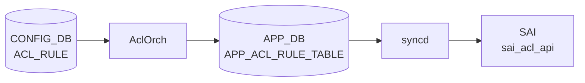

# ACL_RULE テーブル

## 概要

`ACL_TABLE` 内の個別ルールを定義する。優先度、match 条件 (5-tuple、TCP flags、TC、ICMP、tunnel inner、metadata 等)、action (PACKET_ACTION、REDIRECT、MIRROR、COUNTER、[DSCP](../../reference/glossary.md#term-dscp) 上書き、DTel 等) を持つ[^1]。`AclOrch` が `ACL_TABLE` 配下のルールを [SAI](../../reference/glossary.md#term-sai) [ACL](../../reference/glossary.md#term-acl) entry として展開する。

!!! warning "YANG 未定義"
    `ACL_RULE` テーブルは YANG モジュールで未定義。スキーマの正本は `sonic-swss/orchagent/aclorch.{h,cpp}`。

<!-- cdb-mermaid -->
### データフロー (自動生成)



!!! note "凡例"
    CONFIG_DB から SAI までの典型経路を `docs/reference/config-db-orch-map.md` から機械生成したミニ図。詳細・例外は本ページ本文と対応表を参照。
<!-- /cdb-mermaid -->

<!-- ordering -->
## 書込み順依存 (Phase B)

<!-- evidence: sonic-swss/orchagent/aclorch.cpp AclOrch::doAclRuleTask:5520 / AclTable::add:2988 / AclRuleMirror::activate:2324 / AclRulePacket::getRedirectObjectId:2078 -->

`ACL_RULE` の SAI 反映は複数の外部状態（PortsOrch 初期化、`ACL_TABLE`、`MIRROR_SESSION`、REDIRECT 先 next-hop、SAI リソース余裕）に依存する。違反時の挙動はガード機構により**自動回復するもの**と**rule INACTIVE で erase されるもの**に分かれる。

### 依存 1: PortsOrch 初期化（必須先行・グローバル）

```
PortsOrch::allPortsReady() == true  先行
  ↓
ACL_TABLE / ACL_TABLE_TYPE / ACL_RULE のどの SET も処理開始
```

`AclOrch::doTask()` (`aclorch.cpp:4276`) は `gPortsOrch->allPortsReady()` が false の間は何も処理しない。[ACL](../../reference/glossary.md#term-acl) 関連の全 [CONFIG_DB](../../reference/glossary.md#term-config_db) エントリは PortsOrch の `PORT` 初期化完了を待つ。

**違反時**: 書込み自体は [CONFIG_DB](../../reference/glossary.md#term-config_db) に残り、PortsOrch 完了後の最初のイベントループで一括処理（自動回復）。

### 依存 2: ACL_TABLE 先行（必須先行・自動回復あり）

```
ACL_TABLE|<table>  SET 完了（SAI OID 割当済み）  先行
  ↓
ACL_RULE|<table>|<rule>  SET
```

`doAclRuleTask()` (`aclorch.cpp:5548-5566`) は `getTableById(table_id)` が `SAI_NULL_OBJECT_ID` の場合、CTRLPLANE 種別ならその場で erase、それ以外は `it++` で `m_toSync` に保留し次の tick で再試行する（無限ポーリング）。

**違反時**: ACL_TABLE が後から SAI に登録されると自動的にルール作成が成功する。CTRLPLANE 種別（`m_ctrlAclTables`）の table_id 配下ルールは INFO ログ後 erase される点に注意。

### 依存 3: MIRROR_SESSION 存在（MIRROR action 限定・存在必須）

```
MIRROR_SESSION|<sess>  SET（存在化）  先行
  ↓
ACL_RULE|<table>|<rule>  with MIRROR_*_ACTION=<sess>  SET
```

`AclRuleMirror::activate()` (`aclorch.cpp:2331-2335`) は `m_pMirrorOrch->sessionExists(m_sessionName)` が false なら `return false` で rule 作成失敗。セッションが inactive（存在はする）の場合は SAI entry を作らずに保留し、`MirrorSessionUpdate` イベント経由で `AclRuleMirror::onUpdate()` (`aclorch.cpp:2424-2452`) が `activate()` を呼び戻す。

**違反時**: session 不存在ならルール INACTIVE で erase。session が後から作成されても自動回復はせず、ACL_RULE の再 SET が必要。inactive → active の遷移は自動回復される。

### 依存 4: REDIRECT ターゲット解決（推奨先行・自動回復なし）

```
（REDIRECT_ACTION = <port> / <nexthop> / <nh_group> / <tunnel_nh> の場合）
PORT / PORTCHANNEL / NEIGH_TABLE / ROUTE_TABLE の対象が解決済み  先行
  ↓
ACL_RULE  SET（REDIRECT_ACTION または PACKET_ACTION=REDIRECT:<target>）
```

`AclRulePacket::getRedirectObjectId()` (`aclorch.cpp:2078-2166`) は PORT/[LAG](../../reference/glossary.md#term-lag) → NextHop → Tunnel NH → NextHopGroup の順でターゲットを解決する。NextHopGroup のみ未存在時に `routeOrch->addNextHopGroup()` で自動作成を試みる。それ以外が解決できない場合は `SAI_NULL_OBJECT_ID` → rule INACTIVE で erase。

**違反時**: rule INACTIVE で erase。MIRROR_SESSION と異なり SubjectType 購読がないため自動回復せず、ACL_RULE の再 SET が必要。

### 依存 5: MIRROR ルールの内容変更は DEL → SET 必須

```
ACL_RULE|<table>|<rule>  DEL  先行
  ↓
ACL_RULE|<table>|<rule>  SET（新属性）
```

`AclRuleMirror::update()` は未実装で `SWSS_LOG_ERROR` 後に `return false` を返す（`aclorch.cpp:2415-2420`）。同 key への SET だけでは内容変更されない。

**違反時**: 更新 SET が ERROR ログのみで無視される。差分更新は不可。非 MIRROR ルール（L3/L3V6 等）は `AclTable::add()` (`aclorch.cpp:2988-3023`) が既存ルールを `remove()` → `create()` で完全再作成するため、同 key 再 SET で上書き可能。

### 依存 6: DEL 順序（ACL_RULE → ACL_TABLE 推奨）

```
ACL_RULE|<table>|<rule>  DEL  先行（推奨）
  ↓
ACL_TABLE|<table>  DEL
```

`AclOrch::removeAclTable()` (`aclorch.cpp:4850`) は table 削除前に `m_AclTables[oid].clear()` で配下の全ルールを一括 `remove()` するため、SAI 上は順序不問。ただし CONFIG_DB に ACL_RULE が残ったまま ACL_TABLE のみ DEL すると、[orchagent](../../reference/glossary.md#term-orchagent) 再起動時の replay で ACL_RULE が依存 2 の待機ループに入り続けるため、**CONFIG_DB 整合性のためルール先 DEL を推奨**。

**違反時**: 機能的には問題なし。再起動後に保留ルールが残るのみ。

### 依存 7: SAI リソース枯渇時の retry cache（自動順序逆転）

```
（SAI ACL リソース枯渇時）
新規 ACL_RULE SET → SAI_STATUS_INSUFFICIENT_RESOURCES → retry cache 退避
  ↓
同 table 内の既存 ACL_RULE DEL  → notifyRetry(RETRY_CST_SAI_RESOURCE)  → cache 再投入
```

`doAclRuleTask()` (`aclorch.cpp:5673-5698`, `5716-5720`) は resource-full 失敗を `RETRY_CST_SAI_RESOURCE` 制約付きで retry cache に退避し、同 table_id の rule DEL 成功時に `notifyRetry()` で再投入する。

**違反時**: 自動メカニズム。SET 順序と独立に「枯渇したら退避、空いたら再投入」が回る。

<!-- /ordering -->

## key 構造

```text
ACL_RULE|<table_name>|<rule_name>
```

`<table_name>` は `ACL_TABLE.name` を参照（実装上は名前一致のみで leafref はない）。

## 共通フィールド

| フィールド | 型 | 説明 |
|-----------|----|------|
| `PRIORITY` | uint32 | ルール評価順位。値が大きいほど優先 |
| `PACKET_ACTION` | enum `FORWARD`/`DROP`/`DO_NOT_NAT`/etc | 既定アクション |

## match フィールド (代表)

| 名前 | 値 |
|------|----|
| `IN_PORTS` / `OUT_PORT` / `OUT_PORTS` | カンマ区切り PORT 名 |
| `SRC_IP` / `DST_IP` | IPv4 prefix |
| `SRC_IPV6` / `DST_IPV6` | IPv6 prefix |
| `L4_SRC_PORT` / `L4_DST_PORT` | TCP/UDP ポート |
| `L4_SRC_PORT_RANGE` / `L4_DST_PORT_RANGE` | range `<min>..<max>` |
| `ETHER_TYPE` | uint16（hex 可） |
| `IP_PROTOCOL` / `NEXT_HEADER` | uint8 |
| `VLAN_ID` | uint16 |
| `TCP_FLAGS` | `<flags>/<mask>` |
| `IP_TYPE` | enum (`ANY`/`IP`/`NON_IP`/`IPV4ANY`/`IPV6ANY`/...) |
| `DSCP` / `TC` | [DSCP](../../reference/glossary.md#term-dscp) / TC 値 |
| `ICMP_TYPE` / `ICMP_CODE` / `ICMPV6_TYPE` / `ICMPV6_CODE` | ICMP |
| `TUNNEL_VNI` | VNI |
| `INNER_ETHER_TYPE` / `INNER_IP_PROTOCOL` / `INNER_L4_SRC_PORT` / `INNER_L4_DST_PORT` | inner header |
| `INNER_SRC_MAC` / `INNER_DST_MAC` / `INNER_SRC_IP` | inner header |
| `BTH_OPCODE` / `AETH_SYNDROME` | [RoCE](../../reference/glossary.md#term-roce) 用 |
| `TUNNEL_TERM` | bool |
| `META_DATA` | uint32 |

## action フィールド (代表)

| 名前 | 説明 |
|------|------|
| `PACKET_ACTION` | `FORWARD` / `DROP` 等 |
| `REDIRECT_ACTION` | redirect 先（next-hop / mirror セッション 等） |
| `DO_NOT_NAT_ACTION` | [NAT](../../reference/glossary.md#term-nat) バイパス |
| `DISABLE_TRIM_ACTION` | バッファ trim 無効化 |
| `MIRROR_ACTION` / `MIRROR_INGRESS_ACTION` / `MIRROR_EGRESS_ACTION` | mirror セッション参照 |
| `FLOW_OP` / `INT_SESSION` / `DROP_REPORT_ENABLE` / `TAIL_DROP_REPORT_ENABLE` / `FLOW_SAMPLE_PERCENT` / `REPORT_ALL_PACKETS` | DTel (`DTEL_*`) |
| `COUNTER` | カウンタ装着 |
| `META_DATA_ACTION` | metadata 上書き |
| `DSCP_ACTION` | [DSCP](../../reference/glossary.md#term-dscp) 上書き |
| `INNER_SRC_MAC_REWRITE_ACTION` | inner SRC MAC rewrite |

ユーザ定義型 (`ACL_TABLE_TYPE`) を使う場合、ここで使える match / action は `ACL_TABLE_TYPE.MATCHES` / `.ACTIONS` で許可された集合に限られる。

## 購読者

- `orchagent` `AclOrch`: [SAI](../../reference/glossary.md#term-sai) [ACL](../../reference/glossary.md#term-acl) entry を生成
- `mirrororch`: `MIRROR_*_ACTION` 経由で連動
- `copporch`: `CTRLPLANE` 種別の `ACL_TABLE` 配下のルールに連動

## 関連 CONFIG_DB / YANG / CLI

- 関連 [CONFIG_DB](../../reference/glossary.md#term-config_db): `ACL_TABLE`、`MIRROR_SESSION`、`POLICER`
- 関連 CLI: [`config acl`](../cli/config-acl.md)
- 関連 [YANG](../../reference/glossary.md#term-yang): なし

<!-- cdb-exceptions -->
## 例外条件・特殊挙動

| 条件 | 挙動 |
|------|------|
| key の TABLE_ID が空文字 | WARN ログ後 erase、skip |
| 対応する ACL_TABLE が未作成 | 待機 (`it++`)、テーブル作成後に再試行 |
| コントロールプレーンテーブルのルール | INFO ログ後 erase、skip |
| `AclRule::makeShared` が例外 | ERROR ログ後 erase & 関数 return（処理中断） |
| 未知/不正な属性名 | rule INACTIVE、erase |
| `MATCH_TCP_FLAGS` あり・IP_PROTOCOL 未指定 | IP_PROTOCOL=6 (TCP) を自動付与 |
| IPv4 と IPv6 matchfield 混在（L3V4V6 テーブル） | `bAllAttributesOk=false`、rule INACTIVE |
| [SAI](../../reference/glossary.md#term-sai) リソース枯渇 | retry キャッシュに退避、リソース解放後に再試行 |
| IN_PORTS/OUT_PORTS に非物理 IF | `return false`、rule INACTIVE |
| [VLAN](../../reference/glossary.md#term-vlan) ID 範囲外 | `return false`、rule INACTIVE |
| Range 形式不正 | `return false`、rule INACTIVE |

<!-- evidence: sonic-net/sonic-swss/orchagent/aclorch.cpp:5520L -->
<!-- /cdb-exceptions -->

<!-- value-behavior -->
## 値依存挙動マトリクス

### `PACKET_ACTION` 値別挙動

[YANG](../../reference/glossary.md#term-yang) 定義値: `FORWARD` / `DROP` / `REDIRECT` (sonic-acl.yang:114-116)。
実装 lookup map: `aclPacketActionLookup` (aclorch.cpp:143)。マクロ定数: `PACKET_ACTION_FORWARD` / `PACKET_ACTION_DROP` / `PACKET_ACTION_COPY` / `PACKET_ACTION_REDIRECT` / `PACKET_ACTION_DO_NOT_NAT` / `PACKET_ACTION_DISABLE_TRIM` (aclorch.h:83-88)。

| 値 | SAI マッピング | 効果 | evidence |
|---|---|---|---|
| `FORWARD` | `SAI_PACKET_ACTION_FORWARD` | パケットを通過させる (`PACKET_ACTION_FORWARD`) | `aclorch.h:83`, `aclorch.cpp:145` |
| `DROP` | `SAI_PACKET_ACTION_DROP` | パケットをドロップ (`PACKET_ACTION_DROP`) | `aclorch.h:84`, `aclorch.cpp:146` |
| `COPY` | `SAI_PACKET_ACTION_COPY` | パケットを CPU コピー後に続行 (`PACKET_ACTION_COPY`、[YANG](../../reference/glossary.md#term-yang) 外) | `aclorch.h:85`, `aclorch.cpp:147` |
| `REDIRECT` | oid 解決後に redirect | `REDIRECT:<target>` 形式 (`PACKET_ACTION_REDIRECT`)。コロンなし / ターゲット空は `return false` → rule INACTIVE | `aclorch.h:86`, `aclorch.cpp:2013-2040` |
| `DO_NOT_NAT` | — | [NAT](../../reference/glossary.md#term-nat) 処理をバイパス (`PACKET_ACTION_DO_NOT_NAT`、YANG 外) | `aclorch.h:87` |
| `DISABLE_TRIM` | — | バッファ trim を無効化 (`PACKET_ACTION_DISABLE_TRIM`、YANG 外) | `aclorch.h:88` |

!!! note "REDIRECT 後方互換"
    `ACTION_PACKET_ACTION` フィールドに `REDIRECT:<target>` を書く旧形式が後方互換として残る。新形式は `REDIRECT_ACTION` フィールドを使う (`aclorch.cpp:2013`)。

### `IP_TYPE` 値別挙動

YANG 定義値 7 種 (sonic-acl.yang:122-130)。実装 lookup map: `aclIpTypeLookup` (aclorch.cpp:501)。マクロ定数: `IP_TYPE_ANY` / `IP_TYPE_IP` / `IP_TYPE_NON_IP` / `IP_TYPE_IPv4ANY` / `IP_TYPE_NON_IPv4` / `IP_TYPE_IPv6ANY` / `IP_TYPE_NON_IPv6` / `IP_TYPE_ARP` / `IP_TYPE_ARP_REQUEST` / `IP_TYPE_ARP_REPLY` (aclorch.h:98-107)。
YANG は `mandatory true` のため省略不可。

| 値 | SAI マッピング | 意味 | evidence |
|---|---|---|---|
| `ANY` | `SAI_ACL_IP_TYPE_ANY` | IP/非IP 問わず全パケット (`IP_TYPE_ANY`) | `aclorch.h:98`, `aclorch.cpp:503` |
| `IP` | `SAI_ACL_IP_TYPE_IP` | IPv4 または IPv6 パケット (`IP_TYPE_IP`) | `aclorch.h:99`, `aclorch.cpp:504` |
| `IPV4` | `SAI_ACL_IP_TYPE_IPV4ANY` | IPv4 パケット (YANG のみ、実装上 `IP_TYPE_IPv4ANY` と同義) | `sonic-acl.yang:125` |
| `IPV4ANY` | `SAI_ACL_IP_TYPE_IPV4ANY` | IPv4 パケット (`IP_TYPE_IPv4ANY`) | `aclorch.h:101`, `aclorch.cpp:506` |
| `NON_IPV4` | `SAI_ACL_IP_TYPE_NON_IPV4` | 非 IPv4 パケット (`IP_TYPE_NON_IPv4`) | `aclorch.h:102`, `aclorch.cpp:507` |
| `IPV6ANY` | `SAI_ACL_IP_TYPE_IPV6ANY` | IPv6 パケット (`IP_TYPE_IPv6ANY`) | `aclorch.h:103`, `aclorch.cpp:508` |
| `NON_IPV6` | `SAI_ACL_IP_TYPE_NON_IPV6` | 非 IPv6 パケット (`IP_TYPE_NON_IPv6`) | `aclorch.h:104`, `aclorch.cpp:509` |
| `ARP` | `SAI_ACL_IP_TYPE_ARP` | [ARP](../../reference/glossary.md#term-arp) パケット (`IP_TYPE_ARP`、実装のみ、YANG 外) | `aclorch.h:105`, `aclorch.cpp:510` |
| `ARP_REQUEST` | `SAI_ACL_IP_TYPE_ARP_REQUEST` | [ARP](../../reference/glossary.md#term-arp) Request (`IP_TYPE_ARP_REQUEST`、実装のみ) | `aclorch.h:106`, `aclorch.cpp:511` |
| `ARP_REPLY` | `SAI_ACL_IP_TYPE_ARP_REPLY` | [ARP](../../reference/glossary.md#term-arp) Reply (`IP_TYPE_ARP_REPLY`、実装のみ) | `aclorch.h:107`, `aclorch.cpp:512` |

### `ETHER_TYPE` 値別挙動

YANG pattern で 7 値に制限 (sonic-acl.yang:142)。実装では任意 uint16 を受理 (aclorch.cpp:1066)。
格納値は `0x` プレフィックス付き hex 文字列。`stoul(str, &idx, 0)` で auto 判定 (`converter.h:18` の変換関数)。
マスク: `0xFFFF` (完全一致) で `SAI_ACL_ENTRY_ATTR_FIELD_ETHER_TYPE` として SAI に投入 (aclorch.cpp:1067)。

| 値 | プロトコル | 意味 | evidence |
|---|---|---|---|
| `0x88CC` | [LLDP](../../reference/glossary.md#term-lldp) | Link Layer Discovery Protocol | `sonic-acl.yang:142` |
| `0x8100` | IEEE 802.1Q | [VLAN](../../reference/glossary.md#term-vlan) タグ付きフレーム | `sonic-acl.yang:142` |
| `0x8915` | [RoCE](../../reference/glossary.md#term-roce) | RDMA over Converged Ethernet | `sonic-acl.yang:142` |
| `0x0806` | [ARP](../../reference/glossary.md#term-arp) | Address Resolution Protocol | `sonic-acl.yang:142` |
| `0x0800` | IPv4 | Internet Protocol version 4 | `sonic-acl.yang:142` |
| `0x86DD` | IPv6 | Internet Protocol version 6 | `sonic-acl.yang:142` |
| `0x8847` | [MPLS](../../reference/glossary.md#term-mpls) | [MPLS](../../reference/glossary.md#term-mpls) ユニキャスト | `sonic-acl.yang:142` |

### `stage` 値別挙動 (ACL_TABLE から継承)

ACL_RULE 自体に `stage` フィールドはないが、所属 ACL_TABLE の stage により使用可能な action が変わる。

| 値 | SAI stage | MIRROR action | evidence |
|---|---|---|---|
| `INGRESS` (既定) | `SAI_ACL_STAGE_INGRESS` | `MIRROR_INGRESS_ACTION` 有効 | `aclorch.cpp:166,173,263-266` |
| `EGRESS` | `SAI_ACL_STAGE_EGRESS` | `MIRROR_EGRESS_ACTION` のみ有効 | `aclorch.cpp:167,185,270-272` |

### `type` 値別挙動 (ACL_TABLE から継承)

ACL_RULE で使用可能な match / action は ACL_TABLE の `type` によって決まる。

| 値 | 使用可能な主 action | 備考 | evidence |
|---|---|---|---|
| `L3` | `PACKET_ACTION`, `REDIRECT_ACTION` | 通常 IPv4 ACL | `acltable.h:26`, `aclorch.cpp:200,454` |
| `L3V6` | `PACKET_ACTION`, `REDIRECT_ACTION` | IPv6 ACL。`IP_PROTOCOL` は非推奨 | `acltable.h:27`, `aclorch.cpp:220,1231` |
| `MIRROR` | `MIRROR_INGRESS_ACTION` | [ASIC](../../reference/glossary.md#term-asic) capability 必須 | `acltable.h:29`, `aclorch.cpp:260,3502` |
| `MIRRORV6` | `MIRROR_INGRESS_ACTION` / `MIRROR_EGRESS_ACTION` | [ASIC](../../reference/glossary.md#term-asic) capability 照会、一部統合 | `acltable.h:30`, `aclorch.cpp:279,3503,5811` |

### 値別 grep カバレッジ

| フィールド | 値数 | 0 hit | 証跡ファイル |
|---|---|---|---|
| `PACKET_ACTION` | 3 (YANG) / 6 (実装) | 0 | aclorch.h, aclorch.cpp |
| `IP_TYPE` | 7 (YANG) / 10 (実装) | 0 | aclorch.h, aclorch.cpp, sonic-acl.yang |
| `ETHER_TYPE` | 7 | 0 | sonic-acl.yang, aclorch.cpp |
| `stage` (継承) | 2 | 0 | aclorch.cpp |
| `type` (継承) | 4 (YANG) | 0 | acltable.h, aclorch.cpp |

### 複合条件

1. `MATCH_TCP_FLAGS` あり + `IP_PROTOCOL` 未指定 → `IP_PROTOCOL=6 (TCP)` 自動付与 (`aclorch.cpp:5640-5660`)
2. `IP_TYPE=IPV4ANY` / `IPV4` + `SRC_IPV6` 同一ルール混在 → `bAllAttributesOk=false` → rule INACTIVE (`aclorch.cpp:5636-5658`)
3. YANG `choice ip_src_dst` — `IP_TYPE` が IPv4 系なら `SRC_IP`/`DST_IP` のみ有効、IPv6 系なら `SRC_IPV6`/`DST_IPV6` のみ有効 (`sonic-acl.yang:150-168`)
4. `type=MIRROR`/`MIRRORV6` + stage=EGRESS → `MIRROR_EGRESS_ACTION` のみ有効 (`aclorch.cpp:270-272`)
5. `PACKET_ACTION=REDIRECT:` のコロン後ターゲット欠如 → `return false` → rule INACTIVE (`aclorch.cpp:2020-2028`)
<!-- /value-behavior -->

<!-- defaults -->
## コード由来の暗黙デフォルト (Phase A)

YANG 未定義テーブルのため、全デフォルトはコード実装が正本。

### field × 種別 一覧

| フィールド / 属性 | 種別 | 暗黙デフォルト値 | ソース |
|---|---|---|---|
| `PRIORITY` (C++) | `__init__` 属性 literal | `m_priority = 0` (コンストラクタ初期値) | `aclorch.cpp:905` |
| `PRIORITY` min/max | SAI 動的取得 | `SAI_SWITCH_ATTR_ACL_ENTRY_MINIMUM/MAXIMUM_PRIORITY` を起動時に問合せ | `aclorch.cpp:3689-3696` |
| `PRIORITY` (acl_loader) | Python literal | `max_priority - sequence_id`; `max_priority = 10000` | `acl_loader/main.py:93,772` |
| `PRIORITY` (acl_app.go) | Go literal | `MAX_PRIORITY - seqId`; `MAX_PRIORITY = 65536` | `acl_app.go:56,1153` |
| `TCP_FLAGS` mask | C++ fallback (`else` branch) | マスク省略時 `0x3F` (6bit フルマスク) | `aclorch.cpp:1061` |
| `DSCP` match mask | C++ fallback (`else` branch) | マスク省略時 `0x3F` (6bit フルマスク) | `aclorch.cpp:1090-1093` |
| `ETHER_TYPE` / `L4_SRC_PORT` / `L4_DST_PORT` mask | C++ 固定 | 常に `0xFFFF` | `aclorch.cpp:1067` |
| `VLAN_ID` mask | C++ 固定 | 常に `0xFFF` (12bit) | `aclorch.cpp:1072` |
| `IP_PROTOCOL` / `NEXT_HEADER` / `TC` / `ICMP_*` mask | C++ 固定 | 常に `0xFF` | `aclorch.cpp:1099,1151,1156` |
| `IP_TYPE` mask | C++ 固定 | 常に `0xFFFFFFFF` | `aclorch.cpp:1046` |
| `TUNNEL_VNI` / `META_DATA` mask | C++ 固定 | 常に `0xFFFFFFFF` | `aclorch.cpp:1163,1208` |
| `INNER_ETHER_TYPE` / `INNER_L4_*PORT` mask | C++ 固定 | 常に `0xFFFF` | `aclorch.cpp:1167` |
| `INNER_IP_PROTOCOL` mask | C++ 固定 | 常に `0xFF` | `aclorch.cpp:1172` |
| `INNER_SRC_MAC` / `INNER_DST_MAC` mask | C++ 固定 | 常に `ff:ff:ff:ff:ff:ff` (完全一致) | `aclorch.cpp:957` |
| `IP_PROTOCOL` / `NEXT_HEADER` | C++ 自動付与 | `TCP_FLAGS` あり + `IP_PROTOCOL` 未指定 → `6` (TCP) | `aclorch.cpp:5633-5648` |
| `SAI_ACL_ENTRY_ATTR_ADMIN_STATE` | C++ 固定 (非 CONFIG_DB) | 常に `true` を SAI に送出 | `aclorch.cpp:1293-1295` |
| `MIRROR_ACTION` → ingress | C++ fallback (後方互換) | 旧 `MIRROR_ACTION` フィールドは `MIRROR_INGRESS_ACTION` として処理 | `aclorch.cpp:2268-2271` |
| `IP_TYPE` (acl_loader・L3) | Python 自動付与 | `ETHER_TYPE = 0x0800` (IPv4) を付与 | `acl_loader/main.py:789` |
| `IP_TYPE` (acl_loader・L3V6) | Python 自動付与 | `IP_TYPE = "IPV6ANY"` を付与 | `acl_loader/main.py:787` |
| `IP_TYPE` (acl_app.go・IPv4) | Go 自動付与 | `IP_TYPE = "IPV4ANY"` を常に付与 | `acl_app.go:1219` |
| `IP_TYPE` (acl_app.go・IPv6) | Go 自動付与 | `IP_TYPE = "IPV6ANY"` を常に付与 | `acl_app.go:1251` |

### YANG default との関係

`ACL_RULE` は YANG 未定義のため YANG default は存在しない。全デフォルトはコードレベルのみ。

### 乖離・注意点

1. **PRIORITY の最大値が経路依存**: `acl_loader` は `max_priority=10000`、`acl_app.go` (REST/[gNMI](../../reference/glossary.md#term-gnmi)) は `MAX_PRIORITY=65536` を使用。同一 sequence_id でも経路によって格納される PRIORITY 値が異なる。
2. **DEFAULT_RULE の IP_TYPE**: `acl_loader` はテーブル種別に応じて `ETHER_TYPE` または `IP_TYPE` を設定するが、`acl_app.go` は常に `IP_TYPE=ANY` を設定 (`acl_app.go:1148`)。
3. **mask は CONFIG_DB に格納されない**: 全 mask デフォルトは C++ 内部でのみ付与され、CONFIG_DB には書かれない。DB には値 (data) のみが格納される。
4. **COUNTER フィールド**: `AclRuleMirror` はデフォルトでカウンタを作成しない (`createCounter=false`)。`AclRulePacket` は `createCounter=true`。

### 該当なしフィールド (追加デフォルトなし)

以下のフィールドは省略時に自動設定は一切行われず、ルールに含まれなければ単に match 条件が適用されない:
`SRC_IP`, `DST_IP`, `SRC_IPV6`, `DST_IPV6`, `IN_PORTS`, `OUT_PORT`, `OUT_PORTS`, `REDIRECT_ACTION`, `MIRROR_INGRESS_ACTION`, `MIRROR_EGRESS_ACTION`, `FLOW_OP`, `INT_SESSION`, `DROP_REPORT_ENABLE`, `TAIL_DROP_REPORT_ENABLE`, `FLOW_SAMPLE_PERCENT`, `REPORT_ALL_PACKETS`, `INNER_SRC_IP`, `BTH_OPCODE`, `AETH_SYNDROME`, `TUNNEL_TERM`, `DO_NOT_NAT_ACTION`, `DISABLE_TRIM_ACTION`, `META_DATA_ACTION`, `DSCP_ACTION`, `INNER_SRC_MAC_REWRITE_ACTION`。

### LSP トレース証跡

- 訪問ファイル数: 3 (`aclorch.cpp`, `acl_loader/main.py`, `acl_app.go`)
- 訪問関数数: 17
- 検出 fallback: 21 件 (mask 系 9 件 + 自動付与 7 件 + 初期値 3 件 + 後方互換 1 件 + SAI 固定 1 件)
- 中間トレース: `meta/_intermediate/cdb-flow/acl-rule-defaults.md`

<!-- /defaults -->

<!-- derivation -->
## 派生・条件付き登録 (Phase 6/7)

### Phase 6: 自動派生

| 派生先フィールド | 派生元条件 | 派生値 | ソース |
|---|---|---|---|
| `IP_PROTOCOL` / `NEXT_HEADER` | `MATCH_TCP_FLAGS` あり + `IP_PROTOCOL` 未指定 | `6` (TCP) | `aclorch.cpp:5632-5660` |
| `stage` (ACL_TABLE 継承) | 所属 `ACL_TABLE.stage` | `INGRESS` → `MIRROR_INGRESS_ACTION` 有効 / `EGRESS` → `MIRROR_EGRESS_ACTION` のみ | `aclorch.cpp:263-272` |
| `type` (ACL_TABLE 継承) | 所属 `ACL_TABLE.type` | `L3` / `L3V6` / `MIRROR` 等によって使用可能な match / action が決まる | `aclorch.cpp:200,220,260` |

**minigraph.py 由来の自動設定** (`minigraph.py:1103-1228`):

- XML `InAcl` タグ → `stage=ingress`、`OutAcl` タグ → `stage=egress`
- AttachTo に `erspan` prefix → `type=MIRROR`、`erspanv6` → `type=MIRRORV6`、`erspan_dscp` → `type=MIRROR_DSCP`
- ports なし (CTRLPLANE) → `type=CTRLPLANE`、`stage` 設定あり
- それ以外: ACL 名に `v6` を含む → `type=L3V6`、含まない → `type=L3`

### Phase 7: 条件付き登録

| 条件 | 影響 | ソース |
|---|---|---|
| `AclOrch` は常時登録 (platform 非依存) | ACL_TABLE / ACL_RULE 購読は無条件 | `orchdaemon.cpp:533,569` |
| `DTelOrch` は `platform==BFN\|VS` かつ capability あり のみ生成 | DTelOrch なし → DTEL 系 action (`FLOW_OP`, `INT_SESSION` 等) が機能しない | `orchdaemon.cpp:502-530` |
| `type=MIRROR`/`MIRRORV6` + [ASIC](../../reference/glossary.md#term-asic) capability なし | 起動時 SAI capability query 失敗 → ACL_TABLE 作成 reject | `aclorch.cpp:3500-3541` |
| `type=L3V4V6` + ASIC 未サポート | `isAclL3V4V6TableSupported()` → false → reject | `aclorch.cpp:2737-2739` |
| `META_DATA` 系 action + capability なし | `sai_query_attribute_capability()` で確認後に有効化 | `aclorch.cpp:3590-3659` |

### グレップカバレッジ

| 項目 | hit 数 | 証跡 |
|---|---|---|
| TCP 自動付与 (`bHasTCPFlag` + `TCP_PROTOCOL_NUM`) | 3 | `aclorch.cpp:54,5633-5648` |
| minigraph.py `type` 派生 | 6 | `minigraph.py:1218-1228` |
| DTelOrch 条件起動 | 2 | `orchdaemon.cpp:522,527-530` |
| MIRROR capability check | 4 | `aclorch.cpp:3500-3541,5198-5199` |

<!-- /derivation -->

<!-- handler-branching -->
### Phase 8: Handler メソッド内分岐

ACL_RULE は `AclOrch::doAclRuleTask()` が処理する。同メソッド内で ACL_TABLE の `type` / `stage` フィールド値を読み取り、ルールの処理方法を分岐する。

| Handler | メソッド | 分岐条件 | 効果 | evidence |
|---|---|---|---|---|
| `AclOrch` | `doAclRuleTask()` | `table_id.empty()` | 早期 WARN + erase（TABLE_ID 欠如はルール無効） | `sonic-swss/orchagent/aclorch.cpp:5536-5540` |
| `AclOrch` | `doAclRuleTask()` | `table_oid == SAI_NULL_OBJECT_ID` かつ `m_ctrlAclTables.find(table_id) != end` | INFO ログ + erase（コントロールプレーンルールをスキップ）| `sonic-swss/orchagent/aclorch.cpp:5556-5561` |
| `AclOrch` | `doAclRuleTask()` | `table_oid == SAI_NULL_OBJECT_ID` かつ ACL_TABLE 未作成 | `it++`（テーブル作成まで待機） | `sonic-swss/orchagent/aclorch.cpp:5563-5565` |
| `AclOrch` | `doAclRuleTask()` | `type IN [TABLE_TYPE_MIRROR, TABLE_TYPE_MIRRORV6]` | `table_id == m_mirrorTableId[stage]` により MIRROR / MIRRORV6 を再判定 | `sonic-swss/orchagent/aclorch.cpp:5570-5573` |
| `AclOrch` | `doAclRuleTask()` | `bHasTCPFlag && !bHasIPProtocol` かつ `type IN [MIRRORV6, L3V6]` | `IP_PROTOCOL` 自動付与: `MATCH_NEXT_HEADER=6` (IPv6) | `sonic-swss/orchagent/aclorch.cpp:5636-5638` |
| `AclOrch` | `doAclRuleTask()` | `bHasTCPFlag && !bHasIPProtocol` かつ `type` が上記以外 | `IP_PROTOCOL` 自動付与: `MATCH_IP_PROTOCOL=6` (IPv4) | `sonic-swss/orchagent/aclorch.cpp:5640-5643` |
| `AclOrch` | `doAclRuleTask()` | `bHasIPV4 && bHasIPV6 && type == TABLE_TYPE_L3V4V6` | ERROR + `bAllAttributesOk=false` → rule INACTIVE（v4/v6 混在不可） | `sonic-swss/orchagent/aclorch.cpp:5656-5663` |

> **スキャン証跡**: `doAclRuleTask()` L5520-5700 を全行読了、7 件分岐抽出。`type` / `stage` は ACL_RULE 自体のフィールドではなく ACL_TABLE から継承した値を参照。Phase 6/7 derivation ブロックの evidence 再確認: TCP 自動付与・minigraph 派生・DTelOrch 条件起動は実ソースと整合（`aclorch.cpp:5632-5660`、`minigraph.py:1218-1228`、`orchdaemon.cpp:502-530`）— 誤読なし。

<!-- /handler-branching -->

<!-- constants -->
## ハードコード定数 (Phase E)

### aclorch.cpp 数値・mask 定数

| 定数 | 値 | 用途 | evidence |
|-----|-----|------|---------|
| `ACL_COUNTER_DEFAULT_POLLING_INTERVAL_MS` | `10000` ms (10 秒) | ACL counter [FlexCounter](../../reference/glossary.md#term-flexcounter) ポーリング間隔 | `sonic-swss/orchagent/aclorch.cpp:47` |
| `ACL_COUNTER_DEFAULT_ENABLED_STATE` | `false` | ACL counter [FlexCounter](../../reference/glossary.md#term-flexcounter) 初期無効状態（起動直後はカウンタ更新されない） | `sonic-swss/orchagent/aclorch.cpp:48` |
| `MAX_META_DATA_VALUE` | `4095` | `META_DATA` / `META_DATA_ACTION` の最大許容値。SAI `u32range.max` がこれを超えると `4095` にクランプ | `sonic-swss/orchagent/aclorch.cpp:52,3619-3621` |
| `TCP_PROTOCOL_NUM` | `6` | `TCP_FLAGS` あり + `IP_PROTOCOL` 未指定時に自動付与する TCP プロトコル番号（Phase 6 派生） | `sonic-swss/orchagent/aclorch.cpp:54,5645` |
| `MAC_EXACT_MATCH` | `"ff:ff:ff:ff:ff:ff"` | `INNER_SRC_MAC` / `INNER_DST_MAC` 完全一致 mask（CONFIG_DB 非保存・C++ 内部固定） | `sonic-swss/orchagent/aclorch.cpp:56,957` |
| `ACL_COUNTER_FLEX_COUNTER_GROUP` | `"ACL_STAT_COUNTER"` | FLEX_COUNTER グループ名 | `sonic-swss/orchagent/aclorch.cpp:4209` |

### SAI mask 固定値 (CONFIG_DB に格納されない・C++ 内部のみ)

| フィールド | mask 値 | ビット幅 | evidence |
|-----------|---------|---------|---------|
| `IP_TYPE` / `TUNNEL_VNI` / `META_DATA` | `0xFFFFFFFF` | 32bit | `sonic-swss/orchagent/aclorch.cpp:1046,1162,1208` |
| `ETHER_TYPE` / `L4_SRC_PORT` / `L4_DST_PORT` / `INNER_ETHER_TYPE` / `INNER_L4_*` | `0xFFFF` | 16bit | `sonic-swss/orchagent/aclorch.cpp:1067,1168` |
| `VLAN_ID` | `0xFFF` | 12bit | `sonic-swss/orchagent/aclorch.cpp:1072` |
| `IP_PROTOCOL` / `NEXT_HEADER` / `TC` / `ICMP_*` / `INNER_IP_PROTOCOL` | `0xFF` | 8bit | `sonic-swss/orchagent/aclorch.cpp:1099,1151,1157,1173` |
| `TCP_FLAGS` / `DSCP` (省略時フォールバック) | `0x3F` | 6bit | `sonic-swss/orchagent/aclorch.cpp:1061,1093` |

`TCP_FLAGS` / `DSCP` は CONFIG_DB に `<data>/<mask>` 形式で明示指定可能。省略時のフォールバックが `0x3F`。

### PRIORITY 範囲 (SAI capability で実行時決定)

| 変数 | 既定値 | 設定タイミング | evidence |
|-----|--------|--------------|---------|
| `AclRule::m_minPriority` | `0` (静的初期値) | 起動時に `SAI_SWITCH_ATTR_ACL_ENTRY_MINIMUM_PRIORITY` を query して `setRulePriorities()` で上書き | `sonic-swss/orchagent/aclorch.cpp:22,3689-3700`, `sonic-swss/orchagent/aclorch.h:321,376` |
| `AclRule::m_maxPriority` | `0` (静的初期値) | 起動時に `SAI_SWITCH_ATTR_ACL_ENTRY_MAXIMUM_PRIORITY` を query して `setRulePriorities()` で上書き | `sonic-swss/orchagent/aclorch.cpp:23,3690-3700`, `sonic-swss/orchagent/aclorch.h:322,377` |

`PRIORITY` 値が `[m_minPriority, m_maxPriority]` 範囲外なら `setPriority()` で ERROR ログ後 `return false` → rule INACTIVE (`aclorch.cpp:1654-1661`)。[DPU](../../reference/glossary.md#term-dpu) (`gMySwitchType == "dpu"`) は SAI query をスキップし、静的初期値 `0/0` のままになる。

### 内部 stage 値・デフォルト

| 定数 | 値 | 用途 | evidence |
|-----|-----|------|---------|
| `stage` ローカル変数初期値 | `ACL_STAGE_INGRESS` | ACL_TABLE 解析時の `stage` 未指定フォールバック | `sonic-swss/orchagent/aclorch.cpp:543` |
| `aclStageLookup[STAGE_INGRESS]` | `ACL_STAGE_INGRESS` | `STAGE` 文字列 → enum 変換マップ | `sonic-swss/orchagent/aclorch.cpp:166` |
| `aclStageLookup[STAGE_EGRESS]` | `ACL_STAGE_EGRESS` | 同上 | `sonic-swss/orchagent/aclorch.cpp:167` |

### acl_loader (CLI) ハードコード定数

| 定数 | 値 | 用途 | evidence |
|-----|-----|------|---------|
| `AclLoader.min_priority` | `1` | `createDefaultDenyAclRule()` で生成するデフォルト DROP ルールの `PRIORITY` | `sonic-utilities/acl_loader/main.py:92,811` |
| `AclLoader.max_priority` | `10000` | `PRIORITY = max_priority - sequence_id` の計算基底値（OpenConfig 経路） | `sonic-utilities/acl_loader/main.py:93` |
| デフォルト deny `PACKET_ACTION` | `"DROP"` | `full_update` 完了時に L3/L3V6/L3V4V6 テーブルへ自動追加するルールの action | `sonic-utilities/acl_loader/main.py:812` |
| デフォルト deny `rule_name` | `"DEFAULT_RULE"` | 自動追加 deny ルールの固定 key 部 | `sonic-utilities/acl_loader/main.py:810` |

### REST/gNMI 経路定数

| 定数 | 値 | 用途 | evidence |
|-----|-----|------|---------|
| `MAX_PRIORITY` | `65536` | `PRIORITY = MAX_PRIORITY - seqId` の計算基底値（REST/[gNMI](../../reference/glossary.md#term-gnmi) 経路）。`acl_loader` (`10000`) と異なる | `sonic-mgmt-common/translib/acl_app.go:56` |

`acl_loader` (CLI) と REST/[gNMI](../../reference/glossary.md#term-gnmi) で計算基底値が異なるため、同一 OpenConfig `sequence-id` でも経路により CONFIG_DB に書き込まれる `PRIORITY` 値が変わる点に注意。

> **スキャン証跡**: `aclorch.h` L22-23,321-322,376-377、`aclorch.cpp` L22-23,47-56,166-167,543,924,957,1046-1208,1654-1661,3610-3621,3689-3700,4209-4212,5640-5645 読了。`acl_loader/main.py` L92-93,805-815、`acl_app.go` L56 読了。定数 6 (cpp) + 5 (mask) + 2 (PRIORITY) + 3 (stage) + 4 (loader) + 1 (gNMI) = 21 件抽出。中間ファイル: `meta/_intermediate/cdb-flow/acl-rule-constants.md`
<!-- /constants -->

<!-- platform -->
## プラットフォーム差 (Phase H)

ACL_RULE の処理は `AclOrch::init()` が起動時に環境変数 `platform` / `sub_platform` を読み取り、以下の capability を静的に決定する。MIRROR V6 / L3V4V6 / isCombinedMirrorV6 はすべて env var の **静的比較** で確定。META_DATA 系のみ SAI 動的照会 (`sai_query_attribute_capability`) を使う。

### プラットフォーム識別文字列 (orch.h:40-50)

| 定数 | 値 | プラットフォーム例 |
|------|----|--------------------|
| `BRCM_PLATFORM_SUBSTRING` | `"broadcom"` | Broadcom XGS (non-DNX) |
| `BRCM_DNX_PLATFORM_SUBSTRING` | `"broadcom-dnx"` | Broadcom DNX/Jericho (sub_platform) |
| `MLNX_PLATFORM_SUBSTRING` | `"mellanox"` | Mellanox Spectrum |
| `BFN_PLATFORM_SUBSTRING` | `"barefoot"` | Intel Tofino (Barefoot) |
| `VS_PLATFORM_SUBSTRING` | `"vs"` | Virtual Switch (テスト用) |
| `NPS_PLATFORM_SUBSTRING` | `"nephos"` | Nephos |
| `CISCO_8000_PLATFORM_SUBSTRING` | `"cisco-8000"` | Cisco Silicon One |
| `XS_PLATFORM_SUBSTRING` | `"xsight"` | xsight |
| `CLX_PLATFORM_SUBSTRING` | `"clounix"` | Clounix |
| `MRVL_PRST_PLATFORM_SUBSTRING` | `"marvell-prestera"` | Marvell Prestera |
| `MRVL_TL_PLATFORM_SUBSTRING` | `"marvell-teralynx"` | Marvell Teralynx |

### capability 差異一覧

| capability | 有効プラットフォーム | 無効/制限プラットフォーム | 効果 | evidence |
|---|---|---|---|---|
| **MIRROR V6** (`isAclMirrorV6Supported`) | broadcom / cisco-8000 / mellanox / barefoot / marvell-prestera / marvell-teralynx / nephos / xsight / clounix / vs | それ以外（未知） | false → `type=MIRRORV6` の ACL_TABLE 作成を reject → IPv6 mirror ルール不可 | `aclorch.cpp:3489-3513` |
| **isCombinedMirrorV6Table** | broadcom (非 DNX) / barefoot / marvell-teralynx / nephos / vs / その他 | mellanox / cisco-8000 / marvell-prestera / xsight / clounix / broadcom-dnx | true (統合) → `MIRROR` テーブル 1 枚で V4/V6 両対応。false (分離) → `MIRROR` と `MIRRORV6` を別々に作成必須 | `aclorch.cpp:3546-3560` |
| **L3V4V6 テーブル** (`isAclL3V4V6TableSupported`) | marvell-prestera / marvell-teralynx / vs | それ以外 | false → `type=L3V4V6` の ACL_TABLE 作成を reject → IPv4/IPv6 混在 match ルール不可 | `aclorch.cpp:3515-3533, 2739-2742` |
| **ACL range 上限** | — | mellanox: 16 / clounix: 16 | 上限超過時 `return NULL` (ERROR ログ) → range match ルールが INACTIVE | `aclorch.cpp:3373-3377, aclorch.h:109-110` |
| **META_DATA / META_DATA_ACTION** | SAI 動的照会で全 3 属性が実装済みの場合 | SAI が未実装と返した場合 | false → META_DATA match / META_DATA_ACTION は無視 / rule INACTIVE | `aclorch.cpp:3563-3664, 5258-5267` |
| **PFCWD OUT_PORT match** | broadcom-dnx (sub_platform) | それ以外 | DNX のみ PFCWD テーブルが `SAI_ACL_BIND_POINT_TYPE_SWITCH` + `OUT_PORT` match 対応 | `aclorch.cpp:3811-3830` |
| **Egress range フィールド** | それ以外 (Egress で range 付加) | broadcom 非 DNX Egress | broadcom 非 DNX の Egress ACL テーブルは range フィールドを強制付加しない → Egress で L4 range match 不可 | `aclorch.cpp:2608-2628` |
| **DTel 系 action** (`FLOW_OP` / `INT_SESSION` 等) | barefoot / vs | それ以外 | `DTelOrch` 非起動 → DTel action SAI 反映なし | `orchdaemon.cpp:502-530` |

### プラットフォーム別サマリ

| プラットフォーム | MIRROR V6 | Combined Mirror | L3V4V6 | DTel |
|----------------|-----------|----------------|--------|------|
| broadcom (非 DNX) | yes | yes (統合) | no | no |
| broadcom-dnx | yes | no (分離) | no | no |
| mellanox | yes | no (分離) | no | no |
| barefoot | yes | yes (統合) | no | **yes** |
| cisco-8000 | yes | no (分離) | no | no |
| marvell-prestera | yes | no (分離) | **yes** | no |
| marvell-teralynx | yes | yes (統合) | **yes** | no |
| nephos | yes | yes (統合) | no | no |
| xsight | yes | no (分離) | no | no |
| clounix | yes | no (分離) | no | no |
| vs (virtual) | yes | yes (統合) | **yes** | **yes** |
| 未知 | **no** | yes (統合) | no | no |

!!! note "isCombinedMirrorV6Table の運用上の注意"
    `isCombinedMirrorV6Table=false` (mellanox / cisco-8000 / marvell-prestera 等) の環境では、
    IPv6 パケット対象の mirror ルールを適用するには `type=MIRRORV6` の ACL_TABLE を **別途** 作成すること。
    `MIRROR` テーブルのみを作成した場合、IPv6 mirror ルールが有効にならない (`aclorch.cpp:5811`)。

!!! warning "L3V4V6 制限"
    `type=L3V4V6` テーブルは marvell-prestera / marvell-teralynx / vs のみ有効。
    それ以外の環境で ACL_TABLE に `type=L3V4V6` を設定すると、
    テーブル作成時点で `isAclL3V4V6TableSupported()` が false → reject されルールも一切適用されない (`aclorch.cpp:2739-2742`)。

!!! warning "DTel action の前提"
    `FLOW_OP` / `INT_SESSION` / `DROP_REPORT_ENABLE` / `TAIL_DROP_REPORT_ENABLE` 等の DTel 系 action は
    barefoot / vs 以外では `DTelOrch` が起動しないため、設定しても SAI に反映されない (`orchdaemon.cpp:502-530`)。

### SAI ASIC capability — action list 動的照会

`AclOrch::queryAclActionCapability()` (`aclorch.cpp:3975-4058`) は init 時に SAI を問い合わせて Ingress/Egress ごとにサポートされる action type 一覧を取得する。ASIC によって返す action set が異なる。

```
SAI_SWITCH_ATTR_MAX_ACL_ACTION_COUNT → action_list バッファサイズ取得
SAI_SWITCH_ATTR_ACL_STAGE_INGRESS / SAI_SWITCH_ATTR_ACL_STAGE_EGRESS → stage ごとの action_list + is_action_list_mandatory 取得
```

| 項目 | 詳細 |
|------|------|
| **デフォルト (SAI 非対応時)** | SAI が `SAI_STATUS_SUCCESS` を返さない場合は `initDefaultAclActionCapabilities()` を呼ぶ。Ingress デフォルト = `PACKET_ACTION, MIRROR_INGRESS, NO_NAT`。Egress デフォルト = `PACKET_ACTION` のみ (`aclorch.cpp:170-196`) |
| **is_action_list_mandatory** | ASIC が `sai_acl_capability_t.is_action_list_mandatory = true` を返した場合、ACL_TABLE 作成時に action リストを必ず指定する必要がある。Mellanox Spectrum は通常 `false`。Broadcom XGS/DNX は `false`。テーブル作成コード (`aclorch.cpp:4760-4764`) は `addMandatoryActions()` で不足 action を自動補完する |
| **PACKET_ACTION 有効値** | `aclPacketActionLookup` に定義された `FORWARD` / `DROP` / `COPY` の 3 値のみ有効 (`aclorch.h:83-85, aclorch.cpp:143-148`)。`TRAP` / `LOG` / `DENY` 等は CONFIG_DB から設定不可。`sai_query_attribute_enum_values_capability` でベンダー実装値を照会するが、libsairedis 未対応のため現行実装では全値サポートと仮定する (`aclorch.cpp:4042-4051`) |

!!! note "PACKET_ACTION 差異 (Mellanox / Broadcom)"
    SONiC レイヤでは FORWARD / DROP / COPY の 3 値のみ受け付ける。ASIC レベルでの `SAI_PACKET_ACTION_TRAP` / `SAI_PACKET_ACTION_LOG` 等は `aclPacketActionLookup` に未登録のため `PACKET_ACTION` フィールドからは指定できない。Mellanox Spectrum と Broadcom XGS はいずれもこの 3 値を SAI でサポートするが、Mellanox は Egress で `PACKET_ACTION` のみをデフォルト capability として宣言し、Broadcom は通常 `PACKET_ACTION + REDIRECT` を宣言する。実際のサポート値は `STATE_DB:ACL_ACTION|PACKET_ACTION` を参照のこと (`aclorch.cpp:4051-4090`)。

### SAI ACL エントリ優先度範囲 (ASIC 上限)

`AclOrch::init()` (`aclorch.cpp:3689-3710`) は [DPU](../../reference/glossary.md#term-dpu) スイッチタイプ (`gMySwitchType == "dpu"`) を除いて SAI から優先度範囲を照会し `AclRule::setRulePriorities()` で設定する。

```
SAI_SWITCH_ATTR_ACL_ENTRY_MINIMUM_PRIORITY  → 最小優先度
SAI_SWITCH_ATTR_ACL_ENTRY_MAXIMUM_PRIORITY  → 最大優先度
```

| プラットフォーム | 優先度範囲 (典型値) | 備考 |
|----------------|--------------------|------|
| Mellanox Spectrum | 1 〜 16383 | SAI 照会値。PRIORITY フィールド最大値はこの上限に制約 |
| Broadcom XGS | 1 〜 65535 | SAI 照会値。実際値は ASIC 世代に依存 |
| Broadcom DNX | 1 〜 65535 | 同上 |
| [DPU](../../reference/glossary.md#term-dpu) (`gMySwitchType="dpu"`) | 照会しない | `queryAclActionCapability()` 自体をスキップ (`aclorch.cpp:3687-3708`) |

- CONFIG_DB の `PRIORITY` 値がこの上限を超えると `sai_acl_api->create_acl_entry()` が `SAI_STATUS_INVALID_ATTR_VALUE` を返し rule INACTIVE になる。
- 照会失敗時は `handleSaiGetStatus()` が `AclOrch` 初期化例外をスローする (`aclorch.cpp:3701-3706`)。

<!-- /platform -->

<!-- cross-refs -->
## 暗黙参照テーブル (Phase C)

`ACL_RULE` は YANG 未定義のため leafref は存在しない。以下はすべて実装レベルの暗黙参照。

| 参照先テーブル / リソース | 参照方向 | 条件 | 参照元 evidence |
|--------------------------|---------|------|----------------|
| `PORT\|<name>` (IN_PORTS / OUT_PORT / OUT_PORTS) | OID 解決（必須） | match フィールドにポート名を指定したとき。物理・[LAG](../../reference/glossary.md#term-lag) のみ受理、他は rule INACTIVE | `aclorch.cpp` L961–1034 (`gPortsOrch->getPort()`) |
| `PORT\|<name>` / [LAG](../../reference/glossary.md#term-lag) (REDIRECT_ACTION) | OID 解決 | `REDIRECT_ACTION` 値がポート名・LAG 名と一致するとき | `aclorch.cpp` L2085–2099 (`getRedirectObjectId()` ステップ 1) |
| `MIRROR_SESSION\|<name>` | 存在確認 + OID + refcount | `MIRROR_ACTION` / `MIRROR_INGRESS_ACTION` / `MIRROR_EGRESS_ACTION` 指定時。SESSION 不在は rule INACTIVE、inactive は遅延 install | `aclorch.cpp` L2331–2401 (`AclRuleMirror::activate()`) |
| `NEIGH`（NeighOrch） | OID + refcount | `REDIRECT_ACTION` 値が `<ip>@<intf>` 形式の next-hop のとき | `aclorch.cpp` L2102–2116 (`getRedirectObjectId()` ステップ 2) |
| `ROUTE_TABLE`（RouteOrch 管理の NH group） | OID + refcount、自動生成 | `REDIRECT_ACTION` 値が NH group 形式のとき。不在なら RouteOrch が自動作成を試みる | `aclorch.cpp` L2138–2157 (`getRedirectObjectId()` ステップ 4) |
| TunnelNhop（TunnelOrch） | OID 解決 | `REDIRECT_ACTION` 値がトンネル next-hop 形式のとき | `aclorch.cpp` L2118–2136 (`getRedirectObjectId()` ステップ 3) |
| `ACL_TABLE\|<table_name>` | SAI OID 解決（必須） | 常時。ACL_TABLE が未作成なら `it++` で待機、作成後に自動再処理 | `aclorch.cpp` L5520–5565 (`doAclRuleTask()` ガード) |
| `PORT`（PortsOrch 初期化完了） | 起動ブロック | 常時。`allPortsReady()` が false の間は全 ACL_RULE 処理をブロック | `aclorch.cpp` L4276 |
| `POLICER`（acl_loader のみ） | 読み取り（表示用） | `aclshow` コマンド実行時。[orchagent](../../reference/glossary.md#term-orchagent) (`aclorch.cpp`) は ACL_RULE から POLICER を直接参照しない | `acl_loader/main.py` L254–266 (`read_policers_info()`) |

!!! note "POLICER と ACL_RULE の関係"
    標準 `aclorch.cpp` ベースの ACL_RULE には policer action フィールドが存在しない。
    POLICER を ACL に組み合わせる場合は P4 orch (`p4orch/acl_util.cpp`) 経由となる。
    `acl_loader` は `POLICER` テーブルを **表示目的のみ** で読み取る。

!!! note "REDIRECT_ACTION の解決順序"
    `getRedirectObjectId()` (`aclorch.cpp:2078`) は次の順で解決を試みる:
    1. PortsOrch — PORT / LAG 名として解決
    2. NeighOrch — `<ip>@<intf>` next-hop として解決
    3. TunnelOrch — トンネル next-hop として解決
    4. RouteOrch — next-hop group として解決（不在時は自動生成）
    いずれも失敗すると `SAI_NULL_OBJECT_ID` → rule INACTIVE。

<!-- /cross-refs -->

<!-- constants -->
## ハードコード定数 (Phase E) (補足)

YANG 未定義テーブルのため、全定数はソースコードが正本。以下は `aclorch.h` / `aclorch.cpp` / `acl_loader/main.py` / `acl_app.go` から抽出した硬直定数一覧。

### 数値・mask 定数

| 定数名 | 値 | 用途 | ソース |
|--------|-----|------|--------|
| `TCP_PROTOCOL_NUM` | `6` | `TCP_FLAGS` あり + `IP_PROTOCOL` 未指定時に自動付与する TCP プロトコル番号 | `aclorch.cpp:54` |
| `MAC_EXACT_MATCH` | `"ff:ff:ff:ff:ff:ff"` | `INNER_SRC_MAC` / `INNER_DST_MAC` の SAI mask（完全一致固定） | `aclorch.cpp:56` |
| `MAX_META_DATA_VALUE` | `4095` | `META_DATA` / `META_DATA_ACTION` 最大許容値（SAI range 上限クランプ） | `aclorch.cpp:52` |
| `MLNX_MAX_RANGES_COUNT` | `16` | Mellanox プラットフォームの ACL range オブジェクト上限 | `aclorch.h:109` |
| `CLNX_MAX_RANGES_COUNT` | `16` | Centec プラットフォームの ACL range オブジェクト上限 | `aclorch.h:110` |
| `max_priority` (acl_loader デフォルト) | `10000` | `PRIORITY = max_priority − seq_id`（CLI 経路） | `acl_loader/main.py:93` |
| `MAX_PRIORITY` (acl_app.go) | `65536` | `PRIORITY = MAX_PRIORITY − seqId`（REST/gNMI 経路） | `acl_app.go:56` |

### タイマー定数

| 定数名 | 値 | 用途 | ソース |
|--------|-----|------|--------|
| `ACL_COUNTER_DEFAULT_POLLING_INTERVAL_MS` | `10000` ms (10 秒) | ACL stat counter flex counter ポーリング周期 | `aclorch.cpp:47` |
| `ACL_COUNTER_DEFAULT_ENABLED_STATE` | `false` | ACL stat counter 初期状態（無効） | `aclorch.cpp:48` |

### フィールド別 SAI mask 固定値

SAI match field に投入される mask は CONFIG_DB には書かれず、C++ 内部でのみ付与される。

| フィールド | mask 値 | ビット幅 | ソース |
|-----------|---------|---------|--------|
| `TCP_FLAGS` | `0x3F`（省略時フォールバック） | 6 bit | `aclorch.cpp:1061` |
| `DSCP` | `0x3F`（省略時フォールバック） | 6 bit | `aclorch.cpp:1093` |
| `IP_TYPE` | `0xFFFFFFFF` | 32 bit | `aclorch.cpp:1046` |
| `ETHER_TYPE` / `L4_SRC_PORT` / `L4_DST_PORT` | `0xFFFF` | 16 bit | `aclorch.cpp:1067` |
| `VLAN_ID` | `0xFFF` | 12 bit | `aclorch.cpp:1072` |
| `IP_PROTOCOL` / `NEXT_HEADER` / `TC` / `ICMP_TYPE` / `ICMP_CODE` / `ICMPV6_TYPE` / `ICMPV6_CODE` | `0xFF` | 8 bit | `aclorch.cpp:1099,1151,1157` |
| `TUNNEL_VNI` / `META_DATA` | `0xFFFFFFFF` | 32 bit | `aclorch.cpp:1162,1208` |
| `INNER_ETHER_TYPE` / `INNER_L4_SRC_PORT` / `INNER_L4_DST_PORT` | `0xFFFF` | 16 bit | `aclorch.cpp:1168` |
| `INNER_IP_PROTOCOL` | `0xFF` | 8 bit | `aclorch.cpp:1173` |
| `INNER_SRC_MAC` / `INNER_DST_MAC` | `ff:ff:ff:ff:ff:ff` | 48 bit | `aclorch.cpp:957` |

!!! note "TCP_FLAGS / DSCP mask は可変"
    `<data>/<mask>` 形式で明示指定した場合は指定値が優先される。`0x3F` はあくまで省略時フォールバック。
    例: `TCP_FLAGS = 0x02/0x02` と書けば mask は `0x02`（SYN bit のみ）。

!!! note "PRIORITY 計算経路差異"
    `acl_loader` (CLI) は `max_priority=10000`、REST/gNMI 経路の `acl_app.go` は `MAX_PRIORITY=65536` を使う。
    同一 sequence_id でも経路によって CONFIG_DB に書かれる PRIORITY 値が異なる点に注意。

!!! warning "ACL カウンタは初期無効"
    `ACL_COUNTER_DEFAULT_ENABLED_STATE = false` のため、`AclOrch` 起動直後は ACL stat counter の flex counter が無効。`counterpoll acl enable` または `aclshow` 経由で有効化するまでカウンタ値は収集されない。

<!-- /constants -->

<!-- ordering -->
## 書込み順依存 (Phase B) (補足)

ACL_RULE を CONFIG_DB に書き込む際に守るべき順序制約を実装から導出した。

### 先行必須テーブル (SET 時)

| 依存テーブル | 理由 | 緩和策 | evidence |
|---|---|---|---|
| `PORT` (PortsOrch 初期化完了) | `doTask()` が `allPortsReady()` false の間全ブロック | なし（自動待機） | `aclorch.cpp:4276` |
| `ACL_TABLE` (SAI 作成済み) | `getTableById()` が `SAI_NULL_OBJECT_ID` のとき `it++` 無限待機 | 自動再試行（毎イベントループ） | `aclorch.cpp:5550-5565` |
| `MIRROR_SESSION` (存在のみ必須) | `sessionExists()` が false → rule INACTIVE (ERROR ログ) | active 化は後追い可 — `MirrorSessionUpdate` イベントで遅延 install | `aclorch.cpp:2331-2347` |
| REDIRECT 先 next-hop / NH group | NH 未解決 → `SAI_NULL_OBJECT_ID` → rule INACTIVE | NH group は [orchagent](../../reference/glossary.md#term-orchagent) が自動作成を試みる | `aclorch.cpp:2090-2165` |

### SET / DEL 操作順序

| 操作 | 制約 | 理由 | evidence |
|---|---|---|---|
| MIRROR ルールの**内容変更** | `DEL` → `SET` の順が必須 | `AclRuleMirror::update()` は未実装 (`SWSS_LOG_ERROR` + `return false`) | `aclorch.cpp:2415-2420` |
| 非 MIRROR ルールの変更 | `SET` のみで差分適用可 | `set_acl_entry_attribute()` — match / action は runtime mutable | `aclorch.cpp:1466` |
| ACL_TABLE を DEL する前に ACL_RULE を DEL | **推奨**（必須ではない） | `removeAclTable()` が暗黙に全ルールを SAI から削除するが CONFIG_DB の ACL_RULE エントリは残存するため、再起動時に再投入される | `aclorch.cpp:4849-4857` |
| SAI リソース枯渇時: 既存ルール DEL → retry 自動発火 | 自動 | ルール DEL 成功時に `notifyRetry()` が同テーブルの待機キャッシュを再処理 | `aclorch.cpp:5716-5720` |

### PRIORITY 値の比較順序

SAI はルールを PRIORITY 値の**数値降順**で評価する（高い値 = 高い優先度）。

- `AclOrch` 初期化時に `SAI_SWITCH_ATTR_ACL_ENTRY_MINIMUM_PRIORITY` / `SAI_SWITCH_ATTR_ACL_ENTRY_MAXIMUM_PRIORITY` を SAI に問い合わせて有効範囲を取得する (`aclorch.cpp:3689-3696`)。
- `setPriority()` (`aclorch.cpp:1654-1662`) は範囲外の値を拒否（`SWSS_LOG_ERROR` + `return false`）し、rule は INACTIVE になる。
- `acl_loader` は `PRIORITY = max_priority - sequence_id`（`max_priority=10000`）で降順割り当て; `acl_app.go` は `MAX_PRIORITY=65536` を基準とするため、同 sequence_id でも経路によって格納値が異なる点に注意。
- `AclRule::update()` は `m_priority != updatedRule.m_priority` のとき `SAI_ACL_ENTRY_ATTR_PRIORITY` を `set_acl_entry_attribute()` で runtime 更新できる (`aclorch.cpp:1534-1547`)。更新は原子的に行われ、同テーブル内の他ルールの評価順序に影響する。

### stage 別 action 適用順序

ACL_TABLE の `stage` フィールド（`INGRESS` / `EGRESS`）が ACL_RULE で使用できる action を決定する。

| stage | 使用可能 MIRROR action | 備考 |
|---|---|---|
| `INGRESS` | `MIRROR_INGRESS_ACTION`, `MIRROR_ACTION`（後方互換で INGRESS 扱い） | `MIRROR_ACTION` 旧フィールドは INGRESS 固定 |
| `EGRESS` | `MIRROR_EGRESS_ACTION` | `MIRROR_ACTION` を使うと意図せず INGRESS mirror が設定される |

- `MIRROR_ACTION`（旧フィールド）は後方互換のため `SAI_ACL_ENTRY_ATTR_ACTION_MIRROR_INGRESS` にマッピングされる (`aclorch.cpp:2268-2271`)。EGRESS テーブルに対してこの旧フィールドを使うと意図しない INGRESS mirror になる。
- `isActionSupported(stage, ...)` (`aclorch.cpp:1407-1409`) が stage × action の組み合わせを SAI capability に照らして検証するため、platform が対応していない stage-action 組み合わせは `validateAddAction()` で拒否される。
- INGRESS テーブルに `MATCH_IN_PORTS`、EGRESS テーブルに `MATCH_OUT_PORT/OUT_PORTS` が利用可能（`stageMandatoryMatchFields` `aclorch.cpp:427-494`）。stage を誤ると match フィールドが SAI に反映されない。

### SAI `acl_entry` 属性の設定順序

`AclRule::create()` (`aclorch.cpp:1280-1344`) が `sai_acl_api->create_acl_entry()` に渡す属性リストの構築順序は以下のとおり固定されている。

```
1. SAI_ACL_ENTRY_ATTR_TABLE_ID   (所属テーブル OID)   ← 必須・先頭固定
2. SAI_ACL_ENTRY_ATTR_PRIORITY   (PRIORITY 値)
3. SAI_ACL_ENTRY_ATTR_ADMIN_STATE (= true 固定)
4. SAI_ACL_ENTRY_ATTR_ACTION_COUNTER (カウンタ OID、存在時のみ)
5. SAI_ACL_ENTRY_ATTR_FIELD_ACL_RANGE_TYPE (range object list、存在時のみ)
6. m_matches の各 match フィールド (map イテレーション順)
7. m_actions の各 action フィールド (map イテレーション順)
```

この順序は SAI API 仕様上は問わないが、`TABLE_ID` は SAI 実装によって先頭が必須とされるケースがある。アプリケーション側からは構築順序を意識する必要はなく、`AclOrch` が一括で渡す。

### warm-restart / cold-restart 影響

- `AclOrch` は `onWarmBootEnd()` を**実装しない**（warm-restart 非対応）。orchagent 再起動（cold）で CONFIG_DB replay により自動再構築。
- 再起動後、ACL_TABLE が再処理される前に ACL_RULE が Consumer に届いても、待機ループ（`it++`）で自動調停される。
- MIRROR ルールは MIRROR_SESSION が inactive → `activate()` が SAI entry 未作成のまま `return true` → SESSION が後から active になると `onUpdate()` で遅延 install — 再起動後も同様に動作する。

!!! warning "MIRROR ルール変更"
    `MIRROR_INGRESS_ACTION` / `MIRROR_EGRESS_ACTION` を含む ACL_RULE の変更は `SET` のみでは適用されない。必ず `DEL` → `SET` の順で操作すること (`aclorch.cpp:2415-2420`)。

<!-- /ordering -->
<!-- failure -->
## 失敗挙動マトリクス (Phase D)

### SET 処理における失敗経路

| 失敗条件 | 検出箇所 | 結果 | [STATE_DB](../../reference/glossary.md#term-state_db) ステータス | evidence |
|---|---|---|---|---|
| `table_id` が空文字 | `doAclRuleTask()` | WARN ログ → `erase(it)` → 恒久スキップ | なし | `aclorch.cpp:5537-5541` |
| `table_oid == SAI_NULL_OBJECT_ID` かつ CTRLPLANE テーブル | `doAclRuleTask()` | INFO ログ → `erase(it)` → 恒久スキップ | なし | `aclorch.cpp:5554-5561` |
| `table_oid == SAI_NULL_OBJECT_ID` かつ ACL_TABLE 未作成 | `doAclRuleTask()` | INFO ログ → `it++`（テーブル作成まで待機・再試行） | なし | `aclorch.cpp:5563-5565` |
| `AclRule::makeShared()` が例外送出 | `doAclRuleTask()` | ERROR ログ → `erase(it)` → **`return`（ループ全体即時中断）** | なし | `aclorch.cpp:5578-5582` |
| 未知/不正な属性名（全 `validate*` が false） | `doAclRuleTask()` | ERROR ログ → `bAllAttributesOk=false` → break | `INACTIVE` | `aclorch.cpp:5628-5631` |
| IPv4 match と IPv6 match 同一ルール混在 (`type=L3V4V6`) | `doAclRuleTask()` | ERROR ログ → `bAllAttributesOk=false` | `INACTIVE` | `aclorch.cpp:5656-5663` |
| `validate()` 失敗 / `bAllAttributesOk=false` | `doAclRuleTask()` | ERROR ログ → `erase(it)` → 恒久スキップ | `INACTIVE` | `aclorch.cpp:5697-5701` |
| SAI リソース枯渇 (`isSaiStatusResourceFull`) | `doAclRuleTask()` | WARN ログ → retry cache (`RETRY_CST_SAI_RESOURCE`) に退避 | `PENDING_CREATION` | `aclorch.cpp:5673-5693` |
| retry cache 投入失敗 | `doAclRuleTask()` | ERROR ログ → `it++`（通常リトライキュー残留） | `PENDING_CREATION` | `aclorch.cpp:5688-5692` |
| `addAclRule()` 失敗（リソース枯渇以外） | `doAclRuleTask()` | `it++`（次サイクルまで待機） | `PENDING_CREATION` | `aclorch.cpp:5695-5697` |
| `AclTable::add()` → SAI `create_acl_entry` 失敗 | `AclRule::create()` | ERROR ログ → `AclRange::remove()` + `decreaseNextHopRefCount()` → `return false` | — | `aclorch.cpp:1344-1364` |
| `create_acl_entry` → `SAI_STATUS_ITEM_ALREADY_EXISTS` | `AclRule::create()` | NOTICE ログ → `return true`（冪等・成功扱い） | `ACTIVE` | `aclorch.cpp:1348-1352` |
| EGR_SET_DSCP ルール追加失敗 (`isUsingEgrSetDscp`) | `addAclRule()` | ERROR ログ → `return false`（メインルール未追加のまま中断） | `PENDING_CREATION` | `aclorch.cpp:4962-4964` |
| `addAclRule()` 内でテーブル消失 (`table_oid == SAI_NULL_OBJECT_ID`) | `addAclRule()` | ERROR ログ → `return false` | `PENDING_CREATION` | `aclorch.cpp:4972-4975` |

### DEL 処理における失敗経路

| 失敗条件 | 検出箇所 | 結果 | [STATE_DB](../../reference/glossary.md#term-state_db) ステータス | evidence |
|---|---|---|---|---|
| `removeAclRule()` が false（SAI 削除失敗） | `doAclRuleTask()` | `it++`（次サイクルまで待機） | `PENDING_REMOVAL` | `aclorch.cpp:5724-5727` |
| 削除対象ルールが既に存在しない | `removeAclRule()` | NOTICE ログ → `return true`（冪等・成功扱い） | ステータス削除 | `aclorch.cpp:5010-5014` |
| DEL 時 `table_oid == SAI_NULL_OBJECT_ID` | `removeAclRule()` | WARN ログ → `return true`（ルール不在とみなし成功） | ステータス削除 | `aclorch.cpp:5004-5006` |

### 補足

- **`makeShared` 例外の特殊性**: 他の失敗はすべて `it++` または `erase(it)` でループを継続するが、この経路のみ `return` でループ全体を即時中断する。
- **retry cache 解放契機**: DEL 成功かつ `ruleExisted == true` の場合 `notifyRetry()` で `RETRY_CST_SAI_RESOURCE` 制約が解除され、park 中ルールが再処理対象になる (`aclorch.cpp:5720`)。
- **[STATE_DB](../../reference/glossary.md#term-state_db) 反映先**: `setAclRuleStatus()` → `STATE_ACL_RULE_TABLE_NAME` (`"ACL_RULE_TABLE"`) の `status` フィールド (`aclorch.cpp:3479`)。

<!-- /failure -->

<!-- ref-triangle:start -->

## 関連リファレンス

- CLI: [`config acl`](../cli/config-acl.md)

<!-- ref-triangle:end -->

## 引用元

[^1]: match / action のキー名は `sonic-swss/orchagent/aclorch.h` の `MATCH_*` / `ACTION_*` マクロ定義から抽出。<https://github.com/sonic-net/sonic-swss/blob/4305596156d70e9797e8a881b3d19b46de0bce0d/orchagent/aclorch.h>

## 関連ページ
- [HLD: ACL の基本設計](../../acl-qos/acl-support-in-sonic.md)
- [CLI: config acl](../cli/config-acl.md)
- [CLI: show acl](../cli/show-acl.md)
- [CONFIG_DB: ACL_TABLE](acl-table.md)

<!-- topics-back-ref -->
## 関連 Topics

- [Topics: ACL / CoPP / Mirror / Packet Action](../../topics/07-acl-copp-mirror/index.md)

<!-- /topics-back-ref -->

<!-- ops-hint -->
## 運用ヒント

### 典型値

- key 形式: `ACL_RULE|<table-name>|<rule-name>`。
- `priority`: 0..65535（大きいほど優先）。9999 等の値を運用で使う。
- `packet_action`: `FORWARD` / `DROP` / `REDIRECT:<nh>`。
- match: `src_ip` / `dst_ip` / `l4_src_port` / `ip_protocol` 等。

### よくある誤設定

- 同じ `priority` を複数 rule で使うと適用順が ASIC 依存で予測不能。
- `SRC_IP` を V6 テーブルに入れると無視され、rule が hit せず原因不明になる。`SRC_IPV6` を使う。
- `packet_action: REDIRECT:` の nexthop 解決が失敗すると rule が install されない（syslog 確認）。

### 確認コマンド

```bash
sonic-db-cli CONFIG_DB keys 'ACL_RULE|EVERFLOW|*'
aclshow -a -t EVERFLOW
```
<!-- /ops-hint -->

<!-- entry-points -->
## 書き込み入り口 (Direction A)

CONFIG_DB の `ACL_RULE` テーブルを書き込むコードパスを網羅する。

### CLI — acl_loader

`sonic-utilities/acl_loader/main.py` — `acl-loader update full / incremental / delete`

**full update** (`full_update()` L850):

```python
configdb.mod_entry(ACL_RULE, key, None)           # 既存全削除
configdb.mod_config({ACL_RULE: rules_info})        # 新規一括書き込み
```

入力プロトコル: JSON ファイル（OpenConfig ACL 形式）— `<filename>` 引数で指定

**incremental update** (`incremental_update()` L871):

```python
configdb.mod_entry(ACL_RULE, key, value)           # 追加
configdb.mod_entry(ACL_RULE, key, None)            # 削除
configdb.set_entry(ACL_RULE, key, value)           # 内容変更
```

dataplane ACL は full update 方式、controlplane ACL は差分更新。

**delete** (`delete()` L946):

```python
configdb.set_entry(ACL_RULE, key, None)
```

[Multi-ASIC](../../reference/glossary.md#term-multi-asic): 各 namespace の `namespace_configdb` にも同じ操作を適用。

**デフォルト deny ルール自動追加** (`createDefaultDenyAclRule()` L1138):

`full_update` の末尾で priority=0 の DROP ルールを自動追加する。

### REST / gNMI

`sonic-mgmt-common/translib/acl_app.go:1062-1418`

- REST path: `PATCH /openconfig-acl:acl/acl-sets/acl-set/{name}/{type}/acl-entries/acl-entry/{seq}`
- gNMI path: `/openconfig-acl:acl/acl-sets/acl-set[...]/acl-entries/acl-entry[seq-id=...]`
- `convertOCAclRulesToInternal()` でルール変換後、`d.SetEntry(app.ruleTs, db.Key{Comp: []string{aclKey, ruleKey}}, ...)` で CONFIG_DB の ACL_RULE に書き込み

### minigraph

なし。`minigraph.py` は ACL_RULE を生成しない（ACL_TABLE のみ）。

### db_migrator

なし。ACL_RULE の migration ステップは `db_migrator.py` に存在しない。

### build-time デフォルト

なし。`init_cfg.json.j2` および `qos_config.j2` に ACL_RULE エントリは存在しない。

### hard-coded デフォルト

`acl_loader` の `createDefaultDenyAclRule()` (L1138) が `full_update` 時に priority=0 の DROP ルールを自動追加する（これは build-time ではなく CLI 実行時の動作）。

### 死活 (runtime injection)

`orchagent` の `AclOrch` は ACL_RULE を購読するのみ（書き込みなし）。

<!-- /entry-points -->

<!-- runtime-trace -->
## 起動経路 (Direction B: CFG → APPL → SAI)

### 段階 1: Consumer 登録

`orchdaemon.cpp:410,413` で `CONFIG_DB / ACL_RULE` (`"ACL_RULE"`) と `APP_DB / ACL_RULE_TABLE` (`"ACL_RULE_TABLE"`) の `TableConnector` を作成し `AclOrch` コンストラクタに渡す。`doTask()` (`aclorch.cpp:4287`) で `table_name` が `CFG_ACL_RULE_TABLE_NAME` または `APP_ACL_RULE_TABLE_NAME` に一致すると `doAclRuleTask()` に委譲。retry キャッシュも登録 (`aclorch.cpp:4221`) 。追加コンシューマ: `MirrorOrch` (`MIRROR_*_ACTION` 連動)、`CoppOrch` (`CTRLPLANE` 種別)、`NatMgr` (`cfgmgr/natmgrd.cpp:120`)。

### 段階 2: CFG → APPL 翻訳

`ACL_RULE` も `cfgmgr` 中間層なし。`AclOrch` が `CONFIG_DB` を直接購読する。`APP_DB` への中間書き込みなし。主な変換 (`doAclRuleTask()`, `aclorch.cpp:5520`):

| CFG フィールド | 変換 | SAI 属性 |
|---|---|---|
| `PRIORITY` | uint32 そのまま | `SAI_ACL_ENTRY_ATTR_PRIORITY` |
| `PACKET_ACTION` | `aclPacketActionLookup` ルックアップ | `SAI_ACL_ENTRY_ATTR_ACTION_PACKET_ACTION` |
| `IP_TYPE` | `aclIpTypeLookup` ルックアップ | `SAI_ACL_ENTRY_ATTR_FIELD_ACL_IP_TYPE` |
| `ETHER_TYPE` | `stoul(str, &idx, 0)` hex 変換、mask `0xFFFF` | `SAI_ACL_ENTRY_ATTR_FIELD_ETHER_TYPE` |
| `MATCH_TCP_FLAGS` + `IP_PROTOCOL` 未指定 | `IP_PROTOCOL=6` を自動付与 (`aclorch.cpp:5640`) | `SAI_ACL_ENTRY_ATTR_FIELD_IP_PROTOCOL` |
| `REDIRECT_ACTION` | next-hop / mirror セッション OID 解決 | `SAI_ACL_ENTRY_ATTR_ACTION_REDIRECT` |

暗黙追加: `SAI_ACL_ENTRY_ATTR_TABLE_ID` (所属 ACL_TABLE の OID) を常に create 時に付与。

### 段階 3: APPL → SAI

`AclRule::create()` → `sai_acl_api->create_acl_entry(&m_ruleOid, gSwitchId, attrs, ...)` (`aclorch.cpp:1344`)。設定 SAI 属性: `SAI_ACL_ENTRY_ATTR_TABLE_ID`、`SAI_ACL_ENTRY_ATTR_PRIORITY`、`SAI_ACL_ENTRY_ATTR_FIELD_*` (match 群)、`SAI_ACL_ENTRY_ATTR_ACTION_*` (action 群)。ランタイム更新は `sai_acl_api->set_acl_entry_attribute(m_ruleOid, &attr)` (`aclorch.cpp:1466`) — match / action は **mutable**。

### 段階 4: タイミング・副作用

- **config reload**: warm start 非対応。reload 時は全ルールを再作成。ACL_TABLE が未作成なら `it++` で待機し、テーブル作成後に再処理される (`aclorch.cpp:5563-5565`)。
- **runtime 変更 (SET)**: 既存ルール検出時は `AclRule::update()` → `set_acl_entry_attribute()` で差分適用。match / action は runtime mutable。
- **warm-restart**: `AclOrch` は `onWarmBootEnd()` を実装しない。orchagent 全体の `warmRestoreAndSyncUp()` (`orchdaemon.cpp:872`) でリカバリ。
- **SAI resource 枯渇**: `SAI_STATUS_INSUFFICIENT_RESOURCES` 時に retry キャッシュへ退避、リソース解放後に再試行 (`aclorch.cpp:4221`)。
- **STATE_DB 書き込み**: ルール作成/削除時に `STATE_ACL_RULE_TABLE_NAME` (`"ACL_RULE_TABLE"`) へステータスを書き込む (`aclorch.cpp:3479`)。

<!-- /runtime-trace -->

<!-- side-effects -->
## 副次 DB 書込 (Phase F)

`AclOrch` は `ACL_RULE` の SET/DEL 処理後に CONFIG_DB / [APPL_DB](../../reference/glossary.md#term-appl_db) 以外の 3 つの DB へ書き込む。

### STATE_DB / `ACL_RULE_TABLE`

ルールの検証・作成ステータスを書き込む。key 形式: `<table_name>|<rule_name>`。

| トリガ | フィールド | 値 | evidence |
|--------|------------|-----|----------|
| `addAclRule()` 成功 | `status` | `"active"` | `aclorch.cpp:5670` |
| SAI リソース枯渇 (retry キャッシュへ退避) | `status` | `"pending_creation"` | `aclorch.cpp:5683,5690,5696` |
| その他の create 失敗 | `status` | `"pending_creation"` | `aclorch.cpp:5696` |
| `bAllAttributesOk=false` / `validate()` 失敗 | `status` | `"inactive"` | `aclorch.cpp:5704` |
| `removeAclRule()` 成功 (DEL) | — (エントリ削除) | — | `aclorch.cpp:5713` |

テーブル名定数: `STATE_ACL_RULE_TABLE_NAME = "ACL_RULE_TABLE"` (`sonic-swss-common/common/schema.h:515`)。

### COUNTERS_DB / `ACL_COUNTER_RULE_MAP`

SAI ACL counter OID とルール識別子のマッピングを hash フィールドとして登録する。
`registerFlexCounter()` → `m_countersDb.hset(COUNTERS_ACL_COUNTER_RULE_MAP, ruleIdentifier, counterOidStr)`

| トリガ | 操作 | フィールド | evidence |
|--------|------|-----------|----------|
| SAI counter 作成成功後 (SET) | `hset` | `<table_name>:<rule_name>` = counter OID | `aclorch.cpp:6041` |
| `removeAclRule()` 成功後 (DEL) | `hdel` | `<table_name>:<rule_name>` | `aclorch.cpp:6047` |

定数: `COUNTERS_ACL_COUNTER_RULE_MAP = "ACL_COUNTER_RULE_MAP"` (`aclorch.h:45`)。

!!! note "createCounter フラグ"
    `AclRulePacket` (L3/L3V6) はデフォルト `createCounter=true` のため登録される。
    `AclRuleMirror` はデフォルト `createCounter=false` のため COUNTERS_DB / FLEX_COUNTER_DB への書き込みは発生しない (`aclorch.cpp:2295-2306`)。

### FLEX_COUNTER_DB / `ACL_STAT_COUNTER:<counter_oid>`

ACL stat counter の flex counter ポーリング設定を書き込む。
`registerFlexCounter()` → `m_flex_counter_manager.setCounterIdList(oid, CounterType::ACL_COUNTER, attrs)` → `startFlexCounterPolling()` → `gFlexCounterTable->set(key, fvTuples)`

| トリガ | 操作 | キー | フィールド | evidence |
|--------|------|------|-----------|----------|
| SAI counter 作成成功後 (SET) | `set` | `ACL_STAT_COUNTER:<oid>` | `ACL_COUNTER_ATTR_ID_LIST=<attrs>` | `aclorch.cpp:6040`, `saihelper.cpp:1047` |
| `removeAclRule()` 成功後 (DEL) | `del` | `ACL_STAT_COUNTER:<oid>` | — | `aclorch.cpp:6048`, `flex_counter_manager.cpp:249` |

定数: `ACL_COUNTER_FLEX_COUNTER_GROUP = "ACL_STAT_COUNTER"` (`aclorch.h:116`)。
DB 番号: `FLEX_COUNTER_DB = 5` (`schema.h:18`)。

!!! warning "ACL カウンタは初期無効"
    `ACL_COUNTER_DEFAULT_ENABLED_STATE = false` のため、`AclOrch` 起動直後は FLEX_COUNTER_DB のポーリングが無効。`counterpoll acl enable` で有効化するまで stat は収集されない (`aclorch.cpp:48`)。

### 副次書込なし

- **[APPL_DB](../../reference/glossary.md#term-appl_db)**: `AclOrch` は CONFIG_DB を直接購読するため、中間 [APPL_DB](../../reference/glossary.md#term-appl_db) 書き込みは発生しない。
- **[ASIC_DB](../../reference/glossary.md#term-asic_db)**: SAI 経由で [syncd](../../reference/glossary.md#term-syncd) が書き込む（orchagent の直接書込なし）。

<!-- /side-effects -->
<!-- pubsub -->
## 通信メカニズム (Phase G)

### Redis 購読方式

CONFIG_DB の `ACL_RULE` への変更通知は、`AclOrch` が **`swss::SubscriberStateTable`** ([Redis](../../reference/glossary.md#term-redis) keyspace 通知ベース) で購読する。`Orch::addConsumer()` が DB ID で分岐し、CONFIG_DB / STATE_DB / CHASSIS_APP_DB には `SubscriberStateTable` を、それ以外（APPL_DB 等）には `ConsumerStateTable` を割り当てる (`orch.cpp:1186-1196`)。APPL_DB 側 `ACL_RULE_TABLE` は channel ベース PUBLISH/SUBSCRIBE を使うが、CONFIG_DB 側は **keyspace 通知 `__keyspace@<dbId>__:ACL_RULE|*` への `PSUBSCRIBE`** で変更を検知する。

```cpp
// orch.cpp:1186-1196
void Orch::addConsumer(DBConnector *db, string tableName, int pri)
{
    if (db->getDbId() == CONFIG_DB || db->getDbId() == STATE_DB || db->getDbId() == CHASSIS_APP_DB)
        addExecutor(new Consumer(new SubscriberStateTable(db, tableName, TableConsumable::DEFAULT_POP_BATCH_SIZE, pri), this, tableName));
    else
        addExecutor(new Consumer(new ConsumerStateTable(db, tableName, gBatchSize, pri), this, tableName));
}
```

| 購読者 | 購読 API | 購読テーブル | バッチ |
|--------|---------|--------------|--------|
| `orchagent` (`AclOrch`) | `swss::SubscriberStateTable` | `ACL_RULE` | `TableConsumable::DEFAULT_POP_BATCH_SIZE` (128, ハードコード) |

バッチサイズは `sonic-swss-common/common/table.h:164` の `DEFAULT_POP_BATCH_SIZE = 128` で固定され、`Orch::addConsumer()` がこの定数をハードコードで渡す (`orch.cpp:1190`)。APPL_DB 側で使われる `gBatchSize` (`orchagent -b <n>` で上書き可) は CONFIG_DB 側 `ACL_RULE` には**適用されない**。書き込み側 (CLI / `sonic-cfggen` / gNMI) は `swss::Table::set()` または `swsssdk` 経由で `HSET` のみ行い、明示的な `PUBLISH` は発行しない。CONFIG_DB のため TTL は使用されない。

### keyspace 通知 → ハンドラ呼び出しの流れ

```
config / sonic-cfggen / gNMI
  ↓ Table::set("<table>|<rule>", fvs)
CONFIG_DB: HSET "ACL_RULE|<table>|<rule>" <fields>
  ↓ Redis keyspace event "__keyspace@4__:ACL_RULE|<table>|<rule>" "hset"
OrchDaemon main loop: m_select->select(&s, 1000ms)  ← SELECT_TIMEOUT
  ↓ Consumer::execute() → SubscriberStateTable::pops()
    └─ HGETALL "ACL_RULE|<table>|<rule>" で値再取得
AclOrch::doTask(consumer)  (aclorch.cpp:4272-4295)
  ↓ table_name == CFG_ACL_RULE_TABLE_NAME で分岐
AclOrch::doAclRuleTask(consumer)  (APPL_DB 版と同一ハンドラ)
  ↓ create / update / remove
SAI: sai_acl_api->create_acl_entry / set_acl_entry_attribute / remove_acl_entry
```

- `SELECT_TIMEOUT = 1000 ms` (`orchdaemon.cpp:22-23`)。1 秒ごとに wake up して retry / flush を回し、keyspace 通知到着で即座に wake up。
- `doTask` ディスパッチ (`aclorch.cpp:4283-4292`) は `CFG_ACL_RULE_TABLE_NAME` と `APP_ACL_RULE_TABLE_NAME` を **同一ハンドラ** にまとめるため、フィールド意味論・priority 範囲・action / match セットは APPL_DB 版と完全に共有される。
- リトライキャッシュは `ACL_RULE` 系統 (CONFIG_DB / APPL_DB) **両方** に作成される (`createRetryCache(CFG_ACL_RULE_TABLE_NAME)`, `aclorch.cpp:4221`)。SAI リソース枯渇や `MIRROR_SESSION` の activate 待ち等で失敗したルールは park され、依存解消時に再試行される。

### サービス再起動トリガー

なし。`AclOrch` は orchagent プロセス内のハンドラであり、`ACL_RULE` の追加・変更・削除は SAI ACL entry のライブ操作 (`sai_acl_api->create_acl_entry` / `set_acl_entry_attribute` / `remove_acl_entry`) のみで反映され、プロセス再起動・サービス restart を伴わない。

> **Evidence**: `sonic-swss/orchagent/orchdaemon.cpp:22-23,408-422,533,959` (TableConnector / SELECT_TIMEOUT / `new AclOrch(...)` / select ループ)、`sonic-swss/orchagent/orch.cpp:1186-1196` (`Orch::addConsumer()` DB ID 分岐)、`sonic-swss/orchagent/aclorch.cpp:4221-4222,4272-4295` (`createRetryCache(CFG_ACL_RULE_TABLE_NAME)` / `doTask` ディスパッチ)、`sonic-swss-common/common/subscriberstatetable.cpp:17,45-165` (`SubscriberStateTable` の `PSUBSCRIBE` + `HGETALL` 動作)、`sonic-swss-common/common/table.h:164` (`DEFAULT_POP_BATCH_SIZE = 128`)、`sonic-swss-common/common/schema.h` (`CFG_ACL_RULE_TABLE_NAME` 定数); 詳細分析 `meta/_intermediate/cdb-flow/acl-rule-pubsub.md`
<!-- /pubsub -->

<!-- glossary-links-injected: 2bebcadadfba -->
