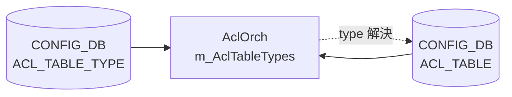
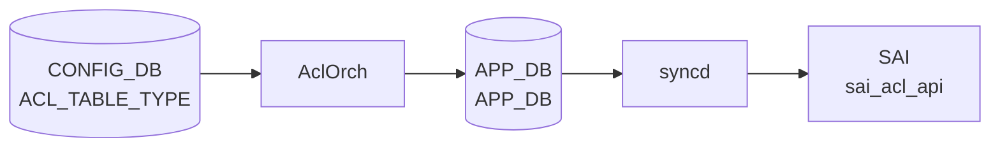

# ACL_TABLE_TYPE テーブル

## 概要

`ACL_TABLE_TYPE` はユーザ定義の [ACL](../../reference/glossary.md#term-acl) テーブルタイプを格納する [CONFIG_DB](../../reference/glossary.md#term-config_db) テーブル[^1]。
`ACL_TABLE` の `type` フィールドから leafref で参照され、`orchagent` の `AclOrch` が
`doAclTableTypeTask()` で読み取り、内部マップ `m_AclTableTypes` に保持する。
[SAI](../../reference/glossary.md#term-sai) オブジェクトは作成されない（ソフトウェア定義のみ）。

組み込み型（`L3`, `L3V6`, `L3V4V6`, `MIRROR`, `MIRRORV6`, `MIRROR_DSCP`, `PFCWD`, `CTRLPLANE`,
`MCLAG`, `MUX`, `DROP`, `MARK_META`, `MARK_METAV6`, `EGR_SET_DSCP`, `UNDERLAY_SET_DSCP`,
`UNDERLAY_SET_DSCPV6`, `DTEL_FLOW_WATCHLIST`) は [orchagent](../../reference/glossary.md#term-orchagent) 起動時に `initDefaultTableTypes()`
(`aclorch.cpp:3724`) で自動登録されるため、[CONFIG_DB](../../reference/glossary.md#term-config_db) への書き込みは不要。



---

<!-- cdb-mermaid -->
### データフロー (自動生成)



!!! note "凡例"
    CONFIG_DB から SAI までの典型経路を `docs/reference/config-db-orch-map.md` から機械生成したミニ図。詳細・例外は本ページ本文と対応表を参照。
<!-- /cdb-mermaid -->

## key 構造

```text
ACL_TABLE_TYPE|<type_name>
```

`<type_name>` は任意の文字列（大文字小文字区別あり）。組み込み型名と重複した場合は
`addAclTableType()` が `"Table type already exists"` を SWSS_LOG_ERROR でログ出力し `false` を返す
(`aclorch.cpp:4921-4924`)。

---

## フィールド一覧

| フィールド | 定数 | [YANG](../../reference/glossary.md#term-yang) 型 | 必須 | 説明 |
|---|---|---|---|---|
| `MATCHES` | `ACL_TABLE_TYPE_MATCHES` (`acltable.h:18`) | leaf-list string | min-elements 1 ([YANG](../../reference/glossary.md#term-yang)) | カンマ区切りの match キー名。`aclMatchLookup` / `aclRangeTypeLookup` で [SAI](../../reference/glossary.md#term-sai) 属性に変換 |
| `ACTIONS` | `ACL_TABLE_TYPE_ACTIONS` (`acltable.h:20`) | leaf-list string, default `""` | 省略可 | カンマ区切りの action 名。省略時は空 set ([SAI](../../reference/glossary.md#term-sai) action なし) |
| `BIND_POINTS` | `ACL_TABLE_TYPE_BPOINT_TYPES` (`acltable.h:19`) | leaf-list enum | min-elements 1 ([YANG](../../reference/glossary.md#term-yang)) | `PORT` / `PORTCHANNEL` のカンマ区切り |

### `MATCHES` に使用可能な値

`aclMatchLookup` (aclorch.cpp の static map) に含まれるキーを使用可能。代表例:

| match キー | SAI 属性 |
|---|---|
| `SRC_IP` | `SAI_ACL_TABLE_ATTR_FIELD_SRC_IP` |
| `DST_IP` | `SAI_ACL_TABLE_ATTR_FIELD_DST_IP` |
| `SRC_IPV6` | `SAI_ACL_TABLE_ATTR_FIELD_SRC_IPV6` |
| `DST_IPV6` | `SAI_ACL_TABLE_ATTR_FIELD_DST_IPV6` |
| `IP_PROTOCOL` | `SAI_ACL_TABLE_ATTR_FIELD_IP_PROTOCOL` |
| `TCP_FLAGS` | `SAI_ACL_TABLE_ATTR_FIELD_TCP_FLAGS` |
| `L4_SRC_PORT` | `SAI_ACL_TABLE_ATTR_FIELD_L4_SRC_PORT` |
| `L4_DST_PORT` | `SAI_ACL_TABLE_ATTR_FIELD_L4_DST_PORT` |
| `ETHER_TYPE` | `SAI_ACL_TABLE_ATTR_FIELD_ETHER_TYPE` |
| `VLAN_ID` | `SAI_ACL_TABLE_ATTR_FIELD_OUTER_VLAN_ID` |
| `IN_PORTS` | `SAI_ACL_TABLE_ATTR_FIELD_IN_PORTS` |
| `OUT_PORTS` | `SAI_ACL_TABLE_ATTR_FIELD_OUT_PORTS` |
| `L4_SRC_PORT_RANGE` / `L4_DST_PORT_RANGE` | `SAI_ACL_RANGE_TYPE_L4_SRC_PORT_RANGE` / `SAI_ACL_RANGE_TYPE_L4_DST_PORT_RANGE` (`aclRangeTypeLookup`) |

### `ACTIONS` に使用可能な値

`aclL3ActionLookup`, `aclMirrorStageLookup`, `aclDTelActionLookup` のキーを使用可能。代表例:

| action キー | 説明 |
|---|---|
| `PACKET_ACTION` | FORWARD / DROP / COPY |
| `REDIRECT_ACTION` | リダイレクト |
| `MIRROR_INGRESS_ACTION` | Ingress mirror |
| `MIRROR_EGRESS_ACTION` | Egress mirror |

!!! warning "ACTIONS の有効値"
    `ACTION_COUNTER` (`"COUNTER"`)、`ACTION_META_DATA` (`"META_DATA_ACTION"`)、`ACTION_DSCP` (`"DSCP_ACTION"`) は orchagent の lookup には含まれず、`ACL_TABLE_TYPE.ACTIONS` の有効値ではない (Phase E 参照)。CONFIG_DB に書いても erase される。

---

## 書き込み例

```bash
# CLI 経由（config acl table は ACL_TABLE を書く; ACL_TABLE_TYPE は直接 CONFIG_DB へ）
sonic-db-cli CONFIG_DB hmset 'ACL_TABLE_TYPE|MY_CUSTOM_TYPE' \
  MATCHES 'SRC_IP,DST_IP,L4_SRC_PORT,L4_DST_PORT,IP_PROTOCOL' \
  ACTIONS 'PACKET_ACTION' \
  BIND_POINTS 'PORT,PORTCHANNEL'
```

---

<!-- ordering -->
## 書込み順依存 (Phase B)

> 調査対象: `sonic-swss/orchagent/aclorch.cpp`, `orchagent/acltable.h`
> 調査日: 2026-05-17

### 他テーブルへの先行必須

| 操作 | 必須順序 | コード根拠 |
|------|---------|-----------|
| カスタム type を参照する `ACL_TABLE` の SET | `ACL_TABLE_TYPE` を先に SET | `doAclTableTask()` (`aclorch.cpp:5432-5436`) — `getAclTableType()` が null なら `it++` (retry) |
| `ACL_TABLE` の SET → `ACL_RULE` の SET | `ACL_TABLE_TYPE` → `ACL_TABLE` → `ACL_RULE` の順 | `doAclRuleTask()` (`aclorch.cpp:5556-5566`) — table_oid 未登録時は `it++` (retry) |

`ACL_TABLE_TYPE` 書き込みが `ACL_TABLE` より遅れた場合、[orchagent](../../reference/glossary.md#term-orchagent) は `ACL_TABLE` エントリを
`it++` で `m_toSync` に保留し、次回 `doTask()` 呼び出し時（Config DB 変更通知）に再処理する。
[CONFIG_DB](../../reference/glossary.md#term-config_db) への同時書き込みであっても、通知到達順によっては `ACL_TABLE` が先に処理されることがあるため、
**明示的に順序を守る**ことが推奨される。

### 組み込み型は先行不要

組み込み型（`L3`, `L3V6`, `L3V4V6`, `MIRROR`, `MIRRORV6`, `MIRROR_DSCP`, `PFCWD`, `CTRLPLANE`,
`MCLAG`, `MUX`, `DROP`, `MARK_META`, `MARK_METAV6`, `EGR_SET_DSCP`, `UNDERLAY_SET_DSCP`,
`UNDERLAY_SET_DSCPV6`, `DTEL_FLOW_WATCHLIST`) は [orchagent](../../reference/glossary.md#term-orchagent) の `initDefaultTableTypes()`
(`aclorch.cpp:3724`) で起動時に自動登録される。CONFIG_DB に `ACL_TABLE_TYPE` を書かなくとも
`ACL_TABLE` から参照可能。

### DEL 順序

| 操作 | 必須か | コード根拠 |
|------|-------|-----------|
| `ACL_TABLE_TYPE` DEL（参照中の `ACL_TABLE` あり） | 即時成功（コード上問題なし） | `removeAclTableType()` (`aclorch.cpp:4932-4942`) は参照チェックなし。`AclTable` はコピーを保持 |
| `ACL_TABLE_TYPE` DEL 後に同名 type を再登録せずに `ACL_TABLE` を再 SET | type 未解決 → 保留 | `getAclTableType()` null → `it++` |

### `allPortsReady()` ゲート

`AclOrch::doTask()` (`aclorch.cpp:4276-4279`) 冒頭で `gPortsOrch->allPortsReady()` が false の場合、
`ACL_TABLE_TYPE` を含む全テーブルの処理が skip される。起動直後 / ポート構成変更直後は書き込みが
`m_toSync` に滞留し、ポート初期化完了後に自動再処理される。

<!-- /ordering -->

---

<!-- cross-refs -->
## 暗黙参照テーブル (Phase C)

`ACL_TABLE_TYPE` の処理 (`doAclTableTypeTask()`, `aclorch.cpp:5738-5772`) は
CONFIG_DB / [APPL_DB](../../reference/glossary.md#term-appl_db) の他テーブルを**一切参照しない**。フィールド値の検証は C++ 静的ルックアップマップのみで行われ、外部 DB クエリは発生しない。

ただし `AclOrch::doTask()` 冒頭のゲート (`aclorch.cpp:4276-4279`) により、
`gPortsOrch->allPortsReady()` が false の間は `doAclTableTypeTask()` を含む全処理が skip される。

### このテーブルを参照する側

| 参照元テーブル | 参照フィールド | 参照タイミング | evidence |
|---|---|---|---|
| `ACL_TABLE\|*` (CONFIG_DB) の `type` | カスタム型名 | `ACL_TABLE` SET 処理時。`getAclTableType()` が null なら `it++` 待機（無制限） | `aclorch.cpp:5432-5436` |
| `ACL_TABLE_TABLE\|*` ([APPL_DB](../../reference/glossary.md#term-appl_db)) の `TYPE` | カスタム型名 | 同一コードパス（CONFIG_DB・[APPL_DB](../../reference/glossary.md#term-appl_db) 共通ハンドラ） | `aclorch.cpp:4283-4285` |
| YANG `ACL_TABLE.type` | leafref | YANG バリデーション時 | `sonic-acl.yang.j2:416-418` |

### 静的ルックアップ（DB テーブルではない）

`MATCHES` / `ACTIONS` / `BIND_POINTS` 値の可否判定は C++ コンパイル時定数マップで行われる:

| フィールド | 使用ルックアップ | evidence |
|---|---|---|
| `MATCHES` | `aclMatchLookup`, `aclRangeTypeLookup` | `aclorch.cpp:803-825` |
| `ACTIONS` | `aclL3ActionLookup`, `aclMirrorStageLookup`, `aclDTelActionLookup` | `aclorch.cpp:838-858` |
| `BIND_POINTS` | `aclBindPointTypeLookup` | `aclorch.cpp:103-107`, `881-895` |

不明な値を含む場合は `AclTableTypeParser::parse()` が `false` を返し、エントリは erase される（retry なし）。

!!! note "SAI オブジェクト非生成"
    `ACL_TABLE_TYPE` の処理では SAI オブジェクトは一切作成されない。`m_AclTableTypes` メモリマップへの格納のみで、orchagent 再起動時に CONFIG_DB から再構築される。
<!-- /cross-refs -->

---

<!-- failure -->
## 失敗挙動 (Phase D)

> 調査対象: `sonic-swss/orchagent/aclorch.cpp` L752-897, L4912-4948, L5738-5774
> 調査日: 2026-05-17

### SET 失敗パス

`AclTableTypeParser::parse()` が `false` を返した場合、`doAclTableTypeTask()` は
`SWSS_LOG_ERROR("Failed to parse ACL table type configuration %s")` を出力し、
`it = consumer.m_toSync.erase(it)` でエントリを破棄する（`aclorch.cpp:5752-5756`）。
**retry（`it++`）は存在しない。**

| 失敗ケース | コード根拠 | 動作 |
|---|---|---|
| `MATCHES` に未知の match キー | `parseAclTableTypeMatches()` `aclorch.cpp:818` | SWSS_LOG_ERROR → parse() false → erase |
| `ACTIONS` に未知の action キー | `parseAclTableTypeActions()` `aclorch.cpp:870` | SWSS_LOG_ERROR → parse() false → erase |
| `BIND_POINTS` に `PORT`/`PORTCHANNEL` 以外の値 | `parseAclTableTypeBindPointTypes()` `aclorch.cpp:887` | SWSS_LOG_ERROR → parse() false → erase |
| 未知フィールド名（`MATCHES`/`ACTIONS`/`BIND_POINTS` 以外） | `parse()` `aclorch.cpp:788` | SWSS_LOG_ERROR → parse() false → erase |
| 組み込み型名・既存 type 名と重複した SET | `addAclTableType()` `aclorch.cpp:4924` | SWSS_LOG_ERROR → addAclTableType() false → erase（既存エントリ不変） |

`ACTIONS` フィールドが空文字列 (`""`) の場合は `tokenize()` が空リストを返し、
`parseAclTableTypeActions()` は成功（エラーにならない）。

### DEL 失敗パス

| 失敗ケース | コード根拠 | 動作 |
|---|---|---|
| 未登録 type 名の DEL | `removeAclTableType()` `aclorch.cpp:4941-4944` | SWSS_LOG_ERROR → removeAclTableType() false → erase（m_AclTableTypes 不変） |

### retry / STATE_DB / rollback

`ACL_TABLE_TYPE` 処理には **`it++` retry パターンが存在しない**。
全失敗ケースで `erase(it)` が実行され、再処理は行われない。

- **[STATE_DB](../../reference/glossary.md#term-state_db)**: 書き込みなし（`setAclTableStatus()` は呼ばれない）
- **ERROR_TABLE**: 書き込みなし
- **syslog のみ**: `journalctl -u swss | grep "ACL table type"` で確認
- **SAI 影響**: ゼロ（`ACL_TABLE_TYPE` は SAI オブジェクト非生成）
- **リカバリ**: `DEL → SET` で同名エントリを再作成すれば即座に復旧可能（CONFIG_DB のエントリは失敗後も残る）

<!-- /failure -->

---

<!-- constants -->
## ハードコード定数 (Phase E)

> 調査対象: `sonic-swss/orchagent/aclorch.h` L26-81、`orchagent/acltable.h` L18-20、`orchagent/aclorch.cpp` L58-136
> 調査日: 2026-05-17

### フィールドキー定数 (acltable.h:18-20)

`AclTableTypeParser::parse()` (`aclorch.cpp:765`) が使用する、CONFIG_DB フィールド名マクロ:

| マクロ名 | 値 | 行 |
|---|---|---|
| `ACL_TABLE_TYPE_MATCHES` | `"MATCHES"` | `acltable.h:18` |
| `ACL_TABLE_TYPE_BPOINT_TYPES` | `"BIND_POINTS"` | `acltable.h:19` |
| `ACL_TABLE_TYPE_ACTIONS` | `"ACTIONS"` | `acltable.h:20` |

これら 3 値以外のフィールド名が CONFIG_DB に書かれた場合、`parse()` は `SWSS_LOG_ERROR` を出力して erase する（`aclorch.cpp:788-791`）。

### MATCHES フィールド有効値定数 (aclorch.h:26-60)

`aclMatchLookup` (`aclorch.cpp:58-95`) および `aclRangeTypeLookup` (`aclorch.cpp:97-101`) に定義された全有効値:

| マクロ名 | 値 (MATCHES フィールド文字列) | SAI 属性 |
|---|---|---|
| `MATCH_IN_PORTS` | `"IN_PORTS"` | `SAI_ACL_ENTRY_ATTR_FIELD_IN_PORTS` |
| `MATCH_OUT_PORT` | `"OUT_PORT"` | `SAI_ACL_ENTRY_ATTR_FIELD_OUT_PORT` |
| `MATCH_OUT_PORTS` | `"OUT_PORTS"` | `SAI_ACL_ENTRY_ATTR_FIELD_OUT_PORTS` |
| `MATCH_SRC_IP` | `"SRC_IP"` | `SAI_ACL_ENTRY_ATTR_FIELD_SRC_IP` |
| `MATCH_DST_IP` | `"DST_IP"` | `SAI_ACL_ENTRY_ATTR_FIELD_DST_IP` |
| `MATCH_SRC_IPV6` | `"SRC_IPV6"` | `SAI_ACL_ENTRY_ATTR_FIELD_SRC_IPV6` |
| `MATCH_DST_IPV6` | `"DST_IPV6"` | `SAI_ACL_ENTRY_ATTR_FIELD_DST_IPV6` |
| `MATCH_L4_SRC_PORT` | `"L4_SRC_PORT"` | `SAI_ACL_ENTRY_ATTR_FIELD_L4_SRC_PORT` |
| `MATCH_L4_DST_PORT` | `"L4_DST_PORT"` | `SAI_ACL_ENTRY_ATTR_FIELD_L4_DST_PORT` |
| `MATCH_ETHER_TYPE` | `"ETHER_TYPE"` | `SAI_ACL_ENTRY_ATTR_FIELD_ETHER_TYPE` |
| `MATCH_VLAN_ID` | `"VLAN_ID"` | `SAI_ACL_ENTRY_ATTR_FIELD_OUTER_VLAN_ID` |
| `MATCH_IP_PROTOCOL` | `"IP_PROTOCOL"` | `SAI_ACL_ENTRY_ATTR_FIELD_IP_PROTOCOL` |
| `MATCH_NEXT_HEADER` | `"NEXT_HEADER"` | `SAI_ACL_ENTRY_ATTR_FIELD_IPV6_NEXT_HEADER` |
| `MATCH_TCP_FLAGS` | `"TCP_FLAGS"` | `SAI_ACL_ENTRY_ATTR_FIELD_TCP_FLAGS` |
| `MATCH_IP_TYPE` | `"IP_TYPE"` | `SAI_ACL_ENTRY_ATTR_FIELD_ACL_IP_TYPE` |
| `MATCH_DSCP` | `"DSCP"` | `SAI_ACL_ENTRY_ATTR_FIELD_DSCP` |
| `MATCH_TC` | `"TC"` | `SAI_ACL_ENTRY_ATTR_FIELD_TC` |
| `MATCH_ICMP_TYPE` | `"ICMP_TYPE"` | `SAI_ACL_ENTRY_ATTR_FIELD_ICMP_TYPE` |
| `MATCH_ICMP_CODE` | `"ICMP_CODE"` | `SAI_ACL_ENTRY_ATTR_FIELD_ICMP_CODE` |
| `MATCH_ICMPV6_TYPE` | `"ICMPV6_TYPE"` | `SAI_ACL_ENTRY_ATTR_FIELD_ICMPV6_TYPE` |
| `MATCH_ICMPV6_CODE` | `"ICMPV6_CODE"` | `SAI_ACL_ENTRY_ATTR_FIELD_ICMPV6_CODE` |
| `MATCH_L4_SRC_PORT_RANGE` | `"L4_SRC_PORT_RANGE"` | `SAI_ACL_RANGE_TYPE_L4_SRC_PORT_RANGE` (range) |
| `MATCH_L4_DST_PORT_RANGE` | `"L4_DST_PORT_RANGE"` | `SAI_ACL_RANGE_TYPE_L4_DST_PORT_RANGE` (range) |
| `MATCH_TUNNEL_VNI` | `"TUNNEL_VNI"` | `SAI_ACL_ENTRY_ATTR_FIELD_TUNNEL_VNI` |
| `MATCH_INNER_ETHER_TYPE` | `"INNER_ETHER_TYPE"` | `SAI_ACL_ENTRY_ATTR_FIELD_INNER_ETHER_TYPE` |
| `MATCH_INNER_IP_PROTOCOL` | `"INNER_IP_PROTOCOL"` | `SAI_ACL_ENTRY_ATTR_FIELD_INNER_IP_PROTOCOL` |
| `MATCH_INNER_SRC_MAC` | `"INNER_SRC_MAC"` | `SAI_ACL_ENTRY_ATTR_FIELD_INNER_SRC_MAC` |
| `MATCH_INNER_DST_MAC` | `"INNER_DST_MAC"` | `SAI_ACL_ENTRY_ATTR_FIELD_INNER_DST_MAC` |
| `MATCH_INNER_SRC_IP` | `"INNER_SRC_IP"` | `SAI_ACL_ENTRY_ATTR_FIELD_INNER_SRC_IP` |
| `MATCH_INNER_L4_SRC_PORT` | `"INNER_L4_SRC_PORT"` | `SAI_ACL_ENTRY_ATTR_FIELD_INNER_L4_SRC_PORT` |
| `MATCH_INNER_L4_DST_PORT` | `"INNER_L4_DST_PORT"` | `SAI_ACL_ENTRY_ATTR_FIELD_INNER_L4_DST_PORT` |
| `MATCH_BTH_OPCODE` | `"BTH_OPCODE"` | `SAI_ACL_ENTRY_ATTR_FIELD_BTH_OPCODE` |
| `MATCH_AETH_SYNDROME` | `"AETH_SYNDROME"` | `SAI_ACL_ENTRY_ATTR_FIELD_AETH_SYNDROME` |
| `MATCH_TUNNEL_TERM` | `"TUNNEL_TERM"` | `SAI_ACL_ENTRY_ATTR_FIELD_TUNNEL_TERMINATED` |
| `MATCH_METADATA` | `"META_DATA"` | `SAI_ACL_ENTRY_ATTR_FIELD_ACL_USER_META` |

`L4_SRC_PORT_RANGE` / `L4_DST_PORT_RANGE` は `aclRangeTypeLookup` が優先チェックされ、range として扱われる (`aclorch.cpp:803-815`)。

### BIND_POINTS フィールド有効値定数 (aclorch.h:62-63)

| マクロ名 | 値 | SAI マッピング | 行 |
|---|---|---|---|
| `BIND_POINT_TYPE_PORT` | `"PORT"` | `SAI_ACL_BIND_POINT_TYPE_PORT` | `aclorch.h:62`, `aclorch.cpp:105` |
| `BIND_POINT_TYPE_PORTCHANNEL` | `"PORTCHANNEL"` | `SAI_ACL_BIND_POINT_TYPE_LAG` | `aclorch.h:63`, `aclorch.cpp:106` |

`aclBindPointTypeLookup` にはこの 2 値のみ。`VLAN` / `SWITCH` は `ACL_TABLE_TYPE.BIND_POINTS` では使用不可。

### ACTIONS フィールド有効値定数 (aclorch.h:65-77)

3 つの lookup map に分散:

**aclL3ActionLookup** (`aclorch.cpp:109-115`):

| マクロ名 | 値 | SAI 属性 |
|---|---|---|
| `ACTION_PACKET_ACTION` | `"PACKET_ACTION"` | `SAI_ACL_ENTRY_ATTR_ACTION_PACKET_ACTION` |
| `ACTION_REDIRECT_ACTION` | `"REDIRECT_ACTION"` | `SAI_ACL_ENTRY_ATTR_ACTION_REDIRECT` |
| `ACTION_DO_NOT_NAT_ACTION` | `"DO_NOT_NAT_ACTION"` | `SAI_ACL_ENTRY_ATTR_ACTION_NO_NAT` |
| `ACTION_DISABLE_TRIM` | `"DISABLE_TRIM_ACTION"` | `SAI_ACL_ENTRY_ATTR_ACTION_PACKET_TRIM_DISABLE` |

**aclMirrorStageLookup** (`aclorch.cpp:122-126`):

| マクロ名 | 値 | SAI 属性 |
|---|---|---|
| `ACTION_MIRROR_INGRESS_ACTION` | `"MIRROR_INGRESS_ACTION"` | `SAI_ACL_ENTRY_ATTR_ACTION_MIRROR_INGRESS` |
| `ACTION_MIRROR_EGRESS_ACTION` | `"MIRROR_EGRESS_ACTION"` | `SAI_ACL_ENTRY_ATTR_ACTION_MIRROR_EGRESS` |

**aclDTelActionLookup** (`aclorch.cpp:128-136`):

| マクロ名 | 値 | SAI 属性 |
|---|---|---|
| `ACTION_DTEL_FLOW_OP` | `"FLOW_OP"` | `SAI_ACL_ENTRY_ATTR_ACTION_ACL_DTEL_FLOW_OP` |
| `ACTION_DTEL_INT_SESSION` | `"INT_SESSION"` | `SAI_ACL_ENTRY_ATTR_ACTION_DTEL_INT_SESSION` |
| `ACTION_DTEL_DROP_REPORT_ENABLE` | `"DROP_REPORT_ENABLE"` | `SAI_ACL_ENTRY_ATTR_ACTION_DTEL_DROP_REPORT_ENABLE` |
| `ACTION_DTEL_TAIL_DROP_REPORT_ENABLE` | `"TAIL_DROP_REPORT_ENABLE"` | `SAI_ACL_ENTRY_ATTR_ACTION_DTEL_TAIL_DROP_REPORT_ENABLE` |
| `ACTION_DTEL_FLOW_SAMPLE_PERCENT` | `"FLOW_SAMPLE_PERCENT"` | `SAI_ACL_ENTRY_ATTR_ACTION_DTEL_FLOW_SAMPLE_PERCENT` |
| `ACTION_DTEL_REPORT_ALL_PACKETS` | `"REPORT_ALL_PACKETS"` | `SAI_ACL_ENTRY_ATTR_ACTION_DTEL_REPORT_ALL_PACKETS` |

!!! note "COUNTER / META_DATA_ACTION / DSCP_ACTION は無効"
    `ACTION_COUNTER` (`"COUNTER"`)、`ACTION_META_DATA` (`"META_DATA_ACTION"`)、`ACTION_DSCP` (`"DSCP_ACTION"`) はいずれの lookup にも含まれず、`ACL_TABLE_TYPE.ACTIONS` の有効値ではない。これらは `ACL_RULE` の個別フィールドとして処理される別パスを持つ。

<!-- /constants -->

---

<!-- side-effects -->
## 副作用 (Phase F)

`ACL_TABLE_TYPE` エントリの SET/DEL は **orchagent 内の in-memory マップ `m_AclTableTypes`** のみを変更する。SAI API 呼び出し・[STATE_DB](../../reference/glossary.md#term-state_db) 書き込み・AppDB 書き込みはいずれも発生しない。[^2]

### SET 時の副作用

#### 1. `m_AclTableTypes` へのエントリ追加

`addAclTableType()` が成功すると `AclOrch::m_AclTableTypes`（`unordered_map<string, AclTableType>`）にエントリが追加される。以降、同名の `ACL_TABLE` が CONFIG_DB / AppDB に到着した際に `getAclTableType()` が参照する。

#### 2. 後続 `ACL_TABLE` 処理のアンブロック

`doAclTableTask()` は `ACL_TABLE_TYPE` が未登録の状態で `ACL_TABLE` が先に到着すると `it++`（retry pending）で保留する。`ACL_TABLE_TYPE` の SET が成功して `m_AclTableTypes` に登録されると、次の `doTask()` サイクルでペンディングが解消され、SAI テーブル生成・[STATE_DB](../../reference/glossary.md#term-state_db) `ACL_TABLE_TABLE` への `status=active` 書き込みが行われる。

### DEL 時の副作用

#### 3. `m_AclTableTypes` からのエントリ削除

`removeAclTableType()` はエントリを削除するのみ。既存の `AclTable` は `AclTableType` のコピーを保持しているため、削除しても実行中の [ACL](../../reference/glossary.md#term-acl) テーブルへの影響はない（SAI オブジェクトも存在しないため SAI 側変更もなし）。

#### 4. 新規 `ACL_TABLE` の参照失敗

DEL 後に同名 type を参照する新規 `ACL_TABLE` が到着すると `getAclTableType()` が `nullptr` を返し、`doAclTableTask()` の `it++` ループでペンディングが蓄積する。

### STATE_DB への影響なし

`doAclTableTypeTask()` は `setAclTableStatus()` を一切呼び出さない。以下の STATE_DB テーブルへの書き込みは `ACL_TABLE_TYPE` の処理では発生しない:

| STATE_DB テーブル | 書き込みトリガ |
|---|---|
| `ACL_TABLE_TABLE` | `doAclTableTask()` （`ACL_TABLE` の SET/DEL 時） |
| `ACL_RULE_TABLE` | `doAclRuleTask()` （`ACL_RULE` の SET/DEL 時） |
| `ACL_STAGE_CAPABILITY_TABLE` | `queryAclActionCapability()` （起動時 SAI 問い合わせ） |

### 副作用サマリ

| 操作 | 直接副作用 | 間接副作用 |
|---|---|---|
| SET（parse 成功・新規） | `m_AclTableTypes` に追加 | 後続ペンディング `ACL_TABLE` のアンブロック → SAI テーブル生成・STATE_DB 書込み |
| SET（parse 失敗 or 重複） | なし | なし |
| DEL（登録済み） | `m_AclTableTypes` から削除 | 同名 type 参照の新規 `ACL_TABLE` がペンディング蓄積 |
| DEL（未登録） | なし | なし |

<!-- /side-effects -->

---

<!-- pubsub -->
## 通信メカニズム (Phase G)

> 調査対象: `sonic-swss/orchagent/aclorch.cpp` L4197-4299、`orchagent/orchdaemon.cpp` L408-422, L533-534、`orchagent/orch.cpp` L1186-1196
> 調査日: 2026-05-17

`ACL_TABLE_TYPE` には **CONFIG_DB 経路** と **APPL_DB 経路** の 2 つの購読チャンネルがある。

### 購読チャンネル一覧

| チャンネル | DB | テーブル名 | 購読クラス | 発行元 |
|---|---|---|---|---|
| CONFIG_DB | CONFIG_DB (dbId=4) | `ACL_TABLE_TYPE`（`CFG_ACL_TABLE_TYPE_TABLE_NAME`） | `SubscriberStateTable` | `sonic-cfggen` / `config` CLI / `swssconfig` |
| APPL_DB | APPL_DB (dbId=0) | `ACL_TABLE_TYPE_TABLE`（`APP_ACL_TABLE_TYPE_TABLE_NAME`） | `ConsumerStateTable` | `VnetOrch`、`DashEniFwdOrch`（内部 [ProducerStateTable](../../reference/glossary.md#term-producerstatetable)） |

`Orch::addConsumer()` (`orch.cpp:1186-1196`) は DB の `getDbId()` により購読クラスを切り替える。CONFIG_DB には `SubscriberStateTable`（[Redis](../../reference/glossary.md#term-redis) keyspace 通知）、APPL_DB には `ConsumerStateTable`（[Redis](../../reference/glossary.md#term-redis) Lists）が選ばれる。

### CONFIG_DB 経路（`SubscriberStateTable`）

`confDbAclTableType` は `acl_table_connectors` の**先頭**に置かれる (`orchdaemon.cpp:415-416`)。

```cpp
// orchdaemon.cpp:408-422
TableConnector confDbAclTableType(m_configDb, CFG_ACL_TABLE_TYPE_TABLE_NAME);
TableConnector appDbAclTableType(m_applDb, APP_ACL_TABLE_TYPE_TABLE_NAME);
vector<TableConnector> acl_table_connectors = {
    confDbAclTableType, confDbAclTable, confDbAclRuleTable,
    appDbAclTable, appDbAclRuleTable, appDbAclTableType,
};
```

- [Redis](../../reference/glossary.md#term-redis) keyspace 通知 (`PSUBSCRIBE __keyspace@4__:ACL_TABLE_TYPE|*`) を購読。CONFIG_DB への `HSET "ACL_TABLE_TYPE|<name>" ...` が自動的に PUBLISH される。
- 1 回の `pops()` で最大 `DEFAULT_POP_BATCH_SIZE = 128` 件を一括取得 (`table.h:164`)。
- **起動時スナップショット**: `SubscriberStateTable` は購読開始前に既存エントリを `m_buffer` へ流し込む。orchagent 再起動後も CONFIG_DB に残存する `ACL_TABLE_TYPE` エントリは SET として再配信され、`m_AclTableTypes` が再構築される。

### APPL_DB 経路（`ConsumerStateTable`）

`ProducerStateTable` → Redis Lists → `ConsumerStateTable` の pops() で受信。現在 APPL_DB 経由で書く実装:

| 実装 | ファイル | 用途 |
|---|---|---|
| `VnetOrch` | `orchagent/vnetorch.cpp:3738, 3781` | [VNET](../../reference/glossary.md#term-vnet) トンネル終端用カスタム type を自動 SET |
| `DashEniFwdOrch` | `orchagent/dash/dashenifwdorch.cpp:404, 625, 649` | [DASH](../../reference/glossary.md#term-dash) [ENI](../../reference/glossary.md#term-eni) フォワーディング用 type を SET / DEL |

- バッチサイズ: `gBatchSize`（orchagent 起動時に決定、デフォルト 128）。
- 起動時スナップショット機能は `ConsumerStateTable` にはなく、orchagent 再起動時に APPL_DB 経由の type は上位 orch（`VnetOrch` 等）が再 SET する責任を持つ。

### ディスパッチ

両チャンネルの通知は共通の `AclOrch::doTask(Consumer&)` (`aclorch.cpp:4272`) → `doAclTableTypeTask(consumer)` (`aclorch.cpp:4291-4294`) に合流する。CONFIG_DB と APPL_DB の区別は `doAclTableTypeTask()` 内では行われない。

<!-- /pubsub -->

---

<!-- platform -->
## プラットフォーム差 (Phase H)

`ACL_TABLE_TYPE` のプラットフォーム依存性は 2 つの経路で顕在化する: (1) `initDefaultTableTypes()` による **組み込み型の定義差**、(2) SAI capability クエリによる **アクション有効/無効の差**。ユーザ定義型（CONFIG_DB に書き込む型）は `AclTableTypeParser` が解析するが、記述できる match/action の有効性は実行時の [ASIC](../../reference/glossary.md#term-asic) capability に委ねられる。

### プラットフォーム識別文字列 (orch.h:40-50)

| 定数 | 値 | プラットフォーム例 |
|------|----|--------------------|
| `BRCM_PLATFORM_SUBSTRING` | `"broadcom"` | Broadcom XGS (非 DNX) |
| `BRCM_DNX_PLATFORM_SUBSTRING` | `"broadcom-dnx"` | Broadcom DNX/Jericho (`sub_platform`) |
| `MLNX_PLATFORM_SUBSTRING` | `"mellanox"` | Mellanox Spectrum |
| `BFN_PLATFORM_SUBSTRING` | `"barefoot"` | Intel Tofino (Barefoot) |
| `VS_PLATFORM_SUBSTRING` | `"vs"` | Virtual Switch (テスト用) |
| `NPS_PLATFORM_SUBSTRING` | `"nephos"` | Nephos |
| `CISCO_8000_PLATFORM_SUBSTRING` | `"cisco-8000"` | Cisco Silicon One |
| `XS_PLATFORM_SUBSTRING` | `"xsight"` | xsight |
| `CLX_PLATFORM_SUBSTRING` | `"clounix"` | Clounix |
| `MRVL_PRST_PLATFORM_SUBSTRING` | `"marvell-prestera"` | Marvell Prestera |
| `MRVL_TL_PLATFORM_SUBSTRING` | `"marvell-teralynx"` | Marvell Teralynx |

### 組み込み型の platform 分岐 (`initDefaultTableTypes()`)

組み込み `ACL_TABLE_TYPE` は `AclOrch::init()` 末尾 (aclorch.cpp:3717) → `initDefaultTableTypes(platform, sub_platform)` (aclorch.cpp:3724) で `m_AclTableTypes` に直接登録される。CONFIG_DB には現れないが、同名キーを `ACL_TABLE_TYPE|<name>` として SET すると `doAclTableTypeTask()` が上書きする。

#### TABLE_TYPE_PFCWD のみプラットフォーム分岐あり (aclorch.cpp:3811-3830)

| 条件 | `BIND_POINT_TYPES` | `MATCHES` |
|------|--------------------|-----------|
| `platform == "broadcom"` **かつ** `sub_platform == "broadcom-dnx"` | `PORT_TYPE_SWITCH` | `TC`, `OUT_PORT` |
| その他すべて | `PORT_TYPE_PORT` | `TC` |

broadcom-dnx では PFCWD テーブルが switch 単位バインドになり、CONFIG_DB の `ports` フィールドが無視される。ユーザ定義型で `PFCWD` 相当の type を書く場合、この差に注意が必要。

!!! note "他の組み込み型はプラットフォーム不問"
    `L3` / `L3V6` / `L3V4V6` / `MIRROR` / `MIRRORV6` / `MIRROR_DSCP` / `MCLAG` / `MUX` / `DROP` / `MARK_META` / `MARK_META_V6` / `EGR_SET_DSCP` は platform 引数によらず固定の match/action で登録される (`aclorch.cpp:3730-3898`)。

### SAI アクション capability によるユーザ定義型への影響

ユーザ定義 `ACL_TABLE_TYPE` の `ACTIONS` はパース時点では制限されない。ただし以下の状況で実行時にアクション有効性が決まる:

| capability | クエリ方法 | 失敗時の挙動 |
|------------|-----------|-------------|
| ingress/egress action list | `SAI_SWITCH_ATTR_ACL_STAGE_INGRESS` / `..._EGRESS` の `aclcapability` | `initDefaultAclActionCapabilities(stage)` が組み込みデフォルト値を使用 |
| `is_action_list_mandatory` | 同上 | false 扱い（mandatory action 自動付与なし） |
| META_DATA 系 | `sai_query_attribute_capability()` (VS のみ固定 true) | 未実装 → `ACL_TABLE_TYPE` の `META_DATA` match / action が SAI に反映されない可能性あり |

capability 結果は `STATE_DB` の `ACL_STAGE_CAPABILITY_TABLE|{INGRESS,EGRESS}` に記録される (`aclorch.cpp:4056-4101`)。

### プラットフォーム別 ACL_TABLE_TYPE への影響サマリ

| プラットフォーム | PFCWD 組み込み型の変化 | META_DATA capability | L3V4V6 (ACL_TABLE で有効か) |
|----------------|----------------------|----------------------|-----------------------------|
| broadcom (非 DNX) | なし | SAI 動的照会 | no |
| **broadcom-dnx** | **SWITCH bind / TC+OUT_PORT** | SAI 動的照会 | no |
| mellanox | なし | SAI 動的照会 | no |
| barefoot | なし | SAI 動的照会 | no |
| cisco-8000 | なし | SAI 動的照会 | no |
| marvell-prestera | なし | SAI 動的照会 | yes |
| marvell-teralynx | なし | SAI 動的照会 | yes |
| nephos | なし | SAI 動的照会 | no |
| xsight | なし | SAI 動的照会 | no |
| clounix | なし | SAI 動的照会 | no |
| vs (virtual) | なし | **強制 true** (固定 range 1–7) | yes |
| 未知 | なし | SAI 動的照会 | no |

!!! warning "ユーザ定義 ACL_TABLE_TYPE の match/action の安全確認"
    CONFIG_DB に `ACL_TABLE_TYPE` を書き込む際、ASIC がサポートしない match (`ACL_USER_META` 等) や action を `MATCHES` / `ACTIONS` に列挙しても `AclTableTypeParser` はエラーを返さない。実際の SAI 適用可否は `ACL_TABLE` を作成するときの `AclTable::createToDb()` 段で判明する。`STATE_DB ACL_STAGE_CAPABILITY_TABLE|INGRESS` の `action_list` で使用可能なアクションを事前確認すること。

!!! note "range match の上限 (mellanox / clounix)"
    mellanox: `MLNX_MAX_RANGES_COUNT = 16`、clounix: `CLNX_MAX_RANGES_COUNT = 16` (`aclorch.h:109-110`)。`ACL_TABLE_TYPE` 定義で range match (`L4_SRC_PORT_RANGE` / `L4_DST_PORT_RANGE`) を含む型を作っても、配下 ACL_RULE での range オブジェクト累計が上限を超えると SAI エラーになる。ACL_TABLE_TYPE 段では検出されない。

> **スキャン証跡**: `AclOrch::init()` L3480-3720 / `initDefaultTableTypes()` L3724-3830 / `AclTableTypeParser::parseAclTableTypeActions()` L831-879 / `AclTableTypeParser::parseAclTableTypeMatches()` L796-829 / `queryAclActionCapabilities()` L3969-4053 / `putAclActionCapabilityInDB()` L4056-4101 / `orch.h:40-50` / `aclorch.h:109-110` 全行精読。中間ファイル: `meta/_intermediate/cdb-flow/acl-table-type-platform.md`
<!-- /platform -->

---

## 関連 CONFIG_DB / CLI

- CONFIG_DB: [`ACL_TABLE`](acl-table.md)、[`ACL_RULE`](acl-rule.md)、[`APPL_DB ACL`](appl-acl.md)
- CLI: [`show acl`](../cli/show-acl.md)、[`config acl`](../cli/config-acl.md)
- YANG: `sonic-acl` (`sonic-acl.yang.j2` — `ACL_TABLE_TYPE` コンテナ)

## 引用元

[^1]: テーブル定義は `sonic-buildimage/src/sonic-yang-models/yang-templates/sonic-acl.yang.j2` (sha `9ea932ec`) L354-388 (`ACL_TABLE_TYPE` コンテナ) より。処理ロジックは `sonic-swss/orchagent/aclorch.cpp` (sha `43055961`) L752-895 (`AclTableTypeParser`)、L4912-4942 (`addAclTableType`/`removeAclTableType`)、L5740-5773 (`doAclTableTypeTask`)、L3724 (`initDefaultTableTypes`) より。フィールド定数は `orchagent/acltable.h` L18-20 より。
[^2]: 副作用の調査は `sonic-swss/orchagent/aclorch.cpp` (sha `43055961`) `doAclTableTypeTask()` L5738-5774、`addAclTableType()` L4912-4930、`removeAclTableType()` L4932-4948、`doAclTableTask()` L5432 (`getAclTableType()` による retry 制御) より。STATE_DB テーブル名は `sonic-swss-common/common/schema.h` L418/514/515 より。

<!-- glossary-links-injected: 994156b26b07 -->
