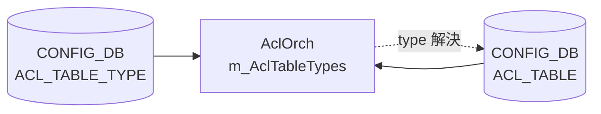

# ACL_TABLE_TYPE テーブル

## 概要

`ACL_TABLE_TYPE` はユーザー定義の ACL テーブルタイプを格納する [CONFIG_DB](../../reference/glossary.md#term-config_db) テーブル[^1]。
`ACL_TABLE` の `type` フィールドから leafref で参照され、`orchagent` の `AclOrch` が
`doAclTableTypeTask()` で読み取り、内部マップ `m_AclTableTypes` に保持する。
SAI オブジェクトは作成されない（ソフトウェア定義のみ）。

組み込み型（`L3`, `L3V6`, `L3V4V6`, `MIRROR`, `MIRRORV6`, `MIRROR_DSCP`, `PFCWD`, `CTRLPLANE`,
`MCLAG`, `MUX`, `DROP`, `MARK_META`, `MARK_METAV6`, `EGR_SET_DSCP`, `UNDERLAY_SET_DSCP`,
`UNDERLAY_SET_DSCPV6`, `DTEL_FLOW_WATCHLIST`) は orchagent 起動時に `initDefaultTableTypes()`
(`aclorch.cpp:3724`) で自動登録されるため、CONFIG_DB への書き込みは不要。



---

## key 構造

```text
ACL_TABLE_TYPE|<type_name>
```

`<type_name>` は任意の文字列（大文字小文字区別あり）。組み込み型名と重複した場合は
`addAclTableType()` が `"Table type already exists"` を SWSS_LOG_ERROR でログ出力し `false` を返す
(`aclorch.cpp:4921-4924`)。

---

## フィールド一覧

| フィールド | 定数 | YANG 型 | 必須 | 説明 |
|---|---|---|---|---|
| `MATCHES` | `ACL_TABLE_TYPE_MATCHES` (`acltable.h:18`) | leaf-list string | min-elements 1 (YANG) | カンマ区切りの match キー名。`aclMatchLookup` / `aclRangeTypeLookup` で SAI 属性に変換 |
| `ACTIONS` | `ACL_TABLE_TYPE_ACTIONS` (`acltable.h:20`) | leaf-list string, default `""` | 省略可 | カンマ区切りの action 名。省略時は空 set (SAI action なし) |
| `BIND_POINTS` | `ACL_TABLE_TYPE_BPOINT_TYPES` (`acltable.h:19`) | leaf-list enum | min-elements 1 (YANG) | `PORT` / `PORTCHANNEL` のカンマ区切り |

### `MATCHES` に使用可能な値

`aclMatchLookup` (aclorch.cpp の static map) に含まれるキーを使用可能。代表例:

| match キー | SAI 属性 |
|---|---|
| `SRC_IP` | `SAI_ACL_TABLE_ATTR_FIELD_SRC_IP` |
| `DST_IP` | `SAI_ACL_TABLE_ATTR_FIELD_DST_IP` |
| `SRC_IPV6` | `SAI_ACL_TABLE_ATTR_FIELD_SRC_IPV6` |
| `DST_IPV6` | `SAI_ACL_TABLE_ATTR_FIELD_DST_IPV6` |
| `IP_PROTOCOL` | `SAI_ACL_TABLE_ATTR_FIELD_IP_PROTOCOL` |
| `TCP_FLAGS` | `SAI_ACL_TABLE_ATTR_FIELD_TCP_FLAGS` |
| `L4_SRC_PORT` | `SAI_ACL_TABLE_ATTR_FIELD_L4_SRC_PORT` |
| `L4_DST_PORT` | `SAI_ACL_TABLE_ATTR_FIELD_L4_DST_PORT` |
| `ETHER_TYPE` | `SAI_ACL_TABLE_ATTR_FIELD_ETHER_TYPE` |
| `OUTER_VLAN_ID` | `SAI_ACL_TABLE_ATTR_FIELD_OUTER_VLAN_ID` |
| `IN_PORTS` | `SAI_ACL_TABLE_ATTR_FIELD_IN_PORTS` |
| `OUT_PORTS` | `SAI_ACL_TABLE_ATTR_FIELD_OUT_PORTS` |
| `L4_SRC_PORT_RANGE` / `L4_DST_PORT_RANGE` | `SAI_ACL_RANGE_TYPE_L4_SRC_PORT_RANGE` / `SAI_ACL_RANGE_TYPE_L4_DST_PORT_RANGE` (`aclRangeTypeLookup`) |

### `ACTIONS` に使用可能な値

`aclL3ActionLookup`, `aclMirrorStageLookup`, `aclDTelActionLookup` のキーを使用可能。代表例:

| action キー | 説明 |
|---|---|
| `PACKET_ACTION` | FORWARD / DROP / COPY |
| `REDIRECT_ACTION` | リダイレクト |
| `MIRROR_INGRESS_ACTION` | Ingress mirror |
| `MIRROR_EGRESS_ACTION` | Egress mirror |
| `QOS_DSCP_ACTION` | DSCP 書き換え |
| `COUNTER` | ヒットカウンタ (`SAI_ACL_ENTRY_ATTR_ACTION_COUNTER`) |

---

## 書き込み例

```bash
# CLI 経由（config acl table は ACL_TABLE を書く; ACL_TABLE_TYPE は直接 CONFIG_DB へ）
sonic-db-cli CONFIG_DB hmset 'ACL_TABLE_TYPE|MY_CUSTOM_TYPE' \
  MATCHES 'SRC_IP,DST_IP,L4_SRC_PORT,L4_DST_PORT,IP_PROTOCOL' \
  ACTIONS 'PACKET_ACTION,COUNTER' \
  BIND_POINTS 'PORT,PORTCHANNEL'
```

---

<!-- ordering -->
## 書込み順依存 (Phase B)

> 調査対象: `sonic-swss/orchagent/aclorch.cpp`, `orchagent/acltable.h`
> 調査日: 2026-05-17

### 他テーブルへの先行必須

| 操作 | 必須順序 | コード根拠 |
|------|---------|-----------|
| カスタム type を参照する `ACL_TABLE` の SET | `ACL_TABLE_TYPE` を先に SET | `doAclTableTask()` (`aclorch.cpp:5432-5436`) — `getAclTableType()` が null なら `it++` (retry) |
| `ACL_TABLE` の SET → `ACL_RULE` の SET | `ACL_TABLE_TYPE` → `ACL_TABLE` → `ACL_RULE` の順 | `doAclRuleTask()` (`aclorch.cpp:5556-5566`) — table_oid 未登録時は `it++` (retry) |

`ACL_TABLE_TYPE` 書き込みが `ACL_TABLE` より遅れた場合、orchagent は `ACL_TABLE` エントリを
`it++` で `m_toSync` に保留し、次回 `doTask()` 呼び出し時（Config DB 変更通知）に再処理する。
CONFIG_DB への同時書き込みであっても、通知到達順によっては `ACL_TABLE` が先に処理されることがあるため、
**明示的に順序を守る**ことが推奨される。

### 組み込み型は先行不要

組み込み型（`L3`, `L3V6`, `L3V4V6`, `MIRROR`, `MIRRORV6`, `MIRROR_DSCP`, `PFCWD`, `CTRLPLANE`,
`MCLAG`, `MUX`, `DROP`, `MARK_META`, `MARK_METAV6`, `EGR_SET_DSCP`, `UNDERLAY_SET_DSCP`,
`UNDERLAY_SET_DSCPV6`, `DTEL_FLOW_WATCHLIST`) は orchagent の `initDefaultTableTypes()`
(`aclorch.cpp:3724`) で起動時に自動登録される。CONFIG_DB に `ACL_TABLE_TYPE` を書かなくとも
`ACL_TABLE` から参照可能。

### DEL 順序

| 操作 | 必須か | コード根拠 |
|------|-------|-----------|
| `ACL_TABLE_TYPE` DEL（参照中の `ACL_TABLE` あり） | 即時成功（コード上問題なし） | `removeAclTableType()` (`aclorch.cpp:4932-4942`) は参照チェックなし。`AclTable` はコピーを保持 |
| `ACL_TABLE_TYPE` DEL 後に同名 type を再登録せずに `ACL_TABLE` を再 SET | type 未解決 → 保留 | `getAclTableType()` null → `it++` |

### `allPortsReady()` ゲート

`AclOrch::doTask()` (`aclorch.cpp:4276-4279`) 冒頭で `gPortsOrch->allPortsReady()` が false の場合、
`ACL_TABLE_TYPE` を含む全テーブルの処理が skip される。起動直後 / ポート構成変更直後は書き込みが
`m_toSync` に滞留し、ポート初期化完了後に自動再処理される。

<!-- /ordering -->

---

<!-- cross-refs -->
## 暗黙参照テーブル (Phase C)

`ACL_TABLE_TYPE` の処理 (`doAclTableTypeTask()`, `aclorch.cpp:5738-5772`) は
CONFIG_DB / APPL_DB の他テーブルを**一切参照しない**。フィールド値の検証は C++ 静的ルックアップマップのみで行われ、外部 DB クエリは発生しない。

ただし `AclOrch::doTask()` 冒頭のゲート (`aclorch.cpp:4276-4279`) により、
`gPortsOrch->allPortsReady()` が false の間は `doAclTableTypeTask()` を含む全処理が skip される。

### このテーブルを参照する側

| 参照元テーブル | 参照フィールド | 参照タイミング | evidence |
|---|---|---|---|
| `ACL_TABLE\|*` (CONFIG_DB) の `type` | カスタム型名 | `ACL_TABLE` SET 処理時。`getAclTableType()` が null なら `it++` 待機（無制限） | `aclorch.cpp:5432-5436` |
| `ACL_TABLE_TABLE\|*` (APPL_DB) の `TYPE` | カスタム型名 | 同一コードパス（CONFIG_DB・APPL_DB 共通ハンドラ） | `aclorch.cpp:4283-4285` |
| YANG `ACL_TABLE.type` | leafref | YANG バリデーション時 | `sonic-acl.yang.j2:416-418` |

### 静的ルックアップ（DB テーブルではない）

`MATCHES` / `ACTIONS` / `BIND_POINTS` 値の可否判定は C++ コンパイル時定数マップで行われる:

| フィールド | 使用ルックアップ | evidence |
|---|---|---|
| `MATCHES` | `aclMatchLookup`, `aclRangeTypeLookup` | `aclorch.cpp:803-825` |
| `ACTIONS` | `aclL3ActionLookup`, `aclMirrorStageLookup`, `aclDTelActionLookup` | `aclorch.cpp:838-858` |
| `BIND_POINTS` | `aclBindPointTypeLookup` | `aclorch.cpp:103-107`, `881-895` |

不明な値を含む場合は `AclTableTypeParser::parse()` が `false` を返し、エントリは erase される（retry なし）。

!!! note "SAI オブジェクト非生成"
    `ACL_TABLE_TYPE` の処理では SAI オブジェクトは一切作成されない。`m_AclTableTypes` メモリマップへの格納のみで、orchagent 再起動時に CONFIG_DB から再構築される。
<!-- /cross-refs -->

---

<!-- failure -->
## 失敗挙動 (Phase D)

> 調査対象: `sonic-swss/orchagent/aclorch.cpp` L752-897, L4912-4948, L5738-5774
> 調査日: 2026-05-17

### SET 失敗パス

`AclTableTypeParser::parse()` が `false` を返した場合、`doAclTableTypeTask()` は
`SWSS_LOG_ERROR("Failed to parse ACL table type configuration %s")` を出力し、
`it = consumer.m_toSync.erase(it)` でエントリを破棄する（`aclorch.cpp:5752-5756`）。
**retry（`it++`）は存在しない。**

| 失敗ケース | コード根拠 | 動作 |
|---|---|---|
| `MATCHES` に未知の match キー | `parseAclTableTypeMatches()` `aclorch.cpp:818` | SWSS_LOG_ERROR → parse() false → erase |
| `ACTIONS` に未知の action キー | `parseAclTableTypeActions()` `aclorch.cpp:870` | SWSS_LOG_ERROR → parse() false → erase |
| `BIND_POINTS` に `PORT`/`PORTCHANNEL` 以外の値 | `parseAclTableTypeBindPointTypes()` `aclorch.cpp:887` | SWSS_LOG_ERROR → parse() false → erase |
| 未知フィールド名（`MATCHES`/`ACTIONS`/`BIND_POINTS` 以外） | `parse()` `aclorch.cpp:788` | SWSS_LOG_ERROR → parse() false → erase |
| 組み込み型名・既存 type 名と重複した SET | `addAclTableType()` `aclorch.cpp:4924` | SWSS_LOG_ERROR → addAclTableType() false → erase（既存エントリ不変） |

`ACTIONS` フィールドが空文字列 (`""`) の場合は `tokenize()` が空リストを返し、
`parseAclTableTypeActions()` は成功（エラーにならない）。

### DEL 失敗パス

| 失敗ケース | コード根拠 | 動作 |
|---|---|---|
| 未登録 type 名の DEL | `removeAclTableType()` `aclorch.cpp:4941-4944` | SWSS_LOG_ERROR → removeAclTableType() false → erase（m_AclTableTypes 不変） |

### retry / STATE_DB / rollback

`ACL_TABLE_TYPE` 処理には **`it++` retry パターンが存在しない**。
全失敗ケースで `erase(it)` が実行され、再処理は行われない。

- **STATE_DB**: 書き込みなし（`setAclTableStatus()` は呼ばれない）
- **ERROR_TABLE**: 書き込みなし
- **syslog のみ**: `journalctl -u swss | grep "ACL table type"` で確認
- **SAI 影響**: ゼロ（`ACL_TABLE_TYPE` は SAI オブジェクト非生成）
- **リカバリ**: `DEL → SET` で同名エントリを再作成すれば即座に復旧可能（CONFIG_DB のエントリは失敗後も残る）

<!-- /failure -->

---

## 関連 CONFIG_DB / CLI

- CONFIG_DB: [`ACL_TABLE`](acl-table.md)、[`ACL_RULE`](acl-rule.md)、[`APPL_DB ACL`](appl-acl.md)
- CLI: [`show acl`](../cli/show-acl.md)、[`config acl`](../cli/config-acl.md)
- YANG: `sonic-acl` (`sonic-acl.yang.j2` — `ACL_TABLE_TYPE` コンテナ)

## 引用元

[^1]: テーブル定義は `sonic-buildimage/src/sonic-yang-models/yang-templates/sonic-acl.yang.j2` (sha `9ea932ec`) L354-388 (`ACL_TABLE_TYPE` コンテナ) より。処理ロジックは `sonic-swss/orchagent/aclorch.cpp` (sha `43055961`) L752-895 (`AclTableTypeParser`)、L4912-4942 (`addAclTableType`/`removeAclTableType`)、L5740-5773 (`doAclTableTypeTask`)、L3724 (`initDefaultTableTypes`) より。フィールド定数は `orchagent/acltable.h` L18-20 より。
