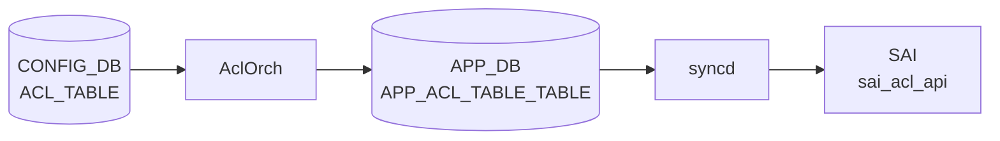

# ACL_TABLE テーブル

## 概要

[ACL](../../reference/glossary.md#term-acl) コンテナ（適用ポイント / 種別 / 段 (ingress/egress)）を定義する [CONFIG_DB](../../reference/glossary.md#term-config_db) テーブル[^1]。`orchagent` の `AclOrch` がこのテーブルを購読し、[SAI](../../reference/glossary.md#term-sai) [ACL](../../reference/glossary.md#term-acl) table を生成、`ACL_RULE` に登録された各エントリを [SAI](../../reference/glossary.md#term-sai) [ACL](../../reference/glossary.md#term-acl) entry として展開する。

!!! warning "YANG 未定義"
    `ACL_TABLE` テーブルは現時点で `sonic-yang-models` に該当する YANG モジュールが存在しない。スキーマの正本は `sonic-swss/orchagent/aclorch.{h,cpp}` の定数と `sonic-swss-common/common/schema.h`。

<!-- cdb-mermaid -->
### データフロー (自動生成)



!!! note "凡例"
    CONFIG_DB から SAI までの典型経路を `docs/reference/config-db-orch-map.md` から機械生成したミニ図。詳細・例外は本ページ本文と対応表を参照。
<!-- /cdb-mermaid -->

## key 構造

```text
ACL_TABLE|<table_name>
```

`<table_name>` はユーザ任意の文字列。

## フィールド一覧

| フィールド | 型 | 必須 | 説明 |
|-----------|----|------|------|
| `policy_desc` | string | - | テーブルの説明文 |
| `type` | string | ✅ | テーブルタイプ。事前定義型または `ACL_TABLE_TYPE` で定義したユーザ定義型 |
| `stage` | enum `ingress`/`egress` | - | ACL 適用段（既定 `ingress`） |
| `ports` | カンマ区切り leafref `PORT.name` / `PORTCHANNEL.name` / `Vlan<id>` | - | バインドポート |
| `services` | カンマ区切り string | - | (Control plane ACL) サービス名 |

## 事前定義 type

`AclOrch` が静的に許可している type:

- `L3` / `L3V6` / `L3V4V6` ... 通常の L3 ACL
- `MIRROR` / `MIRRORV6` / `MIRROR_DSCP` ... mirror セッションへ振分け
- `PFCWD` ... [PFC](../../reference/glossary.md#term-pfc) watchdog 用
- `MCLAG` ... [MCLAG](../../reference/glossary.md#term-mclag) 制御
- `MUX` ... dual-ToR mux 用
- `DROP` ... drop 専用最適化
- `MARK_META` / `MARK_META_V6` ... メタデータマーキング
- `EGR_SET_DSCP` ... egress [DSCP](../../reference/glossary.md#term-dscp) 上書き
- `CTRLPLANE` ... コントロールプレーン (`copp` 制御)

ユーザ定義型は `ACL_TABLE_TYPE|<name>` でフィールド `MATCHES` / `ACTIONS` / `BPOINT_TYPES` を指定する。

## 関連サブテーブル

- `ACL_TABLE_TYPE|<name>`
    - `MATCHES` (string list): 許可する match キー（`SRC_IP`, `DST_IP`, `L4_SRC_PORT` 等）
    - `ACTIONS` (string list): 許可する action（`PACKET_ACTION`, `REDIRECT_ACTION` 等）
    - `BPOINT_TYPES` (string list): バインド可能なポイント種別（`PORT`, `LAG`, `SWITCH`, `VLAN` 等）

## 購読者

- `orchagent` の `AclOrch`: [SAI](../../reference/glossary.md#term-sai) ACL table 生成、ポートへのバインド
- `copporch`: `CTRLPLANE` 系の登録時に連動

## 関連 CONFIG_DB / YANG / CLI

- 関連 [CONFIG_DB](../../reference/glossary.md#term-config_db): `ACL_RULE`、`ACL_TABLE_TYPE`、`PORT`、`PORTCHANNEL`、`MIRROR_SESSION`
- 関連 CLI: [`config acl`](../cli/config-acl.md)
- 関連 [YANG](../../reference/glossary.md#term-yang): なし（[YANG](../../reference/glossary.md#term-yang) 未定義）

<!-- cdb-exceptions -->
## 例外条件・特殊挙動

| 条件 | 挙動 |
|------|------|
| 未知の属性名 | ERROR ログ後 erase、skip |
| `type` 不正 | `processAclTableType()` 失敗、erase、skip |
| `ports` に存在しないポート名 | `processAclTablePorts()` 失敗、erase、skip |
| `ports` に物理 IF 以外（IN_PORTS/OUT_PORTS） | `return false`、erase |
| `stage` が INGRESS/EGRESS 以外 | `processAclTableStage()` 失敗、erase |
| `services` フィールド | `continue` で実質無視（コントロールプレーン ACL 専用） |
| `TABLE_TYPE_UNDERLAY_SET_DSCP`/`V6` | 内部で `TABLE_TYPE_MARK_META`/`V6` に変換して SAI に投入 |
| 既存 table_id への SET | `updateAclTable()` を呼んで再バインド |

<!-- evidence: sonic-net/sonic-swss/orchagent/aclorch.cpp:5346L -->
<!-- /cdb-exceptions -->

<!-- value-behavior -->
## 値依存挙動マトリクス

### `type` 値別挙動

YANG 定義 4 値 (sonic-acl.yang:59-65): `MIRROR/MIRRORV6/L3/L3V6`。
実装定義 (acltable.h:26-42): 14 種以上。`processAclTableType()` は type 空文字のみ reject、それ以外はそのまま通す (aclorch.cpp:5821-5833)。

| 値 | 動作 | ASIC 確認 | evidence |
|---|---|---|---|
| `L3` | IPv4 L3 [ACL](../../reference/glossary.md#term-acl)。INGRESS/EGRESS 両対応 | なし | `acltable.h:26`, `aclorch.cpp:200,454` |
| `L3V6` | IPv6 L3 [ACL](../../reference/glossary.md#term-acl)。`IP_PROTOCOL` 使用は非推奨 (WARN ログ) | なし | `acltable.h:27`, `aclorch.cpp:220,1231` |
| `L3V4V6` | IPv4/IPv6 デュアルスタック ACL | `isAclL3V4V6TableSupported()` 必須 (`aclorch.cpp:2737`) | `acltable.h:28`, `aclorch.cpp:240,3541-3543` |
| `MIRROR` | INGRESS mirror セッション転送専用 | `m_mirrorTableCapabilities[MIRROR]` 必須 | `acltable.h:29`, `aclorch.cpp:260,3502,3671` |
| `MIRRORV6` | IPv6 INGRESS mirror 専用。ASIC によっては MIRROR テーブルに統合 | `m_mirrorTableCapabilities[MIRRORV6]` 必須 | `acltable.h:30`, `aclorch.cpp:279,3503,3510-3511,5811` |
| `MIRROR_DSCP` | [DSCP](../../reference/glossary.md#term-dscp) 値でミラー先決定 | なし | `acltable.h:31`, `aclorch.cpp:298` |
| `PFCWD` | [PFC Watchdog](../../reference/glossary.md#term-pfc-watchdog) 専用。BRCM DNX では `SAI_ACL_BIND_POINT_TYPE_SWITCH` | なし | `acltable.h:32`, `aclorch.cpp:316,3811-3825` |
| `CTRLPLANE` | SAI テーブル作成なし。`copporch` 経由で制御 | なし (stage 無視) | `acltable.h:33`, `aclorch.cpp:2727` |
| `MCLAG` | [MCLAG](../../reference/glossary.md#term-mclag) 制御専用テーブル | なし | `acltable.h:35`, `aclorch.cpp:334,3791` |
| `MUX` | dual-ToR mux 専用テーブル | なし | `acltable.h:36`, `aclorch.cpp:352` |
| `DROP` | drop 最適化テーブル (`IngressTableDrop`/`EgressTableDrop`) | なし | `acltable.h:37`, `aclorch.cpp:370` |
| `MARK_META` | メタデータマーキング (IPv4) | なし | `acltable.h:38`, `aclorch.cpp:388` |
| `MARK_METAV6` | メタデータマーキング (IPv6) | なし | `acltable.h:39`, `aclorch.cpp:400` |
| `EGR_SET_DSCP` | egress [DSCP](../../reference/glossary.md#term-dscp) 書き換え専用。EGRESS stage 固定 | なし | `acltable.h:40`, `aclorch.cpp:412,489` |
| `UNDERLAY_SET_DSCP` | 内部で `MARK_META` に変換して SAI 投入 | なし | `acltable.h:41`, `aclorch.cpp:121 相当` |
| `UNDERLAY_SET_DSCPV6` | 内部で `MARK_METAV6` に変換して SAI 投入 | なし | `acltable.h:42` |

### `stage` 値別挙動

`aclStageLookUp` (aclorch.cpp:164-167) でパース。不正値は `processAclTableStage()` が false を返し erase。

| 値 | SAI stage | 有効 MIRROR action | evidence |
|---|---|---|---|
| `INGRESS` (既定) | `SAI_ACL_STAGE_INGRESS` | `MIRROR_INGRESS_ACTION` 有効 | `aclorch.cpp:166,173,263-266` |
| `EGRESS` | `SAI_ACL_STAGE_EGRESS` | `MIRROR_EGRESS_ACTION` のみ有効 | `aclorch.cpp:167,185,270-272` |

### `ETHER_TYPE` / `IP_TYPE` / `PACKET_ACTION` — ACL_TABLE への直接影響なし

これら 3 フィールドは ACL_TABLE テーブル自体には存在しない (hit 数 0)。`ACL_TABLE_TYPE` サブテーブルの `MATCHES` / `ACTIONS` フィールドで許可する match / action キー名として文字列で列挙することで間接的に参照される。

### 値別 grep カバレッジ

| フィールド | 値数 | 0 hit | 証跡ファイル |
|---|---|---|---|
| `type` | 4 (YANG) / 14+ (実装) | 0 | acltable.h, aclorch.cpp |
| `stage` | 2 | 0 | aclorch.cpp |
| `ETHER_TYPE` | N/A (非フィールド) | — | — |
| `IP_TYPE` | N/A (非フィールド) | — | — |
| `PACKET_ACTION` | N/A (非フィールド) | — | — |

### 複合条件

1. `type=CTRLPLANE` → `stage` フィールドを無視し SAI テーブルを作成しない (`aclorch.cpp:2727`)
2. `type=L3V4V6` + ASIC capability なし → `isAclL3V4V6TableSupported()` が false でテーブル作成失敗 (`aclorch.cpp:2737`)
3. `type=MIRROR` / `MIRRORV6` → 起動時 ASIC capability query、capability なければ reject (`aclorch.cpp:3502-3541`)
4. `type=EGR_SET_DSCP` → EGRESS stage 固定。`stage=INGRESS` を指定しても egress 動作になる (`aclorch.cpp:489`)
<!-- /value-behavior -->

<!-- ref-triangle:start -->

## 関連リファレンス

- CLI: [`config acl`](../cli/config-acl.md)

<!-- ref-triangle:end -->

## 引用元

[^1]: フィールド名・type 値は `sonic-swss/orchagent/aclorch.{h,cpp}` (sha `43055961`) のマクロ定義と type バリデーションロジックから抽出。<https://github.com/sonic-net/sonic-swss/blob/4305596156d70e9797e8a881b3d19b46de0bce0d/orchagent/aclorch.cpp>

## 関連ページ
- [HLD: ACL の基本設計](../../acl-qos/acl-support-in-sonic.md)
- [CLI: config acl](../cli/config-acl.md)
- [CLI: show acl](../cli/show-acl.md)
- [CONFIG_DB: ACL_RULE](acl-rule.md)

<!-- topics-back-ref -->
## 関連 Topics

- [Topics: ACL / CoPP / Mirror / Packet Action](../../topics/07-acl-copp-mirror/index.md)

<!-- /topics-back-ref -->

<!-- ops-hint -->
## 運用ヒント

### 典型値

- key 形式: `ACL_TABLE|<table-name>`。
- `type`: `L3` / `L3V6` / `MIRROR` / `MIRRORV6` / `CTRLPLANE` / `MCLAG` 等。
- `stage`: `INGRESS` / `EGRESS`。
- `ports`: `["Ethernet0", "PortChannel0001"]` のように紐付け対象を列挙。
- `policy_desc`: 運用識別用。

### よくある誤設定

- `type` と紐付けポートの能力（V4/V6/MIRROR）が不一致だと aclorch が SAI でテーブルを作らない。
- `stage: EGRESS` を ASIC が未サポートなのに指定すると syslog にエラー、何も適用されない。
- `ports` を空にすると ACL_RULE は [CONFIG_DB](../../reference/glossary.md#term-config_db) に入っても hardware に降りない。

### 確認コマンド

```bash
sonic-db-cli CONFIG_DB hgetall 'ACL_TABLE|EVERFLOW'
show acl table
aclshow -a
```
<!-- /ops-hint -->

<!-- glossary-links-injected: 9f69b0796e2c -->
