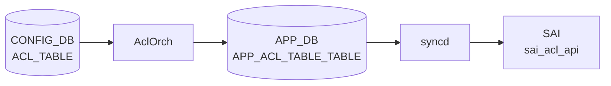

# ACL_TABLE テーブル

## 概要

[ACL](../../reference/glossary.md#term-acl) コンテナ（適用ポイント / 種別 / 段 (ingress/egress)）を定義する [CONFIG_DB](../../reference/glossary.md#term-config_db) テーブル[^1]。`orchagent` の `AclOrch` がこのテーブルを購読し、[SAI](../../reference/glossary.md#term-sai) ACL table を生成、`ACL_RULE` に登録された各エントリを SAI ACL entry として展開する。

!!! warning "YANG 未定義"
    `ACL_TABLE` テーブルは現時点で `sonic-yang-models` に該当する YANG モジュールが存在しない。スキーマの正本は `sonic-swss/orchagent/aclorch.{h,cpp}` の定数と `sonic-swss-common/common/schema.h`。

<!-- cdb-mermaid -->
### データフロー (自動生成)



!!! note "凡例"
    CONFIG_DB から SAI までの典型経路を `docs/reference/config-db-orch-map.md` から機械生成したミニ図。詳細・例外は本ページ本文と対応表を参照。
<!-- /cdb-mermaid -->

## key 構造

```
ACL_TABLE|<table_name>
```

`<table_name>` はユーザ任意の文字列。

## フィールド一覧

| フィールド | 型 | 必須 | 説明 |
|-----------|----|------|------|
| `policy_desc` | string | - | テーブルの説明文 |
| `type` | string | ✅ | テーブルタイプ。事前定義型または `ACL_TABLE_TYPE` で定義したユーザ定義型 |
| `stage` | enum `ingress`/`egress` | - | ACL 適用段（既定 `ingress`） |
| `ports` | カンマ区切り leafref `PORT.name` / `PORTCHANNEL.name` / `Vlan<id>` | - | バインドポート |
| `services` | カンマ区切り string | - | (Control plane ACL) サービス名 |

## 事前定義 type

`AclOrch` が静的に許可している type:

- `L3` / `L3V6` / `L3V4V6` ... 通常の L3 ACL
- `MIRROR` / `MIRRORV6` / `MIRROR_DSCP` ... mirror セッションへ振分け
- `PFCWD` ... [PFC](../../reference/glossary.md#term-pfc) watchdog 用
- `MCLAG` ... [MCLAG](../../reference/glossary.md#term-mclag) 制御
- `MUX` ... dual-ToR mux 用
- `DROP` ... drop 専用最適化
- `MARK_META` / `MARK_META_V6` ... メタデータマーキング
- `EGR_SET_DSCP` ... egress DSCP 上書き
- `CTRLPLANE` ... コントロールプレーン (`copp` 制御)

ユーザ定義型は `ACL_TABLE_TYPE|<name>` でフィールド `MATCHES` / `ACTIONS` / `BPOINT_TYPES` を指定する。

## 関連サブテーブル

- `ACL_TABLE_TYPE|<name>`
    - `MATCHES` (string list): 許可する match キー（`SRC_IP`, `DST_IP`, `L4_SRC_PORT` 等）
    - `ACTIONS` (string list): 許可する action（`PACKET_ACTION`, `REDIRECT_ACTION` 等）
    - `BPOINT_TYPES` (string list): バインド可能なポイント種別（`PORT`, `LAG`, `SWITCH`, `VLAN` 等）

## 購読者

- `orchagent` の `AclOrch`: SAI ACL table 生成、ポートへのバインド
- `copporch`: `CTRLPLANE` 系の登録時に連動

## 関連 CONFIG_DB / YANG / CLI

- 関連 CONFIG_DB: `ACL_RULE`、`ACL_TABLE_TYPE`、`PORT`、`PORTCHANNEL`、`MIRROR_SESSION`
- 関連 CLI: [`config acl`](../cli/config-acl.md)
- 関連 [YANG](../../reference/glossary.md#term-yang): なし（YANG 未定義）

<!-- ref-triangle:start -->

## 関連リファレンス

- CLI: [`config acl`](../cli/config-acl.md)

<!-- ref-triangle:end -->

## 引用元

[^1]: フィールド名・type 値は `sonic-swss/orchagent/aclorch.{h,cpp}` (sha `43055961`) のマクロ定義と type バリデーションロジックから抽出。<https://github.com/sonic-net/sonic-swss/blob/4305596156d70e9797e8a881b3d19b46de0bce0d/orchagent/aclorch.cpp>

## 関連ページ
- [HLD: ACL の基本設計](../../acl-qos/acl-support-in-sonic.md)
- [CLI: config acl](../cli/config-acl.md)
- [CLI: show acl](../cli/show-acl.md)
- [CONFIG_DB: ACL_RULE](acl-rule.md)

<!-- topics-back-ref -->
## 関連 Topics

- [Topics: ACL / CoPP / Mirror / Packet Action](../../topics/07-acl-copp-mirror/index.md)

<!-- /topics-back-ref -->

<!-- ops-hint -->
## 運用ヒント

### 典型値

- key 形式: `ACL_TABLE|<table-name>`。
- `type`: `L3` / `L3V6` / `MIRROR` / `MIRRORV6` / `CTRLPLANE` / `MCLAG` 等。
- `stage`: `INGRESS` / `EGRESS`。
- `ports`: `["Ethernet0", "PortChannel0001"]` のように紐付け対象を列挙。
- `policy_desc`: 運用識別用。

### よくある誤設定

- `type` と紐付けポートの能力（V4/V6/MIRROR）が不一致だと aclorch が SAI でテーブルを作らない。
- `stage: EGRESS` を ASIC が未サポートなのに指定すると syslog にエラー、何も適用されない。
- `ports` を空にすると ACL_RULE は CONFIG_DB に入っても hardware に降りない。

### 確認コマンド

```bash
sonic-db-cli CONFIG_DB hgetall 'ACL_TABLE|EVERFLOW'
show acl table
aclshow -a
```
<!-- /ops-hint -->

<!-- glossary-links-injected: c50e9accece6 -->
