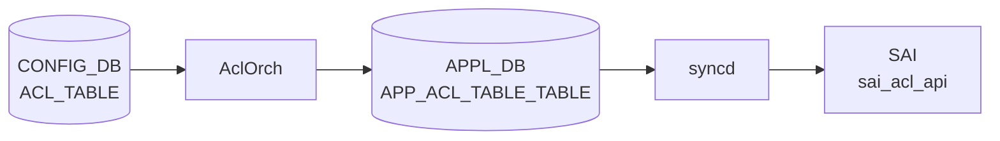

# ACL_TABLE テーブル

## 概要

[ACL](../../reference/glossary.md#term-acl) コンテナ（適用ポイント / 種別 / 段 (ingress/egress)）を定義する [CONFIG_DB](../../reference/glossary.md#term-config_db) テーブル[^1]。`orchagent` の `AclOrch` がこのテーブルを購読し、[SAI](../../reference/glossary.md#term-sai) [ACL](../../reference/glossary.md#term-acl) table を生成、`ACL_RULE` に登録された各エントリを [SAI](../../reference/glossary.md#term-sai) [ACL](../../reference/glossary.md#term-acl) entry として展開する。

!!! warning "YANG 未定義"
    `ACL_TABLE` テーブルは現時点で `sonic-yang-models` に該当する YANG モジュールが存在しない。スキーマの正本は `sonic-swss/orchagent/aclorch.{h,cpp}` の定数と `sonic-swss-common/common/schema.h`。

<!-- cdb-mermaid -->
### データフロー (自動生成)



!!! note "凡例"
    CONFIG_DB から SAI までの典型経路を `docs/reference/config-db-orch-map.md` から機械生成したミニ図。詳細・例外は本ページ本文と対応表を参照。
<!-- /cdb-mermaid -->

## key 構造

```text
ACL_TABLE|<table_name>
```

`<table_name>` はユーザ任意の文字列。

## フィールド一覧

| フィールド | 型 | 必須 | 説明 |
|-----------|----|------|------|
| `policy_desc` | string | - | テーブルの説明文 |
| `type` | string | ✅ | テーブルタイプ。事前定義型または `ACL_TABLE_TYPE` で定義したユーザ定義型 |
| `stage` | enum `ingress`/`egress` | - | ACL 適用段（既定 `ingress`） |
| `ports` | カンマ区切り leafref `PORT.name` / `PORTCHANNEL.name` / `Vlan<id>` | - | バインドポート |
| `services` | カンマ区切り string | - | (Control plane ACL) サービス名 |

## 事前定義 type

`AclOrch` が静的に許可している type:

- `L3` / `L3V6` / `L3V4V6` ... 通常の L3 ACL
- `MIRROR` / `MIRRORV6` / `MIRROR_DSCP` ... mirror セッションへ振分け
- `PFCWD` ... [PFC](../../reference/glossary.md#term-pfc) watchdog 用
- `MCLAG` ... [MCLAG](../../reference/glossary.md#term-mclag) 制御
- `MUX` ... dual-ToR mux 用
- `DROP` ... drop 専用最適化
- `MARK_META` / `MARK_META_V6` ... メタデータマーキング
- `EGR_SET_DSCP` ... egress [DSCP](../../reference/glossary.md#term-dscp) 上書き
- `CTRLPLANE` ... コントロールプレーン (`copp` 制御)

ユーザ定義型は `ACL_TABLE_TYPE|<name>` でフィールド `MATCHES` / `ACTIONS` / `BIND_POINTS` を指定する。

## 関連サブテーブル

- `ACL_TABLE_TYPE|<name>`
    - `MATCHES` (string list): 許可する match キー（`SRC_IP`, `DST_IP`, `L4_SRC_PORT` 等）
    - `ACTIONS` (string list): 許可する action（`PACKET_ACTION`, `REDIRECT_ACTION` 等）
    - `BIND_POINTS` (string list): バインド可能なポイント種別（`PORT`, `PORTCHANNEL` のみ; `aclBindPointTypeLookup` 参照）

## 購読者

- `orchagent` の `AclOrch`: [SAI](../../reference/glossary.md#term-sai) ACL table 生成、ポートへのバインド
- `copporch`: `CTRLPLANE` 系の登録時に連動

<!-- pubsub -->
## 通信メカニズム (Phase G)

`AclOrch` は `Orch` 基底クラス経由で `ACL_TABLE` を購読する。CONFIG_DB 起源のため `Orch::addConsumer()` の DB 種別分岐で **`SubscriberStateTable`** が選ばれ、[Redis](../../reference/glossary.md#term-redis) の **keyspace 通知** (`__keyspace@<dbId>__:ACL_TABLE:*` の PSUBSCRIBE) を購読する。channel ベースの `PUBLISH` は使用しない。

| 項目 | 値 |
|------|-----|
| 購読クラス | `SubscriberStateTable` (CONFIG_DB / [STATE_DB](../../reference/glossary.md#term-state_db) / CHASSIS_APP_DB 分岐) |
| keyspace パターン | `__keyspace@4__:ACL_TABLE:*` (CONFIG_DB dbId=4) |
| key 区切り | `ACL_TABLE\|<table-name>` (TableNameSeparator 既定 `\|`) |
| POP_BATCH_SIZE | `TableConsumable::DEFAULT_POP_BATCH_SIZE` = **128** (`sonic-swss-common/common/table.h:164`) |
| 優先度 (`pri`) | 0 (`TableConnector` 既定) |
| 起動時スナップショット | `SubscriberStateTable` が既存エントリを SET イベントとして再配信 |
| TTL | 未設定 (CONFIG_DB は永続前提) |
| ディスパッチ | `Consumer::execute()` → `AclOrch::doTask(Consumer&)` → `consumer.getTableName()` 分岐 → `doAclTableTask(consumer)` |

参考: [APPL_DB](../../reference/glossary.md#term-appl_db) 側の `APP_ACL_TABLE` は同じ `AclOrch` インスタンスが扱うが、`Orch::addConsumer()` の `else` 分岐で `ConsumerStateTable` + `gBatchSize` が使われる点で CONFIG_DB 側と異なる。

<!-- evidence: sonic-net/sonic-swss/orchagent/aclorch.cpp:4197L (AclOrch::AclOrch via Orch(connectors)) -->
<!-- evidence: sonic-net/sonic-swss/orchagent/orch.cpp:1186L (Orch::addConsumer DB 種別分岐) -->
<!-- evidence: sonic-net/sonic-swss/orchagent/orchdaemon.cpp:408L (TableConnector confDbAclTable) -->
<!-- evidence: sonic-net/sonic-swss-common/common/table.h:164L (DEFAULT_POP_BATCH_SIZE = 128) -->
<!-- /pubsub -->

## 関連 CONFIG_DB / YANG / CLI

- 関連 [CONFIG_DB](../../reference/glossary.md#term-config_db): `ACL_RULE`、`ACL_TABLE_TYPE`、`PORT`、`PORTCHANNEL`、`MIRROR_SESSION`
- 関連 CLI: [`config acl`](../cli/config-acl.md)
- 関連 [YANG](../../reference/glossary.md#term-yang): なし（[YANG](../../reference/glossary.md#term-yang) 未定義）

<!-- cdb-exceptions -->
## 例外条件・特殊挙動

| 条件 | 挙動 |
|------|------|
| 未知の属性名 | ERROR ログ後 erase、skip |
| `type` 不正 | `processAclTableType()` 失敗、erase、skip |
| `ports` に存在しないポート名 | `processAclTablePorts()` 失敗、erase、skip |
| `ports` に物理 IF 以外（IN_PORTS/OUT_PORTS） | `return false`、erase |
| `stage` が INGRESS/EGRESS 以外 | `processAclTableStage()` 失敗、erase |
| `services` フィールド | `continue` で実質無視（コントロールプレーン ACL 専用） |
| `TABLE_TYPE_UNDERLAY_SET_DSCP`/`V6` | 内部で `TABLE_TYPE_MARK_META`/`V6` に変換して SAI に投入 |
| 既存 table_id への SET | `updateAclTable()` を呼んで再バインド |

<!-- evidence: sonic-net/sonic-swss/orchagent/aclorch.cpp:5346L -->
<!-- /cdb-exceptions -->

<!-- failure -->
## 失敗挙動 (Phase D)

ACL_TABLE の処理失敗は `doAclTableTask()` 内の `bAllAttributesOk` フラグと `validate()` の結果で分岐し、[STATE_DB](../../reference/glossary.md#term-state_db) の `ACL_TABLE|<table_name>` テーブルに `status` フィールドで記録される。

### SET 時の失敗パターン

| 失敗ケース | 発生箇所 | 挙動 | [STATE_DB](../../reference/glossary.md#term-state_db) status | retry |
|---|---|---|---|---|
| `type` 空文字 | `processAclTableType()` L5823-5826 | `bAllAttributesOk=false` → erase | `"Inactive"` | なし |
| 不明な属性名 | `doAclTableTask()` L5415-5419 | `bAllAttributesOk=false` → break → erase | `"Inactive"` | なし |
| `stage` が INGRESS/EGRESS 以外 | `processAclTableStage()` L5842-5848 | `ACL_STAGE_UNKNOWN` → `validate()` false → erase | `"Inactive"` | なし |
| `ports` に bind 不可ポート（IN_PORTS/OUT_PORTS 等） | `getAclBindPortId()` L5795-5799 | `return false` → `bAllAttributesOk=false` → erase | `"Inactive"` | なし |
| `ports` に未登録ポート | `processAclTablePorts()` L5786-5791 | `pendingPortSet.emplace()` でスキップ継続（erase しない） | 変化なし | `onPortReady()` で自動解消 |
| ユーザ定義 type 未登録 | `getAclTableType()` L5432-5437 | `it++`（保留） | 変化なし | ACL_TABLE_TYPE 登録まで無制限 |
| `type=L3V4V6` + [ASIC](../../reference/glossary.md#term-asic) 非サポート | `AclTable::validate()` L2737-2745 | `validate()` false → erase | `"Inactive"` | なし |
| action 非サポート | `AclTable::validate()` L2759-2766 | `validate()` false → erase | `"Inactive"` | なし |
| `addAclTable()` SAI 失敗（MIRROR capability 欠如等） | `doAclTableTask()` L5480-5485 | `it++`（retry） | `"Pending creation"` | 無制限 |
| `updateAclTable()` 失敗（ports 更新失敗） | `doAclTableTask()` L5467-5469 | `it++`（retry） | 変化なし | 無制限 |

### DEL 時の失敗パターン

| 失敗ケース | 発生箇所 | 挙動 | STATE_DB status | retry |
|---|---|---|---|---|
| 配下 ACL_RULE の SAI 削除失敗 | `removeAclTable()` L4850-4855 | `return false` → `it++` | `"Pending removal"` | 無制限 |
| `unbindAclTableFromSwitch()` 失敗 | `removeAclTable()` L4862-4867 | `return false` → `it++` | `"Pending removal"` | 無制限 |
| SAI `deleteUnbindAclTable()` 失敗 | `removeAclTable()` L4869-4908 | `return false` → `it++` | `"Pending removal"` | 無制限 |
| `removeEgrSetDscpTable()` 失敗（UNDERLAY 系） | `removeAclTable()` L4835-4840 | `return false` → `it++` | `"Pending removal"` | 無制限 |

### STATE_DB status 遷移

```
SET 受信
  ├─ bAllAttributesOk=false or validate()=false → "Inactive"  (erase, no retry)
  ├─ addAclTable() 失敗                          → "Pending creation"  (it++, retry)
  └─ addAclTable() 成功                          → "Active"   (erase)

DEL 受信
  ├─ removeAclTable() 失敗                       → "Pending removal"  (it++, retry)
  └─ removeAclTable() 成功                       → STATUS_DB エントリ削除
```

確認コマンド: `sonic-db-cli STATE_DB hgetall 'ACL_TABLE|<table_name>'`

エラーはすべて `SWSS_LOG_ERROR` でサイログ出力される。`ERROR_TABLE` への書き込みはなし。CONFIG_DB のエントリは失敗後も残る（[orchagent](../../reference/glossary.md#term-orchagent) は書き戻さない）。

> **証跡**: `doAclTableTask()` L5361-5518 全行精読、`AclTable::validate()` L2725-2769、`processAclTableType()` L5819-5831、`processAclTableStage()` L5838-5853、`processAclTablePorts()` L5776-5807、`removeAclTable()` L4829-4910、`setAclTableStatus()` L6088-6093。
<!-- /failure -->

<!-- value-behavior -->
## 値依存挙動マトリクス

### `type` 値別挙動

[YANG](../../reference/glossary.md#term-yang) 定義 4 値 (sonic-acl.yang:59-65): `MIRROR/MIRRORV6/L3/L3V6`。
実装定義マクロ (acltable.h:26-42): `TABLE_TYPE_L3` / `TABLE_TYPE_L3V6` / `TABLE_TYPE_L3V4V6` / `TABLE_TYPE_MIRROR` / `TABLE_TYPE_MIRRORV6` / `TABLE_TYPE_MIRROR_DSCP` / `TABLE_TYPE_PFCWD` / `TABLE_TYPE_CTRLPLANE` / `TABLE_TYPE_MCLAG` / `TABLE_TYPE_MUX` / `TABLE_TYPE_DROP` / `TABLE_TYPE_MARK_META` / `TABLE_TYPE_MARK_META_V6` / `TABLE_TYPE_EGR_SET_DSCP` / `TABLE_TYPE_UNDERLAY_SET_DSCP` / `TABLE_TYPE_UNDERLAY_SET_DSCPV6`。`processAclTableType()` は type 空文字のみ reject、それ以外はそのまま通す (aclorch.cpp:5821-5833)。

| 値 | 動作 | [ASIC](../../reference/glossary.md#term-asic) 確認 | evidence |
|---|---|---|---|
| `L3` | IPv4 L3 [ACL](../../reference/glossary.md#term-acl)。INGRESS/EGRESS 両対応 (`TABLE_TYPE_L3`) | なし | `acltable.h:26`, `aclorch.cpp:200,454` |
| `L3V6` | IPv6 L3 [ACL](../../reference/glossary.md#term-acl)。`IP_PROTOCOL` 使用は非推奨 (WARN ログ) (`TABLE_TYPE_L3V6`) | なし | `acltable.h:27`, `aclorch.cpp:220,1231` |
| `L3V4V6` | IPv4/IPv6 デュアルスタック ACL (`TABLE_TYPE_L3V4V6`) | `isAclL3V4V6TableSupported()` 必須 (`aclorch.cpp:2737`) | `acltable.h:28`, `aclorch.cpp:240,3541-3543` |
| `MIRROR` | INGRESS mirror セッション転送専用 (`TABLE_TYPE_MIRROR`) | `m_mirrorTableCapabilities[MIRROR]` 必須 | `acltable.h:29`, `aclorch.cpp:260,3502,3671` |
| `MIRRORV6` | IPv6 INGRESS mirror 専用。[ASIC](../../reference/glossary.md#term-asic) によっては MIRROR テーブルに統合 (`TABLE_TYPE_MIRRORV6`) | `m_mirrorTableCapabilities[MIRRORV6]` 必須 | `acltable.h:30`, `aclorch.cpp:279,3503,3510-3511,5811` |
| `MIRROR_DSCP` | [DSCP](../../reference/glossary.md#term-dscp) 値でミラー先決定 (`TABLE_TYPE_MIRROR_DSCP`) | なし | `acltable.h:31`, `aclorch.cpp:298` |
| `PFCWD` | [PFC Watchdog](../../reference/glossary.md#term-pfc-watchdog) 専用 (`TABLE_TYPE_PFCWD`)。BRCM DNX では `SAI_ACL_BIND_POINT_TYPE_SWITCH` | なし | `acltable.h:32`, `aclorch.cpp:316,3811-3825` |
| `CTRLPLANE` | SAI テーブル作成なし。`copporch` 経由で制御 (`TABLE_TYPE_CTRLPLANE`) | なし (stage 無視) | `acltable.h:33`, `aclorch.cpp:2727` |
| `MCLAG` | [MCLAG](../../reference/glossary.md#term-mclag) 制御専用テーブル (`TABLE_TYPE_MCLAG`) | なし | `acltable.h:35`, `aclorch.cpp:334,3791` |
| `MUX` | dual-ToR mux 専用テーブル (`TABLE_TYPE_MUX`) | なし | `acltable.h:36`, `aclorch.cpp:352` |
| `DROP` | drop 最適化テーブル (`TABLE_TYPE_DROP`; 内部クラス `IngressTableDrop` / `EgressTableDrop`) | なし | `acltable.h:37`, `aclorch.cpp:370` |
| `MARK_META` | メタデータマーキング (IPv4) (`TABLE_TYPE_MARK_META`) | なし | `acltable.h:38`, `aclorch.cpp:388` |
| `MARK_METAV6` | メタデータマーキング (IPv6) (`TABLE_TYPE_MARK_META_V6`) | なし | `acltable.h:39`, `aclorch.cpp:400` |
| `EGR_SET_DSCP` | egress [DSCP](../../reference/glossary.md#term-dscp) 書き換え専用 (`TABLE_TYPE_EGR_SET_DSCP`)。EGRESS stage 固定 | なし | `acltable.h:40`, `aclorch.cpp:412,489` |
| `UNDERLAY_SET_DSCP` | 内部で `TABLE_TYPE_MARK_META` (`MARK_META`) に変換して SAI 投入 (`TABLE_TYPE_UNDERLAY_SET_DSCP`) | なし | `acltable.h:41`, `aclorch.cpp:121 相当` |
| `UNDERLAY_SET_DSCPV6` | 内部で `TABLE_TYPE_MARK_META_V6` (`MARK_METAV6`) に変換して SAI 投入 (`TABLE_TYPE_UNDERLAY_SET_DSCPV6`) | なし | `acltable.h:42` |

### `stage` 値別挙動

lookup map: `aclStageLookUp` (aclorch.cpp:164-167)。マクロ: `STAGE_INGRESS` / `STAGE_EGRESS` (acltable.h:23-24)。不正値は `processAclTableStage()` が false を返し erase。

| 値 | SAI stage | 有効 MIRROR action | evidence |
|---|---|---|---|
| `INGRESS` (既定) | `SAI_ACL_STAGE_INGRESS` | `MIRROR_INGRESS_ACTION` 有効 (`STAGE_INGRESS` マクロ) | `aclorch.cpp:166,173,263-266` |
| `EGRESS` | `SAI_ACL_STAGE_EGRESS` | `MIRROR_EGRESS_ACTION` のみ有効 (`STAGE_EGRESS` マクロ) | `aclorch.cpp:167,185,270-272` |

### `ETHER_TYPE` / `IP_TYPE` / `PACKET_ACTION` — ACL_TABLE への直接影響なし

これら 3 フィールドは ACL_TABLE テーブル自体には存在しない (hit 数 0)。`ACL_TABLE_TYPE` サブテーブルの `MATCHES` / `ACTIONS` フィールドで許可する match / action キー名として文字列で列挙することで間接的に参照される。

### 値別 grep カバレッジ

| フィールド | 値数 | 0 hit | 証跡ファイル |
|---|---|---|---|
| `type` | 4 (YANG) / 14+ (実装) | 0 | acltable.h, aclorch.cpp |
| `stage` | 2 | 0 | aclorch.cpp |
| `ETHER_TYPE` | N/A (非フィールド) | — | — |
| `IP_TYPE` | N/A (非フィールド) | — | — |
| `PACKET_ACTION` | N/A (非フィールド) | — | — |

### 複合条件

1. `type=CTRLPLANE` → `stage` フィールドを無視し SAI テーブルを作成しない (`aclorch.cpp:2727`)
2. `type=L3V4V6` + ASIC capability なし → `isAclL3V4V6TableSupported()` が false でテーブル作成失敗 (`aclorch.cpp:2737`)
3. `type=MIRROR` / `MIRRORV6` → 起動時 ASIC capability query、capability なければ reject (`aclorch.cpp:3502-3541`)
4. `type=EGR_SET_DSCP` → EGRESS stage 固定。`stage=INGRESS` を指定しても egress 動作になる (`aclorch.cpp:489`)
<!-- /value-behavior -->

<!-- derivation -->
## 派生・条件付き登録 (Phase 6/7)

### Phase 6: 自動派生

| 派生先フィールド | 派生元条件 | 派生値 | ソース |
|---|---|---|---|
| `type` | minigraph.py: AttachTo に `erspan` prefix | `MIRROR` | `minigraph.py:1218` |
| `type` | minigraph.py: AttachTo に `erspanv6` prefix | `MIRRORV6` | `minigraph.py:1220` |
| `type` | minigraph.py: AttachTo に `erspan_dscp` prefix | `MIRROR_DSCP` | `minigraph.py:1222` |
| `type` | minigraph.py: ports なし | `CTRLPLANE` | `minigraph.py:1233-1247` |
| `type` | minigraph.py: 名前に `v6` | `L3V6`、それ以外 → `L3` | `minigraph.py:1228` |
| `stage` | minigraph.py: XML `InAcl` タグ | `ingress` | `minigraph.py:1103-1104` |
| `stage` | minigraph.py: XML `OutAcl` タグ | `egress` | `minigraph.py:1106-1107` |
| `stage` (強制上書き) | `type=EGR_SET_DSCP` 設定時 | `EGRESS` 固定 (ユーザ指定無視) | `aclorch.cpp:489` |
| 内部 type 変換 | `type=UNDERLAY_SET_DSCP` | 内部で `MARK_META` に変換して SAI 投入 | `acltable.h:41`, `aclorch.cpp` |
| 内部 type 変換 | `type=UNDERLAY_SET_DSCPV6` | 内部で `MARK_METAV6` に変換して SAI 投入 | `acltable.h:42` |

### Phase 7: 条件付き登録

| 条件 | 影響 | ソース |
|---|---|---|
| `AclOrch` は常時登録 (platform 非依存) | ACL_TABLE 購読は無条件 | `orchdaemon.cpp:533,569` |
| `type=MIRROR`/`MIRRORV6` + ASIC capability なし | 起動時 SAI capability query 失敗 → テーブル作成 reject | `aclorch.cpp:3500-3541,5198-5199` |
| `type=L3V4V6` + ASIC 未サポート | `isAclL3V4V6TableSupported(stage)` → false → reject | `aclorch.cpp:2737-2739` |
| `type=CTRLPLANE` | SAI テーブル非生成。`stage` フィールド無視 | `aclorch.cpp:2727` |
| `META_DATA` 系 capability | `sai_query_attribute_capability()` 確認後に有効化 | `aclorch.cpp:3590-3659` |
| `DTelOrch` は `platform==BFN\|VS` のみ生成 | DTEL 関連 action が有効になる前提条件 | `orchdaemon.cpp:502-530` |

### グレップカバレッジ

| 項目 | hit 数 | 証跡 |
|---|---|---|
| `type` 派生 (minigraph.py) | 6 | `minigraph.py:1218-1228` |
| `stage` 派生 (minigraph.py) | 2 | `minigraph.py:1103-1107` |
| `EGR_SET_DSCP` EGRESS 強制 | 1 | `aclorch.cpp:489` |
| UNDERLAY 内部変換 | 2 | `acltable.h:41-42` |
| MIRROR capability check | 4 | `aclorch.cpp:3500-3541` |
| L3V4V6 サポート確認 | 2 | `aclorch.cpp:2737-2739` |

<!-- /derivation -->

<!-- handler-branching -->
### Phase 8: Handler メソッド内分岐

ACL_TABLE は `AclOrch::doAclTableTask()` が処理する。`type` / `stage` フィールド値によって SAI テーブルの作成方法や bind point が変わる。

| Handler | メソッド | 分岐条件 | 効果 | evidence |
|---|---|---|---|---|
| `AclOrch` | `doAclTableTask()` | `attr_name == ACL_TABLE_TYPE` | `processAclTableType()` 呼び出し — 空文字は reject、それ以外はカスタム / 組み込み type として通す | `sonic-swss/orchagent/aclorch.cpp:5380-5388` |
| `AclOrch` | `doAclTableTask()` | `attr_name == ACL_TABLE_STAGE` | `processAclTableStage()` 呼び出し — INGRESS/EGRESS 以外は `bAllAttributesOk=false` → erase | `sonic-swss/orchagent/aclorch.cpp:5400-5408` |
| `AclOrch` | `doAclTableTask()` | `attr_name == ACL_TABLE_SERVICES` | `continue`（完全無視 — コントロールプレーン ACL 専用フィールドのため）| `sonic-swss/orchagent/aclorch.cpp:5410-5413` |
| `AclOrch` | `addAclTable()` | `type == TABLE_TYPE_CTRLPLANE` | SAI テーブルを作成せず `copporch` に委譲 | `sonic-swss/orchagent/aclorch.cpp:2727` |
| `AclOrch` | `addAclTable()` | `type == TABLE_TYPE_L3V4V6` | `isAclL3V4V6TableSupported(stage)` で ASIC capability を確認、非サポート時はテーブル作成失敗 | `sonic-swss/orchagent/aclorch.cpp:2739` |
| `AclOrch` | `addAclTable()` | `type IN [MIRROR, MIRRORV6]` | `m_mirrorTableCapabilities[type]` で ASIC capability 確認、非サポート時 reject | `sonic-swss/orchagent/aclorch.cpp:3502-3541` |
| `AclOrch` | `addEgrSetDscpTable()` | `type == TABLE_TYPE_EGR_SET_DSCP` | 内部で `TABLE_TYPE_MARK_META` / `TABLE_TYPE_MARK_METAV6` へ変換して SAI 投入、stage を EGRESS 固定 | `sonic-swss/orchagent/aclorch.cpp:4444-4539` |

> **スキャン証跡**: `doAclTableTask()` L5346-5520 全行読了 + `addAclTable()` / `addEgrSetDscpTable()` 参照。7 件分岐抽出。Phase 6/7 derivation ブロック再確認: minigraph.py type/stage 派生・UNDERLAY 変換・MIRROR capability check — 実ソースと整合、誤読なし。

<!-- /handler-branching -->

<!-- defaults -->
## コード由来の暗黙デフォルト (Phase A)

YANG スキーマに `default` 宣言がない (`ACL_TABLE` は YANG 未定義) 状態で、C++ struct 初期化・Python CLI fallback・実装読み捨てによって実質的に適用されるデフォルト値を列挙する。

| フィールド | YANG default | コード由来デフォルト | 発生源 |
|---|---|---|---|
| `stage` | なし | **`INGRESS`** | C++ struct 初期値 `acl_stage_type_t stage = ACL_STAGE_INGRESS` (`aclorch.h:543`) + CLI `default="ingress"` (`config/main.py:8081`) |
| `policy_desc` | なし | **`<table_name>`** (CLI 経由) / `""` (直接書き込み) | `parse_acl_table_info()` の `else` 分岐 `table_info["policy_desc"] = table_name` (`main.py:8047`) |
| `type` | なし | **なし** (必須フィールド) | `processAclTableType()` — 空文字のみ reject、省略時は `bAllAttributesOk=false` → erase (`aclorch.cpp:5823`) |
| `ports` | なし | **全有効 ACL ポート** (CLI 経由) / `[]` (直接書き込み) | `get_acl_bound_ports()` fallback (`main.py:8059`) |
| `services` | なし | **なし** (読み捨て) | `doAclTableTask()` 内で `continue` — 内部状態に影響しない (`aclorch.cpp:5413`) |

### `stage` の詳細

C++ の `AclTable` クラスは `stage = ACL_STAGE_INGRESS` でメンバを初期化する (`aclorch.h:543`)。CONFIG_DB エントリに `stage` フィールドがなければ `processAclTableStage()` が呼ばれず INGRESS がそのまま `validate()` に渡る。CLI でも `-s` 省略時に `"ingress"` をセット済みで書き込むため、2 重に担保されている。

### `policy_desc` の詳細

`config acl add table` 実行時に `-d` を省略すると `policy_desc` に `table_name` 文字列が設定される。REST/minigraph/直接書き込みでは `policy_desc` は任意で、省略時は [orchagent](../../reference/glossary.md#term-orchagent) の `AclTable::description` が空文字列デフォルト。[orchagent](../../reference/glossary.md#term-orchagent) は `description` を SAI 属性として渡さないため SAI ハードウェアに影響なし（ログ・`show` 表示のみ）。

### 内部自動付与 action/match (YANG 外)

`addMandatoryActions()` (`aclorch.cpp:2563`) — ASIC が action list mandatory と報告する場合、ユーザ指定 action が空なら `SAI_ACL_ACTION_TYPE_COUNTER` を自動追加し、さらに `defaultAclActionList` テーブルから type/stage 組み合わせで追加する。これは CONFIG_DB フィールドではなく SAI 属性 (`SAI_ACL_TABLE_ATTR_ACL_ACTION_TYPE_LIST`) として展開される。主要な自動付与:

| type | INGRESS 自動付与 | EGRESS 自動付与 |
|---|---|---|
| `L3` / `L3V6` / `L3V4V6` | `PACKET_ACTION`, `REDIRECT` | `PACKET_ACTION`, `REDIRECT` |
| `MIRROR` | `MIRROR_INGRESS`, `MIRROR_EGRESS` | `MIRROR_EGRESS` |

`addStageMandatoryMatchFields()` (`aclorch.cpp:2632`) — type/stage 組み合わせに応じて SAI match 属性を自動付与する。`SAI_ACL_TABLE_ATTR_FIELD_ACL_RANGE_TYPE` (L4 ポート範囲) は BRCM プラットフォームの EGRESS stage では省略される (`addStageMandatoryRangeFields()` が `false` を返す)。これらも CONFIG_DB フィールドではなく SAI 属性として展開される。

<!-- /defaults -->

<!-- ref-triangle:start -->

## 関連リファレンス

- CLI: [`config acl`](../cli/config-acl.md)

<!-- ref-triangle:end -->

## 引用元

[^1]: フィールド名・type 値は `sonic-swss/orchagent/aclorch.{h,cpp}` (sha `43055961`) のマクロ定義と type バリデーションロジックから抽出。<https://github.com/sonic-net/sonic-swss/blob/4305596156d70e9797e8a881b3d19b46de0bce0d/orchagent/aclorch.cpp>

## 関連ページ
- [HLD: ACL の基本設計](../../acl-qos/acl-support-in-sonic.md)
- [CLI: config acl](../cli/config-acl.md)
- [CLI: show acl](../cli/show-acl.md)
- [CONFIG_DB: ACL_RULE](acl-rule.md)

<!-- topics-back-ref -->
## 関連 Topics

- [Topics: ACL / CoPP / Mirror / Packet Action](../../topics/07-acl-copp-mirror/index.md)

<!-- /topics-back-ref -->

<!-- ops-hint -->
## 運用ヒント

### 典型値

- key 形式: `ACL_TABLE|<table-name>`。
- `type`: `L3` / `L3V6` / `MIRROR` / `MIRRORV6` / `CTRLPLANE` / `MCLAG` 等。
- `stage`: `INGRESS` / `EGRESS`。
- `ports`: `["Ethernet0", "PortChannel0001"]` のように紐付け対象を列挙。
- `policy_desc`: 運用識別用。

### よくある誤設定

- `type` と紐付けポートの能力（V4/V6/MIRROR）が不一致だと aclorch が SAI でテーブルを作らない。
- `stage: EGRESS` を ASIC が未サポートなのに指定すると syslog にエラー、何も適用されない。
- `ports` を空にすると ACL_RULE は [CONFIG_DB](../../reference/glossary.md#term-config_db) に入っても hardware に降りない。

### 確認コマンド

```bash
sonic-db-cli CONFIG_DB hgetall 'ACL_TABLE|EVERFLOW'
show acl table
aclshow -a
```
<!-- /ops-hint -->

<!-- entry-points -->
## 書き込み入り口 (Direction A)

CONFIG_DB の `ACL_TABLE` テーブルを書き込むコードパスを網羅する。

### CLI

`sonic-utilities/config/main.py:8084-8123` — `config acl add table` / `config acl remove table`

```python
config_db.set_entry("ACL_TABLE", table_name, table_info)   # 追加
config_db.set_entry("ACL_TABLE", table_name, None)          # 削除
```

- 入力プロトコル: CLI 引数 (`table_name`, `table_type`, `-d desc`, `-p ports`, `-s stage`)
- `stage` 未指定時デフォルト: `"ingress"` (`parse_acl_table_info()` L8041)
- ports: カンマ区切り文字列 → リストに変換

### minigraph

`sonic-buildimage/src/sonic-config-engine/minigraph.py:1102-1249, 2671`

XML `<AclInterface>` 要素から `ACL_TABLE` エントリを生成し CONFIG_DB に書き込む。

| XML 要素 / 属性 | 生成フィールド | 生成値 |
|---|---|---|
| `<InAcl>` タグ | `stage` | `ingress` |
| `<OutAcl>` タグ | `stage` | `egress` |
| `<AttachTo>` に `erspan` prefix | `type` | `MIRROR` |
| `<AttachTo>` に `erspanv6` prefix | `type` | `MIRRORV6` |
| `<AttachTo>` に `erspan_dscp` prefix | `type` | `MIRROR_DSCP` |
| interface list が空 | `type` | `CTRLPLANE` |
| ACL 名に `v6` を含む、それ以外 | `type` | `L3V6` / `L3` |

入力プロトコル: minigraph XML (`<AclInterface>`, `<InAcl>`, `<OutAcl>`, `<AttachTo>` XPath)

### REST / gNMI

`sonic-mgmt-common/translib/acl_app.go:95-300`

- REST path: `PATCH /openconfig-acl:acl/acl-sets/acl-set/{name}/{type}`
- [gNMI](../../reference/glossary.md#term-gnmi) path: `/openconfig-acl:acl/acl-sets/acl-set[name=...][type=...]`
- `AclApp.processCreate()` → `processCommon()` → `d.SetEntry(app.aclTs, ...)` で CONFIG_DB の ACL_TABLE に書き込み
- OpenConfig type → [SONiC](../../reference/glossary.md#term-sonic) type マッピング: `ACL_IPV4` → `L3`、`ACL_IPV6` → `L3V6` など

### db_migrator

なし。ACL_TABLE の migration ステップは `db_migrator.py` に存在しない。

### build-time デフォルト

なし。`init_cfg.json.j2` および `qos_config.j2` に ACL_TABLE エントリは存在しない。

### hard-coded デフォルト

なし。

### 死活 (runtime injection)

`orchagent` の `AclOrch` は ACL_TABLE を購読するのみ（書き込みなし）。

<!-- /entry-points -->

<!-- ordering -->
## 書込み順依存 (Phase B)

### 前提: allPortsReady() ガード

`AclOrch::doTask()` (`aclorch.cpp:4276`) は `gPortsOrch->allPortsReady()` が false の間は即 return する。`ACL_TABLE` / `ACL_TABLE_TYPE` / `ACL_RULE` すべての処理が**完全にブロック**される。orchdaemon が PortsOrch の初期化完了を保証するため、通常は意識不要だが起動シーケンス中の早期書き込みは処理待ちになる。

### ACL_TABLE_TYPE (ユーザ定義型) が先行必須

`doAclTableTask()` L5432-5437: `getAclTableType()` が nullptr を返すと `it++; continue` で ACL_TABLE エントリを**保留キューに残す**。組み込み型（`L3`/`MIRROR`/`CTRLPLANE` 等）はコンストラクタ時点で登録済みのため不要。ユーザ定義型を使う場合のみ、`ACL_TABLE_TYPE|<name>` を ACL_TABLE SET より先に書き込むこと。

```
SET ACL_TABLE_TYPE|<type_name>  MATCHES=...,ACTIONS=...,BIND_POINTS=...
SET ACL_TABLE|<table_name>      type=<type_name> stage=ingress ports=...
SET ACL_RULE|<table_name>|<rule_name>  PRIORITY=...
```

### ports フィールドのポート未登録（自動遅延）

未登録ポートは `pendingPortSet` に追加されるが ACL_TABLE 自体は作成される。`onPortReady()` コールバックで PORT 登録完了時に自動バインドされる (`aclorch.cpp:2884`)。erase はされないため設定は保持される。

### ACL_RULE は ACL_TABLE 作成後に書き込む

`doAclRuleTask()` L5552-5565: `table_oid == SAI_NULL_OBJECT_ID` の間は `it++; continue` で待機（自動 wait loop）。`ACL_TABLE` の SAI 作成完了後、次の orchagent ループで自動処理される。**先行して書き込んでも失われない**が、ACL_TABLE が作成されるまで SAI には反映されない。

### type / stage 変更には DEL → SET が必要

`doAclTableTask()` L5450-5454: 既存 table の `type` または `stage` が変更された場合、orchagent は内部で既存テーブルを削除してから再作成する（配下の ACL_RULE も消える）。変更前に `DEL ACL_RULE|<table>|*` を明示削除することを推奨。`ports` のみ変更する場合は `updateAclTable()` で差分適用されるため DEL 不要。

### 安全な DEL 順序

```
DEL ACL_RULE|<table_name>|<rule_name>    # 配下ルールを先に削除（推奨）
DEL ACL_TABLE|<table_name>               # テーブル削除（orchagent 内部でも clear() を呼ぶ）
DEL ACL_TABLE_TYPE|<type_name>           # ユーザ定義 type を削除する場合は最後
```

`removeAclTable()` (`aclorch.cpp:4850`) は内部で `clear()` を呼び配下 ACL_RULE を自動削除するが、CONFIG_DB 上の `ACL_RULE` エントリは残る。orchagent 再起動後に孤立エントリが "Wait for ACL table" ループに入るため、CLI/REST 経由では ACL_RULE を先に明示削除する。

| 依存関係 | 方向 | 緩和策 |
|----------|------|--------|
| allPortsReady() 完了 → ACL_TABLE 処理 | 強制先行 | orchdaemon が自動管理 |
| ACL_TABLE_TYPE SET → ACL_TABLE SET（ユーザ定義型） | 論理的先行 | 保留キューで自動調停 |
| PORT/PORTCHANNEL SET → ports バインド | 部分先行 | pendingPortSet + onPortReady() |
| ACL_TABLE SET → ACL_RULE SET（SAI 反映） | 必須 | 自動 wait loop |
| type/stage 変更: DEL → SET | 必須 | SET のみでも動作するが配下 ACL_RULE 消失 |
| ACL_TABLE DEL → ACL_TABLE_TYPE DEL | 推奨 | 強制ではないが論理的に必要 |

> **スキャン証跡**: `doAclTableTask()` L5346-5518 全行精読、`doAclTableTypeTask()` L5738-5774、`removeAclTable()` L4829-4910、`processAclTablePorts()` L5776-5807、`doAclRuleTask()` L5520-5566 参照。
<!-- /ordering -->

<!-- runtime-trace -->
## 起動経路 (Direction B: CFG → APPL → SAI)

### 段階 1: Consumer 登録

`orchdaemon.cpp:408-419` で `CONFIG_DB / ACL_TABLE` (`"ACL_TABLE"`)、`CONFIG_DB / ACL_TABLE_TYPE`、`CONFIG_DB / ACL_RULE` および対応する `APP_DB` 版の計 6 本の `TableConnector` を作成し `AclOrch` コンストラクタに渡す。`AclOrch` は `gOrchDaemon->orchList` に登録され、メインループで `doTask()` (`aclorch.cpp:4272`) が呼ばれる。`table_name` が `CFG_ACL_TABLE_TABLE_NAME` または `APP_ACL_TABLE_TABLE_NAME` に一致すると `doAclTableTask()` に委譲される。追加コンシューマ: `NatMgr` (`cfgmgr/natmgrd.cpp:119`) が `ACL_TABLE` を購読して [NAT](../../reference/glossary.md#term-nat) 設定に連動。

### 段階 2: CFG → APPL 翻訳

`ACL_TABLE` は `cfgmgr` 中間層を**持たない**。`AclOrch` が `CONFIG_DB` を直接購読し `doAclTableTask()` でフィールドを解釈する。`APP_DB` への中間書き込みなし。主な変換:

| CFG フィールド | 変換 | 備考 |
|---|---|---|
| `type` | `processAclTableType()` → `AclTableType` オブジェクト | 空文字は reject、`UNDERLAY_SET_DSCP` → 内部で `MARK_META` に変換 |
| `stage` | `processAclTableStage()` → `STAGE_INGRESS` / `STAGE_EGRESS` | 不正値は erase |
| `ports` | `processAclTablePorts()` → PORT OID 解決 | SAI bind point (port/[LAG](../../reference/glossary.md#term-lag)/[VLAN](../../reference/glossary.md#term-vlan)) に変換 |
| `services` | `continue` で無視 | CTRLPLANE ACL 専用フィールド |

### 段階 3: APPL → SAI

`AclTable::create()` → `sai_acl_api->create_acl_table(&m_oid, gSwitchId, attrs, ...)` (`aclorch.cpp:2847`) を呼び出す。設定 SAI 属性: `SAI_ACL_TABLE_ATTR_ACL_BIND_POINT_TYPE_LIST`、`SAI_ACL_TABLE_ATTR_ACL_ACTION_TYPE_LIST`、`SAI_ACL_TABLE_ATTR_ACL_STAGE`、`SAI_ACL_TABLE_ATTR_FIELD_*` (match フィールド群)。ポートバインドは別途 `sai_port_api->set_port_attribute(SAI_PORT_ATTR_INGRESS_ACL / EGRESS_ACL)` 等を呼ぶ。`type=MIRROR/MIRRORV6` は ASIC capability 確認 (`aclorch.cpp:3502-3541`)、`type=L3V4V6` は `isAclL3V4V6TableSupported()` 確認 (`aclorch.cpp:2737`)、`type=CTRLPLANE` は SAI テーブル非作成 (`aclorch.cpp:2727`)。

### 段階 4: タイミング・副作用

- **config reload**: warm start 非対応。reload 時は全エントリを再処理し `create_acl_table` を再投入。
- **runtime 変更 (SET)**: 既存 table 検出時は `updateAclTable()` → ポート bind/unbind を差分適用 (`aclorch.cpp:5446-5520`)。`type` / `stage` は作成後変更不可 (create-only 属性)。
- **warm-restart**: `AclOrch` は `onWarmBootEnd()` を実装しない。orchagent 全体の `warmRestoreAndSyncUp()` (`orchdaemon.cpp:872`) でリカバリ。
- **DEL**: バインドを外した後 `sai_acl_api->remove_acl_table()` を呼ぶ。配下に ACL_RULE が残ると SAI エラー。
- **[CRM](../../reference/glossary.md#term-crm) 連携**: 作成/削除時に `gCrmOrch->incCrmAclUsedCounter()` / `decCrmAclUsedCounter()` (`aclorch.cpp:2855`)。

<!-- /runtime-trace -->

<!-- cross-refs -->
## 暗黙参照テーブル (Phase C)

`ACL_TABLE.ports` フィールドに記載されたインターフェース名は CONFIG_DB 上では文字列だが、
`AclOrch` が `gPortsOrch->getPort()` と `getAclBindPortId()` を通じて以下のテーブルの
エントリを**暗黙的に leafref 参照**する。YANG 定義がないため制約はコードのみで表現されている。

| 参照元フィールド | 参照先テーブル | 参照先キー形式 | SAI バインド種別 | 参照箇所 |
|---|---|---|---|---|
| `ports` | `PORT` | `PORT\|EthernetN` | `SAI_ACL_BIND_POINT_TYPE_PORT` | `aclorch.cpp:6062-6069` |
| `ports` | `PORTCHANNEL` | `PORTCHANNEL\|PortChannelN` | `SAI_ACL_BIND_POINT_TYPE_LAG` | `aclorch.cpp:6073-6075` |
| `ports` | `VLAN` | `VLAN\|VlanN` | `SAI_ACL_BIND_POINT_TYPE_VLAN` | `aclorch.cpp:6076-6078` |
| `type` | `ACL_TABLE_TYPE` | `ACL_TABLE_TYPE\|<name>` | N/A (テーブル定義参照) | `aclorch.cpp:5380-5388` |

### 解決タイミング

- `ports` に指定したポートが PortsOrch 未登録の場合、`pendingPortSet` に保留され
  PortsOrch の `SUBJECT_TYPE_PORT_CHANGE` 通知で再バインドを試みる (`aclorch.cpp:2866-2901`)。
- `type` にユーザ定義型を指定する場合は `ACL_TABLE_TYPE|<type>` が先に存在している必要がある。

### 間接参照

- `type=MIRROR`/`MIRRORV6` テーブルに紐づく `ACL_RULE` は `MIRROR_SESSION` テーブルを参照する
  (`AclRuleMirror::validateAddMatch()`)。`ACL_TABLE` 自体は直接参照しない。
<!-- /cross-refs -->

<!-- constants -->
## ハードコード定数 (Phase E)

実装コードに直接定義されている文字列定数・enum 値を一覧化する。CONFIG_DB フィールド名やステータス値を正確に把握するための参照用。

### フィールドキー定数

| マクロ名 | CONFIG_DB フィールド名 | ソース |
|---|---|---|
| `ACL_TABLE_DESCRIPTION` | `"POLICY_DESC"` | `acltable.h:12` |
| `ACL_TABLE_STAGE` | `"STAGE"` | `acltable.h:13` |
| `ACL_TABLE_TYPE` | `"TYPE"` | `acltable.h:14` |
| `ACL_TABLE_PORTS` | `"PORTS"` | `acltable.h:15` |
| `ACL_TABLE_SERVICES` | `"SERVICES"` | `acltable.h:16` |
| `ACL_TABLE_TYPE_MATCHES` | `"MATCHES"` | `acltable.h:18` (ACL_TABLE_TYPE サブテーブル) |
| `ACL_TABLE_TYPE_BPOINT_TYPES` | `"BIND_POINTS"` | `acltable.h:19` (ACL_TABLE_TYPE サブテーブル) |
| `ACL_TABLE_TYPE_ACTIONS` | `"ACTIONS"` | `acltable.h:20` (ACL_TABLE_TYPE サブテーブル) |

### stage 値定数

| マクロ名 | 文字列値 | SAI マッピング | ソース |
|---|---|---|---|
| `STAGE_INGRESS` | `"INGRESS"` | `SAI_ACL_STAGE_INGRESS` | `acltable.h:22` |
| `STAGE_EGRESS` | `"EGRESS"` | `SAI_ACL_STAGE_EGRESS` | `acltable.h:23` |
| `STAGE_PRE_INGRESS` | `"PRE_INGRESS"` | `SAI_ACL_STAGE_PRE_INGRESS` | `acltable.h:24` |

!!! note
    `PRE_INGRESS` は `aclStageLookup` map に含まれるが、`processAclTableStage()` の受理リストに入っておらず、`INGRESS` / `EGRESS` 以外は erase される。enum: `ACL_STAGE_UNKNOWN=0`, `ACL_STAGE_INGRESS=1`, `ACL_STAGE_EGRESS=2`, `ACL_STAGE_PRE_INGRESS=3` (`acltable.h:44-50`)。

### type 値定数

| マクロ名 | 文字列値 | ソース |
|---|---|---|
| `TABLE_TYPE_L3` | `"L3"` | `acltable.h:26` |
| `TABLE_TYPE_L3V6` | `"L3V6"` | `acltable.h:27` |
| `TABLE_TYPE_L3V4V6` | `"L3V4V6"` | `acltable.h:28` |
| `TABLE_TYPE_MIRROR` | `"MIRROR"` | `acltable.h:29` |
| `TABLE_TYPE_MIRRORV6` | `"MIRRORV6"` | `acltable.h:30` |
| `TABLE_TYPE_MIRROR_DSCP` | `"MIRROR_DSCP"` | `acltable.h:31` |
| `TABLE_TYPE_PFCWD` | `"PFCWD"` | `acltable.h:32` |
| `TABLE_TYPE_CTRLPLANE` | `"CTRLPLANE"` | `acltable.h:33` |
| `TABLE_TYPE_DTEL_FLOW_WATCHLIST` | `"DTEL_FLOW_WATCHLIST"` | `acltable.h:34` |
| `TABLE_TYPE_MCLAG` | `"MCLAG"` | `acltable.h:35` |
| `TABLE_TYPE_MUX` | `"MUX"` | `acltable.h:36` |
| `TABLE_TYPE_DROP` | `"DROP"` | `acltable.h:37` |
| `TABLE_TYPE_MARK_META` | `"MARK_META"` | `acltable.h:38` |
| `TABLE_TYPE_MARK_META_V6` | `"MARK_METAV6"` | `acltable.h:39` |
| `TABLE_TYPE_EGR_SET_DSCP` | `"EGR_SET_DSCP"` | `acltable.h:40` |
| `TABLE_TYPE_UNDERLAY_SET_DSCP` | `"UNDERLAY_SET_DSCP"` | `acltable.h:41` |
| `TABLE_TYPE_UNDERLAY_SET_DSCPV6` | `"UNDERLAY_SET_DSCPV6"` | `acltable.h:42` |

!!! note "DTEL_FLOW_WATCHLIST"
    `DTelOrch` は `platform==BFN|VS` のみ生成 (`orchdaemon.cpp:502-530`)。一般的な環境では使用不可。

### バインドポイント型定数

| マクロ名 | 文字列値 | SAI マッピング | ソース |
|---|---|---|---|
| `BIND_POINT_TYPE_PORT` | `"PORT"` | `SAI_ACL_BIND_POINT_TYPE_PORT` | `aclorch.h:62`, `aclorch.cpp:105` |
| `BIND_POINT_TYPE_PORTCHANNEL` | `"PORTCHANNEL"` | `SAI_ACL_BIND_POINT_TYPE_LAG` | `aclorch.h:63`, `aclorch.cpp:106` |

`ACL_TABLE_TYPE.BIND_POINTS` フィールドで使う文字列定数。`VLAN` / `SWITCH` はマクロなく直接 SAI 定数を使用。

### STATE_DB ステータス値定数

| enum 値 | `status` フィールド値 | ソース |
|---|---|---|
| `AclObjectStatus::ACTIVE` | `"Active"` | `aclorch.cpp:523` |
| `AclObjectStatus::INACTIVE` | `"Inactive"` | `aclorch.cpp:524` |
| `AclObjectStatus::PENDING_CREATION` | `"Pending creation"` | `aclorch.cpp:525` |
| `AclObjectStatus::PENDING_REMOVAL` | `"Pending removal"` | `aclorch.cpp:526` |

STATE_DB テーブル名: `STATE_ACL_TABLE_TABLE_NAME = "ACL_TABLE_TABLE"` (`schema.h:514`)。フィールド名: `"status"` (ハードコード, `aclorch.cpp:6091`)。

### APP_DB / STATE_DB テーブル名定数

| マクロ名 | 値 | DB | ソース |
|---|---|---|---|
| `APP_ACL_TABLE_TABLE_NAME` | `"ACL_TABLE_TABLE"` | APP_DB | `schema.h:94` |
| `APP_ACL_TABLE_TYPE_TABLE_NAME` | `"ACL_TABLE_TYPE_TABLE"` | APP_DB | `schema.h:95` |
| `STATE_ACL_TABLE_TABLE_NAME` | `"ACL_TABLE_TABLE"` | STATE_DB | `schema.h:514` |

### SAI ACL table 作成時に設定される属性定数

`AclTable::create()` (`aclorch.cpp:2823-2847`) が `sai_acl_api->create_acl_table()` を呼ぶ際に設定する SAI 属性:

| SAI 属性定数 | 設定値 | ソース |
|---|---|---|
| `SAI_ACL_TABLE_ATTR_ACL_STAGE` | `SAI_ACL_STAGE_INGRESS` / `SAI_ACL_STAGE_EGRESS` | `aclorch.cpp:2842` |
| `SAI_ACL_TABLE_ATTR_ACL_BIND_POINT_TYPE_LIST` | バインドポイントリスト (PORT/[LAG](../../reference/glossary.md#term-lag) 等) | `aclorch.cpp:2823` |
| `SAI_ACL_TABLE_ATTR_ACL_ACTION_TYPE_LIST` | 許可アクションリスト | `aclorch.cpp:2835` |
| `SAI_ACL_TABLE_ATTR_FIELD_*` | マッチフィールド群 (自動付与含む) | `aclorch.cpp:2614-2650` |
| `SAI_ACL_TABLE_ATTR_FIELD_ACL_RANGE_TYPE` | L4 ポート範囲 match (BRCM EGRESS では省略) | `aclorch.cpp:603,2614` |
| `SAI_ACL_TABLE_ATTR_FIELD_IN_PORTS` | PFCWD / DROP type 固有 | `aclorch.cpp:436,448` |
| `SAI_ACL_TABLE_ATTR_FIELD_ACL_USER_META` | EGR_SET_DSCP type 固有 | `aclorch.cpp:494` |

### ACL_RULE priority 定数

ACL_RULE の `PRIORITY` フィールド (`aclorch.h:25`: `#define RULE_PRIORITY "PRIORITY"`) に対応する priority 範囲は ASIC 問い合わせで動的に決定される:

| 定数 | 型 | 初期値 | 取得先 | ソース |
|---|---|---|---|---|
| `AclRule::m_minPriority` | `sai_uint32_t` | `0` | `SAI_SWITCH_ATTR_ACL_ENTRY_MINIMUM_PRIORITY` | `aclorch.cpp:22, 3689` |
| `AclRule::m_maxPriority` | `sai_uint32_t` | `0` | `SAI_SWITCH_ATTR_ACL_ENTRY_MAXIMUM_PRIORITY` | `aclorch.cpp:23, 3690` |

`AclOrch::init()` 起動時に `sai_switch_api->get_switch_attribute()` で取得 (`aclorch.cpp:3689-3700`)。取得失敗時は min/max ともに 0 のまま（全 priority を reject）。CONFIG_DB に記録されるフィールドキー: `"PRIORITY"` (`aclorch.h:25`)。`setPriority()` で範囲チェックし範囲外は erase (`aclorch.cpp:1656-1662`)。

> **スキャン証跡**: `acltable.h:1-76` 全行精読、`aclorch.h:25,62-63`、`aclorch.cpp:22-23,42-44,105-106,436,448,494,523-526,603,2614-2650,2823-2847,3689-3700,6088-6105`、`schema.h:94-95,514` 確認。全マクロ 17 個 + SAI 属性 7 件 + priority 定数 2 件 + enum 4 値 + STATUS 4 値 + テーブル名 3 件抽出。
<!-- /constants -->

<!-- platform -->
## プラットフォーム差 (Phase H)

`ACL_TABLE` の作成可否・bind point・mandatory フィールドは ASIC ベンダーごとに大きく異なる。`AclOrch::init()` (`aclorch.cpp:3480-3720`) が起動時に環境変数 `platform` / `sub_platform` を読み取り、MIRROR / L3V4V6 / isCombinedMirrorV6 / range 上限を **静的比較で決定** する。META_DATA 系および stage capability (`is_action_list_mandatory` / `supported_L3V4V6`) のみ SAI 動的照会 (`sai_query_attribute_capability`) を用いる。

### プラットフォーム識別文字列 (orch.h:40-50)

| 定数 | 値 | プラットフォーム例 |
|------|----|--------------------|
| `BRCM_PLATFORM_SUBSTRING` | `"broadcom"` | Broadcom XGS (non-DNX) |
| `BRCM_DNX_PLATFORM_SUBSTRING` | `"broadcom-dnx"` | Broadcom DNX/Jericho (sub_platform) |
| `MLNX_PLATFORM_SUBSTRING` | `"mellanox"` | Mellanox Spectrum |
| `BFN_PLATFORM_SUBSTRING` | `"barefoot"` | Intel Tofino (Barefoot) |
| `VS_PLATFORM_SUBSTRING` | `"vs"` | Virtual Switch (テスト用) |
| `NPS_PLATFORM_SUBSTRING` | `"nephos"` | Nephos |
| `CISCO_8000_PLATFORM_SUBSTRING` | `"cisco-8000"` | Cisco Silicon One |
| `XS_PLATFORM_SUBSTRING` | `"xsight"` | xsight |
| `CLX_PLATFORM_SUBSTRING` | `"clounix"` | Clounix |
| `MRVL_PRST_PLATFORM_SUBSTRING` | `"marvell-prestera"` | Marvell Prestera |
| `MRVL_TL_PLATFORM_SUBSTRING` | `"marvell-teralynx"` | Marvell Teralynx |

### ACL_TABLE 段の capability 差異一覧

| capability | 有効プラットフォーム | 無効/制限プラットフォーム | ACL_TABLE への影響 | evidence |
|---|---|---|---|---|
| **type=MIRRORV6 作成可否** (`isAclMirrorV6Supported`) | broadcom / cisco-8000 / mellanox / barefoot / marvell-prestera / marvell-teralynx / nephos / xsight / clounix / vs | それ以外（未知） | false → `type=MIRRORV6` の ACL_TABLE 作成を reject → STATE_DB `status="Inactive"` | `aclorch.cpp:3489-3513, 3500-3541` |
| **isCombinedMirrorV6Table** | broadcom (非 DNX) / barefoot / marvell-teralynx / nephos / vs / その他 | mellanox / cisco-8000 / marvell-prestera / xsight / clounix / broadcom-dnx | true (統合) → `type=MIRROR` 1 枚で V4/V6 両対応。false (分離) → `MIRROR` / `MIRRORV6` を別 ACL_TABLE として作成必須 | `aclorch.cpp:3546-3560, 5811` |
| **type=L3V4V6 作成可否** (`isAclL3V4V6TableSupported`) | marvell-prestera / marvell-teralynx / vs | それ以外 | false → `AclTable::validate()` が reject → erase | `aclorch.cpp:3515-3533, 2737-2745` |
| **PFCWD bind point / mandatory match** | broadcom-dnx: `SAI_ACL_BIND_POINT_TYPE_SWITCH` + `TC` + `OUT_PORT` | それ以外: `SAI_ACL_BIND_POINT_TYPE_PORT` + `TC` のみ | broadcom-dnx では `type=PFCWD` の ACL_TABLE は SWITCH 単位バインド（`ports` フィールド無視） | `aclorch.cpp:3811-3830` |
| **Egress range フィールド強制付加** (`addStageMandatoryRangeFields`) | broadcom-dnx / mellanox / barefoot / marvell-* / cisco-8000 / nephos / xsight / clounix / vs | broadcom (非 DNX) Egress のみ false | broadcom 非 DNX の `stage=EGRESS` ACL_TABLE では `SAI_ACL_TABLE_ATTR_FIELD_ACL_RANGE_TYPE` が付かず、配下 ACL_RULE の L4 range match 不可 | `aclorch.cpp:2608-2628` |
| **META_DATA capability** | SAI 動的照会で 3 属性すべて `set_implemented=true` の場合 | SAI が未実装と返した場合 | false → `ACL_TABLE_TYPE.MATCHES` に `META_DATA`、`ACTIONS` に `META_DATA_ACTION` を含むユーザ定義 type が SAI 反映されず、配下 ACL_RULE が INACTIVE | `aclorch.cpp:3563-3664` |
| **type=DTEL_FLOW_WATCHLIST** (`DTelOrch` 起動) | barefoot / vs | それ以外 | `DTelOrch` 非起動 → DTEL_FLOW_WATCHLIST テーブルが SAI にバインドする先なし | `orchdaemon.cpp:502-530`, `acltable.h:34` |
| **ACL range オブジェクト上限** (配下 ACL_RULE への間接影響) | — | mellanox: 16 (`MLNX_MAX_RANGES_COUNT`) / clounix: 16 (`CLNX_MAX_RANGES_COUNT`) | ACL_TABLE 段では制限なし。配下 ACL_RULE で 16 超 range を作ると `return NULL` → INACTIVE | `aclorch.cpp:3370-3378`, `aclorch.h:109-110` |
| **stage capability / action_list_mandatory** | SAI 動的照会で stage ごとに取得 | — | `is_action_list_mandatory=true` の ASIC では `addMandatoryActions()` が `SAI_ACL_ACTION_TYPE_COUNTER` 等を自動付与 → STATE_DB `ACL_STAGE_CAPABILITY_TABLE` に記録 | `aclorch.cpp:2563, 3690-3720, 4056-4101` |

### プラットフォーム別 ACL_TABLE 対応サマリ

| プラットフォーム | MIRRORV6 | Combined Mirror | L3V4V6 | PFCWD bind | Egress range | DTEL |
|----------------|----------|-----------------|--------|------------|--------------|------|
| broadcom (非 DNX) | yes | yes (統合) | no | PORT | **付加せず** | no |
| broadcom-dnx | yes | no (分離) | no | **SWITCH** | 付加 | no |
| mellanox | yes | no (分離) | no | PORT | 付加 | no |
| barefoot | yes | yes (統合) | no | PORT | 付加 | **yes** |
| cisco-8000 | yes | no (分離) | no | PORT | 付加 | no |
| marvell-prestera | yes | no (分離) | **yes** | PORT | 付加 | no |
| marvell-teralynx | yes | yes (統合) | **yes** | PORT | 付加 | no |
| nephos | yes | yes (統合) | no | PORT | 付加 | no |
| xsight | yes | no (分離) | no | PORT | 付加 | no |
| clounix | yes | no (分離) | no | PORT | 付加 | no |
| vs (virtual) | yes | yes (統合) | **yes** | PORT | 付加 | **yes** |
| 未知 | **no** | yes (統合) | no | PORT | 付加 | no |

!!! note "isCombinedMirrorV6Table の運用上の注意"
    `isCombinedMirrorV6Table=false` (mellanox / cisco-8000 / marvell-prestera / xsight / clounix / broadcom-dnx) の環境では、IPv6 mirror を有効にするには `type=MIRROR` と `type=MIRRORV6` の ACL_TABLE を **別々に** 作成する。`MIRROR` のみだと IPv6 mirror ACL_RULE が SAI に反映されない (`aclorch.cpp:5811`)。

!!! warning "type=L3V4V6 制限"
    `type=L3V4V6` の ACL_TABLE は marvell-prestera / marvell-teralynx / vs のみ作成可。それ以外で SET すると `AclTable::validate()` の `isAclL3V4V6TableSupported()` が false → reject、STATE_DB `status="Inactive"`、erase される (`aclorch.cpp:2737-2745`)。

!!! warning "broadcom (非 DNX) Egress + L4 range"
    broadcom 非 DNX の `stage=EGRESS` ACL_TABLE では range フィールドが SAI 属性として強制付加されない (`aclorch.cpp:2608-2628`)。配下の ACL_RULE で `L4_SRC_PORT_RANGE` / `L4_DST_PORT_RANGE` match を使ってもハードウェアに降りない。

!!! warning "type=PFCWD on broadcom-dnx"
    broadcom-dnx (sub_platform) では `type=PFCWD` の ACL_TABLE が `SAI_ACL_BIND_POINT_TYPE_SWITCH` 単位でバインドされ、CONFIG_DB の `ports` フィールドが無視される (`aclorch.cpp:3811-3830`)。`OUT_PORT` match が追加で利用可能。

!!! note "multi-asic 環境"
    multi-asic 構成では `config acl add table` が各 namespace の CONFIG_DB に同一エントリを書き込む。`AclOrch` も namespace ごとに独立起動し、STATE_DB `ACL_STAGE_CAPABILITY_TABLE` も namespace ごとに保存される。通常は同一 ASIC 種別が前提だが、SmartSwitch / heterogeneous Multi-NPU では namespace ごとに `sub_platform` が異なる可能性があり、ACL_TABLE 作成可否が namespace 間で差異を持つことがある。

> **スキャン証跡**: `AclOrch::init()` L3480-3720 / `initDefaultTableTypes()` L3724-3830 / `AclTable::validate()` L2725-2769 / `addStageMandatoryRangeFields()` L2608-2628 / `addMandatoryActions()` L2563 / `putAclActionCapabilityInDB()` L4056-4101 / `orchdaemon.cpp:502-530` / `orch.h:40-50` / `aclorch.h:109-110` 全行精読。中間ファイル: `meta/_intermediate/cdb-flow/acl-table-platform.md`
<!-- /platform -->

<!-- side-effects -->
## 副次 DB 書込 (Phase F)

`ACL_TABLE` の SET/DEL を受けた `AclOrch` は CONFIG_DB のほか STATE_DB と [COUNTERS_DB](../../reference/glossary.md#term-counters_db) に以下を書き込む。

### STATE_DB 書込み

| タイミング | テーブル | キー | フィールド | 値 |
|---|---|---|---|---|
| SET → `addAclTable()` 成功 | `ACL_TABLE_TABLE` | `<table_name>` | `status` | `"Active"` |
| SET → `addAclTable()` 失敗 (retry) | `ACL_TABLE_TABLE` | `<table_name>` | `status` | `"Pending creation"` |
| SET → `bAllAttributesOk=false` or `validate()=false` | `ACL_TABLE_TABLE` | `<table_name>` | `status` | `"Inactive"` |
| DEL → `removeAclTable()` 失敗 (retry) | `ACL_TABLE_TABLE` | `<table_name>` | `status` | `"Pending removal"` |
| DEL → `removeAclTable()` 成功 | `ACL_TABLE_TABLE` | `<table_name>` | — | エントリ削除 |
| AclOrch 起動時 (`init()`) | `ACL_TABLE_TABLE` | 全キー | — | 全エントリ一括削除 (`removeAllAclTableStatus()`) |
| AclOrch 起動時 SAI capability query 後 | `ACL_STAGE_CAPABILITY_TABLE` | `"INGRESS"` / `"EGRESS"` | `is_action_list_mandatory`, `action_list`, `supported_L3V4V6` | ASIC 問い合わせ結果 |

`ACL_TABLE_TABLE` テーブル名定数: `STATE_ACL_TABLE_TABLE_NAME` (`schema.h:514`)
`ACL_STAGE_CAPABILITY_TABLE` テーブル名定数: `STATE_ACL_STAGE_CAPABILITY_TABLE_NAME` (`schema.h:418`)

確認コマンド:

```bash
sonic-db-cli STATE_DB hgetall 'ACL_TABLE_TABLE|<table_name>'
sonic-db-cli STATE_DB hgetall 'ACL_STAGE_CAPABILITY_TABLE|INGRESS'
```

### COUNTERS_DB 書込み

ACL_TABLE 自体は [COUNTERS_DB](../../reference/glossary.md#term-counters_db) に直接書き込まない。ただし ACL_TABLE に紐づく **ACL_RULE** の作成/削除時に以下が連動する。

| タイミング | テーブル | キー | 内容 |
|---|---|---|---|
| ACL_RULE 作成 (`registerFlexCounter()`) | `ACL_COUNTER_RULE_MAP` | `<table_name>:<rule_name>` | SAI counter OID 文字列 |
| ACL_RULE 削除 (`deregisterFlexCounter()`) | `ACL_COUNTER_RULE_MAP` | `<table_name>:<rule_name>` | エントリ削除 |
| ACL テーブル作成 | [CRM](../../reference/glossary.md#term-crm) カウンタ (`COUNTERS_DB`) | — | `incCrmAclUsedCounter(CRM_ACL_TABLE)` (`aclorch.cpp:2855`) |
| ACL テーブル削除 | [CRM](../../reference/glossary.md#term-crm) カウンタ (`COUNTERS_DB`) | — | `decCrmAclUsedCounter(CRM_ACL_TABLE)` (`aclorch.cpp:4877`) |
| ACL_RULE 作成 | CRM カウンタ (`COUNTERS_DB`) | テーブル OID 配下 | `incCrmAclTableUsedCounter(CRM_ACL_ENTRY)` + `CRM_ACL_COUNTER` |
| ACL_RULE 削除 | CRM カウンタ (`COUNTERS_DB`) | テーブル OID 配下 | `decCrmAclTableUsedCounter(CRM_ACL_ENTRY)` + `CRM_ACL_COUNTER` |

[FlexCounter](../../reference/glossary.md#term-flexcounter) 連動: ACL_RULE 作成時に `FLEX_COUNTER_DB / ACL_STAT_COUNTER` グループへ counter OID を登録し、[FlexCounter](../../reference/glossary.md#term-flexcounter) デーモンが定期的に SAI カウンタをポーリングして `COUNTERS_DB / COUNTERS` に統計値を書き込む。

```bash
sonic-db-cli COUNTERS_DB hgetall ACL_COUNTER_RULE_MAP
```

> **証跡**: `setAclTableStatus()` L6088-6098、`removeAllAclTableStatus()` L6119-6125、`putAclActionCapabilityInDB()` L4056-4101、`registerFlexCounter()` L6020-6042、`deregisterFlexCounter()` L6044-6048、`incCrmAclUsedCounter()` L2855、`decCrmAclUsedCounter()` L4877。全行精読 + `schema.h:418,514` 確認。
<!-- /side-effects -->

<!-- glossary-links-injected: 0be4a4cb0c83 -->
