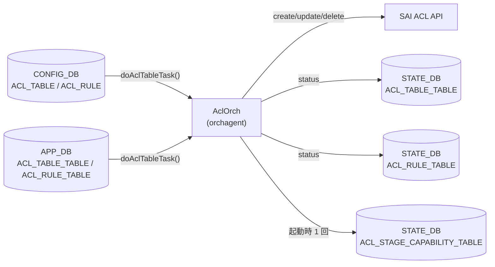

# ACL orchagent STATE_DB テーブル

## 概要

`sonic-swss` の `AclOrch` は ACL テーブル・ルールの SAI 操作結果を `STATE_DB` の 3 テーブルに書き込む[^1]。

| STATE_DB テーブル | 役割 |
|-----------------|------|
| `ACL_TABLE_TABLE` | ACL テーブルの設定受付・動作ステータス |
| `ACL_RULE_TABLE` | ACL ルールの設定受付・動作ステータス |
| `ACL_STAGE_CAPABILITY_TABLE` | プラットフォームの ACL アクション対応能力 |

`ACL_TABLE_TABLE` と `ACL_RULE_TABLE` は書込み主体が orchagent のみであり、`show acl table` / `show acl rule` が参照する読み取り専用のステータスレジスタとして機能する。`ACL_STAGE_CAPABILITY_TABLE` は orchagent 起動時に一度書き込まれ、以降は変化しない。

<!-- cdb-mermaid -->
### データフロー



<!-- /cdb-mermaid -->

## ACL_TABLE_TABLE

### key 構造

```text
ACL_TABLE_TABLE|<table_name>
```

- `<table_name>`: CONFIG_DB `ACL_TABLE` のテーブル名と同一の文字列

### フィールド一覧

| フィールド | 型 | 書込み主体 | デフォルト | 説明 |
|-----------|----|-----------|-----------|------|
| `status` | enum string | `AclOrch` | (起動時削除) | ACL テーブルの動作ステータス。`"Active"` / `"Inactive"` / `"Pending creation"` / `"Pending removal"` のいずれか |

### `status` フィールド詳細

`doAclTableTask()` がテーブル操作の結果に応じて以下の値を書き込む[^1]:

| 値 | 書込み条件 |
|----|-----------|
| `"Active"` | `addAclTable()` または `updateAclTable()` 成功時 |
| `"Inactive"` | バリデーション失敗（設定不正）時 |
| `"Pending creation"` | `addAclTable()` 失敗（リソース不足等）時 |
| `"Pending removal"` | `removeAclTable()` 失敗時 |
| (エントリ削除) | `removeAclTable()` 成功時、orchagent 起動時 |

<!-- defaults -->
**コード由来のデフォルト**:
- `AclOrch::init()` 起動時に `removeAllAclTableStatus()` で全エントリを削除する（`aclorch.cpp:3479-3481`）。
- ステータス文字列は `aclObjectStatusLookup` テーブルで定義 (`aclorch.cpp:521-527`)。
- 新しいエントリが最初に書き込まれる値は操作結果に依存する。正常フローでは `addAclTable()` 成功後 `"Active"` が最初の値となる。
<!-- /defaults -->

## ACL_RULE_TABLE

### key 構造

```text
ACL_RULE_TABLE|<table_name>|<rule_name>
```

- `<table_name>`: 所属する ACL テーブル名
- `<rule_name>`: CONFIG_DB `ACL_RULE` のルール名と同一の文字列

### フィールド一覧

| フィールド | 型 | 書込み主体 | デフォルト | 説明 |
|-----------|----|-----------|-----------|------|
| `status` | enum string | `AclOrch` | (起動時削除) | ACL ルールの動作ステータス。`"Active"` / `"Inactive"` / `"Pending creation"` / `"Pending removal"` のいずれか |

### `status` フィールド詳細

`doAclRuleTask()` がルール操作の結果に応じて以下の値を書き込む[^1]:

| 値 | 書込み条件 |
|----|-----------|
| `"Active"` | `addAclRule()` 成功時 |
| `"Inactive"` | バリデーション失敗（設定不正）時 |
| `"Pending creation"` | `addAclRule()` 失敗時（SAI リソース枯渇含む）。retry cache にパークされた場合も同値 |
| `"Pending removal"` | `removeAclRule()` 失敗時 |
| (エントリ削除) | `removeAclRule()` 成功時、orchagent 起動時 |

<!-- defaults -->
**コード由来のデフォルト**:
- `AclOrch::init()` 起動時に `removeAllAclRuleStatus()` で全エントリを削除する（`aclorch.cpp:3480-3481`）。
- SAI リソース枯渇 (`isSaiStatusResourceFull()` が真) の場合、`"Pending creation"` を設定して retry cache にルールをパーク。他ルールが削除されてリソースが解放されると `notifyRetry()` で再処理される (`aclorch.cpp:5673-5692`)。
<!-- /defaults -->

## ACL_STAGE_CAPABILITY_TABLE

### key 構造

```text
ACL_STAGE_CAPABILITY_TABLE|INGRESS
ACL_STAGE_CAPABILITY_TABLE|EGRESS
```

### フィールド一覧

| フィールド | 型 | 書込み主体 | デフォルト | 説明 |
|-----------|----|-----------|-----------|------|
| `ACL_ACTIONS\|INGRESS` | string | `AclOrch` (起動時) | プラットフォーム依存 | INGRESS ステージでサポートされるアクション名のカンマ区切りリスト |
| `ACL_ACTIONS\|EGRESS` | string | `AclOrch` (起動時) | プラットフォーム依存 | EGRESS ステージでサポートされるアクション名のカンマ区切りリスト |
| `is_action_list_mandatory` | boolean string | `AclOrch` (起動時) | `"false"` | テーブル作成時にアクションリストの指定が必須かどうか |
| `action_list` | string | `AclOrch` (起動時) | プラットフォーム依存 | サポートされるアクション名のカンマ区切りリスト |
| `supported_L3V4V6` | boolean string | `AclOrch` (起動時) | `"false"` (汎用) / `"true"` (BRCM, MLNX 等) | L3V4V6 統合テーブルのサポート有無 |

### フィールド詳細

**`is_action_list_mandatory`**:
- `putAclActionCapabilityInDB()` が `AclActionCapabilities::isActionListMandatoryOnTableCreation` の値を `boolalpha` 形式 (`"true"` / `"false"`) で書き込む。
- SAI から `SAI_SWITCH_ATTR_ACL_STAGE_INGRESS` / `SAI_SWITCH_ATTR_ACL_STAGE_EGRESS` クエリが成功した場合、`attr.value.aclcapability.action_list_mandatory` の値を使用。

<!-- defaults -->
**コード由来のデフォルト**:
- `AclActionCapabilities` 構造体の初期値: `isActionListMandatoryOnTableCreation {false}` (`aclorch.h:143`)。SAI クエリが失敗した場合は `initDefaultAclActionCapabilities()` が `defaultAclActionsSupported` のハードコード値でフォールバックする (`aclorch.cpp:4104-4118`)。
- `supported_L3V4V6` のデフォルトは `false`。BRCM・MLNX・BFN・MRVL 等の特定プラットフォームでは `queryMirrorTableCapability()` 内で `true` に設定される (`aclorch.cpp:3489-3510`)。
- `action_list` の内容はプラットフォーム SAI 実装に依存。フォールバック時は `defaultAclActionsSupported` テーブル (aclorch.cpp:168-196) のデフォルトアクションセットを使用。
<!-- /defaults -->

**`ACL_ACTIONS|INGRESS` / `ACL_ACTIONS|EGRESS`**:
- フィールド名は `"ACL_ACTIONS|" + stage_str`（`stage_str` = `"INGRESS"` または `"EGRESS"`）。
- 値はサポートされるアクション名（`PACKET_ACTION`, `REDIRECT_ACTION`, `MIRROR_INGRESS_ACTION` 等）をカンマ区切りで列挙した文字列。

## 購読者 (consumer)

| プロセス / CLI | 参照テーブル | 用途 |
|--------------|------------|------|
| `show acl table` (sonic-utilities) | `STATE_DB ACL_TABLE_TABLE` | テーブルのステータス表示 |
| `show acl rule` (sonic-utilities) | `STATE_DB ACL_RULE_TABLE` | ルールのステータス表示 |
| `acl-loader` | `STATE_DB ACL_STAGE_CAPABILITY_TABLE` | プラットフォーム対応能力の参照 |
| `sonic-mgmt-common` (translib) | `STATE_DB ACL_STAGE_CAPABILITY_TABLE` | REST/gNMI 経由の能力情報提供 |

## 引用元

[^1]: sonic-net/sonic-swss `orchagent/aclorch.cpp` — `setAclTableStatus()` L6088, `setAclRuleStatus()` L6102, `putAclActionCapabilityInDB()` L4056, `init()` L3475
