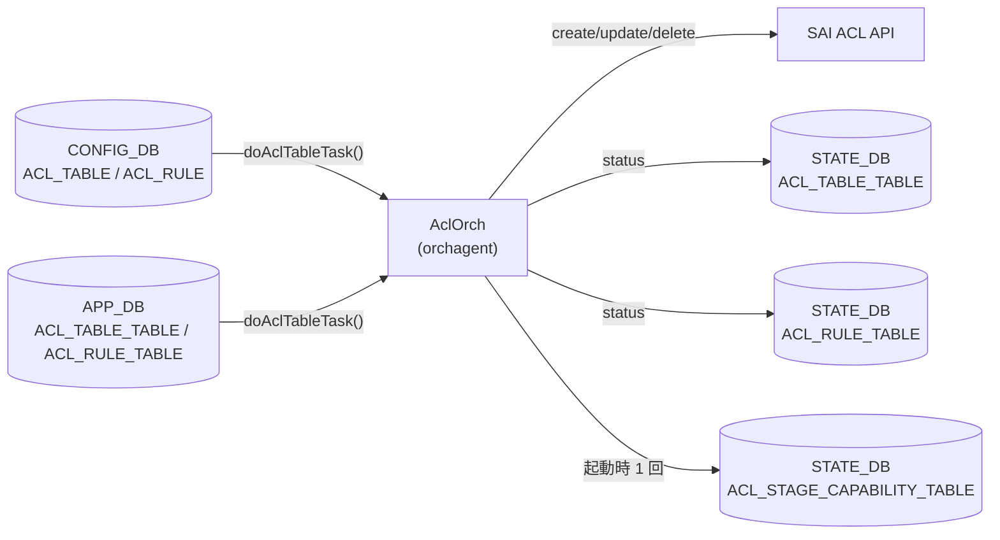

# ACL orchagent STATE_DB テーブル

## 概要

`sonic-swss` の `AclOrch` は ACL テーブル・ルールの SAI 操作結果を `STATE_DB` の 3 テーブルに書き込む[^1]。

| STATE_DB テーブル | 役割 |
|-----------------|------|
| `ACL_TABLE_TABLE` | ACL テーブルの設定受付・動作ステータス |
| `ACL_RULE_TABLE` | ACL ルールの設定受付・動作ステータス |
| `ACL_STAGE_CAPABILITY_TABLE` | プラットフォームの ACL アクション対応能力 |

`ACL_TABLE_TABLE` と `ACL_RULE_TABLE` は書込み主体が orchagent のみであり、`show acl table` / `show acl rule` が参照する読み取り専用のステータスレジスタとして機能する。`ACL_STAGE_CAPABILITY_TABLE` は orchagent 起動時に一度書き込まれ、以降は変化しない。

<!-- cdb-mermaid -->
### データフロー



<!-- /cdb-mermaid -->

## ACL_TABLE_TABLE

### key 構造

```text
ACL_TABLE_TABLE|<table_name>
```

- `<table_name>`: CONFIG_DB `ACL_TABLE` のテーブル名と同一の文字列

### フィールド一覧

| フィールド | 型 | 書込み主体 | デフォルト | 説明 |
|-----------|----|-----------|-----------|------|
| `status` | enum string | `AclOrch` | (起動時削除) | ACL テーブルの動作ステータス。`"Active"` / `"Inactive"` / `"Pending creation"` / `"Pending removal"` のいずれか |

### `status` フィールド詳細

`doAclTableTask()` がテーブル操作の結果に応じて以下の値を書き込む[^1]:

| 値 | 書込み条件 |
|----|-----------|
| `"Active"` | `addAclTable()` または `updateAclTable()` 成功時 |
| `"Inactive"` | バリデーション失敗（設定不正）時 |
| `"Pending creation"` | `addAclTable()` 失敗（リソース不足等）時 |
| `"Pending removal"` | `removeAclTable()` 失敗時 |
| (エントリ削除) | `removeAclTable()` 成功時、orchagent 起動時 |

<!-- defaults -->
**コード由来のデフォルト**:
- `AclOrch::init()` 起動時に `removeAllAclTableStatus()` で全エントリを削除する（`aclorch.cpp:3479-3481`）。
- ステータス文字列は `aclObjectStatusLookup` テーブルで定義 (`aclorch.cpp:521-527`)。
- 新しいエントリが最初に書き込まれる値は操作結果に依存する。正常フローでは `addAclTable()` 成功後 `"Active"` が最初の値となる。
<!-- /defaults -->

## ACL_RULE_TABLE

### key 構造

```text
ACL_RULE_TABLE|<table_name>|<rule_name>
```

- `<table_name>`: 所属する ACL テーブル名
- `<rule_name>`: CONFIG_DB `ACL_RULE` のルール名と同一の文字列

### フィールド一覧

| フィールド | 型 | 書込み主体 | デフォルト | 説明 |
|-----------|----|-----------|-----------|------|
| `status` | enum string | `AclOrch` | (起動時削除) | ACL ルールの動作ステータス。`"Active"` / `"Inactive"` / `"Pending creation"` / `"Pending removal"` のいずれか |

### `status` フィールド詳細

`doAclRuleTask()` がルール操作の結果に応じて以下の値を書き込む[^1]:

| 値 | 書込み条件 |
|----|-----------|
| `"Active"` | `addAclRule()` 成功時 |
| `"Inactive"` | バリデーション失敗（設定不正）時 |
| `"Pending creation"` | `addAclRule()` 失敗時（SAI リソース枯渇含む）。retry cache にパークされた場合も同値 |
| `"Pending removal"` | `removeAclRule()` 失敗時 |
| (エントリ削除) | `removeAclRule()` 成功時、orchagent 起動時 |

<!-- defaults -->
**コード由来のデフォルト**:
- `AclOrch::init()` 起動時に `removeAllAclRuleStatus()` で全エントリを削除する（`aclorch.cpp:3480-3481`）。
- SAI リソース枯渇 (`isSaiStatusResourceFull()` が真) の場合、`"Pending creation"` を設定して retry cache にルールをパーク。他ルールが削除されてリソースが解放されると `notifyRetry()` で再処理される (`aclorch.cpp:5673-5692`)。
<!-- /defaults -->

## ACL_STAGE_CAPABILITY_TABLE

### key 構造

```text
ACL_STAGE_CAPABILITY_TABLE|INGRESS
ACL_STAGE_CAPABILITY_TABLE|EGRESS
```

### フィールド一覧

| フィールド | 型 | 書込み主体 | デフォルト | 説明 |
|-----------|----|-----------|-----------|------|
| `ACL_ACTIONS\|INGRESS` | string | `AclOrch` (起動時) | プラットフォーム依存 | INGRESS ステージでサポートされるアクション名のカンマ区切りリスト |
| `ACL_ACTIONS\|EGRESS` | string | `AclOrch` (起動時) | プラットフォーム依存 | EGRESS ステージでサポートされるアクション名のカンマ区切りリスト |
| `is_action_list_mandatory` | boolean string | `AclOrch` (起動時) | `"false"` | テーブル作成時にアクションリストの指定が必須かどうか |
| `action_list` | string | `AclOrch` (起動時) | プラットフォーム依存 | サポートされるアクション名のカンマ区切りリスト |
| `supported_L3V4V6` | boolean string | `AclOrch` (起動時) | `"false"` (汎用) / `"true"` (BRCM, MLNX 等) | L3V4V6 統合テーブルのサポート有無 |

### フィールド詳細

**`is_action_list_mandatory`**:
- `putAclActionCapabilityInDB()` が `AclActionCapabilities::isActionListMandatoryOnTableCreation` の値を `boolalpha` 形式 (`"true"` / `"false"`) で書き込む。
- SAI から `SAI_SWITCH_ATTR_ACL_STAGE_INGRESS` / `SAI_SWITCH_ATTR_ACL_STAGE_EGRESS` クエリが成功した場合、`attr.value.aclcapability.action_list_mandatory` の値を使用。

<!-- defaults -->
**コード由来のデフォルト**:
- `AclActionCapabilities` 構造体の初期値: `isActionListMandatoryOnTableCreation {false}` (`aclorch.h:143`)。SAI クエリが失敗した場合は `initDefaultAclActionCapabilities()` が `defaultAclActionsSupported` のハードコード値でフォールバックする (`aclorch.cpp:4104-4118`)。
- `supported_L3V4V6` のデフォルトは `false`。BRCM・MLNX・BFN・MRVL 等の特定プラットフォームでは `queryMirrorTableCapability()` 内で `true` に設定される (`aclorch.cpp:3489-3510`)。
- `action_list` の内容はプラットフォーム SAI 実装に依存。フォールバック時は `defaultAclActionsSupported` テーブル (aclorch.cpp:168-196) のデフォルトアクションセットを使用。
<!-- /defaults -->

**`ACL_ACTIONS|INGRESS` / `ACL_ACTIONS|EGRESS`**:
- フィールド名は `"ACL_ACTIONS|" + stage_str`（`stage_str` = `"INGRESS"` または `"EGRESS"`）。
- 値はサポートされるアクション名（`PACKET_ACTION`, `REDIRECT_ACTION`, `MIRROR_INGRESS_ACTION` 等）をカンマ区切りで列挙した文字列。

<!-- ordering -->
## 書込み順依存 (Phase B)

`AclOrch` は CONFIG_DB / APP_DB の `ACL_TABLE` / `ACL_RULE` を SAI に反映した後、結果ステータスを STATE_DB 3 テーブルへ書き込む。SAI 操作の成否と親子関係（テーブル → ルール）に応じて、書込み順は orchagent 内部で自動調停されるが、consumer から観測しうる中間状態がいくつか存在する。

### 検出された順序依存

| # | 依存関係 | 方向 | 緩和策 |
|---|----------|------|--------|
| 1 | `init()` での STATE_DB クリア → capability 公開 | 強制先行（クリア優先） | 起動直後は capability が公開されるまでテーブル / ルールのステータスは未確定 |
| 2 | SAI capability クエリ成否に応じた 2 経路 → `ACL_STAGE_CAPABILITY_TABLE` 書込み | 1 回限り（init 内で確定） | クエリ失敗時は `defaultAclActionsSupported` のフォールバック値で公開 |
| 3 | `ACL_TABLE` が `Active` 登録 → `ACL_RULE_TABLE` ステータス書込み許可 | **強制先行** | rule は `m_toSync` で再キューされ、テーブル登録後に書込まれる |
| 4 | SAI 結果 → `ACL_TABLE_TABLE.status` 遷移 | 即時（中間状態あり） | consumer は `Pending creation` を一時的に観測しうる |
| 5 | 他ルール DEL → retry cache の `Pending creation` ルール再評価 | 操作依存（非自明） | `notifyRetry()` が自動再キュー、成功時 `Active` 上書き |
| 6 | SAI DEL 失敗 → `Pending removal` 滞留 | 即時（次回イテレーションで再試行） | 配下ルール削除後の再試行で自然解消 |
| 7 | INGRESS / EGRESS capability 書込み | 独立 | init 完了前の同時読み出しは中間状態あり |

### 主要な制約詳細

**ACL_TABLE → ACL_RULE 親子順序 (依存 #3)**: `doAclRuleTask()` は `getTableById(table_id)` が `SAI_NULL_OBJECT_ID` を返す間、ルールを `m_toSync` に残したまま `it++; continue;` で再キューする。このため `ACL_RULE_TABLE|<table>|<rule>` の STATE_DB ステータスは、対応する `ACL_TABLE` が `addAclTable()` 成功で内部マップ `m_AclTables` に登録された後まで**書き込まれない**。CONFIG_DB 側でルールを先に投入しても、consumer から見た STATE_DB の出現順は常に「テーブル `Active` → ルール `Active`」となる（evidence: `aclorch.cpp:5548-5566`, `aclorch.cpp:5665-5706`）。

**retry cache 経由の非自明な順序 (依存 #5)**: SAI リソース枯渇 (`isSaiStatusResourceFull()` が真) で `addAclRule()` が失敗した場合、`setAclRuleStatus(..., PENDING_CREATION)` を書いてから `consumer.addToRetry()` でルールを retry cache にパークし、`m_toSync` からは erase する。後続で**同一テーブル内の他ルールが** `removeAclRule()` 成功すると `notifyRetry()` が retry cache を再キューし、再度 `addAclRule()` が実行される。成功時に `setAclRuleStatus(..., ACTIVE)` で上書きされるため、操作者から見ると「無関係に見えるルール A の削除がルール B を `Pending creation` → `Active` に遷移させる」という非自明な順序関係が成立する（evidence: `aclorch.cpp:5673-5692`, `aclorch.cpp:5710-5721`）。

**init() でのクリア → capability の順 (依存 #1, #2)**: `AclOrch::init()` は冒頭で `removeAllAclTableStatus()` / `removeAllAclRuleStatus()` を呼んで STATE_DB の旧テーブル/ルールステータスを全削除し、その後 `queryAclActionCapability()` を呼んで `ACL_STAGE_CAPABILITY_TABLE` を書き込む。SAI クエリが失敗した場合も `initDefaultAclActionCapabilities()` → `putAclActionCapabilityInDB()` の同 path でフォールバック値が公開されるため、`ACL_STAGE_CAPABILITY_TABLE` は init 完了時点で必ず 1 回書かれる（evidence: `aclorch.cpp:3479-3481`, `aclorch.cpp:3708`, `aclorch.cpp:4017-4037`, `aclorch.cpp:4104-4118`）。

<!-- /ordering -->

## 購読者 (consumer)

| プロセス / CLI | 参照テーブル | 用途 |
|--------------|------------|------|
| `show acl table` (sonic-utilities) | `STATE_DB ACL_TABLE_TABLE` | テーブルのステータス表示 |
| `show acl rule` (sonic-utilities) | `STATE_DB ACL_RULE_TABLE` | ルールのステータス表示 |
| `acl-loader` | `STATE_DB ACL_STAGE_CAPABILITY_TABLE` | プラットフォーム対応能力の参照 |
| `sonic-mgmt-common` (translib) | `STATE_DB ACL_STAGE_CAPABILITY_TABLE` | REST/gNMI 経由の能力情報提供 |

<!-- cross-refs -->
## 暗黙参照テーブル (Phase C)

本ページの STATE_DB 3 テーブル（`ACL_TABLE_TABLE` / `ACL_RULE_TABLE` / `ACL_STAGE_CAPABILITY_TABLE`）はいずれも YANG 未モデル化のオペレーショナルテーブルで、`AclOrch` が**書き手 (producer only)** として書き込む。
ここでの暗黙参照は、これら STATE_DB エントリの**生成トリガ・キー値・フィールド値**が依存する入力側テーブルと前提 Orch / プラットフォーム情報を指す。

| 参照先テーブル / リソース | 参照方向 | 条件 | 参照元 evidence |
|--------------------------|---------|------|----------------|
| `ACL_TABLE\|<table_name>` (CONFIG_DB) | キー転写 + SET/DEL トリガ | 常時。`<table_name>` は STATE_DB `ACL_TABLE_TABLE` キーに転写される | `aclorch.cpp` L4283–4285 (dispatch), L5346 (`doAclTableTask`), L6087–6092 (`setAclTableStatus`) |
| `ACL_RULE\|<table_name>\|<rule_name>` (CONFIG_DB) | キー転写 + SET/DEL トリガ | 常時。複合キーがそのまま STATE_DB `ACL_RULE_TABLE` キーへ | `aclorch.cpp` L4287–4289, L5520 (`doAclRuleTask`), L6101–6106 (`setAclRuleStatus`) |
| `ACL_TABLE_TABLE` (APPL_DB) | 同等の入力経路 | APPL_DB 経由の動的 ACL（feature プロセス等） | `aclorch.cpp` L4283 (`APP_ACL_TABLE_TABLE_NAME` も dispatch) |
| `ACL_RULE_TABLE` (APPL_DB) | 同等の入力経路、retry cache 対象 | APPL_DB 経由の動的 ACL ルール。SAI リソース枯渇時は retry cache にパーク | `aclorch.cpp` L4222 (`createRetryCache(APP_ACL_RULE_TABLE_NAME)`), L4287 |
| `ACL_TABLE_TYPE` (CONFIG_DB) / `ACL_TABLE_TYPE_TABLE` (APPL_DB) | カスタム型解決 | `ACL_TABLE` の `type` がカスタム型のとき。未定義なら `status="Inactive"` | `aclorch.cpp` L4291 |
| `PORT` (PortsOrch `allPortsReady()`) | 起動順序ガード | 常時。false の間は `doAclRuleTask()` に到達せず STATE_DB `ACL_RULE_TABLE` に新規エントリが書かれない | `aclorch.cpp` L4276 |
| SAI Switch capability (`SAI_SWITCH_ATTR_ACL_STAGE_*`) | SAI クエリ → STATE_DB 書込み | 起動時 1 回。`ACL_STAGE_CAPABILITY_TABLE` の動的値ソース。失敗時は `defaultAclActionsSupported` でフォールバック | `aclorch.cpp` L4025–4036, L4056–4101 (`putAclActionCapabilityInDB`), L4104–4118 |
| `DEVICE_METADATA\|localhost.platform`（platform 文字列） | プラットフォーム分岐 | `supported_L3V4V6` フィールド決定時 (MRVL_PRST / MRVL_TL / VS で `true`、他で `false`) | `aclorch.cpp` L3489–3510 (`queryMirrorTableCapability`), L4093–4099 |
| SAI ACL API 戻り値 (`create/remove_acl_table/entry`) | 戻り値判定 → `status` 値 | 常時。`Active` / `Inactive` / `Pending creation` / `Pending removal` を決定。リソース枯渇は retry cache にパーク | `aclorch.cpp` L5462–5508 (table), L5670–5726 (rule), `isSaiStatusResourceFull()` L5683–5692 |

!!! note "STATE_DB エントリは「書き出し専用」のステータスレジスタ"
    `AclOrch` 以外の書き手は存在しない。`show acl table` / `show acl rule` / `acl-loader` / `sonic-mgmt-common` (translib) は読み手のみ。
    `removeAllAclTableStatus()` / `removeAllAclRuleStatus()` (`aclorch.cpp:6116`, `6128`) が orchagent 起動時 (`init()` L3479–3481) に一度全エントリを削除し、その後 CONFIG_DB / APPL_DB からの再 SET を契機に再構築される。

!!! note "`ACL_STAGE_CAPABILITY_TABLE` は起動時 1 回のみ更新"
    `putAclActionCapabilityInDB()` (`aclorch.cpp:4056`) は orchagent 起動時の capability 確定段階で呼ばれるのみで、CONFIG_DB / APPL_DB の動的変更による再書込みは発生しない。
    フィールド値はプラットフォーム SAI capability と `DEVICE_METADATA` の `platform` 文字列に静的に依存する。

<!-- /cross-refs -->

<!-- failure -->
## 失敗挙動 (Phase D)

`AclOrch` の処理失敗は `STATE_DB` の 3 テーブルに `status` フィールド値として反映される。エラー詳細は `SWSS_LOG_ERROR` / `SWSS_LOG_WARN` のみでサイログ出力される（`ERROR_TABLE` への書き込みはなし）。

### ACL_TABLE_TABLE の失敗パターン

**SET 時**:

| 失敗ケース | 発生箇所 | STATE_DB status | retry |
|---|---|---|---|
| 属性不正 / stage 不正 / ports bind 不可 (`bAllAttributesOk=false`) | `doAclTableTask()` L5488-5494 | `"Inactive"` | なし (erase) |
| `validate()` 失敗 (L3V4V6 非サポート / action 非サポート) | `AclTable::validate()` L2737-2766 | `"Inactive"` | なし (erase) |
| `addAclTable()` SAI 失敗 (MIRROR capability 欠如 / SAI エラー) | `doAclTableTask()` L5480-5485 | `"Pending creation"` | 無制限 (it++) |
| `updateAclTable()` 失敗 (ports 更新失敗) | `doAclTableTask()` L5465-5470 | 変化なし | 無制限 (it++) |

**DEL 時**:

| 失敗ケース | 発生箇所 | STATE_DB status | retry |
|---|---|---|---|
| `removeAclTable()` 失敗 (配下 rule 残存 / SAI 削除失敗) | `doAclTableTask()` L5505-5510 | `"Pending removal"` | 無制限 (it++) |

### ACL_RULE_TABLE の失敗パターン

**SET 時**:

| 失敗ケース | 発生箇所 | STATE_DB status | retry |
|---|---|---|---|
| 属性不正 / マッチ不正 / v4+v6 混在 (`bAllAttributesOk=false` / `validate()` 失敗) | `doAclRuleTask()` L5700-5706 | `"Inactive"` | なし (erase) |
| `addAclRule()` 失敗 + SAI リソース枯渇 + retry cache 登録成功 | `doAclRuleTask()` L5673-5684 | `"Pending creation"` | 同テーブル内他ルール DEL 成功で `notifyRetry()` |
| `addAclRule()` 失敗 + SAI リソース枯渇 + retry cache 登録失敗 | `doAclRuleTask()` L5686-5692 | `"Pending creation"` | 無制限 (it++) |
| `addAclRule()` 失敗 (リソース枯渇以外) | `doAclRuleTask()` L5694-5698 | `"Pending creation"` | 無制限 (it++) |

**DEL 時**:

| 失敗ケース | 発生箇所 | STATE_DB status | retry |
|---|---|---|---|
| `removeAclRule()` 失敗 | `doAclRuleTask()` L5723-5728 | `"Pending removal"` | 無制限 (it++) |

!!! note "`Pending creation` のリソース枯渇ケース"
    SAI リソース枯渇 (`isSaiStatusResourceFull()` が真) でルールが retry cache にパークされた場合、
    同一テーブル内の**他ルールが削除されて `notifyRetry()` が発火するまで** STATUS は `"Pending creation"` のまま滞留する。
    操作者から見ると「無関係に見えるルール A の削除がルール B を `Active` に遷移させる」ように見える
    （evidence: `aclorch.cpp:5673-5692`, `aclorch.cpp:5716-5721`）。

### ACL_STAGE_CAPABILITY_TABLE の失敗パターン

orchagent 起動時 `init()` 内で 1 回のみ書き込まれる。SAI クエリ失敗時は `initDefaultAclActionCapabilities()` のフォールバックパスで `defaultAclActionsSupported` のハードコード値が書き込まれ、テーブルは必ず確定した値を保つ。

| 失敗ケース | 発生箇所 | 結果 |
|---|---|---|
| `SAI_SWITCH_ATTR_MAX_ACL_ACTION_COUNT` 取得失敗 | `queryAclActionCapability()` L4017-4022 | 両ステージ共フォールバック値で書込み |
| `SAI_SWITCH_ATTR_ACL_STAGE_INGRESS/EGRESS` 取得失敗 | `queryAclActionCapability()` L4030-4037 | 当該ステージのみフォールバック値。成功ステージは SAI 値 |

フォールバック定義: `aclorch.cpp:168-196`（`defaultAclActionsSupported`）。

### STATE_DB status 遷移サマリ

```
ACL_TABLE_TABLE SET:
  bAllAttributesOk=false / validate()=false  →  "Inactive"         (erase, no retry)
  addAclTable() 失敗                         →  "Pending creation" (it++, 無制限 retry)
  updateAclTable() 失敗                      →  変化なし            (it++, 無制限 retry)
  addAclTable()/updateAclTable() 成功        →  "Active"           (erase)

ACL_TABLE_TABLE DEL:
  removeAclTable() 失敗                      →  "Pending removal"  (it++, 無制限 retry)
  removeAclTable() 成功                      →  エントリ削除

ACL_RULE_TABLE SET:
  bAllAttributesOk=false / validate()=false  →  "Inactive"         (erase, no retry)
  addAclRule() 失敗 (SAI リソース枯渇)        →  "Pending creation" (retry cache / it++)
  addAclRule() 失敗 (その他 SAI エラー)       →  "Pending creation" (it++, 無制限 retry)
  addAclRule() 成功                          →  "Active"           (erase)

ACL_RULE_TABLE DEL:
  removeAclRule() 失敗                       →  "Pending removal"  (it++, 無制限 retry)
  removeAclRule() 成功                       →  エントリ削除 + notifyRetry() 発火
```

> **証跡**: `doAclTableTask()` L5361-5518 精読、`doAclRuleTask()` L5520-5736 精読、`setAclTableStatus()` L6088-6093、`setAclRuleStatus()` L6102-6113、`queryAclActionCapability()` L3975-4054、`initDefaultAclActionCapabilities()` L4104-4118。
<!-- /failure -->

## 引用元

[^1]: sonic-net/sonic-swss `orchagent/aclorch.cpp` — `setAclTableStatus()` L6088, `setAclRuleStatus()` L6102, `putAclActionCapabilityInDB()` L4056, `init()` L3475
