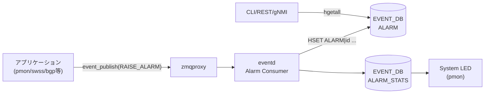

# ALARM テーブル (EVENT_DB)

## 概要

**ALARM テーブル**は SONiC の Event/Alarm Framework において **アクティブなアラーム（未クリア・未クリア状態のもの）** を一時的に保持するテーブルである[^1]。

> **注意**: このテーブルは **CONFIG_DB ではなく EVENT_DB** (Redis DB index 6) に存在する。
> `schema.h` で `EVENT_CURRENT_ALARM_TABLE_NAME = "ALARM"` と定義されている[^2]。
> リブート時に内容はクリアされる（非永続）。

`eventd` コンテナ内の **Alarm Consumer** が以下の状態遷移でテーブルを管理する:

- `action=RAISE_ALARM` 受信 → エントリ追加、`acknowledged=false` で初期化
- `action=CLEAR_ALARM` 受信 → 対応エントリを削除
- `action=ACK_ALARM` 受信 → `acknowledged=true`、`acknowledge-time` 更新
- `action=UNACK_ALARM` 受信 → `acknowledged=false`、`acknowledge-time` 更新

<!-- cdb-mermaid -->
### データフロー (自動生成)



!!! note "凡例"
    EVENT_DB 内の ALARM テーブルへの書き込み経路を示す。CONFIG_DB 経由ではない。
<!-- /cdb-mermaid -->

## key 構造

```text
ALARM|<id>
```

`<id>` はシステムが自動採番する uint64 の sequential ID。フォーマット:
```
<32bit UNIX time_t><5桁連番 (00000–99999)>
```

例: `ALARM|1621460371062299951`

## フィールド

| フィールド | 型 | デフォルト | 説明 |
|-----------|----|-----------|------|
| `id` | uint64 | システム自動採番 | シーケンス ID (key と同値) |
| `revision` | uint64 | `0` | event profile のリビジョン番号 |
| `type-id` | string | — | アラーム識別名 (例: `TEMPERATURE_EXCEEDED`) |
| `text` | string | 静的メッセージ | 動的メッセージを含むアラーム説明文 |
| `time-created` | uint64 | システム自動設定 | アラーム発生時刻 (nanosecond UNIX timestamp) |
| `severity` | string enum | event profile の値 | `CRITICAL` / `MAJOR` / `MINOR` / `WARNING` |
| `action` | string enum | `"RAISE"` (固定) | ALARM テーブルには RAISE エントリのみ存在 |
| `resource` | string | — (optional) | アラーム発生源リソース識別子 |
| `acknowledged` | boolean | `"false"` | ACK 済みフラグ; RAISE 時に `false` で初期化 |
| `acknowledge-time` | uint64 | — (ACK 時のみ設定) | ACK/UNACK 操作時のタイムスタンプ |

## 制約

- `severity` に `INFORMATIONAL` はアラームとして不可 (one-shot event 専用)
- ALARM テーブルは起動時クリア・非永続。再起動後に残存しない
- 同一条件のアラームが連続 RAISE された場合、eventd は直近キャッシュと比較してフラッドを防ぐ (重複エントリを黙棄)
- テーブルサイズ上限なし (EVENT テーブルが 40,000 件 / 30 日上限のある一方、ALARM はスナップショット)

## 購読者

- **CLI**: `show alarm [detail | summary | severity | recent | timestamp]`
- **gNMI/REST**: OpenConfig alarms コンテナ経由で取得 (`/openconfig-alarms:alarms`)
- **pmon**: `ALARM_STATS` テーブルのカウンタを参照して System LED を制御 (Critical/Major → 赤、Minor/Warning → 黄、なし → 緑)

## 関連テーブル

| テーブル | 説明 |
|---------|------|
| `EVENT` | 全イベント (ALARM 含む) の履歴 — 永続・上限付き |
| `ALARM_STATS` | 重要度別アクティブアラーム数のカウンタ |
| `EVENT_STATS` | イベント統計 (raised/cleared/acked 累計) |

<!-- cdb-exceptions -->
## 例外条件・特殊挙動

| 条件 | 挙動 |
|------|------|
| 同一アラームが連続 RAISE | eventd の直近キャッシュと一致する場合、重複エントリを黙棄 (flooding 防止) |
| CLEAR_ALARM を対応する RAISE なしで受信 | lookup map にエントリなし → ALARM テーブルへの操作なし |
| リブート (cold/warm/fast) | ALARM テーブルの内容はクリア (非永続); ALARM_STATS も同様にリセット |
| ACK_ALARM を mgmt-framework 以外が発行 | API 上可能だが、設計上 mgmt-framework のみを想定 |

<!-- evidence: SONiC/doc/event-alarm-framework/event-alarm-framework.md:Section 3.1.3, 3.1.4.2 -->
<!-- /cdb-exceptions -->

<!-- defaults -->
## フィールド暗黙デフォルト (Phase A — コード由来)

YANG optional / event profile 未指定時の実行時フォールバック。

| フィールド | コード由来デフォルト | fallback 源 |
|-----------|-------------------|------------|
| `revision` | `0` | event profile の `revision` 未指定時 — HLD Section 3.1.2.3 |
| `acknowledged` | `"false"` | RAISE_ALARM 処理時に Alarm Consumer が初期化 — HLD Section 3.1.2 |
| `action` | `"RAISE"` (ALARM テーブル内では固定) | ALARM テーブルに格納されるのは RAISE イベントのみ |
| `acknowledge-time` | フィールド不在 | ACK_ALARM / UNACK_ALARM 受信前は存在しない |
| `resource` | フィールド不在 (optional) | アプリケーションが渡さない場合はフィールドなし |

### 補足

- **`revision=0` デフォルト**: event profile の `default.json` に `revision` が未記載の場合 eventd が `0` を採用する。開発者が新しいアラームパラメータ (threshold 変更等) を適用した際にインクリメントすることで、クライアントが異なるリリースのイベントを区別できる。
- **`acknowledged=false` 強制初期化**: RAISE_ALARM 処理時に Alarm Consumer が必ず `false` で初期化する。これによりオペレータの ACK 操作より前に `acknowledged=true` でエントリが存在することはない。
- **`action` は常に `"RAISE"`**: CLEAR_ALARM 受信時は対応エントリを **削除** するため、テーブル内のエントリは全て `action=RAISE` の状態にある。CLEAR 後の証跡は EVENT テーブルのみに残る。
- **severity デフォルト不在**: `severity` は event profile の `default.json` で開発者が必ず指定しなければならない。フォールバックは定義されていない。`INFORMATIONAL` は alarm には不可。

<!-- /defaults -->

<!-- constants -->
## ハードコード定数 (Phase E — コード由来)

ALARM テーブルのスキーマ・運用に直接効く固定値。event profile や CONFIG_DB から上書き不能で、コード/HLD でリテラル固定されている。

### severity 列挙値 (5 値、ハードコード文字列)

| 値 | アラーム適用 | 出典 |
|----|-------------|------|
| `CRITICAL` | 可 | HLD §3.1.2 (event-alarm-framework.md:136) |
| `MAJOR` | 可 | HLD :138 |
| `MINOR` | 可 | HLD :140 |
| `WARNING` | 可 | HLD :142 |
| `INFORMATIONAL` | **不可** (one-shot event 専用) | HLD :144, :348 |

eventd は event profile (`default.json`) に書かれた severity 文字列をそのまま ALARM テーブルへ書き込む。enum は YANG (`openconfig-alarms`) 側に定義され、コード上は文字列比較で扱われる。

### テーブル名固定文字列

`sonic-swss-common/common/schema.h:551-554`:

```c
#define EVENT_HISTORY_TABLE_NAME          "EVENT"
#define EVENT_CURRENT_ALARM_TABLE_NAME    "ALARM"
#define EVENT_STATS_TABLE_NAME            "EVENT_STATS"
#define EVENT_ALARM_STATS_TABLE_NAME      "ALARM_STATS"
```

これらは `#define` で固定され、設定で変更不可。

### retention / サイズ上限

| 対象 | 上限 | 出典 |
|------|------|------|
| ALARM テーブル records 数 | **上限なし** (スナップショット) | HLD §3.1.7 |
| ALARM テーブル保持日数 | **非永続** (リブートでクリア) | HLD §3.1.7 |
| EVENT テーブル records 数 | `40000` (range 1-40000) | HLD :482, :491, :496 |
| EVENT テーブル保持日数 | `30` (range 1-30) | HLD :482, :492, :497 |

ALARM 側に records / days 上限は定義されておらず、`eventd.json` の `no-of-records` / `no-of-days` は EVENT テーブルにのみ適用される。

### action 列挙 (プロトコル定数)

ALARM テーブルへ作用する 4 操作 (HLD §3.1.4 / §3.1.5):

- `RAISE_ALARM` — 行追加 (`action=RAISE` で格納)
- `CLEAR_ALARM` — 対応行を削除
- `ACK_ALARM` — `acknowledged=true` に更新
- `UNACK_ALARM` — `acknowledged=false` に更新

ALARM テーブル内の `action` フィールドは常に `"RAISE"` (CLEAR は行削除なのでテーブル上に残らない)。

詳細解析: `meta/_intermediate/cdb-flow/alarm-table-constants.md`

<!-- evidence: sonic-swss-common/common/schema.h:551-554, SONiC/doc/event-alarm-framework/event-alarm-framework.md:136-144,346-348,480-499 -->
<!-- /constants -->

<!-- ref-triangle:start -->

## 関連リファレンス

- HLD: [Event and Alarm Framework](https://github.com/sonic-net/SONiC/blob/master/doc/event-alarm-framework/event-alarm-framework.md)
- YANG: `openconfig-alarms` (sonic-mgmt-common)
- CLI: `show alarm`

<!-- ref-triangle:end -->

## 引用元

[^1]: `SONiC/doc/event-alarm-framework/event-alarm-framework.md` Rev 0.3, Section 1 / 3.1.7 — ALARM テーブルの定義・スキーマ・redis 出力例。<https://github.com/sonic-net/SONiC/blob/master/doc/event-alarm-framework/event-alarm-framework.md>

[^2]: `sonic-swss-common/common/schema.h:552` — `#define EVENT_CURRENT_ALARM_TABLE_NAME "ALARM"`

## 関連ページ

- [CONFIG_DB / EVENT_DB: EVENT テーブル](event-table.md)

<!-- ops-hint -->
## 運用ヒント

### 確認コマンド

```bash
# アクティブアラーム一覧
show alarm

# redis 直接確認 (EVENT_DB = index 6)
sonic-db-cli EVENT_DB keys 'ALARM|*'
sonic-db-cli EVENT_DB hgetall 'ALARM|<id>'

# ALARM_STATS 確認
sonic-db-cli EVENT_DB hgetall 'ALARM_STATS|state'
```

### よくある確認ポイント

- `acknowledged=true` のアラームは ALARM_STATS のカウンタから除外されるため、System LED の判定に影響しない
- リブート後に ALARM テーブルが空になるのは正常動作
- `show alarm summary` で severity 別カウントを確認できる
<!-- /ops-hint -->
