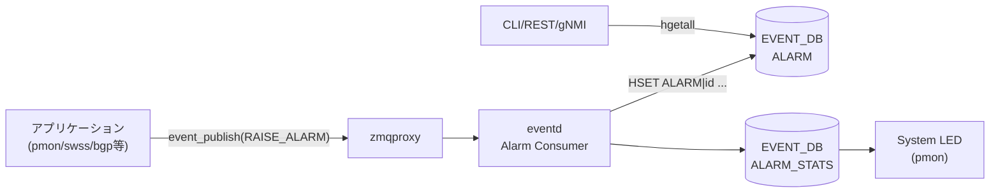

# ALARM テーブル (EVENT_DB)

## 概要

**ALARM テーブル**は SONiC の Event/Alarm Framework において **アクティブなアラーム（未クリア・未クリア状態のもの）** を一時的に保持するテーブルである[^1]。

> **注意**: このテーブルは **CONFIG_DB ではなく EVENT_DB** (Redis DB index 6) に存在する。
> `schema.h` で `EVENT_CURRENT_ALARM_TABLE_NAME = "ALARM"` と定義されている[^2]。
> リブート時に内容はクリアされる（非永続）。

`eventd` コンテナ内の **Alarm Consumer** が以下の状態遷移でテーブルを管理する:

- `action=RAISE_ALARM` 受信 → エントリ追加、`acknowledged=false` で初期化
- `action=CLEAR_ALARM` 受信 → 対応エントリを削除
- `action=ACK_ALARM` 受信 → `acknowledged=true`、`acknowledge-time` 更新
- `action=UNACK_ALARM` 受信 → `acknowledged=false`、`acknowledge-time` 更新

<!-- cdb-mermaid -->
### データフロー (自動生成)



!!! note "凡例"
    EVENT_DB 内の ALARM テーブルへの書き込み経路を示す。CONFIG_DB 経由ではない。
<!-- /cdb-mermaid -->

## key 構造

```text
ALARM|<id>
```

`<id>` はシステムが自動採番する uint64 の sequential ID。フォーマット:
```
<32bit UNIX time_t><5桁連番 (00000–99999)>
```

例: `ALARM|1621460371062299951`

## フィールド

| フィールド | 型 | デフォルト | 説明 |
|-----------|----|-----------|------|
| `id` | uint64 | システム自動採番 | シーケンス ID (key と同値) |
| `revision` | uint64 | `0` | event profile のリビジョン番号 |
| `type-id` | string | — | アラーム識別名 (例: `TEMPERATURE_EXCEEDED`) |
| `text` | string | 静的メッセージ | 動的メッセージを含むアラーム説明文 |
| `time-created` | uint64 | システム自動設定 | アラーム発生時刻 (nanosecond UNIX timestamp) |
| `severity` | string enum | event profile の値 | `CRITICAL` / `MAJOR` / `MINOR` / `WARNING` |
| `action` | string enum | `"RAISE"` (固定) | ALARM テーブルには RAISE エントリのみ存在 |
| `resource` | string | — (optional) | アラーム発生源リソース識別子 |
| `acknowledged` | boolean | `"false"` | ACK 済みフラグ; RAISE 時に `false` で初期化 |
| `acknowledge-time` | uint64 | — (ACK 時のみ設定) | ACK/UNACK 操作時のタイムスタンプ |

## 制約

- `severity` に `INFORMATIONAL` はアラームとして不可 (one-shot event 専用)
- ALARM テーブルは起動時クリア・非永続。再起動後に残存しない
- 同一条件のアラームが連続 RAISE された場合、eventd は直近キャッシュと比較してフラッドを防ぐ (重複エントリを黙棄)
- テーブルサイズ上限なし (EVENT テーブルが 40,000 件 / 30 日上限のある一方、ALARM はスナップショット)

## 購読者

- **CLI**: `show alarm [detail | summary | severity | recent | timestamp]`
- **gNMI/REST**: OpenConfig alarms コンテナ経由で取得 (`/openconfig-alarms:alarms`)
- **pmon**: `ALARM_STATS` テーブルのカウンタを参照して System LED を制御 (Critical/Major → 赤、Minor/Warning → 黄、なし → 緑)

## 関連テーブル

| テーブル | 説明 |
|---------|------|
| `EVENT` | 全イベント (ALARM 含む) の履歴 — 永続・上限付き |
| `ALARM_STATS` | 重要度別アクティブアラーム数のカウンタ |
| `EVENT_STATS` | イベント統計 (raised/cleared/acked 累計) |

<!-- cdb-exceptions -->
## 例外条件・特殊挙動

| 条件 | 挙動 |
|------|------|
| 同一アラームが連続 RAISE | eventd の直近キャッシュと一致する場合、重複エントリを黙棄 (flooding 防止) |
| CLEAR_ALARM を対応する RAISE なしで受信 | lookup map にエントリなし → ALARM テーブルへの操作なし |
| リブート (cold/warm/fast) | ALARM テーブルの内容はクリア (非永続); ALARM_STATS も同様にリセット |
| ACK_ALARM を mgmt-framework 以外が発行 | API 上可能だが、設計上 mgmt-framework のみを想定 |

<!-- evidence: SONiC/doc/event-alarm-framework/event-alarm-framework.md:Section 3.1.3, 3.1.4.2 -->
<!-- /cdb-exceptions -->

<!-- ordering -->
## 書込み順依存 (Phase B)

ALARM テーブルは **EVENT_DB (Redis index 6) の push 配信テーブル** であり、CONFIG_DB 派生テーブルとは異なり ZMQ XPUB/XSUB 経由で書き込まれる。順序依存は次の 3 層に分かれる: **(a) eventd の socket bind / publisher の echo handshake 時系列**、**(b) publisher 側 (healthd 等) の CONFIG_DB / STATE_DB 起動時依存**、**(c) 同一 action 内での非トランザクショナルな複数 Redis 書込**。

### 検出された順序依存

| # | 依存関係 | 方向 | 緩和策 |
|---|----------|------|--------|
| 1 | eventd の zmqproxy XSUB/XPUB/CAPTURE bind → publisher の echo handshake | **強制先行** (timeout 時 publisher 取得失敗 / handshake 前の publish は silent drop) | systemd 起動順 + `docker-eventd` ready 待ちで保証 |
| 2 | event profile (`default.json`) に `(source, tag)` キー存在 → publisher の RAISE_ALARM 発火 | **強制先行** (image build 時に静的解決) | runtime での復旧不可 |
| 3 | `CONFIG_DB:DEVICE_METADATA` / `FEATURE` + `STATE_DB:FEATURE` → healthd publisher 起動 | 推奨先行 (欠如時 `sonic-events-host` 系 RAISE 発火せず) | systemd `After=` + SubscriberStateTable 後追い |
| 4 | COUNTERS_DB 起動 → eventd `stats_collector` `run_writer` thread | 緩い依存 (失敗時はカウンタのみ停止・ALARM 本体無影響) | 例外 catch で eventd 本体は継続 |
| 5 | 同一 RAISE_ALARM 内 — `HSET ALARM` → `HINCRBY ALARM_STATS` | 同期順 (MULTI/EXEC 無し → Redis 切断瞬間に不整合可能) | eventd abort + コンテナ再起動で回帰 (テーブルは空から再開) |
| 6 | eventd 自身の zmqproxy bind → heartbeat publisher 初期化 | プロセス内自己順序 | heartbeat 不在は ALARM 飢餓の早期検知信号 |
| 7 | 対応 RAISE_ALARM (lookup map 構築) → CLEAR_ALARM 受信 | **対応先行必須** (RAISE 不在の CLEAR は no-op) | flooding 防止キャッシュで重複 RAISE 黙棄 / lookup map 永続化なし |

### 主要な制約詳細

**zmqproxy bind と echo handshake (依存 #1)**: `eventd_proxy::init()` (`sonic-eventd/src/eventd.cpp:77-107`) が ZMQ_XSUB → ZMQ_XPUB → ZMQ_PUB(capture) の順に `zmq_bind`。publisher 側 `events_init_publisher()` (`sonic-swss-common/common/events.cpp:97-109`) は echo socket で handshake を行い、`EVENTS_SERVICE_TIMEOUT_MS_PUB` 内に成立しなければ publisher 取得失敗 (`SWSS_LOG_ERROR "Failed to init event service rc=%d"`)。handshake 前に `event_publish()` を呼ぶと ZMQ PUB 仕様により **silent drop** され、RAISE_ALARM がカウントもログも残さず消える可能性がある (`events.cpp:103` コメント "Any message published before connection establishment is dropped.")。

**event profile キー解決 (依存 #2)**: ALARM 行の `type-id` / `severity` / `action` は publisher が指定する `(source, tag)` を **event profile JSON のキー** として暗黙参照する。profile に該当キー (`sonic-events-eventd.heartbeat` / `sonic-events-host.process-not-running` / `sonic-events-host.liquid-cooling-leak` / `sonic-events-host.process-exited-unexpectedly` 等) が無いと severity / action が解決されず RAISE が無効化される。profile は image build 時に静的に確定する設計で、runtime での復旧不可。

**healthd publisher の DB 先読み (依存 #3)**: healthd (`sysmonitor.py:39-41,152,217-219` / `service_checker.py:321-323`) は ALARM publish 前に `CONFIG_DB:DEVICE_METADATA` 全フィールド / `CONFIG_DB:FEATURE` (`get_table`) / `STATE_DB:FEATURE` (SubscriberStateTable) を読む。これらが欠落した状態で healthd が起動すると `sonic-events-host` 系の RAISE_ALARM が発火せず、ALARM テーブルが空のままになる。ALARM テーブル自体ではなく ALARM publisher の有効化条件であり、eventd 側はこの順序を強制しない。

**同一 action 内の連続書込 (依存 #5)**: Alarm Consumer は RAISE_ALARM 受信で `HSET EVENT_DB ALARM|<id>` → `HINCRBY EVENT_DB ALARM_STATS|state <severity> 1` を順次同期発行するが、Redis MULTI/EXEC でラップされていない。ALARM HSET 成功 + ALARM_STATS HINCRBY 失敗 (Redis 切断瞬間など) という不整合が原理的に発生し得る。Phase D で述べた通り eventd 側で Redis 例外の明示捕捉はなく、発生時はプロセス abort → `supervisor-proc-exit-listener-rs` でコンテナ再起動。再起動後は ALARM テーブルが空から再開され、再 RAISE は publisher 側に依存する。pmon System LED は `ALARM_STATS` を読むため、瞬間不整合中は LED 色判定がずれる可能性 (実害は秒未満)。

**CLEAR の対応 RAISE 先行 (依存 #7)**: Alarm Consumer は内部 lookup map (`<type-id, resource> → <id>`) を保持し、CLEAR_ALARM 受信時にここから `<id>` を解決して `DEL ALARM|<id>`。対応 RAISE が無いと no-op (HLD §3.1.4.2)。publisher 側リブートで内部状態を失い、再起動後に CLEAR_ALARM を送っても eventd 側 lookup map と一致せず、ALARM テーブル上の古い RAISE エントリが消えずに残る可能性。eventd 自身が落ちると lookup map も消えるため、逆方向 (RAISE 再送 → 重複行) も問題となる。lookup map 永続化は未実装で、運用上は `show alarm` 経由で人手 ACK/clear が必要。

### キーパースペクティブ

- ALARM テーブルは CONFIG_DB 派生テーブルではなく EVENT_DB の push 配信テーブルであるため、CONFIG_DB 系の「daemon が SubscriberStateTable で待つ → 順序が緩い」モデルが当てはまらない。
- capability 公開順序という概念は ALARM 領域には存在しない (eventd 側で動的 capability ネゴシエーションをしないため)。代わりに event profile JSON の **image build 時静的解決** が同等の役割を果たす。
- healthd と eventd は互いに購読しない独立サブシステムであり、ALARM フロー上は「healthd が publisher として一方向に流す」関係のみ。failure 伝播は systemd / supervisord 側の再起動経路で吸収される。

詳細解析: `meta/_intermediate/cdb-flow/alarm-table-ordering.md`

<!-- evidence: sonic-buildimage/src/sonic-eventd/src/eventd.cpp:46-47,77-107,177-184,205-210,265-294,291,518-526; sonic-swss-common/common/events.cpp:97-109,103; sonic-buildimage/src/system-health/health_checker/sysmonitor.py:39-41,152,217-219; sonic-buildimage/src/system-health/health_checker/service_checker.py:15-16,321-323,380-384; sonic-buildimage/dockers/docker-eventd/supervisord.conf:47-57; SONiC/doc/event-alarm-framework/event-alarm-framework.md:Section 3.1.2,3.1.3,3.1.4,3.1.4.2 -->
<!-- /ordering -->

<!-- defaults -->
## フィールド暗黙デフォルト (Phase A — コード由来)

YANG optional / event profile 未指定時の実行時フォールバック。

| フィールド | コード由来デフォルト | fallback 源 |
|-----------|-------------------|------------|
| `revision` | `0` | event profile の `revision` 未指定時 — HLD Section 3.1.2.3 |
| `acknowledged` | `"false"` | RAISE_ALARM 処理時に Alarm Consumer が初期化 — HLD Section 3.1.2 |
| `action` | `"RAISE"` (ALARM テーブル内では固定) | ALARM テーブルに格納されるのは RAISE イベントのみ |
| `acknowledge-time` | フィールド不在 | ACK_ALARM / UNACK_ALARM 受信前は存在しない |
| `resource` | フィールド不在 (optional) | アプリケーションが渡さない場合はフィールドなし |

### 補足

- **`revision=0` デフォルト**: event profile の `default.json` に `revision` が未記載の場合 eventd が `0` を採用する。開発者が新しいアラームパラメータ (threshold 変更等) を適用した際にインクリメントすることで、クライアントが異なるリリースのイベントを区別できる。
- **`acknowledged=false` 強制初期化**: RAISE_ALARM 処理時に Alarm Consumer が必ず `false` で初期化する。これによりオペレータの ACK 操作より前に `acknowledged=true` でエントリが存在することはない。
- **`action` は常に `"RAISE"`**: CLEAR_ALARM 受信時は対応エントリを **削除** するため、テーブル内のエントリは全て `action=RAISE` の状態にある。CLEAR 後の証跡は EVENT テーブルのみに残る。
- **severity デフォルト不在**: `severity` は event profile の `default.json` で開発者が必ず指定しなければならない。フォールバックは定義されていない。`INFORMATIONAL` は alarm には不可。

<!-- /defaults -->

<!-- constants -->
## ハードコード定数 (Phase E — コード由来)

ALARM テーブルのスキーマ・運用に直接効く固定値。event profile や CONFIG_DB から上書き不能で、コード/HLD でリテラル固定されている。

### severity 列挙値 (5 値、ハードコード文字列)

| 値 | アラーム適用 | 出典 |
|----|-------------|------|
| `CRITICAL` | 可 | HLD §3.1.2 (event-alarm-framework.md:136) |
| `MAJOR` | 可 | HLD :138 |
| `MINOR` | 可 | HLD :140 |
| `WARNING` | 可 | HLD :142 |
| `INFORMATIONAL` | **不可** (one-shot event 専用) | HLD :144, :348 |

eventd は event profile (`default.json`) に書かれた severity 文字列をそのまま ALARM テーブルへ書き込む。enum は YANG (`openconfig-alarms`) 側に定義され、コード上は文字列比較で扱われる。

### テーブル名固定文字列

`sonic-swss-common/common/schema.h:551-554`:

```c
#define EVENT_HISTORY_TABLE_NAME          "EVENT"
#define EVENT_CURRENT_ALARM_TABLE_NAME    "ALARM"
#define EVENT_STATS_TABLE_NAME            "EVENT_STATS"
#define EVENT_ALARM_STATS_TABLE_NAME      "ALARM_STATS"
```

これらは `#define` で固定され、設定で変更不可。

### retention / サイズ上限

| 対象 | 上限 | 出典 |
|------|------|------|
| ALARM テーブル records 数 | **上限なし** (スナップショット) | HLD §3.1.7 |
| ALARM テーブル保持日数 | **非永続** (リブートでクリア) | HLD §3.1.7 |
| EVENT テーブル records 数 | `40000` (range 1-40000) | HLD :482, :491, :496 |
| EVENT テーブル保持日数 | `30` (range 1-30) | HLD :482, :492, :497 |

ALARM 側に records / days 上限は定義されておらず、`eventd.json` の `no-of-records` / `no-of-days` は EVENT テーブルにのみ適用される。

### action 列挙 (プロトコル定数)

ALARM テーブルへ作用する 4 操作 (HLD §3.1.4 / §3.1.5):

- `RAISE_ALARM` — 行追加 (`action=RAISE` で格納)
- `CLEAR_ALARM` — 対応行を削除
- `ACK_ALARM` — `acknowledged=true` に更新
- `UNACK_ALARM` — `acknowledged=false` に更新

ALARM テーブル内の `action` フィールドは常に `"RAISE"` (CLEAR は行削除なのでテーブル上に残らない)。

詳細解析: `meta/_intermediate/cdb-flow/alarm-table-constants.md`

<!-- evidence: sonic-swss-common/common/schema.h:551-554, SONiC/doc/event-alarm-framework/event-alarm-framework.md:136-144,346-348,480-499 -->
<!-- /constants -->

<!-- side-effects -->
## 副次 DB 書込 (Phase F)

ALARM テーブル自身は **EVENT_DB** への主たる書込先である。ここでは ALARM 系処理に付随して、ALARM テーブル以外の DB / テーブルへ書き込まれる事象を扱う。

### COUNTERS_DB / `COUNTERS_EVENTS`

eventd プロセス内の `stats_collector` が `event_publish()` 経路全体の累計カウンタを周期書込する。`RAISE_ALARM` action もこの経路を通るため、ALARM 発生時にもカウンタが進む。

| トリガ | 操作 | キー | フィールド | 値 | evidence |
|--------|------|------|-----------|-----|----------|
| `event_publish()` 経由で event/alarm が流れ、`m_updated` フラグが立っていれば 10ms 周期で flush | `set` | `counter_keys[i]` (`published` / `missed_internal` / `missed_to_cache` / `missed_by_slow_receiver` / `latency_in_ms` 等) | `value` | uint64 累計値 | `sonic-eventd/src/eventd.cpp:178,186-187,205-210` |

定数:

- `COUNTERS_EVENTS_TABLE = "COUNTERS_EVENTS"` (`sonic-swss-common/common/schema.h:266`)
- `EVENTS_STATS_FIELD_NAME = "value"` (`sonic-eventd/src/eventd.h:23`)

!!! note "ALARM 固有カウンタではない"
    `COUNTERS_EVENTS` は eventd の publish パス全体のサマリであり、`RAISE_ALARM` 単独の統計ではない。重要度別アクティブアラーム数は EVENT_DB の `ALARM_STATS` テーブルで保持される (本ページ「関連テーブル」節を参照)。

### STATE_DB

ALARM テーブル処理に伴う **STATE_DB への副次書込はなし**。

根拠:

- `sonic-buildimage/src/sonic-eventd/src/` 配下を `grep -rn "STATE_DB"` してもヒット 0 件 (テスト用 `database_config.json` を除く)
- `sonic-buildimage/src/system-health/` の `SYSTEM_READY` / `ALL_SERVICE_STATUS` / `FAN_INFO` 等の STATE_DB 書込は System Health Monitoring サブシステム由来であり、Event/Alarm Framework の ALARM テーブル (EVENT_DB) の更新トリガとは独立している

### その他 (FLEX_COUNTER_DB / APPL_DB / ASIC_DB)

該当する副次書込は検出されず、なし。

詳細分析: `meta/_intermediate/cdb-flow/alarm-table-side.md`
<!-- /side-effects -->

<!-- pubsub -->
## 通信メカニズム (Phase G)

ALARM テーブルは **CONFIG_DB ではなく EVENT_DB (Redis DB index 6)** に存在し、CONFIG_DB の派生テーブルとは異なる通信モデルで運用される。書き込みは ZMQ ベースのイベントフレームワーク経由、読み取りは HGETALL polling という非対称な構造を持つ。

### 書き込み経路 — ZMQ XPUB/XSUB (Redis keyspace 通知非使用)

```
App (pmon/swss/bgp 等) ─ events_publish(RAISE_ALARM) ─▶ ZMQ ─▶ zmqproxy (eventd)
                                                                  │
                                                                  ▼
                                                       eventd Alarm Consumer
                                                                  │
                                       ┌──────────────────────────┼──────────────────────────┐
                                       ▼                          ▼                          ▼
                              HSET EVENT_DB              HINCRBY EVENT_DB        DEL EVENT_DB (CLEAR時)
                                ALARM|<id>                ALARM_STATS|state           ALARM|<id>
```

- `events_publish()` API は ZMQ PUB socket 経由で `zmqproxy` (eventd コンテナ内) に転送され、XPUB/XSUB プロキシが eventd メインループへ配信する (`sonic-eventd/src/eventd.cpp:240,419` 周辺)。
- Alarm Consumer は受信した `action` フィールドで分岐し、Redis に **HSET / DEL を直接** 行う。Redis の `PUBLISH` チャネルは使わない。
- 同一 type-id + resource + text の連続 RAISE は eventd 内キャッシュで重複抑止される (flooding 防止)。

### 読み取り経路 — HGETALL polling (購読者なし)

| 読者 | 取得方法 |
|------|---------|
| `show alarm` CLI | `sonic-db-cli EVENT_DB keys 'ALARM\|*'` + `hgetall` (1 回のスナップショット) |
| OpenConfig gNMI/REST | translib が EVENT_DB を HGETALL してマッピング (HLD Section 3.1.6) |
| pmon System LED | `ALARM_STATS\|state` を HGETALL し severity 別カウンタで LED 色を決定 |

- ALARM テーブルに対する `SubscriberStateTable` / `ConsumerStateTable` / `NotificationProducer` の購読者は SONiC ソース内に **存在しない**。
- これは ALARM テーブルが「ある瞬間のアクティブアラーム集合」というスナップショット型設計であり、差分通知より全件取得が自然な利用パターンであるため。
- EVENT_DB は `notify-keyspace-events` がデフォルト無効で、Redis keyspace 通知に依存する購読者は想定されていない。

### healthd (system-health) との関係

`src/system-health/health_checker/sysmonitor.py:41,97` の healthd は ALARM テーブルを購読しない (購読対象は `STATE_DB:FEATURE` と systemd D-Bus のみ)。Event/Alarm Framework と healthd は独立したサブシステムである。

### dbId / TTL / 永続性

| 項目 | 値 |
|------|---|
| Redis DB index | 6 (EVENT_DB) |
| 永続性 | 無 (cold/warm/fast reboot で全件消失) |
| TTL | 無 (CLEAR_ALARM 受信時に eventd が明示 DEL) |
| Redis 通知 | keyspace 通知は非使用 (購読者が居ないため) |
| エントリ ID | `<32bit time_t><5桁連番>` を eventd Alarm Consumer が採番 |

詳細解析: `meta/_intermediate/cdb-flow/alarm-table-pubsub.md`

<!-- /pubsub -->

<!-- cross-refs -->
## 暗黙参照 (Phase C)

ALARM テーブルは EVENT_DB に存在し、CONFIG_DB 的な YANG `leafref` 制約は持たない。
しかし「ALARM 行が成立する前提として暗黙的に存在しなければならないキー / テーブル」がコード上に固定参照として現れる。

### event profile キー (`<source>.<tag>`) への暗黙参照

ALARM 行の `type-id` / `severity` / `action` フィールドは、publisher が指定する `(source, tag)` を **event profile JSON のキー** として暗黙参照する。profile に該当キーが無いと eventd 側で severity / action が解決されず RAISE が無効化される (型なし string だがコードレベルで参照整合性が強制)。

| publisher source | tag | 発火元 | evidence |
|---|---|---|---|
| `sonic-events-eventd` | `heartbeat` | eventd 自身 (2 秒周期) | `sonic-eventd/src/eventd.cpp:46-47,291` |
| `sonic-events-host` | `process-not-running` | system-health `service_checker` | `system-health/health_checker/service_checker.py:15-16,380-384` |
| `sonic-events-host` | `liquid-cooling-leak` | system-health `hardware_checker` | `system-health/health_checker/hardware_checker.py:7-8,298-302` |
| `sonic-events-host` | `process-exited-unexpectedly` | supervisord proc-exit-listener | `sonic-supervisord-utilities/scripts/supervisor-proc-exit-listener:44-45,145-149` |

### CONFIG_DB / STATE_DB の暗黙間接依存 (healthd 経由)

`eventd` プロセスは DEVICE_METADATA を直接読まないが (`src/sonic-eventd/src/` 配下 `grep "DEVICE_METADATA"` ヒット 0)、主要な ALARM publisher である **healthd (system-health)** は CONFIG_DB / STATE_DB の以下エントリに起動時依存する。これらが欠落すると `sonic-events-host` 系の RAISE_ALARM が発火せず、ALARM テーブルが空のままになる。

| 参照元 | 参照先 | 種別 | 用途 | 参照箇所 |
|---|---|---|---|---|
| healthd `sysmonitor.py` | `CONFIG_DB:DEVICE_METADATA` (全フィールド) | get_table | device_config レンダリング | `sysmonitor.py:152,217-219` |
| healthd `sysmonitor.py` | `STATE_DB:FEATURE` | SubscriberStateTable | 監視対象 feature の up/down 追従 | `sysmonitor.py:39-41` |
| healthd `service_checker.py` | `CONFIG_DB:FEATURE` | get_table | プロセス監視対象の取捨選択 | `service_checker.py:321-323` |

### `resource` フィールドの動的参照

ALARM の `resource` フィールド (optional) は publisher アプリケーションが任意のリソース識別子 (例: `Ethernet0`, `PSU1`, `xcvrd:Ethernet24`) を入れる動的多態フィールド。参照先テーブル (`TRANSCEIVER_INFO` / `TEMPERATURE_INFO` / `PORT` 等) は固定されておらず、HLD §3.1.2 の OpenConfig `/components/component` 系パスへのマッピングのみが規約化されている。

### 連動書込先 (Phase F 重複)

| 連動書込先 | 関係 | 参照箇所 |
|---|---|---|
| `COUNTERS_DB:COUNTERS_EVENTS` | eventd が ALARM 含む event publish 経路全体のカウンタを 10ms 周期で flush | `eventd.h:18-20,87`, `eventd.cpp:50-53,187,205-210` |

!!! note "AlarmConsumer 本体は master HEAD に未収載"
    現スナップショット (`sonic-buildimage` SHA `9ea932ec...`) の `src/sonic-eventd/src/` は XPUB/XSUB proxy + heartbeat + stats のみで、HLD §3.1.x が言及する Alarm Consumer (RAISE/CLEAR/ACK/UNACK を ALARM テーブルへ反映する側) の実装ソースは未存在。`type-id` → event profile, `resource` → リソーステーブル の **書き込み側コード** からの参照確認は将来コミット待ち。本セクションは publisher 側 + healthd 側 + 連動書込先の 3 軸で構成している。

詳細解析: `meta/_intermediate/cdb-flow/alarm-table-cross-refs.md`

<!-- evidence: sonic-buildimage/src/sonic-eventd/src/eventd.cpp:46-47,50-53,187,205-210,291; src/system-health/health_checker/service_checker.py:15-16,321-323,380-384; src/system-health/health_checker/hardware_checker.py:7-8,298-302; src/system-health/health_checker/sysmonitor.py:39-41,152,217-219 -->
<!-- /cross-refs -->

<!-- platform -->
## プラットフォーム差 (Phase H)

ALARM テーブル本体 (EVENT_DB:ALARM の書込スキーマ・格納先・retention・通信モデル) は **全プラットフォームで同一**。eventd ソース (`sonic-buildimage/src/sonic-eventd/src/`) を `multi_asic|is_multi_npu|chassis|asic[0-9]|namespace|platform|vendor` で grep してもヒット 0 件で、機種依存コードが存在しない。

差分は (1) どの publisher が発火するか、(2) 期待コンテナ集合の展開、(3) System LED 書込ドライバの 3 点に局所化される。

### eventd は per-asic スコープではない (host 単一インスタンス)

`files/build_templates/init_cfg.json.j2:95-97` の `FEATURE` タプル `("eventd", "enabled", false, "enabled")` の第 3 要素 `false` が `has_per_asic_scope=False` を意味する。`service_checker.py:130-138` の per-asic コンテナ展開分岐 (`<container>0..N`) を eventd は通らない。multi-asic / VOQ chassis でも:

- eventd コンテナは host namespace に 1 個のみ起動
- ALARM テーブルは host EVENT_DB (Redis index 6) のみに存在し、`asic0..N` の Redis には存在しない
- VOQ chassis では line card / supervisor 各 host が独立した EVENT_DB / ALARM テーブルを持ち、chassis 全体の集中 ALARM ストアは存在しない (HLD §3.1.7 にも記載なし)

### publisher 側に残るプラットフォーム条件

ALARM 行が立つ「条件」は機種依存だが、立った瞬間の書込先・形式は不変。

| 条件 | プラットフォーム依存性 | evidence |
|------|----------------------|----------|
| `liquid-cooling-leak` (`sonic-events-host`) | liquid cooling 搭載機のみ発火 (該当 STATE_DB エントリが無ければ 0 件) | `system-health/health_checker/hardware_checker.py:7-8,298-302` |
| `process-not-running` (`sonic-events-host`) | `CONFIG_DB:FEATURE.has_per_asic_scope=True` の機種では `<container>0..N` を期待コンテナとして展開 | `system-health/health_checker/service_checker.py:130-138` |
| chassis supervisor / disaggregated chassis | `database-chassis` コンテナの稼働を追加チェック (RAISE 候補が増える) | `service_checker.py:144-146` |
| ASIC 温度監視 (`TEMPERATURE_INFO\|ASIC*`) | STATE_DB に該当キーを書く platform plugin のある機種のみ判定が走る (※ ALARM 直接 raise ではなく `set_object_not_ok` 経由) | `hardware_checker.py:15,46-71` |

### System LED 連動はドライバ依存

`system-health/manager.py:75-79` の `chassis.set_status_led(color)` は `sonic-platform-common/sonic_platform_base/chassis_base.py` の抽象 API。ALARM_STATS severity 別カウンタ → LED 色のマッピング自体は機種共通だが、**最終的な LED ハードウェア書込は platform plugin (`device/<vendor>/<sku>/plugins/`) 実装依存**。`NotImplementedError` を握り潰すため、対応ドライバが無い VS や一部機種では LED 色付けが no-op となる。

### スキーマ固定要素 (機種非依存)

`sonic-swss-common/common/schema.h:551-554` の `#define EVENT_CURRENT_ALARM_TABLE_NAME "ALARM"` をはじめ、key フォーマット (`<32bit time_t><5桁連番>`)、フィールド集合、severity 列挙 5 値、retention (上限なし・非永続) はすべて build time 固定で platform 差し替え機構なし。`files/image_config/` に `eventd` / `alarm` / `event` ディレクトリは存在しない (event profile `default.json` も Docker image に焼き込み、機種別差し替えなし)。`files/build_templates/eventd.service.j2` も `{{docker_container_name}}` 1 変数のみで platform 分岐ゼロ。

### ベンダー固有 ALARM publisher hook なし

community master 内にベンダー固有 alarm publisher SDK や「platform plugin が ALARM テーブルへ直接書く」経路は存在しない。すべての RAISE_ALARM は `swsscommon.event_publish()` API → ZMQ → eventd 経由で集中処理される。ベンダー版 SONiC (NVIDIA / Edgecore / Cisco / AsterNOS 等) は本リポジトリのスコープ外。

詳細解析: `meta/_intermediate/cdb-flow/alarm-table-platform.md`

<!-- evidence: sonic-buildimage/src/sonic-eventd/src/eventd.cpp (grep platform/asic/chassis = 0 hits); files/build_templates/init_cfg.json.j2:95-97; files/build_templates/eventd.service.j2; src/system-health/health_checker/service_checker.py:130-138,144-146; src/system-health/health_checker/hardware_checker.py:7-8,15,46-71,298-302; src/system-health/health_checker/manager.py:75-79; sonic-swss-common/common/schema.h:551-554 -->
<!-- /platform -->

<!-- failure -->
## 失敗挙動 (Phase D)

ALARM テーブルの書込パスは `App → events_publish() → ZMQ XSUB/XPUB → eventd Alarm Consumer → HSET/DEL EVENT_DB` という多段構成のため、障害箇所により挙動が大きく異なる。設計上 publisher 側は fire-and-forget で、subscriber 側 (eventd) は単体プロセスの可用性を優先してエラーをループ内で握り潰す。

### publisher 側 (events_publish 経路)

| 失敗条件 | 結果 | ログ | evidence |
|---|---|---|---|
| eventd 未起動状態で `events_init_publisher()` | echo handshake が `EVENTS_SERVICE_TIMEOUT_MS_PUB` で timeout → publisher 取得失敗 | `SWSS_LOG_ERROR` "Failed to init event service rc=%d" | `sonic-swss-common/common/events.cpp:97-109` |
| publisher 接続確立 (echo handshake) 前に publish | ZMQ PUB 仕様により **drop** (subscriber 未接続) | (publisher 側ログなし) | `events.cpp:103` コメント "Any message published before connection establishment is dropped." |
| `zmq_message_send` 失敗 | `publish()` が非 0 rc を返却。再送ロジックなし (fire-and-forget) | `SWSS_LOG_ERROR` "failed to send for tag %s" | `events.cpp:160-163, 208-211` |
| str_data が `EVENT_MAXSZ` 超過 | 警告ログのみで **publish は継続** (drop しない) | `SWSS_LOG_ERROR` "event size > expected max. Still published." | `events.cpp:146-149` |

### eventd 本体 / ZMQ broker 側

| 失敗条件 | 結果 | ログ | evidence |
|---|---|---|---|
| `zmqproxy` の `zmq_bind` (XSUB/XPUB/CAPTURE) 失敗 | `eventd_proxy::init()` が非 0 を返却 → eventd プロセス起動失敗 | "Failing to bind XSUB/XPUB to %s" / "failing to get ZMQ_XSUB/XPUB/PUB socket" | `sonic-buildimage/src/sonic-eventd/src/eventd.cpp:77-107` |
| `event_receive` で例外 | `rc=-1`・エラーログを出して **ループ継続** (heartbeat 経路で復帰試行) | `SWSS_LOG_ERROR` "Receive event failed with %s" | `eventd.cpp:265-274` |
| `event_receive` rc < 0 戻り | 同上・ループ継続・heartbeat publish 試行 | `SWSS_LOG_ERROR` "event_receive failed with rc=%d" | `eventd.cpp:284-287` |
| heartbeat publish 失敗 | エラーログのみ・ループ継続 | `SWSS_LOG_ERROR` "Failed to publish heartbeat rc=%d" | `eventd.cpp:291-294` |
| eventd shutdown 中の in-flight event | キャッシュ内の数件は **欠落許容** (設計上の割り切り) | コメント "A shutdown could lose messages in cache." | `eventd.cpp:302-308` |
| capture cache 書込で `bad_alloc` | 例外を catch して `CAP_STATE_LAST` へ fallback (最終 1 件のみ保持)・ALARM 本体は影響なし | `SWSS_LOG_ERROR` "Cache save event failed with %s" | `eventd.cpp:518-526` |

### ALARM 書込 / Redis 側

| 失敗条件 | 結果 | evidence |
|---|---|---|
| Redis (EVENT_DB) 切断中の `HSET ALARM|<id>` | eventd 側で Redis 例外の明示捕捉なし → プロセス abort → supervisord の `supervisor-proc-exit-listener` がコンテナ再起動を発火 | eventd.cpp 全体で `RedisCommand` 例外の try/catch なし; `dockers/docker-eventd/supervisord.conf:47-57`, `dockers/docker-eventd/critical_processes:1` |
| `stats_collector::start` で `COUNTERS_DB` connector 取得失敗 | 例外を catch・`run_writer` スレッド未起動・**ALARM 本体への書込は別経路のため影響なし**。`COUNTERS_EVENTS` カウンタのみ停止 | `eventd.cpp:177-184` |
| 同一 `type-id`+`resource`+`text` の連続 RAISE_ALARM | Alarm Consumer 内キャッシュで黙棄 (flooding 防止)・`ALARM_STATS` も増えない | HLD §3.1.3 |
| CLEAR_ALARM を対応 RAISE なしで受信 | lookup map にエントリなし → DEL 発行せず no-op | HLD §3.1.4.2 |

### eventd プロセス落ち時の挙動

eventd の supervisord 設定は `autorestart=false` だが、`critical_processes` に `program:eventd` が登録されているため、`supervisor-proc-exit-listener-rs --container-name eventd` が PROCESS_STATE_EXITED イベントを受けて **コンテナごと再起動** を発火する設計である[^d1]。再起動中:

- publisher 側の `events_publish()` は ZMQ PUB ソケットの送信キューに積まれるが、subscriber (eventd) 未接続のため HWM 超過分は drop。再起動完了後に再 publish しないと該当 ALARM は失われる。
- `COUNTERS_EVENTS` の `missed_internal` / `missed_to_cache` / `missed_by_slow_receiver` は eventd 内の `stats_collector` が周期書込するため、eventd 落ち中は **カウンタも止まる** (= 欠損が可視化されない)。
- リブート (cold/warm/fast) と同様、復旧後も ALARM テーブルは空のまま。アプリ側に再 RAISE を促す仕組みは Event/Alarm Framework 側には存在しない。

### healthd (system-health) との独立性

`src/system-health/health_checker/sysmonitor.py` の healthd は購読対象が `STATE_DB:FEATURE` と systemd D-Bus のみで、**ALARM テーブルを購読しない**。従って ALARM 書込失敗・eventd 落ちは healthd の `SYSTEM_READY` / `ALL_SERVICE_STATUS` に直接の影響を与えない (コンテナ単位の検出は別経路)。

詳細解析: `meta/_intermediate/cdb-flow/alarm-table-failure.md`

[^d1]: `sonic-buildimage/dockers/docker-eventd/supervisord.conf:47-57` および `dockers/docker-eventd/critical_processes:1`。`autorestart=false` + `critical_processes` 登録の組み合わせは「単体再起動はしないが、致命プロセスとして検出されたらコンテナ全体を再起動する」SONiC 共通パターン。

<!-- evidence: sonic-buildimage/src/sonic-eventd/src/eventd.cpp:77-107,177-184,265-294,302-308,518-526; sonic-swss-common/common/events.cpp:97-109,146-149,160-163,208-211; sonic-buildimage/dockers/docker-eventd/supervisord.conf:47-57; sonic-buildimage/dockers/docker-eventd/critical_processes:1 -->
<!-- /failure -->

<!-- ref-triangle:start -->

## 関連リファレンス

- HLD: [Event and Alarm Framework](https://github.com/sonic-net/SONiC/blob/master/doc/event-alarm-framework/event-alarm-framework.md)
- YANG: `openconfig-alarms` (sonic-mgmt-common)
- CLI: `show alarm`

<!-- ref-triangle:end -->

## 引用元

[^1]: `SONiC/doc/event-alarm-framework/event-alarm-framework.md` Rev 0.3, Section 1 / 3.1.7 — ALARM テーブルの定義・スキーマ・redis 出力例。<https://github.com/sonic-net/SONiC/blob/master/doc/event-alarm-framework/event-alarm-framework.md>

[^2]: `sonic-swss-common/common/schema.h:552` — `#define EVENT_CURRENT_ALARM_TABLE_NAME "ALARM"`

## 関連ページ

- CONFIG_DB / EVENT_DB: EVENT テーブル

<!-- ops-hint -->
## 運用ヒント

### 確認コマンド

```bash
# アクティブアラーム一覧
show alarm

# redis 直接確認 (EVENT_DB = index 6)
sonic-db-cli EVENT_DB keys 'ALARM|*'
sonic-db-cli EVENT_DB hgetall 'ALARM|<id>'

# ALARM_STATS 確認
sonic-db-cli EVENT_DB hgetall 'ALARM_STATS|state'
```

### よくある確認ポイント

- `acknowledged=true` のアラームは ALARM_STATS のカウンタから除外されるため、System LED の判定に影響しない
- リブート後に ALARM テーブルが空になるのは正常動作
- `show alarm summary` で severity 別カウントを確認できる
<!-- /ops-hint -->
