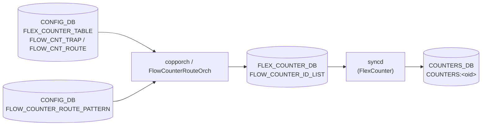

# アプリケーション フローカウンタ設定

## 概要

SONiC には 2 種類のアプリケーションレベルフローカウンタがある[^1]。

1. **Trap flow counter** (`FLOW_CNT_TRAP`) — ホスト CPU に転送されるパケットを trap グループ（`COPP_TABLE` エントリ）単位でカウントする。copporch が SAI HOSTIF trap に generic counter を紐付け、`COUNTERS_DB` に `SAI_COUNTER_STAT_PACKETS` / `SAI_COUNTER_STAT_BYTES` を格納する。
2. **Route flow counter** (`FLOW_CNT_ROUTE`) — ユーザー指定のプレフィックスパターンにマッチするルートのパケット・バイト数をカウントする。FlowCounterRouteOrch が SAI route entry に generic counter を紐付ける。

どちらも CONFIG_DB の `FLEX_COUNTER_TABLE` でポーリングの enable/disable および間隔を制御し、`FLOW_COUNTER_ROUTE_PATTERN` でルートパターンを設定する。

<!-- cdb-mermaid -->
### データフロー (自動生成)



!!! note "凡例"
    CONFIG_DB の 2 テーブルが orchagent を通じて FLEX_COUNTER_DB に per-OID エントリを書き込み、syncd が SAI generic counter API で周期収集した結果が COUNTERS_DB に格納される。
<!-- /cdb-mermaid -->

## FLEX_COUNTER_TABLE|FLOW_CNT_TRAP

### key 構造

```text
CONFIG_DB / FLEX_COUNTER_TABLE|FLOW_CNT_TRAP   (Hash)
  FLEX_COUNTER_STATUS : enable | disable
  POLL_INTERVAL       : <uint ms>
```

### フィールド一覧

| フィールド | 型 | デフォルト | 説明 |
|-----------|-----|-----------|------|
| `FLEX_COUNTER_STATUS` | `enable` \| `disable` | なし (実質 `disable`) | trap カウンタ収集の有効化。`enable` で copporch が全 COPP trap グループに generic counter を紐付ける |
| `POLL_INTERVAL` | uint (ms) | なし (コード値 10000) | syncd の SAI ポーリング間隔 |

## FLEX_COUNTER_TABLE|FLOW_CNT_ROUTE

### key 構造

```text
CONFIG_DB / FLEX_COUNTER_TABLE|FLOW_CNT_ROUTE  (Hash)
  FLEX_COUNTER_STATUS : enable | disable
  POLL_INTERVAL       : <uint ms>
```

### フィールド一覧

| フィールド | 型 | デフォルト | 説明 |
|-----------|-----|-----------|------|
| `FLEX_COUNTER_STATUS` | `enable` \| `disable` | なし (実質 `disable`) | route flow counter の有効化。SAI 能力がある場合のみ有効 |
| `POLL_INTERVAL` | uint (ms) | なし (コード値 10000) | syncd の SAI ポーリング間隔 |

## FLOW_COUNTER_ROUTE_PATTERN

### key 構造

```text
CONFIG_DB / FLOW_COUNTER_ROUTE_PATTERN|<key>   (Hash)
  max_match_count : <uint 1–50>
```

`<key>` の形式:
- デフォルト VRF の場合: `<prefix>` (例: `192.168.0.0/16`)
- 非デフォルト VRF の場合: `<vrf_name>|<prefix>` (例: `Vrf_red|10.0.0.0/8`)

### フィールド一覧

| フィールド | 型 | デフォルト | 説明 |
|-----------|-----|-----------|------|
| `max_match_count` | uint (1–50) | 30 | このパターンにマッチさせるルートの最大件数。超過分にはカウンタが割り当てられない |

<!-- defaults -->
## 暗黙デフォルト・コード由来挙動 (Phase A)

<!-- evidence:
     sonic-swss/orchagent/flex_counter/flowcounterrouteorch.cpp,
     sonic-swss/orchagent/copporch.cpp,
     sonic-swss/orchagent/flexcounterorch.cpp,
     sonic-swss/orchagent/flexcounterorch.h,
     sonic-utilities/counterpoll/main.py,
     sonic-utilities/config/flow_counters.py,
     sonic-utilities/flow_counter_util/route.py -->

### ポーリング間隔のコード由来デフォルト

`FLEX_COUNTER_TABLE` に `POLL_INTERVAL` が設定されていない場合、orchagent が FlexCounterManager コンストラクタ引数に渡したハードコード値が使われる[^2]。

| グループ | 定数名 | 値 | ソースファイル |
|---------|--------|-----|-------------|
| `FLOW_CNT_TRAP` (HOSTIF_TRAP_FLOW_COUNTER) | `HOSTIF_TRAP_COUNTER_POLLING_INTERVAL_MS` | **10000 ms** | `copporch.cpp:189` |
| `FLOW_CNT_ROUTE` (ROUTE_FLOW_COUNTER) | `ROUTE_FLOW_COUNTER_POLLING_INTERVAL_MS` | **10000 ms** | `flowcounterrouteorch.cpp:26` |

!!! note "counterpoll show との対応"
    `counterpoll show` は `POLL_INTERVAL` フィールドが CONFIG_DB に存在しない場合 `"default (10000)"` を表示する（`counterpoll/main.py:19` の `DEFLT_10_SEC`）。orchagent のハードコード値と一致する。

### `FLEX_COUNTER_STATUS` 未設定時の挙動

起動直後、両グループとも `disable` 状態として扱われる。

| グループ | コード由来デフォルト |
|---------|-------------------|
| `FLOW_CNT_TRAP` | `m_hostif_trap_counter_enabled = false` (`flexcounterorch.h`)。copporch はカウンタを登録しない |
| `FLOW_CNT_ROUTE` | `m_route_flow_counter_enabled = false` (`flexcounterorch.h:75`)。FlowCounterRouteOrch は `generateRouteFlowStats()` を実行しない |

### Route flow counter の SAI 能力チェック

`FLOW_CNT_ROUTE` を `enable` にしても SAI が `SAI_ROUTE_ENTRY_ATTR_COUNTER_ID` の `set_implemented` を返さない場合はカウンタが生成されない[^3]。

```cpp
// flow_counter_handler.cpp:54-61
sai_status_t status = sai_query_attribute_capability(
    gSwitchId, SAI_OBJECT_TYPE_ROUTE_ENTRY,
    SAI_ROUTE_ENTRY_ATTR_COUNTER_ID, &capability);
if (status != SAI_STATUS_SUCCESS) { return false; }
return capability.set_implemented;
```

`mRouteFlowCounterSupported = false` の場合、`FLEX_COUNTER_TABLE|FLOW_CNT_ROUTE` の `enable` を受信しても flexcounterorch が `generateRouteFlowStats()` を呼ばない（`flexcounterorch.cpp:324` の条件分岐）。

### `max_match_count` のデフォルト値 (30)

`FLOW_COUNTER_ROUTE_PATTERN` に `max_match_count` を設定しない場合、orchagent 側の `ROUTE_PATTERN_DEFAULT_MAX_MATCH_COUNT = 30`（`flowcounterrouteorch.cpp:25`）が採用される。CLI の `config flowcnt-route pattern add --max` オプションのデフォルトも 30（`config/flow_counters.py:29`）で一致している。

### IPv4 / IPv6 各 1 パターン制限（CLI のみ）

CLI `config flowcnt-route pattern add` は IPv4 パターンと IPv6 パターンをそれぞれ同時に 1 件のみ許容し、既存パターンを置換するよう設計されている（`config/flow_counters.py:138-156`）。ただしこれは CLI レベルのガードであり、CONFIG_DB を直接編集すれば複数パターンを登録できる。orchagent はすべてのパターンを処理する。

### FLEX_COUNTER_UPD_INTERVAL = 1 秒の非同期タイマー

FlowCounterRouteOrch は COUNTERS_DB への書き込みを 1 秒間隔のタイマーで非同期に処理する（`flowcounterrouteorch.cpp:21, 43-46`）。`FLOW_CNT_ROUTE` を `enable` にしてからカウンタが COUNTERS_DB に実際に現れるまで最大数秒のラグが生じる。

### SAI generic counter の stat リスト（ハードコード）

両グループとも FlowCounterHandler の `generic_counter_stat_ids[]` に定義された 2 stat のみを収集する[^4]。ユーザーが変更する手段はない。

| SAI stat | 意味 |
|---------|------|
| `SAI_COUNTER_STAT_PACKETS` | パケット数 |
| `SAI_COUNTER_STAT_BYTES` | バイト数 |

<!-- /defaults -->

<!-- pubsub -->
## 通信メカニズム (Phase G)

`FLEX_COUNTER_TABLE` と `FLOW_COUNTER_ROUTE_PATTERN` はどちらも orchagent 内の単一スレッドで消費される。両者は **Redis keyspace notification (PSUBSCRIBE)** で変更検出される `SubscriberStateTable` 経路を取る。`ConsumerStateTable` / `NotificationConsumer` は CONFIG_DB 側では**使用しない**。

### Producer/Consumer ペア

| 区間 | 方式 | チャンネル / パターン |
|------|------|--------------------|
| CLI/CONFIG_DB → orchagent | `SubscriberStateTable` | `__keyspace@{config_db_id}__:FLEX_COUNTER_TABLE\|*` |
| CLI/CONFIG_DB → orchagent | `SubscriberStateTable` | `__keyspace@{config_db_id}__:FLOW_COUNTER_ROUTE_PATTERN\|*` |
| FlowCounterRouteOrch 内部 | `SelectableTimer` (1 秒) | `FLEX_COUNTER_UPD_TIMER` (`flowcounterrouteorch.cpp:21,43-46`) |
| orchagent → syncd | `ProducerTable` または SAI redis switch attr 直書き | FLEX_COUNTER_DB `FLEX_COUNTER_TABLE` / `FLEX_COUNTER_GROUP_TABLE` |
| syncd → COUNTERS_DB | SAI generic counter polling | `COUNTERS:<oid>` (HSET) |

### SubscriberStateTable の動作

`FlexCounterOrch` (`orchdaemon.cpp:620-628`) と `FlowCounterRouteOrch` (`orchdaemon.cpp:251-254`) はいずれも `Orch(db, tableNames)` 基底経由で `Orch::addConsumer()` を呼ぶ (`orch.cpp:1186-1196`)。db が CONFIG_DB のため `SubscriberStateTable` ブランチが選択される:

```
PSUBSCRIBE __keyspace@{config_db_id}__:FLEX_COUNTER_TABLE|*
PSUBSCRIBE __keyspace@{config_db_id}__:FLOW_COUNTER_ROUTE_PATTERN|*
PSUBSCRIBE __keyspace@{config_db_id}__:DEVICE_METADATA|*    ← FlexCounterOrch が同居
```

keyspace 通知のペイロードは Redis 操作名 (`hset` / `del` / 等) のみ。フィールド値は通知後に `HGETALL` で別途取得する (`subscriberstatetable.cpp:95-`)。

### 起動時スナップショット

`SubscriberStateTable` ctor は PSUBSCRIBE 直後に `getKeys()` + `get()` で既存全エントリを `SET_COMMAND` として buffer に充填する (`subscriberstatetable.cpp:26-44`)。orchagent 起動時に存在する `FLEX_COUNTER_TABLE|FLOW_CNT_TRAP` / `FLOW_CNT_ROUTE` および `FLOW_COUNTER_ROUTE_PATTERN|*` はすべて遅延なく `doTask` に流れる。

### Warm restart 遅延

`FlexCounterOrch` のみ warm start 時に 60 秒の `FLEX_COUNTER_DELAY_SEC` タイマー (`flexcounterorch.cpp:44, 127-133`) が走り、満了まで `doTask(Consumer&)` は即 return する (`flexcounterorch.cpp:156-159`)。コールド起動時は遅延なし。`FlowCounterRouteOrch` には同等の遅延は無い。

### doTask の処理フロー

`FlexCounterOrch::doTask()` (`flexcounterorch.cpp:145-410`) は `flexCounterGroupMap` (`flexcounterorch.cpp:65-99`) で CONFIG_DB key を内部 group 定数に変換する:

| CONFIG_DB key | 内部 group constant |
|---|---|
| `FLOW_CNT_TRAP` | `HOSTIF_TRAP_COUNTER_FLEX_COUNTER_GROUP` |
| `FLOW_CNT_ROUTE` | `ROUTE_FLOW_COUNTER_FLEX_COUNTER_GROUP` |

`FLEX_COUNTER_STATUS = enable` 受信時の副作用呼び出し:

- `FLOW_CNT_TRAP` → `gCoppOrch->generateHostIfTrapCounterIdList()` (`flexcounterorch.cpp:311-323`)
- `FLOW_CNT_ROUTE` → `gFlowCounterRouteOrch->generateRouteFlowStats()` (SAI 能力ガード付, `flexcounterorch.cpp:324-336`)

どちらの key も最後に `setFlexCounterGroupOperation()` / `setFlexCounterGroupPollInterval()` が呼ばれ、FLEX_COUNTER_DB に enable/disable と polling interval が反映される (`saihelper.cpp:868-885, 918-962`)。

`FlowCounterRouteOrch::doTask(Consumer&)` (`flowcounterrouteorch.cpp:55-97`) は `addRoutePattern(key, max_match_count)` / `removeRoutePattern(key)` を呼ぶのみ。実際の SAI route entry → flex counter 紐付けは `FLEX_COUNTER_UPD_TIMER` (1 秒) 経由で `doTask(SelectableTimer&)` (`flowcounterrouteorch.cpp:99-`) が行う。

### 書き込み元 (Publisher 側)

CONFIG_DB への書き込みは **直接 Redis HSET** (`ConfigDBConnector`) で行われ、`ProducerStateTable` は通らない:

| 書き込み元 | 経路 |
|---|---|
| `counterpoll flowcnt-trap {enable\|disable\|interval}` | `counterpoll/main.py` → ConfigDBConnector.mod_entry → HSET |
| `counterpoll flowcnt-route {enable\|disable\|interval}` | 同上 |
| `config flowcnt-route pattern add/del` | `config/flow_counters.py` → ConfigDBConnector.set_entry → HSET/DEL |
| `config_db.json` 初期投入 | sonic-cfggen による一括 HSET |

HSET 完了で Redis が自動的に `__keyspace@{config_db_id}__:<key>` channel に `hset` メッセージを publish し、orchagent の SubscriberStateTable が拾う。

### データフロー図

```
admin (counterpoll flowcnt-trap enable)
  ↓ ConfigDBConnector.mod_entry()
CONFIG_DB[FLEX_COUNTER_TABLE|FLOW_CNT_TRAP]
  ↓ HSET + keyspace PUBLISH
  ↓   channel: __keyspace@{config_db_id}__:FLEX_COUNTER_TABLE|FLOW_CNT_TRAP
  ↓   message: "hset"
orchagent select() ループ
  ↓ SubscriberStateTable.pops() → HGETALL "FLEX_COUNTER_TABLE|FLOW_CNT_TRAP"
FlexCounterOrch::doTask(Consumer&)
  ├─ flexCounterGroupMap → HOSTIF_TRAP_COUNTER_FLEX_COUNTER_GROUP
  ├─ gCoppOrch->generateHostIfTrapCounterIdList()
  │    └─ bindTrapCounter() → SAI create_counter + set_hostif_trap_attribute
  └─ setFlexCounterGroupOperation(group, "enable")
       └─ ProducerTable(gFlexCounterGroupTable).set() / SAI redis switch attr
FLEX_COUNTER_DB[FLEX_COUNTER_GROUP_TABLE|<group>]
  ↓ syncd FlexCounter スレッドが受信
syncd (FlexCounter)
  ↓ 10 秒間隔で SAI get_counter_stats(SAI_COUNTER_STAT_PACKETS/BYTES)
COUNTERS_DB[COUNTERS:<oid>]   ← HSET

NotificationConsumer: なし
ConsumerStateTable (CONFIG_DB 側): なし
TTL / expire: なし
```

派生フロー (FLOW_COUNTER_ROUTE_PATTERN):

```
CONFIG_DB[FLOW_COUNTER_ROUTE_PATTERN|<prefix> or <vrf>|<prefix>]
  ↓ keyspace notification
FlowCounterRouteOrch::doTask(Consumer&) → addRoutePattern(key, max_match_count)
  ↓
mPendingAddToFlexCntr キュー
  ↓ FLEX_COUNTER_UPD_TIMER (1 秒間隔, SelectableTimer)
FlowCounterRouteOrch::doTask(SelectableTimer&)
  ↓ VID→RID 解決 (VIDTORID HGET)
  ↓ mRouteFlowCounterMgr.setCounterIdList()
FLEX_COUNTER_DB → syncd → COUNTERS_DB
```

### 詳細ノート

詳細な購読パターン・PSUBSCRIBE チャンネル・競合解析は中間メモを参照: `meta/_intermediate/cdb-flow/app-counter-pubsub.md`。

<!-- /pubsub -->

<!-- ref-triangle:start -->

## 関連リファレンス

- [CONFIG_DB FLEX_COUNTER_TABLE](flex-counter-table.md) — グループレベルの enable/disable・polling interval 設定
- [CONFIG_DB debug-counter](debug-counter.md)
- CLI: `counterpoll flowcnt-trap`, `counterpoll flowcnt-route`, `show flowcnt-trap stats`, `show flowcnt-route stats`

<!-- ref-triangle:end -->

## 引用元

[^1]: Flow counter 設計: `SONiC/doc/flow_counters/flow_counters.md`. <https://github.com/sonic-net/SONiC/blob/master/doc/flow_counters/flow_counters.md>
[^2]: Trap/Route カウンタポーリング間隔ハードコード: `sonic-swss/orchagent/copporch.cpp:189`, `sonic-swss/orchagent/flex_counter/flowcounterrouteorch.cpp:26`. <https://github.com/sonic-net/sonic-swss/blob/master/orchagent/copporch.cpp#L189>
[^3]: SAI route counter 能力チェック: `sonic-swss/orchagent/flex_counter/flow_counter_handler.cpp:51-62`. <https://github.com/sonic-net/sonic-swss/blob/master/orchagent/flex_counter/flow_counter_handler.cpp#L51>
[^4]: Generic counter stat リスト: `sonic-swss/orchagent/flex_counter/flow_counter_handler.cpp:10-13`. <https://github.com/sonic-net/sonic-swss/blob/master/orchagent/flex_counter/flow_counter_handler.cpp#L10>
