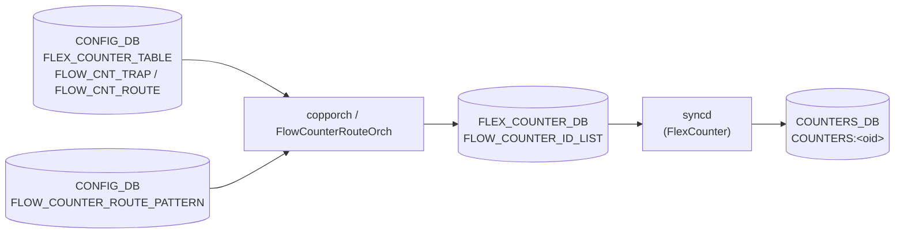

# アプリケーション フローカウンタ設定

## 概要

SONiC には 2 種類のアプリケーションレベルフローカウンタがある[^1]。

1. **Trap flow counter** (`FLOW_CNT_TRAP`) — ホスト CPU に転送されるパケットを trap グループ（`COPP_TABLE` エントリ）単位でカウントする。copporch が SAI HOSTIF trap に generic counter を紐付け、`COUNTERS_DB` に `SAI_COUNTER_STAT_PACKETS` / `SAI_COUNTER_STAT_BYTES` を格納する。
2. **Route flow counter** (`FLOW_CNT_ROUTE`) — ユーザー指定のプレフィックスパターンにマッチするルートのパケット・バイト数をカウントする。FlowCounterRouteOrch が SAI route entry に generic counter を紐付ける。

どちらも CONFIG_DB の `FLEX_COUNTER_TABLE` でポーリングの enable/disable および間隔を制御し、`FLOW_COUNTER_ROUTE_PATTERN` でルートパターンを設定する。

<!-- cdb-mermaid -->
### データフロー (自動生成)



!!! note "凡例"
    CONFIG_DB の 2 テーブルが orchagent を通じて FLEX_COUNTER_DB に per-OID エントリを書き込み、syncd が SAI generic counter API で周期収集した結果が COUNTERS_DB に格納される。
<!-- /cdb-mermaid -->

## FLEX_COUNTER_TABLE|FLOW_CNT_TRAP

### key 構造

```text
CONFIG_DB / FLEX_COUNTER_TABLE|FLOW_CNT_TRAP   (Hash)
  FLEX_COUNTER_STATUS : enable | disable
  POLL_INTERVAL       : <uint ms>
```

### フィールド一覧

| フィールド | 型 | デフォルト | 説明 |
|-----------|-----|-----------|------|
| `FLEX_COUNTER_STATUS` | `enable` \| `disable` | なし (実質 `disable`) | trap カウンタ収集の有効化。`enable` で copporch が全 COPP trap グループに generic counter を紐付ける |
| `POLL_INTERVAL` | uint (ms) | なし (コード値 10000) | syncd の SAI ポーリング間隔 |

## FLEX_COUNTER_TABLE|FLOW_CNT_ROUTE

### key 構造

```text
CONFIG_DB / FLEX_COUNTER_TABLE|FLOW_CNT_ROUTE  (Hash)
  FLEX_COUNTER_STATUS : enable | disable
  POLL_INTERVAL       : <uint ms>
```

### フィールド一覧

| フィールド | 型 | デフォルト | 説明 |
|-----------|-----|-----------|------|
| `FLEX_COUNTER_STATUS` | `enable` \| `disable` | なし (実質 `disable`) | route flow counter の有効化。SAI 能力がある場合のみ有効 |
| `POLL_INTERVAL` | uint (ms) | なし (コード値 10000) | syncd の SAI ポーリング間隔 |

## FLOW_COUNTER_ROUTE_PATTERN

### key 構造

```text
CONFIG_DB / FLOW_COUNTER_ROUTE_PATTERN|<key>   (Hash)
  max_match_count : <uint 1–50>
```

`<key>` の形式:
- デフォルト VRF の場合: `<prefix>` (例: `192.168.0.0/16`)
- 非デフォルト VRF の場合: `<vrf_name>|<prefix>` (例: `Vrf_red|10.0.0.0/8`)

### フィールド一覧

| フィールド | 型 | デフォルト | 説明 |
|-----------|-----|-----------|------|
| `max_match_count` | uint (1–50) | 30 | このパターンにマッチさせるルートの最大件数。超過分にはカウンタが割り当てられない |

<!-- defaults -->
## 暗黙デフォルト・コード由来挙動 (Phase A)

<!-- evidence:
     sonic-swss/orchagent/flex_counter/flowcounterrouteorch.cpp,
     sonic-swss/orchagent/copporch.cpp,
     sonic-swss/orchagent/flexcounterorch.cpp,
     sonic-swss/orchagent/flexcounterorch.h,
     sonic-utilities/counterpoll/main.py,
     sonic-utilities/config/flow_counters.py,
     sonic-utilities/flow_counter_util/route.py -->

### ポーリング間隔のコード由来デフォルト

`FLEX_COUNTER_TABLE` に `POLL_INTERVAL` が設定されていない場合、orchagent が FlexCounterManager コンストラクタ引数に渡したハードコード値が使われる[^2]。

| グループ | 定数名 | 値 | ソースファイル |
|---------|--------|-----|-------------|
| `FLOW_CNT_TRAP` (HOSTIF_TRAP_FLOW_COUNTER) | `HOSTIF_TRAP_COUNTER_POLLING_INTERVAL_MS` | **10000 ms** | `copporch.cpp:189` |
| `FLOW_CNT_ROUTE` (ROUTE_FLOW_COUNTER) | `ROUTE_FLOW_COUNTER_POLLING_INTERVAL_MS` | **10000 ms** | `flowcounterrouteorch.cpp:26` |

!!! note "counterpoll show との対応"
    `counterpoll show` は `POLL_INTERVAL` フィールドが CONFIG_DB に存在しない場合 `"default (10000)"` を表示する（`counterpoll/main.py:19` の `DEFLT_10_SEC`）。orchagent のハードコード値と一致する。

### `FLEX_COUNTER_STATUS` 未設定時の挙動

起動直後、両グループとも `disable` 状態として扱われる。

| グループ | コード由来デフォルト |
|---------|-------------------|
| `FLOW_CNT_TRAP` | `m_hostif_trap_counter_enabled = false` (`flexcounterorch.h`)。copporch はカウンタを登録しない |
| `FLOW_CNT_ROUTE` | `m_route_flow_counter_enabled = false` (`flexcounterorch.h:75`)。FlowCounterRouteOrch は `generateRouteFlowStats()` を実行しない |

### Route flow counter の SAI 能力チェック

`FLOW_CNT_ROUTE` を `enable` にしても SAI が `SAI_ROUTE_ENTRY_ATTR_COUNTER_ID` の `set_implemented` を返さない場合はカウンタが生成されない[^3]。

```cpp
// flow_counter_handler.cpp:54-61
sai_status_t status = sai_query_attribute_capability(
    gSwitchId, SAI_OBJECT_TYPE_ROUTE_ENTRY,
    SAI_ROUTE_ENTRY_ATTR_COUNTER_ID, &capability);
if (status != SAI_STATUS_SUCCESS) { return false; }
return capability.set_implemented;
```

`mRouteFlowCounterSupported = false` の場合、`FLEX_COUNTER_TABLE|FLOW_CNT_ROUTE` の `enable` を受信しても flexcounterorch が `generateRouteFlowStats()` を呼ばない（`flexcounterorch.cpp:324` の条件分岐）。

### `max_match_count` のデフォルト値 (30)

`FLOW_COUNTER_ROUTE_PATTERN` に `max_match_count` を設定しない場合、orchagent 側の `ROUTE_PATTERN_DEFAULT_MAX_MATCH_COUNT = 30`（`flowcounterrouteorch.cpp:25`）が採用される。CLI の `config flowcnt-route pattern add --max` オプションのデフォルトも 30（`config/flow_counters.py:29`）で一致している。

### IPv4 / IPv6 各 1 パターン制限（CLI のみ）

CLI `config flowcnt-route pattern add` は IPv4 パターンと IPv6 パターンをそれぞれ同時に 1 件のみ許容し、既存パターンを置換するよう設計されている（`config/flow_counters.py:138-156`）。ただしこれは CLI レベルのガードであり、CONFIG_DB を直接編集すれば複数パターンを登録できる。orchagent はすべてのパターンを処理する。

### FLEX_COUNTER_UPD_INTERVAL = 1 秒の非同期タイマー

FlowCounterRouteOrch は COUNTERS_DB への書き込みを 1 秒間隔のタイマーで非同期に処理する（`flowcounterrouteorch.cpp:21, 43-46`）。`FLOW_CNT_ROUTE` を `enable` にしてからカウンタが COUNTERS_DB に実際に現れるまで最大数秒のラグが生じる。

### SAI generic counter の stat リスト（ハードコード）

両グループとも FlowCounterHandler の `generic_counter_stat_ids[]` に定義された 2 stat のみを収集する[^4]。ユーザーが変更する手段はない。

| SAI stat | 意味 |
|---------|------|
| `SAI_COUNTER_STAT_PACKETS` | パケット数 |
| `SAI_COUNTER_STAT_BYTES` | バイト数 |

<!-- /defaults -->

<!-- constants -->
## ハードコード定数 (Phase E)

<!-- evidence:
     sonic-swss/orchagent/flexcounterorch.cpp,
     sonic-swss/orchagent/flex_counter/flex_counter_manager.cpp,
     sonic-swss/orchagent/flex_counter/flow_counter_handler.cpp,
     sonic-swss/orchagent/flex_counter/flowcounterrouteorch.cpp,
     sonic-swss/orchagent/copporch.cpp -->

`FLEX_COUNTER_TABLE|FLOW_CNT_TRAP` / `FLEX_COUNTER_TABLE|FLOW_CNT_ROUTE` / `FLOW_COUNTER_ROUTE_PATTERN` 周辺で実装に直書きされた定数群。CONFIG_DB / YANG / 環境変数からは変更できず、変更にはソースビルドが必要。

### CONFIG_DB key / capability 文字列

| 定数 | 値 | 用途 | ソース |
|------|----|------|--------|
| `FLOW_CNT_TRAP_KEY` | `"FLOW_CNT_TRAP"` | `FLEX_COUNTER_TABLE` の trap 用 key | `flexcounterorch.cpp:58` |
| `FLOW_CNT_ROUTE_KEY` | `"FLOW_CNT_ROUTE"` | `FLEX_COUNTER_TABLE` の route 用 key | `flexcounterorch.cpp:59` |
| `FLOW_COUNTER_ROUTE_KEY` | `"route"` | `STATE_DB FLOW_COUNTER_CAPABILITY_TABLE` のキー | `flowcounterrouteorch.cpp:22` |
| `FLOW_COUNTER_SUPPORT_FIELD` | `"support"` | capability テーブルの値フィールド名 | `flowcounterrouteorch.cpp:23` |
| `ROUTE_PATTERN_MAX_MATCH_COUNT_FIELD` | `"max_match_count"` | `FLOW_COUNTER_ROUTE_PATTERN` のフィールド名 | `flowcounterrouteorch.cpp:24` |
| `FLEX_COUNTER_STATUS_FIELD` | `"FLEX_COUNTER_STATUS"` | enable/disable フィールド名 | swss-common `schema.h` |
| `POLL_INTERVAL_FIELD` | `"POLL_INTERVAL"` | ポーリング間隔フィールド名 | swss-common `schema.h` |

### ポーリング間隔のデフォルト (10 秒)

| 定数 | 値 | 用途 | ソース |
|------|----|------|--------|
| `HOSTIF_TRAP_COUNTER_POLLING_INTERVAL_MS` | `10000` | `FLOW_CNT_TRAP` の `POLL_INTERVAL` 未設定時の値 | `copporch.cpp:189` |
| `ROUTE_FLOW_COUNTER_POLLING_INTERVAL_MS` | `10000` | `FLOW_CNT_ROUTE` の `POLL_INTERVAL` 未設定時の値 | `flowcounterrouteorch.cpp:26` |

### 非同期タイマー定数 (1 秒)

| 定数 | 値 | 用途 | ソース |
|------|----|------|--------|
| `FLEX_COUNTER_UPD_INTERVAL` | `1` (秒) | `FlowCounterRouteOrch` 内 pending route 再 bind 周期 | `flowcounterrouteorch.cpp:21,43` |
| `"FLEX_COUNTER_UPD_TIMER"` | (タイマー名) | `ExecutableTimer` の identifier 文字列 | `flowcounterrouteorch.cpp:45` |

### パターンマッチ既定値

| 定数 | 値 | 用途 | ソース |
|------|----|------|--------|
| `ROUTE_PATTERN_DEFAULT_MAX_MATCH_COUNT` | `30` | `max_match_count` 未指定 / `0` 指定時の silent fallback 値 | `flowcounterrouteorch.cpp:25,73,84` |

### Warm restart 遅延

| 定数 | 値 | 用途 | ソース |
|------|----|------|--------|
| `FLEX_COUNTER_DELAY_SEC` | `60` | warm boot 後、`FlexCounterOrch::doTask` を no-op に保つ秒数 | `flexcounterorch.cpp:44,127` |

### 内部 group 名 (`flexCounterGroupMap`)

CONFIG_DB key から FLEX_COUNTER_DB 上の group 名へのマッピングは静的マップで固定。

| CONFIG_DB key | 内部 group constant | ソース |
|---|---|---|
| `FLOW_CNT_TRAP` | `HOSTIF_TRAP_COUNTER_FLEX_COUNTER_GROUP` | `flexcounterorch.cpp:87` |
| `FLOW_CNT_ROUTE` | `ROUTE_FLOW_COUNTER_FLEX_COUNTER_GROUP` | `flexcounterorch.cpp:88` |

### SAI generic counter stat リスト (固定 2 種)

| stat | 意味 | ソース |
|------|------|--------|
| `SAI_COUNTER_STAT_PACKETS` | パケット数 | `flow_counter_handler.cpp:12` |
| `SAI_COUNTER_STAT_BYTES` | バイト数 | `flow_counter_handler.cpp:13` |

`generic_counter_stat_ids[]` (`flow_counter_handler.cpp:10-13`) で `std::vector<sai_counter_stat_t>` として定義。trap / route 両グループ共通でユーザは増減不可。

### StatsMode 文字列マッピング

| StatsMode enum | 文字列 | ソース |
|---|---|---|
| `StatsMode::READ` | `"STATS_MODE_READ"` | `flex_counter_manager.cpp:27` |
| `StatsMode::READ_AND_CLEAR` | `"STATS_MODE_READ_AND_CLEAR"` | `flex_counter_manager.cpp:28` |

`FLOW_CNT_TRAP` / `FLOW_CNT_ROUTE` 両グループとも `StatsMode::READ` 固定 (`copporch.cpp:198`, `flowcounterrouteorch.cpp:35`)。CONFIG_DB からの変更手段なし。

!!! note "ユーザ可変項目との対比"
    `FLEX_COUNTER_TABLE|FLOW_CNT_TRAP|FLOW_CNT_ROUTE` でユーザが変更できるのは `FLEX_COUNTER_STATUS` と `POLL_INTERVAL` のみ。stats_mode・stat ID リスト・group 名・warm-up 遅延・1 秒タイマー周期・capability キー文字列はすべてビルド時固定。

詳細根拠は `meta/_intermediate/cdb-flow/app-counter-constants.md` を参照。

<!-- /constants -->

<!-- pubsub -->
## 通信メカニズム (Phase G)

`FLEX_COUNTER_TABLE` と `FLOW_COUNTER_ROUTE_PATTERN` はどちらも orchagent 内の単一スレッドで消費される。両者は **Redis keyspace notification (PSUBSCRIBE)** で変更検出される `SubscriberStateTable` 経路を取る。`ConsumerStateTable` / `NotificationConsumer` は CONFIG_DB 側では**使用しない**。

### Producer/Consumer ペア

| 区間 | 方式 | チャンネル / パターン |
|------|------|--------------------|
| CLI/CONFIG_DB → orchagent | `SubscriberStateTable` | `__keyspace@{config_db_id}__:FLEX_COUNTER_TABLE\|*` |
| CLI/CONFIG_DB → orchagent | `SubscriberStateTable` | `__keyspace@{config_db_id}__:FLOW_COUNTER_ROUTE_PATTERN\|*` |
| FlowCounterRouteOrch 内部 | `SelectableTimer` (1 秒) | `FLEX_COUNTER_UPD_TIMER` (`flowcounterrouteorch.cpp:21,43-46`) |
| orchagent → syncd | `ProducerTable` または SAI redis switch attr 直書き | FLEX_COUNTER_DB `FLEX_COUNTER_TABLE` / `FLEX_COUNTER_GROUP_TABLE` |
| syncd → COUNTERS_DB | SAI generic counter polling | `COUNTERS:<oid>` (HSET) |

### SubscriberStateTable の動作

`FlexCounterOrch` (`orchdaemon.cpp:620-628`) と `FlowCounterRouteOrch` (`orchdaemon.cpp:251-254`) はいずれも `Orch(db, tableNames)` 基底経由で `Orch::addConsumer()` を呼ぶ (`orch.cpp:1186-1196`)。db が CONFIG_DB のため `SubscriberStateTable` ブランチが選択される:

```
PSUBSCRIBE __keyspace@{config_db_id}__:FLEX_COUNTER_TABLE|*
PSUBSCRIBE __keyspace@{config_db_id}__:FLOW_COUNTER_ROUTE_PATTERN|*
PSUBSCRIBE __keyspace@{config_db_id}__:DEVICE_METADATA|*    ← FlexCounterOrch が同居
```

keyspace 通知のペイロードは Redis 操作名 (`hset` / `del` / 等) のみ。フィールド値は通知後に `HGETALL` で別途取得する (`subscriberstatetable.cpp:95-`)。

### 起動時スナップショット

`SubscriberStateTable` ctor は PSUBSCRIBE 直後に `getKeys()` + `get()` で既存全エントリを `SET_COMMAND` として buffer に充填する (`subscriberstatetable.cpp:26-44`)。orchagent 起動時に存在する `FLEX_COUNTER_TABLE|FLOW_CNT_TRAP` / `FLOW_CNT_ROUTE` および `FLOW_COUNTER_ROUTE_PATTERN|*` はすべて遅延なく `doTask` に流れる。

### Warm restart 遅延

`FlexCounterOrch` のみ warm start 時に 60 秒の `FLEX_COUNTER_DELAY_SEC` タイマー (`flexcounterorch.cpp:44, 127-133`) が走り、満了まで `doTask(Consumer&)` は即 return する (`flexcounterorch.cpp:156-159`)。コールド起動時は遅延なし。`FlowCounterRouteOrch` には同等の遅延は無い。

### doTask の処理フロー

`FlexCounterOrch::doTask()` (`flexcounterorch.cpp:145-410`) は `flexCounterGroupMap` (`flexcounterorch.cpp:65-99`) で CONFIG_DB key を内部 group 定数に変換する:

| CONFIG_DB key | 内部 group constant |
|---|---|
| `FLOW_CNT_TRAP` | `HOSTIF_TRAP_COUNTER_FLEX_COUNTER_GROUP` |
| `FLOW_CNT_ROUTE` | `ROUTE_FLOW_COUNTER_FLEX_COUNTER_GROUP` |

`FLEX_COUNTER_STATUS = enable` 受信時の副作用呼び出し:

- `FLOW_CNT_TRAP` → `gCoppOrch->generateHostIfTrapCounterIdList()` (`flexcounterorch.cpp:311-323`)
- `FLOW_CNT_ROUTE` → `gFlowCounterRouteOrch->generateRouteFlowStats()` (SAI 能力ガード付, `flexcounterorch.cpp:324-336`)

どちらの key も最後に `setFlexCounterGroupOperation()` / `setFlexCounterGroupPollInterval()` が呼ばれ、FLEX_COUNTER_DB に enable/disable と polling interval が反映される (`saihelper.cpp:868-885, 918-962`)。

`FlowCounterRouteOrch::doTask(Consumer&)` (`flowcounterrouteorch.cpp:55-97`) は `addRoutePattern(key, max_match_count)` / `removeRoutePattern(key)` を呼ぶのみ。実際の SAI route entry → flex counter 紐付けは `FLEX_COUNTER_UPD_TIMER` (1 秒) 経由で `doTask(SelectableTimer&)` (`flowcounterrouteorch.cpp:99-`) が行う。

### 書き込み元 (Publisher 側)

CONFIG_DB への書き込みは **直接 Redis HSET** (`ConfigDBConnector`) で行われ、`ProducerStateTable` は通らない:

| 書き込み元 | 経路 |
|---|---|
| `counterpoll flowcnt-trap {enable\|disable\|interval}` | `counterpoll/main.py` → ConfigDBConnector.mod_entry → HSET |
| `counterpoll flowcnt-route {enable\|disable\|interval}` | 同上 |
| `config flowcnt-route pattern add/del` | `config/flow_counters.py` → ConfigDBConnector.set_entry → HSET/DEL |
| `config_db.json` 初期投入 | sonic-cfggen による一括 HSET |

HSET 完了で Redis が自動的に `__keyspace@{config_db_id}__:<key>` channel に `hset` メッセージを publish し、orchagent の SubscriberStateTable が拾う。

### データフロー図

```
admin (counterpoll flowcnt-trap enable)
  ↓ ConfigDBConnector.mod_entry()
CONFIG_DB[FLEX_COUNTER_TABLE|FLOW_CNT_TRAP]
  ↓ HSET + keyspace PUBLISH
  ↓   channel: __keyspace@{config_db_id}__:FLEX_COUNTER_TABLE|FLOW_CNT_TRAP
  ↓   message: "hset"
orchagent select() ループ
  ↓ SubscriberStateTable.pops() → HGETALL "FLEX_COUNTER_TABLE|FLOW_CNT_TRAP"
FlexCounterOrch::doTask(Consumer&)
  ├─ flexCounterGroupMap → HOSTIF_TRAP_COUNTER_FLEX_COUNTER_GROUP
  ├─ gCoppOrch->generateHostIfTrapCounterIdList()
  │    └─ bindTrapCounter() → SAI create_counter + set_hostif_trap_attribute
  └─ setFlexCounterGroupOperation(group, "enable")
       └─ ProducerTable(gFlexCounterGroupTable).set() / SAI redis switch attr
FLEX_COUNTER_DB[FLEX_COUNTER_GROUP_TABLE|<group>]
  ↓ syncd FlexCounter スレッドが受信
syncd (FlexCounter)
  ↓ 10 秒間隔で SAI get_counter_stats(SAI_COUNTER_STAT_PACKETS/BYTES)
COUNTERS_DB[COUNTERS:<oid>]   ← HSET

NotificationConsumer: なし
ConsumerStateTable (CONFIG_DB 側): なし
TTL / expire: なし
```

派生フロー (FLOW_COUNTER_ROUTE_PATTERN):

```
CONFIG_DB[FLOW_COUNTER_ROUTE_PATTERN|<prefix> or <vrf>|<prefix>]
  ↓ keyspace notification
FlowCounterRouteOrch::doTask(Consumer&) → addRoutePattern(key, max_match_count)
  ↓
mPendingAddToFlexCntr キュー
  ↓ FLEX_COUNTER_UPD_TIMER (1 秒間隔, SelectableTimer)
FlowCounterRouteOrch::doTask(SelectableTimer&)
  ↓ VID→RID 解決 (VIDTORID HGET)
  ↓ mRouteFlowCounterMgr.setCounterIdList()
FLEX_COUNTER_DB → syncd → COUNTERS_DB
```

### 詳細ノート

詳細な購読パターン・PSUBSCRIBE チャンネル・競合解析は中間メモを参照: `meta/_intermediate/cdb-flow/app-counter-pubsub.md`。

<!-- /pubsub -->

<!-- platform -->
## プラットフォーム / SAI Capability 差異 (Phase H)

`FLEX_COUNTER_TABLE|FLOW_CNT_TRAP` / `FLOW_CNT_ROUTE` の動作は、ハードコード定数（ポーリング間隔・stat リスト・`max_match_count` デフォルト）はプラットフォーム共通だが、**route flow counter は SAI capability ゲート**で機種差が大きく、**multi-asic / VOQ chassis** は asic 単位での独立制御になる。

### Route flow counter の SAI capability ゲート

`FlowCounterRouteOrch::initRouteFlowCounterCapability()` が起動時に `SAI_OBJECT_TYPE_ROUTE_ENTRY` の `SAI_ROUTE_ENTRY_ATTR_COUNTER_ID` を `sai_query_attribute_capability()` で問い合わせ、結果を `mRouteFlowCounterSupported` フラグと **STATE_DB `FLOW_COUNTER_CAPABILITY_TABLE|FLOW_CNT_ROUTE` の `support` フィールド** に保存する:

```cpp
// flowcounterrouteorch.cpp:166-179
mRouteFlowCounterSupported = FlowCounterHandler::queryRouteFlowCounterCapability();
swss::Table capability_table(&state_db, STATE_FLOW_COUNTER_CAPABILITY_TABLE_NAME);
fvs.emplace_back(FLOW_COUNTER_SUPPORT_FIELD, mRouteFlowCounterSupported ? "true" : "false");
capability_table.set(FLOW_COUNTER_ROUTE_KEY, fvs);
```

`mRouteFlowCounterSupported == false` の場合、`flowcounterrouteorch.cpp` 内の `generateRouteFlowStats()` / `addRoutePattern()` / `removeRoutePattern()` / `onRoutePatternChange()` ほか合計 10 箇所超の関数がすべて即 `return` する。さらに `flexcounterorch.cpp:324` の `FLOW_CNT_ROUTE` enable 受信処理も `getRouteFlowCounterSupported()` を AND 条件にしているため、**SAI 非対応 ASIC では `FLEX_COUNTER_TABLE|FLOW_CNT_ROUTE` を `enable` にしても `FLOW_COUNTER_ROUTE_PATTERN` にパターンを書き込んでもカウンタは生成されない**。

### ASIC 別の対応状況（community master）

| ASIC / SAI 実装 | `set_implemented` | 備考 |
|---|---|---|
| Broadcom XGS (modern Broadcom SAI) | true 想定 | 一般的に対応 |
| Mellanox / NVIDIA SDK (mlnx-sai) | true | community master で動作実績 |
| Broadcom DNX / Marvell / Cisco silicon-one | SDK バージョン依存 | `show flowcnt-route capabilities` で要確認 |
| **VS (libsaivs) / VPP (libsaivpp)** | **false** | SAI スタブが未実装応答 |

ユーザー側からは `show flowcnt-route capabilities`（STATE_DB の `FLOW_COUNTER_CAPABILITY_TABLE` を読む）で `support: false` を確認できる。

### Trap flow counter には capability ゲートなし

`FLOW_CNT_TRAP` 側（`flexcounterorch.cpp:311-322`）には事前 capability チェックがない。SAI が `SAI_HOSTIF_TRAP_ATTR_COUNTER_ID` の set を `SAI_STATUS_NOT_SUPPORTED` で返した場合、copporch が個別 trap ごとに warn ログを残しつつ無視するのみで、**STATE_DB `FLOW_COUNTER_CAPABILITY_TABLE` には trap 側のエントリは書かれない**。事前判定の手段がないため、`COUNTERS_DB:COUNTERS:oid:*` に値が現れるかを実機で確認する必要がある。

### multi-asic / VOQ chassis

`flexcounterorch` と `FlowCounterRouteOrch` は他 orch と同じく **swss@asicN コンテナごとに 1 インスタンス**起動する。`FLEX_COUNTER_TABLE|FLOW_CNT_TRAP` / `FLOW_CNT_ROUTE` の enable/disable・`FLOW_COUNTER_ROUTE_PATTERN` のパターン定義はすべて **asic-namespace ごとの CONFIG_DB に独立**しており、chassis-wide に同期する仕組みは存在しない（`CHASSIS_APP_DB` に flow counter 系テーブルなし）。chassis 全 asic で有効化したい場合は asic-namespace の数だけ書き込みが必要。

VOQ chassis 特例として `flexcounterorch.cpp:546` で `gMySwitchType == "voq"` のとき queue counter の生成方針が変わるが、**flow counter (`FLOW_CNT_TRAP` / `FLOW_CNT_ROUTE`) の挙動には影響しない**。`CHASSIS_APP_DB` 経由で resolve される remote system port nexthop へのルートも、local `mRoutePatternSet` のパターンにマッチすれば通常通り counter が付く。

### VS / VPP プラットフォーム

VS / VPP では `queryRouteFlowCounterCapability()` が `false` を返すため route flow counter は完全に no-op になる。trap flow counter は受理されカウンタオブジェクトが生え `COUNTERS_DB` にも値が出るが、SAI 側の dummy 実装で実トラフィックを反映しない。sonic-mgmt の `test_flow_counter_*` は VS では route 系を原則スキップする。

### プラットフォーム共通の定数

`HOSTIF_TRAP_COUNTER_POLLING_INTERVAL_MS = 10000`、`ROUTE_FLOW_COUNTER_POLLING_INTERVAL_MS = 10000`、`ROUTE_PATTERN_DEFAULT_MAX_MATCH_COUNT = 30`、`FLEX_COUNTER_UPD_INTERVAL = 1` 秒、generic counter の stat リスト (`SAI_COUNTER_STAT_PACKETS` / `_BYTES`) はベンダー側で上書きする手段がなく、全機種同一。

詳細根拠は `meta/_intermediate/cdb-flow/app-counter-platform.md` を参照。
<!-- /platform -->

<!-- failure -->
## 失敗挙動・retry 経路 (Phase D)

<!-- evidence:
     sonic-swss/orchagent/flexcounterorch.cpp,
     sonic-swss/orchagent/flex_counter/flex_counter_manager.cpp,
     sonic-swss/orchagent/flex_counter/flex_counter_stat_manager.cpp,
     sonic-swss/orchagent/flex_counter/flow_counter_handler.cpp,
     sonic-swss/orchagent/flex_counter/flowcounterrouteorch.cpp -->

`FLEX_COUNTER_TABLE|FLOW_CNT_TRAP` / `FLEX_COUNTER_TABLE|FLOW_CNT_ROUTE` / `FLOW_COUNTER_ROUTE_PATTERN` の各設定が失敗するパスをコードから抽出した。FlexCounterOrch・FlexCounterManager・FlowCounterRouteOrch・FlowCounterHandler の 4 階層がそれぞれ独立に失敗を扱う。

### FlexCounterOrch ディスパッチ層の失敗 (`flexcounterorch.cpp`)

| 失敗条件 | 動作 | ログ | evidence |
|---|---|---|---|
| `FLEX_COUNTER_TABLE` の key が `flexCounterGroupMap` に未登録 (例: `FLOW_CNT_TRAP` を `FLOW_CNT_TRAPS` と typo) | エントリ即破棄。**retry なし** | `SWSS_LOG_NOTICE ("Invalid flex counter group input, %s")` | `flexcounterorch.cpp:183-188` |
| 未対応フィールド (`FLEX_COUNTER_STATUS` / `POLL_INTERVAL` / bulk_chunk_size 系以外) | フィールド単位で無視、handler は失敗にしない | `SWSS_LOG_NOTICE ("Unsupported field %s")` | `flexcounterorch.cpp:396-399` |
| `POLL_INTERVAL` の値検証 | orchagent では検証されない (文字列のまま syncd に転送)。数値不正や 0 は syncd 側 FlexCounter で握り潰される | (orchagent ログなし) | flexcounterorch は値を素通し |
| `FLEX_COUNTER_STATUS` の値検証 | `enable` / `disable` 以外は syncd 側で `disable` 相当扱い | (orchagent ログなし) | 同上 |

### FlexCounterManager / StatManager 層の失敗

| 失敗条件 | 動作 | ログ | evidence |
|---|---|---|---|
| 既存 group の stats_mode / polling_interval / enabled と不一致で再 `createFlexCounterManager` | `NULL` 返却で manager 不発 | `SWSS_LOG_ERROR ("Stats mode mismatch ...")` 等 3 種 | `flex_counter_manager.cpp:71-88` |
| `setCounterIdList` の counter_type 未登録 | `startFlexCounterPolling` を呼ばず早期 return → **COUNTERS_DB 更新が始まらない** | `SWSS_LOG_ERROR ("Could not update flex counter id list for group '%s': counter type not found.")` | `flex_counter_manager.cpp:212-217` |
| `removeFlexCounterStat` で object_id 未登録 (二重削除 / race) | 後処理スキップ、例外なし | `SWSS_LOG_WARN ("Could not find flex stat '%s' on object '%s'")` | `flex_counter_stat_manager.cpp:66-72` |

### FlowCounterHandler の SAI 失敗 (`flow_counter_handler.cpp`)

| 失敗条件 | 動作 | ログ | evidence |
|---|---|---|---|
| `sai_counter_api->create_counter` が `SAI_STATUS_SUCCESS` 以外 | `false` 返却で route binding 中断。後段の pending list 経由で **タイマー再試行される** | `SWSS_LOG_WARN ("Failed to create generic counter")` | `flow_counter_handler.cpp:20-26` |
| `sai_counter_api->remove_counter` 失敗 | orchagent ハッシュからは削除済みなので **counter OID リーク** | `SWSS_LOG_ERROR ("Failed to remove generic counter: ...")` | `flow_counter_handler.cpp:32-38` |
| `sai_query_attribute_capability(SAI_ROUTE_ENTRY_ATTR_COUNTER_ID)` 失敗 / `set_implemented = false` | `mRouteFlowCounterSupported = false` で **以降 `FLOW_CNT_ROUTE` を `enable` にしても no-op**。`STATE_DB FLOW_COUNTER_CAPABILITY_TABLE` に `support=false` が書かれる | `SWSS_LOG_WARN ("Could not query route entry attribute ...")` + `SWSS_LOG_NOTICE ("Route flow counter is not supported on this platform")` | `flow_counter_handler.cpp:51-62`, `flowcounterrouteorch.cpp:165-178` |

### FlowCounterRouteOrch (`FLOW_COUNTER_ROUTE_PATTERN`) の失敗

| 失敗条件 | 動作 | ログ | evidence |
|---|---|---|---|
| `max_match_count = 0` を SET | **値を 30 (デフォルト) に silent fallback** | `SWSS_LOG_WARN ("Max match count for route pattern cannot be 0, set it to default value 30")` | `flowcounterrouteorch.cpp:80-86` |
| `max_match_count` が非数値文字列 (CONFIG_DB 直接編集時のみ) | `std::stoul` の `std::invalid_argument` が doTask まで伝播 (catch なし) | (例外スタックトレース) | `flowcounterrouteorch.cpp:80` |
| 既存パターンと overlap する key を SET | bind を実行せず `false` 返却。`mRoutePatternSet` には残るがカウンタは作られない | `SWSS_LOG_ERROR ("Configured route pattern %s is conflict with existing one %s")` | `flowcounterrouteorch.cpp:573-588` |
| 存在しない pattern を DEL | early return | `SWSS_LOG_ERROR ("Trying to remove route pattern %s, but it does not exist")` | `flowcounterrouteorch.cpp:266-275` |
| VRF/VNET 名が未解決 | bind 失敗で `mPendingAddToFlexCntr` に残置 → **1 秒タイマーで再試行** | `SWSS_LOG_NOTICE ("VRF/VNET name %s is not resolved")` | `flowcounterrouteorch.cpp:971-975` |
| SAI `set_route_entry_attribute(COUNTER_ID)` 失敗 | 生成済み generic counter を巻き戻して `false` 返却 | `SWSS_LOG_WARN ("Failed to bind route entry vrf=%s prefix=%s to flow counter")` | `flowcounterrouteorch.cpp:476-483` |
| SAI unbind 失敗 | warning のみで続行 | `SWSS_LOG_WARN ("Failed to unbind route entry vrf=%s prefix=%s from flow counter")` | `flowcounterrouteorch.cpp:501-506` |
| マッチするルート数が `max_match_count` を超過 | 超過分は **silent drop** (bind されない) | (超過時のログなし、limit 変更時のみ `LOG_NOTICE`) | `flowcounterrouteorch.cpp:800-820` |

### retry 経路まとめ

| retry 種別 | トリガ | 仕組み |
|---|---|---|
| VRF 未解決時の route pattern 再 bind | `mPendingAddToFlexCntr` 非空 | `mFlexCounterUpdTimer` (1 秒周期, `FLEX_COUNTER_UPD_INTERVAL`) が `doTask(SelectableTimer&)` で再試行 |
| SAI `create_counter` 失敗 | pending list に残る | 次回タイマーで再試行 |
| SAI `set_route_entry_attribute` 失敗 | pending list から除去 | route が再通知されるか pattern を再 SET しない限り **自動 retry なし** |
| `Invalid flex counter group input` (未知 group key) | エントリ erase | **retry なし** |
| `FLOW_CNT_ROUTE` の `enable` が SAI 非対応 | `mRouteFlowCounterSupported = false` | 一度 capability が false 確定すると **再 query なし** (orchagent 再起動が必要) |

!!! warning "ユーザー視点の代表的な失敗症状"
    - **`FLEX_COUNTER_STATUS=enable` を書いたのにカウンタが現れない** — group key typo (`Invalid flex counter group input`)、SAI capability 不足、`max_match_count` 超過のいずれか。
    - **`max_match_count=0` を設定したのに 30 になっている** — Phase D で挙動として確定 (silent fallback)。
    - **VRF 作成直後に route flow counter が出ない** — 1 秒タイマーの再試行待ちで数秒のラグ。
    - **`POLL_INTERVAL` に不正値を入れても何も起きない** — orchagent 段では検証されず syncd 側で握り潰される。

<!-- /failure -->

<!-- cross-refs -->
## 暗黙参照テーブル (Phase C)

`FLEX_COUNTER_TABLE|FLOW_CNT_TRAP` / `FLOW_CNT_ROUTE` および `FLOW_COUNTER_ROUTE_PATTERN` は **YANG leafref を一切持たない**（`sonic-flex_counter` / `sonic-flow_counter` どちらも leafref 未定義）。以下はすべて実装レベルの暗黙参照。

| 参照先テーブル / リソース | 参照方向 | 条件 | 参照元 evidence |
|--------------------------|---------|------|----------------|
| `COPP_TRAP` / `COPP_GROUP` (CONFIG_DB) | OID 解決 + counter 紐付け | `FLOW_CNT_TRAP` enable 受信時。CoppOrch の `m_syncdTrapIds` に登録済みの全 HOSTIF trap object に対し SAI counter を生成 | `flexcounterorch.cpp:311-323`, `copporch.cpp:530, 1513` (`generateHostIfTrapCounterIdList()`, `bindTrapCounter()`) |
| `STATE_DB COPP_TRAP_TABLE` / `COUNTERS_DB COUNTERS_TRAP_NAME_MAP` | 書き込み（trap_name ↔ counter OID 逆引き map） | trap counter 紐付け成功時 | `copporch.cpp:196, 236` |
| `APP_DB ROUTE_TABLE` / SAI route entry | 読み取り（prefix マッチング + route OID 解決） | `FLOW_CNT_ROUTE` enable かつ `FLOW_COUNTER_ROUTE_PATTERN` 登録時、または既存パターンに後追いで route 追加時 | `flowcounterrouteorch.cpp:55-97` (`doTask(Consumer&)`), `doTask(SelectableTimer&)` |
| `CONFIG_DB VRF` / `VNET` | vrf_name → vrf_id 解決 | `FLOW_COUNTER_ROUTE_PATTERN` key が `<vrf>\|<prefix>` 形式のとき。VRF 削除でパターン自動 cleanup | `flowcounterrouteorch.cpp:956-973, 409-419, 446` |
| `ASIC_DB VIDTORID` | 読み取り（VID → RID 解決） | `FLEX_COUNTER_UPD_TIMER` (1 秒) で counter を flex counter manager に登録する直前 | `flowcounterrouteorch.cpp:30-32` (`mVidToRidTable("VIDTORID")`) |
| `STATE_DB FLOW_COUNTER_CAPABILITY_TABLE` | 書き込み（自身が情報源） | FlowCounterRouteOrch 起動時 1 回。`route` key に `support: true\|false` | `flowcounterrouteorch.cpp:166-179`, `flow_counter_handler.cpp:51-62` |
| `FLEX_COUNTER_DB FLEX_COUNTER_GROUP_TABLE` / `FLEX_COUNTER_TABLE` | 書き込み（orchagent → syncd 経路） | `FLEX_COUNTER_STATUS` / `POLL_INTERVAL` 変更時、および route/trap への counter 紐付け時 | `flexcounterorch.cpp:202-214, 380-392`, `saihelper.cpp:868-885,918-962` |
| `COUNTERS_DB COUNTERS:<oid>` / `COUNTERS_ROUTE_NAME_MAP` | 書き込み（syncd → COUNTERS_DB） | ポーリング周期ごと (10 秒) / add-remove pattern 時 | `flowcounterrouteorch.cpp` (`mPrefixToRouteMap`, `mRouteFlowCounterMgr`) |
| `CONFIG_DB DEVICE_METADATA` | 読み取り（同 Orch 同居） | `FlexCounterOrch` が `DEVICE_METADATA` も購読。`FLOW_CNT_*` 処理には直接影響しない | `flexcounterorch.cpp:106, 150` |

!!! note "COPP_TRAP の事前 install が必要"
    `FLOW_CNT_TRAP` を `enable` にしてカウンタが生えるのは `CoppOrch` が既に SAI HOSTIF trap object を作成済みの trap だけ。`COPP_TRAP` / `COPP_GROUP` が未投入のままでは counter 対象が空になる。通常は orchagent 起動時に `copp_cfg.json` 等で先行投入されるため問題ないが、ランタイムで trap を追加した場合は `FLOW_CNT_TRAP` を一旦 disable→enable する必要はなく、`bindTrapCounter()` が trap install 時に同期で呼ばれる。

!!! note "VRF 修飾 prefix の遅延解決"
    `FLOW_COUNTER_ROUTE_PATTERN|<vrf>\|<prefix>` を書き込んだ時点で `<vrf>` が `CONFIG_DB VRF` に未登録だと `"VRF/VNET name <name> is not resolved"` ログが出て当該パターンは内部の未解決リストに保留される。VRF が後から登録されると自動的に再評価される。VRF を削除すると当該パターンとそれに紐付いた全 counter が remove される。

!!! warning "SAI capability ゲートで FLOW_CNT_ROUTE は ASIC 依存"
    `FLOW_CNT_ROUTE` は `mRouteFlowCounterSupported`（`STATE_DB FLOW_COUNTER_CAPABILITY_TABLE|FLOW_CNT_ROUTE/support`）が `true` の ASIC でしか動作しない。`false` の場合は `enable` も `FLOW_COUNTER_ROUTE_PATTERN` 投入も完全 no-op。事前確認は `show flowcnt-route capabilities`。

!!! note "PORT_TABLE / ACL_RULE は参照しない"
    flow counter は port 単位でも ACL 単位でもないため `PORT_TABLE` / `ACL_RULE` / `ACL_TABLE` への暗黙参照は無い。port counter は `PORT` group、ACL counter は `ACL` group が別系統で扱う。

詳細な参照経路・行番号は `meta/_intermediate/cdb-flow/app-counter-cross-refs.md` を参照。

<!-- /cross-refs -->

<!-- ref-triangle:start -->

## 関連リファレンス

- [CONFIG_DB FLEX_COUNTER_TABLE](flex-counter-table.md) — グループレベルの enable/disable・polling interval 設定
- [CONFIG_DB debug-counter](debug-counter.md)
- CLI: `counterpoll flowcnt-trap`, `counterpoll flowcnt-route`, `show flowcnt-trap stats`, `show flowcnt-route stats`

<!-- ref-triangle:end -->

## 引用元

[^1]: Flow counter 設計: `SONiC/doc/flow_counters/flow_counters.md`. <https://github.com/sonic-net/SONiC/blob/master/doc/flow_counters/flow_counters.md>
[^2]: Trap/Route カウンタポーリング間隔ハードコード: `sonic-swss/orchagent/copporch.cpp:189`, `sonic-swss/orchagent/flex_counter/flowcounterrouteorch.cpp:26`. <https://github.com/sonic-net/sonic-swss/blob/master/orchagent/copporch.cpp#L189>
[^3]: SAI route counter 能力チェック: `sonic-swss/orchagent/flex_counter/flow_counter_handler.cpp:51-62`. <https://github.com/sonic-net/sonic-swss/blob/master/orchagent/flex_counter/flow_counter_handler.cpp#L51>
[^4]: Generic counter stat リスト: `sonic-swss/orchagent/flex_counter/flow_counter_handler.cpp:10-13`. <https://github.com/sonic-net/sonic-swss/blob/master/orchagent/flex_counter/flow_counter_handler.cpp#L10>
