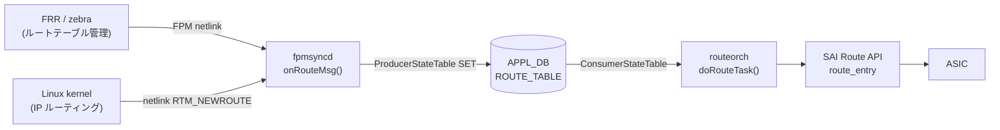

# ROUTE_TABLE (APPL_DB)

## 概要

`APPL_DB:ROUTE_TABLE` は IPv4/IPv6 **ユニキャストルート**（デフォルト VRF および VRF-aware）を保持するテーブル。
`fpmsyncd` がカーネルの netlink メッセージ（`RTM_NEWROUTE` / `RTM_DELROUTE`、アドレスファミリ AF_INET / AF_INET6）を
受信すると `RouteTableFieldValueTupleWrapper` を通じて書き込む。
`routeorch` の `doRouteTask()` がこのテーブルを購読し、SAI `route_entry` を作成・更新・削除する。

<!-- cdb-mermaid -->
### データフロー


<!-- /cdb-mermaid -->

## key 構造

```text
ROUTE_TABLE|<prefix>
ROUTE_TABLE|<vrf-name>:<prefix>
```

- `<prefix>`: CIDR 形式の IPv4 または IPv6 プレフィクス（例: `192.168.1.0/24`, `2001:db8::/32`）
- `<vrf-name>`: VRF 名（非デフォルト VRF の場合。`Vrf` プレフィクスで始まる必要がある）

管理 VRF（`mgmt`）宛のルートは fpmsyncd がスキップする。

## フィールド

| フィールド | 型 | デフォルト | 説明 |
|-----------|----|-----------|------|
| `nexthop` | string | `""` (省略) | ゲートウェイ IP アドレスのカンマ区切りリスト。ECMP 時は複数エントリをカンマで並べる |
| `ifname` | string | `""` (省略) | 出力インタフェース名のカンマ区切りリスト。`nexthop` と要素数を一致させる必要がある |
| `blackhole` | boolean string | `"false"` (省略) | `"true"` のとき `SAI_PACKET_ACTION_DROP` を設定するブラックホールルート |
| `protocol` | string | `""` (省略) | ルート起源プロトコル名。`getProtocolString()` が rtm_protocol 番号から変換（例: `"bgp"`, `"static"`, `"ospf"`）。省略時は routeorch が無視 |
| `weight` | string | `""` (省略) | ECMP ネクストホップ重みのカンマ区切りリスト。省略時は均等分散 |
| `nexthop_group` | string | `""` (省略) | NhgOrch が管理する NHG インデックスキー文字列。指定時は `nexthop`/`ifname` と排他 |
| `mpls_nh` | string | `""` (省略) | outgoing MPLS ラベル操作のカンマ区切りリスト（SRv6/MPLS ハイブリッド経路用） |
| `vni_label` | string | `""` (省略) | EVPN VXLAN の VNI 値。存在すれば overlay_nh フラグが有効になる |
| `router_mac` | string | `""` (省略) | EVPN 宛先 VTEP の MAC アドレス |
| `segment` | string | `""` (省略) | SRv6 SID-list テーブルキー（`SRV6_SID_LIST_TABLE` の key を参照） |
| `seg_src` | string | `""` (省略) | SRv6 encap の source アドレス |

<!-- defaults -->
### コード由来デフォルトの根拠

#### `blackhole` — デフォルト `"false"` (フィールド省略)

`RouteTableFieldValueTupleWrapper` の C++ 初期値として `string("false")` が宣言され、
非 ZMQ パスでは `"false"` に一致する場合は fvVector に追加しない:

```cpp
// sonic-swss fpmsyncd/routesync.h:117
string blackhole = string("false");

// fpmsyncd/routesync.cpp:1022-1024
if (blackhole != string("false")) {
    fvVector.push_back(FieldValueTuple("blackhole", blackhole.c_str()));
}
```

`RTN_BLACKHOLE` タイプのルートのみ `fvw.blackhole = "true"` にセットされる
（`routesync.cpp` L2177）。routeorch 側では `bool blackhole = false` を初期値として
フィールド不在を `false` と解釈する（`routeorch.cpp` L737, L765-L766）。

#### `protocol` — デフォルト `""` (フィールド省略)

C++ 初期値は `string()`（空文字列）。空文字列のとき APPL_DB に書かない:

```cpp
// fpmsyncd/routesync.h:116
string protocol = string();

// fpmsyncd/routesync.cpp:1019-1021
if (protocol != string()) {
    fvVector.push_back(FieldValueTuple("protocol", protocol.c_str()));
}
```

`getProtocolString()` は `libnl` の `rtnl_route_proto2str()` を呼んで rtm_protocol 番号を
文字列に変換する。未知プロトコルは数値文字列となる。

#### `nexthop` / `ifname` — デフォルト `""` (フィールド省略)

両フィールドとも C++ 初期値は `string()`。空のとき APPL_DB に書かない。
`RTN_UNICAST` かつ nexthop が空・非 blackhole の場合、routeorch はルートをスキップする:

```cpp
// orchagent/routeorch.cpp:857
if (alsv.size() == 0 && !blackhole && !srv6_nh)
```

NHG ID を持つルートでマルチ NH の場合は `nexthop_group` のみが書かれ、
`nexthop`/`ifname` は書かれない。

#### `nexthop_group` — `nexthop`/`ifname` と排他

`nexthop_group` と `nexthop`/`ifname` を同時に書くと routeorch がエラーにする:

```cpp
// orchagent/routeorch.cpp:810-814
if (!nhg_index.empty() && (!ips.empty() || !aliases.empty()))
{
    SWSS_LOG_ERROR("Route %s has both nexthop_group and ips/aliases", key.c_str());
    it = consumer.m_toSync.erase(it);
    continue;
}
```

#### `weight` — デフォルト `""` (フィールド省略、均等分散)

空文字列のとき省略。orchagent 側で weight 不在 = 均等 ECMP として扱う。
fpmsyncd の `getNextHopWt()` が weight を取得し、非空のときのみ `fvw.weight` を設定する
（`routesync.cpp` L2285-L2288）。
<!-- /defaults -->

## 制約・注意事項

- `eth0`, `docker0`, `eth1-midplane` 宛のルートは fpmsyncd がスキップし DEL を発行する
- 管理 VRF (`mgmt*`) 宛のルートは fpmsyncd がスキップする（`SWSS_LOG_INFO` のみ）
- ZMQ 有効時（`ORCH_NORTHBOND_ROUTE_ZMQ_ENABLED`）は全フィールドを常に送信（空文字列含む）
- DEL 操作の前に暗黙的な DEL が走る（warm restart 非使用時）。これにより古いフィールドが Redis から消去される
- `nexthop_group` と `nexthop`/`ifname` の同時指定はエラー

<!-- platform -->
## プラットフォーム / SAI Capability 差異 (Phase H)

APPL_DB `ROUTE_TABLE` の書込・購読フロー自体はプラットフォーム共通だが、ECMP 容量・overlay nexthop サポート・multi-asic 分離の 3 軸で差が出る。

### ECMP グループ数: Mellanox 限定の補正

`routeorch.cpp` L73-L88 で `SAI_SWITCH_ATTR_NUMBER_OF_ECMP_GROUPS` を取得後、`getenv("platform")` に `MLNX_PLATFORM_SUBSTRING == "mellanox"` (`orch.h` L42) が含まれる場合のみ `m_maxNextHopGroupCount /= DEFAULT_MAX_ECMP_GROUP_SIZE`（32）で補正する:

```cpp
// orchagent/routeorch.cpp:84-87
if (platform && strstr(platform, MLNX_PLATFORM_SUBSTRING))
{
    m_maxNextHopGroupCount /= DEFAULT_MAX_ECMP_GROUP_SIZE;
}
```

`DEFAULT_NUMBER_OF_ECMP_GROUPS = 128`（L37）、`DEFAULT_MAX_ECMP_GROUP_SIZE = 32`（L38）。Broadcom / Marvell / Cisco silicon-one / xsight 等は SAI 戻り値をそのまま採用する。算出値は `m_switchOrch->set_switch_capability()` 経由で STATE_DB `SWITCH_CAPABILITY` に公開され、`nexthop_group` の上限管理に使われる。

### ECMP メンバ数: VOQ chassis で 128 に強制

`gMySwitchType == "voq"`（`DEVICE_METADATA|localhost:switch_type`）かつ SAI が返す `SAI_SWITCH_ATTR_MAX_ECMP_MEMBER_COUNT >= 128` のとき、`SAI_SWITCH_ATTR_ECMP_MEMBER_COUNT` を 128 に書き戻す:

```cpp
// orchagent/routeorch.cpp:109-122
if (gMySwitchType == "voq" && maxEcmpGroupSize >= 128)
{
    maxEcmpGroupSize = 128;
    attr.id = SAI_SWITCH_ATTR_ECMP_MEMBER_COUNT;
    attr.value.s32 = maxEcmpGroupSize;
    status = sai_switch_api->set_switch_attribute(gSwitchId, &attr);
}
```

`switch_type=switch`（T0/T1 fixed）や `chassis-packet` line card では本書き換えは発生しない。

### SRv6 / EVPN overlay ネクストホップ: ASIC SAI capability に依存

`routeorch.cpp` L736-L795 で APPL_DB の `vni_label` / `segment` / `seg_src` から `overlay_nh` / `srv6_nh` を立てるが、SAI 側で `SAI_NEXT_HOP_TYPE_TUNNEL_ENCAP` / `SAI_NEXT_HOP_TYPE_SRV6_SIDLIST` / `SAI_OBJECT_TYPE_MY_SID_ENTRY` が未実装の ASIC は create_next_hop / create_my_sid_entry が `SAI_STATUS_NOT_SUPPORTED` を返し routeorch がエラーログを残す（L2130 / L2136）。community master では Broadcom DNX / Mellanox 一部 SKU で SRv6 が機能、VS / VPP はスタブ実装。

### CRM 集計: SAI 任意属性

`crmorch.cpp` L76-L77 で `CRM_IPV4_ROUTE` / `CRM_IPV6_ROUTE` を `SAI_SWITCH_ATTR_AVAILABLE_IPV4_ROUTE_ENTRY` / `_IPV6_ROUTE_ENTRY` に紐付ける。SAI が当該属性を実装していない ASIC（古い SDK / VS / VPP の一部）では `crm_stats_ipv4_route_available` / `ipv6_route_available` が STATE_DB `CRM` に出ない。

### multi-asic / VOQ chassis での分離

`routeorch` は `DBConnector` の namespace に従って `swss@asicN` Docker ごとに 1 インスタンス起動し、それぞれ独立した APPL_DB `ROUTE_TABLE` を購読する。fpmsyncd も `asicN` 単位で動作し、ASIC 間で `route_entry` / `next_hop_group` の名前空間は交わらない。chassis 全体の voq ルーティングは `CHASSIS_APP_DB`（redis index 12）+ `voqorch` 経由で同期されるため、`APPL_DB:ROUTE_TABLE` 自体に chassis-wide 同期機構はない。

### VS / VPP プラットフォーム

`VS_PLATFORM_SUBSTRING="vs"` / `XS_PLATFORM_SUBSTRING="xsight"` (`orch.h` L46/L49) では SAI シム（libsaivs / libsaivpp）が ECMP / SRv6 / overlay の create を SUCCESS で返すが ASIC は無く実機転送はない。Mellanox 補正は走らず、SAI 既定値（多くは 128 〜 1024）が `m_maxNextHopGroupCount` になる。CRM の available 値もダミー。

詳細根拠は `meta/_intermediate/cdb-flow/app-route-platform.md` を参照。
<!-- /platform -->

## 購読者

- `routeorch::doRouteTask()` (`sonic-swss/orchagent/routeorch.cpp`): SAI `route_entry` の作成・更新・削除

## 書き込み元

- `fpmsyncd::RouteSync::onRouteMsg()` (`sonic-swss/fpmsyncd/routesync.cpp`): カーネル netlink IPv4/IPv6 ルート受信時
- `fpmsyncd::RouteSync::onSrv6Msg()` (`sonic-swss/fpmsyncd/routesync.cpp`): SRv6 VPN ルート受信時
