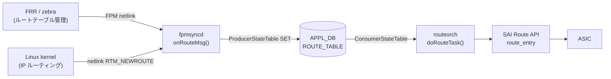

# ROUTE_TABLE (APPL_DB)

## 概要

`APPL_DB:ROUTE_TABLE` は IPv4/IPv6 **ユニキャストルート**（デフォルト [VRF](../../reference/glossary.md#term-vrf) および [VRF](../../reference/glossary.md#term-vrf)-aware）を保持するテーブル。
`fpmsyncd` がカーネルの netlink メッセージ（`RTM_NEWROUTE` / `RTM_DELROUTE`、アドレスファミリ AF_INET / AF_INET6）を
受信すると `RouteTableFieldValueTupleWrapper` を通じて書き込む。
`routeorch` の `doRouteTask()` がこのテーブルを購読し、[SAI](../../reference/glossary.md#term-sai) `route_entry` を作成・更新・削除する。

<!-- cdb-mermaid -->
### データフロー


<!-- /cdb-mermaid -->

## key 構造

```text
ROUTE_TABLE|<prefix>
ROUTE_TABLE|<vrf-name>:<prefix>
```

- `<prefix>`: CIDR 形式の IPv4 または IPv6 プレフィクス（例: `192.168.1.0/24`, `2001:db8::/32`）
- `<vrf-name>`: [VRF](../../reference/glossary.md#term-vrf) 名（非デフォルト VRF の場合。`Vrf` プレフィクスで始まる必要がある）

管理 VRF（`mgmt`）宛のルートは [fpmsyncd](../../reference/glossary.md#term-fpmsyncd) がスキップする。

## フィールド

| フィールド | 型 | デフォルト | 説明 |
|-----------|----|-----------|------|
| `nexthop` | string | `""` (省略) | ゲートウェイ IP アドレスのカンマ区切りリスト。[ECMP](../../reference/glossary.md#term-ecmp) 時は複数エントリをカンマで並べる |
| `ifname` | string | `""` (省略) | 出力インタフェース名のカンマ区切りリスト。`nexthop` と要素数を一致させる必要がある |
| `blackhole` | boolean string | `"false"` (省略) | `"true"` のとき `SAI_PACKET_ACTION_DROP` を設定するブラックホールルート |
| `protocol` | string | `""` (省略) | ルート起源プロトコル名。`getProtocolString()` が rtm_protocol 番号から変換（例: `"bgp"`, `"static"`, `"ospf"`）。省略時は routeorch が無視 |
| `weight` | string | `""` (省略) | [ECMP](../../reference/glossary.md#term-ecmp) ネクストホップ重みのカンマ区切りリスト。省略時は均等分散 |
| `nexthop_group` | string | `""` (省略) | NhgOrch が管理する NHG インデックスキー文字列。指定時は `nexthop`/`ifname` と排他 |
| `mpls_nh` | string | `""` (省略) | outgoing [MPLS](../../reference/glossary.md#term-mpls) ラベル操作のカンマ区切りリスト（[SRv6](../../reference/glossary.md#term-srv6)/[MPLS](../../reference/glossary.md#term-mpls) ハイブリッド経路用） |
| `vni_label` | string | `""` (省略) | [EVPN](../../reference/glossary.md#term-evpn) [VXLAN](../../reference/glossary.md#term-vxlan) の VNI 値。存在すれば overlay_nh フラグが有効になる |
| `router_mac` | string | `""` (省略) | [EVPN](../../reference/glossary.md#term-evpn) 宛先 [VTEP](../../reference/glossary.md#term-vtep) の MAC アドレス |
| `segment` | string | `""` (省略) | [SRv6](../../reference/glossary.md#term-srv6) SID-list テーブルキー（`SRV6_SID_LIST_TABLE` の key を参照） |
| `seg_src` | string | `""` (省略) | [SRv6](../../reference/glossary.md#term-srv6) encap の source アドレス |

<!-- defaults -->
### コード由来デフォルトの根拠

#### `blackhole` — デフォルト `"false"` (フィールド省略)

`RouteTableFieldValueTupleWrapper` の C++ 初期値として `string("false")` が宣言され、
非 ZMQ パスでは `"false"` に一致する場合は fvVector に追加しない:

```cpp
// sonic-swss fpmsyncd/routesync.h:117
string blackhole = string("false");

// fpmsyncd/routesync.cpp:1022-1024
if (blackhole != string("false")) {
    fvVector.push_back(FieldValueTuple("blackhole", blackhole.c_str()));
}
```

`RTN_BLACKHOLE` タイプのルートのみ `fvw.blackhole = "true"` にセットされる
（`routesync.cpp` L2177）。routeorch 側では `bool blackhole = false` を初期値として
フィールド不在を `false` と解釈する（`routeorch.cpp` L737, L765-L766）。

#### `protocol` — デフォルト `""` (フィールド省略)

C++ 初期値は `string()`（空文字列）。空文字列のとき [APPL_DB](../../reference/glossary.md#term-appl_db) に書かない:

```cpp
// fpmsyncd/routesync.h:116
string protocol = string();

// fpmsyncd/routesync.cpp:1019-1021
if (protocol != string()) {
    fvVector.push_back(FieldValueTuple("protocol", protocol.c_str()));
}
```

`getProtocolString()` は `libnl` の `rtnl_route_proto2str()` を呼んで rtm_protocol 番号を
文字列に変換する。未知プロトコルは数値文字列となる。

#### `nexthop` / `ifname` — デフォルト `""` (フィールド省略)

両フィールドとも C++ 初期値は `string()`。空のとき [APPL_DB](../../reference/glossary.md#term-appl_db) に書かない。
`RTN_UNICAST` かつ nexthop が空・非 blackhole の場合、routeorch はルートをスキップする:

```cpp
// orchagent/routeorch.cpp:857
if (alsv.size() == 0 && !blackhole && !srv6_nh)
```

NHG ID を持つルートでマルチ NH の場合は `nexthop_group` のみが書かれ、
`nexthop`/`ifname` は書かれない。

#### `nexthop_group` — `nexthop`/`ifname` と排他

`nexthop_group` と `nexthop`/`ifname` を同時に書くと routeorch がエラーにする:

```cpp
// orchagent/routeorch.cpp:810-814
if (!nhg_index.empty() && (!ips.empty() || !aliases.empty()))
{
    SWSS_LOG_ERROR("Route %s has both nexthop_group and ips/aliases", key.c_str());
    it = consumer.m_toSync.erase(it);
    continue;
}
```

#### `weight` — デフォルト `""` (フィールド省略、均等分散)

空文字列のとき省略。[orchagent](../../reference/glossary.md#term-orchagent) 側で weight 不在 = 均等 [ECMP](../../reference/glossary.md#term-ecmp) として扱う。
[fpmsyncd](../../reference/glossary.md#term-fpmsyncd) の `getNextHopWt()` が weight を取得し、非空のときのみ `fvw.weight` を設定する
（`routesync.cpp` L2285-L2288）。
<!-- /defaults -->

## 制約・注意事項

- `eth0`, `docker0`, `eth1-midplane` 宛のルートは [fpmsyncd](../../reference/glossary.md#term-fpmsyncd) がスキップし DEL を発行する
- 管理 VRF (`mgmt*`) 宛のルートは fpmsyncd がスキップする（`SWSS_LOG_INFO` のみ）
- ZMQ 有効時（`ORCH_NORTHBOND_ROUTE_ZMQ_ENABLED`）は全フィールドを常に送信（空文字列含む）
- DEL 操作の前に暗黙的な DEL が走る（warm restart 非使用時）。これにより古いフィールドが [Redis](../../reference/glossary.md#term-redis) から消去される
- `nexthop_group` と `nexthop`/`ifname` の同時指定はエラー

<!-- ordering -->
## 書込み順依存・タイミング依存 (Phase B)

[APPL_DB](../../reference/glossary.md#term-appl_db) `ROUTE_TABLE` の主購読者は `RouteOrch::doTask` (`routeorch.cpp:623`)。`nexthop_group` フィールド経路では `NhgOrch::doTask` (`nhgorch.cpp:37`) が先行ハンドラとして関与する。両者とも違反時は基本的に `m_toSync` 残置による polling 型 retry を使い、SRv6 PIC のみ明示的 RetryCache に park する。

### 1. PortsOrch readiness ガード（NhgOrch のみ）

```cpp
// nhgorch.cpp:41-44
if (!gPortsOrch->allPortsReady())
{
    return;
}
```

`NhgOrch::doTask` 冒頭で `allPortsReady()` が false なら**即 return** で APPL_DB `NEXTHOP_GROUP_TABLE` 処理を保留。`RouteOrch::doTask` には同等の早期 return はないが、interface/[RIF](../../reference/glossary.md#term-rif) 解決 (#5) や neighbor 解決 (#4) が事実上の関門になる。

→ 順序依存: NHG 経路では `PORT` 初期化完了が先行必須。

### 2. VRF 先行ガード（RouteOrch）

```cpp
// routeorch.cpp:706-715
if (!key.compare(0, strlen(VRF_PREFIX), VRF_PREFIX))
{
    size_t found = key.find(':');
    string vrf_name = key.substr(0, found);

    if (!m_vrfOrch->isVRFexists(vrf_name))
    {
        it++;
        continue;
    }
    vrf_id = m_vrfOrch->getVRFid(vrf_name);
    ip_prefix = IpPrefix(key.substr(found+1));
}
```

`ROUTE_TABLE|<vrf-name>:<prefix>` の VRF 名が `VrfOrch` に未登録の場合、**ログなしで `it++` 残置** → 毎ループ再試行。VrfOrch が [CONFIG_DB](../../reference/glossary.md#term-config_db) `VRF` を消化するまでポーリングが続く。

→ 順序依存: 非デフォルト VRF prefix では `VRF` 登録が `ROUTE_TABLE` set より先行必須。

### 3. NHG (NEXTHOP_GROUP_TABLE) 先行ガード

```cpp
// routeorch.cpp:1004-1015
try
{
    const NhgBase& nh_group = getNhg(nhg_index);
    nhg = nh_group.getNhgKey();
    ctx.using_temp_nhg = nh_group.isTemp();
}
catch (const std::out_of_range& e)
{
    SWSS_LOG_ERROR("Next hop group %s does not exist", nhg_index.c_str());
    ++it;
    continue;
}
```

`nexthop_group` フィールド指定時、NhgOrch の `m_syncdNextHopGroups` に該当 index が未登録なら ERROR ログ + `++it` 残置 → NhgOrch が `NEXTHOP_GROUP_TABLE` を消化するまで retry。

→ 順序依存: `nexthop_group=<idx>` 経路では NHG エントリが `ROUTE_TABLE` set より先行必須。NhgOrch 内では再帰 NHG が子 NHG の先行を要求する（`nhgorch.cpp:128-164` の `non_existent_member` 部分縮退ロジック）。

### 4. Neighbor 先行（NEIGH_TABLE）

single NH:

```cpp
// routeorch.cpp:2149-2155
SWSS_LOG_INFO("Failed to get next hop %s for %s, resolving neighbor", ...);
m_neighOrch->resolveNeighbor(nexthop);
return false;
```

ECMP:

```cpp
// routeorch.cpp:2194-2243
for(auto it = nextHops.getNextHops().begin(); ...)
{
    if(!m_neighOrch->hasNextHop(nextHop))
    {
        ...
        m_neighOrch->resolveNeighbor(nextHop);
    }
}
...
addTempRoute(ctx, nextHops);
return false;
```

NeighOrch の `m_syncdNextHops` 未登録時:

- single NH → `resolveNeighbor` ([ARP](../../reference/glossary.md#term-arp)/ND 送信) を発火し `addRoute` false → `m_toSync` 残置で完全保留
- ECMP → 各未解決 NH に `resolveNeighbor` を発火、解決済み NH のみのサブセットで `addTempRoute` を install。元 ECMP は残置（**観測上は ECMP 縮退**）

`NeighOrch` が APPL_DB `NEIGH_TABLE` 経由で当該 NH を `m_syncdNextHops` に登録した後、次サイクルで本ルートが成立する。

→ 順序依存: 各 nexthop IP の neighbor 解決が必須。直接 [ARP](../../reference/glossary.md#term-arp)/ND が発火するため通常は数 100ms 内に成立。

### 5. RIF (router interface) 先行

```cpp
// routeorch.cpp:2083-2090
next_hop_id = m_intfsOrch->getRouterIntfsId(nexthop.alias);
/* rif is not created yet */
if (next_hop_id == SAI_NULL_OBJECT_ID)
{
    SWSS_LOG_INFO("Failed to get next hop %s for %s", ...);
    return false;
}
```

interface NH (directly-connected) で IntfsOrch が [RIF](../../reference/glossary.md#term-rif) を未作成の場合、`addRoute` false → 残置。IntfsOrch が [CONFIG_DB](../../reference/glossary.md#term-config_db) `INTERFACE` / APPL_DB `INTF_TABLE` を処理し [RIF](../../reference/glossary.md#term-rif) を作成後に成立。

→ 順序依存: directly-connected ルートは `INTF_TABLE` (RIF) が先行必須。

### 6. SRv6 PIC `context_index` — 明示的 RetryCache

```cpp
// routeorch.cpp:2055-2060
if (!ctx.context_index.empty() && !m_srv6Orch->contextIdExists(ctx.context_index))
{
    SWSS_LOG_INFO("Context ID %s does not exist, move task entry to RetryCache", ctx.context_index.c_str());
    ctx.retry_cst = make_constraint(RETRY_CST_PIC, ctx.context_index);
    return false;
}

// routeorch.cpp:192
createRetryCache(APP_ROUTE_TABLE_NAME);
```

PIC `context_index` 未登録時のみ、`m_toSync` polling ではなく `RETRY_CST_PIC` 制約で **RetryCache に park**。Srv6Orch から `notifyRetry(RETRY_CST_PIC+context_index)` が届くと再 enqueue。

→ 順序依存: SRv6 PIC 経路では `PIC_CONTEXT` 投入が必須先行。RetryCache 利用は APP_ROUTE_TABLE の唯一の明示的例。

### 7. NHG 上限到達 → tempRoute サブセット install

```cpp
// routeorch.cpp:2237-2243
addTempRoute(ctx, nextHops);
/* Return false since the original route is not successfully added */
return false;
```

```cpp
// routeorch.cpp:1094-1100
if (m_nextHopGroupCount + NhgOrch::getSyncedNhgCount() >= m_maxNextHopGroupCount &&
    gRouteBulker.removing_entries_count() > 0)
{
    break;
}
```

`addNextHopGroup` が NHG 上限で false を返した場合、元 ECMP は `m_toSync` 残置のまま **単一 NH のサブセット tempRoute** を [ASIC](../../reference/glossary.md#term-asic) に install。doTask ループ中に bulker 削除待ちがあれば `break` して flush を促す（NHG 解放後の再評価）。

→ タイミング依存: NHG 上限近傍ではフル ECMP install が遅延。`m_maxNextHopGroupCount` は Mellanox 補正で削減され、上限到達確率はプラットフォーム依存（Phase H 参照）。

### 8. SAI race: `SAI_STATUS_ITEM_NOT_FOUND` on set (DualToR)

```cpp
// routeorch.cpp:2572-2581
if (status == SAI_STATUS_ITEM_NOT_FOUND)
{
    SWSS_LOG_ERROR("Failed to set route ... not found");
    m_syncdRoutes.at(vrf_id).erase(ipPrefix);
    return false;
}
```

DualToR で tunnel route が削除された直後に learned route が同一 prefix を `set_route_entry_attribute` した際に発生する race。内部 cache (`m_syncdRoutes`) を補正し次サイクルで create にフォールバック。

→ タイミング依存: DEL→SET が [SAI](../../reference/glossary.md#term-sai) で逆順反映された race の補正。

### 9. SAI race: `SAI_STATUS_ITEM_ALREADY_EXISTS` in bulker

```cpp
// routeorch.cpp:2301-2307
sai_status_t status = gRouteBulker.create_entry(...);
if (status == SAI_STATUS_ITEM_ALREADY_EXISTS)
{
    SWSS_LOG_ERROR("Failed to create route ... already exists in bulker");
    return false;
}
```

同一 doTask 反復内で同一 prefix を 2 回 create しようとした場合の防御。`m_toSync` 残置 → 次サイクルで bulker クリア後に再評価。通常運用では発生しない。

→ タイミング依存: 同一バッチ内 SET 重複の防御。

### 影響範囲のまとめ

| 順序関係 | 必須先行 | 不成立時の挙動 |
|---|---|---|
| NhgOrch 全般 | `PORT` 初期化 (`allPortsReady`) | 即 return（NHG 経路のみ） |
| 非デフォルト VRF prefix | `VRF` (VrfOrch) | ログなし `it++` 残置 |
| `nexthop_group` 指定 | NHG エントリ (NhgOrch) | ERROR + `++it` 残置 |
| directly-connected | RIF (IntfsOrch) | `addRoute` false → 残置 |
| single NH | NEIGH (NeighOrch) | `resolveNeighbor` → 残置 |
| ECMP | 全 NH の NEIGH | tempRoute サブセット install + 残置 |
| SRv6 PIC | `PIC_CONTEXT` (Srv6Orch) | RetryCache park |
| [ASIC](../../reference/glossary.md#term-asic) NHG 上限 | NHG 解放 | tempRoute install + bulker flush 促進 |
| DualToR DEL→SET race | — | `m_syncdRoutes` 補正で次サイクル create |
| bulker 同一バッチ重複 | — | ERROR + 残置で次サイクル |

`ERROR_TABLE` 等への失敗通知はなく、違反は polling か RetryCache(PIC) で吸収される。詳細根拠は `meta/_intermediate/cdb-flow/app-route-ordering.md` を参照。
<!-- /ordering -->

<!-- platform -->
## プラットフォーム / SAI Capability 差異 (Phase H)

APPL_DB `ROUTE_TABLE` の書込・購読フロー自体はプラットフォーム共通だが、ECMP 容量・overlay nexthop サポート・multi-asic 分離の 3 軸で差が出る。

### ECMP グループ数: Mellanox 限定の補正

`routeorch.cpp` L73-L88 で `SAI_SWITCH_ATTR_NUMBER_OF_ECMP_GROUPS` を取得後、`getenv("platform")` に `MLNX_PLATFORM_SUBSTRING == "mellanox"` (`orch.h` L42) が含まれる場合のみ `m_maxNextHopGroupCount /= DEFAULT_MAX_ECMP_GROUP_SIZE`（32）で補正する:

```cpp
// orchagent/routeorch.cpp:84-87
if (platform && strstr(platform, MLNX_PLATFORM_SUBSTRING))
{
    m_maxNextHopGroupCount /= DEFAULT_MAX_ECMP_GROUP_SIZE;
}
```

`DEFAULT_NUMBER_OF_ECMP_GROUPS = 128`（L37）、`DEFAULT_MAX_ECMP_GROUP_SIZE = 32`（L38）。Broadcom / Marvell / Cisco silicon-one / xsight 等は [SAI](../../reference/glossary.md#term-sai) 戻り値をそのまま採用する。算出値は `m_switchOrch->set_switch_capability()` 経由で [STATE_DB](../../reference/glossary.md#term-state_db) `SWITCH_CAPABILITY` に公開され、`nexthop_group` の上限管理に使われる。

### ECMP メンバ数: VOQ chassis で 128 に強制

`gMySwitchType == "voq"`（`DEVICE_METADATA|localhost:switch_type`）かつ SAI が返す `SAI_SWITCH_ATTR_MAX_ECMP_MEMBER_COUNT >= 128` のとき、`SAI_SWITCH_ATTR_ECMP_MEMBER_COUNT` を 128 に書き戻す:

```cpp
// orchagent/routeorch.cpp:109-122
if (gMySwitchType == "voq" && maxEcmpGroupSize >= 128)
{
    maxEcmpGroupSize = 128;
    attr.id = SAI_SWITCH_ATTR_ECMP_MEMBER_COUNT;
    attr.value.s32 = maxEcmpGroupSize;
    status = sai_switch_api->set_switch_attribute(gSwitchId, &attr);
}
```

`switch_type=switch`（T0/T1 fixed）や `chassis-packet` line card では本書き換えは発生しない。

### SRv6 / EVPN overlay ネクストホップ: ASIC SAI capability に依存

`routeorch.cpp` L736-L795 で APPL_DB の `vni_label` / `segment` / `seg_src` から `overlay_nh` / `srv6_nh` を立てるが、SAI 側で `SAI_NEXT_HOP_TYPE_TUNNEL_ENCAP` / `SAI_NEXT_HOP_TYPE_SRV6_SIDLIST` / `SAI_OBJECT_TYPE_MY_SID_ENTRY` が未実装の [ASIC](../../reference/glossary.md#term-asic) は create_next_hop / create_my_sid_entry が `SAI_STATUS_NOT_SUPPORTED` を返し routeorch がエラーログを残す（L2130 / L2136）。community master では Broadcom DNX / Mellanox 一部 SKU で SRv6 が機能、VS / VPP はスタブ実装。

### CRM 集計: SAI 任意属性

`crmorch.cpp` L76-L77 で `CRM_IPV4_ROUTE` / `CRM_IPV6_ROUTE` を `SAI_SWITCH_ATTR_AVAILABLE_IPV4_ROUTE_ENTRY` / `_IPV6_ROUTE_ENTRY` に紐付ける。SAI が当該属性を実装していない ASIC（古い SDK / VS / VPP の一部）では `crm_stats_ipv4_route_available` / `ipv6_route_available` が [STATE_DB](../../reference/glossary.md#term-state_db) `CRM` に出ない。

### multi-asic / VOQ chassis での分離

`routeorch` は `DBConnector` の namespace に従って `swss@asicN` Docker ごとに 1 インスタンス起動し、それぞれ独立した APPL_DB `ROUTE_TABLE` を購読する。fpmsyncd も `asicN` 単位で動作し、ASIC 間で `route_entry` / `next_hop_group` の名前空間は交わらない。chassis 全体の voq ルーティングは `CHASSIS_APP_DB`（redis index 12）+ `voqorch` 経由で同期されるため、`APPL_DB:ROUTE_TABLE` 自体に chassis-wide 同期機構はない。

### VS / VPP プラットフォーム

`VS_PLATFORM_SUBSTRING="vs"` / `XS_PLATFORM_SUBSTRING="xsight"` (`orch.h` L46/L49) では SAI シム（libsaivs / libsaivpp）が ECMP / SRv6 / overlay の create を SUCCESS で返すが ASIC は無く実機転送はない。Mellanox 補正は走らず、SAI 既定値（多くは 128 〜 1024）が `m_maxNextHopGroupCount` になる。[CRM](../../reference/glossary.md#term-crm) の available 値もダミー。

詳細根拠は `meta/_intermediate/cdb-flow/app-route-platform.md` を参照。
<!-- /platform -->

<!-- constants -->
## ハードコード定数 (Phase E)

`routeorch` / `CrmOrch` のソースから抽出した APPL_DB `ROUTE_TABLE` 経路に関わる主要ハードコード定数。詳細スキャン結果は `meta/_intermediate/cdb-flow/app-route-constants.md`。

### ECMP 上限デフォルト（`routeorch.cpp`）

| マクロ | 値 | 行 | 用途 |
|---|---|---|---|
| `DEFAULT_NUMBER_OF_ECMP_GROUPS` | `128` | `routeorch.cpp:37` | `SAI_SWITCH_ATTR_NUMBER_OF_ECMP_GROUPS` 取得失敗時の `m_maxNextHopGroupCount` フォールバック |
| `DEFAULT_MAX_ECMP_GROUP_SIZE` | `32` | `routeorch.cpp:38` | Mellanox 補正の除数（SAI 戻り値をこの値で割る） |

Mellanox 補正: `platform` に `MLNX_PLATFORM_SUBSTRING` を含むとき `m_maxNextHopGroupCount /= 32` （`routeorch.cpp:84-87`）。算出値は [STATE_DB](../../reference/glossary.md#term-state_db) `SWITCH_CAPABILITY` の `MAX_NEXTHOP_GROUP_COUNT` に公開される（L90）。

### VOQ chassis 強制値（マジック数 `128`）

`routeorch.cpp:109-122`:

- `gMySwitchType == "voq"` かつ `SAI_SWITCH_ATTR_MAX_ECMP_MEMBER_COUNT >= 128` の場合のみ、`SAI_SWITCH_ATTR_ECMP_MEMBER_COUNT` を `128` に強制書き戻し（`#define` ではなくインラインリテラル）。`switch_type=switch` / `chassis-packet` では発火しない。

### プラットフォーム識別子（`orch.h`）

| マクロ | 値 | 行 |
|---|---|---|
| `MLNX_PLATFORM_SUBSTRING` | `"mellanox"` | `orch.h:42` |

`getenv("platform")` の値（`DEVICE_METADATA|localhost.platform` 反映）と `strstr` で部分一致比較。routeorch.cpp 内で参照される唯一のプラットフォーム識別子。

### key プレフィクスマクロ

| マクロ | 値 | 行 | 用途 |
|---|---|---|---|
| `VRF_PREFIX` | `"Vrf"` | `nexthopkey.h:20` | `ROUTE_TABLE\|<vrf-name>:<prefix>` の VRF 部分判定（`routeorch.cpp:706, 1035`） |
| `LOOPBACK_PREFIX` | `"Loopback"` | `routeorch.h:28` | `alias == "lo" \|\| alias.startsWith("Loopback")` 特別扱い（`routeorch.cpp:905`） |

### デフォルトルート判定リテラル

STATE_DB `ROUTE_TABLE` の更新対象を以下の prefix 文字列リテラルに限定（`routeorch.cpp:126-127, 287-295`）:

| 文字列 | 用途 |
|---|---|
| `"0.0.0.0/0"` | IPv4 デフォルトルート（state 監視対象） |
| `"::/0"` | IPv6 デフォルトルート（state 監視対象） |
| `"ok"` / `"na"` | `state` フィールドの 2 値 |

これら以外のプレフィクスは STATE_DB に書かない（個別ルートの到達性は APPL_STATE_DB のみ）。

### CRM resource ↔ SAI 属性 / 文字列マップ（`crmorch.cpp`）

| マップ | 行 | 内容 |
|---|---|---|
| `crmResTypeNameMap` | L28-31 | `CRM_IPV4_ROUTE→"IPV4_ROUTE"`, `CRM_IPV6_ROUTE→"IPV6_ROUTE"` |
| `crmResSaiAvailAttrMap` | L74-77 | IPv4→`SAI_SWITCH_ATTR_AVAILABLE_IPV4_ROUTE_ENTRY`, IPv6→`..._IPV6_ROUTE_ENTRY` |
| `crmResSaiObjAttrMap` | L95-98 | IPv4/IPv6 ともに `SAI_OBJECT_TYPE_ROUTE_ENTRY` |
| `crmResAddrFamilyValMap` | L151-154 | `SAI_IP_ADDR_FAMILY_IPV4` / `_IPV6` |

### CRM threshold / counter 文字列キー

[CONFIG_DB](../../reference/glossary.md#term-config_db) `CRM` フィールド名・[COUNTERS_DB](../../reference/glossary.md#term-counters_db) `CRM:STATS` フィールド名はすべてハードコード文字列（`crmorch.cpp`）:

| 文字列 | 行 | 用途 |
|---|---|---|
| `"ipv4_route_threshold_type"` / `"ipv6_route_threshold_type"` | 163-164 | CONFIG_DB threshold 種別 |
| `"ipv4_route_low_threshold"` / `"ipv6_route_low_threshold"` | 209-210 | CONFIG_DB low 閾値 |
| `"ipv4_route_high_threshold"` / `"ipv6_route_high_threshold"` | 255-256 | CONFIG_DB high 閾値 |
| `"crm_stats_ipv4_route_available"` / `"crm_stats_ipv6_route_available"` | 308-309 | [COUNTERS_DB](../../reference/glossary.md#term-counters_db) available 値（SAI クエリ結果） |
| `"crm_stats_ipv4_route_used"` / `"crm_stats_ipv6_route_used"` | 354-355 | [COUNTERS_DB](../../reference/glossary.md#term-counters_db) used 値（routeorch L148/168/257/280 で inc/dec） |
<!-- /constants -->

<!-- side-effects -->
## 副次 DB 書込 (Phase F)

`APPL_DB:ROUTE_TABLE` の SET/DEL に伴い、主購読者 `routeorch` および同居 orch (`CrmOrch`, `FlowCounterRouteOrch`) が以下の副次 DB エントリを書き込む。SAI `route_entry` 自体は本ページのデータフロー図に示した主作用 ([ASIC_DB](../../reference/glossary.md#term-asic_db)) のため除外する。

| 副次 DB | テーブル/キー | 書込内容 | 根拠 |
|---|---|---|---|
| APPL_STATE_DB | `ROUTE_TABLE\|<key>` | SET 時 `protocol=<value>` を書き、DEL 時は空 fvs でキーを削除 (`ResponsePublisher::publish`) | `sonic-swss/orchagent/routeorch.cpp:3185-3201` `publishRouteState()`、`orch.h:382` `ResponsePublisher m_publisher{"APPL_STATE_DB"}` |
| STATE_DB | `ROUTE_TABLE\|<default-ip>` | デフォルトルート (`0.0.0.0/0`, `::/0`) の到達性状態 `state=ok` / `state=na` のみ更新 (個別プレフィクスは書かない) | `routeorch.cpp:126-127, 287-295` `m_stateDefaultRouteTb->set(ip, tuples)` |
| COUNTERS_DB | `CRM:STATS` | `crm_stats_ipv4_route_used` / `crm_stats_ipv6_route_used` を inc/dec し周期的に DB へ反映 | `routeorch.cpp:148,168,257,280,2481-2488,2532-2536,2884-2888` `gCrmOrch->incCrmResUsedCounter(CRM_IPV4_ROUTE\|CRM_IPV6_ROUTE)` → `crmorch.cpp:400-401,1067-1091` |
| COUNTERS_DB | `COUNTERS_ROUTE_NAME_MAP`, `COUNTERS_ROUTE_TO_PATTERN_MAP` | flow-counter 有効時にプレフィクス↔counter OID マップを `set`/`hdel` | `flex_counter/flowcounterrouteorch.cpp:33-34,152-157,921-922`、`routeorch.cpp:282` `onRemoveMiscRouteEntry` 連動 |
| STATE_DB (起動 1 回) | `FLOW_COUNTER_CAPABILITY_TABLE\|route` | `support` / `counter_type` を SAI ケーパビリティ問合せ結果で広告 | `flex_counter/flowcounterrouteorch.cpp:169-178` |

それ以外 ([FLEX_COUNTER_DB](../../reference/glossary.md#term-flex_counter_db), [LOGLEVEL_DB](../../reference/glossary.md#term-loglevel_db), CONFIG_DB) への書込みは検出されなかった。

> **Evidence**: `sonic-swss/orchagent/routeorch.cpp` (`publishRouteState` L3185-3201, `updateDefRouteState` L287-295, [CRM](../../reference/glossary.md#term-crm) inc/dec 各所), `orchagent/crmorch.cpp:400-401, 1067-1091`, `orchagent/flex_counter/flowcounterrouteorch.cpp:33-34, 152-178, 921-922`; 詳細スキャンと grep 結果は `meta/_intermediate/cdb-flow/app-route-side.md` を参照。
<!-- /side-effects -->

<!-- pubsub -->
## 通信メカニズム (Phase G)

APPL_DB `ROUTE_TABLE` は CONFIG_DB の `SubscriberStateTable` (keyspace 通知) ではなく、APPL_DB 系の **`ProducerStateTable` / `ConsumerStateTable`** 経路（channel = `ROUTE_TABLE_CHANNEL`）で同期される。`RouteOrch` は `ZmqOrch` を継承しており、CONFIG_DB `FEATURE` の `ORCH_NORTHBOND_ROUTE_ZMQ_ENABLED` (既定 `false`) が `true` のときのみ [Redis](../../reference/glossary.md#term-redis) を経由せず **ZMQ TCP socket** に切り替わる。応答パスは `ResponsePublisher m_publisher{"APPL_STATE_DB"}` (`orch.h:382`) を介して APPL_STATE_DB へ書き込む。

### 購読: `ZmqOrch::addConsumer` の分岐

`routeorch.cpp:40-55` の初期化リストで `RouteOrch` は `ZmqOrch(db, tableNames, zmqServer)` を呼ぶ。`zmqServer` は `orchdaemon.cpp:334-337` で:

```cpp
auto enable_route_zmq = get_feature_status(ORCH_NORTHBOND_ROUTE_ZMQ_ENABLED, false);
auto route_zmq_sever = enable_route_zmq ? m_zmqServer : nullptr;
gRouteOrch = new RouteOrch(m_applDb, route_tables, ..., route_zmq_sever);
```

として決まる。`ZmqOrch::addConsumer` (`zmqorch.cpp:61-79`) は `APPL_DB` (db 0) について以下に分岐する:

| `zmqServer` | 生成される Consumer | 通知プリミティブ |
|---|---|---|
| `nullptr` (既定 / ZMQ off) | `swss::ConsumerStateTable` (`gBatchSize`, pri=`routeorch_pri=5`) | [Redis](../../reference/glossary.md#term-redis) `ROUTE_TABLE_CHANNEL` への明示的 `PUBLISH` ([ProducerStateTable](../../reference/glossary.md#term-producerstatetable) LUA 由来) |
| 非 null (ZMQ on) | `swss::ZmqConsumerStateTable` | ZMQ PAIR socket (`tcp://127.0.0.1:8100` 既定) |

writer 側 `fpmsyncd::RouteSync` (`routesync.cpp:156`) も対称に切り替わる (`lib/orch_zmq_config.cpp:117-145` の `createProducerStateTable`)。ZMQ 有効時は `ZmqProducerStateTable` → `ZmqConsumerStateTable` の TCP ピアとなるため Redis LIST/PUBSUB を経由せず、fpmsyncd は空文字フィールドも常に送る（Phase D `<!-- defaults -->` で言及した挙動と一致）。`SubscriberStateTable` / `NotificationConsumer` はこのテーブルでは使われない。

### 応答 publish: `ResponsePublisher` (APPL_STATE_DB)

`RouteOrch` ctor (`routeorch.cpp:57-58`) で `m_publisher.setBuffered(true)` と `m_publisher.m_directDbWrite = true` を設定。`publishRouteState()` (`routeorch.cpp:3185-3201`) が:

```cpp
m_publisher.publish(APP_ROUTE_TABLE_NAME, ctx.key, fvs, status, /*replace=*/false);
```

を `routeorch.cpp:923, 1050, 1090, 2729, 2970` から呼ぶ。`ResponsePublisher::publish` (`response_publisher.cpp:96-150`):

- 内部で `response_channel = "APPL_DB_ROUTE_TABLE_RESPONSE_CHANNEL"` を構築するが、`m_enable_db_write_and_notify` のデフォルトが `false` で `RouteOrch` はこれを有効化しないため、**NotificationProducer 経由の応答 channel publish は走らない**（P4Orch 等とは異なる挙動）。
- `writeToDBInternal` (`response_publisher.cpp:172-204`) が `directDbWrite=true` の直書きパスで `APPL_STATE_DB:ROUTE_TABLE|<key>` を SET (`protocol=<value>`) または DEL する。
- `m_publisher.flush()` は bulk `doTask` 末尾 (`routeorch.cpp:1231`) で叩かれる。

| publish 引数 | RouteOrch での値 |
|---|---|
| `table` | `"ROUTE_TABLE"` (`APP_ROUTE_TABLE_NAME`) |
| `key` | `<vrf>:<prefix>` または `<prefix>` |
| `intent_attrs` | SET 時 `[("protocol", ctx.protocol)]`、DEL 時 `[]` |
| `status` | bulk 結果の `ReturnCode` (SAI 成功時 ok) |
| `replace` | `false` |

### 通信パスまとめ

| 役割 | クラス | 経路 | 根拠 |
|---|---|---|---|
| 書込 (既定) | `swss::ProducerStateTable` | Redis LUA + `PUBLISH ROUTE_TABLE_CHANNEL` | `fpmsyncd/routesync.cpp:156` |
| 書込 (ZMQ on) | `swss::ZmqProducerStateTable` | ZMQ PAIR `tcp://127.0.0.1:8100` | `lib/orch_zmq_config.cpp:117-145` |
| 購読 (既定) | `swss::ConsumerStateTable` | `SUBSCRIBE ROUTE_TABLE_CHANNEL` + SPOP/HGETALL | `zmqorch.cpp:71-73` |
| 購読 (ZMQ on) | `swss::ZmqConsumerStateTable` | ZMQ socket | `zmqorch.cpp:65-68` |
| 応答 | `ResponsePublisher` (`APPL_STATE_DB`) `directDbWrite=true` | APPL_STATE_DB 直接 HSET/DEL（応答 channel は無効化） | `orch.h:382`, `routeorch.cpp:57-58, 3185-3201`, `response_publisher.cpp:96-204` |

詳細スキャンと根拠コードは `meta/_intermediate/cdb-flow/app-route-pubsub.md` を参照。
<!-- /pubsub -->

<!-- failure -->
## 失敗挙動 (Phase D)

APPL_DB `ROUTE_TABLE` の主購読者 `routeorch::doRouteTask()` は `ConsumerStateTable` イベントを `m_toSync` に積み、各エントリを SAI route_entry に変換する。失敗時のフロー制御は **`m_toSync.erase()` (恒久スキップ) と `it++` (m_toSync 残置で次サイクル再試行) の 2 値**、および **SAI 呼び出し失敗時の `handleSaiCreateStatus`/`handleSaiSetStatus`/`handleSaiRemoveStatus` → `parseHandleSaiStatusFailure`** (`saihelper.cpp:745-762`) による分岐に集約される。`task_need_retry` なら呼び元が false を返し `m_toSync` 残置、`task_failed` なら true で恒久スキップ。

### A. `doRouteTask` 直下の早期失敗

| 失敗条件 | 結果 | retry | evidence |
|---|---|---|---|
| `nexthop_group` と `nexthop`/`ifname` 同時指定 | ERROR ログ → `m_toSync.erase` | なし | `routeorch.cpp:810-814` |
| VRF 未作成 (`!m_vrfOrch->isVRFexists`) | ログなし → `it++` | あり (VRF 作成で自動回復) | `routeorch.cpp:706-715` |
| `alsv.size()==0 && !blackhole && !srv6_nh` (ifname 空) | WARN ログ → 既存ルートがあれば `removeRoute` 実行後 erase / なければ erase | なし | `routeorch.cpp:855-882` |
| 非 L3 VNI の overlay 受信 | WARN ログ → 同上の cleanup + erase | なし | `routeorch.cpp:874, 918-920` |
| SRv6 segment / source 数不整合、router_mac / vni_label 不正 | ERROR ログ → `m_toSync.erase` | なし | `routeorch.cpp:937-989` |
| `nexthop_group` の NhgOrch 未登録 | ERROR ログ → `++it` | あり (NHG_TABLE 投入で自動回復) | `routeorch.cpp:1004-1015` |
| 不明 op | ERROR `"Unknown operation type"` → `erase` | なし | `routeorch.cpp:1109-1112` |

### B. `addRoute` / NHG 解決失敗 (retry 経由)

| 失敗条件 | 結果 | retry の契機 | evidence |
|---|---|---|---|
| interface NH の RIF 未作成 (`getRouterIntfsId == SAI_NULL_OBJECT_ID`) | INFO ログ → `addRoute` false → `m_toSync` 残置 | IntfsOrch が RIF を作成 | `routeorch.cpp:2083-2090, 2429-2436` |
| neighbor 未解決 (single NH) | INFO ログ → `m_neighOrch->resolveNeighbor(nexthop)` で [ARP](../../reference/glossary.md#term-arp)/ND 発火 → false | NeighOrch が APPL_DB `NEIGH_TABLE` 経由で `m_syncdNextHops` に登録 | `routeorch.cpp:2149-2155` |
| neighbor 未解決 (ECMP) | 全未解決 NH に `resolveNeighbor` → `addTempRoute()` で解決済み NH だけの一時ルート install → 元ルートは false | 全 NH 解決後にフルグループへ昇格 | `routeorch.cpp:2194-2243` |
| `NHFLAGS_IFDOWN` が立つ NH | INFO `"Interface down for NH X, skip"` → ECMP は当該 NH 除外、Route 全体は false | interface UP で NHFLAGS 解除 | `routeorch.cpp:2106-2109, 1532-1535, 1707-1708` |
| `next_hop_ids.size()==0` (active NH ゼロ) | INFO `"Skipping creation of nexthop group as none of nexthop are active"` → `addNextHopGroup` false → `addRoute` false | neighbor / IFDOWN 解除 | `routeorch.cpp:1548-1551` |
| **NHG 上限到達** (`m_nextHopGroupCount + NhgOrch::getSyncedNhgCount() >= m_maxNextHopGroupCount`) | DEBUG ログ → `addNextHopGroup` false → `addTempRoute` で単一 NH サブセットを install、元 ECMP は `m_toSync` 残置。bulker 内に削除待ち NHG があれば flush して空き作成 (L1094-1100) | 他ルート DEL で NHG 解放 | `routeorch.cpp:1424-1429, 1478-1483, 2237-2243` |
| SRv6 nexthop / VPN 作成失敗 (SAI NOT_SUPPORTED 含む) | ERROR `"Failed to create SRV6 vpn"` / `"Failed to create SRV6 nexthop"` → false | SRv6Orch / SAI 状態変化 | `routeorch.cpp:2099-2147, 2168-2173` |
| [EVPN](../../reference/glossary.md#term-evpn) remote [VTEP](../../reference/glossary.md#term-vtep) / Tunnel NH 作成失敗 | ERROR → false | VxlanOrch / EvpnOrch 状態 | `routeorch.cpp:2126-2138, 2200-2213` |
| PIC `context_index` 未登録 | INFO `"Context ID X does not exist, move task entry to RetryCache"` → `ctx.retry_cst = make_constraint(RETRY_CST_PIC, context_index)` で **RetryCache に park** → false | `m_srv6Orch` 経由の `notifyRetry(RETRY_CST_PIC+context_index)` で `m_toSync` 再 enqueue | `routeorch.cpp:2055-2060, 192` |

### C. SAI 失敗 → `handleSaiCreateStatus` / `handleSaiSetStatus` / `handleSaiRemoveStatus` 経由

| 失敗条件 | 結果 | evidence |
|---|---|---|
| SAI `create_next_hop_group` 失敗 | ERROR ログ → `handleSaiCreateStatus(SAI_API_NEXT_HOP_GROUP)`。`task_need_retry`→false (retry)、`task_failed`→true (`addNextHopGroup` 失敗扱い→`addTempRoute`) | `routeorch.cpp:1435-1442, 1566-1574` |
| SAI `remove_next_hop_group` 失敗 | ERROR ログ → `handleSaiRemoveStatus(SAI_API_NEXT_HOP_GROUP)` | `routeorch.cpp:1456-1463, 1752-1755` |
| SAI `create_route_entry` 失敗 | ERROR ログ → 同一バッチ内で `ctx.nhg_index.empty() && nextHops.getSize()>1` のとき **newly-created NHG を `removeNextHopGroup` でロールバック** → `handleSaiCreateStatus(SAI_API_ROUTE)` | `routeorch.cpp:2511-2528` |
| SAI `set_route_entry_attribute` 失敗 (`SAI_STATUS_ITEM_NOT_FOUND`) | `m_syncdRoutes.at(vrf_id).erase(ipPrefix)` で内部 cache を補正 → false (次サイクルで「新規作成」パスへ) | `routeorch.cpp:2572-2581` |
| SAI `set_route_entry_attribute` 失敗 (その他) | ERROR ログ → `handleSaiSetStatus(SAI_API_ROUTE)` | `routeorch.cpp:2583-2589, 2657-2660, 2849-2853` |
| SAI `remove_route_entry` 失敗 | ERROR ログ → `handleSaiRemoveStatus(SAI_API_ROUTE)`。**失敗時は `gCrmOrch->decCrmResUsedCounter(CRM_IPV4_ROUTE\|CRM_IPV6_ROUTE)` を通らない** (L2882-2889 は成功時のみ) | `routeorch.cpp:2871-2879` |
| `bulker.create_entry()` が `SAI_STATUS_ITEM_ALREADY_EXISTS` を返す (同一バッチ内重複) | ERROR `"already exists in bulker"` → `addRoute` false → 上位 `it++` (残置)。次サイクル bulker クリア後再評価 | `routeorch.cpp:2301-2307` |
| NHG メンバ作成失敗 (`nhgm_id == SAI_NULL_OBJECT_ID`) | ERROR ログ → false 返却。**NHG 自体は cleanup されずに残る** (`// TODO: do we need to clean up?`) | `routeorch.cpp:1629-1635` |

`isSaiStatusResourceFull()` (`saihelper.cpp:764-770`) は `SAI_STATUS_INSUFFICIENT_RESOURCES` / `TABLE_FULL` / `NO_MEMORY` / `NV_STORAGE_FULL` を真とする。[CRM](../../reference/glossary.md#term-crm) 集計 (`CRM_IPV4_ROUTE` / `CRM_IPV6_ROUTE` の `used`) はあくまで観測値で、SAI のリソース枯渇を直接ブロックする経路ではない。ASIC ハードウェア限界は SAI が返す `TABLE_FULL` 等で初めて検出される。

### D. CRM 閾値超過の観測 (失敗ではないが関連)

`crmorch.cpp:1168-1186` (`CRM_EXCEEDED_MSG_MAX=10`, L16):

```cpp
if ((utilization >= res.highThreshold) && (cnt.exceededLogCounter < CRM_EXCEEDED_MSG_MAX))
{
    SWSS_LOG_WARN("%s THRESHOLD_EXCEEDED for %s %u%% Used count %u free count %u", ...);
    event_publish(g_events_handle, "chk_crm_threshold", &params);
    cnt.exceededLogCounter++;
}
else if ((utilization <= res.lowThreshold) && (cnt.exceededLogCounter > 0) && ...)
{
    SWSS_LOG_WARN("%s THRESHOLD_CLEAR ...");
    cnt.exceededLogCounter = 0;
}
```

`CRM_IPV4_ROUTE` / `CRM_IPV6_ROUTE` が CONFIG_DB `CRM` の `ipv4_route_high_threshold` / `ipv6_route_high_threshold` を超えると **WARN ログ + `chk_crm_threshold` イベント発火** を最大 10 回。`used/available` 計算で `available==0` のとき `Exception occurred (div by Zero)` WARN を 1 回ログする (L1145-1147)。**CRM は SAI 操作をブロックしない**: ASIC リソース枯渇は SAI 戻り値経由でしか検出されず、CRM はあくまで運用監視のための「事前警告」レイヤである。

### E. STATE_DB / APPL_STATE_DB への失敗反映

- `publishRouteState()` (L3185-3201) は **`addRoute` 成功時のみ** APPL_STATE_DB に `protocol` を書く。SAI 失敗で `addRoute` が false を返した場合、APPL_STATE_DB は更新されず、次サイクル再試行成功時にまとめて publish される
- `removeRoute` 成功時のみ APPL_STATE_DB の当該 key を空 fvs で削除
- STATE_DB `ROUTE_TABLE` (default route only) は `updateDefRouteState()` (L287-295, L2856) で `state=ok`/`na` のみ更新。**個別プレフィクスの失敗は STATE_DB には現れない**
- `ERROR_TABLE` への書き込みは routeorch / nhgorch / crmorch のいずれにも存在しない (grep 結果)

### 検出ロジック補足

- **NHG 上限到達は `addTempRoute` 経由でサブセットが install される**: ECMP の一部 NH だけで一時的にトラフィックが流れる。読み手 ([orchagent](../../reference/glossary.md#term-orchagent) ログ / `show ip route`) からは「フルセット ECMP がなぜか縮退している」状態に見える
- **PIC RetryCache は唯一の明示的 retry-cache 利用箇所** (`createRetryCache(APP_ROUTE_TABLE_NAME)`, L192)。それ以外の retry は全て `m_toSync` 残置による polling 型
- **`SAI_STATUS_ITEM_NOT_FOUND` on set は DualToR の race 補正**: tunnel route が削除された直後に learned route が同じ prefix を set しようとすると発生する。`m_syncdRoutes` cache を消して次サイクルで create にフォールバック
- **`SAI_STATUS_ITEM_ALREADY_EXISTS` in bulker は same-batch 重複の防御**: 通常運用では起きないが起きた場合 ERROR ログを残して retain。bulker は次サイクルで `flush` 後にリセット
- **CRM threshold 超過時の event publish は sonic-events 経由**: `g_events_handle` に `chk_crm_threshold` イベントを通知し、Telemetry / sonic-eventd で再公開可能

> **証跡**: `routeorch.cpp` 失敗パス 25 件 (L706-715, L810-814, L855-989, L1004-1015, L1109-1112, L1424-1483, L1532-1574, L1629-1635, L2055-2243, L2511-2589, L2657-2660, L2849-2879, L3185-3201)、`nhgorch.cpp` (L100, L142, L177, L211, L433, L784-789, L805, L940-975, L1044-1082)、`crmorch.cpp` (L16, L1145-1147, L1168-1186)、`saihelper.cpp` (L745-770)。詳細グレップは `meta/_intermediate/cdb-flow/app-route-failure.md` を参照。

<!-- /failure -->

<!-- cross-refs -->
## 暗黙参照 — `routeorch` が読み解く関連テーブル (Phase C)

`APPL_DB:ROUTE_TABLE` は [YANG](../../reference/glossary.md#term-yang) 定義を持たない (APPL_DB は [ProducerStateTable](../../reference/glossary.md#term-producerstatetable) 経由の軽量経路で CONFIG_DB ではない) ため、`leafref` での明示参照はゼロ件。代わりに `RouteOrch::doRouteTask()` / `addRoutePost()` / `addNextHopGroup()` から呼ばれる **9 系統の Orch 間参照** が実装レベルの暗黙依存となる。

### 主要 Orch / テーブル参照

| 参照先 (Orch / テーブル) | フィールド / 条件 | 参照方向 | evidence |
|---|---|---|---|
| `VRFOrch` / `VRF_TABLE` (CONFIG_DB) | key の `<vrf-name>` (非デフォルト VRF) | 存在確認 + OID 解決 + refcount | `routeorch.cpp:706-717, 2013, 2773, 2993` (`isVRFexists` / `getVRFid` / `increaseVrfRefCount`) |
| `NeighOrch` / `NEIGH_TABLE` (APPL_DB) | `nexthop` (IP next-hop) | OID 取得 + refcount + `resolveNeighbor()` トリガ | `routeorch.cpp:1499-1510, 2094-2119, 2197-2219` (`hasNextHop` / `getNextHopId` / `addNextHop`); refcount: `L1364, L1386, L1663, L1770, L1813` |
| `IntfsOrch` / `INTF_TABLE` (APPL_DB) | `ifname` / intf-only NH | RIF OID 解決 + refcount + サブネット判定 | `routeorch.cpp:968, 1045, 2083, 2429` (`getRouterIntfsAlias` / `isPrefixSubnet` / `getRouterIntfsId`); refcount: `L1362, L1384` |
| `PortsOrch` / `PORT_TABLE` (APPL_DB) | 常時 + intf-only NH の inband 判定 | `allPortsReady()` ガード + `isInbandPort` スキップ + CPU port | `routeorch.cpp:243, 609, 2074` |
| `NhgOrch` / `CbfNhgOrch` (`NEXTHOP_GROUP_TABLE` / `CLASS_BASED_NEXT_HOP_GROUP_TABLE`) | `nexthop_group` フィールド | index 解決 + 排他チェック + refcount | `routeorch.cpp:810-814, 838-839, 1006-1012, 1096, 1424, 1478, 2042-2057, 2411, 2546` (`getNhg` / `getSyncedNhgCount` / `incNhgRefCount`) |
| `FgNhgOrch` (`FG_NHG` / `FG_NHG_PREFIX`) | プレフィクスが Fine-Grained NHG 設定にマッチ | 専用 NHG 構築 (通常 NHG をバイパス) | `routeorch.cpp:529, 597, 2028-2037, 2403, 2475` (`isRouteFineGrained` / `setFgNhg` / `removeFgNhg`) |
| `Srv6Orch` (`SRV6_SID_LIST_TABLE` / `SRV6_MY_SID_TABLE`) | `segment` / `seg_src` 非空 (`srv6_nh = true`) | SRv6 nexthop OID 生成 + 集約 ID 取得 | `routeorch.cpp:1250, 2055, 2100, 2143, 2169, 2295, 2352` (`srv6Nexthops` / `getAggId` / `contextIdExists`) |
| `VxlanTunnelOrch` / remote [VTEP](../../reference/glossary.md#term-vtep) | `vni_label` 非空 (`overlay_nh = true`) かつ SRv6 でない | L3 VNI 検証 + remote VTEP 作成 + tunnel NH 生成 | `routeorch.cpp:872, 2127, 2133, 2208` (`isL3VniVlan` / `createRemoteVtep` / `addTunnelNextHop`); 削除: `L1781-1789` |
| `FlowCounterRouteOrch` | 常時 (ROUTE add/remove ごと) | 通知のみ (refcount / OID 無関係) | `routeorch.cpp:259, 282, 2708` (`onAddMiscRouteEntry` / `onRemoveMiscRouteEntry` / `handleRouteAdd`) |

### refcount / 解決の semantics

- **再試行 (`it++` パス)**: VRF 未登録、NHG index 未生成、未解決 IP NH (`resolveNeighbor()` で ARP/ND 発行)、RIF が `SAI_NULL_OBJECT_ID` のいずれかで `return false`。次回 `doRouteTask()` で再評価される。
- **`NHFLAGS_IFDOWN` スキップ**: NH が IF down フラグ立ちのとき ECMP メンバーから除外 (`routeorch.cpp:1532, 1705, 1970`)。
- **refcount 対称性**: ルート install 成功時に `increase*RefCount()`、削除時に `decrease*RefCount()` を必ず対称に呼ぶ。refcount=0 の [MPLS](../../reference/glossary.md#term-mpls) / Tunnel NH は `removeMplsNextHop` / `removeTunnelNextHop` で除去される。

### 排他関係

- `nexthop_group` と `nexthop`/`ifname` の同時指定はエラー (`routeorch.cpp:810-814` — `consumer.m_toSync.erase(it)` で完全に弾く)。
- `segment` / `seg_src` (SRv6) と `vni_label` (VxLAN overlay) は同時指定不可 (実装上 `srv6_nh` と `overlay_nh` が排他分岐)。

### 範囲外 (誤解されやすい隣接)

- `STATIC_ROUTE` (CONFIG_DB) → `bgpcfgd` の `StaticRouteMgr` または `staticrouteorch` 経由で別途 APPL_DB `ROUTE_TABLE` に書く側 (`fpmsyncd` 経由でないパス) であり、`routeorch` から見れば本テーブルの同じ key 空間に流れ込むだけで cross-table 参照ではない。詳細は `static-route.md` を参照。
- `ROUTE_TABLE` (STATE_DB) — `0.0.0.0/0` / `::/0` のデフォルトルート到達性のみが書き込まれる side-effect であり、`routeorch` の読み取り対象ではない (Phase F 参照)。

詳細スキャン手順と行番号一覧は `meta/_intermediate/cdb-flow/app-route-cross-refs.md` を参照。
<!-- /cross-refs -->

## 購読者

- `routeorch::doRouteTask()` (`sonic-swss/orchagent/routeorch.cpp`): SAI `route_entry` の作成・更新・削除

## 書き込み元

- `fpmsyncd::RouteSync::onRouteMsg()` (`sonic-swss/fpmsyncd/routesync.cpp`): カーネル netlink IPv4/IPv6 ルート受信時
- `fpmsyncd::RouteSync::onSrv6Msg()` (`sonic-swss/fpmsyncd/routesync.cpp`): SRv6 VPN ルート受信時

<!-- glossary-links-injected: e69e22195e80 -->
