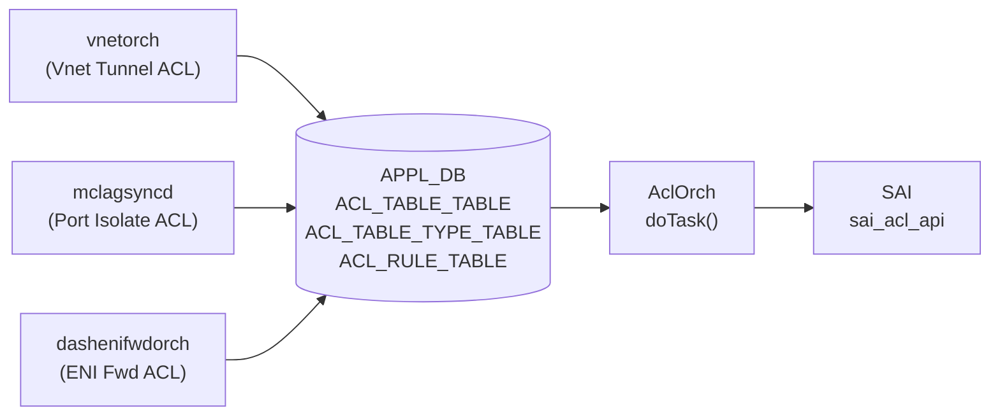

# APPL_DB ACL テーブル群

## 概要

APPL_DB には CONFIG_DB の ACL テーブル群に対応する 3 本のテーブルが存在する[^1]:

| APPL_DB テーブル名 | スキーマ定数 | 主な書き込み元 |
|---|---|---|
| `ACL_TABLE_TABLE` | `APP_ACL_TABLE_TABLE_NAME` (schema.h:94) | vnetorch, mclagsyncd, dashenifwdorch |
| `ACL_TABLE_TYPE_TABLE` | `APP_ACL_TABLE_TYPE_TABLE_NAME` (schema.h:95) | vnetorch, dashenifwdorch |
| `ACL_RULE_TABLE` | `APP_ACL_RULE_TABLE_NAME` (schema.h:96) | vnetorch, mclagsyncd |

CONFIG_DB の `ACL_TABLE` / `ACL_TABLE_TYPE` / `ACL_RULE` と同一のハンドラ (`AclOrch::doTask()`) が処理する。フィールド名・許容値は CONFIG_DB 版と同一。

!!! warning "YANG 未定義"
    3 テーブルとも `sonic-yang-models` に該当 YANG モジュールが存在しない。スキーマの正本は `sonic-swss/orchagent/aclorch.{h,cpp}` および `acltable.h`。



---

## ACL_TABLE_TABLE

### key 構造

```text
ACL_TABLE_TABLE|<table_name>
```

### フィールド一覧

| フィールド | 定数 | 型 | 説明 |
|---|---|---|---|
| `POLICY_DESC` | `ACL_TABLE_DESCRIPTION` | string | テーブルの説明文 |
| `TYPE` | `ACL_TABLE_TYPE` | string | テーブルタイプ |
| `STAGE` | `ACL_TABLE_STAGE` | enum | `INGRESS` / `EGRESS` / `PRE_INGRESS` |
| `PORTS` | `ACL_TABLE_PORTS` | カンマ区切り string | バインドポート |
| `SERVICES` | `ACL_TABLE_SERVICES` | string | (コントロールプレーン ACL 用、読み捨て) |

### 書き込み例

**vnetorch** (vnetorch.cpp:3790-3797):
```cpp
vector<FieldValueTuple> fvs2 = {
    {ACL_TABLE_DESCRIPTION, "Vnet Tunnel Termination ACL"},
    {ACL_TABLE_TYPE,        VNET_TUNNEL_TERM_ACL_TABLE_TYPE},
    {ACL_TABLE_STAGE,       STAGE_INGRESS},
    {ACL_TABLE_PORTS,       ports_str}
};
acl_table_->set(VNET_TUNNEL_TERM_ACL_TABLE, fvs2);
```

**mclagsyncd** (mclaglink.cpp:327-336):
```cpp
FieldValueTuple desc_attr("policy_desc", "Mclag egress port isolate acl");
FieldValueTuple type_attr("type", "L3");
FieldValueTuple port_attr("ports", isolate_src_port);
p_acl_table_tbl->set(acl_name, acl_attrs);
```
mclagsyncd は `stage` を未指定 → orchagent の C++ struct default `INGRESS` が適用される。

---

## ACL_TABLE_TYPE_TABLE

### key 構造

```text
ACL_TABLE_TYPE_TABLE|<type_name>
```

### フィールド一覧

| フィールド | 定数 | 型 | 説明 |
|---|---|---|---|
| `MATCHES` | `ACL_TABLE_TYPE_MATCHES` | カンマ区切り string | 許可 match キー (`SRC_IP`, `DST_IP` 等) |
| `ACTIONS` | `ACL_TABLE_TYPE_ACTIONS` | カンマ区切り string | 許可 action (`PACKET_ACTION`, `REDIRECT_ACTION` 等) |
| `BIND_POINTS` | `ACL_TABLE_TYPE_BPOINT_TYPES` | カンマ区切り string | バインド可能な種別 (`PORT`, `LAG` 等) |

### 書き込み例

**vnetorch** (vnetorch.cpp:3775-3781):
```cpp
vector<FieldValueTuple> fvs = {
    {ACL_TABLE_TYPE_MATCHES,      matches},
    {ACL_TABLE_TYPE_ACTIONS,      actions},
    {ACL_TABLE_TYPE_BPOINT_TYPES, bpoints}
};
acl_table_type_->set(VNET_TUNNEL_TERM_ACL_TABLE_TYPE, fvs);
```

---

## ACL_RULE_TABLE

### key 構造

```text
ACL_RULE_TABLE|<table_name>|<rule_name>
```

### 主要フィールド

| フィールド | 定数 | 型 | 説明 |
|---|---|---|---|
| `PRIORITY` | `RULE_PRIORITY` | uint32 | ルール優先度 (大 = 優先) |
| `PACKET_ACTION` | `ACTION_PACKET_ACTION` | enum | `FORWARD` / `DROP` / `COPY` 等 |
| `REDIRECT_ACTION` | `ACTION_REDIRECT_ACTION` | string | リダイレクト先 IP / インタフェース |
| `IP_TYPE` | `MATCH_IP_TYPE` | enum | `ANY` / `IP` / `IPV4ANY` / `IPV6ANY` 等 |
| `DST_IP` | `MATCH_DST_IP` | IPv4 prefix | 宛先 IP match |
| `TUNNEL_TERM` | `MATCH_TUNNEL_TERM` | bool string | トンネル終端フラグ |
| `OUT_PORTS` | `MATCH_OUT_PORTS` | カンマ区切り string | 出力ポート match |

### 書き込み例

**vnetorch** (vnetorch.cpp:3826-3832):
```cpp
vector<FieldValueTuple> fvs = {
    {RULE_PRIORITY,        to_string(VNET_TUNNEL_TERM_ACL_BASE_PRIORITY)},
    {MATCH_DST_IP,         vip.to_string()},
    {MATCH_TUNNEL_TERM,    "true"},
    {ACTION_REDIRECT_ACTION, nh_ip.to_string()}
};
acl_rule_table_->set(rule_name, fvs);
```

**mclagsyncd** (mclaglink.cpp:343-372):
```cpp
FieldValueTuple ip_type_attr("IP_TYPE", "ANY");
FieldValueTuple out_port_attr("OUT_PORTS", isolate_dst_port);
FieldValueTuple packet_attr("PACKET_ACTION", "DROP");
p_acl_rule_tbl->set(acl_rule_name, acl_rule_attrs);
```

---

<!-- defaults -->
## コード由来の暗黙デフォルト (Phase A)

YANG スキーマに `default` 宣言がない（全テーブル YANG 未定義）状態で、C++ struct 初期化・書き込みプロセスのハードコード値・orchagent の自動補完によって実質的に適用されるデフォルト値。

### ACL_TABLE_TABLE フィールドデフォルト

| フィールド | YANG default | コード由来デフォルト | 発生源 |
|---|---|---|---|
| `POLICY_DESC` | なし | `""` (C++ string 初期値) / 書き込み側固定文字列 | `AclTable::description` (C++ string default); vnetorch.cpp:3791, mclaglink.cpp:327, dashenifwdorch.cpp:637 |
| `TYPE` | なし | **なし** (必須) | `processAclTableType()` 空文字 reject (aclorch.cpp:5823) |
| `STAGE` | なし | **`INGRESS`** | C++ struct 初期値 `acl_stage_type_t stage = ACL_STAGE_INGRESS` (aclorch.h:543) |
| `PORTS` | なし | `[]` 空 (C++) | `portSet` C++ empty set default |
| `SERVICES` | なし | **なし** (読み捨て) | `doAclTableTask()` 内 `continue` (aclorch.cpp:5413) |

#### `STAGE` の詳細

C++ の `AclTable` クラスは `stage = ACL_STAGE_INGRESS` でメンバを初期化する (`aclorch.h:543`):

```cpp
acl_stage_type_t stage = ACL_STAGE_INGRESS;
```

`STAGE` フィールドが APPL_DB エントリに存在しない場合、`processAclTableStage()` が呼ばれず INGRESS がそのまま有効になる。mclagsyncd は `stage` フィールドを書き込まないため、この C++ default に依存している。

#### `TYPE` の詳細

`processAclTableType()` は空文字のみ reject する (`aclorch.cpp:5823`)。`TYPE` フィールド自体が省略されると `bAllAttributesOk = false` となり、エントリが erase されて SAI テーブルは作成されない。実質的に必須フィールド。

---

### ACL_TABLE_TYPE_TABLE フィールドデフォルト

| フィールド | YANG default | コード由来デフォルト | 発生源 |
|---|---|---|---|
| `MATCHES` | なし | **なし** (必須) | `doAclTableTypeTask()` (aclorch.cpp:5738) |
| `ACTIONS` | なし | **なし** (必須) | 同上 |
| `BIND_POINTS` | なし | **なし** (必須) | 同上 |

3 フィールドとも省略時はカスタム ACL table type が不完全として扱われ、対応する ACL_TABLE_TABLE エントリが pending 状態になる。

---

### ACL_RULE_TABLE フィールドデフォルト

| フィールド | YANG default | コード由来デフォルト | 発生源 |
|---|---|---|---|
| `PRIORITY` | なし | `0` (C++ 初期化) | `AclRule::m_priority(0)` (aclorch.cpp:905) |
| `PACKET_ACTION` / action 群 | なし | **なし** (書き込み側が明示指定) | 各プロセスがハードコード |
| `IP_PROTOCOL` (自動補完) | なし | `6` (TCP flags 存在時のみ) | `bHasTCPFlag && !bHasIPProtocol` 条件 (aclorch.cpp:5633) |

#### `PRIORITY` の詳細

```cpp
// aclorch.cpp:905
m_priority(0),

// aclorch.cpp:1656
if (!(value >= m_minPriority && value <= m_maxPriority))
    return false;
```

`PRIORITY` を省略すると `m_priority = 0` のまま。`m_minPriority` / `m_maxPriority` は起動時 SAI capability query で取得 (`aclorch.cpp:3695`) され、0 が range 外なら `setPriority()` が `false` を返す。ただし `validateAddPriority()` が呼ばれなければ (= フィールドが存在しなければ) チェックをスキップするため、0 priority のまま SAI に投入される可能性がある。

#### TCP_FLAGS → IP_PROTOCOL 自動補完

```cpp
// aclorch.cpp:5632-5654
if (bHasTCPFlag && !bHasIPProtocol)
{
    attr_name = (type == TABLE_TYPE_MIRRORV6 || type == TABLE_TYPE_L3V6)
                ? MATCH_NEXT_HEADER : MATCH_IP_PROTOCOL;
    attr_value = std::to_string(TCP_PROTOCOL_NUM); // = "6"
    newRule->validateAddMatch(attr_name, attr_value);
}
```

`TCP_FLAGS` match フィールドが存在し `IP_PROTOCOL` / `NEXT_HEADER` が未指定の場合、orchagent が SAI エントリ作成前に `IP_PROTOCOL = 6` (IPv4) または `NEXT_HEADER = 6` (IPv6) を自動付与する。この補完は CONFIG_DB / APPL_DB ルール両方に適用される。

---

### デフォルト一覧まとめ

| テーブル | フィールド | コード由来デフォルト | evidence |
|---|---|---|---|
| ACL_TABLE_TABLE | `POLICY_DESC` | `""` (C++) | `aclorch.cpp` AclTable::description |
| ACL_TABLE_TABLE | `TYPE` | **なし** (必須) | aclorch.cpp:5823 |
| ACL_TABLE_TABLE | `STAGE` | **`INGRESS`** | aclorch.h:543 |
| ACL_TABLE_TABLE | `PORTS` | `[]` 空 set | C++ portSet default |
| ACL_TABLE_TABLE | `SERVICES` | **なし** (読み捨て) | aclorch.cpp:5413 |
| ACL_TABLE_TYPE_TABLE | `MATCHES` / `ACTIONS` / `BIND_POINTS` | **なし** (必須) | aclorch.cpp:5738 |
| ACL_RULE_TABLE | `PRIORITY` | `0` (C++ 初期化) | aclorch.cpp:905 |
| ACL_RULE_TABLE | match / action 群 | **なし** (書き込み側明示) | — |
| ACL_RULE_TABLE | `IP_PROTOCOL` (自動) | `6` (TCP flags 時のみ) | aclorch.cpp:5633 |

<!-- /defaults -->

---

## 関連 CONFIG_DB / CLI

- CONFIG_DB: [`ACL_TABLE`](acl-table.md)、[`ACL_RULE`](acl-rule.md)
- CLI: [`show acl`](../cli/show-acl.md)、[`config acl`](../cli/config-acl.md)
- YANG: なし（YANG 未定義）

## 引用元

[^1]: テーブル名定数は `sonic-swss-common/common/schema.h` (sha `158de8d3`) L94-96 より。フィールド名は `sonic-swss/orchagent/acltable.h` (sha `43055961`) L12-20 より。書き込みロジックは `vnetorch.cpp` L3775-3837、`mclaglink.cpp` L325-373、`dashenifwdorch.cpp` L619-643、デフォルト挙動は `aclorch.h` L543、`aclorch.cpp` L905, 5413, 5633, 5823 より。
