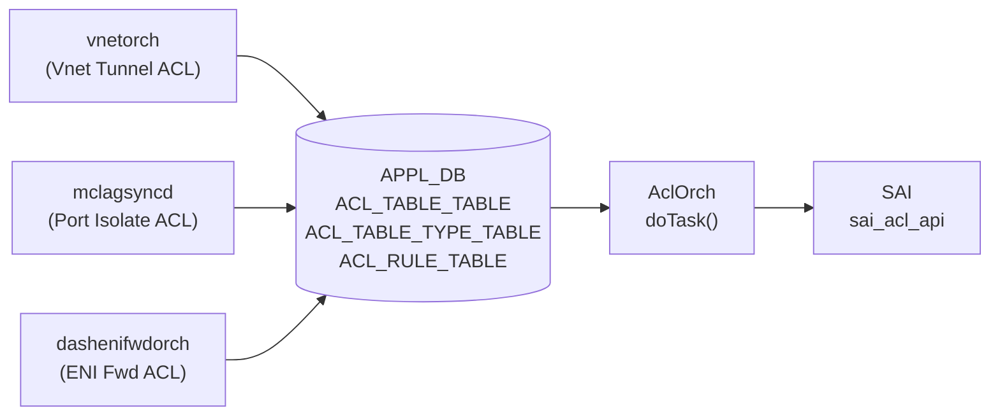

# APPL_DB ACL テーブル群

## 概要

[APPL_DB](../../reference/glossary.md#term-appl_db) には [CONFIG_DB](../../reference/glossary.md#term-config_db) の [ACL](../../reference/glossary.md#term-acl) テーブル群に対応する 3 本のテーブルが存在する[^1]:

| [APPL_DB](../../reference/glossary.md#term-appl_db) テーブル名 | スキーマ定数 | 主な書き込み元 |
|---|---|---|
| `ACL_TABLE_TABLE` | `APP_ACL_TABLE_TABLE_NAME` (schema.h:94) | vnetorch, mclagsyncd, dashenifwdorch |
| `ACL_TABLE_TYPE_TABLE` | `APP_ACL_TABLE_TYPE_TABLE_NAME` (schema.h:95) | vnetorch, dashenifwdorch |
| `ACL_RULE_TABLE` | `APP_ACL_RULE_TABLE_NAME` (schema.h:96) | vnetorch, mclagsyncd |

[CONFIG_DB](../../reference/glossary.md#term-config_db) の `ACL_TABLE` / `ACL_TABLE_TYPE` / `ACL_RULE` と同一のハンドラ (`AclOrch::doTask()`) が処理する。フィールド名・許容値は [CONFIG_DB](../../reference/glossary.md#term-config_db) 版と同一。

!!! warning "YANG 未定義"
    3 テーブルとも `sonic-yang-models` に該当 YANG モジュールが存在しない。スキーマの正本は `sonic-swss/orchagent/aclorch.{h,cpp}` および `acltable.h`。



---


## ACL_TABLE_TABLE

### key 構造

```text
ACL_TABLE_TABLE|<table_name>
```

### フィールド一覧

| フィールド | 定数 | 型 | 説明 |
|---|---|---|---|
| `POLICY_DESC` | `ACL_TABLE_DESCRIPTION` | string | テーブルの説明文 |
| `TYPE` | `ACL_TABLE_TYPE` | string | テーブルタイプ |
| `STAGE` | `ACL_TABLE_STAGE` | enum | `INGRESS` / `EGRESS` / `PRE_INGRESS` |
| `PORTS` | `ACL_TABLE_PORTS` | カンマ区切り string | バインドポート |
| `SERVICES` | `ACL_TABLE_SERVICES` | string | (コントロールプレーン [ACL](../../reference/glossary.md#term-acl) 用、読み捨て) |

### 書き込み例

**vnetorch** (vnetorch.cpp:3790-3797):
```cpp
vector<FieldValueTuple> fvs2 = {
    {ACL_TABLE_DESCRIPTION, "Vnet Tunnel Termination ACL"},
    {ACL_TABLE_TYPE,        VNET_TUNNEL_TERM_ACL_TABLE_TYPE},
    {ACL_TABLE_STAGE,       STAGE_INGRESS},
    {ACL_TABLE_PORTS,       ports_str}
};
acl_table_->set(VNET_TUNNEL_TERM_ACL_TABLE, fvs2);
```

**mclagsyncd** (mclaglink.cpp:327-336):
```cpp
FieldValueTuple desc_attr("policy_desc", "Mclag egress port isolate acl");
FieldValueTuple type_attr("type", "L3");
FieldValueTuple port_attr("ports", isolate_src_port);
p_acl_table_tbl->set(acl_name, acl_attrs);
```
mclagsyncd は `stage` を未指定 → [orchagent](../../reference/glossary.md#term-orchagent) の C++ struct default `INGRESS` が適用される。

---

## ACL_TABLE_TYPE_TABLE

### key 構造

```text
ACL_TABLE_TYPE_TABLE|<type_name>
```

### フィールド一覧

| フィールド | 定数 | 型 | 説明 |
|---|---|---|---|
| `MATCHES` | `ACL_TABLE_TYPE_MATCHES` | カンマ区切り string | 許可 match キー (`SRC_IP`, `DST_IP` 等) |
| `ACTIONS` | `ACL_TABLE_TYPE_ACTIONS` | カンマ区切り string | 許可 action (`PACKET_ACTION`, `REDIRECT_ACTION` 等) |
| `BIND_POINTS` | `ACL_TABLE_TYPE_BPOINT_TYPES` | カンマ区切り string | バインド可能な種別 (`PORT`, `LAG` 等) |

### 書き込み例

**vnetorch** (vnetorch.cpp:3775-3781):
```cpp
vector<FieldValueTuple> fvs = {
    {ACL_TABLE_TYPE_MATCHES,      matches},
    {ACL_TABLE_TYPE_ACTIONS,      actions},
    {ACL_TABLE_TYPE_BPOINT_TYPES, bpoints}
};
acl_table_type_->set(VNET_TUNNEL_TERM_ACL_TABLE_TYPE, fvs);
```

---

## ACL_RULE_TABLE

### key 構造

```text
ACL_RULE_TABLE|<table_name>|<rule_name>
```

### 主要フィールド

| フィールド | 定数 | 型 | 説明 |
|---|---|---|---|
| `PRIORITY` | `RULE_PRIORITY` | uint32 | ルール優先度 (大 = 優先) |
| `PACKET_ACTION` | `ACTION_PACKET_ACTION` | enum | `FORWARD` / `DROP` / `COPY` 等 |
| `REDIRECT_ACTION` | `ACTION_REDIRECT_ACTION` | string | リダイレクト先 IP / インタフェース |
| `IP_TYPE` | `MATCH_IP_TYPE` | enum | `ANY` / `IP` / `IPV4ANY` / `IPV6ANY` 等 |
| `DST_IP` | `MATCH_DST_IP` | IPv4 prefix | 宛先 IP match |
| `TUNNEL_TERM` | `MATCH_TUNNEL_TERM` | bool string | トンネル終端フラグ |
| `OUT_PORTS` | `MATCH_OUT_PORTS` | カンマ区切り string | 出力ポート match |

### 書き込み例

**vnetorch** (vnetorch.cpp:3826-3832):
```cpp
vector<FieldValueTuple> fvs = {
    {RULE_PRIORITY,        to_string(VNET_TUNNEL_TERM_ACL_BASE_PRIORITY)},
    {MATCH_DST_IP,         vip.to_string()},
    {MATCH_TUNNEL_TERM,    "true"},
    {ACTION_REDIRECT_ACTION, nh_ip.to_string()}
};
acl_rule_table_->set(rule_name, fvs);
```

**mclagsyncd** (mclaglink.cpp:343-372):
```cpp
FieldValueTuple ip_type_attr("IP_TYPE", "ANY");
FieldValueTuple out_port_attr("OUT_PORTS", isolate_dst_port);
FieldValueTuple packet_attr("PACKET_ACTION", "DROP");
p_acl_rule_tbl->set(acl_rule_name, acl_rule_attrs);
```

---

<!-- defaults -->
## コード由来の暗黙デフォルト (Phase A)

[YANG](../../reference/glossary.md#term-yang) スキーマに `default` 宣言がない（全テーブル [YANG](../../reference/glossary.md#term-yang) 未定義）状態で、C++ struct 初期化・書き込みプロセスのハードコード値・[orchagent](../../reference/glossary.md#term-orchagent) の自動補完によって実質的に適用されるデフォルト値。

### ACL_TABLE_TABLE フィールドデフォルト

| フィールド | [YANG](../../reference/glossary.md#term-yang) default | コード由来デフォルト | 発生源 |
|---|---|---|---|
| `POLICY_DESC` | なし | `""` (C++ string 初期値) / 書き込み側固定文字列 | `AclTable::description` (C++ string default); vnetorch.cpp:3791, mclaglink.cpp:327, dashenifwdorch.cpp:637 |
| `TYPE` | なし | **なし** (必須) | `processAclTableType()` 空文字 reject (aclorch.cpp:5823) |
| `STAGE` | なし | **`INGRESS`** | C++ struct 初期値 `acl_stage_type_t stage = ACL_STAGE_INGRESS` (aclorch.h:543) |
| `PORTS` | なし | `[]` 空 (C++) | `portSet` C++ empty set default |
| `SERVICES` | なし | **なし** (読み捨て) | `doAclTableTask()` 内 `continue` (aclorch.cpp:5413) |

#### `STAGE` の詳細

C++ の `AclTable` クラスは `stage = ACL_STAGE_INGRESS` でメンバを初期化する (`aclorch.h:543`):

```cpp
acl_stage_type_t stage = ACL_STAGE_INGRESS;
```

`STAGE` フィールドが [APPL_DB](../../reference/glossary.md#term-appl_db) エントリに存在しない場合、`processAclTableStage()` が呼ばれず INGRESS がそのまま有効になる。mclagsyncd は `stage` フィールドを書き込まないため、この C++ default に依存している。

#### `TYPE` の詳細

`processAclTableType()` は空文字のみ reject する (`aclorch.cpp:5823`)。`TYPE` フィールド自体が省略されると `bAllAttributesOk = false` となり、エントリが erase されて [SAI](../../reference/glossary.md#term-sai) テーブルは作成されない。実質的に必須フィールド。

---

### ACL_TABLE_TYPE_TABLE フィールドデフォルト

| フィールド | YANG default | コード由来デフォルト | 発生源 |
|---|---|---|---|
| `MATCHES` | なし | **なし** (必須) | `doAclTableTypeTask()` (aclorch.cpp:5738) |
| `ACTIONS` | なし | **なし** (必須) | 同上 |
| `BIND_POINTS` | なし | **なし** (必須) | 同上 |

3 フィールドとも省略時はカスタム [ACL](../../reference/glossary.md#term-acl) table type が不完全として扱われ、対応する ACL_TABLE_TABLE エントリが pending 状態になる。

---

### ACL_RULE_TABLE フィールドデフォルト

| フィールド | YANG default | コード由来デフォルト | 発生源 |
|---|---|---|---|
| `PRIORITY` | なし | `0` (C++ 初期化) | `AclRule::m_priority(0)` (aclorch.cpp:905) |
| `PACKET_ACTION` / action 群 | なし | **なし** (書き込み側が明示指定) | 各プロセスがハードコード |
| `IP_PROTOCOL` (自動補完) | なし | `6` (TCP flags 存在時のみ) | `bHasTCPFlag && !bHasIPProtocol` 条件 (aclorch.cpp:5633) |

#### `PRIORITY` の詳細

```cpp
// aclorch.cpp:905
m_priority(0),

// aclorch.cpp:1656
if (!(value >= m_minPriority && value <= m_maxPriority))
    return false;
```

`PRIORITY` を省略すると `m_priority = 0` のまま。`m_minPriority` / `m_maxPriority` は起動時 [SAI](../../reference/glossary.md#term-sai) capability query で取得 (`aclorch.cpp:3695`) され、0 が range 外なら `setPriority()` が `false` を返す。ただし `validateAddPriority()` が呼ばれなければ (= フィールドが存在しなければ) チェックをスキップするため、0 priority のまま [SAI](../../reference/glossary.md#term-sai) に投入される可能性がある。

#### TCP_FLAGS → IP_PROTOCOL 自動補完

```cpp
// aclorch.cpp:5632-5654
if (bHasTCPFlag && !bHasIPProtocol)
{
    attr_name = (type == TABLE_TYPE_MIRRORV6 || type == TABLE_TYPE_L3V6)
                ? MATCH_NEXT_HEADER : MATCH_IP_PROTOCOL;
    attr_value = std::to_string(TCP_PROTOCOL_NUM); // = "6"
    newRule->validateAddMatch(attr_name, attr_value);
}
```

`TCP_FLAGS` match フィールドが存在し `IP_PROTOCOL` / `NEXT_HEADER` が未指定の場合、[orchagent](../../reference/glossary.md#term-orchagent) が SAI エントリ作成前に `IP_PROTOCOL = 6` (IPv4) または `NEXT_HEADER = 6` (IPv6) を自動付与する。この補完は CONFIG_DB / APPL_DB ルール両方に適用される。

---

### デフォルト一覧まとめ

| テーブル | フィールド | コード由来デフォルト | evidence |
|---|---|---|---|
| ACL_TABLE_TABLE | `POLICY_DESC` | `""` (C++) | `aclorch.cpp` AclTable::description |
| ACL_TABLE_TABLE | `TYPE` | **なし** (必須) | aclorch.cpp:5823 |
| ACL_TABLE_TABLE | `STAGE` | **`INGRESS`** | aclorch.h:543 |
| ACL_TABLE_TABLE | `PORTS` | `[]` 空 set | C++ portSet default |
| ACL_TABLE_TABLE | `SERVICES` | **なし** (読み捨て) | aclorch.cpp:5413 |
| ACL_TABLE_TYPE_TABLE | `MATCHES` / `ACTIONS` / `BIND_POINTS` | **なし** (必須) | aclorch.cpp:5738 |
| ACL_RULE_TABLE | `PRIORITY` | `0` (C++ 初期化) | aclorch.cpp:905 |
| ACL_RULE_TABLE | match / action 群 | **なし** (書き込み側明示) | — |
| ACL_RULE_TABLE | `IP_PROTOCOL` (自動) | `6` (TCP flags 時のみ) | aclorch.cpp:5633 |

<!-- /defaults -->

---

<!-- ordering -->
## 書込み順依存 (Phase B)

`AclOrch::doTask()` は CONFIG_DB / APPL_DB の ACL エントリを処理する際、いくつかの前提条件の充足を待ってから SAI へ反映する。書き込み元プロセス（vnetorch / mclagsyncd / dashenifwdorch）が APPL_DB へ同時または順番を変えて書き込んだ場合でも、以下の順序依存が成立する。

### 検出された順序依存

| # | 依存関係 | 方向 | 緩和策 |
|---|----------|------|--------|
| 1 | `allPortsReady()` 完了 → 全 ACL テーブル処理開始 | 強制先行 | doTask 冒頭で return（m_toSync 保留、次回イテレーションで自動再試行） |
| 2 | ACL_TABLE_TYPE_TABLE（カスタム type）SET → ACL_TABLE_TABLE SET | 強制先行（カスタム type 時のみ） | `it++` 周回再試行、無制限 |
| 3 | PORT 作成（PortsOrch 登録）→ ACL_TABLE の PORTS バインド完了 | 部分調停（未バインドでも TABLE 自体は作成される） | PortsOrch observer → `AclTable::onUpdate()` で自動バインド |
| 4 | bind 可能ポート型の事前確認 → PORTS 指定 | 破壊的制約（bind 不可ポート型は即廃棄・retry なし） | 正しいポート型のみ指定 |
| 5 | ACL_TABLE_TABLE SAI 成功（`m_AclTables` 登録）→ ACL_RULE_TABLE 処理 | 強制先行 | `it++` 周回再試行、無制限 |
| 6 | 同テーブル内ルール DEL 成功 → retry cache の `Pending creation` ルール再評価 | 操作依存（非自明） | `notifyRetry()` 自動再キュー |
| 7 | SAI リソース確保 → `addAclTable()` 成功 | 自動再試行（`it++`、無制限） | — |
| 8 | ACL_TABLE_TYPE_TABLE の全 3 フィールド（MATCHES / ACTIONS / BIND_POINTS）を 1 回 SET | 入力制約（分割 SET 非サポート） | 1 回の APPL_DB SET で 3 フィールドを一括投入 |

### 主要な制約詳細

**`allPortsReady()` 先行必須 (#1)**: `doTask()` L4276–4279 で `gPortsOrch->allPortsReady()` が false の間、関数冒頭で `return`。APPL_DB の全 ACL イベントが `Consumer::m_toSync` に積まれたまま保留される。ログ出力・[STATE_DB](../../reference/glossary.md#term-state_db) 書込みともなし。

**ACL_TABLE_TYPE → ACL_TABLE 待機 (#2)**: `doAclTableTask()` L5432–5436 で `getAclTableType(tableTypeName)` が `nullptr` の場合（カスタム type 未登録）、`it++; continue;` で無制限再試行。組込み type（`L3`, `L3V6`, `MIRROR` 等）は起動時に `initAclTableTypes()` で登録済みのため待機不要。vnetorch が使う `VNET_TUNNEL_TERM_ACL_TABLE_TYPE` 等のカスタム type は ACL_TABLE_TYPE_TABLE への先行 SET が必要。

**PORTS の部分解決は許容・自動バインド (#3)**: `processAclTablePorts()` L5786–5791 で PortsOrch 未登録のポートは `pendingPortSet` に追加して処理を続行する。PortsOrch が後からポートを作成すると `AclOrch::update()` → `AclTable::onUpdate()` L2882–2891 が `pendingPortSet` からポートを取り出して `bind()` する（observer pattern による自動調停）。一方、PortsOrch に登録済みでも `getAclBindPortId()` が false のポート（bind 不可な型）は `return false` → 即廃棄（evidence: L5795–5799）。

**ACL_TABLE → ACL_RULE 親子順序 (#5)**: `doAclRuleTask()` L5548–5564 で `getTableById(table_id)` が `SAI_NULL_OBJECT_ID` を返す間（対応 ACL_TABLE が SAI 未登録）、`it++; continue;` で無制限待機。書き込み元プロセスが ACL_RULE_TABLE を先に投入しても自動待機で吸収される。

**retry cache 経由の非自明な順序 (#6)**: SAI リソース枯渇 (`isSaiStatusResourceFull()` が真) で `addAclRule()` が失敗した場合、`APP_ACL_RULE_TABLE_NAME` の RetryCache にパークして `"Pending creation"` を [STATE_DB](../../reference/glossary.md#term-state_db) に書く。同テーブル内の別ルールが `removeAclRule()` 成功すると `notifyRetry()` L5714–5721 が再キューし、成功時に `"Active"` へ上書きされる。**ACL_TABLE_TABLE / ACL_TABLE_TYPE_TABLE は RetryCache 対象外**（evidence: `aclorch.cpp:4221–4222`）。

**ACL_TABLE_TYPE_TABLE の分割 SET 非サポート (#8)**: `doAclTableTypeTask()` L5742–5772 では 1 回の SET で MATCHES / ACTIONS / BIND_POINTS の 3 フィールドが揃っている前提で処理する。部分フィールドで SET した場合は type オブジェクトが不完全となり廃棄される（関連 ACL_TABLE は #2 の無制限待機に入る）。

> **証跡**: `doTask()` L4276–4279、`doAclTableTask()` L5432–5436, L5484, L5795–5799、`doAclRuleTask()` L5548–5564, L5681–5697, L5714–5721、`doAclTableTypeTask()` L5742–5772、`processAclTablePorts()` L5786–5799、`AclOrch::update()` L4243–4266、`AclTable::onUpdate()` L2860–2912、`createRetryCache()` L4221–4222。

---

<!-- failure -->
## 失敗挙動 (Phase D)

APPL_DB の ACL_TABLE_TABLE / ACL_TABLE_TYPE_TABLE / ACL_RULE_TABLE は `AclOrch::doTask(Consumer&)` (`aclorch.cpp:4272-4299`) で CONFIG_DB 版と**同一ハンドラ**へ振り分けられる:

```cpp
if (table_name == CFG_ACL_TABLE_TABLE_NAME || table_name == APP_ACL_TABLE_TABLE_NAME)
    doAclTableTask(consumer);
else if (table_name == CFG_ACL_RULE_TABLE_NAME || table_name == APP_ACL_RULE_TABLE_NAME)
    doAclRuleTask(consumer);
else if (table_name == CFG_ACL_TABLE_TYPE_TABLE_NAME || table_name == APP_ACL_TABLE_TYPE_TABLE_NAME)
    doAclTableTypeTask(consumer);
```

したがって失敗分岐は CONFIG_DB 版 [`ACL_TABLE`](acl-table.md) / [`ACL_RULE`](acl-rule.md) とほぼ共通だが、APPL_DB 経路は次の 3 点が異なる。

### APPL_DB 固有の挙動

**(1) `allPortsReady()` 早期 return** (`aclorch.cpp:4276-4279`):

```cpp
if (!gPortsOrch->allPortsReady())
{
    return;
}
```

起動直後 / port 構成変更直後に vnetorch・mclagsyncd・dashenifwdorch が APPL_DB へ書き込んだエントリは、`Consumer::m_toSync` に滞留し**暗黙 retry**される（erase されない・ログ出力なし・[STATE_DB](../../reference/glossary.md#term-state_db) 書き込みなし）。

**(2) `APP_ACL_RULE_TABLE` 用 RetryCache** (`aclorch.cpp:4221-4222`):

```cpp
createRetryCache(CFG_ACL_RULE_TABLE_NAME);
createRetryCache(APP_ACL_RULE_TABLE_NAME);
```

ACL_RULE 系のみ `RetryCache` が用意されており、`ConsumerBase::addToRetry()` (`orch.cpp:169-178`) 経由で SAI リソース枯渇（`SAI_STATUS_TABLE_FULL` 等）時のタスクが退避され、resource 解放を待って再投入される。ACL_TABLE / ACL_TABLE_TYPE は対象外。

**(3) `STAGE` 書き込み側ハードコード**:

- `vnetorch.cpp:3793` / `dashenifwdorch.cpp:637` が `STAGE_INGRESS` を固定書き込み
- `mclagsyncd/mclaglink.cpp:325-336` は `STAGE` を書かず C++ 初期値 `ACL_STAGE_INGRESS` (`aclorch.h:543`) に依存

すべて INGRESS 前提のため、`processAclTableStage()` (`aclorch.cpp:5838-5853`) で `ACL_STAGE_UNKNOWN` になる経路は APPL_DB 書き込み元プロセス経由では発生しない（CLI 等で直接 APPL_DB を書き換えた場合のみ）。

### ACL_TABLE_TABLE / ACL_TABLE_TYPE_TABLE 失敗パターン

| 失敗ケース | 発生箇所 | 挙動 | STATE_DB status | retry |
|---|---|---|---|---|
| `allPortsReady() == false` | `doTask()` L4276-4279 | 早期 return | 変化なし | port 準備完了まで暗黙 retry |
| `TYPE` 空文字 | `processAclTableType()` L5819-5826 | `bAllAttributesOk=false` → erase | `"Inactive"` | なし |
| 不明な属性名 | `doAclTableTask()` L5415-5419 | `bAllAttributesOk=false` → break → erase | `"Inactive"` | なし |
| `STAGE` 不正値（直接 APPL_DB を書いた場合のみ） | `processAclTableStage()` L5838-5853 | `ACL_STAGE_UNKNOWN` → `validate()` false → erase | `"Inactive"` | なし |
| `PORTS` に未登録ポート | `processAclTablePorts()` L5786-5791 | `pendingPortSet.emplace()` スキップ継続 | 変化なし | `onPortReady()` で自動解消 |
| `PORTS` に bind 不可ポート | `getAclBindPortId()` L5795-5799 | `return false` → `bAllAttributesOk=false` → erase | `"Inactive"` | なし |
| ユーザ定義 `TYPE` 未登録（vnetorch の VNET_TUNNEL_TERM 等） | `getAclTableType()` L5432-5437 | `it++`（保留） | 変化なし | ACL_TABLE_TYPE_TABLE 登録まで無制限 |
| `type=L3V4V6` + [ASIC](../../reference/glossary.md#term-asic) 非サポート | `AclTable::validate()` L2737-2745 | `validate()` false → erase | `"Inactive"` | なし |
| action 非サポート（SAI capability 不足） | `AclTable::validate()` L2759-2766 | `validate()` false → erase | `"Inactive"` | なし |
| `addAclTable()` SAI 失敗（MIRROR capability 欠如等） | `doAclTableTask()` L5474-5485 | `it++`（retry） | `"Pending creation"` | 無制限 |
| `updateAclTable()` 失敗 | `doAclTableTask()` L5465-5470 | `it++`（retry） | 変化なし | 無制限 |
| ACL_TABLE_TYPE の `MATCHES`/`ACTIONS`/`BIND_POINTS` 欠落 | `doAclTableTypeTask()` L5738 | type 未完成扱い → 関連 ACL_TABLE は保留 | 変化なし | type 補完まで無制限 |

### ACL_RULE_TABLE 失敗パターン

| 失敗ケース | 発生箇所 | 挙動 | retry |
|---|---|---|---|
| 親 ACL_TABLE 未登録 | `doAclRuleTask()` 親探索 | `it++`（保留） | 親 ACL_TABLE 作成まで無制限 |
| match キーが table type の `MATCHES` 外 | `validateAddMatch()` | false → rule 不採用 → erase | なし |
| action が table type の `ACTIONS` 外 | `validateAddAction()` | false → rule 不採用 → erase | なし |
| `PRIORITY` が `m_minPriority` / `m_maxPriority` 範囲外 | `setPriority()` L1656 | false → rule 不採用 → erase | なし |
| SAI `create_acl_entry` リソース枯渇 | `createRule()` | `addToRetry()` で `APP_ACL_RULE_TABLE_NAME` の RetryCache 投入 | リソース解放まで保留 |
| 不明 op type | `doAclRuleTask()` | erase + `SWSS_LOG_ERROR` | なし |

### STATE_DB status 遷移

```
APPL_DB SET 受信
  ├─ allPortsReady()=false                       → 暗黙保留 (m_toSync 滞留)
  ├─ bAllAttributesOk=false or validate()=false  → "Inactive"        (erase, no retry)
  ├─ addAclTable() 失敗                          → "Pending creation" (it++, retry)
  └─ addAclTable() 成功                          → "Active"           (erase)

APPL_DB DEL 受信
  ├─ removeAclTable() 失敗                       → "Pending removal"  (it++, retry)
  └─ removeAclTable() 成功                       → STATE_DB エントリ削除
```

確認: `sonic-db-cli STATE_DB hgetall 'ACL_TABLE_TABLE|<table_name>'`

エラーは `SWSS_LOG_ERROR` で syslog 出力。`ERROR_TABLE` への書き込みはなし。APPL_DB のエントリは失敗後も残り、書き込んだプロセス（vnetorch / mclagsyncd / dashenifwdorch）側が再 SET / DEL するまで orchagent からは復旧手段がない。

> **証跡**: `AclOrch::doTask()` L4272-4299、`createRetryCache` 呼び出し L4221-4222、`doAclTableTask()` L5361-5518、`doAclRuleTask()` L5550-5710、`doAclTableTypeTask()` L5720-5770、`AclTable::validate()` L2725-2769、`processAclTableType()` L5819-5831、`processAclTableStage()` L5838-5853、`processAclTablePorts()` L5776-5807、`setAclTableStatus()` L6088-6093、`Orch::createRetryCache()` (`orch.cpp:149-152`)、`ConsumerBase::addToRetry()` (`orch.cpp:169-178`)。
<!-- /failure -->

---

## 書込み順依存・タイミング依存 (Phase B)

APPL_DB の `ACL_TABLE_TABLE` / `ACL_TABLE_TYPE_TABLE` / `ACL_RULE_TABLE` は CONFIG_DB 版と**同一の `AclOrch::doTask()` ハンドラ**で処理される (`aclorch.cpp:4283-4293`)。テーブル名で分岐せず CONFIG_DB / APPL_DB 双方を扱うため、書込み順依存も大部分が共通だが、APPL_DB 経路特有の挙動（独立 retry cache など）を含めて整理する。

### 1. PortsOrch readiness ガード（最優先）

```cpp
// aclorch.cpp:4272-4279
void AclOrch::doTask(Consumer &consumer)
{
    SWSS_LOG_ENTER();
    if (!gPortsOrch->allPortsReady())
    {
        return;
    }
    ...
}
```

`gPortsOrch->allPortsReady()` が false の間、APPL_DB / CONFIG_DB すべての ACL テーブル処理が**即 return** で保留される。vnetorch・mclagsyncd・dashenifwdorch が起動直後に APPL_DB へ書き込んでも、PortsOrch が PORT 初期化を完了するまで AclOrch は何も処理しない。

→ 順序依存: `PORT` テーブル初期化完了が ACL 全テーブルより**先行必須**。

### 2. ACL_TABLE_TABLE 先行ガード（APPL_DB ACL_RULE_TABLE の SET）

```cpp
// aclorch.cpp:5548-5566 (doAclRuleTask)
sai_object_id_t table_oid = getTableById(table_id);
if (table_oid == SAI_NULL_OBJECT_ID)
{
    if (m_ctrlAclTables.find(table_id) != m_ctrlAclTables.end())
    {
        SWSS_LOG_INFO("Skip control plane ACL rule %s", key.c_str());
        it = consumer.m_toSync.erase(it);
        continue;
    }
    SWSS_LOG_INFO("Wait for ACL table %s to be created", table_id.c_str());
    it++;
    continue;
}
```

APPL_DB の `ACL_RULE_TABLE|<table>|<rule>` SET が先に届いても、対応する `ACL_TABLE_TABLE|<table>` が AclOrch で処理されて SAI ACL table OID が割り当てられるまで `it++` で**毎イベントループ再試行**される（無限ポーリング）。

vnetorch (vnetorch.cpp:3797 → 3832) / mclagsyncd (mclaglink.cpp:336 → 372) / dashenifwdorch は自身は `ACL_TABLE_TABLE` → `ACL_RULE_TABLE` の順で `set()` するが、APPL_DB Producer/Consumer は順序を保証しないため、orchagent 側のこの待機ループで依存が解消される。

→ 順序依存: 同一テーブル名の `ACL_TABLE_TABLE` エントリが AclOrch で処理済みであること。

### 3. ACL_TABLE_TYPE_TABLE 先行ガード（カスタム TYPE 使用時）

```cpp
// aclorch.cpp:4291-4293
else if (table_name == CFG_ACL_TABLE_TYPE_TABLE_NAME || table_name == APP_ACL_TABLE_TYPE_TABLE_NAME)
{
    doAclTableTypeTask(consumer);
}

// aclorch.cpp:5432 (doAclTableTask)
auto tableType = getAclTableType(tableTypeName);
```

vnetorch のように `VNET_TUNNEL_TERM_ACL_TABLE_TYPE` というカスタム TYPE を使う場合、`ACL_TABLE_TYPE_TABLE` 側が先に AclOrch で処理されないと `ACL_TABLE_TABLE` の lookup が失敗し、テーブルが pending 状態に留まる。vnetorch.cpp は `acl_table_type_->set(...)` (L3781) を `acl_table_->set(...)` (L3797) より前に呼ぶ。

→ 順序依存: カスタム TYPE 名を参照する場合は `ACL_TABLE_TYPE_TABLE|<type>` が先行必須。

### 4. PORTS フィールドの port readiness — `pendingPortSet` キャッシュ

```cpp
// aclorch.cpp:5786-5790 (doAclTableTask 内)
if (!gPortsOrch->getPort(alias, port))
{
    SWSS_LOG_INFO("Add unready port %s to pending list for ACL table %s", ...);
    aclTable.pendingPortSet.emplace(alias);
}
```

APPL_DB 側書込み元が指定するポート（vnetorch の `ports_str`、mclagsyncd の `isolate_src_port`、dashenifwdorch の port リスト）が PortsOrch に未登録の場合、テーブル本体は SAI 作成されつつ未 ready port のみ `pendingPortSet` に積まれる。後続で PortsOrch から `SUBJECT_TYPE_PORT_CHANGE` 通知が `AclOrch::update()` (aclorch.cpp:4243-4247) に届くと、`AclTable::onUpdate()` (aclorch.cpp:2884-2904) で pending port が逐次バインドされる。

→ 部分順序: 未 ready port は非ブロッキング（pending キューで遅延バインド）。

### 5. Retry cache 経路（SAI resource full）— CONFIG_DB と独立

```cpp
// aclorch.cpp:4220-4222 (コンストラクタ)
createRetryCache(CFG_ACL_RULE_TABLE_NAME);
createRetryCache(APP_ACL_RULE_TABLE_NAME);
```

`AclOrch` コンストラクタが CONFIG_DB / APPL_DB の `ACL_RULE_TABLE` それぞれに**独立した retry cache** を初期化する。

```cpp
// aclorch.cpp:5673-5693 (doAclRuleTask, addAclRule 失敗時)
else if (isSaiStatusResourceFull(newRule->getLastSaiStatus()))
{
    SWSS_LOG_WARN("ACL rule %s in table %s failed due to resource exhaustion, parking for retry", ...);
    auto cst = make_constraint(RETRY_CST_SAI_RESOURCE, table_id);
    if (consumer.addToRetry(it->second, cst))
    {
        setAclRuleStatus(table_id, rule_id, AclObjectStatus::PENDING_CREATION);
        it = consumer.m_toSync.erase(it);
    }
    ...
}
```

SAI resource 枯渇 (`SAI_STATUS_TABLE_FULL` 等) で `addAclRule()` が失敗した APPL_DB ルールは、APPL_DB 専用 retry cache に park され `PENDING_CREATION` ステータスが記録される。

```cpp
// aclorch.cpp:5716-5721 (DEL 成功時)
if (ruleExisted)
{
    notifyRetry(this, consumer.getTableName(), make_constraint(RETRY_CST_SAI_RESOURCE, table_id));
}
```

`notifyRetry` の第 2 引数に `consumer.getTableName()` が渡されるため、**CONFIG_DB の DEL は CONFIG_DB の retry のみ、APPL_DB の DEL は APPL_DB の retry のみ**を起こす。CONFIG_DB / APPL_DB の retry cache は完全に独立で、片方のリソース解放が他方の park 済みルールを再投入することは**ない**。

→ タイミング依存: 同一 APPL_DB テーブル内で `ACL_RULE_TABLE` の DEL が成功するまで、park 済みルールは復帰しない。

### 6. SET → DEL 順序（MIRROR rule 内容変更）

MIRROR / MIRRORV6 rule は `AclRule::update()` 未実装 (`aclorch.cpp:1466` で `SWSS_LOG_ERROR` 後 `return false`)。APPL_DB 経由でも同じハンドラを通るため、MIRROR rule の内容変更は `DEL → SET` の 2 段操作が必須。L3 / L3V6 等の通常 rule は `set_acl_entry_attribute()` で mutable 更新される。

### 順序依存サマリ

| 依存項目 | スコープ | 解消メカニズム | evidence |
|---|---|---|---|
| PortsOrch readiness | CONFIG_DB / APPL_DB 共通 | `doTask` 早期 return → event loop 再投入 | aclorch.cpp:4276 |
| ACL_TABLE → ACL_RULE | 共通（同一ハンドラ） | `doAclRuleTask` の `it++` 待機ループ | aclorch.cpp:5548-5566 |
| ACL_TABLE_TYPE → ACL_TABLE | 共通 | `doAclTableTask` で type lookup 失敗 → pending | aclorch.cpp:5432 |
| PORTS の port readiness | 共通 | `pendingPortSet` + `SUBJECT_TYPE_PORT_CHANGE` | aclorch.cpp:2884-2904, 5786-5790 |
| SAI resource full retry | CONFIG_DB / APPL_DB **独立** | `createRetryCache` x2、`notifyRetry` は consumer 限定 | aclorch.cpp:4220-4222, 5673-5721 |
| MIRROR rule 更新 | 共通 | DEL → SET 必須 | aclorch.cpp:1466 |

<!-- /ordering -->

---

<!-- pubsub -->
## 通信メカニズム (Phase G)

### Redis 購読方式

APPL_DB の `ACL_TABLE_TABLE` / `ACL_TABLE_TYPE_TABLE` / `ACL_RULE_TABLE` への変更通知は、`AclOrch` が **`swss::ConsumerStateTable`** (channel ベース PUBLISH/SUBSCRIBE) で購読する。`Orch::addConsumer()` が DB ID で分岐し、CONFIG_DB / STATE_DB / CHASSIS_APP_DB 以外（= APPL_DB）には `ConsumerStateTable` を割り当てる (`orch.cpp:1186-1196`)。CONFIG_DB 側 ACL 3 テーブルは `SubscriberStateTable` (keyspace 通知) を使うが、APPL_DB 側は **channel ベース**で **keyspace 通知 (`__keyspace@<dbId>__:...`) は使わない**。

```cpp
// orch.cpp:1186-1196
void Orch::addConsumer(DBConnector *db, string tableName, int pri)
{
    if (db->getDbId() == CONFIG_DB || db->getDbId() == STATE_DB || db->getDbId() == CHASSIS_APP_DB)
        addExecutor(new Consumer(new SubscriberStateTable(db, tableName, ..., pri), this, tableName));
    else
        addExecutor(new Consumer(new ConsumerStateTable(db, tableName, gBatchSize, pri), this, tableName));
}
```

| 購読者 | 購読 API | 購読テーブル | バッチ |
|--------|---------|--------------|--------|
| `orchagent` (`AclOrch`) | `swss::ConsumerStateTable` | `ACL_TABLE_TABLE` | `gBatchSize` (default 128) |
| `orchagent` (`AclOrch`) | 同上 | `ACL_TABLE_TYPE_TABLE` | 同上 |
| `orchagent` (`AclOrch`) | 同上 | `ACL_RULE_TABLE` | 同上 |

`gBatchSize` は `orchagent/main.cpp:459` で `DEFAULT_BATCH_SIZE = 128` に初期化され、`orchagent -b <n>` オプション (`main.cpp:478`) で上書き可能。書き込み側（`vnetorch` / `mclagsyncd` / `dashenifwdorch`）はいずれも `swss::ProducerStateTable::set()` で書き込み、内部で `<TABLE>_CHANNEL@<dbId>` への `PUBLISH` を発行する。CONFIG_DB と異なり TTL は使用されない。

### channel PUBLISH → ハンドラ呼び出しの流れ

```
vnetorch / mclagsyncd / dashenifwdorch
  ↓ ProducerStateTable::set(rule_name, fvs)
APPL_DB: HSET "_ACL_RULE_TABLE:<table>:<rule>" <fields>
  ↓ Redis PUBLISH "ACL_RULE_TABLE_CHANNEL@0" "G"
OrchDaemon main loop: m_select->select(&s, 1000ms)  ← SELECT_TIMEOUT
  ↓ Consumer::execute() → ConsumerStateTable::pops()
AclOrch::doTask(consumer)  (aclorch.cpp:4272-4295)
  ↓ table_name で分岐
doAclRuleTask(consumer) / doAclTableTask(consumer) / doAclTableTypeTask(consumer)
  ↓ CONFIG_DB 版と同一ハンドラを共有
SAI: sai_acl_api->create_acl_table / create_acl_entry
```

- `SELECT_TIMEOUT = 1000 ms` (`orchdaemon.cpp:22-23`)。1 秒ごとに wake up して retry / flush を回し、channel に PUBLISH があれば即座に wake up。
- `doTask` ディスパッチ (`aclorch.cpp:4283-4292`) は `CFG_ACL_*` と `APP_ACL_*` を **同一ハンドラ** にまとめるため、フィールド意味論・priority 範囲・action / match セットは CONFIG_DB 版と完全に共有される。
- リトライキャッシュは `ACL_RULE_TABLE` 系統 (CONFIG_DB / APPL_DB) **両方** に作成される (`createRetryCache(APP_ACL_RULE_TABLE_NAME)`, `aclorch.cpp:4222`)。SAI リソース枯渇で失敗した APPL_DB ルールは park され、リソース解放時に再試行される。

### サービス再起動トリガー

なし。`AclOrch` は同一 orchagent プロセス内のハンドラであり、APPL_DB エントリの追加/削除は SAI ACL オブジェクトのライブ操作 (`sai_acl_api->create_acl_entry` / `remove_acl_entry`) のみで反映され、プロセス再起動・サービス restart を伴わない。

> **Evidence**: `sonic-swss/orchagent/orchdaemon.cpp:22-23,411-422,959` (TableConnector / SELECT_TIMEOUT / select ループ)、`sonic-swss/orchagent/orch.cpp:1186-1196` (`Orch::addConsumer()` DB ID 分岐)、`sonic-swss/orchagent/aclorch.cpp:4197-4222,4272-4295` (AclOrch コンストラクタ / retry cache / `doTask` ディスパッチ)、`sonic-swss/orchagent/main.cpp:59-60,459,478` (`DEFAULT_BATCH_SIZE = 128` と `-b` オプション)、`sonic-swss-common/common/schema.h:94-96` (テーブル名定数); 詳細分析 `meta/_intermediate/cdb-flow/appl-acl-pubsub.md`
<!-- /pubsub -->

---

<!-- platform -->
## プラットフォーム差 (Phase H)

APPL_DB の `ACL_TABLE_TABLE` / `ACL_TABLE_TYPE_TABLE` / `ACL_RULE_TABLE` は `AclOrch::doTask()` (`aclorch.cpp:4283-4292`) で **CONFIG_DB 版と同一ハンドラ** へ振り分けられる。したがってプラットフォーム差は CONFIG_DB 版 [`ACL_RULE`](acl-rule.md) の「プラットフォーム差 (Phase H)」とほぼ完全に共通する。本節は APPL_DB 経路で**実際に観測される**差分のみを整理する。

### APPL_DB 経路で発火する差分

| capability | スコープ | APPL_DB での実発火 | 効果 | evidence |
|---|---|---|---|---|
| **[ASIC](../../reference/glossary.md#term-asic) action capability** (`isAclActionSupported`) | [ASIC](../../reference/glossary.md#term-asic) (SAI 動的照会) | vnetorch の `REDIRECT_ACTION` / dashenifwdorch の REDIRECT 系 | SAI が action 未実装の ASIC では `validateAddAction()` が false → rule INACTIVE | `aclorch.cpp:1681-1688, 3987-4042, 5237-5246` |
| **ACL 優先度範囲** (`m_minPriority` / `m_maxPriority`) | ASIC (起動時 SAI 取得) | 全書込み元 | 範囲外の `PRIORITY` で `setPriority()` false → rule INACTIVE | `aclorch.cpp:3687-3699, 1654-1661` |
| **[SmartSwitch](../../reference/glossary.md#term-smartswitch) [DPU](../../reference/glossary.md#term-dpu) 分岐** (`gMySwitchType == "dpu"`) | [SmartSwitch](../../reference/glossary.md#term-smartswitch) [DPU](../../reference/glossary.md#term-dpu) 側 orchagent | dashenifwdorch ([DPU](../../reference/glossary.md#term-dpu) 側) のみ | DPU 側では priority 範囲取得と `queryAclActionCapability()` を **スキップ** → `m_minPriority = m_maxPriority = 0` のまま動作、action capability 未検証 | `aclorch.cpp:3686-3710` |
| **multi-asic namespace** | 構成 | 全書込み元 (namespace 毎に独立 orchagent) | 各 ASIC の SAI capability / 優先度範囲が異なれば、同一 APPL_DB エントリでも namespace ごとに異なる挙動 | 構成上の派生 (`aclorch.cpp` 自体は namespace 非対応) |

### APPL_DB 経路では発火しない差分

CONFIG_DB 版で列挙される MIRROR V6 / `isCombinedMirrorV6Table` / `L3V4V6` / PFCWD OUT_PORT / Egress range / ACL range 上限 / META_DATA 動的 capability / DTel 系 action は、いずれも APPL_DB 書込み元プロセス (`vnetorch` / `mclagsyncd` / `dashenifwdorch`) が**使用しない**テーブルタイプ・match キー・action に紐付くため、APPL_DB 経路では発火しない。

| 書き込み元 | 使用 `type` | 使用 match / action | 影響する平台差 |
|---|---|---|---|
| `vnetorch` | `VNET_TUNNEL_TERM` (custom type) | `MATCH_DST_IP` / `MATCH_TUNNEL_TERM` / `ACTION_REDIRECT_ACTION` | ASIC capability (REDIRECT support) のみ |
| `mclagsyncd` | `L3` | `IP_TYPE=ANY` / `OUT_PORTS` / `PACKET_ACTION=DROP` | 実質なし (全 ASIC で DROP 対応) |
| `dashenifwdorch` | ([ENI](../../reference/glossary.md#term-eni) fwd custom) | REDIRECT 系 | ASIC capability + DPU 分岐 |

!!! warning "SmartSwitch DPU 側で APPL_DB ACL を書く場合"
    `gMySwitchType == "dpu"` の orchagent では `AclOrch::init()` が
    `SAI_SWITCH_ATTR_ACL_ENTRY_MINIMUM_PRIORITY` / `MAXIMUM_PRIORITY` を取得せず、
    `queryAclActionCapability()` も呼ばれない (`aclorch.cpp:3686`)。結果として
    `AclRule::m_minPriority = m_maxPriority = 0` の static 初期値のまま動作し、
    `PRIORITY` 値の範囲チェックが事実上「0 以外を全て拒否」する状態になる点に注意。
    `dashenifwdorch` が書き込む rule の `PRIORITY` が 0 でない場合、DPU 側では INACTIVE になる可能性がある。

!!! note "multi-asic 環境でのばらつき"
    multi-asic シャーシでは ASIC ごとに SAI capability と priority 範囲が異なる場合があり、
    同じ vnetorch 設定でも namespace (`asic0` / `asic1` / ...) ごとに rule が
    INACTIVE になる ASIC とそうでない ASIC が混在し得る。確認は各 namespace の
    `sonic-db-cli -n asicN STATE_DB hgetall 'ACL_TABLE_TABLE|<name>'` で行う。

詳細な platform 識別文字列 (`BRCM_PLATFORM_SUBSTRING` 等) / capability 表 / プラットフォーム別サマリは CONFIG_DB 版 [`ACL_RULE`](acl-rule.md) を参照。

> **証跡**: `AclOrch::init()` priority 範囲取得 `aclorch.cpp:3687-3699`、DPU 分岐 `aclorch.cpp:3686-3710`、`isAclActionSupported()` `aclorch.cpp:5237-5246`、`validateAddAction()` `aclorch.cpp:1681-1688`、`queryAclActionCapability()` `aclorch.cpp:3987-4042`、`setPriority()` 範囲チェック `aclorch.cpp:1654-1661`、書き込み元仕様 `vnetorch.cpp:3775-3837` / `mclaglink.cpp:325-373` / `dashenifwdorch.cpp:619-643`。詳細分析 `meta/_intermediate/cdb-flow/appl-acl-platform.md`
<!-- /platform -->

---

<!-- constants -->
## ハードコード定数 (Phase E)

APPL_DB の `ACL_TABLE_TABLE` / `ACL_TABLE_TYPE_TABLE` / `ACL_RULE_TABLE` は `AclOrch::doTask()`（`aclorch.cpp:4272-4299`）で CONFIG_DB 版と同一ハンドラへ合流するため、参照されるハードコード定数も大部分が CONFIG_DB 版と共通する。本節は APPL_DB 経路で**実発火する**定数のみを列挙する。

### SAI priority range（起動時動的取得 + フォールバック）

`AclRule` クラスは `m_minPriority` / `m_maxPriority` を static メンバとして持つ（`aclorch.h:376-377`）。初期値は **`0` / `0`**（`aclorch.cpp:22-23`）で、`AclOrch::init()` から SAI 属性を取得して上書きする。

| 定数 / 属性 | 値 | 用途 | ソース |
|---|---|---|---|
| `AclRule::m_minPriority` 初期値 | `0` (static) | 取得失敗時 / DPU フォールバック | `aclorch.cpp:22` |
| `AclRule::m_maxPriority` 初期値 | `0` (static) | 同上 | `aclorch.cpp:23` |
| `SAI_SWITCH_ATTR_ACL_ENTRY_MINIMUM_PRIORITY` | ASIC 依存（動的取得） | `m_minPriority` 上書き | `aclorch.cpp:3689,3697` |
| `SAI_SWITCH_ATTR_ACL_ENTRY_MAXIMUM_PRIORITY` | ASIC 依存（動的取得） | `m_maxPriority` 上書き | `aclorch.cpp:3690,3697` |
| DPU 分岐ガード | `gMySwitchType != "dpu"` | DPU では SAI 取得をスキップ → `0/0` のまま | `aclorch.cpp:3686` |

```cpp
// aclorch.cpp:1654-1661 (setPriority)
if (!(value >= m_minPriority && value <= m_maxPriority))
{
    SWSS_LOG_ERROR("Priority value %d is not in range [%d, %d]",
        value, m_minPriority, m_maxPriority);
    return false;
}
```

DPU 側 orchagent では SAI 取得が走らず `0/0` のままになるため、`PRIORITY != 0` を実質的に全て弾く（Phase H と整合）。

### STAGE 文字列リテラル / enum

| 定数 | 値 | 用途 | ソース |
|---|---|---|---|
| `STAGE_INGRESS` | `"INGRESS"` | `ACL_TABLE.stage` 入力文字列 | `acltable.h:22` |
| `STAGE_EGRESS` | `"EGRESS"` | 同上 | `acltable.h:23` |
| `STAGE_PRE_INGRESS` | `"PRE_INGRESS"` | 同上 | `acltable.h:24` |
| `AclTable::stage` C++ 初期値 | `ACL_STAGE_INGRESS` | `STAGE` フィールド未指定時の default | `aclorch.h:543` |

`aclStageLookUp`（`aclorch.cpp:165-168`）は `STAGE_INGRESS` / `STAGE_EGRESS` の 2 つのみマッピング登録する。APPL_DB 書込み元はいずれも `STAGE_INGRESS` 固定または stage 省略（C++ default 依存）で、`STAGE_EGRESS` / `STAGE_PRE_INGRESS` は APPL_DB 経路では実発火しない。

### PACKET_ACTION 文字列リテラル

`aclorch.h:83-89` に `#define`、`aclPacketActionLookup`（`aclorch.cpp:144-148`）が SAI enum 3 種へマッピング。

| 定数 | 値 | SAI マッピング | ソース |
|---|---|---|---|
| `PACKET_ACTION_FORWARD` | `"FORWARD"` | `SAI_PACKET_ACTION_FORWARD` | `aclorch.h:83` / `aclorch.cpp:145` |
| `PACKET_ACTION_DROP` | `"DROP"` | `SAI_PACKET_ACTION_DROP` | `aclorch.h:84` / `aclorch.cpp:146` |
| `PACKET_ACTION_COPY` | `"COPY"` | `SAI_PACKET_ACTION_COPY` | `aclorch.h:85` / `aclorch.cpp:147` |
| `PACKET_ACTION_REDIRECT` | `"REDIRECT"` | 別経路（`ACTION_REDIRECT_ACTION`） | `aclorch.h:86` |

APPL_DB 経路に `PACKET_ACTION` のコード由来 default は無い。書込み側が明示指定する（mclagsyncd は `"DROP"` 固定書込み: `mclaglink.cpp:347`）。

### TCP プロトコル番号（自動補完用ハードコード）

```cpp
// aclorch.cpp:54
const int TCP_PROTOCOL_NUM = 6; // TCP protocol number

// aclorch.cpp:5645
string attr_value = std::to_string(TCP_PROTOCOL_NUM);
```

`TCP_FLAGS` match があり `IP_PROTOCOL` / `NEXT_HEADER` が未指定のとき、orchagent が `MATCH_IP_PROTOCOL` (IPv4) / `MATCH_NEXT_HEADER` (IPv6) に **`"6"`** を自動付与する（`aclorch.cpp:5632-5654`）。APPL_DB / CONFIG_DB 双方で同様に発火する。

### 書込み側ハードコード（APPL_DB 固有）

| 書込み元 | 定数 | 値 | フィールド | ソース |
|---|---|---|---|---|
| vnetorch | `VNET_TUNNEL_TERM_ACL_BASE_PRIORITY` | `9998` | `ACL_RULE.PRIORITY` 固定書込み | `tunneltermhelper.h:14` / `vnetorch.cpp:3827` |
| vnetorch | `VNET_TUNNEL_TERM_ACL_TABLE` | `"VNET_LOCAL_ENDPOINT"` | `ACL_TABLE_TABLE` key 固定 | `tunneltermhelper.h:13` / `vnetorch.cpp:3797` |
| vnetorch | `STAGE_INGRESS` | `"INGRESS"` | `ACL_TABLE.stage` 固定 | `vnetorch.cpp:3793` |
| dashenifwdorch | `STAGE_INGRESS` | `"INGRESS"` | `ACL_TABLE.stage` 固定 | `dashenifwdorch.cpp:637` |
| mclagsyncd | (stage 未指定 → C++ default) | `ACL_STAGE_INGRESS` | 暗黙 INGRESS | `mclaglink.cpp:325-336` / `aclorch.h:543` |
| mclagsyncd | `TABLE_TYPE_L3` | `"L3"` | `ACL_TABLE.type` 固定 | `mclaglink.cpp:327` |
| mclagsyncd | `IP_TYPE_ANY` | `"ANY"` | `ACL_RULE.IP_TYPE` 固定 | `mclaglink.cpp:343` |
| mclagsyncd | `PACKET_ACTION_DROP` | `"DROP"` | `ACL_RULE.PACKET_ACTION` 固定 | `mclaglink.cpp:347` |

vnetorch の `9998` は SAI から取得した `m_minPriority` / `m_maxPriority` 範囲内であることを暗黙前提とする。Broadcom XGS / Marvell 等の一般的 ASIC では収まるが、DPU フォールバック `0/0` では範囲外で rule 不採用になる（Phase H と整合）。

### テーブル名定数（schema.h）

| 定数 | 値 | ソース |
|---|---|---|
| `APP_ACL_TABLE_TABLE_NAME` | `"ACL_TABLE_TABLE"` | `schema.h:94` |
| `APP_ACL_TABLE_TYPE_TABLE_NAME` | `"ACL_TABLE_TYPE_TABLE"` | `schema.h:95` |
| `APP_ACL_RULE_TABLE_NAME` | `"ACL_RULE_TABLE"` | `schema.h:96` |

`AclOrch::doTask()` 内で `CFG_ACL_*_TABLE_NAME` と OR 分岐し、同一ハンドラへ流す（`aclorch.cpp:4283-4293`）。

### 定数サマリ

| カテゴリ | 定数 | 値 | 種別 |
|---|---|---|---|
| priority range | `m_minPriority` / `m_maxPriority` | ASIC 動的取得（失敗時 `0/0`） | static フォールバック |
| stage default | `AclTable::stage` 初期値 | `ACL_STAGE_INGRESS` | C++ 初期化 |
| TCP 自動補完 | `TCP_PROTOCOL_NUM` | `6` | リテラル定数 |
| vnetorch priority | `VNET_TUNNEL_TERM_ACL_BASE_PRIORITY` | `9998` | リテラル定数 |
| stage 文字列 | `STAGE_INGRESS` / `STAGE_EGRESS` / `STAGE_PRE_INGRESS` | `"INGRESS"` / `"EGRESS"` / `"PRE_INGRESS"` | `#define` |
| packet_action 文字列 | `PACKET_ACTION_FORWARD/DROP/COPY/REDIRECT` | `"FORWARD"` / `"DROP"` / `"COPY"` / `"REDIRECT"` | `#define` |

> **証跡**: priority range 取得 `aclorch.cpp:3686-3710`、初期値 `aclorch.cpp:22-23`、`setPriority()` 範囲チェック `aclorch.cpp:1654-1661`、stage default `aclorch.h:543`、stage 文字列 `acltable.h:22-24`、packet_action 文字列 `aclorch.h:83-89`、`aclPacketActionLookup` `aclorch.cpp:144-148`、TCP 自動補完 `aclorch.cpp:54,5632-5654`、vnetorch 固定 priority `tunneltermhelper.h:13-14` / `vnetorch.cpp:3793-3827`、mclagsyncd 固定リテラル `mclaglink.cpp:325-372`、dashenifwdorch stage `dashenifwdorch.cpp:637`、テーブル名定数 `schema.h:94-96`。詳細分析 `meta/_intermediate/cdb-flow/appl-acl-constants.md`
<!-- /constants -->

---

<!-- side-effects -->
## 副次 DB 書込 (Phase F)

APPL_DB の `ACL_TABLE_TABLE` / `ACL_TABLE_TYPE_TABLE` / `ACL_RULE_TABLE` への SET / DEL は、`AclOrch::doTask()` を経由して **STATE_DB / [COUNTERS_DB](../../reference/glossary.md#term-counters_db) / [FLEX_COUNTER_DB](../../reference/glossary.md#term-flex_counter_db)** に副次書込みを発火させる。CONFIG_DB 経路と同一の `AclOrch` インスタンスで処理されるため、副次書込みのメカニズムは CONFIG_DB 版と共通。本節は APPL_DB 経路で実発火するもののみを列挙する。

### STATE_DB

`AclOrch` コンストラクタ (`aclorch.cpp:4199-4202`) で `STATE_DB` 上に 3 テーブルを保持:

| メンバ | テーブル | スキーマ定数 |
|---|---|---|
| `m_aclTableStateTable` | `ACL_TABLE_TABLE` | `STATE_ACL_TABLE_TABLE_NAME` (schema.h:514) |
| `m_aclRuleStateTable` | `ACL_RULE_TABLE` | `STATE_ACL_RULE_TABLE_NAME` (schema.h:515) |
| `m_aclStageCapabilityTable` | `ACL_STAGE_CAPABILITY_TABLE` | `STATE_ACL_STAGE_CAPABILITY_TABLE_NAME` (schema.h:418) — 起動時 1 回のみ |

#### `STATE_DB|ACL_TABLE_TABLE|<table_name>`

`setAclTableStatus()` (`aclorch.cpp:6087-6093`) / `removeAclTableStatus()` (`aclorch.cpp:6096-6099`) が `status` フィールドのみを書込む:

```cpp
// aclorch.cpp:6087-6093
void AclOrch::setAclTableStatus(string table_name, AclObjectStatus status)
{
    vector<FieldValueTuple> fvVector;
    fvVector.emplace_back("status", aclObjectStatusLookup[status]);
    m_aclTableStateTable.set(table_name, fvVector);
}
```

| トリガ (APPL_DB SET/DEL 由来) | 呼出元 | `status` |
|---|---|---|
| `addAclTable()` 成功 | aclorch.cpp:5462 | `"Active"` |
| `updateAclTable()` 成功 | aclorch.cpp:5477 | `"Active"` |
| `addAclTable()` SAI 失敗 → retry | aclorch.cpp:5483 | `"Pending creation"` |
| 属性 validate 失敗 → erase | aclorch.cpp:5492 | `"Inactive"` |
| `removeAclTable()` 成功 (DEL) | aclorch.cpp:5501 | (エントリ削除) |
| `removeAclTable()` 失敗 (DEL) | aclorch.cpp:5508 | `"Pending removal"` |

#### `STATE_DB|ACL_RULE_TABLE|<table_name>|<rule_name>`

`setAclRuleStatus()` (`aclorch.cpp:6102-6107`) / `removeAclRuleStatus()` (`aclorch.cpp:6110-6112`)。key 区切りはハンドラ内で `table_name + "|" + rule_name`。

| トリガ | 呼出元 | `status` |
|---|---|---|
| `addAclRule()` 成功 | aclorch.cpp:5670 | `"Active"` |
| SAI resource full → retry park 成功 | aclorch.cpp:5683 | `"Pending creation"` |
| SAI resource full → retry park 失敗 | aclorch.cpp:5690 | `"Pending creation"` |
| その他 `addAclRule()` 失敗 | aclorch.cpp:5696 | `"Pending creation"` |
| ルール属性 validate 失敗 | aclorch.cpp:5704 | `"Inactive"` |
| `removeAclRule()` 失敗 (DEL) | aclorch.cpp:5726 | `"Pending removal"` |

### COUNTERS_DB

`AclOrch` の static メンバ (`aclorch.cpp:25-26`):

```cpp
swss::DBConnector AclOrch::m_countersDb("COUNTERS_DB", 0);
swss::Table AclOrch::m_countersTable(&m_countersDb, "COUNTERS");
```

#### `COUNTERS_DB|ACL_COUNTER_RULE_MAP` (HSET / HDEL)

`registerFlexCounter()` / `deregisterFlexCounter()` (`aclorch.cpp:6020-6049`):

```cpp
// aclorch.cpp:6041
m_countersDb.hset(COUNTERS_ACL_COUNTER_RULE_MAP, ruleIdentifier, counterOidStr);
// aclorch.cpp:6047
m_countersDb.hdel(COUNTERS_ACL_COUNTER_RULE_MAP, ruleIdentifier);
```

- key: 固定文字列 `"ACL_COUNTER_RULE_MAP"` (`aclorch.cpp:45`)
- field: `ruleIdentifier = <table_id>:<rule_id>` (`getTableNameSeparator()=":"`, `aclorch.cpp:6053`)
- value: SAI counter OID (serialize 済み 16 進文字列)

発火経路 (APPL_DB SET 由来):

| トリガ | 呼出元 |
|---|---|
| 新規ルール作成 (`addAclRule`) | aclorch.cpp:4982 |
| 既存ルール更新で counter 追加 | aclorch.cpp:1515, 2444 |
| ルール削除 (`removeAclRule` / DEL) | aclorch.cpp:5019, 5157, 3001, 3095 |
| 既存ルール更新で counter 削除 | aclorch.cpp:1519 |

各書込み元 (`vnetorch` / `mclagsyncd` / `dashenifwdorch`) は明示的に `RULE_COUNTER=false` を指定しないため、`m_createCounter=true` の経路に乗り [COUNTERS_DB](../../reference/glossary.md#term-counters_db) 登録が既定で発火する。

### FLEX_COUNTER_DB

`AclOrch::m_flex_counter_manager` (`aclorch.cpp:4208-4213`):

```cpp
m_flex_counter_manager(
    ACL_COUNTER_FLEX_COUNTER_GROUP,       // "ACL_STAT_COUNTER" (aclorch.h:116)
    StatsMode::READ,
    ACL_COUNTER_DEFAULT_POLLING_INTERVAL_MS, // 10000 ms (aclorch.cpp:47)
    ACL_COUNTER_DEFAULT_ENABLED_STATE
)
```

#### `FLEX_COUNTER_DB|FLEX_COUNTER_TABLE|ACL_STAT_COUNTER:<counter_oid>` (HSET / DEL)

`setCounterIdList()` / `clearCounterIdList()` (`flex_counter/flex_counter_manager.cpp:205, 235`) を `aclorch.cpp:6040, 6048` から呼出:

```cpp
// aclorch.cpp:6040
m_flex_counter_manager.setCounterIdList(rule.getCounterOid(),
                                        CounterType::ACL_COUNTER,
                                        serializedCounterStatAttrs);
// aclorch.cpp:6048
m_flex_counter_manager.clearCounterIdList(rule.getCounterOid());
```

- key: `ACL_STAT_COUNTER:<sai_counter_oid>` (グループ名 + `:` + serialize OID)
- field: SAI counter attribute ID 列 (`PACKETS`, `BYTES` 等を `sai_metadata_get_attr_metadata` + `sai_serialize_attr_id` で文字列化, `aclorch.cpp:6030-6038`)

APPL_DB の新規ルール作成 / 削除と **[COUNTERS_DB](../../reference/glossary.md#term-counters_db) と同タイミング** で [FLEX_COUNTER_DB](../../reference/glossary.md#term-flex_counter_db) エントリも追加 / 削除される。`FLEX_COUNTER_GROUP_TABLE|ACL_STAT_COUNTER` (polling interval 等) はコンストラクタ時の 1 回のみ書込まれ、APPL_DB SET/DEL では発火しない。

### 書込み元プロセス別の副次効果

| 書込み元 | 主要 type | STATE_DB | COUNTERS_DB | [FLEX_COUNTER_DB](../../reference/glossary.md#term-flex_counter_db) |
|---|---|---|---|---|
| `vnetorch` (VNET_TUNNEL_TERM_*) | カスタム `VNET_TUNNEL_TERM` | ACL_TABLE_TABLE + ACL_RULE_TABLE status | ACL_COUNTER_RULE_MAP に登録 | ACL_STAT_COUNTER に counter OID 登録 |
| `mclagsyncd` (mclag egress port isolate) | `L3` | 同上 | 同上 | 同上 |
| `dashenifwdorch` ([ENI](../../reference/glossary.md#term-eni) fwd) | カスタム ([ENI](../../reference/glossary.md#term-eni) fwd) | 同上 | DPU 側で INACTIVE 化される場合は未発火 | 同上 |

!!! warning "DPU 側の副次効果欠落"
    `gMySwitchType == "dpu"` の orchagent では `m_minPriority = m_maxPriority = 0` のため (`aclorch.cpp:3686-3710`)、`PRIORITY != 0` の APPL_DB ルールは `setPriority()` が false を返し rule が INACTIVE になる。この場合 STATE_DB には `"Inactive"` が書込まれるが、`createCounter()` まで到達しないため **COUNTERS_DB / FLEX_COUNTER_DB は更新されない**。

### 副次効果の確認コマンド

```bash
# STATE_DB
sonic-db-cli STATE_DB hgetall 'ACL_TABLE_TABLE|<table_name>'
sonic-db-cli STATE_DB hgetall 'ACL_RULE_TABLE|<table_name>|<rule_name>'

# COUNTERS_DB
sonic-db-cli COUNTERS_DB hgetall ACL_COUNTER_RULE_MAP

# FLEX_COUNTER_DB
sonic-db-cli FLEX_COUNTER_DB keys 'FLEX_COUNTER_TABLE:ACL_STAT_COUNTER:*'
```

> **証跡**: `AclOrch` コンストラクタ STATE_DB テーブル `aclorch.cpp:4199-4202`、`setAclTableStatus`/`removeAclTableStatus` `aclorch.cpp:6087-6099`、`setAclRuleStatus`/`removeAclRuleStatus` `aclorch.cpp:6102-6112`、`m_countersDb` `aclorch.cpp:25-26`、`registerFlexCounter`/`deregisterFlexCounter` `aclorch.cpp:6020-6049`、`COUNTERS_ACL_COUNTER_RULE_MAP` 定数 `aclorch.cpp:45`、Flex counter グループ定数 `aclorch.h:116` / `aclorch.cpp:47`、status 遷移呼出元 `aclorch.cpp:5462,5477,5483,5492,5501,5508,5670,5683,5690,5696,5704,5726`、register 呼出元 `aclorch.cpp:1515,1519,2444,3001,3095,4982,5019,5153,5157`。詳細分析 `meta/_intermediate/cdb-flow/appl-acl-side.md`
<!-- /side-effects -->

---

<!-- cross-refs -->
## 暗黙参照テーブル (Phase C)

APPL_DB の `ACL_TABLE_TABLE` / `ACL_TABLE_TYPE_TABLE` / `ACL_RULE_TABLE` は 3 テーブルとも YANG 未定義のため、leafref は存在しない。`AclOrch::doTask()` (`aclorch.cpp:4272-4299`) が CONFIG_DB と**同一ハンドラ**へ振り分ける結果、以下のテーブル / Orch / DB に対する暗黙参照が発生する。

### ACL_TABLE_TABLE の参照

| 参照先 | 参照方向 | 条件 | 参照元 evidence |
|--------|---------|------|----------------|
| `PORT\|EthernetN` | OID 解決（`SAI_ACL_BIND_POINT_TYPE_PORT`） | `PORTS` フィールドに物理ポート名を指定したとき | `aclorch.cpp` L5776-5807 (`processAclTablePorts()`)、L6056-6083 (`getAclBindPortId()`) |
| `PORTCHANNEL\|PortChannelN` | OID 解決（`SAI_ACL_BIND_POINT_TYPE_LAG`） | `PORTS` に [LAG](../../reference/glossary.md#term-lag) 名を指定したとき | `aclorch.cpp` L6073-6075、L103-107 (`aclBindPointTypeLookup`) |
| `ACL_TABLE_TYPE_TABLE\|<type>` | type 定義 lookup（必須先行） | `TYPE` がカスタム型のとき (`vnetorch` の `VNET_TUNNEL_TERM_ACL_TABLE_TYPE` 等)。事前定義型 (`L3`/`MIRROR` 等) は不要 | `aclorch.cpp` L5380-5388、L5432 (`getAclTableType()`) |
| `PORT` 全体（PortsOrch 初期化完了） | ブロッキング | 常時。`allPortsReady() == false` の間は APPL_DB エントリ全てが早期 return で保留 | `aclorch.cpp` L4276-4279 |

### ACL_RULE_TABLE の参照

| 参照先 | 参照方向 | 条件 | 参照元 evidence |
|--------|---------|------|----------------|
| `ACL_TABLE_TABLE\|<table>`（または CONFIG_DB `ACL_TABLE\|<table>`） | SAI OID 解決（必須） | 常時。未作成なら `it++` で無限ポーリング再試行 | `aclorch.cpp` L5548-5566 (`doAclRuleTask()` 親 table ガード) |
| `PORT\|<name>` / `PORTCHANNEL\|<name>` | OID 解決 | match の `IN_PORTS` / `OUT_PORT` / `OUT_PORTS`、または `REDIRECT_ACTION` 値が PORT/[LAG](../../reference/glossary.md#term-lag) 名と一致するとき | `aclorch.cpp` L961-1034 (match 系)、L2085-2099 (`getRedirectObjectId()` ステップ 1) |
| `NEIGH`（NeighOrch） | next-hop OID + refcount | `REDIRECT_ACTION` 値が `<ip>@<intf>` 形式の next-hop のとき (`vnetorch` の VIP→NH redirect が該当) | `aclorch.cpp` L2102-2116 (`getRedirectObjectId()` ステップ 2) |
| TunnelNhop（TunnelOrch） | OID 解決 | `REDIRECT_ACTION` 値がトンネル next-hop 形式のとき | `aclorch.cpp` L2118-2136 (ステップ 3) |
| `ROUTE_TABLE`（RouteOrch 管理の NH group） | OID + refcount、不在時自動生成 | `REDIRECT_ACTION` 値が NH group 形式のとき | `aclorch.cpp` L2138-2157 (ステップ 4) |
| `MIRROR_SESSION\|<name>` | 存在確認 + OID + refcount（**現書込み元では未発火**） | `MIRROR_ACTION` / `MIRROR_INGRESS_ACTION` / `MIRROR_EGRESS_ACTION` 指定時。現状 `vnetorch` / `mclagsyncd` / `dashenifwdorch` は MIRROR action 未使用 | `aclorch.cpp` L2295-2401 (`AclRuleMirror::activate()`) |

### 書き込み先（counter / 状態 — side ref）

| 参照先 | 操作 | キー / フィールド | 参照元 evidence |
|--------|------|------------------|----------------|
| `COUNTERS_DB` — `ACL_COUNTER_RULE_MAP` | `HSET` / `HDEL` | `<table>:<rule>` → SAI counter OID | `aclorch.cpp` L25-26、L45 (`COUNTERS_ACL_COUNTER_RULE_MAP`)、L6020-6051 (`registerFlexCounter` / `deregisterFlexCounter`) |
| `FLEX_COUNTER_DB` | ACL counter group ポーリング | デフォルト 10000ms (`ACL_COUNTER_DEFAULT_POLLING_INTERVAL_MS`) | `aclorch.cpp` L47 |
| `STATE_DB / ACL_TABLE` | status 書き込み (`Active`/`Inactive`/`Pending creation`/`Pending removal`) | `ACL_TABLE\|<name>` | `aclorch.cpp` L6088-6093 |
| `CRM_ACL_TABLE` / `CRM_ACL_ENTRY` | ASIC リソース残量カウンタ更新 | — | `aclorch.cpp` L1361, L1434, L2855, L4877 |

!!! note "REDIRECT_ACTION の解決順序"
    `getRedirectObjectId()` (`aclorch.cpp:2078`) は次の固定順で解決を試みる:
    1. PortsOrch — PORT / LAG 名として解決
    2. NeighOrch — `<ip>@<intf>` next-hop として解決
    3. TunnelOrch — トンネル next-hop として解決
    4. RouteOrch — next-hop group として解決（不在時は自動生成）
    いずれも失敗すると `SAI_NULL_OBJECT_ID` → rule INACTIVE。`vnetorch` の VIP redirect は通常ステップ 2 (NEIGH) で解決される。

!!! note "MIRROR_SESSION への暗黙参照は現状未発火"
    APPL_DB ACL を書き込む 3 プロセス (`vnetorch` / `mclagsyncd` / `dashenifwdorch`) はいずれも MIRROR action を使用しない (`vnetorch` = REDIRECT、`mclagsyncd` = DROP、`dashenifwdorch` = REDIRECT)。`MIRROR_SESSION` への参照は CLI 等で APPL_DB を直接書き換えた場合のみ発火する。

!!! warning "未 ready PORT は非ブロッキング"
    `PORTS` に含まれる未登録ポートは `aclTable.pendingPortSet` に積まれ、PortsOrch の `SUBJECT_TYPE_PORT_CHANGE` 通知 (`aclorch.cpp:2884-2904`) で遅延バインドされる。テーブル本体は SAI 作成され `Active` ステータスを得る。

詳細分析: `meta/_intermediate/cdb-flow/appl-acl-cross-refs.md`
<!-- /cross-refs -->

---

## 関連 CONFIG_DB / CLI

- CONFIG_DB: [`ACL_TABLE`](acl-table.md)、[`ACL_RULE`](acl-rule.md)
- CLI: [`show acl`](../cli/show-acl.md)、[`config acl`](../cli/config-acl.md)
- YANG: なし（YANG 未定義）

## 引用元

[^1]: テーブル名定数は `sonic-swss-common/common/schema.h` (sha `158de8d3`) L94-96 より。フィールド名は `sonic-swss/orchagent/acltable.h` (sha `43055961`) L12-20 より。書き込みロジックは `vnetorch.cpp` L3775-3837、`mclaglink.cpp` L325-373、`dashenifwdorch.cpp` L619-643、デフォルト挙動は `aclorch.h` L543、`aclorch.cpp` L905, 5413, 5633, 5823 より。

<!-- glossary-links-injected: 8872e5e8a8d2 -->
