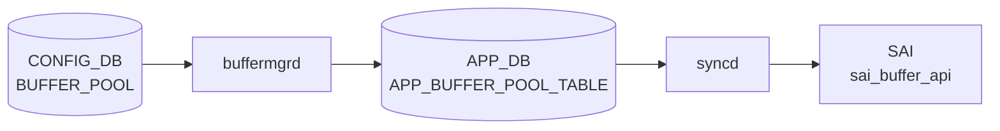
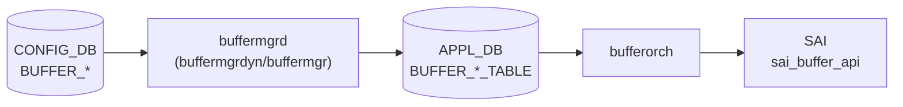

# APPL_DB BUFFER_* テーブル群

## 概要

[APPL_DB](../../reference/glossary.md#term-appl_db) 上のバッファ関連テーブル群。[CONFIG_DB](../../reference/glossary.md#term-config_db) の `BUFFER_POOL` / `BUFFER_PROFILE` / `BUFFER_PG` / `BUFFER_QUEUE` / `BUFFER_PORT_*_PROFILE_LIST` テーブルを `buffermgrd`（`buffermgrdyn` または `buffermgr`）が変換・展開して書き込む。`orchagent` の `BufferOrch` がこれを購読し、[SAI](../../reference/glossary.md#term-sai) `sai_buffer_api` を通じてハードウェアに反映する[^buforch]。

テーブル名定数は `sonic-swss-common/common/schema.h` に定義される[^schema]。

<!-- cdb-mermaid -->
### データフロー (自動生成)



!!! note "凡例"
    CONFIG_DB から SAI までの典型経路を `docs/reference/config-db-orch-map.md` から機械生成したミニ図。詳細・例外は本ページ本文と対応表を参照。
<!-- /cdb-mermaid -->

## テーブル一覧

| [APPL_DB](../../reference/glossary.md#term-appl_db) テーブル名 | 定数名 | 対応 [CONFIG_DB](../../reference/glossary.md#term-config_db) テーブル |
|-------------------|--------|------------------------|
| `BUFFER_POOL_TABLE` | `APP_BUFFER_POOL_TABLE_NAME` | `BUFFER_POOL` |
| `BUFFER_PROFILE_TABLE` | `APP_BUFFER_PROFILE_TABLE_NAME` | `BUFFER_PROFILE` |
| `BUFFER_PG_TABLE` | `APP_BUFFER_PG_TABLE_NAME` | `BUFFER_PG` |
| `BUFFER_QUEUE_TABLE` | `APP_BUFFER_QUEUE_TABLE_NAME` | `BUFFER_QUEUE` |
| `BUFFER_PORT_INGRESS_PROFILE_LIST_TABLE` | `APP_BUFFER_PORT_INGRESS_PROFILE_LIST_NAME` | `BUFFER_PORT_INGRESS_PROFILE_LIST` |
| `BUFFER_PORT_EGRESS_PROFILE_LIST_TABLE` | `APP_BUFFER_PORT_EGRESS_PROFILE_LIST_NAME` | `BUFFER_PORT_EGRESS_PROFILE_LIST` |

## データフロー



## key 構造

```text
BUFFER_POOL_TABLE|<pool-name>
BUFFER_PROFILE_TABLE|<profile-name>
BUFFER_PG_TABLE|<port-name>|<pg-range>
BUFFER_QUEUE_TABLE|<port-name>|<queue-range>
BUFFER_PORT_INGRESS_PROFILE_LIST_TABLE|<port-name>
BUFFER_PORT_EGRESS_PROFILE_LIST_TABLE|<port-name>
```

VoQ スイッチ環境では `BUFFER_PG_TABLE` / `BUFFER_QUEUE_TABLE` のキーが 4 トークン形式になる（`<hostname>|<asic>|<port>|<range>`）。

## 主要フィールド

### BUFFER_POOL_TABLE

| フィールド | 型 | 省略条件 | 説明 |
|-----------|---|---------|------|
| `type` | enum `ingress`/`egress` | 常に書き込み | プールの方向。`both` は `BUFFER_EGRESS` に折り畳まれる（後述） |
| `mode` | enum `static`/`dynamic` | 常に書き込み | 閾値モード |
| `size` | uint64 (bytes) | dynamic_size 条件成立時スキップ | プールサイズ。Lua plugin が後から書き込む場合がある |
| `xoff` | uint64 (bytes) | SHP 未設定時省略 | Shared [Headroom](../../reference/glossary.md#term-headroom) Pool サイズ |

### BUFFER_PROFILE_TABLE

| フィールド | 型 | 省略条件 | 説明 |
|-----------|---|---------|------|
| `pool` | string | 常に書き込み | 参照プール名 |
| `size` | uint64 (bytes) | 常に書き込み | reserved バッファサイズ |
| `xon` | uint64 (bytes) | lossy profile は省略 | XON 閾値 |
| `xon_offset` | uint64 (bytes) | 値が空のとき省略 | XON オフセット |
| `xoff` | uint64 (bytes) | lossy profile は省略 | XOFF 閾値 |
| `dynamic_th` | int8 | `static_th` と排他 | dynamic threshold (alpha 値) |
| `static_th` | uint64 (bytes) | `dynamic_th` と排他 | static threshold |
| `headroom_type` | string | [CONFIG_DB](../../reference/glossary.md#term-config_db) からの転写時のみ | bufferorch で無視（[SAI](../../reference/glossary.md#term-sai) 非反映） |
| `packet_discard_action` | string `drop`/`trim` | 値が空のとき省略 | パケット廃棄アクション |

### BUFFER_PG_TABLE / BUFFER_QUEUE_TABLE

| フィールド | 型 | 省略条件 | 説明 |
|-----------|---|---------|------|
| `profile` | string (profile 名) | 常に書き込み | 参照プロファイル名 |

### BUFFER_PORT_INGRESS/EGRESS_PROFILE_LIST_TABLE

| フィールド | 型 | 省略条件 | 説明 |
|-----------|---|---------|------|
| `profile_list` | string (カンマ区切り) | 常に書き込み | 適用プロファイルリスト |

## 購読者

- **`buffermgrdyn`** (`docker-swss`): dynamic buffer model 時に CONFIG_DB を変換して [APPL_DB](../../reference/glossary.md#term-appl_db) に書き込む
- **`buffermgr`** (`docker-swss`): static buffer model 時（pass-through に近い）
- **`BufferOrch`** (`orchagent`): APPL_DB を購読して SAI に反映

## 関連 CONFIG_DB / YANG / CLI

- 関連 CONFIG_DB: `BUFFER_POOL`、`BUFFER_PROFILE`、`BUFFER_PG`、`BUFFER_QUEUE`
- 関連 [YANG](../../reference/glossary.md#term-yang): `sonic-buffer-pool`、`sonic-buffer-profile`
- 関連 CLI: `config buffer`、`show buffer pool`、`show buffer profile`

<!-- defaults -->
## コード由来の暗黙デフォルト / 実装乖離 (Phase A)

### `type=both` — buffermgrdyn が内部で `BUFFER_EGRESS` に折り畳む (乖離)

`buffermgrdyn.cpp` L2544-2549:

```cpp
if (value == buffer_value_ingress)
    bufferPool.direction = BUFFER_INGRESS;
else
    bufferPool.direction = BUFFER_EGRESS;  // "both" はここに落ちる
```

APPL_DB に書き込まれる `type` フィールドは raw 文字列（`"both"`）をそのまま転写するため [SAI](../../reference/glossary.md#term-sai) 側には `SAI_BUFFER_POOL_TYPE_BOTH` が届く。しかし buffermgrdyn の内部キャッシュは `BUFFER_EGRESS` として扱うため、headroom 計算では ingress 側プールとして参照されない可能性がある。

### `size` (BUFFER_POOL_TABLE) — dynamic_size 時は Lua plugin へサイレント委譲

`buffermgrdyn.cpp` L2525/2534: `size` フィールドが CONFIG_DB に存在しない場合、`bufferPool.dynamic_size = true` を立て APPL_DB への書き込みを遅延する。実効サイズは Mellanox/Barefoot の Lua plugin (`buffer_pool_<platform>.lua`) が MMU 使用量から逆算して書き込む。さらに `ingress_lossless_pool` において `overSubscribeRatio` 非ゼロかつ SHP が size で有効でない場合、`dontUpdatePoolToDb=true` となり直接書き込みが完全にスキップされる (`buffermgrdyn.cpp` L2555-2628)。

### `xoff` (BUFFER_POOL_TABLE) — 省略 = 0 相当

`updateBufferPoolToDb()` (L878-879): `pool.xoff.empty()` のとき `xoff` フィールドを APPL_DB に書き込まない。`bufferorch.cpp` はフィールド不在を SHP なしと解釈し、`publishSHPSize()` を呼ばない (L549-554)。

### `xon` / `xoff` (BUFFER_PROFILE_TABLE) — lossy profile では APPL_DB に存在しない

`updateBufferProfileToDb()` (L903-910): `profile.lossless == false` のとき `xon`、`xon_offset`、`xoff` フィールドを書き込まない。bufferorch は `xoff` フィールドの有無でロスレス判定を行う (L851)。

### `xon_offset` (BUFFER_PROFILE_TABLE) — 省略 = ASIC デフォルト

`xon_offset` が空文字列のとき APPL_DB に書き込まれない (L906-908)。bufferorch はフィールド不在を無視するため SAI の `SAI_BUFFER_PROFILE_ATTR_XON_OFFSET_TH` は設定されない。

### `headroom_type` (BUFFER_PROFILE_TABLE) — bufferorch で dead field (乖離)

`bufferorch.cpp` L748-752:

```cpp
else {
    SWSS_LOG_ERROR("Unknown buffer profile field specified:%s, ignoring", field.c_str());
    continue;
}
```

`headroom_type` は `else` 分岐に落ちて `LOG_ERROR` + skip される。CONFIG_DB / [YANG](../../reference/glossary.md#term-yang) には定義があるが SAI 経路では完全に無視される。

### `dynamic_th` / `static_th` — threshold type が create-only (乖離)

`bufferorch.cpp` L692-713: SAI オブジェクトが既存の場合（プロファイル更新時）、`SAI_BUFFER_PROFILE_ATTR_THRESHOLD_MODE` の書き込みをスキップする（LOG_INFO のみ）。threshold 値 (`SHARED_DYNAMIC_TH` / `SHARED_STATIC_TH`) 自体は更新されるが、モード切り替え（`dynamic_th` → `static_th` の変更など）は SAI に反映されない。

### threshold_mode 自動決定

`updateBufferProfileToDb()` L901:

```cpp
const string &&mode = profile.threshold_mode.empty() ? getPgPoolMode() + "_th" : profile.threshold_mode;
```

threshold_mode が未設定のとき、ingress_lossless_pool の `mode` フィールド (`"dynamic"` / `"static"`) に `"_th"` を付加した値 (`"dynamic_th"` / `"static_th"`) を自動採用する。CONFIG_DB に `dynamic_th` / `static_th` フィールドを明示していない場合でも、APPL_DB にはどちらかが必ず書き込まれる。

### `packet_discard_action` (BUFFER_PROFILE_TABLE) — 省略 = drop 相当

フィールドが APPL_DB に存在しない場合、bufferorch は SAI 属性を設定しない（= [ASIC](../../reference/glossary.md#term-asic) デフォルト動作 = パケット DROP）。`"trim"` を設定した場合のみ `SAI_BUFFER_PROFILE_PACKET_ADMISSION_FAIL_ACTION_DROP_AND_TRIM` が渡る (L730-744)。

### `profile` (BUFFER_PG_TABLE / BUFFER_QUEUE_TABLE) — 不在時は retry

`bufferorch.cpp:processPriorityGroup()` / `processQueue()`: `profile` フィールドが不在または参照先プロファイルが未登録の場合 `task_need_retry` を返す。ゼロプロファイル（名前に `_zero_` を含む）は flex counter の追加をスキップする (L995)。

### 書き込みルート別フィールド扱い早見表

| フィールド | buffermgrdyn (dynamic) | buffermgr (static) | bufferorch (SAI) |
|-----------|----------------------|-------------------|-----------------|
| BUFFER_POOL: `type` | raw 転写 (`both`→内部 EGRESS) | pass-through | SAI create-only |
| BUFFER_POOL: `mode` | raw 転写 | pass-through | SAI create-only |
| BUFFER_POOL: `size` | dynamic_size フラグ制御 | pass-through | `SAI_BUFFER_POOL_ATTR_SIZE` |
| BUFFER_POOL: `xoff` | SHP 計算結果 (空なら省略) | pass-through | `SAI_BUFFER_POOL_ATTR_XOFF_SIZE` |
| BUFFER_PROFILE: `pool` | `pool_name` から転写 | pass-through | SAI create-only |
| BUFFER_PROFILE: `size` | Lua 計算値 or 指定値 | pass-through | `SAI_BUFFER_PROFILE_ATTR_BUFFER_SIZE` |
| BUFFER_PROFILE: `xon` | lossless のみ | pass-through | `SAI_BUFFER_PROFILE_ATTR_XON_TH` |
| BUFFER_PROFILE: `xoff` | lossless のみ | pass-through | `SAI_BUFFER_PROFILE_ATTR_XOFF_TH` |
| BUFFER_PROFILE: `headroom_type` | 転写のみ | pass-through | LOG_ERROR + skip |
| BUFFER_PROFILE: `dynamic_th` | 自動決定 or 指定値 | pass-through | mode は create-only、値は更新可 |

> **証跡**: `bufferorch.h` L18-35 全行読了、`bufferorch.cpp` L391-1000 全行読了、`buffermgrdyn.cpp` L870-960 全行読了、`schema.h` BUFFER 定数確認済み。
<!-- /defaults -->

<!-- ordering -->
## 書込み順依存 (Phase B)

`BufferOrch` は SAI の隠れた依存ツリー（pool → profile → PG/Queue/ProfileList）に従って APPL_DB の `BUFFER_*_TABLE` を処理する。**外部から書き込む順序が逆でも `task_need_retry` で最終的には収束**するが、各 doTask が retry を出し続けるためログが暴れる。順序依存と PortsOrch readiness ゲートを以下に整理する[^buforch]。

### 1. PortsOrch readiness ゲート (全 BUFFER_* 共通)

`BufferOrch::doTask(Consumer&)` の冒頭で PortsOrch の初期化フラグをチェックし、未完了なら**全 BUFFER_* テーブルの処理が一括ブロック**される。`m_toSync` は erase されず保留されるため、PortsOrch 完了後に自動再ディスパッチされる。

| 経路 | チェック | 行 |
|---|---|---|
| `gMySwitchType == "voq"` | `gPortsOrch->isInitDone()` が false なら return | `bufferorch.cpp:2079-2085` |
| non-[VOQ](../../reference/glossary.md#term-voq) | `gPortsOrch->isConfigDone()` が false なら return | `bufferorch.cpp:2087-2091` |

[VOQ](../../reference/glossary.md#term-voq) では system port が `init` フェーズで揃う設計に合わせて `isInitDone()` を使う。non-[VOQ](../../reference/glossary.md#term-voq) は `PORT_CONFIG_DONE` 受信時点で進む。

### 2. orchagent 内の固定 drain 順 (Pool → Profile → 残り)

`BufferOrch::doTask()` (no-arg, `bufferorch.cpp:2040-2073`) は consumer を以下の固定順で `drain()` する:

1. `APP_BUFFER_POOL_TABLE_NAME` を `drain()` (L2057-2058)
2. `APP_BUFFER_PROFILE_TABLE_NAME` を `drain()` (L2060-2061)
3. 残り全 consumer (`BUFFER_QUEUE_TABLE` / `BUFFER_PG_TABLE` / `BUFFER_PORT_INGRESS_PROFILE_LIST_TABLE` / `BUFFER_PORT_EGRESS_PROFILE_LIST_TABLE`) を順不同 `drain()` (L2063-2071)

この順序は L2042-2053 のコメント「The hidden dependency tree」に対応する:

```
buffer pool
└── buffer profile
    ├── buffer port ingress profile list
    ├── buffer port egress profile list
    ├── buffer queue
    └── buffer pq table
```

### 3. 参照解決の retry 条件 (順序違反時)

外部書込が逆順だった場合、参照解決失敗で各 handler が `task_need_retry` を返す:

| handler | retry 条件 | evidence |
|---|---|---|
| `processBufferProfile()` | `pool` 参照が `not_resolved` (= pool 未登録) | `bufferorch.cpp:602-888` |
| `processQueue()` | `profile` 参照 `not_resolved` (= profile 未登録) | `bufferorch.cpp:914-1233` |
| `processPriorityGroup()` | `profile` 参照 `not_resolved` | `bufferorch.cpp:1305-1495` |
| `processIngressBufferProfileList()` / `processEgressBufferProfileList()` | list 内のいずれかの profile が `not_resolved` | `bufferorch.cpp:1663-, 1845-` |

`task_need_retry` は `m_toSync` から erase されず次回 doTask で再評価される。同一イベントループ内では (2) の固定 drain 順により多くの場合一発で解決する。

### 4. DEL の逆順依存 (削除は SET の逆順で)

被参照中の pool / profile は削除できない:

| handler | DEL retry 条件 | evidence |
|---|---|---|
| `processBufferPool()` | 当該 pool が profile から参照中 (`object_reference_map` 参照カウント) | `bufferorch.cpp:562-585` |
| `processBufferProfile()` | 当該 profile が PG / Queue / ProfileList から参照中 | `bufferorch.cpp:860-878` |

順序違反 (pool を先に消すなど) は `task_need_retry` で**永続保留**され、参照側が消えるまでループする。

### 5. m_ready_list — BUFFER_PG/QUEUE 適用がポート初期化の前提

`BufferOrch` はポート毎の buffer readiness を `m_port_ready_list_ref` / `m_ready_list` で追跡する。

- ctor の `initBufferReadyLists()` (`bufferorch.cpp:86-143`) で CONFIG_DB (cold/fast start) または APPL_DB (warm reboot) の `BUFFER_PG` / `BUFFER_QUEUE` キーを走査し、ポート毎の未処理エントリを `m_port_ready_list_ref[port_name]` に登録、`m_ready_list[appldb_key] = false` で初期化。
- `processPriorityGroup()` / `processQueue()` が SAI bind 成功後に `m_ready_list[appldb_key] = true` に更新。
- `isPortReady(port_name)` (L254-275) は当該ポートの全 PG/Queue が true になった時点で `true` を返す。
- PortsOrch は `isPortReady()` を見て後段のポート初期化 (`SAI_PORT_ATTR_ADMIN_STATE` 等) を進める。

→ **[BUFFER_PG](../../reference/glossary.md#term-buffer-pg) / BUFFER_QUEUE の SAI bind 完了がポート Admin-up の前提**。dynamic buffer model の admin down ポートは buffermgrd からの明示削除通知で ready 扱いになる (L97-98 コメント参照)。

### 6. warm reboot の初期 ready 充填

`WarmStart::isWarmStart()` (L111) が true のとき、`initBufferReadyList()` は **APPL_DB 側**のキーから初期化する (L113-125)。warm reboot 後は buffermgrd が [orchagent](../../reference/glossary.md#term-orchagent) より遅れて起動するため、APPL_DB スナップショットが完成している前提で admin down ポートぶんが ready 扱いに自動的になる (L100-107 コメント)。cold start では CONFIG_DB 側 (L129-141) を走査する。

### 7. flex counter group の遅延初期化

- ctor で `initFlexCounterGroupTable()` (L232-252) が [FLEX_COUNTER_DB](../../reference/glossary.md#term-flex_counter_db) に group / Lua sha を 1 回だけ登録。
- `generateBufferPoolWatermarkCounterIdList()` (L286-362) は FlexCounterOrch が `FLEX_COUNTER_STATUS=enable` を受信したときに呼ばれる遅延初期化で、その時点で登録済みの全 BUFFER_POOL に対し flex counter polling を開始する (`m_isBufferPoolWatermarkCounterIdListGenerated` で多重実行ガード)。
- 順序依存: **`BUFFER_POOL` SAI create → FlexCounterOrch enable** の順なら watermark counter が登録される。逆順 (pool 未登録で enable 受信) の場合、後続の `processBufferPool()` SET 経路では個別の `startFlexCounterPolling()` は呼ばれないため、watermark を載せるには FlexCounterOrch の enable 再送が必要。

### 8. processBufferProfile の 2 段 retry (同一 doTask 内)

`bufferorch.cpp:778-797`: `sai_set_buffer_profile_attribute()` 初回失敗時に bufferorch が**同一 doTask 内で同じ SAI 呼出を即時 retry** する。これは `task_need_retry` (次回 doTask 待ち) とは別経路で、SAI ベンダ実装の transient エラー吸収用。`processBufferPool()` 側にはこの即時 retry はない。

### 9. profile_list bulk flush の発火順

`doTask(Consumer&)` 末尾 (L2132-2135) で `m_bufferFlushHandlerMap` 登録テーブル (`BUFFER_PORT_INGRESS_PROFILE_LIST` / `BUFFER_PORT_EGRESS_PROFILE_LIST` / `BUFFER_PG` / `BUFFER_QUEUE`) は per-entry 処理後にまとめて bulk flush handler を呼ぶ。bulk handler 内で `sai_port_api->set_ports_attribute()` を一発で叩き、retry は post 処理で `consumer.m_toSync.emplace()` し直す (L2027-2034)。

### まとめ: 外部書込側の順序契約

| 順序 | 操作 | 違反時 |
|---|---|---|
| 1 | PortsOrch `isConfigDone()` (VOQ では `isInitDone()`) 完了を待つ | `doTask` 全体が return、全 BUFFER_* タスクが `m_toSync` に保留 |
| 2 | `BUFFER_POOL_TABLE` SET → `BUFFER_PROFILE_TABLE` SET → `BUFFER_PG`/`BUFFER_QUEUE`/`PROFILE_LIST` SET | handler が `task_need_retry`、最終的には収束 (retry log 多発) |
| 3 | DEL は SET の逆順: PG/Queue/ProfileList → Profile → Pool | 参照中の pool/profile は `task_need_retry` で永続保留 |

### 詳細

行番号付きの完全スキャンノート・grep カバレッジは中間ファイル参照:

- `meta/_intermediate/cdb-flow/appl-buffer-ordering.md`

> **証跡**: `bufferorch.cpp` の `isConfigDone` × 1 / `isInitDone` × 1 / `drain()` × 3 / `m_ready_list` × 16 / `m_port_ready_list_ref` × 7 / `WarmStart::isWarmStart` × 1 / `m_isBufferPoolWatermarkCounterIdListGenerated` × 3 を全件確認。`doTask(Consumer&)` (L2075-2138)、`doTask()` no-arg (L2040-2073)、`initBufferReadyLists()` (L86-143) を精読。

<!-- /ordering -->

<!-- failure -->
## 失敗・retry 挙動 (Phase D)

`BufferOrch::doTask()` (`bufferorch.cpp` L2096-2129) は per-table handler が返す `task_process_status` を一括処理する。ステータスごとの最終挙動は以下のとおり[^buforch]。

| ステータス | doTask の動作 | 残タスク処理 | ログ |
|---|---|---|---|
| `task_success` / `task_ignore` | `m_toSync` から該当エントリを erase | 次タスクへ継続 | なし |
| `task_invalid_entry` | erase | 次タスクへ継続 | `LOG_ERROR ("Failed to process invalid buffer task")` |
| `task_failed` | erase | **その回の doTask を `return` で打ち切り** | `LOG_ERROR ("Failed to process buffer task, drop it")` |
| `task_need_retry` | erase せず `it++` で次回まで保留 | 次タスクへ継続 | `LOG_INFO ("Failed to process buffer task, retry it")` |
| handler 未登録 | erase | 次タスクへ継続 | `LOG_ERROR ("No handler for key:%s found")` |

> `task_failed` のみ doTask 関数全体を return で抜けるため、後続のキューイング済みタスクは次回ディスパッチまで処理されない。`task_invalid_entry` は LOG レベルが ERROR でも処理続行する点に注意。

### 主要 handler ごとの retry / failed 条件

| handler | retry になる条件 (`task_need_retry`) | failed になる条件 (`task_failed`) |
|---|---|---|
| `processBufferPool()` (L391-596) | 削除対象 pool が pending-remove / 削除対象 pool が他オブジェクト参照中 / SAI 一時エラー (`handleSaiSetStatus` 経由) | — (SAI 致命系のみ) |
| `processBufferProfile()` (L602-888) | 削除対象 profile が pending-remove / `pool` 参照が `not_resolved` (= pool 未登録) / PG・Queue から参照中 | `pool` 参照 resolve その他失敗 / 数値フィールドのパース失敗 / `packet_discard_action` が `drop`/`trim` 以外 |
| `processQueue()` (L914-1233) | `profile` 参照 `not_resolved` (= profile 未登録) / queue がロック中 (`LOG_WARN "...is locked, will retry"`, L1068-1070) | `profile` 参照 resolve その他失敗 |
| `processPriorityGroup()` (L1305-1495) | `profile` 参照 `not_resolved` | `profile` resolve その他失敗 / 参照 profile が **trimming-eligible** (`SAI_BUFFER_PROFILE_PACKET_ADMISSION_FAIL_ACTION_DROP_AND_TRIM` を持つ profile を PG に貼ろうとした場合、L1382-1388) |
| `processIngressBufferProfileList()` (L1663-) / `processEgressBufferProfileList()` (L1845-) | profile-list 内のいずれかの profile が `not_resolved` | profile-list resolve その他失敗 / list 内に trimming-eligible profile 混在 |

### handler 内の特殊な 2 段 retry (profile only)

`processBufferProfile()` L778-797 では、`sai_set_buffer_profile_attribute()` が失敗した場合に **bufferorch 自身が同じ attr で SAI をもう一度呼ぶ**:

```cpp
SWSS_LOG_NOTICE("Unable to modify buffer profile, ... will retry one more time", ...);
sai_status = sai_buffer_api->set_buffer_profile_attribute(sai_object, &attribute);
if (SAI_STATUS_SUCCESS != sai_status) {
    SWSS_LOG_ERROR("Failed to modify buffer profile, ... will retry once", ...);
    handle_status = handleSaiSetStatus(SAI_API_BUFFER, sai_status);
    ...
}
```

これは `task_need_retry` での次回 doTask 待ちとは別のループ内 retry で、SAI ベンダ実装の transient エラー吸収用。`processBufferPool()` 側にはこの即時 retry はなく、初回失敗で即 `handleSaiSetStatus()` に委譲する (L513-521)。

### SAI 失敗の共通変換: `handleSaiSetStatus` / `handleSaiCreateStatus` / `handleSaiRemoveStatus`

bufferorch は SAI 戻り値を直接 enum 化せず、`orch.cpp` 共通の `handleSai*Status()` を経由する。これらは `SAI_STATUS_SUCCESS` 以外を retry/failed/ignore/abort のいずれかに翻訳する。`SAI_STATUS_ATTR_NOT_IMPLEMENTED_0` のみ bufferorch 側で先取りして `task_ignore` を返す (L508-512 / L773-777)。

### 致命的でないが LOG_WARN を出す経路

| 条件 | 挙動 | evidence |
|---|---|---|
| queue ロック中 | `task_need_retry` + `LOG_WARN ("Queue %zd on port %s is locked, will retry")` | `bufferorch.cpp:1068-1070` |
| port link-up 後に queue/PG プロファイルを適用 | handler は処理続行 (警告のみ) | `bufferorch.cpp:1220-1227` |

### 入力検証で `task_invalid_entry` になる主なケース

- `type` が `ingress`/`egress` 以外 (`processBufferPool`, L457)
- `mode` が `static`/`dynamic` 以外 (`processBufferPool`, L484)
- key トークン数違反 (queue: 2 or 4, PG: 2, L920/L944/L1322)
- port alias 未登録 (`processQueue` L1035 / profile-list L1113)
- voq/queue index 範囲外 (L1053-1064)
- op が SET/DEL 以外 (L593, L885, L1013, L1188)

### 詳細マトリクス

handler ごと・行番号付きの完全な失敗・retry 分岐マトリクス、ディスパッチャ挙動表、grep カバレッジは中間ファイル参照:

- `meta/_intermediate/cdb-flow/appl-buffer-failure.md`

> **証跡**: `bufferorch.cpp` 全 2138 行のうち、`task_need_retry` × 12 / `task_failed` × 10 / `task_invalid_entry` × 17 / `task_ignore` × 3 / `handleSai*Status` × 9 hit を全件確認。`doTask()` の switch 句 (L2107-2128) も精読。

<!-- /failure -->

<!-- side-effects -->
## 副次 DB 書込 (Phase F)

`BufferOrch` は APPL_DB の `BUFFER_*_TABLE` を購読して SAI に反映するのが主目的だが、**[STATE_DB](../../reference/glossary.md#term-state_db) / [COUNTERS_DB](../../reference/glossary.md#term-counters_db) / [FLEX_COUNTER_DB](../../reference/glossary.md#term-flex_counter_db)** にも副次的に書き込む。SET/DEL ハンドラとは別経路で発火するものを含めて以下に整理する[^buforch]。

### STATE_DB

| 操作 | テーブル / キー | フィールド | トリガ | evidence |
|------|----------------|-----------|--------|----------|
| set | `BUFFER_MAX_PARAM_TABLE\|global` (定数 `STATE_BUFFER_MAXIMUM_VALUE_TABLE`) | `mmu_size` (bytes; `SAI_SWITCH_ATTR_MAX_BUFFER_SIZE` × 1024) | `BufferOrch` ctor の `getMMUSize()` で起動時 1 回のみ | `bufferorch.cpp:53-62, 206-230` |

> SET/DEL ハンドラ自体は [STATE_DB](../../reference/glossary.md#term-state_db) に書込まない。[STATE_DB](../../reference/glossary.md#term-state_db) は MMU 全体サイズの公開専用。

### COUNTERS_DB

`CounterNameMapUpdater("COUNTERS_DB", COUNTERS_BUFFER_POOL_NAME_MAP)` を介して name→OID マップを更新する。

| 操作 | テーブル / キー | 値 | 条件 | evidence |
|------|----------------|----|------|----------|
| HSET | `COUNTERS_BUFFER_POOL_NAME_MAP` | field=`<pool_name>` value=`<sai_object_id>` | `processBufferPool()` の SET で SAI `create_buffer_pool()` 成功直後 | `bufferorch.cpp:546` |
| HDEL | `COUNTERS_BUFFER_POOL_NAME_MAP` | field=`<pool_name>` | `processBufferPool()` の DEL で `remove_buffer_pool()` 成功後 | `bufferorch.cpp:586` |

BUFFER_PROFILE / PG / Queue / PROFILE_LIST には pool 相当の name map 書込みはない (PG/Queue の name map は PortsOrch 側で管理)。ただし `processQueue()` / `processPriorityGroup()` は profile attach/detach 成功直後に `FlexCounterOrch::isCreateOnlyConfigDbBuffers()` が true のとき `gPortsOrch->createPortBufferQueueCounters()` / `createPortBufferPgCounters()` (or remove 系) を呼び、PortsOrch 経由で [COUNTERS_DB](../../reference/glossary.md#term-counters_db) の `COUNTERS_QUEUE_NAME_MAP` / `COUNTERS_PG_NAME_MAP` と [FLEX_COUNTER_DB](../../reference/glossary.md#term-flex_counter_db) の queue/PG group を更新する (`bufferorch.cpp:1138-1152, 1513-1525`)。VOQ スイッチ (`gMySwitchType == "voq"`) ではこの経路はスキップされ FlexCounterOrch 側で一括登録される。

### FLEX_COUNTER_DB

`flex_counter_manager` の自由関数経由で `FLEX_COUNTER_GROUP_TABLE` / `FLEX_COUNTER_TABLE` を更新する。

| 操作 | テーブル / キー | フィールド | 条件 | evidence |
|------|----------------|-----------|------|----------|
| set | `FLEX_COUNTER_GROUP_TABLE\|BUFFER_POOL_WATERMARK_STAT_COUNTER` | `POLL_INTERVAL`, `BUFFER_POOL_PLUGIN` (Lua sha) | `BufferOrch` ctor → `initFlexCounterGroupTable()`、起動時 1 回 | `bufferorch.cpp:232-251` |
| set | 同上 | `STATS_MODE` = `STATS_AND_CLEAR` | `generateBufferPoolWatermarkCounterIdList()` 内、全 pool が watermark clear をサポート (`noWmClrCapability == 0`) | `bufferorch.cpp:332-336` |
| set | `FLEX_COUNTER_TABLE\|BUFFER_POOL_WATERMARK_STAT_COUNTER:<sai_pool_oid>` | `BUFFER_POOL_COUNTER_ID_LIST`, `STATS_MODE` | `generateBufferPoolWatermarkCounterIdList()` で `m_buffer_type_maps[APP_BUFFER_POOL_TABLE_NAME]` の全 pool に対し 1 回ずつ。clear 非対応 pool だけ `STATS_MODE_READ` 個別設定 | `bufferorch.cpp:340-359` |
| del | `FLEX_COUNTER_TABLE\|BUFFER_POOL_WATERMARK_STAT_COUNTER:<sai_pool_oid>` | キー全体 | `processBufferPool()` の DEL 経路、`m_isBufferPoolWatermarkCounterIdListGenerated` が true のときのみ | `bufferorch.cpp:276-284, 571` |

`m_isBufferPoolWatermarkCounterIdListGenerated` フラグで FLEX_COUNTER のエコー再起動による多重登録を防止する。watermark Lua plugin (`watermark_bufferpool.lua`) は ctor で `loadRedisScript()` され、ハッシュ sha が group に登録される。

### APPL_STATE_DB (ResponsePublisher)

`Orch::m_publisher.publish()` 経由で APPL_STATE_DB の応答チャネルに成功応答を流す（データ書込みではなく ack 通知）:

| 操作 | テーブル | 内容 | 条件 | evidence |
|------|---------|------|------|----------|
| publish | `BUFFER_POOL_TABLE` | `xoff=<value>` (force=true) | `processBufferPool()` SET 成功 かつ `xoff` 非空 (SHP 有効時) | `bufferorch.cpp:551-556` |
| publish | `BUFFER_POOL_TABLE` | 空 fvs (force=true) | `processBufferPool()` DEL 成功 | `bufferorch.cpp:587-589` |
| publish | `BUFFER_PROFILE_TABLE` | 全 fvs (force=true) | `processBufferProfile()` SET 成功 (新規 + 更新の両方) | `bufferorch.cpp:832, 880` |

主に buffermgrdyn の SHP 計算同期 (`xoff` 確定の上位通知) と config-validator 連携に使われる。

### 副次書込の発火順序 (BUFFER_POOL 新規 SET の例)

1. APPL_DB から `BUFFER_POOL_TABLE|<name>` SET を consume
2. `sai_buffer_api->create_buffer_pool()` → [ASIC_DB](../../reference/glossary.md#term-asic_db)
3. in-memory map (`m_buffer_type_maps[APP_BUFFER_POOL_TABLE_NAME]`) を更新
4. **[COUNTERS_DB](../../reference/glossary.md#term-counters_db)** `COUNTERS_BUFFER_POOL_NAME_MAP` に `<name>` → `<oid>` HSET
5. (xoff 非空時) **APPL_STATE_DB** ResponsePublisher に publish
6. (FlexCounterOrch から後段で呼出時) **FLEX_COUNTER_DB** の `FLEX_COUNTER_TABLE` に per-pool エントリを登録

### 検証コマンド (実機 dump)

```sh
# STATE_DB MMU max
redis-cli -n 6 hgetall 'BUFFER_MAX_PARAM_TABLE|global'

# COUNTERS_DB buffer pool name map
redis-cli -n 2 hgetall COUNTERS_BUFFER_POOL_NAME_MAP

# FLEX_COUNTER_DB
redis-cli -n 5 keys 'FLEX_COUNTER_GROUP_TABLE|BUFFER_POOL_WATERMARK*'
redis-cli -n 5 keys 'FLEX_COUNTER_TABLE|BUFFER_POOL_WATERMARK*'
```

### 詳細マトリクス

完全な行番号付き分析・PortsOrch 間接経路の詳細・grep カバレッジは中間ファイル参照:

- `meta/_intermediate/cdb-flow/appl-buffer-side.md`

> **証跡**: `bufferorch.cpp` 内の `STATE_BUFFER_MAXIMUM_VALUE_TABLE` × 2 / `m_counterNameMapUpdater` × 3 / `setFlexCounterGroup*` × 2 / `startFlexCounterPolling` × 1 / `stopFlexCounterPolling` × 1 / `m_publisher.publish` × 4 / `createPortBufferQueueCounters` × 1 / `createPortBufferPgCounters` × 1 を全件確認。

<!-- /side-effects -->

<!-- pubsub -->
## 通信メカニズム (Phase G)

APPL_DB の 6 BUFFER テーブルは **`buffermgrd` (`buffermgrdyn` / `buffermgr`) が Producer、`orchagent` の `BufferOrch` が Consumer** という単一方向の Producer / Consumer 関係。すべて APPL_DB (db id = 0) 上で `ProducerStateTable` ↔ `ConsumerStateTable` の **PUBLISH/SUBSCRIBE 経路** を取る。keyspace notification (`PSUBSCRIBE __keyspace@N__:...`) は**使用しない**[^buforch].

### Producer/Consumer ペア

| 区間 | 方式 | チャンネル / 構造 |
|---|---|---|
| `buffermgrdyn` / `buffermgr` → APPL_DB | `ProducerStateTable` | `<TABLE>_KEY_SET` / `_KEY_DEL` ハッシュ + `<TABLE>_CHANNEL@0` PUBLISH |
| APPL_DB → `BufferOrch` (6 テーブル全て) | `ConsumerStateTable` | `SUBSCRIBE <TABLE>_CHANNEL@0`、`pops()` Lua SCRIPT で最大 `gBatchSize` (既定 128) keys を一括取得 |
| `BufferOrch` → APPL_STATE_DB (pool / profile のみ) | `ResponsePublisher` (Orch 基底) | `BUFFER_POOL_TABLE_RESPONSE_CHANNEL` / `BUFFER_PROFILE_TABLE_RESPONSE_CHANNEL` (上り ack) |

### BufferOrch のコンストラクトと ConsumerStateTable 選択

`orchdaemon.cpp:386-394` で 6 テーブルを vector に詰めて `BufferOrch(applDb, configDb, stateDb, tables)` を作る。`bufferorch.cpp:53` の初期化リストで `Orch(applDb, tableNames)` (`orch.cpp:97-103`) を呼び、各 table が `addConsumer(applDb, name, default_orch_pri=0)` に流れる。`orch.cpp:1186-1196` の分岐:

```cpp
if (db->getDbId() == CONFIG_DB || db->getDbId() == STATE_DB || db->getDbId() == CHASSIS_APP_DB)
    addExecutor(new Consumer(new SubscriberStateTable(db, tableName, DEFAULT_POP_BATCH_SIZE, pri), this, tableName));
else
    addExecutor(new Consumer(new ConsumerStateTable(db, tableName, gBatchSize, pri), this, tableName));
```

APPL_DB は CONFIG_DB / STATE_DB / CHASSIS_APP_DB のいずれでもないため、6 テーブルとも **`ConsumerStateTable`** が選択される。`gBatchSize` は `orch.cpp:17` で `int gBatchSize = 0;`、`orchagent -b` フラグで上書き可。0 のとき swss-common 側の `DEFAULT_POP_BATCH_SIZE = 128` が適用され、1 回の `pops()` で最大 128 keys を取り出す。

### `doTask()` の明示 drain 順序 — pool → profile → 残り

6 テーブルとも `default_orch_pri = 0` で同優先度。Select の優先度では依存解決できないため、`BufferOrch::doTask()` (`bufferorch.cpp:2040-2073`) が **手動で drain 順を強制**する:

```cpp
auto pool_consumer = getExecutor(APP_BUFFER_POOL_TABLE_NAME);
pool_consumer->drain();
auto profile_consumer = getExecutor(APP_BUFFER_PROFILE_TABLE_NAME);
profile_consumer->drain();
for (auto &it : m_consumerMap) {           // PG / QUEUE / PROFILE_LIST_{INGRESS,EGRESS}
    auto consumer = it.second.get();
    if (consumer == profile_consumer) continue;
    if (consumer == pool_consumer)    continue;
    consumer->drain();
}
gPortsOrch->flushCounters();
```

これにより、同一 doTask 呼び出し内で **pool → profile → (pg / queue / profile-list)** の SAI 依存関係順に消化される。ベース `Orch::doTask()` の `m_consumerMap` イテレート実装をオーバーライドしている。Phase B (順依存) で詳述した固定 drain 順と同じ実装。

### orchagent 主ループの select 周期

`orchdaemon.cpp:23, 959`:

```cpp
#define SELECT_TIMEOUT 1000   // ミリ秒
ret = m_select->select(&s, SELECT_TIMEOUT);
```

PUBLISH 受信ごとに `Select::select` が return → 該当 Consumer の `execute()` → `BufferOrch::doTask(Consumer&)` (`bufferorch.cpp:2075-2138`) が走る。1000 ms タイムアウト時は `BufferOrch::doTask()` (引数なし版) が呼ばれ、pipeline flush と合わせて全テーブルを drain する。

### ガード — port 初期化未完時は m_toSync に積み残し

`bufferorch.cpp:2079-2091` で port 初期化が終わっていない間は処理せず保留する (Phase B の readiness ゲートと同一):

```cpp
if (gMySwitchType == "voq") {
    if (!gPortsOrch->isInitDone()) return;       // VOQ chassis
} else if (!gPortsOrch->isConfigDone()) {
    return;                                       // 非 VOQ
}
```

PUBLISH 自体は受信して `m_toSync` に積まれるが、その回の `doTask` は早期 return し、次回 select 回まで保留される。

### ResponsePublisher による上り ack (APPL_STATE_DB)

`orch.h:382` の `ResponsePublisher m_publisher{"APPL_STATE_DB"}` を通じて、BufferOrch は **`BUFFER_POOL_TABLE` / `BUFFER_PROFILE_TABLE` のみ** SAI 反映完了を ack する (PG / Queue / PROFILE_LIST は ack なし、Phase F の副次書込と一致):

| 行 | テーブル | 条件 | 内容 |
|---|---|---|---|
| `bufferorch.cpp:555` | `BUFFER_POOL_TABLE` | pool SET 成功 + `xoff` 非空 | `xoff=<value>` (force=true) |
| `bufferorch.cpp:589` | `BUFFER_POOL_TABLE` | pool DEL 成功 | 空 fvs (force=true) |
| `bufferorch.cpp:832` | `BUFFER_PROFILE_TABLE` | profile 新規 SET 成功 | 全 fvs (force=true) |
| `bufferorch.cpp:880` | `BUFFER_PROFILE_TABLE` | profile 更新成功 | 全 fvs (force=true) |

主用途は buffermgrdyn の SHP (`xoff`) 計算同期と config-validator 連携。

### バッチ / リトライ / 優先度

- **batch size**: `gBatchSize = 0` → swss-common `DEFAULT_POP_BATCH_SIZE = 128` keys/`pops()`
- **priority**: 6 テーブルとも `default_orch_pri = 0` (`orch.h:59`) → Select は同優先度。依存順序は `doTask()` 内の手動 drain で担保
- **retry**: `task_need_retry` 時は `m_toSync` から erase せず `it++` → 次回 select 回まで保留 (`bufferorch.cpp:2121-2123`)。明示 sleep / backoff なし
- **task_failed**: その回の `doTask` を `return` で打ち切り (`bufferorch.cpp:2117-2120`)。後続の積み残しは次回ディスパッチで処理
- **profile のみの即時 2 段 retry**: `processBufferProfile()` L778-797 で `sai_set_buffer_profile_attribute()` 失敗時に同 attr で 1 回だけ即時再呼び出し (ベンダ transient 吸収用)

### Producer 側 — buffermgrd

| エージェント | model | テーブル | 型 |
|---|---|---|---|
| `buffermgrdyn` | dynamic | 6 テーブルすべて | `ProducerStateTable` (`buffermgrdyn.cpp:42-47`, `buffermgrdyn.h:208,214`) |
| `buffermgr` | static (pass-through) | 6 テーブルすべて | `ProducerStateTable` (`buffermgr.cpp:25-33`, `buffermgr.h:48,50`) |

`ProducerStateTable::set/del` は `<TABLE>_KEY_SET` / `_KEY_DEL` ハッシュへ書き、`<TABLE>_CHANNEL@0` に PUBLISH (swss-common `producerstatetable.cpp`)。

### 起動時スナップショット — ConsumerStateTable は KEYS 再生しない

`ConsumerStateTable` ctor は `SubscriberStateTable` と違って **既存 keys の再生を行わない**。buffermgrd 側が起動時に CONFIG_DB を読んで `ProducerStateTable::set()` で APPL_DB に再投入し、その PUBLISH を BufferOrch が通常通り受信する。

warm reboot 時のみ、`BufferOrch::initBufferReadyLists()` (`bufferorch.cpp:86-143`) が `Table::getKeys()` で APPL_DB の `BUFFER_PG_TABLE` / `BUFFER_QUEUE_TABLE` を**直読み**して ready list を初期化する (Pub/Sub 経由ではない)。cold/fast start 時は CONFIG_DB の `BUFFER_PG` / `BUFFER_QUEUE` を直読み。

### データフロー図

```
admin (config buffer ... / config_db.json 初期投入)
  ↓ ConfigDBConnector.set_entry()
CONFIG_DB[BUFFER_POOL / BUFFER_PROFILE / BUFFER_PG / BUFFER_QUEUE / BUFFER_PORT_*_PROFILE_LIST]
  ↓ keyspace notification (PSUBSCRIBE __keyspace@4__:BUFFER_*|*)
buffermgrdyn (dynamic) または buffermgr (static)
  ├─ Lua plugin で size / xoff / xon / threshold 計算 (dynamic のみ)
  └─ ProducerStateTable.set("<TABLE>", key, fvs)
       ↓ HSET <TABLE>_KEY_SET ... + PUBLISH <TABLE>_CHANNEL@0
APPL_DB[BUFFER_POOL_TABLE / BUFFER_PROFILE_TABLE / BUFFER_PG_TABLE /
        BUFFER_QUEUE_TABLE / BUFFER_PORT_*_PROFILE_LIST_TABLE]
  ↓ <TABLE>_CHANNEL@0 message
orchagent select() ループ (SELECT_TIMEOUT = 1000 ms)
  ↓ ConsumerStateTable.pops()  (gBatchSize=0 → 128 keys/回)
BufferOrch::doTask()
  ├─ pool_consumer->drain()       → processBufferPool()
  │    └─ SAI create/set/remove + (xoff 非空時) m_publisher.publish(BUFFER_POOL_TABLE)
  ├─ profile_consumer->drain()    → processBufferProfile()
  │    └─ SAI create/set/remove + m_publisher.publish(BUFFER_PROFILE_TABLE)
  └─ それ以外 (pg / queue / profile-list) を drain
       └─ SAI set_ingress_priority_group_attribute / queue_attribute / port_attribute
APPL_STATE_DB[BUFFER_POOL_TABLE / BUFFER_PROFILE_TABLE]  ← ResponsePublisher (ack)
  ↓ <TABLE>_RESPONSE_CHANNEL
buffermgrdyn が SHP 同期 / config-validator が反映確認

NotificationConsumer: なし
SubscriberStateTable (BufferOrch 内): なし — すべて ConsumerStateTable
TTL / expire: なし
```

### 詳細ノート

行番号付き完全マトリクス・PUBLISH チャネル列挙・warm reboot 経路は中間メモを参照: `meta/_intermediate/cdb-flow/appl-buffer-pubsub.md`。

> **証跡**: `bufferorch.cpp:53` (`Orch(applDb, tableNames)`) → `orch.cpp:97-103, 1186-1196` (APPL_DB → [ConsumerStateTable](../../reference/glossary.md#term-consumerstatetable) 分岐) → `bufferorch.cpp:2040-2073` (drain 順)、`m_publisher.publish` × 4 hit、`buffermgrdyn.h:208/214` + `buffermgr.h:48/50` ([ProducerStateTable](../../reference/glossary.md#term-producerstatetable) 型確認) を全件確認。

<!-- /pubsub -->

<!-- platform -->
## プラットフォーム差 (Phase H)

`BufferOrch` は単一バイナリで動作するが、(a) `gMySwitchType == "voq"` の chassis VOQ 経路、(b) SAI capability の動的判定、(c) ベンダ buffer pool Lua plugin、の 3 点でプラットフォーム差が生まれる[^buforch]。[BUFFER_PG](../../reference/glossary.md#term-buffer-pg) / BUFFER_QUEUE の **PG/queue index → SAI oid マッピング自体は `portsorch` 側に閉じている** ため、Broadcom / Mellanox の物理マップ差は bufferorch には現れない。

### 1. VOQ chassis (Cisco 8000 系) の経路差

| 行 | 差分 | non-VOQ | VOQ (`gMySwitchType == "voq"`) |
|---|---|---|---|
| L116/L132 | BUFFER_QUEUE_TABLE 初期化 | `initBufferReadyList()` | `initVoqBufferReadyList()` (system port ベース) |
| L916 | BUFFER_QUEUE_TABLE key tokens | 2 (`<port>\|<range>`) | 4 (`<host>\|<asic>\|<port>\|<range>`) |
| L1049 | queue id 解決 | `port.m_queue_ids[ind]` | `gPortsOrch->getPortVoQIds(port)[ind]` |
| L1066-1070 | queue lock retry | あり (`task_need_retry`) | なし |
| L1134-1136 | Port Queue Counter 自動登録 | bufferorch が登録 | `flexcounterorch` が一括登録するため bufferorch ではスキップ |
| L1166-1168 | port ref counter 更新 | あり | なし (system port は静的) |
| L2079 | `doTask()` 起動ガード | `isConfigDone()` | `isInitDone()` |

BUFFER_PG_TABLE には VOQ 分岐がなく、PG キーは VOQ chassis でも 2 トークン (`<port>\|<range>`)。

### 2. SAI capability 動的判定 (ASIC ベンダ依存)

bufferorch は静的にベンダ名を判定せず、**SAI 戻り値で実行時に capability を検出する**。

| 経路 | 行 | NOT_IMPLEMENTED 時の挙動 | 影響範囲 |
|---|---|---|---|
| `clear_buffer_pool_stats` | L310-322 | `noWmClrCapability` ビットマスクに記録 (32 プールまで) | watermark clear API (pool 単位で個別) |
| `set_buffer_pool_attribute` | L506-512 | `task_ignore` | BUFFER_POOL_TABLE 属性 SET |
| `set_buffer_profile_attribute` | L773-777 | `task_ignore` | **`xon_offset`** / `packet_discard_action=trim` 等 [ASIC](../../reference/glossary.md#term-asic) 非対応 attr |

→ `xon_offset` (`SAI_BUFFER_PROFILE_ATTR_XON_OFFSET_TH`) を非対応な [ASIC](../../reference/glossary.md#term-asic) では bufferorch が `task_ignore` で握り潰す。CONFIG_DB / APPL_DB に値が残っていてもハードウェアには反映されない (silent skip)。`packet_discard_action=trim` も同様で、加えて trimming-eligible profile を PG / profile-list に貼ろうとすると `task_failed` になる (L1382-1388 / L1728 / L1918)[^buforch]。

### 3. dynamic / static buffer model のベンダ別配布

`BUFFER_POOL_TABLE.size` が空の場合の挙動はビルド時の選択で変わる:

| ベンダ | model | size 空時の挙動 |
|---|---|---|
| Mellanox SN シリーズ | dynamic (`buffermgrdyn`) | `buffer_pool_mlnx.lua` が SAI MMU から逆算して APPL_DB に書き戻す |
| Barefoot Tofino | dynamic (`buffermgrdyn`) | `buffer_pool_bfn.lua` |
| Broadcom (多くの platform) | static (`buffermgr`) | CONFIG_DB を pass-through (空なら空のまま) |

dynamic vs static の選択は `device/<vendor>/<platform>/<HWSKU>/buffers_dynamic.json.j2` の配布有無で決まり、bufferorch 側は感知しない (APPL_DB の値を SAI に流すだけ)。

### 4. PG / queue index 上限は portsorch から借用

bufferorch は PG / queue の SAI oid を **`portsorch` が `SAI_PORT_ATTR_INGRESS_PRIORITY_GROUP_LIST` / `SAI_PORT_ATTR_QOS_QUEUE_LIST` で取得済み** の `port.m_priority_group_ids` / `port.m_queue_ids` を index アクセスするのみ。範囲外 (`m_queue_ids.size() <= ind`) は `task_invalid_entry` (L1058-1061)。Broadcom (8 PG × 8 queue) と Mellanox (同 8/8 だが内部 buffer 構造が異なる) の物理マップ差は SAI ベンダ実装に閉じる。

### 5. multi-asic namespace

multi-asic non-VOQ (T2 chassis [BGP](../../reference/glossary.md#term-bgp)-only 等) では `BUFFER_*` は各 `asicX` namespace の独立 bufferorch インスタンスで処理される。VOQ chassis では `gMyHostName` / `gMyAsicName` と key の先頭 2 トークンを比較し (L1062-1064)、自 ASIC 配下を `local_port = true` として SAI bind、他 ASIC ぶんは ready list 管理のみ。

### 詳細

行番号付き完全マトリクスは中間ファイル参照:

- `meta/_intermediate/cdb-flow/appl-buffer-platform.md`

> **証跡**: `bufferorch.cpp` の `gMySwitchType` 5 hit / `SAI_STATUS_NOT_IMPLEMENTED` 3 hit / `SAI_STATUS_NOT_SUPPORTED` 1 hit を全件確認。VOQ 分岐の L116/L132/L916/L1049/L1136/L1168/L2079、capability 経路の L310-322/L506-512/L773-777 を精読。

<!-- /platform -->

<!-- constants -->
## ハードコード定数 (Phase E)

`bufferorch.cpp` / `bufferorch.h` / `buffer/bufferschema.h` に固定された文字列・列挙値定数の一覧。フィールド名・列挙値文字列はすべて C++ ヘッダで `const string` として定義されており、CLI / [YANG](../../reference/glossary.md#term-yang) / API いずれの層でも同じ綴りを要求する。

### フィールド名定数 (`bufferorch.h`)

| 定数名 | 値 | 行 |
|---|---|---|
| `buffer_size_field_name` | `"size"` | `bufferorch.h:18` |
| `buffer_pool_type_field_name` | `"type"` | `bufferorch.h:19` |
| `buffer_pool_mode_field_name` | `"mode"` | `bufferorch.h:20` |
| `buffer_pool_field_name` | `"pool"` | `bufferorch.h:21` |
| `buffer_pool_xoff_field_name` | `"xoff"` | `bufferorch.h:24` |
| `buffer_xon_field_name` / `buffer_xon_offset_field_name` / `buffer_xoff_field_name` | `"xon"` / `"xon_offset"` / `"xoff"` | `bufferorch.h:25-27` |
| `buffer_dynamic_th_field_name` / `buffer_static_th_field_name` | `"dynamic_th"` / `"static_th"` | `bufferorch.h:28-29` |
| `buffer_profile_field_name` / `buffer_profile_list_field_name` | `"profile"` / `"profile_list"` | `bufferorch.h:30, 34` |
| `buffer_headroom_type_field_name` | `"headroom_type"` (bufferorch では dead field) | `bufferorch.h:35` |

### 列挙値文字列 (`bufferorch.h`)

| 定数名 | 値 | 用途 |
|---|---|---|
| `buffer_value_ingress` / `buffer_value_egress` / `buffer_value_both` | `"ingress"` / `"egress"` / `"both"` | `BUFFER_POOL.type` (`bufferorch.h:31-33`) |
| `buffer_pool_mode_dynamic_value` / `buffer_pool_mode_static_value` | `"dynamic"` / `"static"` | `BUFFER_POOL.mode` (`bufferorch.h:22-23`) |

`type` / `mode` は if-else 直接比較で、許容値以外は `task_invalid_entry` (`bufferorch.cpp:457, 484`)。

### `packet_discard_action` 関連 (`buffer/bufferschema.h`)

| 定数名 | 値 | 行 |
|---|---|---|
| `BUFFER_PROFILE_PACKET_DISCARD_ACTION` | `"packet_discard_action"` | `bufferschema.h:8` |
| `BUFFER_PROFILE_PACKET_DISCARD_ACTION_DROP` | `"drop"` | `bufferschema.h:5` |
| `BUFFER_PROFILE_PACKET_DISCARD_ACTION_TRIM` | `"trim"` | `bufferschema.h:6` |

`drop` / `trim` 以外の値は `task_failed` (`bufferorch.cpp:743`)。

### flex counter group 定数 (`bufferorch.h`)

| 定数名 | 値 | 用途 | 行 |
|---|---|---|---|
| `BUFFER_POOL_WATERMARK_STAT_COUNTER_FLEX_COUNTER_GROUP` | `"BUFFER_POOL_WATERMARK_STAT_COUNTER"` | flex counter group 名 | `bufferorch.h:15` |
| `BUFFER_POOL_WATERMARK_FLEX_STAT_COUNTER_POLL_MSECS` | `"60000"` (= 60 秒) | poll 間隔ミリ秒 | `bufferorch.h:16` |

poll 間隔は 60 秒固定でランタイム変更不可。

### ゼロプロファイル命名規約 — `_zero_` 部分文字列

flex counter スキップ判定として、プロファイル名に `_zero_` を含むか否かを `find()` で評価する暗黙の命名契約がある。

| 行 | 文脈 |
|---|---|
| `bufferorch.cpp:378` | `processBufferProfile()` 削除時の参照中ゼロプロファイル除外 |
| `bufferorch.cpp:995, 1017` | `processQueue()` の counter 追加 / 旧プロファイル判定 |
| `bufferorch.cpp:1400, 1421` | `processPriorityGroup()` の counter 追加 / 旧プロファイル判定 |

`*_zero_*` 命名規約は YANG / CONFIG_DB スキーマには現れないが、ゼロプロファイル運用には必須。

### スイッチタイプ判定リテラル

`gMySwitchType` との比較に直接書かれている文字列。

| 値 | 行 | 分岐内容 |
|---|---|---|
| `"dpu"` | `bufferorch.cpp:64` | `initBufferConstants()` をスキップ |
| `"voq"` | `bufferorch.cpp:116, 132, 916, 1049, 1136, 1168, 2079` | VoQ 用 key 4 トークン形式 / remote port 扱い / queue counter スキップ |

### 主要 SAI 属性 / 列挙値 ID 定数

`bufferorch.cpp` から SAI に渡される代表的な定数。完全リストは中間ファイル参照。

| SAI 定数 | 用途 | 行 |
|---|---|---|
| `SAI_BUFFER_POOL_ATTR_SIZE` / `_TYPE` / `_THRESHOLD_MODE` / `_XOFF_SIZE` | pool 4 属性 | `bufferorch.cpp:427, 460, 487, 493` |
| `SAI_BUFFER_POOL_TYPE_{INGRESS,EGRESS,BOTH}` | `type` 列挙 SAI 値 | `bufferorch.cpp:445, 449, 453` |
| `SAI_BUFFER_POOL_THRESHOLD_MODE_{DYNAMIC,STATIC}` | `mode` 列挙 SAI 値 | `bufferorch.cpp:476, 480` |
| `SAI_BUFFER_PROFILE_ATTR_POOL_ID` / `BUFFER_SIZE` / `XON_TH` / `XON_OFFSET_TH` / `XOFF_TH` | profile 主要属性 | `bufferorch.cpp:661, 686, 668, 674, 680` |
| `SAI_BUFFER_PROFILE_ATTR_THRESHOLD_MODE` / `SHARED_{DYNAMIC,STATIC}_TH` | threshold (mode は create-only) | `bufferorch.cpp:699, 704, 717, 722` |
| `SAI_BUFFER_PROFILE_ATTR_PACKET_ADMISSION_FAIL_ACTION` + `_DROP` / `_DROP_AND_TRIM` | discard action | `bufferorch.cpp:728, 732, 736` |
| `SAI_BUFFER_POOL_STAT_WATERMARK_BYTES` / `_XOFF_ROOM_WATERMARK_BYTES` | flex counter stat 2 種 | `bufferorch.cpp:31-32` |
| `SAI_STATUS_ATTR_NOT_IMPLEMENTED_0` | pool/profile SET 時のみ先取り `task_ignore` 化 | `bufferorch.cpp:508, 773` |
| `SAI_NULL_OBJECT_ID` | OID 未割当判定 (create 経路選択) | 各所 |

### state DB / counters DB リテラル

| リテラル / 定数 | 用途 | 行 |
|---|---|---|
| `STATE_BUFFER_MAXIMUM_VALUE_TABLE` (schema.h 由来) | STATE_DB のテーブル名 | `bufferorch.cpp:57` |
| `"mmu_size"` (フィールド名) / `"global"` (key) | mmu 総量を STATE_DB に書き出す | `bufferorch.cpp:226-227` |
| `COUNTERS_BUFFER_POOL_NAME_MAP` | pool name → OID マップ | `bufferorch.cpp:55` |
| `"COUNTERS_DB"` (DB 名リテラル) | DBConnector 引数 | `bufferorch.cpp:55-56` |

> 詳細スキャン証跡: `meta/_intermediate/cdb-flow/appl-buffer-constants.md`

<!-- /constants -->

---

<!-- cross-refs -->
## 暗黙参照テーブル (Phase C)

APPL_DB の `BUFFER_*_TABLE` 群を `BufferOrch` が処理する際に SAI OID 解決のために間接的に読み出す関連テーブル / Orch / DB を列挙する。`BufferOrch` は CONFIG_DB を**直接購読しない**ため、CONFIG_DB 側 `BUFFER_*` は `buffermgrd` 経由の Direction A 入力として扱われる（本ブロックには含めない）。

### BUFFER_PROFILE_TABLE の参照

| 参照先 | 参照方向 | 条件 | 参照元 evidence |
|--------|---------|------|----------------|
| `BUFFER_POOL_TABLE\|<pool>` | OID 解決 (`resolveFieldRefValue`) | `pool` フィールド指定の `SET`。プール未作成だと `field_not_resolved` で task 再試行 | `bufferorch.cpp` L640-650 |
| `m_buffer_type_maps[BUFFER_POOL]` の object reference map | 削除時の逆引き | profile 削除時に pool 側 refcount を減算、参照中の pool は `m_pendingRemove` で削除保留 | `bufferorch.cpp` L560-585, L821 |

### BUFFER_QUEUE_TABLE の参照

| 参照先 | 参照方向 | 条件 | 参照元 evidence |
|--------|---------|------|----------------|
| `BUFFER_PROFILE_TABLE\|<profile>` | OID 解決 (`resolveFieldRefValue`) | `profile` フィールド指定の `SET`。未作成なら task 再試行 | `bufferorch.cpp` L961-992 |
| `PORT\|<name>` (PortsOrch) | `gPortsOrch->getPort(port_name, port)` | key の port トークン。未 ready なら `field_not_ready` で再試行 | `bufferorch.cpp` L1033, L1111 |
| `getPortVoQIds(port)` (PortsOrch) | VoQ id 列の取得 | `isSwitchTypeVoq()` 真のとき。VoQ スイッチでは port 単位 queue ではなく VoQ id を SAI に渡す | `bufferorch.cpp` L1051 |
| `FLEX_COUNTER_DB` — `QUEUE_STAT_COUNTER` / `QUEUE_WATERMARK_STAT_COUNTER` | flex counter 動的登録 | 非 VoQ かつ `FlexCounterOrch::isCreateOnlyConfigDbBuffers()` 真、かつ queue/watermark counter 有効時 | `bufferorch.cpp` L1135-1158 |

### BUFFER_PG_TABLE の参照

| 参照先 | 参照方向 | 条件 | 参照元 evidence |
|--------|---------|------|----------------|
| `BUFFER_PROFILE_TABLE\|<profile>` | OID 解決 (`resolveFieldRefValue`) | `profile` フィールド指定の `SET` | `bufferorch.cpp` L1339-1397 |
| `PORT\|<name>` (PortsOrch) | `gPortsOrch->getPort(port_name, port)` | key の port トークン。未 ready なら再試行 | `bufferorch.cpp` L1431, L1488 |
| `FLEX_COUNTER_DB` — `PG_STAT_COUNTER` / `PG_WATERMARK_STAT_COUNTER` | flex counter 動的登録 | `FlexCounterOrch::isCreateOnlyConfigDbBuffers()` 真、かつ PG/watermark counter 有効時 | `bufferorch.cpp` L1513-1531 |
| CONFIG_DB `BUFFER_PG` / APPL_DB `BUFFER_PG_TABLE` | warm-reboot 時の復旧スキャン | コンストラクタが既存設定有無を確認し、queue 既定値を保留 | `bufferorch.cpp` L113-141 |

### BUFFER_PORT_INGRESS/EGRESS_PROFILE_LIST_TABLE の参照

| 参照先 | 参照方向 | 条件 | 参照元 evidence |
|--------|---------|------|----------------|
| `BUFFER_PROFILE_TABLE\|<profile>` (複数) | OID 解決ループ | `profile_list` カンマ区切り要素を逐次 `resolveFieldRefValue` で解決 | `bufferorch.cpp` L1672-1739, L1862-1929 |
| `PORT\|<name>` (PortsOrch) | `gPortsOrch->getPort()` | port 単位 `SET_PORT_ATTRIBUTE` 発行のため。未 ready なら再試行 | `bufferorch.cpp` L1762, L1952 |

### BUFFER_POOL_TABLE の参照（および全テーブル共通の前提）

| 参照先 | 参照方向 | 条件 | 参照元 evidence |
|--------|---------|------|----------------|
| `FLEX_COUNTER_DB` — `BUFFER_POOL_WATERMARK_STAT_COUNTER_FLEX_COUNTER_GROUP` | flex counter group 登録 / 削除 | `generateBufferPoolWatermarkCounterIdList()` 発火時 | `bufferorch.cpp` L247, L281, L316-348 |
| PortsOrch 初期化 (`isInitDone()` / `isConfigDone()`) | ブロッキング | 常時。PortsOrch 未完了なら handler 全体が早期 return | `bufferorch.cpp` L22 |
| `m_buffer_type_maps` object reference graph | 削除時整合性 | profile→pool / queue→profile / pg→profile / profile_list→profile の 4 種参照関係。参照中は `m_pendingRemove` で削除保留 | `bufferorch.cpp` L35-48, L560-585, L837-872 |

!!! note "VoQ スイッチの queue 解決"
    `BUFFER_QUEUE_TABLE` の SAI 反映は通常 port 単位の queue id を取るが、`gPortsOrch->isSwitchTypeVoq()` が真のときは `getPortVoQIds(port)` で system-wide な VoQ id リストに切り替わる (`bufferorch.cpp:1051`)。VoQ スイッチでは queue counter 自動登録 (`bufferorch.cpp:1135-1158`) もスキップされる。

!!! note "FlexCounter 連動は条件付き"
    `FlexCounterOrch::isCreateOnlyConfigDbBuffers()` が真のときのみ、APPL_DB `BUFFER_QUEUE_TABLE` / `BUFFER_PG_TABLE` の SET が FLEX_COUNTER_DB への counter 登録を駆動する。本フラグは CONFIG_DB の `FLEX_COUNTER_TABLE` で切替えられる (`bufferorch.cpp:1138-1158, L1513-1531`)。

!!! warning "buffermgrd 側 CONFIG_DB 参照は本ブロック対象外"
    CONFIG_DB の `BUFFER_POOL` / `BUFFER_PROFILE` / `BUFFER_PG` / `BUFFER_QUEUE` / `DEVICE_METADATA.localhost.buffer_model` / `PORT` / `PORT_QOS_MAP` 等は `buffermgrd` (`buffermgrdyn` / `buffermgr`) が読み出して APPL_DB に変換する。`bufferorch` から直接参照されるのは warm-reboot 復旧スキャン (`bufferorch.cpp:129-141`) のみ。

詳細分析: `meta/_intermediate/cdb-flow/appl-buffer-cross-refs.md`
<!-- /cross-refs -->

## 引用元

[^buforch]: `bufferorch.cpp` — `processBufferPool()` / `processBufferProfile()` / `processPriorityGroup()` / `processQueue()`. <https://github.com/sonic-net/sonic-swss/blob/4305596156d70e9797e8a881b3d19b46de0bce0d/orchagent/bufferorch.cpp>

[^schema]: `sonic-swss-common/common/schema.h` — `APP_BUFFER_*_TABLE_NAME` 定数. <https://github.com/sonic-net/sonic-swss-common/blob/158de8d3463ff4b841653f6d57190bb142b80d9c/common/schema.h>

<!-- glossary-links-injected: dc591bfe9826 -->
