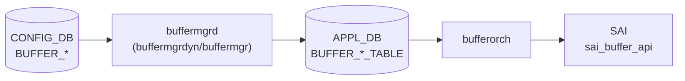

# APPL_DB BUFFER_* テーブル群

## 概要

[APPL_DB](../../reference/glossary.md#term-appl_db) 上のバッファ関連テーブル群。[CONFIG_DB](../../reference/glossary.md#term-config_db) の `BUFFER_POOL` / `BUFFER_PROFILE` / `BUFFER_PG` / `BUFFER_QUEUE` / `BUFFER_PORT_*_PROFILE_LIST` テーブルを `buffermgrd`（`buffermgrdyn` または `buffermgr`）が変換・展開して書き込む。`orchagent` の `BufferOrch` がこれを購読し、[SAI](../../reference/glossary.md#term-sai) `sai_buffer_api` を通じてハードウェアに反映する[^buforch]。

テーブル名定数は `sonic-swss-common/common/schema.h` に定義される[^schema]。

## テーブル一覧

| APPL_DB テーブル名 | 定数名 | 対応 CONFIG_DB テーブル |
|-------------------|--------|------------------------|
| `BUFFER_POOL_TABLE` | `APP_BUFFER_POOL_TABLE_NAME` | `BUFFER_POOL` |
| `BUFFER_PROFILE_TABLE` | `APP_BUFFER_PROFILE_TABLE_NAME` | `BUFFER_PROFILE` |
| `BUFFER_PG_TABLE` | `APP_BUFFER_PG_TABLE_NAME` | `BUFFER_PG` |
| `BUFFER_QUEUE_TABLE` | `APP_BUFFER_QUEUE_TABLE_NAME` | `BUFFER_QUEUE` |
| `BUFFER_PORT_INGRESS_PROFILE_LIST_TABLE` | `APP_BUFFER_PORT_INGRESS_PROFILE_LIST_NAME` | `BUFFER_PORT_INGRESS_PROFILE_LIST` |
| `BUFFER_PORT_EGRESS_PROFILE_LIST_TABLE` | `APP_BUFFER_PORT_EGRESS_PROFILE_LIST_NAME` | `BUFFER_PORT_EGRESS_PROFILE_LIST` |

## データフロー



## key 構造

```text
BUFFER_POOL_TABLE|<pool-name>
BUFFER_PROFILE_TABLE|<profile-name>
BUFFER_PG_TABLE|<port-name>|<pg-range>
BUFFER_QUEUE_TABLE|<port-name>|<queue-range>
BUFFER_PORT_INGRESS_PROFILE_LIST_TABLE|<port-name>
BUFFER_PORT_EGRESS_PROFILE_LIST_TABLE|<port-name>
```

VoQ スイッチ環境では `BUFFER_PG_TABLE` / `BUFFER_QUEUE_TABLE` のキーが 4 トークン形式になる（`<hostname>|<asic>|<port>|<range>`）。

## 主要フィールド

### BUFFER_POOL_TABLE

| フィールド | 型 | 省略条件 | 説明 |
|-----------|---|---------|------|
| `type` | enum `ingress`/`egress` | 常に書き込み | プールの方向。`both` は `BUFFER_EGRESS` に折り畳まれる（後述） |
| `mode` | enum `static`/`dynamic` | 常に書き込み | 閾値モード |
| `size` | uint64 (bytes) | dynamic_size 条件成立時スキップ | プールサイズ。Lua plugin が後から書き込む場合がある |
| `xoff` | uint64 (bytes) | SHP 未設定時省略 | Shared Headroom Pool サイズ |

### BUFFER_PROFILE_TABLE

| フィールド | 型 | 省略条件 | 説明 |
|-----------|---|---------|------|
| `pool` | string | 常に書き込み | 参照プール名 |
| `size` | uint64 (bytes) | 常に書き込み | reserved バッファサイズ |
| `xon` | uint64 (bytes) | lossy profile は省略 | XON 閾値 |
| `xon_offset` | uint64 (bytes) | 値が空のとき省略 | XON オフセット |
| `xoff` | uint64 (bytes) | lossy profile は省略 | XOFF 閾値 |
| `dynamic_th` | int8 | `static_th` と排他 | dynamic threshold (alpha 値) |
| `static_th` | uint64 (bytes) | `dynamic_th` と排他 | static threshold |
| `headroom_type` | string | CONFIG_DB からの転写時のみ | bufferorch で無視（SAI 非反映） |
| `packet_discard_action` | string `drop`/`trim` | 値が空のとき省略 | パケット廃棄アクション |

### BUFFER_PG_TABLE / BUFFER_QUEUE_TABLE

| フィールド | 型 | 省略条件 | 説明 |
|-----------|---|---------|------|
| `profile` | string (profile 名) | 常に書き込み | 参照プロファイル名 |

### BUFFER_PORT_INGRESS/EGRESS_PROFILE_LIST_TABLE

| フィールド | 型 | 省略条件 | 説明 |
|-----------|---|---------|------|
| `profile_list` | string (カンマ区切り) | 常に書き込み | 適用プロファイルリスト |

## 購読者

- **`buffermgrdyn`** (`docker-swss`): dynamic buffer model 時に CONFIG_DB を変換して APPL_DB に書き込む
- **`buffermgr`** (`docker-swss`): static buffer model 時（pass-through に近い）
- **`BufferOrch`** (`orchagent`): APPL_DB を購読して SAI に反映

## 関連 CONFIG_DB / YANG / CLI

- 関連 CONFIG_DB: `BUFFER_POOL`、`BUFFER_PROFILE`、`BUFFER_PG`、`BUFFER_QUEUE`
- 関連 [YANG](../../reference/glossary.md#term-yang): `sonic-buffer-pool`、`sonic-buffer-profile`
- 関連 CLI: `config buffer`、`show buffer pool`、`show buffer profile`

<!-- defaults -->
## コード由来の暗黙デフォルト / 実装乖離 (Phase A)

### `type=both` — buffermgrdyn が内部で `BUFFER_EGRESS` に折り畳む (乖離)

`buffermgrdyn.cpp` L2544-2549:

```cpp
if (value == buffer_value_ingress)
    bufferPool.direction = BUFFER_INGRESS;
else
    bufferPool.direction = BUFFER_EGRESS;  // "both" はここに落ちる
```

APPL_DB に書き込まれる `type` フィールドは raw 文字列（`"both"`）をそのまま転写するため [SAI](../../reference/glossary.md#term-sai) 側には `SAI_BUFFER_POOL_TYPE_BOTH` が届く。しかし buffermgrdyn の内部キャッシュは `BUFFER_EGRESS` として扱うため、headroom 計算では ingress 側プールとして参照されない可能性がある。

### `size` (BUFFER_POOL_TABLE) — dynamic_size 時は Lua plugin へサイレント委譲

`buffermgrdyn.cpp` L2525/2534: `size` フィールドが CONFIG_DB に存在しない場合、`bufferPool.dynamic_size = true` を立て APPL_DB への書き込みを遅延する。実効サイズは Mellanox/Barefoot の Lua plugin (`buffer_pool_<platform>.lua`) が MMU 使用量から逆算して書き込む。さらに `ingress_lossless_pool` において `overSubscribeRatio` 非ゼロかつ SHP が size で有効でない場合、`dontUpdatePoolToDb=true` となり直接書き込みが完全にスキップされる (`buffermgrdyn.cpp` L2555-2628)。

### `xoff` (BUFFER_POOL_TABLE) — 省略 = 0 相当

`updateBufferPoolToDb()` (L878-879): `pool.xoff.empty()` のとき `xoff` フィールドを APPL_DB に書き込まない。`bufferorch.cpp` はフィールド不在を SHP なしと解釈し、`publishSHPSize()` を呼ばない (L549-554)。

### `xon` / `xoff` (BUFFER_PROFILE_TABLE) — lossy profile では APPL_DB に存在しない

`updateBufferProfileToDb()` (L903-910): `profile.lossless == false` のとき `xon`、`xon_offset`、`xoff` フィールドを書き込まない。bufferorch は `xoff` フィールドの有無でロスレス判定を行う (L851)。

### `xon_offset` (BUFFER_PROFILE_TABLE) — 省略 = ASIC デフォルト

`xon_offset` が空文字列のとき APPL_DB に書き込まれない (L906-908)。bufferorch はフィールド不在を無視するため SAI の `SAI_BUFFER_PROFILE_ATTR_XON_OFFSET_TH` は設定されない。

### `headroom_type` (BUFFER_PROFILE_TABLE) — bufferorch で dead field (乖離)

`bufferorch.cpp` L748-752:

```cpp
else {
    SWSS_LOG_ERROR("Unknown buffer profile field specified:%s, ignoring", field.c_str());
    continue;
}
```

`headroom_type` は `else` 分岐に落ちて `LOG_ERROR` + skip される。CONFIG_DB / YANG には定義があるが SAI 経路では完全に無視される。

### `dynamic_th` / `static_th` — threshold type が create-only (乖離)

`bufferorch.cpp` L692-713: SAI オブジェクトが既存の場合（プロファイル更新時）、`SAI_BUFFER_PROFILE_ATTR_THRESHOLD_MODE` の書き込みをスキップする（LOG_INFO のみ）。threshold 値 (`SHARED_DYNAMIC_TH` / `SHARED_STATIC_TH`) 自体は更新されるが、モード切り替え（`dynamic_th` → `static_th` の変更など）は SAI に反映されない。

### threshold_mode 自動決定

`updateBufferProfileToDb()` L901:

```cpp
const string &&mode = profile.threshold_mode.empty() ? getPgPoolMode() + "_th" : profile.threshold_mode;
```

threshold_mode が未設定のとき、ingress_lossless_pool の `mode` フィールド (`"dynamic"` / `"static"`) に `"_th"` を付加した値 (`"dynamic_th"` / `"static_th"`) を自動採用する。CONFIG_DB に `dynamic_th` / `static_th` フィールドを明示していない場合でも、APPL_DB にはどちらかが必ず書き込まれる。

### `packet_discard_action` (BUFFER_PROFILE_TABLE) — 省略 = drop 相当

フィールドが APPL_DB に存在しない場合、bufferorch は SAI 属性を設定しない（= ASIC デフォルト動作 = パケット DROP）。`"trim"` を設定した場合のみ `SAI_BUFFER_PROFILE_PACKET_ADMISSION_FAIL_ACTION_DROP_AND_TRIM` が渡る (L730-744)。

### `profile` (BUFFER_PG_TABLE / BUFFER_QUEUE_TABLE) — 不在時は retry

`bufferorch.cpp:processPriorityGroup()` / `processQueue()`: `profile` フィールドが不在または参照先プロファイルが未登録の場合 `task_need_retry` を返す。ゼロプロファイル（名前に `_zero_` を含む）は flex counter の追加をスキップする (L995)。

### 書き込みルート別フィールド扱い早見表

| フィールド | buffermgrdyn (dynamic) | buffermgr (static) | bufferorch (SAI) |
|-----------|----------------------|-------------------|-----------------|
| BUFFER_POOL: `type` | raw 転写 (`both`→内部 EGRESS) | pass-through | SAI create-only |
| BUFFER_POOL: `mode` | raw 転写 | pass-through | SAI create-only |
| BUFFER_POOL: `size` | dynamic_size フラグ制御 | pass-through | `SAI_BUFFER_POOL_ATTR_SIZE` |
| BUFFER_POOL: `xoff` | SHP 計算結果 (空なら省略) | pass-through | `SAI_BUFFER_POOL_ATTR_XOFF_SIZE` |
| BUFFER_PROFILE: `pool` | `pool_name` から転写 | pass-through | SAI create-only |
| BUFFER_PROFILE: `size` | Lua 計算値 or 指定値 | pass-through | `SAI_BUFFER_PROFILE_ATTR_BUFFER_SIZE` |
| BUFFER_PROFILE: `xon` | lossless のみ | pass-through | `SAI_BUFFER_PROFILE_ATTR_XON_TH` |
| BUFFER_PROFILE: `xoff` | lossless のみ | pass-through | `SAI_BUFFER_PROFILE_ATTR_XOFF_TH` |
| BUFFER_PROFILE: `headroom_type` | 転写のみ | pass-through | LOG_ERROR + skip |
| BUFFER_PROFILE: `dynamic_th` | 自動決定 or 指定値 | pass-through | mode は create-only、値は更新可 |

> **証跡**: `bufferorch.h` L18-35 全行読了、`bufferorch.cpp` L391-1000 全行読了、`buffermgrdyn.cpp` L870-960 全行読了、`schema.h` BUFFER 定数確認済み。
<!-- /defaults -->

<!-- failure -->
## 失敗・retry 挙動 (Phase D)

`BufferOrch::doTask()` (`bufferorch.cpp` L2096-2129) は per-table handler が返す `task_process_status` を一括処理する。ステータスごとの最終挙動は以下のとおり[^buforch]。

| ステータス | doTask の動作 | 残タスク処理 | ログ |
|---|---|---|---|
| `task_success` / `task_ignore` | `m_toSync` から該当エントリを erase | 次タスクへ継続 | なし |
| `task_invalid_entry` | erase | 次タスクへ継続 | `LOG_ERROR ("Failed to process invalid buffer task")` |
| `task_failed` | erase | **その回の doTask を `return` で打ち切り** | `LOG_ERROR ("Failed to process buffer task, drop it")` |
| `task_need_retry` | erase せず `it++` で次回まで保留 | 次タスクへ継続 | `LOG_INFO ("Failed to process buffer task, retry it")` |
| handler 未登録 | erase | 次タスクへ継続 | `LOG_ERROR ("No handler for key:%s found")` |

> `task_failed` のみ doTask 関数全体を return で抜けるため、後続のキューイング済みタスクは次回ディスパッチまで処理されない。`task_invalid_entry` は LOG レベルが ERROR でも処理続行する点に注意。

### 主要 handler ごとの retry / failed 条件

| handler | retry になる条件 (`task_need_retry`) | failed になる条件 (`task_failed`) |
|---|---|---|
| `processBufferPool()` (L391-596) | 削除対象 pool が pending-remove / 削除対象 pool が他オブジェクト参照中 / SAI 一時エラー (`handleSaiSetStatus` 経由) | — (SAI 致命系のみ) |
| `processBufferProfile()` (L602-888) | 削除対象 profile が pending-remove / `pool` 参照が `not_resolved` (= pool 未登録) / PG・Queue から参照中 | `pool` 参照 resolve その他失敗 / 数値フィールドのパース失敗 / `packet_discard_action` が `drop`/`trim` 以外 |
| `processQueue()` (L914-1233) | `profile` 参照 `not_resolved` (= profile 未登録) / queue がロック中 (`LOG_WARN "...is locked, will retry"`, L1068-1070) | `profile` 参照 resolve その他失敗 |
| `processPriorityGroup()` (L1305-1495) | `profile` 参照 `not_resolved` | `profile` resolve その他失敗 / 参照 profile が **trimming-eligible** (`SAI_BUFFER_PROFILE_PACKET_ADMISSION_FAIL_ACTION_DROP_AND_TRIM` を持つ profile を PG に貼ろうとした場合、L1382-1388) |
| `processIngressBufferProfileList()` (L1663-) / `processEgressBufferProfileList()` (L1845-) | profile-list 内のいずれかの profile が `not_resolved` | profile-list resolve その他失敗 / list 内に trimming-eligible profile 混在 |

### handler 内の特殊な 2 段 retry (profile only)

`processBufferProfile()` L778-797 では、`sai_set_buffer_profile_attribute()` が失敗した場合に **bufferorch 自身が同じ attr で SAI をもう一度呼ぶ**:

```cpp
SWSS_LOG_NOTICE("Unable to modify buffer profile, ... will retry one more time", ...);
sai_status = sai_buffer_api->set_buffer_profile_attribute(sai_object, &attribute);
if (SAI_STATUS_SUCCESS != sai_status) {
    SWSS_LOG_ERROR("Failed to modify buffer profile, ... will retry once", ...);
    handle_status = handleSaiSetStatus(SAI_API_BUFFER, sai_status);
    ...
}
```

これは `task_need_retry` での次回 doTask 待ちとは別のループ内 retry で、SAI ベンダ実装の transient エラー吸収用。`processBufferPool()` 側にはこの即時 retry はなく、初回失敗で即 `handleSaiSetStatus()` に委譲する (L513-521)。

### SAI 失敗の共通変換: `handleSaiSetStatus` / `handleSaiCreateStatus` / `handleSaiRemoveStatus`

bufferorch は SAI 戻り値を直接 enum 化せず、`orch.cpp` 共通の `handleSai*Status()` を経由する。これらは `SAI_STATUS_SUCCESS` 以外を retry/failed/ignore/abort のいずれかに翻訳する。`SAI_STATUS_ATTR_NOT_IMPLEMENTED_0` のみ bufferorch 側で先取りして `task_ignore` を返す (L508-512 / L773-777)。

### 致命的でないが LOG_WARN を出す経路

| 条件 | 挙動 | evidence |
|---|---|---|
| queue ロック中 | `task_need_retry` + `LOG_WARN ("Queue %zd on port %s is locked, will retry")` | `bufferorch.cpp:1068-1070` |
| port link-up 後に queue/PG プロファイルを適用 | handler は処理続行 (警告のみ) | `bufferorch.cpp:1220-1227` |

### 入力検証で `task_invalid_entry` になる主なケース

- `type` が `ingress`/`egress` 以外 (`processBufferPool`, L457)
- `mode` が `static`/`dynamic` 以外 (`processBufferPool`, L484)
- key トークン数違反 (queue: 2 or 4, PG: 2, L920/L944/L1322)
- port alias 未登録 (`processQueue` L1035 / profile-list L1113)
- voq/queue index 範囲外 (L1053-1064)
- op が SET/DEL 以外 (L593, L885, L1013, L1188)

### 詳細マトリクス

handler ごと・行番号付きの完全な失敗・retry 分岐マトリクス、ディスパッチャ挙動表、grep カバレッジは中間ファイル参照:

- `meta/_intermediate/cdb-flow/appl-buffer-failure.md`

> **証跡**: `bufferorch.cpp` 全 2138 行のうち、`task_need_retry` × 12 / `task_failed` × 10 / `task_invalid_entry` × 17 / `task_ignore` × 3 / `handleSai*Status` × 9 hit を全件確認。`doTask()` の switch 句 (L2107-2128) も精読。

<!-- /failure -->

<!-- side-effects -->
## 副次 DB 書込 (Phase F)

`BufferOrch` は APPL_DB の `BUFFER_*_TABLE` を購読して SAI に反映するのが主目的だが、**STATE_DB / COUNTERS_DB / FLEX_COUNTER_DB** にも副次的に書き込む。SET/DEL ハンドラとは別経路で発火するものを含めて以下に整理する[^buforch]。

### STATE_DB

| 操作 | テーブル / キー | フィールド | トリガ | evidence |
|------|----------------|-----------|--------|----------|
| set | `BUFFER_MAX_PARAM_TABLE\|global` (定数 `STATE_BUFFER_MAXIMUM_VALUE_TABLE`) | `mmu_size` (bytes; `SAI_SWITCH_ATTR_MAX_BUFFER_SIZE` × 1024) | `BufferOrch` ctor の `getMMUSize()` で起動時 1 回のみ | `bufferorch.cpp:53-62, 206-230` |

> SET/DEL ハンドラ自体は STATE_DB に書込まない。STATE_DB は MMU 全体サイズの公開専用。

### COUNTERS_DB

`CounterNameMapUpdater("COUNTERS_DB", COUNTERS_BUFFER_POOL_NAME_MAP)` を介して name→OID マップを更新する。

| 操作 | テーブル / キー | 値 | 条件 | evidence |
|------|----------------|----|------|----------|
| HSET | `COUNTERS_BUFFER_POOL_NAME_MAP` | field=`<pool_name>` value=`<sai_object_id>` | `processBufferPool()` の SET で SAI `create_buffer_pool()` 成功直後 | `bufferorch.cpp:546` |
| HDEL | `COUNTERS_BUFFER_POOL_NAME_MAP` | field=`<pool_name>` | `processBufferPool()` の DEL で `remove_buffer_pool()` 成功後 | `bufferorch.cpp:586` |

BUFFER_PROFILE / PG / Queue / PROFILE_LIST には pool 相当の name map 書込みはない (PG/Queue の name map は PortsOrch 側で管理)。ただし `processQueue()` / `processPriorityGroup()` は profile attach/detach 成功直後に `FlexCounterOrch::isCreateOnlyConfigDbBuffers()` が true のとき `gPortsOrch->createPortBufferQueueCounters()` / `createPortBufferPgCounters()` (or remove 系) を呼び、PortsOrch 経由で COUNTERS_DB の `COUNTERS_QUEUE_NAME_MAP` / `COUNTERS_PG_NAME_MAP` と FLEX_COUNTER_DB の queue/PG group を更新する (`bufferorch.cpp:1138-1152, 1513-1525`)。VOQ スイッチ (`gMySwitchType == "voq"`) ではこの経路はスキップされ FlexCounterOrch 側で一括登録される。

### FLEX_COUNTER_DB

`flex_counter_manager` の自由関数経由で `FLEX_COUNTER_GROUP_TABLE` / `FLEX_COUNTER_TABLE` を更新する。

| 操作 | テーブル / キー | フィールド | 条件 | evidence |
|------|----------------|-----------|------|----------|
| set | `FLEX_COUNTER_GROUP_TABLE\|BUFFER_POOL_WATERMARK_STAT_COUNTER` | `POLL_INTERVAL`, `BUFFER_POOL_PLUGIN` (Lua sha) | `BufferOrch` ctor → `initFlexCounterGroupTable()`、起動時 1 回 | `bufferorch.cpp:232-251` |
| set | 同上 | `STATS_MODE` = `STATS_AND_CLEAR` | `generateBufferPoolWatermarkCounterIdList()` 内、全 pool が watermark clear をサポート (`noWmClrCapability == 0`) | `bufferorch.cpp:332-336` |
| set | `FLEX_COUNTER_TABLE\|BUFFER_POOL_WATERMARK_STAT_COUNTER:<sai_pool_oid>` | `BUFFER_POOL_COUNTER_ID_LIST`, `STATS_MODE` | `generateBufferPoolWatermarkCounterIdList()` で `m_buffer_type_maps[APP_BUFFER_POOL_TABLE_NAME]` の全 pool に対し 1 回ずつ。clear 非対応 pool だけ `STATS_MODE_READ` 個別設定 | `bufferorch.cpp:340-359` |
| del | `FLEX_COUNTER_TABLE\|BUFFER_POOL_WATERMARK_STAT_COUNTER:<sai_pool_oid>` | キー全体 | `processBufferPool()` の DEL 経路、`m_isBufferPoolWatermarkCounterIdListGenerated` が true のときのみ | `bufferorch.cpp:276-284, 571` |

`m_isBufferPoolWatermarkCounterIdListGenerated` フラグで FLEX_COUNTER のエコー再起動による多重登録を防止する。watermark Lua plugin (`watermark_bufferpool.lua`) は ctor で `loadRedisScript()` され、ハッシュ sha が group に登録される。

### APPL_STATE_DB (ResponsePublisher)

`Orch::m_publisher.publish()` 経由で APPL_STATE_DB の応答チャネルに成功応答を流す（データ書込みではなく ack 通知）:

| 操作 | テーブル | 内容 | 条件 | evidence |
|------|---------|------|------|----------|
| publish | `BUFFER_POOL_TABLE` | `xoff=<value>` (force=true) | `processBufferPool()` SET 成功 かつ `xoff` 非空 (SHP 有効時) | `bufferorch.cpp:551-556` |
| publish | `BUFFER_POOL_TABLE` | 空 fvs (force=true) | `processBufferPool()` DEL 成功 | `bufferorch.cpp:587-589` |
| publish | `BUFFER_PROFILE_TABLE` | 全 fvs (force=true) | `processBufferProfile()` SET 成功 (新規 + 更新の両方) | `bufferorch.cpp:832, 880` |

主に buffermgrdyn の SHP 計算同期 (`xoff` 確定の上位通知) と config-validator 連携に使われる。

### 副次書込の発火順序 (BUFFER_POOL 新規 SET の例)

1. APPL_DB から `BUFFER_POOL_TABLE|<name>` SET を consume
2. `sai_buffer_api->create_buffer_pool()` → ASIC_DB
3. in-memory map (`m_buffer_type_maps[APP_BUFFER_POOL_TABLE_NAME]`) を更新
4. **COUNTERS_DB** `COUNTERS_BUFFER_POOL_NAME_MAP` に `<name>` → `<oid>` HSET
5. (xoff 非空時) **APPL_STATE_DB** ResponsePublisher に publish
6. (FlexCounterOrch から後段で呼出時) **FLEX_COUNTER_DB** の `FLEX_COUNTER_TABLE` に per-pool エントリを登録

### 検証コマンド (実機 dump)

```sh
# STATE_DB MMU max
redis-cli -n 6 hgetall 'BUFFER_MAX_PARAM_TABLE|global'

# COUNTERS_DB buffer pool name map
redis-cli -n 2 hgetall COUNTERS_BUFFER_POOL_NAME_MAP

# FLEX_COUNTER_DB
redis-cli -n 5 keys 'FLEX_COUNTER_GROUP_TABLE|BUFFER_POOL_WATERMARK*'
redis-cli -n 5 keys 'FLEX_COUNTER_TABLE|BUFFER_POOL_WATERMARK*'
```

### 詳細マトリクス

完全な行番号付き分析・PortsOrch 間接経路の詳細・grep カバレッジは中間ファイル参照:

- `meta/_intermediate/cdb-flow/appl-buffer-side.md`

> **証跡**: `bufferorch.cpp` 内の `STATE_BUFFER_MAXIMUM_VALUE_TABLE` × 2 / `m_counterNameMapUpdater` × 3 / `setFlexCounterGroup*` × 2 / `startFlexCounterPolling` × 1 / `stopFlexCounterPolling` × 1 / `m_publisher.publish` × 4 / `createPortBufferQueueCounters` × 1 / `createPortBufferPgCounters` × 1 を全件確認。

<!-- /side-effects -->

<!-- platform -->
## プラットフォーム差 (Phase H)

`BufferOrch` は単一バイナリで動作するが、(a) `gMySwitchType == "voq"` の chassis VOQ 経路、(b) SAI capability の動的判定、(c) ベンダ buffer pool Lua plugin、の 3 点でプラットフォーム差が生まれる[^buforch]。BUFFER_PG / BUFFER_QUEUE の **PG/queue index → SAI oid マッピング自体は `portsorch` 側に閉じている** ため、Broadcom / Mellanox の物理マップ差は bufferorch には現れない。

### 1. VOQ chassis (Cisco 8000 系) の経路差

| 行 | 差分 | non-VOQ | VOQ (`gMySwitchType == "voq"`) |
|---|---|---|---|
| L116/L132 | BUFFER_QUEUE_TABLE 初期化 | `initBufferReadyList()` | `initVoqBufferReadyList()` (system port ベース) |
| L916 | BUFFER_QUEUE_TABLE key tokens | 2 (`<port>\|<range>`) | 4 (`<host>\|<asic>\|<port>\|<range>`) |
| L1049 | queue id 解決 | `port.m_queue_ids[ind]` | `gPortsOrch->getPortVoQIds(port)[ind]` |
| L1066-1070 | queue lock retry | あり (`task_need_retry`) | なし |
| L1134-1136 | Port Queue Counter 自動登録 | bufferorch が登録 | `flexcounterorch` が一括登録するため bufferorch ではスキップ |
| L1166-1168 | port ref counter 更新 | あり | なし (system port は静的) |
| L2079 | `doTask()` 起動ガード | `isConfigDone()` | `isInitDone()` |

BUFFER_PG_TABLE には VOQ 分岐がなく、PG キーは VOQ chassis でも 2 トークン (`<port>\|<range>`)。

### 2. SAI capability 動的判定 (ASIC ベンダ依存)

bufferorch は静的にベンダ名を判定せず、**SAI 戻り値で実行時に capability を検出する**。

| 経路 | 行 | NOT_IMPLEMENTED 時の挙動 | 影響範囲 |
|---|---|---|---|
| `clear_buffer_pool_stats` | L310-322 | `noWmClrCapability` ビットマスクに記録 (32 プールまで) | watermark clear API (pool 単位で個別) |
| `set_buffer_pool_attribute` | L506-512 | `task_ignore` | BUFFER_POOL_TABLE 属性 SET |
| `set_buffer_profile_attribute` | L773-777 | `task_ignore` | **`xon_offset`** / `packet_discard_action=trim` 等 ASIC 非対応 attr |

→ `xon_offset` (`SAI_BUFFER_PROFILE_ATTR_XON_OFFSET_TH`) を非対応な ASIC では bufferorch が `task_ignore` で握り潰す。CONFIG_DB / APPL_DB に値が残っていてもハードウェアには反映されない (silent skip)。`packet_discard_action=trim` も同様で、加えて trimming-eligible profile を PG / profile-list に貼ろうとすると `task_failed` になる (L1382-1388 / L1728 / L1918)[^buforch]。

### 3. dynamic / static buffer model のベンダ別配布

`BUFFER_POOL_TABLE.size` が空の場合の挙動はビルド時の選択で変わる:

| ベンダ | model | size 空時の挙動 |
|---|---|---|
| Mellanox SN シリーズ | dynamic (`buffermgrdyn`) | `buffer_pool_mlnx.lua` が SAI MMU から逆算して APPL_DB に書き戻す |
| Barefoot Tofino | dynamic (`buffermgrdyn`) | `buffer_pool_bfn.lua` |
| Broadcom (多くの platform) | static (`buffermgr`) | CONFIG_DB を pass-through (空なら空のまま) |

dynamic vs static の選択は `device/<vendor>/<platform>/<HWSKU>/buffers_dynamic.json.j2` の配布有無で決まり、bufferorch 側は感知しない (APPL_DB の値を SAI に流すだけ)。

### 4. PG / queue index 上限は portsorch から借用

bufferorch は PG / queue の SAI oid を **`portsorch` が `SAI_PORT_ATTR_INGRESS_PRIORITY_GROUP_LIST` / `SAI_PORT_ATTR_QOS_QUEUE_LIST` で取得済み** の `port.m_priority_group_ids` / `port.m_queue_ids` を index アクセスするのみ。範囲外 (`m_queue_ids.size() <= ind`) は `task_invalid_entry` (L1058-1061)。Broadcom (8 PG × 8 queue) と Mellanox (同 8/8 だが内部 buffer 構造が異なる) の物理マップ差は SAI ベンダ実装に閉じる。

### 5. multi-asic namespace

multi-asic non-VOQ (T2 chassis BGP-only 等) では `BUFFER_*` は各 `asicX` namespace の独立 bufferorch インスタンスで処理される。VOQ chassis では `gMyHostName` / `gMyAsicName` と key の先頭 2 トークンを比較し (L1062-1064)、自 ASIC 配下を `local_port = true` として SAI bind、他 ASIC ぶんは ready list 管理のみ。

### 詳細

行番号付き完全マトリクスは中間ファイル参照:

- `meta/_intermediate/cdb-flow/appl-buffer-platform.md`

> **証跡**: `bufferorch.cpp` の `gMySwitchType` 5 hit / `SAI_STATUS_NOT_IMPLEMENTED` 3 hit / `SAI_STATUS_NOT_SUPPORTED` 1 hit を全件確認。VOQ 分岐の L116/L132/L916/L1049/L1136/L1168/L2079、capability 経路の L310-322/L506-512/L773-777 を精読。

<!-- /platform -->

<!-- constants -->
## ハードコード定数 (Phase E)

`bufferorch.cpp` / `bufferorch.h` / `buffer/bufferschema.h` に固定された文字列・列挙値定数の一覧。フィールド名・列挙値文字列はすべて C++ ヘッダで `const string` として定義されており、CLI / YANG / API いずれの層でも同じ綴りを要求する。

### フィールド名定数 (`bufferorch.h`)

| 定数名 | 値 | 行 |
|---|---|---|
| `buffer_size_field_name` | `"size"` | `bufferorch.h:18` |
| `buffer_pool_type_field_name` | `"type"` | `bufferorch.h:19` |
| `buffer_pool_mode_field_name` | `"mode"` | `bufferorch.h:20` |
| `buffer_pool_field_name` | `"pool"` | `bufferorch.h:21` |
| `buffer_pool_xoff_field_name` | `"xoff"` | `bufferorch.h:24` |
| `buffer_xon_field_name` / `buffer_xon_offset_field_name` / `buffer_xoff_field_name` | `"xon"` / `"xon_offset"` / `"xoff"` | `bufferorch.h:25-27` |
| `buffer_dynamic_th_field_name` / `buffer_static_th_field_name` | `"dynamic_th"` / `"static_th"` | `bufferorch.h:28-29` |
| `buffer_profile_field_name` / `buffer_profile_list_field_name` | `"profile"` / `"profile_list"` | `bufferorch.h:30, 34` |
| `buffer_headroom_type_field_name` | `"headroom_type"` (bufferorch では dead field) | `bufferorch.h:35` |

### 列挙値文字列 (`bufferorch.h`)

| 定数名 | 値 | 用途 |
|---|---|---|
| `buffer_value_ingress` / `buffer_value_egress` / `buffer_value_both` | `"ingress"` / `"egress"` / `"both"` | `BUFFER_POOL.type` (`bufferorch.h:31-33`) |
| `buffer_pool_mode_dynamic_value` / `buffer_pool_mode_static_value` | `"dynamic"` / `"static"` | `BUFFER_POOL.mode` (`bufferorch.h:22-23`) |

`type` / `mode` は if-else 直接比較で、許容値以外は `task_invalid_entry` (`bufferorch.cpp:457, 484`)。

### `packet_discard_action` 関連 (`buffer/bufferschema.h`)

| 定数名 | 値 | 行 |
|---|---|---|
| `BUFFER_PROFILE_PACKET_DISCARD_ACTION` | `"packet_discard_action"` | `bufferschema.h:8` |
| `BUFFER_PROFILE_PACKET_DISCARD_ACTION_DROP` | `"drop"` | `bufferschema.h:5` |
| `BUFFER_PROFILE_PACKET_DISCARD_ACTION_TRIM` | `"trim"` | `bufferschema.h:6` |

`drop` / `trim` 以外の値は `task_failed` (`bufferorch.cpp:743`)。

### flex counter group 定数 (`bufferorch.h`)

| 定数名 | 値 | 用途 | 行 |
|---|---|---|---|
| `BUFFER_POOL_WATERMARK_STAT_COUNTER_FLEX_COUNTER_GROUP` | `"BUFFER_POOL_WATERMARK_STAT_COUNTER"` | flex counter group 名 | `bufferorch.h:15` |
| `BUFFER_POOL_WATERMARK_FLEX_STAT_COUNTER_POLL_MSECS` | `"60000"` (= 60 秒) | poll 間隔ミリ秒 | `bufferorch.h:16` |

poll 間隔は 60 秒固定でランタイム変更不可。

### ゼロプロファイル命名規約 — `_zero_` 部分文字列

flex counter スキップ判定として、プロファイル名に `_zero_` を含むか否かを `find()` で評価する暗黙の命名契約がある。

| 行 | 文脈 |
|---|---|
| `bufferorch.cpp:378` | `processBufferProfile()` 削除時の参照中ゼロプロファイル除外 |
| `bufferorch.cpp:995, 1017` | `processQueue()` の counter 追加 / 旧プロファイル判定 |
| `bufferorch.cpp:1400, 1421` | `processPriorityGroup()` の counter 追加 / 旧プロファイル判定 |

`*_zero_*` 命名規約は YANG / CONFIG_DB スキーマには現れないが、ゼロプロファイル運用には必須。

### スイッチタイプ判定リテラル

`gMySwitchType` との比較に直接書かれている文字列。

| 値 | 行 | 分岐内容 |
|---|---|---|
| `"dpu"` | `bufferorch.cpp:64` | `initBufferConstants()` をスキップ |
| `"voq"` | `bufferorch.cpp:116, 132, 916, 1049, 1136, 1168, 2079` | VoQ 用 key 4 トークン形式 / remote port 扱い / queue counter スキップ |

### 主要 SAI 属性 / 列挙値 ID 定数

`bufferorch.cpp` から SAI に渡される代表的な定数。完全リストは中間ファイル参照。

| SAI 定数 | 用途 | 行 |
|---|---|---|
| `SAI_BUFFER_POOL_ATTR_SIZE` / `_TYPE` / `_THRESHOLD_MODE` / `_XOFF_SIZE` | pool 4 属性 | `bufferorch.cpp:427, 460, 487, 493` |
| `SAI_BUFFER_POOL_TYPE_{INGRESS,EGRESS,BOTH}` | `type` 列挙 SAI 値 | `bufferorch.cpp:445, 449, 453` |
| `SAI_BUFFER_POOL_THRESHOLD_MODE_{DYNAMIC,STATIC}` | `mode` 列挙 SAI 値 | `bufferorch.cpp:476, 480` |
| `SAI_BUFFER_PROFILE_ATTR_POOL_ID` / `BUFFER_SIZE` / `XON_TH` / `XON_OFFSET_TH` / `XOFF_TH` | profile 主要属性 | `bufferorch.cpp:661, 686, 668, 674, 680` |
| `SAI_BUFFER_PROFILE_ATTR_THRESHOLD_MODE` / `SHARED_{DYNAMIC,STATIC}_TH` | threshold (mode は create-only) | `bufferorch.cpp:699, 704, 717, 722` |
| `SAI_BUFFER_PROFILE_ATTR_PACKET_ADMISSION_FAIL_ACTION` + `_DROP` / `_DROP_AND_TRIM` | discard action | `bufferorch.cpp:728, 732, 736` |
| `SAI_BUFFER_POOL_STAT_WATERMARK_BYTES` / `_XOFF_ROOM_WATERMARK_BYTES` | flex counter stat 2 種 | `bufferorch.cpp:31-32` |
| `SAI_STATUS_ATTR_NOT_IMPLEMENTED_0` | pool/profile SET 時のみ先取り `task_ignore` 化 | `bufferorch.cpp:508, 773` |
| `SAI_NULL_OBJECT_ID` | OID 未割当判定 (create 経路選択) | 各所 |

### state DB / counters DB リテラル

| リテラル / 定数 | 用途 | 行 |
|---|---|---|
| `STATE_BUFFER_MAXIMUM_VALUE_TABLE` (schema.h 由来) | STATE_DB のテーブル名 | `bufferorch.cpp:57` |
| `"mmu_size"` (フィールド名) / `"global"` (key) | mmu 総量を STATE_DB に書き出す | `bufferorch.cpp:226-227` |
| `COUNTERS_BUFFER_POOL_NAME_MAP` | pool name → OID マップ | `bufferorch.cpp:55` |
| `"COUNTERS_DB"` (DB 名リテラル) | DBConnector 引数 | `bufferorch.cpp:55-56` |

> 詳細スキャン証跡: `meta/_intermediate/cdb-flow/appl-buffer-constants.md`

<!-- /constants -->

## 引用元

[^buforch]: `bufferorch.cpp` — `processBufferPool()` / `processBufferProfile()` / `processPriorityGroup()` / `processQueue()`. <https://github.com/sonic-net/sonic-swss/blob/4305596156d70e9797e8a881b3d19b46de0bce0d/orchagent/bufferorch.cpp>

[^schema]: `sonic-swss-common/common/schema.h` — `APP_BUFFER_*_TABLE_NAME` 定数. <https://github.com/sonic-net/sonic-swss-common/blob/158de8d3463ff4b841653f6d57190bb142b80d9c/common/schema.h>
