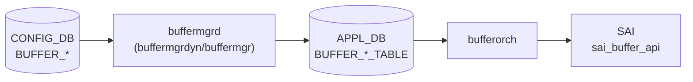

# APPL_DB BUFFER_* テーブル群

## 概要

[APPL_DB](../../reference/glossary.md#term-appl_db) 上のバッファ関連テーブル群。[CONFIG_DB](../../reference/glossary.md#term-config_db) の `BUFFER_POOL` / `BUFFER_PROFILE` / `BUFFER_PG` / `BUFFER_QUEUE` / `BUFFER_PORT_*_PROFILE_LIST` テーブルを `buffermgrd`（`buffermgrdyn` または `buffermgr`）が変換・展開して書き込む。`orchagent` の `BufferOrch` がこれを購読し、[SAI](../../reference/glossary.md#term-sai) `sai_buffer_api` を通じてハードウェアに反映する[^buforch]。

テーブル名定数は `sonic-swss-common/common/schema.h` に定義される[^schema]。

## テーブル一覧

| APPL_DB テーブル名 | 定数名 | 対応 CONFIG_DB テーブル |
|-------------------|--------|------------------------|
| `BUFFER_POOL_TABLE` | `APP_BUFFER_POOL_TABLE_NAME` | `BUFFER_POOL` |
| `BUFFER_PROFILE_TABLE` | `APP_BUFFER_PROFILE_TABLE_NAME` | `BUFFER_PROFILE` |
| `BUFFER_PG_TABLE` | `APP_BUFFER_PG_TABLE_NAME` | `BUFFER_PG` |
| `BUFFER_QUEUE_TABLE` | `APP_BUFFER_QUEUE_TABLE_NAME` | `BUFFER_QUEUE` |
| `BUFFER_PORT_INGRESS_PROFILE_LIST_TABLE` | `APP_BUFFER_PORT_INGRESS_PROFILE_LIST_NAME` | `BUFFER_PORT_INGRESS_PROFILE_LIST` |
| `BUFFER_PORT_EGRESS_PROFILE_LIST_TABLE` | `APP_BUFFER_PORT_EGRESS_PROFILE_LIST_NAME` | `BUFFER_PORT_EGRESS_PROFILE_LIST` |

## データフロー



## key 構造

```text
BUFFER_POOL_TABLE|<pool-name>
BUFFER_PROFILE_TABLE|<profile-name>
BUFFER_PG_TABLE|<port-name>|<pg-range>
BUFFER_QUEUE_TABLE|<port-name>|<queue-range>
BUFFER_PORT_INGRESS_PROFILE_LIST_TABLE|<port-name>
BUFFER_PORT_EGRESS_PROFILE_LIST_TABLE|<port-name>
```

VoQ スイッチ環境では `BUFFER_PG_TABLE` / `BUFFER_QUEUE_TABLE` のキーが 4 トークン形式になる（`<hostname>|<asic>|<port>|<range>`）。

## 主要フィールド

### BUFFER_POOL_TABLE

| フィールド | 型 | 省略条件 | 説明 |
|-----------|---|---------|------|
| `type` | enum `ingress`/`egress` | 常に書き込み | プールの方向。`both` は `BUFFER_EGRESS` に折り畳まれる（後述） |
| `mode` | enum `static`/`dynamic` | 常に書き込み | 閾値モード |
| `size` | uint64 (bytes) | dynamic_size 条件成立時スキップ | プールサイズ。Lua plugin が後から書き込む場合がある |
| `xoff` | uint64 (bytes) | SHP 未設定時省略 | Shared Headroom Pool サイズ |

### BUFFER_PROFILE_TABLE

| フィールド | 型 | 省略条件 | 説明 |
|-----------|---|---------|------|
| `pool` | string | 常に書き込み | 参照プール名 |
| `size` | uint64 (bytes) | 常に書き込み | reserved バッファサイズ |
| `xon` | uint64 (bytes) | lossy profile は省略 | XON 閾値 |
| `xon_offset` | uint64 (bytes) | 値が空のとき省略 | XON オフセット |
| `xoff` | uint64 (bytes) | lossy profile は省略 | XOFF 閾値 |
| `dynamic_th` | int8 | `static_th` と排他 | dynamic threshold (alpha 値) |
| `static_th` | uint64 (bytes) | `dynamic_th` と排他 | static threshold |
| `headroom_type` | string | CONFIG_DB からの転写時のみ | bufferorch で無視（SAI 非反映） |
| `packet_discard_action` | string `drop`/`trim` | 値が空のとき省略 | パケット廃棄アクション |

### BUFFER_PG_TABLE / BUFFER_QUEUE_TABLE

| フィールド | 型 | 省略条件 | 説明 |
|-----------|---|---------|------|
| `profile` | string (profile 名) | 常に書き込み | 参照プロファイル名 |

### BUFFER_PORT_INGRESS/EGRESS_PROFILE_LIST_TABLE

| フィールド | 型 | 省略条件 | 説明 |
|-----------|---|---------|------|
| `profile_list` | string (カンマ区切り) | 常に書き込み | 適用プロファイルリスト |

## 購読者

- **`buffermgrdyn`** (`docker-swss`): dynamic buffer model 時に CONFIG_DB を変換して APPL_DB に書き込む
- **`buffermgr`** (`docker-swss`): static buffer model 時（pass-through に近い）
- **`BufferOrch`** (`orchagent`): APPL_DB を購読して SAI に反映

## 関連 CONFIG_DB / YANG / CLI

- 関連 CONFIG_DB: `BUFFER_POOL`、`BUFFER_PROFILE`、`BUFFER_PG`、`BUFFER_QUEUE`
- 関連 [YANG](../../reference/glossary.md#term-yang): `sonic-buffer-pool`、`sonic-buffer-profile`
- 関連 CLI: `config buffer`、`show buffer pool`、`show buffer profile`

<!-- defaults -->
## コード由来の暗黙デフォルト / 実装乖離 (Phase A)

### `type=both` — buffermgrdyn が内部で `BUFFER_EGRESS` に折り畳む (乖離)

`buffermgrdyn.cpp` L2544-2549:

```cpp
if (value == buffer_value_ingress)
    bufferPool.direction = BUFFER_INGRESS;
else
    bufferPool.direction = BUFFER_EGRESS;  // "both" はここに落ちる
```

APPL_DB に書き込まれる `type` フィールドは raw 文字列（`"both"`）をそのまま転写するため [SAI](../../reference/glossary.md#term-sai) 側には `SAI_BUFFER_POOL_TYPE_BOTH` が届く。しかし buffermgrdyn の内部キャッシュは `BUFFER_EGRESS` として扱うため、headroom 計算では ingress 側プールとして参照されない可能性がある。

### `size` (BUFFER_POOL_TABLE) — dynamic_size 時は Lua plugin へサイレント委譲

`buffermgrdyn.cpp` L2525/2534: `size` フィールドが CONFIG_DB に存在しない場合、`bufferPool.dynamic_size = true` を立て APPL_DB への書き込みを遅延する。実効サイズは Mellanox/Barefoot の Lua plugin (`buffer_pool_<platform>.lua`) が MMU 使用量から逆算して書き込む。さらに `ingress_lossless_pool` において `overSubscribeRatio` 非ゼロかつ SHP が size で有効でない場合、`dontUpdatePoolToDb=true` となり直接書き込みが完全にスキップされる (`buffermgrdyn.cpp` L2555-2628)。

### `xoff` (BUFFER_POOL_TABLE) — 省略 = 0 相当

`updateBufferPoolToDb()` (L878-879): `pool.xoff.empty()` のとき `xoff` フィールドを APPL_DB に書き込まない。`bufferorch.cpp` はフィールド不在を SHP なしと解釈し、`publishSHPSize()` を呼ばない (L549-554)。

### `xon` / `xoff` (BUFFER_PROFILE_TABLE) — lossy profile では APPL_DB に存在しない

`updateBufferProfileToDb()` (L903-910): `profile.lossless == false` のとき `xon`、`xon_offset`、`xoff` フィールドを書き込まない。bufferorch は `xoff` フィールドの有無でロスレス判定を行う (L851)。

### `xon_offset` (BUFFER_PROFILE_TABLE) — 省略 = ASIC デフォルト

`xon_offset` が空文字列のとき APPL_DB に書き込まれない (L906-908)。bufferorch はフィールド不在を無視するため SAI の `SAI_BUFFER_PROFILE_ATTR_XON_OFFSET_TH` は設定されない。

### `headroom_type` (BUFFER_PROFILE_TABLE) — bufferorch で dead field (乖離)

`bufferorch.cpp` L748-752:

```cpp
else {
    SWSS_LOG_ERROR("Unknown buffer profile field specified:%s, ignoring", field.c_str());
    continue;
}
```

`headroom_type` は `else` 分岐に落ちて `LOG_ERROR` + skip される。CONFIG_DB / YANG には定義があるが SAI 経路では完全に無視される。

### `dynamic_th` / `static_th` — threshold type が create-only (乖離)

`bufferorch.cpp` L692-713: SAI オブジェクトが既存の場合（プロファイル更新時）、`SAI_BUFFER_PROFILE_ATTR_THRESHOLD_MODE` の書き込みをスキップする（LOG_INFO のみ）。threshold 値 (`SHARED_DYNAMIC_TH` / `SHARED_STATIC_TH`) 自体は更新されるが、モード切り替え（`dynamic_th` → `static_th` の変更など）は SAI に反映されない。

### threshold_mode 自動決定

`updateBufferProfileToDb()` L901:

```cpp
const string &&mode = profile.threshold_mode.empty() ? getPgPoolMode() + "_th" : profile.threshold_mode;
```

threshold_mode が未設定のとき、ingress_lossless_pool の `mode` フィールド (`"dynamic"` / `"static"`) に `"_th"` を付加した値 (`"dynamic_th"` / `"static_th"`) を自動採用する。CONFIG_DB に `dynamic_th` / `static_th` フィールドを明示していない場合でも、APPL_DB にはどちらかが必ず書き込まれる。

### `packet_discard_action` (BUFFER_PROFILE_TABLE) — 省略 = drop 相当

フィールドが APPL_DB に存在しない場合、bufferorch は SAI 属性を設定しない（= ASIC デフォルト動作 = パケット DROP）。`"trim"` を設定した場合のみ `SAI_BUFFER_PROFILE_PACKET_ADMISSION_FAIL_ACTION_DROP_AND_TRIM` が渡る (L730-744)。

### `profile` (BUFFER_PG_TABLE / BUFFER_QUEUE_TABLE) — 不在時は retry

`bufferorch.cpp:processPriorityGroup()` / `processQueue()`: `profile` フィールドが不在または参照先プロファイルが未登録の場合 `task_need_retry` を返す。ゼロプロファイル（名前に `_zero_` を含む）は flex counter の追加をスキップする (L995)。

### 書き込みルート別フィールド扱い早見表

| フィールド | buffermgrdyn (dynamic) | buffermgr (static) | bufferorch (SAI) |
|-----------|----------------------|-------------------|-----------------|
| BUFFER_POOL: `type` | raw 転写 (`both`→内部 EGRESS) | pass-through | SAI create-only |
| BUFFER_POOL: `mode` | raw 転写 | pass-through | SAI create-only |
| BUFFER_POOL: `size` | dynamic_size フラグ制御 | pass-through | `SAI_BUFFER_POOL_ATTR_SIZE` |
| BUFFER_POOL: `xoff` | SHP 計算結果 (空なら省略) | pass-through | `SAI_BUFFER_POOL_ATTR_XOFF_SIZE` |
| BUFFER_PROFILE: `pool` | `pool_name` から転写 | pass-through | SAI create-only |
| BUFFER_PROFILE: `size` | Lua 計算値 or 指定値 | pass-through | `SAI_BUFFER_PROFILE_ATTR_BUFFER_SIZE` |
| BUFFER_PROFILE: `xon` | lossless のみ | pass-through | `SAI_BUFFER_PROFILE_ATTR_XON_TH` |
| BUFFER_PROFILE: `xoff` | lossless のみ | pass-through | `SAI_BUFFER_PROFILE_ATTR_XOFF_TH` |
| BUFFER_PROFILE: `headroom_type` | 転写のみ | pass-through | LOG_ERROR + skip |
| BUFFER_PROFILE: `dynamic_th` | 自動決定 or 指定値 | pass-through | mode は create-only、値は更新可 |

> **証跡**: `bufferorch.h` L18-35 全行読了、`bufferorch.cpp` L391-1000 全行読了、`buffermgrdyn.cpp` L870-960 全行読了、`schema.h` BUFFER 定数確認済み。
<!-- /defaults -->

## 引用元

[^buforch]: `bufferorch.cpp` — `processBufferPool()` / `processBufferProfile()` / `processPriorityGroup()` / `processQueue()`. <https://github.com/sonic-net/sonic-swss/blob/4305596156d70e9797e8a881b3d19b46de0bce0d/orchagent/bufferorch.cpp>

[^schema]: `sonic-swss-common/common/schema.h` — `APP_BUFFER_*_TABLE_NAME` 定数. <https://github.com/sonic-net/sonic-swss-common/blob/158de8d3463ff4b841653f6d57190bb142b80d9c/common/schema.h>
