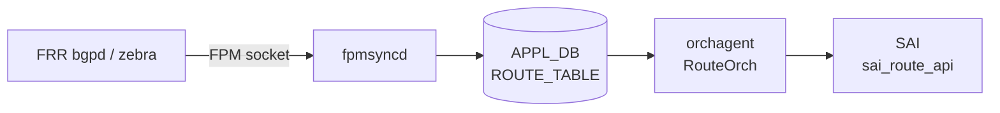

# APPL_DB ROUTE_TABLE テーブル

## 概要

`ROUTE_TABLE` は [APPL_DB](../../reference/glossary.md#term-appl_db) 上に存在する転送経路テーブル。[FRR](../../reference/glossary.md#term-frr) の FPM（Forwarding Plane Manager）ソケットを受信した `fpmsyncd` が書き込み主体となり、unicast・blackhole・EVPN・[SRv6](../../reference/glossary.md#term-srv6) の各種経路を格納する[^rsync]。`orchagent` 内の `RouteOrch` がこのテーブルを購読し、[SAI](../../reference/glossary.md#term-sai) `sai_route_api` を通じてハードウェア転送テーブルへ反映する[^rorch]。テーブル名の定数は `schema.h` で `APP_ROUTE_TABLE_NAME = "ROUTE_TABLE"` と定義されている[^schema]。

## key 構造

```text
ROUTE_TABLE|<prefix>
ROUTE_TABLE|Vrf<name>:<prefix>
```

| key 要素 | 説明 |
|---------|------|
| `<prefix>` | IPv4 または IPv6 prefix（例 `10.0.0.0/24`、`2001:db8::/32`） |
| `Vrf<name>:` | VRF-aware 経路のプレフィクス。`Vrf` で始まる VRF デバイス名 + `:`。 |

VRF-aware 経路では VRF 名が key に埋め込まれる（コロン区切り）。`Vrf` プレフィクスを持たないインタフェース（eth0、docker0、eth1-midplane）宛ての経路は `fpmsyncd` が DEL に変換してスキップする[^rsync]。

## 主要フィールド

| フィールド | 型 | 既定値 | 説明 |
|-----------|----|--------|------|
| `protocol` | string | 省略（空文字列） | 経路学習プロトコル。`"static"` / `"bgp"` / `"ospf"` / `"isis"` 等。空の場合はフィールドなし |
| `blackhole` | string | 省略（= `"false"`） | `"true"` の場合は blackhole 経路（パケット破棄）。`"false"` 相当のときフィールド省略 |
| `nexthop` | string | 省略（空文字列） | nexthop IP アドレス。ECMP はカンマ区切り。`nexthop_group` と排他 |
| `ifname` | string | 省略（空文字列） | 出力 interface 名。ECMP はカンマ区切り |
| `weight` | string | 省略（空文字列） | ECMP 重み。カンマ区切り整数 |
| `nexthop_group` | string | 省略（空文字列） | NHG（NextHop Group）テーブルのキー文字列。`nexthop` と排他 |
| `mpls_nh` | string | 省略（空文字列） | MPLS ラベルスタック（カンマ区切り） |
| `vni_label` | string | 省略（空文字列） | EVPN VNI 値 |
| `router_mac` | string | 省略（空文字列） | EVPN 宛先ルータ MAC |
| `segment` | string | 省略（空文字列） | [SRv6](../../reference/glossary.md#term-srv6) SID-list テーブルキー |
| `seg_src` | string | 省略（空文字列） | SRv6 source address |

## 書き込み主体

| 書き込み元 | 経路種別 |
|-----------|---------|
| `fpmsyncd` (RouteSync) | unicast / blackhole / MPLS / EVPN IP Prefix / SRv6 VPN |
| `bgpcfgd` StaticRouteMgr | `STATIC_ROUTE` CONFIG_DB から変換した静的経路（VRF-aware） |

## 購読者

- `orchagent` / `RouteOrch`: `ROUTE_TABLE` を `ConsumerStateTable` で購読。`sai_route_api->create_route_entry()` でハードウェアに経路を書き込む。ECMP の場合は `sai_next_hop_group_api` と連携。
- `warmRestartHelper`: ウォームリブート時に APPL_DB エントリを一時保持し、FRR 再接続後に再生する。

<!-- cdb-mermaid -->
### データフロー (自動生成)



!!! note "凡例"
    FRR から SAI までの転送経路。fpmsyncd が APPL_DB の書き込み主体となる。
<!-- /cdb-mermaid -->

## 制約

- `nexthop_group` と `nexthop` / `ifname` は排他。両方を指定するとエラー[^rorch]。
- `blackhole` が `"true"` の場合、`nexthop` / `ifname` は不要かつ無視される。
- VRF-aware 経路の key は `Vrf<name>:` プレフィクスを含む（コロン区切り）。`Vrf` で始まらない VRF 名は `fpmsyncd` がエラーログを出して処理を中断する[^rsync]。
- EVPN IP Prefix 経路では `nexthop`・`vni_label`・`router_mac`・`ifname` が揃っていない場合は ROUTE_TABLE への書き込みをスキップする[^rsync]。

## 引用元

[^rsync]: fpmsyncd RouteSync 実装: `sonic-swss/fpmsyncd/routesync.cpp`, `routesync.h`. <https://github.com/sonic-net/sonic-swss/blob/4305596156d70e9797e8a881b3d19b46de0bce0d/fpmsyncd/routesync.cpp>
[^rorch]: RouteOrch 実装: `sonic-swss/orchagent/routeorch.cpp`. <https://github.com/sonic-net/sonic-swss/blob/4305596156d70e9797e8a881b3d19b46de0bce0d/orchagent/routeorch.cpp>
[^schema]: テーブル名定数: `sonic-swss-common/common/schema.h`. <https://github.com/sonic-net/sonic-swss-common/blob/158de8d3463ff4b841653f6d57190bb142b80d9c/common/schema.h>

<!-- defaults -->
## フィールドの暗黙デフォルト (Phase A)

以下はコード精読により判明した APPL_DB `ROUTE_TABLE` フィールドのコード由来デフォルト。`fpmsyncd` が非 ZMQ パスで書き込む際の省略ロジックと、`orchagent` (consumer) 側の初期値を対比する[^rsync][^rorch]。

### フィールド省略ロジック（fpmsyncd 非 ZMQ パス）

`RouteTableFieldValueTupleWrapper::fieldValueTupleVector()` (`routesync.cpp` L1019-L1051) は値がデフォルトと同じ場合はフィールドを APPL_DB に送信しない:

| フィールド | struct 初期値 | 省略条件 | orchagent 側初期値 |
|-----------|-------------|---------|------------------|
| `protocol` | `""` (空文字列) | 空文字列のとき省略 | `""` (未設定) |
| `blackhole` | `"false"` | `"false"` と等しいとき省略 | `false` (bool) |
| `nexthop` | `""` | 空文字列のとき省略 | `""` |
| `ifname` | `""` | 空文字列のとき省略 | `""` |
| `nexthop_group` | `""` | 空文字列のとき省略 | `""` |
| `mpls_nh` | `""` | 空文字列のとき省略 | — (別処理) |
| `weight` | `""` | 空文字列のとき省略 | `""` |
| `vni_label` | `""` | 空文字列のとき省略 | — |
| `router_mac` | `""` | 空文字列のとき省略 | — |
| `segment` | `""` | 空文字列のとき省略 | `""` |
| `seg_src` | `""` | 空文字列のとき省略 | `""` |

ZMQ 有効時（Northbound ZMQ パス）は全フィールドを空文字列含めて常に送信する。

### `blackhole` の重要な挙動

- **フィールド不在 = false**: `routeorch.cpp` L765-L766 で `blackhole` フィールドが absent の場合、`bool blackhole = false` として扱われる。
- **RTN_BLACKHOLE タイプの場合**: fpmsyncd は `fvw.blackhole = "true"` を明示的にセットし、`nexthop` / `ifname` は省略する（L2176-L2178）。

### `protocol` フィールドの変換

`getProtocolString()` が Linux `rtm_protocol` 番号を文字列に変換する。代表値:

| rtm_protocol | `protocol` 文字列 |
|-------------|-----------------|
| `RTPROT_STATIC` (4) | `"static"` |
| `RTPROT_BGP` (186) | `"bgp"` |
| `RTPROT_OSPF` (188) | `"ospf"` |
| `RTPROT_ISIS` (187) | `"isis"` |
| 不明 / 未登録 | 空文字列 → フィールド省略 |

### `nexthop` のデフォルト nexthop アドレス

NHG（NextHop Group）が単一 nexthop でかつ nexthop アドレスが空の場合、fpmsyncd は:

```cpp
// routesync.cpp L2214
string nexthops = nhg.nexthop.empty()
    ? (rtnl_route_get_family(route_obj) == AF_INET ? "0.0.0.0" : "::")
    : nhg.nexthop;
```

IPv4 connected 経路 → `"0.0.0.0"`、IPv6 connected 経路 → `"::"` が nexthop として設定される。

### `weight` — 等コスト時は省略

weight が全 nexthop で等しい（ECMP 均等）場合、`getNextHopWt()` が空文字列を返し weight フィールドは省略される。orchagent は weight なし = 均等 ECMP と解釈する。

<!-- /defaults -->

<!-- platform -->
## プラットフォーム / SAI Capability 差異 (Phase H)

APPL_DB `ROUTE_TABLE` の書込・購読フロー自体はプラットフォーム共通だが、`routeorch` の起動時補正と `nhgorch` 経由で発行される SAI 呼び出しで以下 3 軸の差異が出る。`nhgorch.cpp` 自体には platform / switch_type の if 分岐は無く、`routeorch` が算出した上限値と SAI capability 経由で間接的に効く。

### ECMP グループ数: Mellanox 限定の補正

`routeorch.cpp` L73-L88 で `SAI_SWITCH_ATTR_NUMBER_OF_ECMP_GROUPS` を取得後、`getenv("platform")` の値に `MLNX_PLATFORM_SUBSTRING == "mellanox"` (`orch.h` L42) が含まれる場合のみ `m_maxNextHopGroupCount /= DEFAULT_MAX_ECMP_GROUP_SIZE`（32）で補正する:

```cpp
// orchagent/routeorch.cpp:84-87
char *platform = getenv("platform");
if (platform && strstr(platform, MLNX_PLATFORM_SUBSTRING))
{
    m_maxNextHopGroupCount /= DEFAULT_MAX_ECMP_GROUP_SIZE;
}
```

`DEFAULT_NUMBER_OF_ECMP_GROUPS = 128`（L37）、`DEFAULT_MAX_ECMP_GROUP_SIZE = 32`（L38）。Broadcom / Marvell / Cisco silicon-one / xsight 等は SAI 戻り値をそのまま採用する。算出値は `m_switchOrch->set_switch_capability()` で STATE_DB `SWITCH_CAPABILITY:MAX_NEXTHOP_GROUP_COUNT` に公開され、`ROUTE_TABLE` の `nexthop_group` 採用可否の上限管理に使われる。

### ECMP メンバ数: VOQ chassis で 128 に強制書き戻し

`gMySwitchType == "voq"`（CONFIG_DB `DEVICE_METADATA|localhost:switch_type` 由来）かつ SAI が返す `SAI_SWITCH_ATTR_MAX_ECMP_MEMBER_COUNT >= 128` のとき、`SAI_SWITCH_ATTR_ECMP_MEMBER_COUNT` を 128 に書き戻す:

```cpp
// orchagent/routeorch.cpp:109-122
if (gMySwitchType == "voq" && maxEcmpGroupSize >= 128)
{
    maxEcmpGroupSize = 128;
    attr.id = SAI_SWITCH_ATTR_ECMP_MEMBER_COUNT;
    attr.value.s32 = maxEcmpGroupSize;
    status = sai_switch_api->set_switch_attribute(gSwitchId, &attr);
}
```

`switch_type=switch`（T0/T1 fixed pizzabox）や `chassis-packet` の line card、`dpu` では発火しない。マジック数 `128` はインラインリテラル（`#define` ではない）。

### SRv6 / EVPN overlay ネクストホップ: SAI capability 依存

`routeorch.cpp` L736-L795 で APPL_DB の `vni_label` / `segment` / `seg_src` から `overlay_nh` / `srv6_nh` を立てるが、SAI 側で `SAI_NEXT_HOP_TYPE_TUNNEL_ENCAP`（EVPN encap）/ `SAI_NEXT_HOP_TYPE_SRV6_SIDLIST` / `SAI_OBJECT_TYPE_MY_SID_ENTRY` が未対応の ASIC では `create_next_hop` / `create_my_sid_entry` が `SAI_STATUS_NOT_SUPPORTED` を返し routeorch がエラーログを残す（L2130 / L2136 付近）。community master では Broadcom DNX / Mellanox 一部 SKU で SRv6 が機能し、VS / VPP はスタブ実装。

### CRM 集計: SAI 任意属性

`crmorch.cpp` L76-L77 で `CRM_IPV4_ROUTE` / `CRM_IPV6_ROUTE` を `SAI_SWITCH_ATTR_AVAILABLE_IPV4_ROUTE_ENTRY` / `_IPV6_ROUTE_ENTRY` に紐付ける。SAI が当該属性を未実装の ASIC（古い SDK / VS / VPP の一部）では `crm_stats_ipv4_route_available` / `ipv6_route_available` が STATE_DB `CRM` に出ない。

### multi-asic / VOQ chassis での namespace 分離

`routeorch` は `DBConnector` の namespace に従って `swss@asicN` Docker ごとに 1 インスタンス起動し、それぞれ独立した APPL_DB `ROUTE_TABLE` を購読する。fpmsyncd も `asicN` namespace 単位で動作し、ASIC 間で `route_entry` / `next_hop_group` の名前空間は交わらない。chassis 全体の VOQ ルーティングは `CHASSIS_APP_DB`（redis index 12、`chassisdb.sock`）+ `voqorch` 経由で同期されるため、`APPL_DB:ROUTE_TABLE` 自体に chassis-wide 同期機構はない。

### VS / VPP プラットフォーム

`VS_PLATFORM_SUBSTRING="vs"` / `XS_PLATFORM_SUBSTRING="xsight"` (`orch.h` L46 / L49) では SAI シム（libsaivs / libsaivpp）が ECMP / SRv6 / overlay nexthop の create を SUCCESS で返すが ASIC は無く実機転送はない。Mellanox 補正は走らないので、SAI 既定値（多くは 128〜1024）が `m_maxNextHopGroupCount` になる。CRM の available 値もダミー。

### nhgorch には platform 分岐なし

`orchagent/nhgorch.cpp` / `nhgbase.cpp` には `MLNX_PLATFORM` / `VS_PLATFORM` / `XS_PLATFORM` / `gMySwitchType` / `getenv("platform")` の参照がない（grep 0 ヒット）。`SAI_NEXT_HOP_GROUP_TYPE_ECMP`（L771-L772）と `SAI_NEXT_HOP_GROUP_MEMBER_ATTR_WEIGHT` を共通 API で発行するのみ。プラットフォーム差は routeorch 起動時の `MAX_NEXTHOP_GROUP_COUNT` 算出と SAI capability 経由で間接的に効く。

詳細根拠は `meta/_intermediate/cdb-flow/appl-db-route-platform.md` を参照。
<!-- /platform -->

<!-- failure -->
## 失敗・リトライ挙動 (Phase D)

`RouteOrch::doTask()` (`routeorch.cpp` L605-L1103) と `addRoute()` (L2050-L2244) のコード精読により判明した、APPL_DB `ROUTE_TABLE` SET/DEL 処理の失敗分岐と retry 戦略を整理する[^rorch][^nhgorch][^crmorch]。

### doTask 入口での早期スキップ・retry

| 条件 | 位置 | 挙動 | 後続 |
|------|------|------|------|
| `gPortsOrch->allPortsReady()` が false | L609-L612 | doTask 即 return | 全 ROUTE_TABLE タスクが `m_toSync` 上に保留され、次のイベントで再実行 |
| `m_resync == true`（resync 進行中） | L697-L701 | `it++`（erase しない） | resync complete を受けるまで保留 |
| `Vrf<name>:` 付き key だが VRFOrch に当該 VRF が無い | L709-L714 | `it++` | VRF 作成まで retry |
| `nhg_index` と `nexthop`/`ifname` の両方が非空 | L807-L812 | `ERROR` ログ + `erase` | ハード失敗、再投入なし |
| `aliases` 空 かつ `!blackhole && !srv6_nh` | L876-L880 | `WARN` ログ + `erase` | ハード失敗 |
| `vni_label` が L3 VNI に紐付かない | L893-L897 | `it++` | L3 VNI 設定後に retry |
| `nhg_index` 指定で NhgOrch の `getNhg()` が `out_of_range` | L996-L1003 | `ERROR` + `it++` | NhgOrch が NHG を作成するまで retry |
| EVPN: `ipv.size()` と `rmacv.size()` / `vni_labelv.size()` の不整合 | L985-L991 | `ERROR` + `erase` | ハード失敗 |
| nexthop alias が `eth0`/`docker0`/`usb0`/`lo`/`Loopback*` | L915-L926 | `removeRoute(ctx)` を実行（既存 ASIC 経路を撤去）→ 成功で `erase`、失敗で `it++` | APPL_STATE_DB に `publishRouteState` で反映 |

### addRoute() 内: nexthop 解決失敗と retry

単一 NH 経路 (L2050-L2156):

- **RIF 未作成** (L2086-L2090): `m_intfsOrch->getRouterIntfsId(alias) == SAI_NULL_OBJECT_ID` → `INFO` ログ + `return false` → doTask が `it++` で retry。
- **IFDOWN フラグ** (L2106-L2109): `m_neighOrch->isNextHopFlagSet(nexthop, NHFLAGS_IFDOWN)` が true → `INFO`「Interface down for NH ..., skip this Route for programming」 → `return false` → retry。インタフェース up まで保留。
- **overlay (EVPN VxLAN) remote vtep / tunnel NH 作成失敗** (L2128-L2141): `createRemoteVtep` または `addTunnelNextHop` が失敗すると `ERROR` + `return false` → retry。
- **SRv6 nexthop 作成失敗** (L2142-L2149): `m_srv6Orch->srv6Nexthops()` 失敗で `ERROR` + `return false` → retry。
- **IP neighbor 未解決** (L2151-L2155): `m_neighOrch->resolveNeighbor(nexthop)` を呼んで ARP/ND probe をキック → `return false` → retry。NEIGH 解決後の再投入で成功する。

NHG (ECMP) 経路 (L2161-L2244):

- 既存 NHG が無く `addNextHopGroup()` も失敗した場合、各 NH について `hasNextHop` が false なら overlay は `createRemoteVtep` / `addTunnelNextHop` を試行し、それ以外は `resolveNeighbor(nextHop)` を呼ぶ (L2197-L2229)。
- `addNextHopGroup` の最終フォールバックとして `addTempRoute(ctx, nextHops)` を呼ぶ (L2240)。`addTempRoute` (L1947-L1989) は `isNeighborResolved` でない NH と `NHFLAGS_IFDOWN` の NH を集合から除外したうえで、残存 NH (1 個でもあれば) を使って **temporary route** として書き込む。元経路は `return false` で retry 状態に置かれ、後続イベントで本来の NHG に昇格する。
- SRv6 NHG のときは temp route を作らず即 `return false` (L2188-L2200)。

### NHG リソース上限到達

`createFineGrainedNextHopGroup` (L1424-L1431) と `addNextHopGroup` (L1478-L1485) は同じガードを持つ:

```cpp
if (m_nextHopGroupCount + NhgOrch::getSyncedNhgCount() >= m_maxNextHopGroupCount)
{
    SWSS_LOG_DEBUG("Failed to create new next hop group. Reaching maximum number of next hop groups.");
    return false;
}
```

- `m_maxNextHopGroupCount` は SAI `SAI_SWITCH_ATTR_NUMBER_OF_ECMP_GROUPS` から取得し、`STATE_DB` の `SWITCH_CAPABILITY` に `MAX_NEXTHOP_GROUP_COUNT` として publish される (L60-L93)。
- 上限到達時は前述の **addTempRoute フォールバック** により、解決済み 1 NH の経路が暫定書き込みされる（ECMP 機能は劣化するがトラフィック疎通は維持）。
- doTask ループ末尾 (L1096-L1101) では `m_nextHopGroupCount + NhgOrch::getSyncedNhgCount() >= m_maxNextHopGroupCount` かつ bulker に削除待ちが溜まっているとき `break` し、flush を優先してリソース解放を急ぐ。
- NhgOrch 側 (`nhgorch.cpp` L319-L362) も `gRouteOrch->getNhgCount() + NextHopGroup::getSyncedCount() >= gRouteOrch->getMaxNhgCount()` のとき temp NHG を保持し続け、リソースが空くまで promotion を保留する[^nhgorch]。

### SAI 呼び出し失敗の分岐 (`handleSaiCreateStatus` / `handleSaiSetStatus`)

`routeorch.cpp` 各所で繰り返される定型:

```cpp
if (status != SAI_STATUS_SUCCESS)
{
    SWSS_LOG_ERROR("Failed to ...");
    task_process_status handle_status = handleSaiCreateStatus(SAI_API_ROUTE, status);
    if (handle_status != task_success)
    {
        return parseHandleSaiStatusFailure(handle_status);
    }
}
```

代表箇所: NHG create L1435、NHG remove L1456、NHG member create L1566、route create L2516、default route set L2555、route set L2573、route member set L2649、route remove L2828/L2842/L2869。

`task_process_status` の分岐:

| 戻り値 | 意味 | doTask 側の挙動 |
|--------|------|----------------|
| `task_success` | 警告のみで成功扱い (例: `SAI_STATUS_ITEM_ALREADY_EXISTS` を吸収) | `erase` で先送り |
| `task_need_retry` | 一時的失敗 | `parseHandleSaiStatusFailure` が false 返却 → `it++` で retry |
| `task_failed` | ハード失敗 | カウンタ上昇、`erase` でドロップ |
| `task_invalid_entry` / `task_ignore` | 無効 | `erase` |

特殊ケース:

- **`SAI_STATUS_ITEM_NOT_FOUND` on set** (L2575-L2581): orchagent の `m_syncdRoutes` には経路があるが SAI 側では既に消えているケース (dualtor の tunnel route 衝突など) → `m_syncdRoutes` から該当エントリを削除して `return false`。次回 doTask は「新規 create」として再処理する自動修復。
- **bulker の `SAI_STATUS_ITEM_ALREADY_EXISTS`** (L2302-L2306): `gRouteBulker.create_entry()` が即時に同一エントリ二重投入を検出した場合は `ERROR` + `return false` で打ち切り (retry なし)。
- **FG NHG create 失敗時のロールバック** (L2470-L2477): SAI が個別 status を返した場合、`m_fgNhgOrch->removeFgNhg(vrf_id, ipPrefix)` で先に作った fine-grained NHG を即座に解体してから `return false`。

### CRM (Critical Resource Monitor) との関係

`crmorch.cpp` の `CRM_IPV4_ROUTE` / `CRM_IPV6_ROUTE` / `CRM_NEXTHOP_GROUP` / `CRM_NEXTHOP_GROUP_MEMBER` リソースは、`routeorch` が経路 / NHG / member を作成・削除する度に `incCrmResUsedCounter` / `decCrmResUsedCounter` で更新される[^crmorch]。

- `CrmOrch::checkCrmThresholds()` (L1116-L1190) が周期実行され、`utilization >= res.highThreshold` を満たした時点で `SWSS_LOG_WARN("... THRESHOLD_EXCEEDED ...")` と `event_publish("chk_crm_threshold", ...)` を発火（`exceededLogCounter < CRM_EXCEEDED_MSG_MAX` の間のみ。ログスパム抑止）。`utilization <= res.lowThreshold` で `THRESHOLD_CLEAR` を出してカウンタを 0 に戻す。
- **CRM は経路投入を直接ブロックしない**。閾値超過は観測通知のみ。実際にハードウェアリソースが枯渇すると、SAI の `create_route_entry` 等が `SAI_STATUS_INSUFFICIENT_RESOURCES` 系を返し、上述の `handleSaiCreateStatus` 経路で `task_failed` または `task_need_retry` に分岐する。
- 観測手順: `crm show resources ipv4_route` / `... ipv6_route` / `... nexthop_group` で used/available を照会し、syslog の `THRESHOLD_EXCEEDED` を併用して逼迫予兆を捉える。

### APPL_STATE_DB への失敗反映

`publishRouteState(ctx, status)` (L3185-L3202) は `ResponsePublisher` 経由で `ROUTE_TABLE` を APPL_STATE_DB にミラー publish する。`is_set` のとき `protocol` のみを fvs に含め、DEL のときは fvs を空にして APPL_STATE_DB からエントリを削除する。

- 成功パス (L1050, L1090, L2729, L2970) は `SAI_STATUS_SUCCESS` で publish。
- **retry 状態の経路は `publishRouteState` を呼ばずに `return false`**。APPL_STATE_DB には反映されないため、書き込み側 (fpmsyncd / StaticRouteMgr) は APPL_DB と APPL_STATE_DB の差分を見て「未確定」を観測できる。
- ループバック / docker / management インタフェース宛て経路 (L922) は ASIC には乗らないが、APPL_STATE_DB との整合のため `publishRouteState(ctx)` で必ず反映する。

### 観測ポイントまとめ

| 失敗カテゴリ | 主な syslog / イベント | 観測手段 |
|------------|---------------------|---------|
| Ports 未準備 | PortsOrch 側のログ | `m_toSync` の積み上がり |
| VRF 未作成 | サイレント retry | `redis-cli -n 0 keys 'ROUTE_TABLE:Vrf*'` と APPL_STATE_DB の差分 |
| NHG ref 不在 | `Next hop group %s does not exist` | `redis-cli -n 0 keys 'NEXTHOP_GROUP_TABLE:*'` |
| neighbor 未解決 | `Failed to get next hop ..., resolving neighbor` | `ip neigh` / NEIGH_TABLE 監視 |
| IFDOWN | `Interface down for NH ..., skip this Route` | `show interfaces status` |
| NHG 上限到達 | `Reaching maximum number of next hop groups` (DEBUG) | STATE_DB `SWITCH_CAPABILITY:switch:MAX_NEXTHOP_GROUP_COUNT` と現在数の比較 |
| SAI route create/set 失敗 | `Failed to create/set route ...` | syslog grep、CRM 残量 |
| SAI ITEM_NOT_FOUND on set | （自動修復: 内部ログのみ） | APPL_STATE_DB との整合 |
| CRM 閾値超過 | `THRESHOLD_EXCEEDED for IPV4_ROUTE/IPV6_ROUTE/NEXTHOP_GROUP` | `crm show resources <resource>` |

詳細な行番号付きグレップ証跡は `meta/_intermediate/cdb-flow/appl-db-route-failure.md` を参照[^failuremem]。

[^nhgorch]: NhgOrch 実装: `sonic-swss/orchagent/nhgorch.cpp`. <https://github.com/sonic-net/sonic-swss/blob/4305596156d70e9797e8a881b3d19b46de0bce0d/orchagent/nhgorch.cpp>
[^crmorch]: CrmOrch 実装: `sonic-swss/orchagent/crmorch.cpp`. <https://github.com/sonic-net/sonic-swss/blob/4305596156d70e9797e8a881b3d19b46de0bce0d/orchagent/crmorch.cpp>
[^failuremem]: 失敗分岐の中間メモ: `meta/_intermediate/cdb-flow/appl-db-route-failure.md`
<!-- /failure -->
