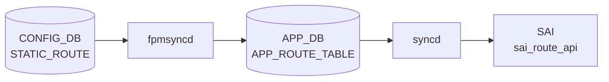

# APPL_DB ROUTE_TABLE テーブル

## 概要

`ROUTE_TABLE` は [APPL_DB](../../reference/glossary.md#term-appl_db) 上に存在する転送経路テーブル。[FRR](../../reference/glossary.md#term-frr) の [FPM](../../reference/glossary.md#term-fpm)（Forwarding Plane Manager）ソケットを受信した `fpmsyncd` が書き込み主体となり、unicast・blackhole・[EVPN](../../reference/glossary.md#term-evpn)・[SRv6](../../reference/glossary.md#term-srv6) の各種経路を格納する[^rsync]。`orchagent` 内の `RouteOrch` がこのテーブルを購読し、[SAI](../../reference/glossary.md#term-sai) `sai_route_api` を通じてハードウェア転送テーブルへ反映する[^rorch]。テーブル名の定数は `schema.h` で `APP_ROUTE_TABLE_NAME = "ROUTE_TABLE"` と定義されている[^schema]。

## key 構造

```text
ROUTE_TABLE|<prefix>
ROUTE_TABLE|Vrf<name>:<prefix>
```

| key 要素 | 説明 |
|---------|------|
| `<prefix>` | IPv4 または IPv6 prefix（例 `10.0.0.0/24`、`2001:db8::/32`） |
| `Vrf<name>:` | [VRF](../../reference/glossary.md#term-vrf)-aware 経路のプレフィクス。`Vrf` で始まる [VRF](../../reference/glossary.md#term-vrf) デバイス名 + `:`。 |

[VRF](../../reference/glossary.md#term-vrf)-aware 経路では VRF 名が key に埋め込まれる（コロン区切り）。`Vrf` プレフィクスを持たないインタフェース（eth0、docker0、eth1-midplane）宛ての経路は `fpmsyncd` が DEL に変換してスキップする[^rsync]。

## 主要フィールド

| フィールド | 型 | 既定値 | 説明 |
|-----------|----|--------|------|
| `protocol` | string | 省略（空文字列） | 経路学習プロトコル。`"static"` / `"bgp"` / `"ospf"` / `"isis"` 等。空の場合はフィールドなし |
| `blackhole` | string | 省略（= `"false"`） | `"true"` の場合は blackhole 経路（パケット破棄）。`"false"` 相当のときフィールド省略 |
| `nexthop` | string | 省略（空文字列） | nexthop IP アドレス。[ECMP](../../reference/glossary.md#term-ecmp) はカンマ区切り。`nexthop_group` と排他 |
| `ifname` | string | 省略（空文字列） | 出力 interface 名。[ECMP](../../reference/glossary.md#term-ecmp) はカンマ区切り |
| `weight` | string | 省略（空文字列） | [ECMP](../../reference/glossary.md#term-ecmp) 重み。カンマ区切り整数 |
| `nexthop_group` | string | 省略（空文字列） | NHG（NextHop Group）テーブルのキー文字列。`nexthop` と排他 |
| `mpls_nh` | string | 省略（空文字列） | [MPLS](../../reference/glossary.md#term-mpls) ラベルスタック（カンマ区切り） |
| `vni_label` | string | 省略（空文字列） | [EVPN](../../reference/glossary.md#term-evpn) VNI 値 |
| `router_mac` | string | 省略（空文字列） | [EVPN](../../reference/glossary.md#term-evpn) 宛先ルータ MAC |
| `segment` | string | 省略（空文字列） | [SRv6](../../reference/glossary.md#term-srv6) SID-list テーブルキー |
| `seg_src` | string | 省略（空文字列） | [SRv6](../../reference/glossary.md#term-srv6) source address |

## 書き込み主体

| 書き込み元 | 経路種別 |
|-----------|---------|
| `fpmsyncd` (RouteSync) | unicast / blackhole / [MPLS](../../reference/glossary.md#term-mpls) / EVPN IP Prefix / SRv6 VPN |
| `bgpcfgd` StaticRouteMgr または `staticrouteorch` | `STATIC_ROUTE` [CONFIG_DB](../../reference/glossary.md#term-config_db) から変換した静的経路（VRF-aware）。詳細は `static-route.md` を参照 |

## 購読者

- `orchagent` / `RouteOrch`: `ROUTE_TABLE` を `ConsumerStateTable` で購読。`sai_route_api->create_route_entry()` でハードウェアに経路を書き込む。ECMP の場合は `sai_next_hop_group_api` と連携。
- `warmRestartHelper`: ウォームリブート時に [APPL_DB](../../reference/glossary.md#term-appl_db) エントリを一時保持し、[FRR](../../reference/glossary.md#term-frr) 再接続後に再生する。

<!-- cdb-mermaid -->
### データフロー (自動生成)



!!! note "凡例"
    CONFIG_DB から SAI までの典型経路を `docs/reference/config-db-orch-map.md` から機械生成したミニ図。詳細・例外は本ページ本文と対応表を参照。
<!-- /cdb-mermaid -->

## 制約

- `nexthop_group` と `nexthop` / `ifname` は排他。両方を指定するとエラー[^rorch]。
- `blackhole` が `"true"` の場合、`nexthop` / `ifname` は不要かつ無視される。
- VRF-aware 経路の key は `Vrf<name>:` プレフィクスを含む（コロン区切り）。`Vrf` で始まらない VRF 名は `fpmsyncd` がエラーログを出して処理を中断する[^rsync]。
- EVPN IP Prefix 経路では `nexthop`・`vni_label`・`router_mac`・`ifname` が揃っていない場合は [ROUTE_TABLE](../../reference/glossary.md#term-route_table) への書き込みをスキップする[^rsync]。

## 引用元

[^rsync]: [fpmsyncd](../../reference/glossary.md#term-fpmsyncd) RouteSync 実装: `sonic-swss/fpmsyncd/routesync.cpp`, `routesync.h`. <https://github.com/sonic-net/sonic-swss/blob/4305596156d70e9797e8a881b3d19b46de0bce0d/fpmsyncd/routesync.cpp>
[^rorch]: RouteOrch 実装: `sonic-swss/orchagent/routeorch.cpp`. <https://github.com/sonic-net/sonic-swss/blob/4305596156d70e9797e8a881b3d19b46de0bce0d/orchagent/routeorch.cpp>
[^schema]: テーブル名定数: `sonic-swss-common/common/schema.h`. <https://github.com/sonic-net/sonic-swss-common/blob/158de8d3463ff4b841653f6d57190bb142b80d9c/common/schema.h>

<!-- defaults -->
## フィールドの暗黙デフォルト (Phase A)

以下はコード精読により判明した [APPL_DB](../../reference/glossary.md#term-appl_db) `ROUTE_TABLE` フィールドのコード由来デフォルト。`fpmsyncd` が非 ZMQ パスで書き込む際の省略ロジックと、`orchagent` (consumer) 側の初期値を対比する[^rsync][^rorch]。

### フィールド省略ロジック（fpmsyncd 非 ZMQ パス）

`RouteTableFieldValueTupleWrapper::fieldValueTupleVector()` (`routesync.cpp` L1019-L1051) は値がデフォルトと同じ場合はフィールドを APPL_DB に送信しない:

| フィールド | struct 初期値 | 省略条件 | [orchagent](../../reference/glossary.md#term-orchagent) 側初期値 |
|-----------|-------------|---------|------------------|
| `protocol` | `""` (空文字列) | 空文字列のとき省略 | `""` (未設定) |
| `blackhole` | `"false"` | `"false"` と等しいとき省略 | `false` (bool) |
| `nexthop` | `""` | 空文字列のとき省略 | `""` |
| `ifname` | `""` | 空文字列のとき省略 | `""` |
| `nexthop_group` | `""` | 空文字列のとき省略 | `""` |
| `mpls_nh` | `""` | 空文字列のとき省略 | — (別処理) |
| `weight` | `""` | 空文字列のとき省略 | `""` |
| `vni_label` | `""` | 空文字列のとき省略 | — |
| `router_mac` | `""` | 空文字列のとき省略 | — |
| `segment` | `""` | 空文字列のとき省略 | `""` |
| `seg_src` | `""` | 空文字列のとき省略 | `""` |

ZMQ 有効時（Northbound ZMQ パス）は全フィールドを空文字列含めて常に送信する。

### `blackhole` の重要な挙動

- **フィールド不在 = false**: `routeorch.cpp` L765-L766 で `blackhole` フィールドが absent の場合、`bool blackhole = false` として扱われる。
- **RTN_BLACKHOLE タイプの場合**: [fpmsyncd](../../reference/glossary.md#term-fpmsyncd) は `fvw.blackhole = "true"` を明示的にセットし、`nexthop` / `ifname` は省略する（L2176-L2178）。

### `protocol` フィールドの変換

`getProtocolString()` が Linux `rtm_protocol` 番号を文字列に変換する。代表値:

| rtm_protocol | `protocol` 文字列 |
|-------------|-----------------|
| `RTPROT_STATIC` (4) | `"static"` |
| `RTPROT_BGP` (186) | `"bgp"` |
| `RTPROT_OSPF` (188) | `"ospf"` |
| `RTPROT_ISIS` (187) | `"isis"` |
| 不明 / 未登録 | 空文字列 → フィールド省略 |

### `nexthop` のデフォルト nexthop アドレス

NHG（NextHop Group）が単一 nexthop でかつ nexthop アドレスが空の場合、[fpmsyncd](../../reference/glossary.md#term-fpmsyncd) は:

```cpp
// routesync.cpp L2214
string nexthops = nhg.nexthop.empty()
    ? (rtnl_route_get_family(route_obj) == AF_INET ? "0.0.0.0" : "::")
    : nhg.nexthop;
```

IPv4 connected 経路 → `"0.0.0.0"`、IPv6 connected 経路 → `"::"` が nexthop として設定される。

### `weight` — 等コスト時は省略

weight が全 nexthop で等しい（ECMP 均等）場合、`getNextHopWt()` が空文字列を返し weight フィールドは省略される。[orchagent](../../reference/glossary.md#term-orchagent) は weight なし = 均等 ECMP と解釈する。

<!-- /defaults -->

<!-- platform -->
## プラットフォーム / SAI Capability 差異 (Phase H)

APPL_DB `ROUTE_TABLE` の書込・購読フロー自体はプラットフォーム共通だが、`routeorch` の起動時補正と `nhgorch` 経由で発行される [SAI](../../reference/glossary.md#term-sai) 呼び出しで以下 3 軸の差異が出る。`nhgorch.cpp` 自体には platform / switch_type の if 分岐は無く、`routeorch` が算出した上限値と [SAI](../../reference/glossary.md#term-sai) capability 経由で間接的に効く。

### ECMP グループ数: Mellanox 限定の補正

`routeorch.cpp` L73-L88 で `SAI_SWITCH_ATTR_NUMBER_OF_ECMP_GROUPS` を取得後、`getenv("platform")` の値に `MLNX_PLATFORM_SUBSTRING == "mellanox"` (`orch.h` L42) が含まれる場合のみ `m_maxNextHopGroupCount /= DEFAULT_MAX_ECMP_GROUP_SIZE`（32）で補正する:

```cpp
// orchagent/routeorch.cpp:84-87
char *platform = getenv("platform");
if (platform && strstr(platform, MLNX_PLATFORM_SUBSTRING))
{
    m_maxNextHopGroupCount /= DEFAULT_MAX_ECMP_GROUP_SIZE;
}
```

`DEFAULT_NUMBER_OF_ECMP_GROUPS = 128`（L37）、`DEFAULT_MAX_ECMP_GROUP_SIZE = 32`（L38）。Broadcom / Marvell / Cisco silicon-one / xsight 等は SAI 戻り値をそのまま採用する。算出値は `m_switchOrch->set_switch_capability()` で [STATE_DB](../../reference/glossary.md#term-state_db) `SWITCH_CAPABILITY:MAX_NEXTHOP_GROUP_COUNT` に公開され、`ROUTE_TABLE` の `nexthop_group` 採用可否の上限管理に使われる。

### ECMP メンバ数: VOQ chassis で 128 に強制書き戻し

`gMySwitchType == "voq"`（[CONFIG_DB](../../reference/glossary.md#term-config_db) `DEVICE_METADATA|localhost:switch_type` 由来）かつ SAI が返す `SAI_SWITCH_ATTR_MAX_ECMP_MEMBER_COUNT >= 128` のとき、`SAI_SWITCH_ATTR_ECMP_MEMBER_COUNT` を 128 に書き戻す:

```cpp
// orchagent/routeorch.cpp:109-122
if (gMySwitchType == "voq" && maxEcmpGroupSize >= 128)
{
    maxEcmpGroupSize = 128;
    attr.id = SAI_SWITCH_ATTR_ECMP_MEMBER_COUNT;
    attr.value.s32 = maxEcmpGroupSize;
    status = sai_switch_api->set_switch_attribute(gSwitchId, &attr);
}
```

`switch_type=switch`（T0/T1 fixed pizzabox）や `chassis-packet` の line card、`dpu` では発火しない。マジック数 `128` はインラインリテラル（`#define` ではない）。

### SRv6 / EVPN overlay ネクストホップ: SAI capability 依存

`routeorch.cpp` L736-L795 で APPL_DB の `vni_label` / `segment` / `seg_src` から `overlay_nh` / `srv6_nh` を立てるが、SAI 側で `SAI_NEXT_HOP_TYPE_TUNNEL_ENCAP`（EVPN encap）/ `SAI_NEXT_HOP_TYPE_SRV6_SIDLIST` / `SAI_OBJECT_TYPE_MY_SID_ENTRY` が未対応の [ASIC](../../reference/glossary.md#term-asic) では `create_next_hop` / `create_my_sid_entry` が `SAI_STATUS_NOT_SUPPORTED` を返し routeorch がエラーログを残す（L2130 / L2136 付近）。community master では Broadcom DNX / Mellanox 一部 SKU で SRv6 が機能し、VS / VPP はスタブ実装。

### CRM 集計: SAI 任意属性

`crmorch.cpp` L76-L77 で `CRM_IPV4_ROUTE` / `CRM_IPV6_ROUTE` を `SAI_SWITCH_ATTR_AVAILABLE_IPV4_ROUTE_ENTRY` / `_IPV6_ROUTE_ENTRY` に紐付ける。SAI が当該属性を未実装の [ASIC](../../reference/glossary.md#term-asic)（古い SDK / VS / VPP の一部）では `crm_stats_ipv4_route_available` / `ipv6_route_available` が [STATE_DB](../../reference/glossary.md#term-state_db) `CRM` に出ない。

### multi-asic / VOQ chassis での namespace 分離

`routeorch` は `DBConnector` の namespace に従って `swss@asicN` Docker ごとに 1 インスタンス起動し、それぞれ独立した APPL_DB `ROUTE_TABLE` を購読する。fpmsyncd も `asicN` namespace 単位で動作し、[ASIC](../../reference/glossary.md#term-asic) 間で `route_entry` / `next_hop_group` の名前空間は交わらない。chassis 全体の [VOQ](../../reference/glossary.md#term-voq) ルーティングは `CHASSIS_APP_DB`（redis index 12、`chassisdb.sock`）+ `voqorch` 経由で同期されるため、`APPL_DB:ROUTE_TABLE` 自体に chassis-wide 同期機構はない。

### VS / VPP プラットフォーム

`VS_PLATFORM_SUBSTRING="vs"` / `XS_PLATFORM_SUBSTRING="xsight"` (`orch.h` L46 / L49) では SAI シム（libsaivs / libsaivpp）が ECMP / SRv6 / overlay nexthop の create を SUCCESS で返すが ASIC は無く実機転送はない。Mellanox 補正は走らないので、SAI 既定値（多くは 128〜1024）が `m_maxNextHopGroupCount` になる。[CRM](../../reference/glossary.md#term-crm) の available 値もダミー。

### nhgorch には platform 分岐なし

`orchagent/nhgorch.cpp` / `nhgbase.cpp` には `MLNX_PLATFORM` / `VS_PLATFORM` / `XS_PLATFORM` / `gMySwitchType` / `getenv("platform")` の参照がない（grep 0 ヒット）。`SAI_NEXT_HOP_GROUP_TYPE_ECMP`（L771-L772）と `SAI_NEXT_HOP_GROUP_MEMBER_ATTR_WEIGHT` を共通 API で発行するのみ。プラットフォーム差は routeorch 起動時の `MAX_NEXTHOP_GROUP_COUNT` 算出と SAI capability 経由で間接的に効く。

詳細根拠は `meta/_intermediate/cdb-flow/appl-db-route-platform.md` を参照。
<!-- /platform -->

<!-- failure -->
## 失敗・リトライ挙動 (Phase D)

`RouteOrch::doTask()` (`routeorch.cpp` L605-L1103) と `addRoute()` (L2050-L2244) のコード精読により判明した、APPL_DB `ROUTE_TABLE` SET/DEL 処理の失敗分岐と retry 戦略を整理する[^rorch][^nhgorch][^crmorch]。

### doTask 入口での早期スキップ・retry

| 条件 | 位置 | 挙動 | 後続 |
|------|------|------|------|
| `gPortsOrch->allPortsReady()` が false | L609-L612 | doTask 即 return | 全 [ROUTE_TABLE](../../reference/glossary.md#term-route_table) タスクが `m_toSync` 上に保留され、次のイベントで再実行 |
| `m_resync == true`（resync 進行中） | L697-L701 | `it++`（erase しない） | resync complete を受けるまで保留 |
| `Vrf<name>:` 付き key だが VRFOrch に当該 VRF が無い | L709-L714 | `it++` | VRF 作成まで retry |
| `nhg_index` と `nexthop`/`ifname` の両方が非空 | L807-L812 | `ERROR` ログ + `erase` | ハード失敗、再投入なし |
| `aliases` 空 かつ `!blackhole && !srv6_nh` | L876-L880 | `WARN` ログ + `erase` | ハード失敗 |
| `vni_label` が L3 VNI に紐付かない | L893-L897 | `it++` | L3 VNI 設定後に retry |
| `nhg_index` 指定で NhgOrch の `getNhg()` が `out_of_range` | L996-L1003 | `ERROR` + `it++` | NhgOrch が NHG を作成するまで retry |
| EVPN: `ipv.size()` と `rmacv.size()` / `vni_labelv.size()` の不整合 | L985-L991 | `ERROR` + `erase` | ハード失敗 |
| nexthop alias が `eth0`/`docker0`/`usb0`/`lo`/`Loopback*` | L915-L926 | `removeRoute(ctx)` を実行（既存 ASIC 経路を撤去）→ 成功で `erase`、失敗で `it++` | APPL_STATE_DB に `publishRouteState` で反映 |

### addRoute() 内: nexthop 解決失敗と retry

単一 NH 経路 (L2050-L2156):

- **[RIF](../../reference/glossary.md#term-rif) 未作成** (L2086-L2090): `m_intfsOrch->getRouterIntfsId(alias) == SAI_NULL_OBJECT_ID` → `INFO` ログ + `return false` → doTask が `it++` で retry。
- **IFDOWN フラグ** (L2106-L2109): `m_neighOrch->isNextHopFlagSet(nexthop, NHFLAGS_IFDOWN)` が true → `INFO`「Interface down for NH ..., skip this Route for programming」 → `return false` → retry。インタフェース up まで保留。
- **overlay (EVPN VxLAN) remote vtep / tunnel NH 作成失敗** (L2128-L2141): `createRemoteVtep` または `addTunnelNextHop` が失敗すると `ERROR` + `return false` → retry。
- **SRv6 nexthop 作成失敗** (L2142-L2149): `m_srv6Orch->srv6Nexthops()` 失敗で `ERROR` + `return false` → retry。
- **IP neighbor 未解決** (L2151-L2155): `m_neighOrch->resolveNeighbor(nexthop)` を呼んで [ARP](../../reference/glossary.md#term-arp)/ND probe をキック → `return false` → retry。NEIGH 解決後の再投入で成功する。

NHG (ECMP) 経路 (L2161-L2244):

- 既存 NHG が無く `addNextHopGroup()` も失敗した場合、各 NH について `hasNextHop` が false なら overlay は `createRemoteVtep` / `addTunnelNextHop` を試行し、それ以外は `resolveNeighbor(nextHop)` を呼ぶ (L2197-L2229)。
- `addNextHopGroup` の最終フォールバックとして `addTempRoute(ctx, nextHops)` を呼ぶ (L2240)。`addTempRoute` (L1947-L1989) は `isNeighborResolved` でない NH と `NHFLAGS_IFDOWN` の NH を集合から除外したうえで、残存 NH (1 個でもあれば) を使って **temporary route** として書き込む。元経路は `return false` で retry 状態に置かれ、後続イベントで本来の NHG に昇格する。
- SRv6 NHG のときは temp route を作らず即 `return false` (L2188-L2200)。

### NHG リソース上限到達

`createFineGrainedNextHopGroup` (L1424-L1431) と `addNextHopGroup` (L1478-L1485) は同じガードを持つ:

```cpp
if (m_nextHopGroupCount + NhgOrch::getSyncedNhgCount() >= m_maxNextHopGroupCount)
{
    SWSS_LOG_DEBUG("Failed to create new next hop group. Reaching maximum number of next hop groups.");
    return false;
}
```

- `m_maxNextHopGroupCount` は SAI `SAI_SWITCH_ATTR_NUMBER_OF_ECMP_GROUPS` から取得し、`STATE_DB` の `SWITCH_CAPABILITY` に `MAX_NEXTHOP_GROUP_COUNT` として publish される (L60-L93)。
- 上限到達時は前述の **addTempRoute フォールバック** により、解決済み 1 NH の経路が暫定書き込みされる（ECMP 機能は劣化するがトラフィック疎通は維持）。
- doTask ループ末尾 (L1096-L1101) では `m_nextHopGroupCount + NhgOrch::getSyncedNhgCount() >= m_maxNextHopGroupCount` かつ bulker に削除待ちが溜まっているとき `break` し、flush を優先してリソース解放を急ぐ。
- NhgOrch 側 (`nhgorch.cpp` L319-L362) も `gRouteOrch->getNhgCount() + NextHopGroup::getSyncedCount() >= gRouteOrch->getMaxNhgCount()` のとき temp NHG を保持し続け、リソースが空くまで promotion を保留する[^nhgorch]。

### SAI 呼び出し失敗の分岐 (`handleSaiCreateStatus` / `handleSaiSetStatus`)

`routeorch.cpp` 各所で繰り返される定型:

```cpp
if (status != SAI_STATUS_SUCCESS)
{
    SWSS_LOG_ERROR("Failed to ...");
    task_process_status handle_status = handleSaiCreateStatus(SAI_API_ROUTE, status);
    if (handle_status != task_success)
    {
        return parseHandleSaiStatusFailure(handle_status);
    }
}
```

代表箇所: NHG create L1435、NHG remove L1456、NHG member create L1566、route create L2516、default route set L2555、route set L2573、route member set L2649、route remove L2828/L2842/L2869。

`task_process_status` の分岐:

| 戻り値 | 意味 | doTask 側の挙動 |
|--------|------|----------------|
| `task_success` | 警告のみで成功扱い (例: `SAI_STATUS_ITEM_ALREADY_EXISTS` を吸収) | `erase` で先送り |
| `task_need_retry` | 一時的失敗 | `parseHandleSaiStatusFailure` が false 返却 → `it++` で retry |
| `task_failed` | ハード失敗 | カウンタ上昇、`erase` でドロップ |
| `task_invalid_entry` / `task_ignore` | 無効 | `erase` |

特殊ケース:

- **`SAI_STATUS_ITEM_NOT_FOUND` on set** (L2575-L2581): [orchagent](../../reference/glossary.md#term-orchagent) の `m_syncdRoutes` には経路があるが SAI 側では既に消えているケース (dualtor の tunnel route 衝突など) → `m_syncdRoutes` から該当エントリを削除して `return false`。次回 doTask は「新規 create」として再処理する自動修復。
- **bulker の `SAI_STATUS_ITEM_ALREADY_EXISTS`** (L2302-L2306): `gRouteBulker.create_entry()` が即時に同一エントリ二重投入を検出した場合は `ERROR` + `return false` で打ち切り (retry なし)。
- **FG NHG create 失敗時のロールバック** (L2470-L2477): SAI が個別 status を返した場合、`m_fgNhgOrch->removeFgNhg(vrf_id, ipPrefix)` で先に作った fine-grained NHG を即座に解体してから `return false`。

### CRM (Critical Resource Monitor) との関係

`crmorch.cpp` の `CRM_IPV4_ROUTE` / `CRM_IPV6_ROUTE` / `CRM_NEXTHOP_GROUP` / `CRM_NEXTHOP_GROUP_MEMBER` リソースは、`routeorch` が経路 / NHG / member を作成・削除する度に `incCrmResUsedCounter` / `decCrmResUsedCounter` で更新される[^crmorch]。

- `CrmOrch::checkCrmThresholds()` (L1116-L1190) が周期実行され、`utilization >= res.highThreshold` を満たした時点で `SWSS_LOG_WARN("... THRESHOLD_EXCEEDED ...")` と `event_publish("chk_crm_threshold", ...)` を発火（`exceededLogCounter < CRM_EXCEEDED_MSG_MAX` の間のみ。ログスパム抑止）。`utilization <= res.lowThreshold` で `THRESHOLD_CLEAR` を出してカウンタを 0 に戻す。
- **[CRM](../../reference/glossary.md#term-crm) は経路投入を直接ブロックしない**。閾値超過は観測通知のみ。実際にハードウェアリソースが枯渇すると、SAI の `create_route_entry` 等が `SAI_STATUS_INSUFFICIENT_RESOURCES` 系を返し、上述の `handleSaiCreateStatus` 経路で `task_failed` または `task_need_retry` に分岐する。
- 観測手順: `crm show resources ipv4_route` / `... ipv6_route` / `... nexthop_group` で used/available を照会し、syslog の `THRESHOLD_EXCEEDED` を併用して逼迫予兆を捉える。

### APPL_STATE_DB への失敗反映

`publishRouteState(ctx, status)` (L3185-L3202) は `ResponsePublisher` 経由で `ROUTE_TABLE` を APPL_STATE_DB にミラー publish する。`is_set` のとき `protocol` のみを fvs に含め、DEL のときは fvs を空にして APPL_STATE_DB からエントリを削除する。

- 成功パス (L1050, L1090, L2729, L2970) は `SAI_STATUS_SUCCESS` で publish。
- **retry 状態の経路は `publishRouteState` を呼ばずに `return false`**。APPL_STATE_DB には反映されないため、書き込み側 (fpmsyncd / StaticRouteMgr) は APPL_DB と APPL_STATE_DB の差分を見て「未確定」を観測できる。
- ループバック / docker / management インタフェース宛て経路 (L922) は ASIC には乗らないが、APPL_STATE_DB との整合のため `publishRouteState(ctx)` で必ず反映する。

### 観測ポイントまとめ

| 失敗カテゴリ | 主な syslog / イベント | 観測手段 |
|------------|---------------------|---------|
| Ports 未準備 | PortsOrch 側のログ | `m_toSync` の積み上がり |
| VRF 未作成 | サイレント retry | `redis-cli -n 0 keys 'ROUTE_TABLE:Vrf*'` と APPL_STATE_DB の差分 |
| NHG ref 不在 | `Next hop group %s does not exist` | `redis-cli -n 0 keys 'NEXTHOP_GROUP_TABLE:*'` |
| neighbor 未解決 | `Failed to get next hop ..., resolving neighbor` | `ip neigh` / NEIGH_TABLE 監視 |
| IFDOWN | `Interface down for NH ..., skip this Route` | `show interfaces status` |
| NHG 上限到達 | `Reaching maximum number of next hop groups` (DEBUG) | [STATE_DB](../../reference/glossary.md#term-state_db) `SWITCH_CAPABILITY:switch:MAX_NEXTHOP_GROUP_COUNT` と現在数の比較 |
| SAI route create/set 失敗 | `Failed to create/set route ...` | syslog grep、[CRM](../../reference/glossary.md#term-crm) 残量 |
| SAI ITEM_NOT_FOUND on set | （自動修復: 内部ログのみ） | APPL_STATE_DB との整合 |
| CRM 閾値超過 | `THRESHOLD_EXCEEDED for IPV4_ROUTE/IPV6_ROUTE/NEXTHOP_GROUP` | `crm show resources <resource>` |

詳細な行番号付きグレップ証跡は `meta/_intermediate/cdb-flow/appl-db-route-failure.md` を参照[^failuremem]。

[^nhgorch]: NhgOrch 実装: `sonic-swss/orchagent/nhgorch.cpp`. <https://github.com/sonic-net/sonic-swss/blob/4305596156d70e9797e8a881b3d19b46de0bce0d/orchagent/nhgorch.cpp>
[^crmorch]: CrmOrch 実装: `sonic-swss/orchagent/crmorch.cpp`. <https://github.com/sonic-net/sonic-swss/blob/4305596156d70e9797e8a881b3d19b46de0bce0d/orchagent/crmorch.cpp>
[^failuremem]: 失敗分岐の中間メモ: `meta/_intermediate/cdb-flow/appl-db-route-failure.md`
<!-- /failure -->

<!-- ordering -->
## 書込み順依存・タイミング依存 (Phase B)

APPL_DB `ROUTE_TABLE` は `fpmsyncd` / `bgpcfgd` が書き、`RouteOrch::doTask()`
(`routeorch.cpp:605-1103`) と `NhgOrch::doTask()` (`nhgorch.cpp`) が購読する。
両 Orch には ASIC 反映の前提となる依存テーブル（VRF / [RIF](../../reference/glossary.md#term-rif) / NEIGH / NHG / PIC_CONTEXT）
が複数あり、未成立時は `m_toSync` 残置ポーリングか明示 RetryCache で吸収される。
bulker による SET の遅延適用と、warm reboot 時の reconcile も加味して整理する[^rorch][^nhgorch][^orderingmem].

### 1. PortsOrch readiness ガード（NhgOrch のみ直接ガード）

```cpp
// nhgorch.cpp:41-44 — NhgOrch::doTask 冒頭
if (!gPortsOrch->allPortsReady())
{
    return;
}
```

`NhgOrch::doTask` は `allPortsReady()` が false の間、`NEXTHOP_GROUP_TABLE` 処理を即 return で
保留する。`RouteOrch::doTask` 自体に直接ガードは無いが、`addRoute()` 内で
`m_intfsOrch->getRouterIntfsId(alias) == SAI_NULL_OBJECT_ID` のとき `return false`
（`routeorch.cpp:2086-2090`）になるため、結果として PortsOrch / IntfsOrch 初期化完了が
[ROUTE_TABLE](../../reference/glossary.md#term-route_table) 確定の前提となる。

→ 順序依存: `PORT` 初期化 → `INTERFACE`/`VLAN_INTERFACE` の [RIF](../../reference/glossary.md#term-rif) → `ROUTE_TABLE`。

### 2. VRF 先行ガード（VRF-aware key）

```cpp
// routeorch.cpp:706-715
if (!key.compare(0, strlen(VRF_PREFIX), VRF_PREFIX))
{
    size_t found = key.find(':');
    string vrf_name = key.substr(0, found);

    if (!m_vrfOrch->isVRFexists(vrf_name))
    {
        it++;
        continue;
    }
    vrf_id = m_vrfOrch->getVRFid(vrf_name);
    ip_prefix = IpPrefix(key.substr(found+1));
}
```

`ROUTE_TABLE|Vrf<name>:<prefix>` で VrfOrch に当該 VRF が未登録のとき、ログなしで `it++` 残置 →
VrfOrch が `CONFIG_DB:VRF` を消化するまで毎ループ retry。

→ 順序依存: 非デフォルト VRF 経路は `VRF` 登録が先行必須。

### 3. NEXTHOP_GROUP 先行ガード（`nexthop_group` フィールド指定）

```cpp
// routeorch.cpp:996-1015
try
{
    const NhgBase& nh_group = getNhg(nhg_index);
    nhg = nh_group.getNhgKey();
    ctx.using_temp_nhg = nh_group.isTemp();
}
catch (const std::out_of_range& e)
{
    SWSS_LOG_ERROR("Next hop group %s does not exist", nhg_index.c_str());
    ++it;
    continue;
}
```

`nexthop_group=<idx>` 指定で `NhgOrch::m_syncdNextHopGroups` 未登録 → `ERROR` + `++it` 残置。
NhgOrch が `NEXTHOP_GROUP_TABLE` を消化するまで retry し続ける。NhgOrch 自身が項 1 の
`allPortsReady` ガードを持つため、PortsOrch 完了が連鎖的な前提になる。

→ 順序依存: `nexthop_group` 指定経路は `NEXTHOP_GROUP_TABLE|<idx>` の NhgOrch 反映が先行必須。

### 4. NeighOrch 先行 — single NH

```cpp
// routeorch.cpp:2151-2155 (addRoute, single NH)
else
{
    SWSS_LOG_INFO("Failed to get next hop %s for %s, resolving neighbor", ...);
    m_neighOrch->resolveNeighbor(nexthop);
    return false;
}
```

`hasNextHop(nexthop)` が false なら [ARP](../../reference/glossary.md#term-arp)/ND をキックして `return false` → `m_toSync` 残置。
NEIGH_TABLE 反映後の次サイクルで成立。

→ 順序依存: 各 nexthop IP の `NEIGH_TABLE` 解決が先行必須。

### 5. NeighOrch 先行 — ECMP（部分縮退 + tempRoute）

```cpp
// routeorch.cpp:2194-2243 (addRoute, ECMP)
for (auto it = nextHops.getNextHops().begin(); ...)
{
    if (!m_neighOrch->hasNextHop(nextHop))
    {
        // overlay は createRemoteVtep/addTunnelNextHop, それ以外は resolveNeighbor
        m_neighOrch->resolveNeighbor(nextHop);
    }
}
...
addTempRoute(ctx, nextHops);   // L2240
return false;
```

未解決 NH は `resolveNeighbor` をキックしつつ、`addTempRoute` (`routeorch.cpp:1947-1989`) が
**解決済み NH のみのサブセット**で一時経路を ASIC に install する。元 ECMP は m_toSync 残置で、
後続サイクルで本来の NHG に昇格。SRv6 NHG では tempRoute を作らず `return false`
（`routeorch.cpp:2188-2200`）。

→ 順序依存（縮退あり）: 全 NH の NEIGH 解決が ECMP 完成の前提。1 個以上解決済みなら部分縮退で
疎通維持。

### 6. RIF 先行 — directly-connected

```cpp
// routeorch.cpp:2083-2090 (addRoute, intf NH)
next_hop_id = m_intfsOrch->getRouterIntfsId(nexthop.alias);
if (next_hop_id == SAI_NULL_OBJECT_ID)
{
    SWSS_LOG_INFO("Failed to get next hop %s for %s", ...);
    return false;
}
```

interface NH で IntfsOrch が RIF を未作成のとき `return false` 残置 →
`INTERFACE`/`VLAN_INTERFACE`/`PORTCHANNEL_INTERFACE` 消化後の次サイクルで成立。

→ 順序依存: directly-connected 経路は IntfsOrch RIF 作成が先行必須。

### 7. SRv6 PIC `context_index` の RetryCache park

```cpp
// routeorch.cpp:2055-2060
if (!ctx.context_index.empty() && !m_srv6Orch->contextIdExists(ctx.context_index))
{
    SWSS_LOG_INFO("Context ID %s does not exist, move task entry to RetryCache", ...);
    ctx.retry_cst = make_constraint(RETRY_CST_PIC, ctx.context_index);
    return false;
}
```

```cpp
// routeorch.cpp:192
createRetryCache(APP_ROUTE_TABLE_NAME);
```

`pic_context_id` 指定で Srv6Orch 未登録のとき、`m_toSync` ポーリングではなく明示 RetryCache に park。
Srv6Orch が `PIC_CONTEXT` を消化して `notifyRetry(RETRY_CST_PIC+<id>)` を呼ぶと再 enqueue される。

→ 順序依存: SRv6 PIC 経路は `PIC_CONTEXT` 先行必須。RetryCache park で CPU 浪費を回避。

### 8. doTask 内 bulk drain 順序

`RouteOrch::doTask` は SET / DEL を以下の固定順で進める:

1. **SET / DEL ループ** (`routeorch.cpp:1023-1114`): 各エントリで `addRoute()` / `removeRoute()` を
   呼ぶ。`addRoute()` は `gRouteBulker.create_entry()` / `set_entry_attribute()`
   （`routeorch.cpp:2301 / 2318 / 2345 / 2354 / 2362 / 2371`）で bulker に積むのみで ASIC 反映なし。
2. **`gRouteBulker.flush()`** (`routeorch.cpp:1117`) — SET / DEL を一括 ASIC 反映。
3. **post-process ループ** (`routeorch.cpp:1120-1225`) — bulker の戻り status を見て
   `addRoutePost` / `removeRoutePost` を呼び、`m_syncdRoutes` 更新と APPL_STATE_DB への
   `publishRouteState` を行う。失敗時は `it_prev++` で再評価。
4. **`m_publisher.flush()`** (`routeorch.cpp:1231`) — APPL_STATE_DB notification を即時送出
   （[zebra](../../reference/glossary.md#term-zebra) への offload reply 遅延回避、`suppress-fib-pending` 連動）。
5. **NHG ref-count 整理** (`routeorch.cpp:1234-`) — `m_bulkNhgReducedRefCnt` を巡回して
   参照数 0 の NHG を `removeNextHopGroup`。
6. **NHG 上限近傍での早期 break** (`routeorch.cpp:1094-1100`):

   ```cpp
   if (m_nextHopGroupCount + NhgOrch::getSyncedNhgCount() >= m_maxNextHopGroupCount &&
       gRouteBulker.removing_entries_count() > 0)
   {
       break;
   }
   ```

   SET ループを途中で抜けて bulker flush → NHG 解放 → 次サイクルで残 SET を処理。

bulker 内重複検出: 同 doTask 内で同 prefix を 2 回 create しようとすると
`SAI_STATUS_ITEM_ALREADY_EXISTS` が即時返り `ERROR` + `return false`（`routeorch.cpp:2301-2306`、
retry なし、次サイクルで再評価）。NHG member bulker（`gNextHopGroupMemberBulker`）は
別ライフサイクルで `routeorch.cpp:1624 / 1732` の個別 flush 点で同期する。

→ タイミング依存: 同一 doTask バッチ内の順序は固定。[ConsumerStateTable](../../reference/glossary.md#term-consumerstatetable) 側で SET/DEL が
merge されるため、バッチ間では最後の op のみが orchagent に届く（`routeorch.cpp:1088-1091` のコメント）。

### 9. SAI race: `SAI_STATUS_ITEM_NOT_FOUND` on set（DualToR）

```cpp
// routeorch.cpp:2572-2581
if (status == SAI_STATUS_ITEM_NOT_FOUND)
{
    SWSS_LOG_ERROR("Failed to set route ... not found");
    m_syncdRoutes.at(vrf_id).erase(ipPrefix);
    return false;
}
```

DualToR の tunnel route 削除直後に learned route が同 prefix を `set_route_entry_attribute`
しようとして race。`m_syncdRoutes` を補正して `return false` し、次サイクルで「新規 create」として
自動再投入される。

→ タイミング依存: 同一 prefix への DEL→SET 連続発生時の自動補正パス。

### 10. NHG 上限到達 → tempRoute サブセット install

`addNextHopGroup` (`routeorch.cpp:1478-1485`) が
`m_nextHopGroupCount + NhgOrch::getSyncedNhgCount() >= m_maxNextHopGroupCount` で false を返すと、
`addTempRoute(ctx, nextHops)` (`routeorch.cpp:2240`) が解決済み 1 NH のサブセット tempRoute を
install し、元 ECMP は m_toSync 残置。NhgOrch 側 (`nhgorch.cpp:319-362`) も同上限を見て
temp NHG を保持し、リソースが空くまで promotion を保留する。

→ タイミング依存: ASIC NHG リソース近傍では一時的に ECMP 縮退が観測される。

### 11. Warm reboot 順序（fpmsyncd 主導、routeorch は受動）

`routeorch.cpp` / `nhgorch.cpp` 自身には `warm` / `reconcile` の文字列は 0 件。warm reboot 時の
順序は **fpmsyncd 側**で組まれる:

```cpp
// fpmsyncd/fpmsyncd.cpp:153-172
bool warmStartEnabled = sync.getWarmStartHelper().checkAndStart();
if (warmStartEnabled)
{
    time_t warmRestartIval = sync.getWarmStartHelper().getRestartTimer();
    ...
    if (sync.getWarmStartHelper().runRestoration())
    {
        warmStartTimer.start();
        s.addSelectable(&warmStartTimer);
    }
}
```

- 起動時 fpmsyncd は `WarmStartHelper::checkAndStart()` で warm-restart モードに入り、
  既存 APPL_DB `ROUTE_TABLE` を退避（restoration）する。
- [FRR](../../reference/glossary.md#term-frr) ([zebra](../../reference/glossary.md#term-zebra)) 再接続による経路再 push を `warmStartTimer` 満了 / `eoiuHoldTimer` 満了
  （`fpmsyncd.cpp:196-238`）まで集約し、`onWarmStartEnd(applStateDb)` で「旧エントリ − 新エントリ」
  の差分のみを `DEL` として routeorch に流す。
- routeorch から見ると warm reboot は通常の SET/DEL イベント列でしかなく、特別なフックは無い。
  ただし「PortsOrch → IntfsOrch → NeighOrch → NhgOrch → RouteOrch」の起動順序が成立しないと、
  項 1-6 の retry / temp 縮退が連発するため warm reconcile 時間に影響する。

→ 順序依存: warm reboot は fpmsyncd `WarmStartHelper` が「FRR 再接続 → restoration →
reconcile DEL flush」を順序づける。routeorch / nhgorch は通常時と同じ retry/temp ロジックで吸収。

### 影響範囲のまとめ

| 順序関係 | 必須先行 | 不成立時の挙動 |
|---|---|---|
| NHG 経路（`nexthop_group`） | PortsOrch readiness | `NhgOrch::doTask` 早期 return |
| 非デフォルト VRF prefix | VrfOrch (`CONFIG_DB:VRF`) | `it++` 残置ポーリング |
| `nexthop_group` 指定 | NhgOrch (`NEXTHOP_GROUP_TABLE`) | `ERROR` ログ + `++it` |
| directly-connected | IntfsOrch RIF (`INTERFACE` 系) | `return false` 残置 |
| single NH | NeighOrch (`NEIGH_TABLE`) | `resolveNeighbor` + 残置 |
| ECMP | 全 NH の NEIGH 解決 | tempRoute サブセット install + 残置 |
| SRv6 PIC | Srv6Orch (`PIC_CONTEXT`) | RetryCache park (`RETRY_CST_PIC`) |
| ASIC NHG 上限 | NHG 解放 | tempRoute install + bulker 早期 break |
| 同一 prefix DEL→SET race | SAI 側完了 | `m_syncdRoutes` 補正 → 次サイクル create |
| 同一バッチ内重複 create | bulker flush 完了 | `SAI_STATUS_ITEM_ALREADY_EXISTS` で `return false` |
| warm reboot | fpmsyncd `WarmStartHelper` | restoration → timer → reconcile DEL flush |

詳細な grep 証跡は `meta/_intermediate/cdb-flow/appl-db-route-ordering.md` を参照[^orderingmem].

[^orderingmem]: 順序依存スキャンの中間メモ: `meta/_intermediate/cdb-flow/appl-db-route-ordering.md`
<!-- /ordering -->

<!-- side-effects -->
## 副次 DB 書込 (Phase F)

`APPL_DB:ROUTE_TABLE` の SET/DEL に伴い、主購読者 `routeorch` および同居する `CrmOrch` / `FlowCounterRouteOrch` が以下の副次 DB エントリを書き込む。SAI `route_entry` 自体は本ページのデータフロー図で示した主作用 ([ASIC_DB](../../reference/glossary.md#term-asic_db) 反映) のため除外する[^rorch][^crmorch][^sidemem].

| 副次 DB | テーブル / キー | 書込内容 | 根拠 |
|---|---|---|---|
| APPL_STATE_DB | `ROUTE_TABLE\|<key>` | SET 時 `protocol=<value>` を書き、DEL 時は空 fvs でキーを削除 (`ResponsePublisher::publish`)。`m_publisher.setBuffered(true)` + `m_directDbWrite=true` のためバッチ flush で実 DB に書く | `sonic-swss/orchagent/routeorch.cpp:57-58,3185-3201` `publishRouteState()`; 呼び出し箇所 L923 / L1050 / L1090 / L2729 / L2970 |
| STATE_DB | `ROUTE_TABLE\|0.0.0.0/0`, `ROUTE_TABLE\|::/0` | デフォルトルートの到達性状態のみ。`state=ok` (デフォルト経路が learned) / `state=na` (撤去) を書く。個別プレフィクスは書かない | `routeorch.cpp:126-127,130,156,287-295` `m_stateDefaultRouteTb->set(ip, tuples)` (`STATE_ROUTE_TABLE_NAME`) |
| [COUNTERS_DB](../../reference/glossary.md#term-counters_db) | `CRM:STATS` | `crm_stats_ipv4_route_used` / `crm_stats_ipv6_route_used` を `incCrmResUsedCounter` / `decCrmResUsedCounter` で更新し、CrmOrch の polling timer (`CRM_POLLING_INTERVAL_DEFAULT`) が `COUNTERS_CRM_TABLE` へ周期反映する。`available` 値は SAI クエリ結果 (`SAI_SWITCH_ATTR_AVAILABLE_IPV4/IPV6_ROUTE_ENTRY`) | `routeorch.cpp:148,168,257,280,2481-2488,2532-2536,2884-2888`; `crmorch.cpp:400-401,1063-1113` `m_countersCrmTable->set()` |
| [COUNTERS_DB](../../reference/glossary.md#term-counters_db) | `COUNTERS_ROUTE_NAME_MAP`, `COUNTERS_ROUTE_TO_PATTERN_MAP` | route flow-counter 有効パターン下で「prefix↔counter OID」「prefix↔pattern」の HSET / HDEL を行う。bind/unbind は flex counter timer 経過時 (`doTask(SelectableTimer)`) に反映 | `flex_counter/flowcounterrouteorch.cpp:33-34,123-157,916-923` `mPrefixToCounterTable->set/hdel`, `mPrefixToPatternTable->set/hdel`; `routeorch.cpp:259,282,2708,2996` 連動呼出 (`gFlowCounterRouteOrch->onAdd/onRemoveMiscRouteEntry` / `handleRouteAdd/Remove`) |
| STATE_DB | `FLOW_COUNTER_CAPABILITY_TABLE\|route` | 起動時 1 回。`support="true"/"false"` を SAI ケーパビリティ問合せ結果として広告 | `flex_counter/flowcounterrouteorch.cpp:166-178` `capability_table.set(FLOW_COUNTER_ROUTE_KEY, fvs)` |
| [FLEX_COUNTER_DB](../../reference/glossary.md#term-flex_counter_db) | `FLEX_COUNTER_GROUP_TABLE\|ROUTE_FLOW_COUNTER`, `FLEX_COUNTER_TABLE\|ROUTE_FLOW_COUNTER:<counter_oid>` | route flow-counter bind 時に `mRouteFlowCounterMgr.setCounterIdList()` でポーリング対象を登録、unbind 時に `clearCounterIdList()` で削除 | `flex_counter/flowcounterrouteorch.cpp:35,123,923` `FlexCounterManager(ROUTE_FLOW_COUNTER_FLEX_COUNTER_GROUP, ...)` |
| [ASIC_DB](../../reference/glossary.md#term-asic_db) (参考) | SAI `route_entry`, `next_hop`, `next_hop_group`, `next_hop_group_member` | SAI Route / NextHop / NHG API 経由のハードウェア反映。**副次ではなく主作用** | `routeorch.cpp` 全般。本ページ「データフロー」参照 |

それ以外 ([LOGLEVEL_DB](../../reference/glossary.md#term-loglevel_db) / [CONFIG_DB](../../reference/glossary.md#term-config_db) / CHASSIS_APP_DB / SNMP_OVERLAY_DB) への直接書込みは `routeorch.cpp` / `crmorch.cpp` / `flowcounterrouteorch.cpp` の grep で 0 件 (`routeorch` は CONFIG_DB を購読のみ)。

> **Evidence**: `sonic-swss/orchagent/routeorch.cpp` (`publishRouteState` L3185-3201、`updateDefRouteState` L287-295、CRM `inc/decCrmResUsedCounter` 各所、`gFlowCounterRouteOrch->handleRoute*` L2708/L2996)、`orchagent/crmorch.cpp:400-401,1063-1113`、`orchagent/flex_counter/flowcounterrouteorch.cpp:33-35,123,152-178,916-923`。詳細なスキャン手順と grep ログは `meta/_intermediate/cdb-flow/appl-db-route-side.md` を参照[^sidemem]。

[^sidemem]: 副次 DB 書込スキャンの中間メモ: `meta/_intermediate/cdb-flow/appl-db-route-side.md`
<!-- /side-effects -->

<!-- constants -->
## ハードコード定数 (Phase E)

`orchagent/routeorch.cpp` / `orchagent/orch.h` / `orchagent/crmorch.cpp` に固定された
ハードコード定数の一覧。APPL_DB `ROUTE_TABLE` の購読側（`RouteOrch`）と
CRM 観測側（`CrmOrch`）で振る舞いを決める数値・文字列リテラルがここに集中する[^rorch][^crmorch]。

### ECMP / NHG 上限 (`routeorch.cpp` L37-L38)

| 定数 | 値 | 用途 |
|------|---|------|
| `DEFAULT_NUMBER_OF_ECMP_GROUPS` | `128` | SAI `SAI_SWITCH_ATTR_NUMBER_OF_ECMP_GROUPS` 取得失敗時のフォールバック上限 |
| `DEFAULT_MAX_ECMP_GROUP_SIZE` | `32` | Mellanox 補正で `m_maxNextHopGroupCount` を除算する係数 |

補正後の値は STATE_DB `SWITCH_CAPABILITY|switch` テーブルの
`MAX_NEXTHOP_GROUP_COUNT` フィールドに publish される（L89-L91）。

### プラットフォーム判定文字列 (`orch.h` L42 / L46 / L49)

| 定数 | 値 | 使用箇所 |
|------|---|---------|
| `MLNX_PLATFORM_SUBSTRING` | `"mellanox"` | `routeorch.cpp` L84 で `getenv("platform")` に対し `strstr()` 部分一致 → ECMP group count を `/= 32` 補正 |
| `VS_PLATFORM_SUBSTRING` | `"vs"` | ダミー SAI シム（libsaivs）の検出 |
| `XS_PLATFORM_SUBSTRING` | `"xsight"` | xsight プラットフォーム検出 |

### VOQ chassis 専用マジック値 (`routeorch.cpp` L109-L122)

| リテラル | 用途 |
|---------|------|
| `"voq"` | `gMySwitchType` の比較対象。CONFIG_DB `DEVICE_METADATA|localhost:switch_type` 値 |
| `128` (インライン) | `gMySwitchType == "voq"` かつ SAI 値が 128 以上のとき、`SAI_SWITCH_ATTR_ECMP_MEMBER_COUNT` をこの値で書き戻す（`#define` 化はされていない） |

### CRM 既定値・上限 (`crmorch.cpp` L9-L17)

| 定数 | 値 | 用途 |
|------|---|------|
| `CRM_POLLING_INTERVAL_DEFAULT` | `5 * 60` (= 300 秒) | CRM 既定ポーリング間隔 |
| `CRM_THRESHOLD_LOW_DEFAULT` | `70` | 既定低位閾値 (%) |
| `CRM_THRESHOLD_HIGH_DEFAULT` | `85` | 既定高位閾値 (%) |
| `CRM_THRESHOLD_TYPE_DEFAULT` | `CRM_PERCENTAGE` | 既定の閾値判定方式 |
| `CRM_EXCEEDED_MSG_MAX` | `10` | `THRESHOLD_EXCEEDED` syslog のスパム抑止上限。`exceededLogCounter` がこの値未満の間のみログ発火（L1168） |
| `CRM_ACL_RESOURCE_COUNT` | `256` | CRM [ACL](../../reference/glossary.md#term-acl) リソース数の固定値 |
| `CRM_POLLING_INTERVAL` | `"polling_interval"` | CONFIG_DB `CRM` テーブルのフィールド名 |
| `CRM_COUNTERS_TABLE_KEY` | `"STATS"` | STATE_DB `CRM:STATS` のキー名 |

### CRM リソース ↔ SAI 属性マップ (`crmorch.cpp` L74-L94)

ROUTE_TABLE に関係する 4 リソースの紐付け:

| `CrmResourceType` | リソース名文字列 | SAI 属性 |
|-------------------|---------------|---------|
| `CRM_IPV4_ROUTE` | `"IPV4_ROUTE"` | `SAI_SWITCH_ATTR_AVAILABLE_IPV4_ROUTE_ENTRY` |
| `CRM_IPV6_ROUTE` | `"IPV6_ROUTE"` | `SAI_SWITCH_ATTR_AVAILABLE_IPV6_ROUTE_ENTRY` |
| `CRM_NEXTHOP_GROUP` | `"NEXTHOP_GROUP"` | `SAI_SWITCH_ATTR_AVAILABLE_NEXT_HOP_GROUP_ENTRY` |
| `CRM_NEXTHOP_GROUP_MEMBER` | `"NEXTHOP_GROUP_MEMBER"` | `SAI_SWITCH_ATTR_AVAILABLE_NEXT_HOP_GROUP_MEMBER_ENTRY` |

リソース名文字列は STATE_DB `CRM:STATS` の counter キー
（`crm_stats_ipv4_route_used` / `..._available` 等）の組み立てに使われる。

> 詳細スキャン証跡: `meta/_intermediate/cdb-flow/appl-db-route-constants.md`

<!-- /constants -->

<!-- cross-refs -->
## 暗黙参照テーブル (Phase C)

APPL_DB `ROUTE_TABLE` は [YANG](../../reference/glossary.md#term-yang) 未定義（APPL_DB は [YANG](../../reference/glossary.md#term-yang) 管理対象外）のため leafref は存在しない。`RouteOrch::doTask()` / `addRoute()` / `addNextHopGroup()` (`routeorch.cpp`) と `NhgOrch` (`nhgorch.cpp`) のコード精読により、以下の Orch / テーブルへの暗黙参照（存在確認 + OID 解決 + refcount + retry トリガ）が発生する[^rorch][^nhgorch]。

### key / フィールド由来の参照

| 参照先 | 参照方向 | 条件 | 参照元 evidence |
|--------|---------|------|----------------|
| `VRF_TABLE` (VRFOrch) | 存在確認 + virtual_router OID + refcount | key が `Vrf<name>:<prefix>` 形式（非デフォルト VRF） | `routeorch.cpp` L706–717 (`isVRFexists` / `getVRFid`)、L2013 (`increaseVrfRefCount`)、L2773 / L2993 (`decreaseVrfRefCount`) |
| `NEIGH_TABLE` (NeighOrch) | next-hop OID + refcount + [ARP](../../reference/glossary.md#term-arp)/ND resolve トリガ | `nexthop` 非空かつ各 NH が IP NH（intf-only でない） | `routeorch.cpp` L1499–1510 (`hasNextHop` / `getNextHopId` / `addNextHop`)、L2094–2119（single NH）、L2151–2155 (`resolveNeighbor`)、L2197–2219（ECMP メンバ） |
| `INTF_TABLE` (IntfsOrch) | RIF OID + refcount + サブネット判定 | `ifname` 指定 / intf-only NH / コネクテッドルート判定 | `routeorch.cpp` L968 (`getRouterIntfsAlias`)、L1045 (`isPrefixSubnet`)、L2083 / L2086–2090 (`getRouterIntfsId` — `SAI_NULL_OBJECT_ID` なら retry)、L2429 |
| `PORT_TABLE` (PortsOrch) | allPortsReady ブロック + inband skip + CPU port | 常時 + intf-only NH が inband port | `routeorch.cpp` L609 (`allPortsReady` — false で全 ROUTE 処理保留)、L243 (`getCpuPort`)、L2074 (`isInbandPort`)、L915–926（`eth0`/`docker0`/`Loopback*` 宛は ASIC から撤去） |
| `NEXTHOP_GROUP_TABLE` / `CLASS_BASED_NEXT_HOP_GROUP_TABLE` (NhgOrch / CbfNhgOrch) | index 解決 + 共有 NHG OID + refcount + 上限 | `nexthop_group` 非空（`nexthop`/`ifname` と排他） | `routeorch.cpp` L807–812（排他）、L838–839 / L996–1012 (`getNhg` — `out_of_range` で retry)、L1096 / L1424 / L1478（NHG 上限）、L2411 (`hasNhg` OR)、L2546 (`incNhgRefCount`)、`nhgorch.cpp` L319–362（temp NHG 保持と promotion） |
| `FG_NHG` / `FG_NHG_PREFIX` (FgNhgOrch) | 適用判定 + 専用 SAI NHG + ロールバック | `isRouteFineGrained(vrf_id, prefix, NHs)` が true | `routeorch.cpp` L529 / L597、L1424–1431（上限ガード）、L2028–2037 (`setFgNhg`)、L2403 / L2470–2477 (`removeFgNhg`) |
| `SRV6_SID_LIST_TABLE` / `SRV6_MY_SID_TABLE` (Srv6Orch) | SRv6 NH OID + Agg ID + バルク削除 | `segment` または `seg_src` 非空（`srv6_nh = true`） | `routeorch.cpp` L736–795（フラグ立て）、L1250 (`removeSrv6Nexthops`)、L2055 (`contextIdExists`)、L2100 / L2143 / L2169 (`srv6Nexthops`)、L2295 / L2352 (`getAggId`)、L2188–2200（temp route 非生成） |
| `VXLAN_TUNNEL` / remote [VTEP](../../reference/glossary.md#term-vtep) (VxlanTunnelOrch + NeighOrch) | L3 VNI 検証 + remote [VTEP](../../reference/glossary.md#term-vtep) 作成 + tunnel NH | `vni_label` 非空（`overlay_nh = true`）かつ非 SRv6 | `routeorch.cpp` L872 / L893–897 (`isL3VniVlan`)、L2127 (`createRemoteVtep`)、L2133 / L2208 (`addTunnelNextHop`)、L2128–2141（失敗時 retry）、L1781–1789（remove） |

### 通知 / side ref

| 参照先 | 操作 | 条件 | 参照元 evidence |
|--------|------|------|----------------|
| `FlowCounterRouteOrch` | route flow counter 候補通知（refcount/OID なし） | 常時 + link-local prefix の add/remove | `routeorch.cpp` L259 (`onAddMiscRouteEntry`)、L282 (`onRemoveMiscRouteEntry`)、L2708 (`handleRouteAdd`) |
| `CRM_IPV4_ROUTE` / `CRM_IPV6_ROUTE` / `CRM_NEXTHOP_GROUP` / `CRM_NEXTHOP_GROUP_MEMBER` (CrmOrch) | 残量カウンタ inc/dec — 投入はブロックしない | 経路 / NHG / member の create / remove ごと | `routeorch.cpp` 各所 `gCrmOrch->incCrmResUsedCounter()` / `dec...`、SAI 枯渇は `handleSaiCreateStatus` で `task_failed` / `task_need_retry` に分岐 |

### 排他関係

- `nexthop_group` と `nexthop` / `ifname` の同時指定はエラー（`routeorch.cpp` L807–812 — erase で打ち切り、retry なし）。
- `segment` / `seg_src` (SRv6) と `vni_label` (VxLAN overlay) は実装上 `srv6_nh` と `overlay_nh` が排他的に分岐し、SRv6 NHG は temp route を作らず即 `return false`（L2188–2200）。
- `blackhole = "true"` のとき `nexthop` / `ifname` は不要かつ無視される。

!!! note "retry の本体は doTask の `m_toSync` 保留"
    暗黙参照の欠落（VRF 未作成 / NEIGH 未解決 / NHG index 不在 / RIF 未作成 / L3 VNI 未紐付け / SRv6 NH 作成失敗 / Tunnel NH 作成失敗）はすべて `addRoute()` が `return false` を返し、doTask が `it++` で `m_toSync` 上に保留する。被参照側 Orch が当該オブジェクトを作成すると、次回 doTask 周回で install される（fpmsyncd 側は再送しない）。

!!! note "`nhgorch.cpp` には platform 分岐なし"
    `nhgorch.cpp` / `nhgbase.cpp` は `SAI_NEXT_HOP_GROUP_TYPE_ECMP` (`nhgorch.cpp` L771–772) と `SAI_NEXT_HOP_GROUP_MEMBER_ATTR_WEIGHT` を共通 API で発行するのみで、platform / switch_type の if 分岐は無い。NHG 上限は `routeorch` が起動時に算出する `m_maxNextHopGroupCount` を `gRouteOrch->getMaxNhgCount()` 経由で参照し、満員時は temp NHG として保持する。

詳細分析: `meta/_intermediate/cdb-flow/appl-db-route-cross-refs.md`
<!-- /cross-refs -->

<!-- pubsub -->
## 通信メカニズム (Phase G)

APPL_DB `ROUTE_TABLE` の主購読者 `RouteOrch` は **`ZmqOrch` を継承**しており、
fpmsyncd → orchagent の経路通知を [Redis](../../reference/glossary.md#term-redis) pub/sub または **ZMQ ソケット** のどちらでも
受け取れる二刀流の構成になっている[^rorch][^zmqorch][^orchdaemon]。

### Consumer 構築: ZMQ 有効/無効で分岐

`orchagent/orchdaemon.cpp:327-337` で `RouteOrch` を組み立てる際、
フィーチャフラグ `ORCH_NORTHBOND_ROUTE_ZMQ_ENABLED` の値で
ZMQ サーバを渡すかどうかを切り替える:

```cpp
// orchagent/orchdaemon.cpp:327-337
const int routeorch_pri = 5;
vector<table_name_with_pri_t> route_tables = {
    { APP_ROUTE_TABLE_NAME,        routeorch_pri },
    { APP_LABEL_ROUTE_TABLE_NAME,  routeorch_pri }
};

// Enable the fpmsyncd service to send Route events to orchagent via the ZMQ channel.
auto enable_route_zmq = get_feature_status(ORCH_NORTHBOND_ROUTE_ZMQ_ENABLED, false);
auto route_zmq_sever = enable_route_zmq ? m_zmqServer : nullptr;

gRouteOrch = new RouteOrch(m_applDb, route_tables, ..., route_zmq_sever);
```

優先度 `routeorch_pri = 5` で `APP_ROUTE_TABLE_NAME` (= `"ROUTE_TABLE"`) と
`APP_LABEL_ROUTE_TABLE_NAME` の 2 テーブルを購読する。`RouteOrch::RouteOrch()`
は `ZmqOrch(db, tableNames, zmqServer)` をベースクラス初期化子で呼ぶだけで、
Consumer 本体は `ZmqOrch::addConsumer()` が組む。

### `ZmqOrch::addConsumer` が `ZmqConsumer` / `Consumer` を生成

`orchagent/zmqorch.cpp:59-72`:

```cpp
void ZmqOrch::addConsumer(DBConnector *db, string tableName, int pri,
                          ZmqServer *zmqServer, bool orderedQueue, bool dbPersistence)
{
    if (zmqServer != nullptr)
    {
        addExecutor(new ZmqConsumer(
            new ZmqConsumerStateTable(db, tableName, *zmqServer,
                                      gBatchSize, pri, dbPersistence),
            this, tableName, orderedQueue));
    }
    else
    {
        addExecutor(new Consumer(
            new ConsumerStateTable(db, tableName, gBatchSize, pri),
            this, tableName));
    }
}
```

| ZMQ フラグ | Executor | Selectable | データ経路 |
|------------|----------|-----------|-----------|
| 有効 (`route_zmq_sever != nullptr`) | `ZmqConsumer` | `ZmqConsumerStateTable` | fpmsyncd が ZMQ ソケットに送信 → orchagent が受信 |
| 無効 (`nullptr`、デフォルト) | `Consumer` | `ConsumerStateTable` | fpmsyncd が APPL_DB に Lua スクリプトで書込 → [Redis](../../reference/glossary.md#term-redis) keyspace 通知で orchagent が pop |

どちらのパスでも pop バッチサイズは `gBatchSize`（`orch.cpp:17` の
グローバル変数。orchagent 起動引数で上書き可能。`ZmqConsumerStateTable`
側の既定値は `DEFAULT_POP_BATCH_SIZE = 128`、`zmqconsumerstatetable.h:20`）[^zmqcst]。

### SET 合体: `ConsumerStateTable` の Lua スクリプト

非 ZMQ パスでは `ConsumerStateTable` が **同一 key への連続 SET を最終値のみ
配信** する。`routeorch.cpp:1085-1092` のコメントが明示している:

```
The bulker is flushed once for each loop of doTask. There can be cases when
the same route is set multiple times in the same doTask iteration. Those updates
may have been consolidated by ConsumerStateTable leading to orchagent receiving
only the last SET update.
```

これにより fpmsyncd が同じ prefix を高頻度で書き換えても、orchagent が
受け取るのは各 doTask ループ単位で最新 1 件に圧縮される。DEL は別途
`_DELS_` に積まれて配信される。ZMQ パスではこの圧縮はサーバ側の
キューに依存する。

### Batch: pop batch と SAI bulker の 2 段構成

`RouteOrch::doTask(Consumer&)` (`routeorch.cpp:605-1103`) は 1 ループで
**pop batch → 個別解析 → SAI bulker 投入 → bulker flush** の流れを取る:

1. Consumer から `gBatchSize` 件ずつ pop し、`m_toSync` に積む。
2. 各エントリを解釈し、`gRouteBulker.create_entry()` /
   `set_entry_attribute()` / `remove_entry()` を呼んで bulker に登録
   (`routeorch.cpp:2301, 2318, 2802` ほか)。
3. ループ末尾 `routeorch.cpp:1117` で `gRouteBulker.flush();` —
   `gMaxBulkSize` ごとに SAI へ一括投入。`gLabelRouteBulker` /
   `gNextHopGroupMemberBulker` も同じタイミングで flush。

SAI 側のエラーは `handleSaiCreateStatus` / `handleSaiSetStatus` で
`task_need_retry` / `task_failed` に分岐し、retry の場合は `m_toSync` に
残置されて次イベントで再投入される（詳細は本ページ「失敗・リトライ挙動」参照）。

### 応答 publish: `ResponsePublisher` + APPL_STATE_DB

`RouteOrch` は処理結果を `ResponsePublisher` (`m_publisher`) 経由で
APPL_STATE_DB にミラー publish する:

```cpp
// orchagent/routeorch.cpp:57-58
m_publisher.setBuffered(true);
m_publisher.m_directDbWrite = true;
```

```cpp
// orchagent/routeorch.cpp:3185-3201 publishRouteState()
m_publisher.publish(APP_ROUTE_TABLE_NAME, ctx.key, fvs, status, replace);
```

| 設定 | 効果 |
|------|------|
| `setBuffered(true)` | 個々の publish をリングバッファに溜め、`flush()` でまとめて [Redis](../../reference/glossary.md#term-redis) に書き出す |
| `m_directDbWrite = true` | notification チャネル経由ではなく **APPL_STATE_DB へ直接 HSET / DEL** を発行する |

呼び出し箇所は `routeorch.cpp:923` (loopback/管理 IF 経路の擬似応答)
`/1050` `/1090` (doTask 成功/失敗時) `/2729` `/2970` (addRoute / removeRoute 成功時)。
DEL のときは空 `fvs` で publish され、`ResponsePublisher::publish()` が
APPL_STATE_DB のキーごと削除する。

flush は doTask 末尾の **`routeorch.cpp:1231` `m_publisher.flush();`**
で 1 ループ 1 回だけ実行される。コメント:

```
Flush response publisher so route notifications reach fpmsyncd every batch.
```

fpmsyncd は APPL_DB と APPL_STATE_DB の差分を観測することで「未確定状態」
（retry 中の経路）を識別できる設計になっている。

### Retry キャッシュ

`routeorch.cpp:192`:

```cpp
createRetryCache(APP_ROUTE_TABLE_NAME);
```

`Orch::createRetryCache()` (`orch.cpp:149-152`) が `RetryCache` インスタンスを
`m_retryCaches[APP_ROUTE_TABLE_NAME]` に確保する。これは Consumer 層ではなく
Orch 層のリトライ機構で、依存リソース（NHG / NEIGH / VRF / RIF）が未準備の
タスクを後段イベントまで保留する。

### まとめ

| 軸 | 実装 / 値 |
|----|----------|
| Consumer クラス（ZMQ 有効） | `ZmqConsumer` + `ZmqConsumerStateTable` (`zmqorch.cpp:66`) |
| Consumer クラス（ZMQ 無効） | `Consumer` + `ConsumerStateTable` (`zmqorch.cpp:71`) |
| 切替フラグ | フィーチャフラグ `ORCH_NORTHBOND_ROUTE_ZMQ_ENABLED` (`orchdaemon.cpp:334`) |
| 購読対象 | `APP_ROUTE_TABLE_NAME` (= `"ROUTE_TABLE"`) と `APP_LABEL_ROUTE_TABLE_NAME` |
| Priority | `5` (`orchdaemon.cpp:327`) |
| pop batch | `gBatchSize` (`orch.cpp:17`)。ZmqConsumerStateTable 既定は `128` |
| SAI bulker | `gRouteBulker` (route) / `gLabelRouteBulker` (mpls) / `gNextHopGroupMemberBulker` |
| SAI bulker flush 周期 | doTask ループ末尾 `routeorch.cpp:1117` |
| SET 合体 | `ConsumerStateTable` が同一 key の連続 SET を最終値に圧縮 |
| 応答 publish 先 | APPL_STATE_DB（`ResponsePublisher`、`setBuffered(true)` + `m_directDbWrite=true`） |
| 応答 publish flush 周期 | doTask ループ末尾 `routeorch.cpp:1231` |
| Retry | `createRetryCache(APP_ROUTE_TABLE_NAME)` (`routeorch.cpp:192`) |

> 詳細スキャン証跡: `meta/_intermediate/cdb-flow/appl-db-route-pubsub.md`

[^zmqorch]: ZmqOrch / ZmqConsumer 実装: `sonic-swss/orchagent/zmqorch.cpp`, `zmqorch.h`. <https://github.com/sonic-net/sonic-swss/blob/4305596156d70e9797e8a881b3d19b46de0bce0d/orchagent/zmqorch.cpp>
[^orchdaemon]: orchagent 起動シーケンス: `sonic-swss/orchagent/orchdaemon.cpp`. <https://github.com/sonic-net/sonic-swss/blob/4305596156d70e9797e8a881b3d19b46de0bce0d/orchagent/orchdaemon.cpp>
[^zmqcst]: ZmqConsumerStateTable 実装: `sonic-swss-common/common/zmqconsumerstatetable.h`, `zmqconsumerstatetable.cpp`. <https://github.com/sonic-net/sonic-swss-common/blob/158de8d3463ff4b841653f6d57190bb142b80d9c/common/zmqconsumerstatetable.h>

<!-- /pubsub -->

<!-- glossary-links-injected: 9f7d57d168bb -->
