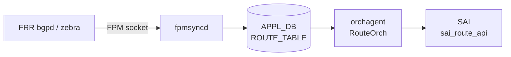

# APPL_DB ROUTE_TABLE テーブル

## 概要

`ROUTE_TABLE` は [APPL_DB](../../reference/glossary.md#term-appl_db) 上に存在する転送経路テーブル。[FRR](../../reference/glossary.md#term-frr) の FPM（Forwarding Plane Manager）ソケットを受信した `fpmsyncd` が書き込み主体となり、unicast・blackhole・EVPN・[SRv6](../../reference/glossary.md#term-srv6) の各種経路を格納する[^rsync]。`orchagent` 内の `RouteOrch` がこのテーブルを購読し、[SAI](../../reference/glossary.md#term-sai) `sai_route_api` を通じてハードウェア転送テーブルへ反映する[^rorch]。テーブル名の定数は `schema.h` で `APP_ROUTE_TABLE_NAME = "ROUTE_TABLE"` と定義されている[^schema]。

## key 構造

```text
ROUTE_TABLE|<prefix>
ROUTE_TABLE|Vrf<name>:<prefix>
```

| key 要素 | 説明 |
|---------|------|
| `<prefix>` | IPv4 または IPv6 prefix（例 `10.0.0.0/24`、`2001:db8::/32`） |
| `Vrf<name>:` | VRF-aware 経路のプレフィクス。`Vrf` で始まる VRF デバイス名 + `:`。 |

VRF-aware 経路では VRF 名が key に埋め込まれる（コロン区切り）。`Vrf` プレフィクスを持たないインタフェース（eth0、docker0、eth1-midplane）宛ての経路は `fpmsyncd` が DEL に変換してスキップする[^rsync]。

## 主要フィールド

| フィールド | 型 | 既定値 | 説明 |
|-----------|----|--------|------|
| `protocol` | string | 省略（空文字列） | 経路学習プロトコル。`"static"` / `"bgp"` / `"ospf"` / `"isis"` 等。空の場合はフィールドなし |
| `blackhole` | string | 省略（= `"false"`） | `"true"` の場合は blackhole 経路（パケット破棄）。`"false"` 相当のときフィールド省略 |
| `nexthop` | string | 省略（空文字列） | nexthop IP アドレス。ECMP はカンマ区切り。`nexthop_group` と排他 |
| `ifname` | string | 省略（空文字列） | 出力 interface 名。ECMP はカンマ区切り |
| `weight` | string | 省略（空文字列） | ECMP 重み。カンマ区切り整数 |
| `nexthop_group` | string | 省略（空文字列） | NHG（NextHop Group）テーブルのキー文字列。`nexthop` と排他 |
| `mpls_nh` | string | 省略（空文字列） | MPLS ラベルスタック（カンマ区切り） |
| `vni_label` | string | 省略（空文字列） | EVPN VNI 値 |
| `router_mac` | string | 省略（空文字列） | EVPN 宛先ルータ MAC |
| `segment` | string | 省略（空文字列） | [SRv6](../../reference/glossary.md#term-srv6) SID-list テーブルキー |
| `seg_src` | string | 省略（空文字列） | SRv6 source address |

## 書き込み主体

| 書き込み元 | 経路種別 |
|-----------|---------|
| `fpmsyncd` (RouteSync) | unicast / blackhole / MPLS / EVPN IP Prefix / SRv6 VPN |
| `bgpcfgd` StaticRouteMgr | `STATIC_ROUTE` CONFIG_DB から変換した静的経路（VRF-aware） |

## 購読者

- `orchagent` / `RouteOrch`: `ROUTE_TABLE` を `ConsumerStateTable` で購読。`sai_route_api->create_route_entry()` でハードウェアに経路を書き込む。ECMP の場合は `sai_next_hop_group_api` と連携。
- `warmRestartHelper`: ウォームリブート時に APPL_DB エントリを一時保持し、FRR 再接続後に再生する。

<!-- cdb-mermaid -->
### データフロー (自動生成)



!!! note "凡例"
    FRR から SAI までの転送経路。fpmsyncd が APPL_DB の書き込み主体となる。
<!-- /cdb-mermaid -->

## 制約

- `nexthop_group` と `nexthop` / `ifname` は排他。両方を指定するとエラー[^rorch]。
- `blackhole` が `"true"` の場合、`nexthop` / `ifname` は不要かつ無視される。
- VRF-aware 経路の key は `Vrf<name>:` プレフィクスを含む（コロン区切り）。`Vrf` で始まらない VRF 名は `fpmsyncd` がエラーログを出して処理を中断する[^rsync]。
- EVPN IP Prefix 経路では `nexthop`・`vni_label`・`router_mac`・`ifname` が揃っていない場合は ROUTE_TABLE への書き込みをスキップする[^rsync]。

## 引用元

[^rsync]: fpmsyncd RouteSync 実装: `sonic-swss/fpmsyncd/routesync.cpp`, `routesync.h`. <https://github.com/sonic-net/sonic-swss/blob/4305596156d70e9797e8a881b3d19b46de0bce0d/fpmsyncd/routesync.cpp>
[^rorch]: RouteOrch 実装: `sonic-swss/orchagent/routeorch.cpp`. <https://github.com/sonic-net/sonic-swss/blob/4305596156d70e9797e8a881b3d19b46de0bce0d/orchagent/routeorch.cpp>
[^schema]: テーブル名定数: `sonic-swss-common/common/schema.h`. <https://github.com/sonic-net/sonic-swss-common/blob/158de8d3463ff4b841653f6d57190bb142b80d9c/common/schema.h>

<!-- defaults -->
## フィールドの暗黙デフォルト (Phase A)

以下はコード精読により判明した APPL_DB `ROUTE_TABLE` フィールドのコード由来デフォルト。`fpmsyncd` が非 ZMQ パスで書き込む際の省略ロジックと、`orchagent` (consumer) 側の初期値を対比する[^rsync][^rorch]。

### フィールド省略ロジック（fpmsyncd 非 ZMQ パス）

`RouteTableFieldValueTupleWrapper::fieldValueTupleVector()` (`routesync.cpp` L1019-L1051) は値がデフォルトと同じ場合はフィールドを APPL_DB に送信しない:

| フィールド | struct 初期値 | 省略条件 | orchagent 側初期値 |
|-----------|-------------|---------|------------------|
| `protocol` | `""` (空文字列) | 空文字列のとき省略 | `""` (未設定) |
| `blackhole` | `"false"` | `"false"` と等しいとき省略 | `false` (bool) |
| `nexthop` | `""` | 空文字列のとき省略 | `""` |
| `ifname` | `""` | 空文字列のとき省略 | `""` |
| `nexthop_group` | `""` | 空文字列のとき省略 | `""` |
| `mpls_nh` | `""` | 空文字列のとき省略 | — (別処理) |
| `weight` | `""` | 空文字列のとき省略 | `""` |
| `vni_label` | `""` | 空文字列のとき省略 | — |
| `router_mac` | `""` | 空文字列のとき省略 | — |
| `segment` | `""` | 空文字列のとき省略 | `""` |
| `seg_src` | `""` | 空文字列のとき省略 | `""` |

ZMQ 有効時（Northbound ZMQ パス）は全フィールドを空文字列含めて常に送信する。

### `blackhole` の重要な挙動

- **フィールド不在 = false**: `routeorch.cpp` L765-L766 で `blackhole` フィールドが absent の場合、`bool blackhole = false` として扱われる。
- **RTN_BLACKHOLE タイプの場合**: fpmsyncd は `fvw.blackhole = "true"` を明示的にセットし、`nexthop` / `ifname` は省略する（L2176-L2178）。

### `protocol` フィールドの変換

`getProtocolString()` が Linux `rtm_protocol` 番号を文字列に変換する。代表値:

| rtm_protocol | `protocol` 文字列 |
|-------------|-----------------|
| `RTPROT_STATIC` (4) | `"static"` |
| `RTPROT_BGP` (186) | `"bgp"` |
| `RTPROT_OSPF` (188) | `"ospf"` |
| `RTPROT_ISIS` (187) | `"isis"` |
| 不明 / 未登録 | 空文字列 → フィールド省略 |

### `nexthop` のデフォルト nexthop アドレス

NHG（NextHop Group）が単一 nexthop でかつ nexthop アドレスが空の場合、fpmsyncd は:

```cpp
// routesync.cpp L2214
string nexthops = nhg.nexthop.empty()
    ? (rtnl_route_get_family(route_obj) == AF_INET ? "0.0.0.0" : "::")
    : nhg.nexthop;
```

IPv4 connected 経路 → `"0.0.0.0"`、IPv6 connected 経路 → `"::"` が nexthop として設定される。

### `weight` — 等コスト時は省略

weight が全 nexthop で等しい（ECMP 均等）場合、`getNextHopWt()` が空文字列を返し weight フィールドは省略される。orchagent は weight なし = 均等 ECMP と解釈する。

<!-- /defaults -->
