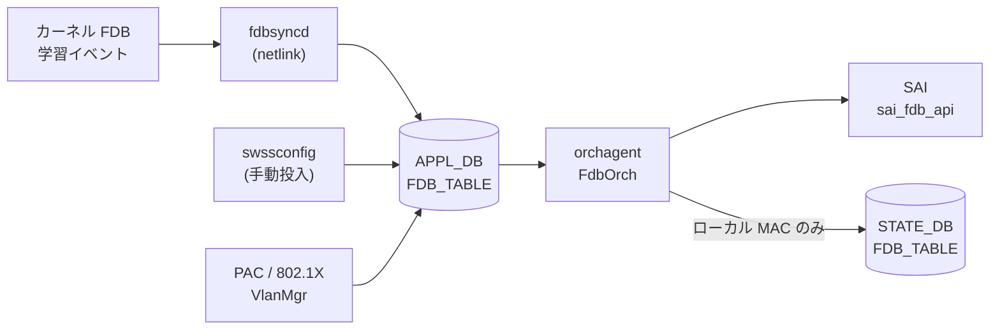

# APPL_DB FDB_TABLE

## 概要

[APPL_DB](../../reference/glossary.md#term-appl_db) の `FDB_TABLE` は**動的学習 MAC エントリ**と**静的プロビジョニング MAC エントリ**の両方を保持する実行時テーブルである[^1]。

CONFIG_DB の `FDB` テーブルが静的エントリの設定ソースであるのに対し、`APPL_DB FDB_TABLE` はカーネルの FDB 学習イベント (`fdbsyncd`) や `swssconfig` 投入、PAC/802.1X 認証 (`VlanMgr`) など複数の書き込み経路を持ち、`orchagent` の `FdbOrch` が SAI FDB エントリへと変換する。

<!-- defaults -->
## コード由来デフォルト

### field: `type`

`fdborch.cpp:770` で `string type = "dynamic";` と初期化される。フィールドが APPL_DB に存在しない場合は `"dynamic"` がデフォルトとして使用される。

```cpp
// sonic-swss/orchagent/fdborch.cpp:769-770
string port = "";
string type = "dynamic";
```

有効値: `"static"` / `"dynamic"` / `"dynamic_local"`（MCLAG ローカル扱い）。

`fdborch.cpp:830` に assert チェックがある:

```cpp
assert(type == "dynamic" || type == "dynamic_local" || type == "static");
```

無効な `type` 値は orchagent プロセスのクラッシュを引き起こす。

### field: `port`

`fdborch.cpp:769` で `string port = "";` と初期化される。フィールドが省略されると空文字のまま `addFdbEntry()` に渡され、ポート解決に失敗して FDB エントリが登録されない。実装上は**必須フィールド**。

### field: `discard`

`fdborch.cpp:775` で `string discard = "false";` と初期化される。PAC/802.1X が設定した MAC エントリの破棄制御に使用する。フィールド不在時は `"false"`（破棄しない）と解釈される。

### VlanMgr (PAC) 側の producer デフォルト

`vlanmgr.cpp:806` での初期値は consumer 側と異なる点に注意:

```cpp
// sonic-swss/cfgmgr/vlanmgr.cpp:806
string port, discard = "false", type = "static";
```

PAC/802.1X 経由の書き込みでは `type` デフォルトが `"static"` となる。

### SAI 型マッピング

| `type` 値 | origin | SAI 型 |
|-----------|--------|--------|
| `"dynamic"` | LEARN / PROVISIONED | `SAI_FDB_ENTRY_TYPE_DYNAMIC` |
| `"static"` | PROVISIONED | `SAI_FDB_ENTRY_TYPE_STATIC` |
| `"dynamic_local"` | MCLAG_ADVERTIZED | `SAI_FDB_ENTRY_TYPE_DYNAMIC`（aging 有効化目的） |
| `"static"` | VXLAN_ADVERTIZED / MCLAG_ADVERTIZED | `SAI_FDB_ENTRY_TYPE_STATIC` |

<!-- /defaults -->

## key 構造

```text
FDB_TABLE:<VlanName>:<MAC>
```

- `<VlanName>`: `Vlan<id>` 形式 (例: `Vlan100`)
- `<MAC>`: MAC アドレス (例: `00:11:22:33:44:55`)

!!! note "APPL_DB key 区切り文字"
    APPL_DB では key 区切り文字がコロン (`:`) であり、CONFIG_DB のパイプ (`|`) とは異なる。

## フィールド一覧

| フィールド | 型 | 必須 | デフォルト | 説明 |
|-----------|----|------|-----------|------|
| `port` | string | 実質必須 | `""` (空) | 送出ポート名 (例: `Ethernet0`, `PortChannel1`) |
| `type` | enum | - | `"dynamic"` | エントリ種別: `"static"` / `"dynamic"` / `"dynamic_local"` |
| `discard` | `"true"` \| `"false"` | - | `"false"` | `"true"` で該当 MAC パケットを破棄 (PAC 用) |

### VXLAN 経由エントリの追加フィールド

`VXLAN_FDB_TABLE` 起源のエントリのみ追加フィールドが付く:

| フィールド | 型 | デフォルト | 説明 |
|-----------|----|-----------|------|
| `remote_vtep` | string (IP) | `""` | リモート VTEP の IP アドレス |
| `esi` | string | `""` | Ethernet Segment Identifier (EVPN) |
| `vni` | uint32 | `0` | VXLAN Network Identifier |

## 書き込み経路

| 書き込み元 | コード箇所 | `type` デフォルト | 備考 |
|-----------|----------|-----------------|------|
| `fdbsyncd` (動的学習) | `fdbsync.cpp` — kernel netlink → APPL_DB 直書き | `"dynamic"` | MAC 学習イベントをリアルタイムに反映 |
| `swssconfig` (手動投入) | `swssconfig -d -j fdb.json` | JSON に依存 | CONFIG_DB `FDB` → `swssconfig` → APPL_DB |
| VlanMgr / PAC | `vlanmgr.cpp:832` | `"static"` | 802.1X 認証後に投入 |
| VXLAN FDB Sync | `fdbsync.cpp:676` | `"dynamic"` | VXLAN_FDB_TABLE 経由 → FdbOrch が統合 |

## 購読者

- **orchagent / FdbOrch**: `APP_FDB_TABLE_NAME` を購読して SAI FDB エントリを作成・削除する (`orchdaemon.cpp:227`)
- STATE_DB `FDB_TABLE` にローカル MAC の `port` / `type` を書き戻す（`fdborch.cpp:1577-1582`）

## データフロー



## 例外条件・特殊挙動

- **`port` 省略時**: `addFdbEntry()` でポート解決が失敗し、エントリが追加されない。エラーログ出力。
- **`type` の assert チェック**: `fdborch.cpp:830` で無効な type 値はプロセスクラッシュを引き起こす。
- **`dynamic_local`**: MCLAG ピアから受信した MAC を aging 対象として扱うための内部値。ユーザーが直接設定することは想定されていない。
- **FDB_ORIGIN と type の組み合わせ**: `{"static", FDB_ORIGIN_LEARN}` は無効な組み合わせとしてコメントされている (`fdborch.h:57`)。

<!-- ordering -->
## 書込み順依存 (Phase B)

`FdbOrch::doTask(Consumer&)` / `addFdbEntry()` / `removeFdbEntry()` (`sonic-swss/orchagent/fdborch.cpp`) を全行精読した結果、以下の順序依存・タイミング依存を検出した。中間ノート: `meta/_intermediate/cdb-flow/appl-fdb-ordering.md`。

### 他テーブル先行必須

| 先行条件 | 理由 | 違反時の挙動 |
|---|---|---|
| PortsOrch `allPortsReady()` | `doTask()` 冒頭の全体ガード | 全 PORT の SAI 作成完了まで FDB_TABLE のイベントは一切処理されず `m_toSync` に滞留（`fdborch.cpp:711-714`） |
| `VLAN|<name>` (= PortsOrch に `Vlan<id>` 登録済み) | `doTask()` で `m_portsOrch->getPort(keys[0], vlan)` により VLAN OID を解決 | SET は `it++` で次周回再試行（**自動ポーリング**）、DEL は `deleteFdbEntryFromSavedFDB()` だけ実行して erase（`fdborch.cpp:739-761`） |
| `PORT|<alias>` の bridge_port 作成完了 | `addFdbEntry()` が `port.m_bridge_port_id != SAI_NULL_OBJECT_ID` を要求 | `saved_fdb_entries[port_name]` に push して保留。PortsOrch observer 経由で replay（`fdborch.cpp:1297-1304`） |
| `VLAN_MEMBER|<vlan>|<port>` | `addFdbEntry()` が `m_portsOrch->isVlanMember()` を要求 | 同上 `saved_fdb_entries` に保留。`updateVlanMember(add=true)` で **自動 replay**（`fdborch.cpp:1240-1275, 1312-1319`） |
| VxlanTunnelOrch / EvpnNvoOrch の tunnel 作成 (`APP_VXLAN_FDB_TABLE` 経路のみ) | `getTunnelPortName(remote_ip)` / `getEVPNVtep()` の解決を要求 | **再試行されず `m_toSync.erase` で破棄**。tunnel を先に作る運用が必須（`fdborch.cpp:832-856`） |

**推奨書込み順序**:

```text
# 1. PortsOrch 初期化完了 (orchagent 起動時に自然満足)
# 2. VLAN
SET CONFIG_DB VLAN|Vlan100
# 3. VLAN メンバーシップ (PORT は CONFIG_DB PORT で先に作成済み前提)
SET CONFIG_DB VLAN_MEMBER|Vlan100|Ethernet0
# 4. (VXLAN MAC を投入する場合) tunnel を先に作成
# 5. FDB エントリ
SET APPL_DB FDB_TABLE:Vlan100:00:11:22:33:44:55  port=Ethernet0  type=static
```

### retry / 自動調停の仕組み

- **doTask 周回再試行**: VLAN 未解決の SET は `m_toSync` に残し続け、`Orch::doTask()` の次回スケジュールで再評価される。VLAN 作成完了まで無限ポーリング。
- **saved_fdb_entries による保留**: PORT 未解決 / VLAN メンバー未満足の SET は `saved_fdb_entries[port_name]` に push して**呼び出し側からは成功扱い** (`return true`) で `m_toSync` から消える。実際の SAI 作成は PortsOrch からの `updateVlanMember()` 通知で `addFdbEntry()` を再実行することで完了する (`fdborch.cpp:39` `m_portsOrch->attach(this)` で observer 登録)。
- **VXLAN 経路は救済なし**: `remote_ip` 未指定 / VTEP 未作成のときは `m_toSync.erase` で**破棄**される。再投入が必要。

### SET 後 DEL の順序依存

| シナリオ | 挙動 | 安全な手順 |
|---|---|---|
| 投入した origin と異なる origin から DEL | `removeFdbEntry()` L1663-1690 で **silently ignored** (MCLAG ピアポート down 時のみ例外で LEARN として削除) | **投入と同じ origin** から DEL する。VXLAN 由来 MAC を直 APPL_DB DEL しても消えない |
| VLAN DEL → FDB DEL の到着逆転 | `doTask()` L742-754 が vlan_id を `keys[0].substr(4)` でパースし `deleteFdbEntryFromSavedFDB()` でクリーンアップ | 自動調停。順序意識不要 |
| `m_entries` に存在しない MAC の DEL (二重 DEL / 学習前 DEL) | `removeFdbEntry()` L1646-1654 で saved_fdb のみクリーンアップして冪等成功 | 安全（冪等） |
| VLAN_MEMBER DEL → FDB は残存？ | `updateVlanMember(add=false)` L1244-1250 で `flushFDBEntries(bridge_port, vlan_oid)` を呼び **当該 VLAN の MAC を一括 flush** | VLAN_MEMBER DEL は FDB DEL を内包。明示 DEL 不要 |

### 入力検証 (fail-fast)

- `doTask()` L830 `assert(type == "dynamic" || type == "dynamic_local" || type == "static")` — 不正な `type` 値は **orchagent プロセスをクラッシュ**させる。Producer 側で値の妥当性を保証すること。

<!-- /ordering -->

## 関連 CONFIG_DB / YANG / CLI

- CONFIG_DB: `FDB`（静的エントリのソース）、`VLAN`、`VLAN_MEMBER`
- CLI: `show mac` (FDB テーブル表示)、`sonic-clear fdb all` (動的エントリクリア)

## 引用元

[^1]: `sonic-swss-common/common/schema.h:52` — `#define APP_FDB_TABLE_NAME "FDB_TABLE"`. <https://github.com/sonic-net/sonic-swss-common/blob/master/common/schema.h>
