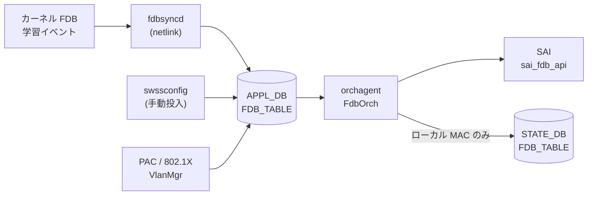

# APPL_DB FDB_TABLE

## 概要

[APPL_DB](../../reference/glossary.md#term-appl_db) の `FDB_TABLE` は**動的学習 MAC エントリ**と**静的プロビジョニング MAC エントリ**の両方を保持する実行時テーブルである[^1]。

CONFIG_DB の `FDB` テーブルが静的エントリの設定ソースであるのに対し、`APPL_DB FDB_TABLE` はカーネルの FDB 学習イベント (`fdbsyncd`) や `swssconfig` 投入、PAC/802.1X 認証 (`VlanMgr`) など複数の書き込み経路を持ち、`orchagent` の `FdbOrch` が SAI FDB エントリへと変換する。

<!-- defaults -->
## コード由来デフォルト

### field: `type`

`fdborch.cpp:770` で `string type = "dynamic";` と初期化される。フィールドが APPL_DB に存在しない場合は `"dynamic"` がデフォルトとして使用される。

```cpp
// sonic-swss/orchagent/fdborch.cpp:769-770
string port = "";
string type = "dynamic";
```

有効値: `"static"` / `"dynamic"` / `"dynamic_local"`（MCLAG ローカル扱い）。

`fdborch.cpp:830` に assert チェックがある:

```cpp
assert(type == "dynamic" || type == "dynamic_local" || type == "static");
```

無効な `type` 値は orchagent プロセスのクラッシュを引き起こす。

### field: `port`

`fdborch.cpp:769` で `string port = "";` と初期化される。フィールドが省略されると空文字のまま `addFdbEntry()` に渡され、ポート解決に失敗して FDB エントリが登録されない。実装上は**必須フィールド**。

### field: `discard`

`fdborch.cpp:775` で `string discard = "false";` と初期化される。PAC/802.1X が設定した MAC エントリの破棄制御に使用する。フィールド不在時は `"false"`（破棄しない）と解釈される。

### VlanMgr (PAC) 側の producer デフォルト

`vlanmgr.cpp:806` での初期値は consumer 側と異なる点に注意:

```cpp
// sonic-swss/cfgmgr/vlanmgr.cpp:806
string port, discard = "false", type = "static";
```

PAC/802.1X 経由の書き込みでは `type` デフォルトが `"static"` となる。

### SAI 型マッピング

| `type` 値 | origin | SAI 型 |
|-----------|--------|--------|
| `"dynamic"` | LEARN / PROVISIONED | `SAI_FDB_ENTRY_TYPE_DYNAMIC` |
| `"static"` | PROVISIONED | `SAI_FDB_ENTRY_TYPE_STATIC` |
| `"dynamic_local"` | MCLAG_ADVERTIZED | `SAI_FDB_ENTRY_TYPE_DYNAMIC`（aging 有効化目的） |
| `"static"` | VXLAN_ADVERTIZED / MCLAG_ADVERTIZED | `SAI_FDB_ENTRY_TYPE_STATIC` |

<!-- /defaults -->

## key 構造

```text
FDB_TABLE:<VlanName>:<MAC>
```

- `<VlanName>`: `Vlan<id>` 形式 (例: `Vlan100`)
- `<MAC>`: MAC アドレス (例: `00:11:22:33:44:55`)

!!! note "APPL_DB key 区切り文字"
    APPL_DB では key 区切り文字がコロン (`:`) であり、CONFIG_DB のパイプ (`|`) とは異なる。

## フィールド一覧

| フィールド | 型 | 必須 | デフォルト | 説明 |
|-----------|----|------|-----------|------|
| `port` | string | 実質必須 | `""` (空) | 送出ポート名 (例: `Ethernet0`, `PortChannel1`) |
| `type` | enum | - | `"dynamic"` | エントリ種別: `"static"` / `"dynamic"` / `"dynamic_local"` |
| `discard` | `"true"` \| `"false"` | - | `"false"` | `"true"` で該当 MAC パケットを破棄 (PAC 用) |

### VXLAN 経由エントリの追加フィールド

`VXLAN_FDB_TABLE` 起源のエントリのみ追加フィールドが付く:

| フィールド | 型 | デフォルト | 説明 |
|-----------|----|-----------|------|
| `remote_vtep` | string (IP) | `""` | リモート VTEP の IP アドレス |
| `esi` | string | `""` | Ethernet Segment Identifier (EVPN) |
| `vni` | uint32 | `0` | VXLAN Network Identifier |

## 書き込み経路

| 書き込み元 | コード箇所 | `type` デフォルト | 備考 |
|-----------|----------|-----------------|------|
| `fdbsyncd` (動的学習) | `fdbsync.cpp` — kernel netlink → APPL_DB 直書き | `"dynamic"` | MAC 学習イベントをリアルタイムに反映 |
| `swssconfig` (手動投入) | `swssconfig -d -j fdb.json` | JSON に依存 | CONFIG_DB `FDB` → `swssconfig` → APPL_DB |
| VlanMgr / PAC | `vlanmgr.cpp:832` | `"static"` | 802.1X 認証後に投入 |
| VXLAN FDB Sync | `fdbsync.cpp:676` | `"dynamic"` | VXLAN_FDB_TABLE 経由 → FdbOrch が統合 |

## 購読者

- **orchagent / FdbOrch**: `APP_FDB_TABLE_NAME` を購読して SAI FDB エントリを作成・削除する (`orchdaemon.cpp:227`)
- STATE_DB `FDB_TABLE` にローカル MAC の `port` / `type` を書き戻す（`fdborch.cpp:1577-1582`）

## データフロー



## 例外条件・特殊挙動

- **`port` 省略時**: `addFdbEntry()` でポート解決が失敗し、エントリが追加されない。エラーログ出力。
- **`type` の assert チェック**: `fdborch.cpp:830` で無効な type 値はプロセスクラッシュを引き起こす。
- **`dynamic_local`**: MCLAG ピアから受信した MAC を aging 対象として扱うための内部値。ユーザーが直接設定することは想定されていない。
- **FDB_ORIGIN と type の組み合わせ**: `{"static", FDB_ORIGIN_LEARN}` は無効な組み合わせとしてコメントされている (`fdborch.h:57`)。

## 関連 CONFIG_DB / YANG / CLI

- CONFIG_DB: `FDB`（静的エントリのソース）、`VLAN`、`VLAN_MEMBER`
- CLI: `show mac` (FDB テーブル表示)、`sonic-clear fdb all` (動的エントリクリア)

<!-- cross-refs -->
## 暗黙参照 (cross-table refs)

`APPL_DB FDB_TABLE` は YANG 未定義のため leafref は持たないが、`FdbOrch` (orchagent) が他テーブル / 他 Orch から OID を解決して SAI に渡す**暗黙参照**を多数持つ。コード調査の詳細は `meta/_intermediate/cdb-flow/appl-fdb-cross-refs.md` に記録した。

### 1. VLAN（key の `<VlanName>` — 必須依存）

- **参照先**: CONFIG_DB `VLAN` / APPL_DB `VLAN_TABLE`
- **方向**: 読み取り (`PortsOrch::getPort(VlanName)` → `vlan_oid`)
- **参照元**: `fdborch.cpp:739`（key 分解後の VLAN 解決）, `fdborch.cpp:765`（`entry.bv_id = vlan.m_vlan_info.vlan_oid`）
- **意味**: `Vlan<id>` を SAI `vlan_oid` に解決し、SAI FDB entry の `bv_id` に設定する。VLAN 未作成だと `m_toSync` に保留され、後で VLAN が作成されたタイミングで再試行される。
- **ブロッキング**: `allPortsReady()` が false の間、`doTask()` は全 FDB 処理を停止する (`fdborch.cpp:711` / `fdborch.cpp:927`)。

### 2. PORT / PORTCHANNEL（フィールド `port` — 実質必須）

- **参照先**: `PORT` / `PORTCHANNEL`（および VXLAN tunnel 仮想 port）
- **方向**: 読み取り (`PortsOrch::getPort(alias)` → `m_bridge_port_id`)
- **参照元**: `fdborch.cpp:976`（PORT flush 操作）, `fdborch.cpp:1449`（`SAI_FDB_ENTRY_ATTR_BRIDGE_PORT_ID` 設定）
- **意味**: `port` フィールドを `Port` オブジェクトに解決し、その `bridge_port_id` を SAI FDB entry に渡す。bridge port が未生成だと `addFdbEntry()` が失敗。SAI FDB イベント側でも `getPortByBridgePortId()` で逆解決される (`fdborch.cpp:297` / `340` / `438` / `564` / `698`)。

### 3. VLAN_MEMBER（FDB flush 連動 — 購読）

- **参照先**: `VLAN_MEMBER`（`PortsOrch` 経由）
- **方向**: `SUBJECT_TYPE_VLAN_MEMBER_CHANGE` 購読
- **参照元**: `fdborch.cpp:39`（`m_portsOrch->attach(this)`）, `fdborch.cpp:655`
- **意味**: Port が VLAN から削除されると、その port × vlan に紐づく動的 FDB を SAI flush する。FDB エントリ自体が VLAN_MEMBER を read するわけではなく、`PortsOrch` のサブジェクト通知経由で flush 連動する。

### 4. VXLAN_TUNNEL / VXLAN_EVPN_NVO（VXLAN_ADVERTIZED 起源のみ）

- **参照先**: CONFIG_DB `VXLAN_TUNNEL` / `VXLAN_EVPN_NVO`（`VxlanTunnelOrch` / `EvpnNvoOrch` 管理）
- **方向**: 読み取り (`getTunnelPortName(remote_ip)` / `getEVPNVtep()`)
- **参照元**: `fdborch.cpp:834-857`, `fdborch.cpp:1467` / `1481`（`SAI_FDB_ENTRY_ATTR_ENDPOINT_IP`）
- **意味**: write 元テーブルが `VXLAN_FDB_TABLE` のとき (`origin == FDB_ORIGIN_VXLAN_ADVERTIZED`)、`remote_ip` フィールドからリモート VTEP IP を取得して `VxlanTunnelOrch::getTunnelPortName()` でトンネル port 名に解決。`port` フィールドはこの解決値で上書きされる。DIP-tunnel 非対応モードでは `EvpnNvoOrch::getEVPNVtep()` で SIP tunnel を使用。VTEP / tunnel 未作成だと該当 FDB は `m_toSync` から erase されて無視される。

### 5. STATE_DB FDB_TABLE（ローカル MAC の書き戻し）

- **参照先**: STATE_DB `FDB_TABLE`（`m_fdbStateTable`）
- **方向**: 書き込み
- **参照元**: `fdborch.cpp:131-134`, `fdborch.cpp:1569-1582`
- **意味**: ローカル学習 / 解決された MAC の `port` / `type` を STATE_DB に書き戻し、`show mac` / `fdbshow` CLI の表示ソースとする。MCLAG_ADVERTIZED 起源は除外。

### 6. STATE_DB MCLAG_FDB_TABLE（MCLAG_ADVERTIZED 起源のみ）

- **参照先**: STATE_DB `MCLAG_FDB_TABLE`（`m_mclagFdbStateTable`）
- **方向**: 書き込み / 削除
- **参照元**: `fdborch.cpp:872-878`（追加）, `fdborch.cpp:901-908`（削除）
- **意味**: MCLAG ピアから advertise された MAC を STATE_DB に書き、`mclagsyncd` がピア同期に使う。`dynamic_local` に格上げされたタイミングで state エントリを削除し、broadcast 対象から外す。

### 7. PortsOrch SUBJECT 通知 (`PORT_OPER_STATE_CHANGE` 等)

- **参照先**: `PortsOrch` observer
- **方向**: 購読
- **参照元**: `fdborch.cpp:655-661`
- **意味**: Port oper-down 等の物理層イベントを観察し、該当 port の動的 FDB を SAI flush する。

### 参照関係サマリ

```
APPL_DB FDB_TABLE
  |- [必須]  VLAN.name                       (key の <VlanName> -> vlan_oid)
  |- [必須]  PORT / PORTCHANNEL              (port field -> bridge_port_id)
  |- [購読]  VLAN_MEMBER                     (flush 連動)
  |- [VXLAN] VXLAN_TUNNEL / VXLAN_EVPN_NVO  (VXLAN_ADVERTIZED 起源のみ — port 名置換 / endpoint IP)
  |- [出力]  STATE_DB FDB_TABLE              (ローカル MAC の書き戻し)
  |- [出力]  STATE_DB MCLAG_FDB_TABLE        (MCLAG_ADVERTIZED 起源のみ)
  `- [購読]  PortsOrch SUBJECT_TYPE_*        (Port oper / VLAN member 変化に flush 連動)
```

YANG leafref が存在しないため、これら参照はいずれも実行時にコード経由で解決され、参照先テーブルの作成順序が崩れた場合は該当 FDB エントリが `m_toSync` 保留または erase される。

<!-- /cross-refs -->

## 引用元

[^1]: `sonic-swss-common/common/schema.h:52` — `#define APP_FDB_TABLE_NAME "FDB_TABLE"`. <https://github.com/sonic-net/sonic-swss-common/blob/master/common/schema.h>
