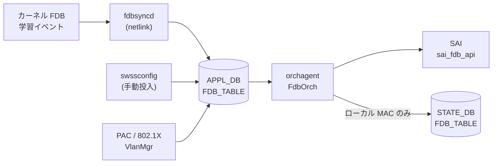
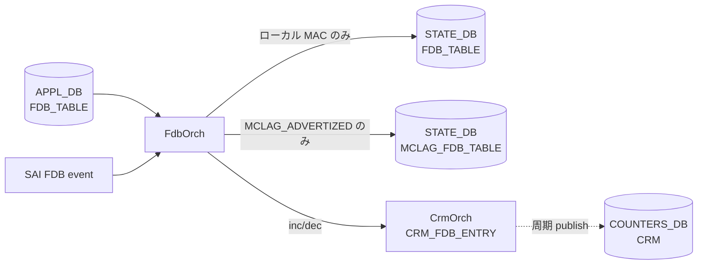

# APPL_DB FDB_TABLE

## 概要

[APPL_DB](../../reference/glossary.md#term-appl_db) の `FDB_TABLE` は**動的学習 MAC エントリ**と**静的プロビジョニング MAC エントリ**の両方を保持する実行時テーブルである[^1]。

CONFIG_DB の `FDB` テーブルが静的エントリの設定ソースであるのに対し、`APPL_DB FDB_TABLE` はカーネルの FDB 学習イベント (`fdbsyncd`) や `swssconfig` 投入、PAC/802.1X 認証 (`VlanMgr`) など複数の書き込み経路を持ち、`orchagent` の `FdbOrch` が SAI FDB エントリへと変換する。

<!-- defaults -->
## コード由来デフォルト

### field: `type`

`fdborch.cpp:770` で `string type = "dynamic";` と初期化される。フィールドが APPL_DB に存在しない場合は `"dynamic"` がデフォルトとして使用される。

```cpp
// sonic-swss/orchagent/fdborch.cpp:769-770
string port = "";
string type = "dynamic";
```

有効値: `"static"` / `"dynamic"` / `"dynamic_local"`（MCLAG ローカル扱い）。

`fdborch.cpp:830` に assert チェックがある:

```cpp
assert(type == "dynamic" || type == "dynamic_local" || type == "static");
```

無効な `type` 値は orchagent プロセスのクラッシュを引き起こす。

### field: `port`

`fdborch.cpp:769` で `string port = "";` と初期化される。フィールドが省略されると空文字のまま `addFdbEntry()` に渡され、ポート解決に失敗して FDB エントリが登録されない。実装上は**必須フィールド**。

### field: `discard`

`fdborch.cpp:775` で `string discard = "false";` と初期化される。PAC/802.1X が設定した MAC エントリの破棄制御に使用する。フィールド不在時は `"false"`（破棄しない）と解釈される。

### VlanMgr (PAC) 側の producer デフォルト

`vlanmgr.cpp:806` での初期値は consumer 側と異なる点に注意:

```cpp
// sonic-swss/cfgmgr/vlanmgr.cpp:806
string port, discard = "false", type = "static";
```

PAC/802.1X 経由の書き込みでは `type` デフォルトが `"static"` となる。

### SAI 型マッピング

| `type` 値 | origin | SAI 型 |
|-----------|--------|--------|
| `"dynamic"` | LEARN / PROVISIONED | `SAI_FDB_ENTRY_TYPE_DYNAMIC` |
| `"static"` | PROVISIONED | `SAI_FDB_ENTRY_TYPE_STATIC` |
| `"dynamic_local"` | MCLAG_ADVERTIZED | `SAI_FDB_ENTRY_TYPE_DYNAMIC`（aging 有効化目的） |
| `"static"` | VXLAN_ADVERTIZED / MCLAG_ADVERTIZED | `SAI_FDB_ENTRY_TYPE_STATIC` |

<!-- /defaults -->

## key 構造

```text
FDB_TABLE:<VlanName>:<MAC>
```

- `<VlanName>`: `Vlan<id>` 形式 (例: `Vlan100`)
- `<MAC>`: MAC アドレス (例: `00:11:22:33:44:55`)

!!! note "APPL_DB key 区切り文字"
    APPL_DB では key 区切り文字がコロン (`:`) であり、CONFIG_DB のパイプ (`|`) とは異なる。

## フィールド一覧

| フィールド | 型 | 必須 | デフォルト | 説明 |
|-----------|----|------|-----------|------|
| `port` | string | 実質必須 | `""` (空) | 送出ポート名 (例: `Ethernet0`, `PortChannel1`) |
| `type` | enum | - | `"dynamic"` | エントリ種別: `"static"` / `"dynamic"` / `"dynamic_local"` |
| `discard` | `"true"` \| `"false"` | - | `"false"` | `"true"` で該当 MAC パケットを破棄 (PAC 用) |

### VXLAN 経由エントリの追加フィールド

`VXLAN_FDB_TABLE` 起源のエントリのみ追加フィールドが付く:

| フィールド | 型 | デフォルト | 説明 |
|-----------|----|-----------|------|
| `remote_vtep` | string (IP) | `""` | リモート VTEP の IP アドレス |
| `esi` | string | `""` | Ethernet Segment Identifier (EVPN) |
| `vni` | uint32 | `0` | VXLAN Network Identifier |

## 書き込み経路

| 書き込み元 | コード箇所 | `type` デフォルト | 備考 |
|-----------|----------|-----------------|------|
| `fdbsyncd` (動的学習) | `fdbsync.cpp` — kernel netlink → APPL_DB 直書き | `"dynamic"` | MAC 学習イベントをリアルタイムに反映 |
| `swssconfig` (手動投入) | `swssconfig -d -j fdb.json` | JSON に依存 | CONFIG_DB `FDB` → `swssconfig` → APPL_DB |
| VlanMgr / PAC | `vlanmgr.cpp:832` | `"static"` | 802.1X 認証後に投入 |
| VXLAN FDB Sync | `fdbsync.cpp:676` | `"dynamic"` | VXLAN_FDB_TABLE 経由 → FdbOrch が統合 |

## 購読者

- **orchagent / FdbOrch**: `APP_FDB_TABLE_NAME` を購読して SAI FDB エントリを作成・削除する (`orchdaemon.cpp:227`)
- STATE_DB `FDB_TABLE` にローカル MAC の `port` / `type` を書き戻す（`fdborch.cpp:1577-1582`）

## データフロー



## 例外条件・特殊挙動

- **`port` 省略時**: `addFdbEntry()` でポート解決が失敗し、エントリが追加されない。エラーログ出力。
- **`type` の assert チェック**: `fdborch.cpp:830` で無効な type 値はプロセスクラッシュを引き起こす。
- **`dynamic_local`**: MCLAG ピアから受信した MAC を aging 対象として扱うための内部値。ユーザーが直接設定することは想定されていない。
- **FDB_ORIGIN と type の組み合わせ**: `{"static", FDB_ORIGIN_LEARN}` は無効な組み合わせとしてコメントされている (`fdborch.h:57`)。

<!-- ordering -->
## 書込み順依存 (Phase B)

`FdbOrch::doTask(Consumer&)` / `addFdbEntry()` / `removeFdbEntry()` (`sonic-swss/orchagent/fdborch.cpp`) を全行精読した結果、以下の順序依存・タイミング依存を検出した。中間ノート: `meta/_intermediate/cdb-flow/appl-fdb-ordering.md`。

### 他テーブル先行必須

| 先行条件 | 理由 | 違反時の挙動 |
|---|---|---|
| PortsOrch `allPortsReady()` | `doTask()` 冒頭の全体ガード | 全 PORT の SAI 作成完了まで FDB_TABLE のイベントは一切処理されず `m_toSync` に滞留（`fdborch.cpp:711-714`） |
| `VLAN|<name>` (= PortsOrch に `Vlan<id>` 登録済み) | `doTask()` で `m_portsOrch->getPort(keys[0], vlan)` により VLAN OID を解決 | SET は `it++` で次周回再試行（**自動ポーリング**）、DEL は `deleteFdbEntryFromSavedFDB()` だけ実行して erase（`fdborch.cpp:739-761`） |
| `PORT|<alias>` の bridge_port 作成完了 | `addFdbEntry()` が `port.m_bridge_port_id != SAI_NULL_OBJECT_ID` を要求 | `saved_fdb_entries[port_name]` に push して保留。PortsOrch observer 経由で replay（`fdborch.cpp:1297-1304`） |
| `VLAN_MEMBER|<vlan>|<port>` | `addFdbEntry()` が `m_portsOrch->isVlanMember()` を要求 | 同上 `saved_fdb_entries` に保留。`updateVlanMember(add=true)` で **自動 replay**（`fdborch.cpp:1240-1275, 1312-1319`） |
| VxlanTunnelOrch / EvpnNvoOrch の tunnel 作成 (`APP_VXLAN_FDB_TABLE` 経路のみ) | `getTunnelPortName(remote_ip)` / `getEVPNVtep()` の解決を要求 | **再試行されず `m_toSync.erase` で破棄**。tunnel を先に作る運用が必須（`fdborch.cpp:832-856`） |

**推奨書込み順序**:

```text
# 1. PortsOrch 初期化完了 (orchagent 起動時に自然満足)
# 2. VLAN
SET CONFIG_DB VLAN|Vlan100
# 3. VLAN メンバーシップ (PORT は CONFIG_DB PORT で先に作成済み前提)
SET CONFIG_DB VLAN_MEMBER|Vlan100|Ethernet0
# 4. (VXLAN MAC を投入する場合) tunnel を先に作成
# 5. FDB エントリ
SET APPL_DB FDB_TABLE:Vlan100:00:11:22:33:44:55  port=Ethernet0  type=static
```

### retry / 自動調停の仕組み

- **doTask 周回再試行**: VLAN 未解決の SET は `m_toSync` に残し続け、`Orch::doTask()` の次回スケジュールで再評価される。VLAN 作成完了まで無限ポーリング。
- **saved_fdb_entries による保留**: PORT 未解決 / VLAN メンバー未満足の SET は `saved_fdb_entries[port_name]` に push して**呼び出し側からは成功扱い** (`return true`) で `m_toSync` から消える。実際の SAI 作成は PortsOrch からの `updateVlanMember()` 通知で `addFdbEntry()` を再実行することで完了する (`fdborch.cpp:39` `m_portsOrch->attach(this)` で observer 登録)。
- **VXLAN 経路は救済なし**: `remote_ip` 未指定 / VTEP 未作成のときは `m_toSync.erase` で**破棄**される。再投入が必要。

### SET 後 DEL の順序依存

| シナリオ | 挙動 | 安全な手順 |
|---|---|---|
| 投入した origin と異なる origin から DEL | `removeFdbEntry()` L1663-1690 で **silently ignored** (MCLAG ピアポート down 時のみ例外で LEARN として削除) | **投入と同じ origin** から DEL する。VXLAN 由来 MAC を直 APPL_DB DEL しても消えない |
| VLAN DEL → FDB DEL の到着逆転 | `doTask()` L742-754 が vlan_id を `keys[0].substr(4)` でパースし `deleteFdbEntryFromSavedFDB()` でクリーンアップ | 自動調停。順序意識不要 |
| `m_entries` に存在しない MAC の DEL (二重 DEL / 学習前 DEL) | `removeFdbEntry()` L1646-1654 で saved_fdb のみクリーンアップして冪等成功 | 安全（冪等） |
| VLAN_MEMBER DEL → FDB は残存？ | `updateVlanMember(add=false)` L1244-1250 で `flushFDBEntries(bridge_port, vlan_oid)` を呼び **当該 VLAN の MAC を一括 flush** | VLAN_MEMBER DEL は FDB DEL を内包。明示 DEL 不要 |

### 入力検証 (fail-fast)

- `doTask()` L830 `assert(type == "dynamic" || type == "dynamic_local" || type == "static")` — 不正な `type` 値は **orchagent プロセスをクラッシュ**させる。Producer 側で値の妥当性を保証すること。

<!-- /ordering -->

<!-- pubsub -->
## 通信メカニズム (Phase G)

### Redis 購読方式

APPL_DB の `FDB_TABLE` / `VXLAN_FDB_TABLE` / `MCLAG_FDB_TABLE` への変更通知は、`FdbOrch` が **`swss::ConsumerStateTable`** (channel ベース PUBLISH/SUBSCRIBE) で購読する。`Orch::addConsumer()` が DB ID で分岐し、CONFIG_DB / STATE_DB / CHASSIS_APP_DB 以外（= APPL_DB）には `ConsumerStateTable` を割り当てる (`orch.cpp:1186-1196`)。**keyspace 通知 (`__keyspace@<dbId>__:...`) は使わない**。

```cpp
// sonic-swss/orchagent/orch.cpp:1186-1196
void Orch::addConsumer(DBConnector *db, string tableName, int pri)
{
    if (db->getDbId() == CONFIG_DB || db->getDbId() == STATE_DB || db->getDbId() == CHASSIS_APP_DB)
        addExecutor(new Consumer(new SubscriberStateTable(db, tableName, ..., pri), this, tableName));
    else
        addExecutor(new Consumer(new ConsumerStateTable(db, tableName, gBatchSize, pri), this, tableName));
}
```

```cpp
// sonic-swss/orchagent/orchdaemon.cpp:226-235  (FdbOrch bind)
vector<table_name_with_pri_t> app_fdb_tables = {
    { APP_FDB_TABLE_NAME,        FdbOrch::fdborch_pri },
    { APP_VXLAN_FDB_TABLE_NAME,  FdbOrch::fdborch_pri },
    { APP_MCLAG_FDB_TABLE_NAME,  FdbOrch::fdborch_pri }
};
gFdbOrch = new FdbOrch(m_applDb, app_fdb_tables, stateDbFdb, stateMclagDbFdb, gPortsOrch);
```

| 購読者 | 購読 API | 購読テーブル | 優先度 | バッチ |
|--------|---------|--------------|--------|--------|
| `orchagent` (`FdbOrch`) | `swss::ConsumerStateTable` | `FDB_TABLE` | `fdborch_pri = 20` | `gBatchSize` (default 128) |
| `orchagent` (`FdbOrch`) | 同上 | `VXLAN_FDB_TABLE` | 同上 | 同上 |
| `orchagent` (`FdbOrch`) | 同上 | `MCLAG_FDB_TABLE` | 同上 | 同上 |

`FdbOrch::fdborch_pri = 20` は `fdborch.cpp:25` で固定。`gBatchSize` は `main.cpp:459` で `DEFAULT_BATCH_SIZE = 128`、`orchagent -b <n>` (`main.cpp:478`) で上書き可能。書き込み側 (`fdbsyncd` / `swssconfig` / `vlanmgr` / `vxlanmgr` 等) はいずれも `swss::ProducerStateTable::set()` で書き込み、内部で `<TABLE>_CHANNEL@<dbId>` への `PUBLISH "G"` を発行する。TTL は使用されない。

### channel PUBLISH → ハンドラ呼び出しの流れ

```
fdbsyncd / swssconfig / vlanmgr (PAC) / vxlanmgr (EVPN)
  ↓ ProducerStateTable::set(<vlan>:<mac>, fvs)
APPL_DB: HSET "_FDB_TABLE:<vlan>:<mac>" port=<...> type=<...>
  ↓ Redis PUBLISH "FDB_TABLE_CHANNEL@0" "G"
OrchDaemon main loop: m_select->select(&s, SELECT_TIMEOUT)
  ↓ Consumer::execute() → ConsumerStateTable::pops()
FdbOrch::doTask(Consumer&)  (fdborch.cpp:707-)
  ↓ consumer.getTableName() で origin を分岐
addFdbEntry() / removeFdbEntry()
  ↓
SAI: sai_fdb_api->create_fdb_entry / remove_fdb_entry
```

- `doTask(Consumer&)` 冒頭 `fdborch.cpp:711-714` で `m_portsOrch->allPortsReady()` が false の間は **全 FDB イベント処理を停止** し、`m_toSync` に滞留させる。
- 3 つの APPL_DB テーブルは個別の `Consumer` executor として登録されるが、`doTask` 実装は共通で、`consumer.getTableName()` (`fdborch.cpp:718-727`) により `FDB_ORIGIN_PROVISIONED` / `FDB_ORIGIN_VXLAN_ADVERTIZED` / `FDB_ORIGIN_MCLAG_ADVERTIZED` に分岐する。

### PortsOrch observer (プロセス内通知パス)

channel PUBLISH 以外に、`FdbOrch` は `PortsOrch` の **C++ レベル observer** として登録される (`fdborch.cpp:39` `m_portsOrch->attach(this)`)。Redis を経由しないプロセス内コールバックで、`FdbOrch::update()` (`fdborch.cpp:648-672`) が以下 2 種類の `SubjectType` をディスパッチする。

| `SubjectType` | ディスパッチ先 | 主な役割 |
|---|---|---|
| `SUBJECT_TYPE_VLAN_MEMBER_CHANGE` | `updateVlanMember()` | `saved_fdb_entries[port_name]` に保留された SET の **自動 replay** / VLAN_MEMBER 削除時の FDB 一括 flush |
| `SUBJECT_TYPE_PORT_OPER_STATE_CHANGE` | `updatePortOperState()` | port oper-down 時の動的 FDB flush（MCLAG メンバーは除外） |

`FdbOrch` 自身も `notify(SUBJECT_TYPE_FDB_CHANGE, ...)` / `notify(SUBJECT_TYPE_FDB_FLUSH_CHANGE, ...)` (`fdborch.cpp:199, 391, 415, 544, 619, 1199, 1626, 1736`) で `NeighOrch` 等の下流 Orch に通知する。

### NotificationConsumer 経路

`FdbOrch` コンストラクタ (`fdborch.cpp:40-48`) は `ConsumerStateTable` 以外に 2 つの `NotificationConsumer` も executor 化する。

| Notification チャンネル | DB | 用途 |
|---|---|---|
| `FLUSHFDBREQUEST` | APPL_DB | `sonic-clear fdb all` 等の flush 要求受信 |
| `NOTIFICATIONS` | ASIC_DB | SAI からの FDB event (LEARN / AGED / MOVE / FLUSHED) 受信 |

いずれも Redis `SUBSCRIBE` channel ベースで、OrchDaemon の `Select` ループに別 Executor として参加する。

### warm-restart 時 — `bake()`

`FdbOrch::bake()` (`fdborch.cpp:51-65`) は warm-restart 復帰時に **STATE_DB `FDB_TABLE` の内容を `APP_FDB_TABLE_NAME` consumer の `m_toSync` に直接再充填**する経路を持つ (`refillToSync(&m_fdbStateTable)`)。`VXLAN_FDB_TABLE` / `MCLAG_FDB_TABLE` 側には bake パスなし。

### サービス再起動トリガー

なし。`FdbOrch` は同一 orchagent プロセス内のハンドラであり、APPL_DB エントリの追加/削除は SAI FDB オブジェクトのライブ操作のみで反映され、プロセス再起動・サービス restart を伴わない。port oper-state / VLAN_MEMBER 変化は PortsOrch observer 経由でハンドラに到達する。

> **Evidence**: `sonic-swss/orchagent/fdborch.cpp:25, 27-49, 51-65, 648-672, 707-727` (優先度・コンストラクタ・bake・observer・doTask)、`sonic-swss/orchagent/orch.cpp:1186-1196` (`Orch::addConsumer()` DB ID 分岐)、`sonic-swss/orchagent/orchdaemon.cpp:226-235` (`app_fdb_tables` bind と `FdbOrch` 生成)、`sonic-swss/orchagent/main.cpp:459, 478` (`DEFAULT_BATCH_SIZE = 128` と `-b` オプション)、`sonic-swss-common/common/schema.h:52, 87, 118` (テーブル名定数); 詳細分析 `meta/_intermediate/cdb-flow/appl-fdb-pubsub.md`
<!-- /pubsub -->

<!-- platform -->
## プラットフォーム差 (Phase H)

`fdborch.cpp` 全 1802 行を精読し、SAI capability への依存、MCLAG 連動、multi-asic / VOQ の観点でプラットフォーム差を抽出した。中間ノート: `meta/_intermediate/cdb-flow/appl-fdb-platform.md`。

### 1. SAI capability への依存（capability query なし）

FdbOrch は SAI capability を**事前 query せず**、以下の attr / API を無条件に使う。一部の vendor SAI 実装で未サポートの場合、`create_fdb_entry` / `flush_fdb_entries` が `SAI_STATUS_NOT_SUPPORTED` を返し `handleSaiCreateStatus()` が task_failed を返すパスに入る。

| SAI attr / API | 使用条件 | コード箇所 |
|----|----|----|
| `SAI_FDB_ENTRY_ATTR_ALLOW_MAC_MOVE = true` | origin が VXLAN_ADVERTIZED または MCLAG_ADVERTIZED **かつ** `type == "dynamic"` の MAC を SAI に登録するとき | `fdborch.cpp:1441-1448` |
| `SAI_FDB_ENTRY_ATTR_ALLOW_MAC_MOVE = true`（AGE/MOVE 通知での再投入） | MCLAG remote MAC が aging/move 通知で削除されるのを救済する経路 | `fdborch.cpp:507-509`, `583-585` |
| `SAI_FDB_ENTRY_ATTR_ALLOW_MAC_MOVE = false` への落とし込み | origin が VXLAN_ADVERTIZED から local に切り替わったとき / dynamic から static へ昇格したとき | `fdborch.cpp:1487-1497` |
| `SAI_FDB_FLUSH_ATTR_BRIDGE_PORT_ID` + `SAI_FDB_FLUSH_ATTR_BV_ID` + `SAI_FDB_FLUSH_ATTR_ENTRY_TYPE=DYNAMIC` の 3 attr 同時指定 flush | port down / VLAN_MEMBER 削除 / FDB flush コマンド受信時 | `fdborch.cpp:949-1170` |

### 2. FDB aging の扱い

FDB aging time そのものは **SwitchOrch** が `SAI_SWITCH_ATTR_FDB_AGING_TIME` で一元管理する設計で、FdbOrch は aging 通知 (`SAI_FDB_EVENT_AGED`) を**受信する側**として動作する (`fdborch.cpp:421-545`)。

`dynamic_local`（MCLAG remote を ASIC 上ローカル扱いに格上げした状態）は意図的に `SAI_FDB_ENTRY_TYPE_DYNAMIC` で登録され、コメントに `aging enabled` と明記されている (`fdborch.cpp:1552-1556`)。これにより、ピア由来 MAC でも一定時間トラフィックが無ければ ASIC 側 aging により消える。

**プラットフォーム差の注意**:

- ASIC によっては aging 通知が**個別 MAC 単位で発行されず**、バルク flush 経由でのみ通知される実装がある。
- `dynamic_local` の aging 有効化前提が成立しない vendor SAI では、MCLAG remote MAC が削除されず残る可能性がある。

いずれも fdborch.cpp 側に capability 分岐は無く、ASIC 実装依存。

### 3. MCLAG 連動

| 動作 | 条件 | コード箇所 |
|----|----|----|
| port oper-down 時の自動 FDB flush を**スキップ** | `gMlagOrch->isMlagInterface(port)` が true | `fdborch.cpp:1209-1213` |
| `STATE_DB MCLAG_FDB_TABLE` への書き戻し | origin == `FDB_ORIGIN_MCLAG_ADVERTIZED` の add | `fdborch.cpp:872-878`, `1595-1602` |
| `STATE_DB MCLAG_FDB_TABLE` からの削除 | MCLAG remote の DEL / `dynamic_local` 格上げ / local 学習による origin 切替 | `fdborch.cpp:901-908`, `1606-1612`, `124-129` |
| AGE 通知での MCLAG remote MAC 再投入 | aging 通知が来ても MCLAG origin の場合は `create_fdb_entry` を再実行 | `fdborch.cpp:490-545` |

**MCLAG 非対応プラットフォーム**: `gMlagOrch` 自体は orchagent に常に生成されるが、MCLAG メンバーが登録されない場合 `isMlagInterface()` は常に false を返すだけ。`FDB_ORIGIN_MCLAG_ADVERTIZED` の origin もそもそも発生しない（`APP_MCLAG_FDB_TABLE_NAME` への書き込みが行われない）ため、MCLAG 関連の SAI attr (`ALLOW_MAC_MOVE`) も発行されない。実質 no-op で MCLAG 非対応 ASIC でも機能影響なし。

### 4. multi-asic / VOQ chassis

`fdborch.cpp` 内に `gMySwitchType` / `namespace` / `VOQ` / `chassis` / `fabric` への分岐は**存在しない**（全行 grep 結果 0 hit）。

- **multi-asic プラットフォーム**: orchagent が asic 単位で独立プロセスとして起動するため、FdbOrch も asic ごとに独立して動作する。ASIC 間で FDB を共有・同期する処理は FdbOrch のスコープ外。
- **VOQ chassis**: system-FDB（chassis 全体で MAC を共有する仕組み）は本 Orch ではなく `fpmsyncd` / chassis_app_db 系で処理される。`APPL_DB FDB_TABLE` 自体は asic-local。

### 5. プラットフォーム差サマリ

| 観点 | プラットフォーム差 | コード上の capability 分岐 |
|----|----|----|
| MAC move (`ALLOW_MAC_MOVE`) | vendor SAI で未サポートだと VXLAN/MCLAG dynamic MAC 登録が失敗 | **なし**（無条件 attr 投入） |
| FDB aging 通知 | 通知粒度・aging 対象判定が ASIC 依存 | **なし**（通知前提で記述） |
| FDB flush の 3 attr 同時指定 | vendor SAI で組合せ制約あり得る | **なし** |
| MCLAG（port oper-down / state 書き戻し） | MCLAG 非対応プラットフォームでは実質 no-op | `gMlagOrch->isMlagInterface()` の結果でのみ分岐 |
| multi-asic / VOQ | asic 単位独立、横断同期なし | **なし**（fdborch.cpp は asic-local） |

<!-- /platform -->

## 関連 CONFIG_DB / YANG / CLI

- CONFIG_DB: `FDB`（静的エントリのソース）、`VLAN`、`VLAN_MEMBER`
- CLI: `show mac` (FDB テーブル表示)、`sonic-clear fdb all` (動的エントリクリア)

<!-- cross-refs -->
## 暗黙参照 (cross-table refs)

`APPL_DB FDB_TABLE` は YANG 未定義のため leafref は持たないが、`FdbOrch` (orchagent) が他テーブル / 他 Orch から OID を解決して SAI に渡す**暗黙参照**を多数持つ。コード調査の詳細は `meta/_intermediate/cdb-flow/appl-fdb-cross-refs.md` に記録した。

### 1. VLAN（key の `<VlanName>` — 必須依存）

- **参照先**: CONFIG_DB `VLAN` / APPL_DB `VLAN_TABLE`
- **方向**: 読み取り (`PortsOrch::getPort(VlanName)` → `vlan_oid`)
- **参照元**: `fdborch.cpp:739`（key 分解後の VLAN 解決）, `fdborch.cpp:765`（`entry.bv_id = vlan.m_vlan_info.vlan_oid`）
- **意味**: `Vlan<id>` を SAI `vlan_oid` に解決し、SAI FDB entry の `bv_id` に設定する。VLAN 未作成だと `m_toSync` に保留され、後で VLAN が作成されたタイミングで再試行される。
- **ブロッキング**: `allPortsReady()` が false の間、`doTask()` は全 FDB 処理を停止する (`fdborch.cpp:711` / `fdborch.cpp:927`)。

### 2. PORT / PORTCHANNEL（フィールド `port` — 実質必須）

- **参照先**: `PORT` / `PORTCHANNEL`（および VXLAN tunnel 仮想 port）
- **方向**: 読み取り (`PortsOrch::getPort(alias)` → `m_bridge_port_id`)
- **参照元**: `fdborch.cpp:976`（PORT flush 操作）, `fdborch.cpp:1449`（`SAI_FDB_ENTRY_ATTR_BRIDGE_PORT_ID` 設定）
- **意味**: `port` フィールドを `Port` オブジェクトに解決し、その `bridge_port_id` を SAI FDB entry に渡す。bridge port が未生成だと `addFdbEntry()` が失敗。SAI FDB イベント側でも `getPortByBridgePortId()` で逆解決される (`fdborch.cpp:297` / `340` / `438` / `564` / `698`)。

### 3. VLAN_MEMBER（FDB flush 連動 — 購読）

- **参照先**: `VLAN_MEMBER`（`PortsOrch` 経由）
- **方向**: `SUBJECT_TYPE_VLAN_MEMBER_CHANGE` 購読
- **参照元**: `fdborch.cpp:39`（`m_portsOrch->attach(this)`）, `fdborch.cpp:655`
- **意味**: Port が VLAN から削除されると、その port × vlan に紐づく動的 FDB を SAI flush する。FDB エントリ自体が VLAN_MEMBER を read するわけではなく、`PortsOrch` のサブジェクト通知経由で flush 連動する。

### 4. VXLAN_TUNNEL / VXLAN_EVPN_NVO（VXLAN_ADVERTIZED 起源のみ）

- **参照先**: CONFIG_DB `VXLAN_TUNNEL` / `VXLAN_EVPN_NVO`（`VxlanTunnelOrch` / `EvpnNvoOrch` 管理）
- **方向**: 読み取り (`getTunnelPortName(remote_ip)` / `getEVPNVtep()`)
- **参照元**: `fdborch.cpp:834-857`, `fdborch.cpp:1467` / `1481`（`SAI_FDB_ENTRY_ATTR_ENDPOINT_IP`）
- **意味**: write 元テーブルが `VXLAN_FDB_TABLE` のとき (`origin == FDB_ORIGIN_VXLAN_ADVERTIZED`)、`remote_ip` フィールドからリモート VTEP IP を取得して `VxlanTunnelOrch::getTunnelPortName()` でトンネル port 名に解決。`port` フィールドはこの解決値で上書きされる。DIP-tunnel 非対応モードでは `EvpnNvoOrch::getEVPNVtep()` で SIP tunnel を使用。VTEP / tunnel 未作成だと該当 FDB は `m_toSync` から erase されて無視される。

### 5. STATE_DB FDB_TABLE（ローカル MAC の書き戻し）

- **参照先**: STATE_DB `FDB_TABLE`（`m_fdbStateTable`）
- **方向**: 書き込み
- **参照元**: `fdborch.cpp:131-134`, `fdborch.cpp:1569-1582`
- **意味**: ローカル学習 / 解決された MAC の `port` / `type` を STATE_DB に書き戻し、`show mac` / `fdbshow` CLI の表示ソースとする。MCLAG_ADVERTIZED 起源は除外。

### 6. STATE_DB MCLAG_FDB_TABLE（MCLAG_ADVERTIZED 起源のみ）

- **参照先**: STATE_DB `MCLAG_FDB_TABLE`（`m_mclagFdbStateTable`）
- **方向**: 書き込み / 削除
- **参照元**: `fdborch.cpp:872-878`（追加）, `fdborch.cpp:901-908`（削除）
- **意味**: MCLAG ピアから advertise された MAC を STATE_DB に書き、`mclagsyncd` がピア同期に使う。`dynamic_local` に格上げされたタイミングで state エントリを削除し、broadcast 対象から外す。

### 7. PortsOrch SUBJECT 通知 (`PORT_OPER_STATE_CHANGE` 等)

- **参照先**: `PortsOrch` observer
- **方向**: 購読
- **参照元**: `fdborch.cpp:655-661`
- **意味**: Port oper-down 等の物理層イベントを観察し、該当 port の動的 FDB を SAI flush する。

### 参照関係サマリ

```
APPL_DB FDB_TABLE
  |- [必須]  VLAN.name                       (key の <VlanName> -> vlan_oid)
  |- [必須]  PORT / PORTCHANNEL              (port field -> bridge_port_id)
  |- [購読]  VLAN_MEMBER                     (flush 連動)
  |- [VXLAN] VXLAN_TUNNEL / VXLAN_EVPN_NVO  (VXLAN_ADVERTIZED 起源のみ — port 名置換 / endpoint IP)
  |- [出力]  STATE_DB FDB_TABLE              (ローカル MAC の書き戻し)
  |- [出力]  STATE_DB MCLAG_FDB_TABLE        (MCLAG_ADVERTIZED 起源のみ)
  `- [購読]  PortsOrch SUBJECT_TYPE_*        (Port oper / VLAN member 変化に flush 連動)
```

YANG leafref が存在しないため、これら参照はいずれも実行時にコード経由で解決され、参照先テーブルの作成順序が崩れた場合は該当 FDB エントリが `m_toSync` 保留または erase される。

<!-- /cross-refs -->

<!-- failure -->
## 失敗挙動 (Phase D)

APPL_DB `FDB_TABLE` の書込主体である `FdbOrch::doTask(Consumer&)` / `addFdbEntry()` / `removeFdbEntry()` (`sonic-swss/orchagent/fdborch.cpp`) を全行精読し、書込失敗・retry・silent-ignore 経路を抽出した。中間ノート: `meta/_intermediate/cdb-flow/appl-fdb-failure.md`。

### 失敗パス一覧

| # | トリガー | 検出箇所 | 結果 | retry / 救済 |
|---|---------|---------|------|------|
| 1 | `allPortsReady()` が false | `fdborch.cpp:711-714` | `doTask()` 冒頭 `return` で全 FDB イベント処理停止。`m_toSync` 滞留 | あり (Orch スケジューラ次回呼出で再評価。無限ポーリング) |
| 2 | key の `<VlanName>` に対応する VLAN 未作成 | `fdborch.cpp:738-761` | SET は `it++` で次周回再試行。DEL は `deleteFdbEntryFromSavedFDB()` だけ実行して erase | SET: 自動ポーリング。DEL: 冪等成功 |
| 3 | `port` 未作成 / `bridge_port_id == SAI_NULL_OBJECT_ID` | `addFdbEntry()` `fdborch.cpp:1297-1304` | `saved_fdb_entries[port_name]` に push し **`return true`** (`m_toSync` から消える) | あり (PortsOrch observer 経由 `updateVlanMember(add=true)` で**自動 replay**) |
| 4 | `port` が VLAN メンバーでない (`isVlanMember()` 失敗) | `addFdbEntry()` `fdborch.cpp:1312-1319` | 同上 `saved_fdb_entries` に保留 → `return true` | あり (`updateVlanMember()` 通知で自動 replay) |
| 5 | VXLAN_FDB_TABLE 経路で `remote_ip` 空 | `doTask()` `fdborch.cpp:838-841` | `m_toSync.erase` で **破棄** (保留せず) | なし。再投入が必要 |
| 6 | VXLAN_FDB_TABLE 経路で VTEP / tunnel 未作成 | `doTask()` `fdborch.cpp:847-855` | 同上 `m_toSync.erase` で破棄 | なし。tunnel 先行作成必須 |
| 7 | 不正な `type` 値 (`"dynamic"`/`"dynamic_local"`/`"static"` 以外) | `doTask()` `fdborch.cpp:830` `assert()` | **orchagent プロセスクラッシュ** (debug ビルド)。NDEBUG ビルドでは silent 通過し SAI 型 mapping で STATIC に倒れる | なし (fail-fast 設計) |
| 8 | 不正な VNI (`stoi` 例外) | `doTask()` `fdborch.cpp:818-823` | `SWSS_LOG_INFO` → `vni=0; break`。後続処理続行 | なし (`vni=0` で投入) |
| 9 | 不正な remote IP (parse 例外) | `doTask()` `fdborch.cpp:802-807` | `SWSS_LOG_NOTICE` → `break`。`remote_ip` 空のまま #5 に合流 | なし |
| 10 | SAI `create_fdb_entry()` 失敗 (新規) | `addFdbEntry()` (L1519 周辺) | `SWSS_LOG_ERROR` → `handleSaiCreateStatus(SAI_API_FDB, ...)` | あり (一時エラー)。恒久エラーは `parseHandleSaiStatusFailure()` で process exit |
| 11 | SAI `set_fdb_entry_attribute()` 失敗 (MAC update) | `addFdbEntry()` `fdborch.cpp:1505-1517` | 同上 `handleSaiSetStatus()` | あり (同上) |
| 12 | SAI `remove_fdb_entry()` 失敗 | `removeFdbEntry()` `fdborch.cpp:1701-1710` | `SWSS_LOG_ERROR` → `handleSaiRemoveStatus()` (`FIXME` コメントあり) | 状況依存 |
| 13 | DEL で `fdbData.origin != origin` (異 origin DEL) | `removeFdbEntry()` `fdborch.cpp:1666-1690` | `deleteFdbEntryFromSavedFDB()` のみ呼んで `return true` (**silently ignored**)。例外: MCLAG ピアポート oper-down 時のみ LEARN として削除続行 | なし (設計上の silent ignore) |
| 14 | DEL で `m_entries` に未登録 MAC | `removeFdbEntry()` `fdborch.cpp:1646-1654` | `SWSS_LOG_INFO`。`saved_fdb_entries` クリーンアップして `return true` (冪等) | n/a |
| 15 | DEL で `getPortByBridgePortId()` 失敗 | `removeFdbEntry()` `fdborch.cpp:1659-1663` | `SWSS_LOG_NOTICE` → `return false` (`m_toSync` 残置) | あり (次周回再試行) |
| 16 | DEL で `getPort(bv_id, vlan)` 失敗 | `removeFdbEntry()` `fdborch.cpp:1640-1644` | `SWSS_LOG_NOTICE` → `return false` | あり |
| 17 | 不明 op_type (SET/DEL 以外) | `doTask()` `fdborch.cpp:917-918` | `SWSS_LOG_ERROR` → `m_toSync.erase` で破棄 | なし |

### VLAN/PORT 未準備時の自動 retry 構造

VLAN 未解決の SET は `m_toSync` に残し続けて Orch 次周回で再評価される (`fdborch.cpp:738-761`)。
PORT 未準備 / VLAN メンバー未満足の SET は `saved_fdb_entries[port_name]` に保留し、
PortsOrch observer (`m_portsOrch->attach(this)` `fdborch.cpp:39`) からの `updateVlanMember(add=true)`
通知で `addFdbEntry()` を再実行することで完了する (`fdborch.cpp:1240-1275`)。
**明示的な sleep / backoff は存在せず**、orchagent の select-loop 駆動。

```cpp
// fdborch.cpp:1297-1320  (要約)
if (!m_portsOrch->getPort(port_name, port) || (port.m_bridge_port_id == SAI_NULL_OBJECT_ID)) {
    saved_fdb_entries[port_name].push_back({entry.mac, vlan.m_vlan_info.vlan_id, fdbData});
    return true;       // m_toSync から消える (= 成功扱い)
}
if (!m_portsOrch->isVlanMember(vlan, port, end_point_ip)) {
    saved_fdb_entries[port_name].push_back({...});
    return true;
}
```

VXLAN 経路 (`FDB_ORIGIN_VXLAN_ADVERTIZED`) のみ `saved_fdb_entries` 救済対象外で、
`remote_ip` 空 / VTEP 未作成は `m_toSync.erase` で**破棄**される。BGP/EVPN による再 advertise 待ち。

### SAI 失敗時の共通 handler

`addFdbEntry()` / `removeFdbEntry()` は **FdbOrch 固有の retry queue を持たず**、
Orch 基底クラスの `handleSaiCreateStatus` / `handleSaiSetStatus` / `handleSaiRemoveStatus`
に処理を委譲する。返り値:

- `task_success` — 成功 / 無視可能
- `task_need_retry` — `m_toSync` 残置で次周回再試行
- `task_failed` — 当該イベント破棄
- それ以外 → `parseHandleSaiStatusFailure()` で **`abort()` 相当のプロセス終了**

### type 不一致による silent ignore

CONFIG_DB / APPL_DB 経由で `type=static` のエントリを投入後、別 origin
（例: `VXLAN_FDB_TABLE` から）で同じ MAC を DEL しても
`removeFdbEntry()` L1666-1690 で `origin` 不一致と判定され、
`SWSS_LOG_INFO` のみで成功扱いとなり実エントリは残存する。
**投入と同じ origin から DEL する**ことが必須。APPL_DB を直接 DEL するクライアントは
origin を区別できない点に注意。

### 観測手段

```bash
# 失敗ログ抽出
docker logs swss 2>&1 | grep -iE 'fdborch|Failed to (create|remove) FDB|Saving a fdb entry'

# saved_fdb / warm restart 状態
docker logs swss 2>&1 | grep -i 'saved.*fdb\|Add warm input FDB State'
```

`FdbOrch` は STATE_DB の `ERROR_*` 系には書込まないため、失敗の参照点は syslog のみ。

<!-- /failure -->

<!-- constants -->
## ハードコード定数 (Phase E)

`APPL_DB FDB_TABLE` の書込主体である `FdbOrch` (`sonic-swss/orchagent/fdborch.cpp` / `fdborch.h`) と、テーブル名マクロが定義された `sonic-swss-common/common/schema.h` に存在する、CONFIG_DB / YANG で管理されないハードコード定数の一覧。中間ノート: `meta/_intermediate/cdb-flow/appl-fdb-constants.md`。

### テーブル名マクロの実値

| マクロ | 実文字列 | 用途 | ソース |
|--------|---------|------|--------|
| `APP_FDB_TABLE_NAME` | `"FDB_TABLE"` | APPL_DB の動的/静的 FDB テーブル名（本ページ対象） | schema.h L52 |
| `APP_VXLAN_FDB_TABLE_NAME` | `"VXLAN_FDB_TABLE"` | `VXLAN_ADVERTIZED` origin の入力テーブル | schema.h L87 |
| `APP_MCLAG_FDB_TABLE_NAME` | `"MCLAG_FDB_TABLE"` | `MCLAG_ADVERTIZED` origin の入力テーブル | schema.h L118 |
| `STATE_FDB_TABLE_NAME` | `"FDB_TABLE"` | STATE_DB 側ローカル MAC 書き戻し (`m_fdbStateTable`) | schema.h L426 |
| `STATE_MCLAG_REMOTE_FDB_TABLE_NAME` | `"MCLAG_REMOTE_FDB_TABLE"` | STATE_DB MCLAG advertise 用 (`m_mclagFdbStateTable`) | schema.h L443 |

bind 箇所は `orchdaemon.cpp:233-235` で `TableConnector` として `FdbOrch` コンストラクタへ渡される。

### FDB type 文字列 (列挙化されていないリテラル)

`fdborch.cpp` 内で **enum 化されておらず、すべて文字列リテラルで比較される**。

| 値 | 主な出現箇所 | 意味 |
|----|-------------|------|
| `"dynamic"` | L770 default, L830 assert, L1431/1435 三項, L1579 STATE 書き戻し | カーネル学習 / swssconfig 由来の動的 MAC |
| `"static"` | L830 assert, L1359 等, L1750 placeholder | 静的 MAC (CONFIG_DB `FDB` / VlanMgr 由来) |
| `"dynamic_local"` | L830 assert, L875, L1431 三項, L1552, L1572-1579 | **MCLAG ピア由来のローカル aging 用内部値** — YANG `sonic-fdb` に存在せず orchagent 内部のみで生成される |
| `"true"` / `"false"` | L1497 (`discard` フィールド) | パケット破棄制御の真偽値リテラル |

入力検証は L830 の単一 `assert(type == "dynamic" || type == "dynamic_local" || type == "static")` のみ。NDEBUG ビルドでは silent 通過し L1431/1435 の三項演算子で `SAI_FDB_ENTRY_TYPE_STATIC` にフォールバックする。

### `FdbOrigin` 列挙 (`fdborch.h:9-15`)

```cpp
enum FdbOrigin {
    FDB_ORIGIN_INVALID          = 0,
    FDB_ORIGIN_LEARN            = 1,
    FDB_ORIGIN_PROVISIONED      = 2,  // doTask() default
    FDB_ORIGIN_VXLAN_ADVERTIZED = 4,
    FDB_ORIGIN_MCLAG_ADVERTIZED = 8,
};
```

数値は 2 のべきだが現コードでは bit-OR せず単一値として比較される。`fdborch.h:53-61` のコメントが `type` × `origin` 有効組合せを定義し、`{"static", FDB_ORIGIN_LEARN}` のみ **Invalid** と明示されている。`FdbOrigin` 値は orchagent プロセス内のみで使用され、Redis 経路で外部に露出しない。

### APPL_DB フィールド名リテラル

`doTask()` L779-822 で `fvField(i)` と文字列直接比較される。

| フィールド名 | 出現位置 | 適用 origin |
|-------------|---------|-----------|
| `"port"` | L779, L133 (STATE 書き戻し fvs) | 全 origin |
| `"type"` | L784, L134, L1579 | 全 origin |
| `"discard"` | L788 | 全 origin (PAC/802.1X 用) |
| `"remote_vtep"` | L795 | `VXLAN_ADVERTIZED` のみ |
| `"esi"` | L811 | `VXLAN_ADVERTIZED` のみ |
| `"vni"` | L816 | `VXLAN_ADVERTIZED` のみ |

### `saved_fdb_entries` キャッシュキー

PORT 未準備 / VLAN メンバー未満足の SET を保留するキャッシュ。

- **キー**: ポート別名 (`Port::m_alias` 文字列)。VLAN や MAC は値側 `vector<SavedFdbEntry>` 内のフィールドに保持
- push: L1301, L1316 (`saved_fdb_entries[port_name].push_back(...)`)
- replay: L1254-1255 (`auto fdb_list = std::move(saved_fdb_entries[port_name]); saved_fdb_entries[port_name].clear();`)
- L1750 の `entry.fdbData.type = "static"` は `deleteFdbEntryFromSavedFDB()` 内の vector iteration 用 placeholder で、コメント `/* Below members are unused during delete compare */` の通り比較対象ではない

### SAI 列挙マッピング (orchagent 内固定)

| `type` × `origin` 条件 | SAI 値 | コード位置 |
|----------------------|--------|----------|
| `"dynamic_local"` + `MCLAG_ADVERTIZED` | `SAI_FDB_ENTRY_TYPE_DYNAMIC` (aging 効かせるため) | L1431 三項 |
| 上記以外で `MCLAG_ADVERTIZED` | `SAI_FDB_ENTRY_TYPE_STATIC` | L1431 三項 false 側 |
| `"dynamic"` (LEARN / PROVISIONED / VXLAN) | `SAI_FDB_ENTRY_TYPE_DYNAMIC` | L1435 三項 |
| `"static"` | `SAI_FDB_ENTRY_TYPE_STATIC` | L1435 三項 false 側 |
| `discard == "true"` | `SAI_PACKET_ACTION_DROP` | L1497 |
| `discard != "true"` | `SAI_PACKET_ACTION_FORWARD` | L1497 |

flush 系の `SAI_FDB_FLUSH_ATTR_ENTRY_TYPE` は L949-950 / L1122-1123 / L1161-1162 のいずれも `SAI_FDB_FLUSH_ENTRY_TYPE_DYNAMIC` を指定し、**flush は動的エントリのみ対象**という暗黙制約がコードに焼き付いている。

### その他の固定値

| 値 | 名前 | 用途 | ソース |
|----|-----|------|--------|
| `20` | `FdbOrch::fdborch_pri` | Orch スケジューラ優先度 | fdborch.cpp L25 (`const int FdbOrch::fdborch_pri = 20;`) |
| `SUBJECT_TYPE_FDB_FLUSH_CHANGE` | notify subject | flush 発生時の observer 通知 | L1199 |
| `SUBJECT_TYPE_VLAN_MEMBER_CHANGE` | 購読 subject | `updateVlanMember()` の起動 | L655 |

`fdborch_pri = 20` は他 Orch との相対値で hard-coded、CONFIG_DB から変更不可。

### CONFIG_DB / YANG 不在の項目

- `"dynamic_local"` type は YANG `sonic-fdb` に存在しない（`static`/`dynamic` のみ）。MCLAG ピア由来 MAC の aging 制御のため orchagent 内部で動的に生成される内部値
- `FdbOrigin` 列挙は orchagent プロセス内のみで生存し、APPL_DB / STATE_DB スキーマには露出しない
- 上記すべての定数は schema.h マクロまたは `fdborch.cpp` 内リテラルで固定されており、CONFIG_DB / 環境変数 / 起動引数から変更する経路は存在しない

<!-- /constants -->


<!-- side-effects -->
## 副次 DB 書込 (Phase F)

`FdbOrch` が APPL_DB `FDB_TABLE` を購読して SAI FDB を作成・削除する過程で発生する**副次的な DB 書込**を、
`sonic-swss/orchagent/fdborch.cpp` の全行精読から抽出した。中間ノート: `meta/_intermediate/cdb-flow/appl-fdb-side.md`。

### 書込み先一覧

| # | 書込み先 DB / テーブル | キー | 主な書込ポイント | 条件 |
|---|---|---|---|---|
| 1 | STATE_DB `FDB_TABLE` (`m_fdbStateTable`) | `<VlanName>:<MAC>` | `fdborch.cpp:131-135` / `170` / `1576-1582` / `1592` / `1725` | ローカル学習 / `FDB_ORIGIN_LEARN` / `FDB_ORIGIN_PROVISIONED` 起源のみ。MCLAG/VXLAN advertise 由来 remote MAC は書かれない |
| 2 | STATE_DB `MCLAG_FDB_TABLE` (`m_mclagFdbStateTable`) | `<VlanName>:<MAC>` | `fdborch.cpp:129` / `163` / `877` / `904` / `1600` / `1612` | `FDB_ORIGIN_MCLAG_ADVERTIZED` かつ `type != "dynamic_local"` のとき set。`dynamic_local` 格上げ / 他 origin へ置換 / MCLAG MAC 削除で del |
| 3 | COUNTERS_DB `CRM` (`gCrmOrch` 経由) | `CRM_FDB_ENTRY` リソース利用数 | `fdborch.cpp:139` / `173` / `1617` / `1728` | 新規 MAC 追加で `incCrmResUsedCounter(CRM_FDB_ENTRY)`、削除で `decCrmResUsedCounter`。`CrmOrch` が COUNTERS_DB に**周期 publish** (直接 set ではない) |

### コネクタ初期化

`FdbOrch` コンストラクタ (`fdborch.cpp:28-32`) で 2 つの STATE_DB ハンドルを受け取る:

```cpp
// sonic-swss/orchagent/fdborch.cpp:28-32
FdbOrch::FdbOrch(DBConnector* applDbConnector, vector<table_name_with_pri_t> appFdbTables,
    TableConnector stateDbFdbConnector, TableConnector stateDbMclagFdbConnector, PortsOrch *port) :
    Orch(applDbConnector, appFdbTables),
    m_portsOrch(port),
    m_fdbStateTable(stateDbFdbConnector.first, stateDbFdbConnector.second),
    m_mclagFdbStateTable(stateDbMclagFdbConnector.first, stateDbMclagFdbConnector.second)
```

`orchdaemon.cpp:233-235` でテーブル名 `STATE_FDB_TABLE_NAME` (= `FDB_TABLE`) と
`STATE_MCLAG_FDB_TABLE_NAME` (= `MCLAG_FDB_TABLE`) が STATE_DB に対して bind される。

### 副次書込みフロー



### 設計上の注意点

- **VXLAN_ADVERTIZED 起源は STATE_DB へ書かれない**: remote MAC は `show mac` には現れない。`fdbshow` で remote MAC を見るには APPL_DB を直接照会する必要がある。
- **`dynamic_local` の `type` 書換え**: `addFdbEntry()` (`fdborch.cpp:1578-1579`) は STATE_DB へ書く際に `dynamic_local` を `"dynamic"` に正規化する。CLI 表示の一貫性のため。
- **COUNTERS_DB は直接 set されない**: `gCrmOrch->incCrmResUsedCounter()` は `CrmOrch` 内部のカウンタを更新するだけで、COUNTERS_DB への反映は `CrmOrch` の周期タイマー駆動。即時に `show crm resources fdb_entry` には反映されない場合がある。
- **CRM_FDB_ENTRY の inc/dec 対称性**: `macUpdate == true` (既存 MAC の更新) では inc を呼ばない (`fdborch.cpp:1615-1618`)。port や type の変更ではカウンタは増えない。

<!-- /side-effects -->

## 引用元

[^1]: `sonic-swss-common/common/schema.h:52` — `#define APP_FDB_TABLE_NAME "FDB_TABLE"`. <https://github.com/sonic-net/sonic-swss-common/blob/master/common/schema.h>
